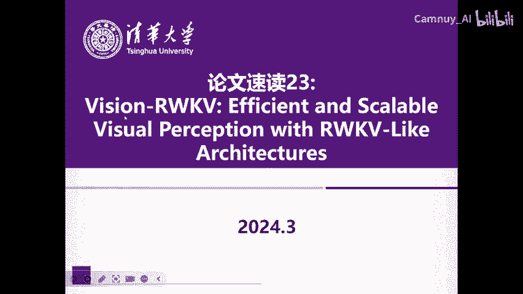
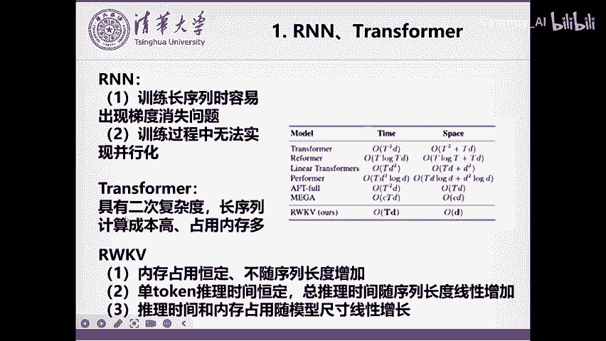
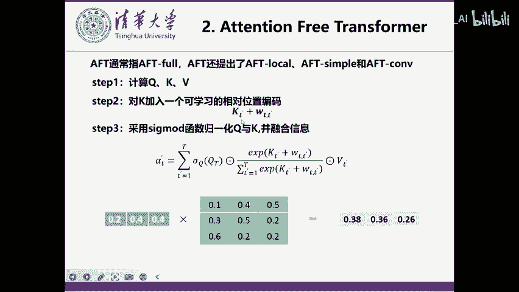
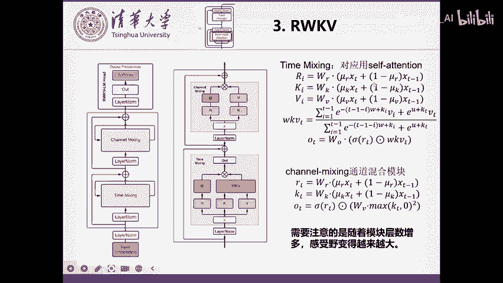
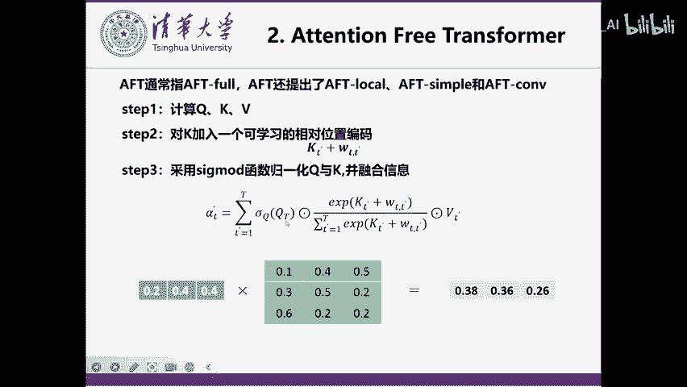
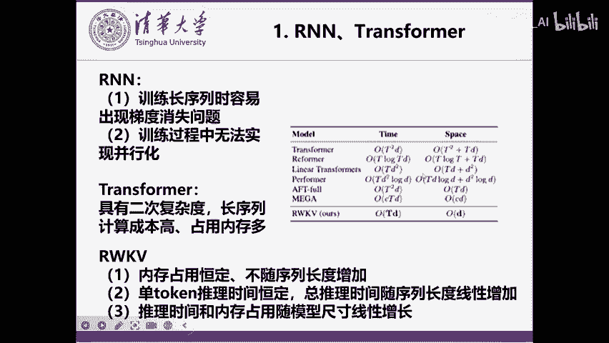
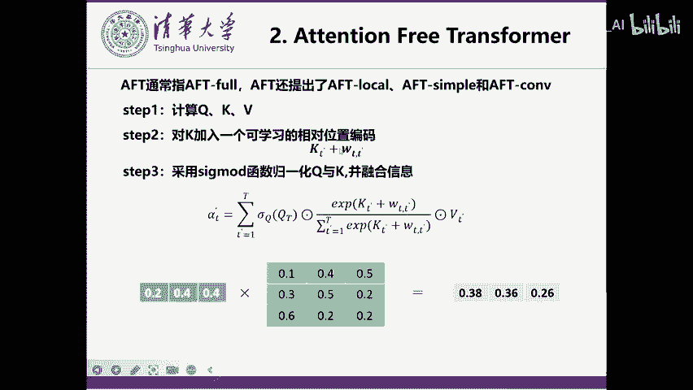
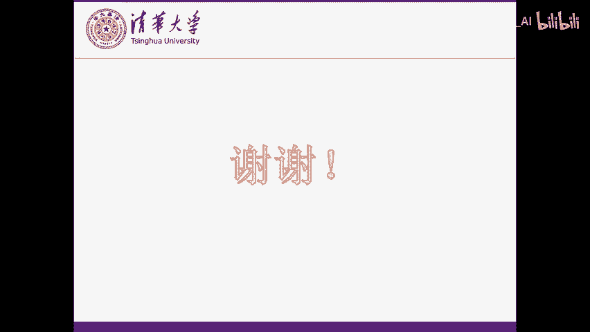

# 论文速读23： Vision-RWKV - P1 - Camnuy_AI - BV1FC411L7Lx

hello，大家好，今天给大家一篇文章叫做这个微人RWKV那也是一个在LNLP上问题首先提出的框架叫做RWKV在微视觉领域上的一个扩充。😊。

那我们首先来看一下这个RN和transform的呃出现的问题，这也是一个老生常谈的问题。那首先就是RN。第一个问题是在训练长序列时容易出现梯度消失的问题。因为在后面的这个taken的时候呃。

在要想梯度回传到很前慢的taken，那它这个路径会很长，就容易出现梯度消失这样的一个问题。然后第二是训练过程无法实现这样一个并行化。因为它需要每个taken，每个taken这样进行运算。😊。

然后transformer主要提出问题就是今年就是具有的二次复杂度，那长序列计算成本高，这样嫩存度。那，我们我们今天要要介绍这个RWKV的这样的一个框架，它主要的优点在于它的内存占用是恒定。

就不像transformer一样。你的taken越多，那你的占用内存越越高。呃，第二就是不随序列长度发生呃，这个内存占用恒定，不随序列长度增加。第二个就是单tken的推力时间恒定，就跟RN一样。

给单taken推力时间能达恒定。然后总推力时间随序列长度线性增加。第三就是推力时间和内存占用随模型尺寸线性增加。😊，就是说不像transformer一样，嗯。

它的推理时间和内存都跟这个整体的序列长度乘二次复杂度。

那我们就来看一下，首先来看一下，有一个叫做attention free transformer的这样的一个模型。那它本身就是一个线性的transformer的这样的一个结构。

然后呃它跟普通transer一样，首先是计算QKV。然后我们这里介绍的是介绍的是这个AFT for这样的一个结构。那AFT这样框架。

还有叫AFTloc AFT simpleimple和嗯AFT这样的一个结构。那我们介绍的是AFT for这个结构。然后我们的ARWKV呢也是基于AFT for这样的一个结构进行改进的。啊。

计算完QKV之后呢，它会对K加入一个可学习的相对位置编码。那个为什么相对位置编码？那就是这个T和T撇分别表示的是呃我们现在要融合的这个位置。然后T撇的话是我们要把那个位置的信息融合到T这个位置上。

那他们就会有一个根据它们之间的位置的差距，有一个相对的这样的一个位置编码。😊，这个嗯这里用到的位置编码是一个可学习的这样的一个位置编码。然后呢，之后我们采用sigma的函数规划QK以及并融合信息。

那这一步其实跟线性transformer基本上是一样的那就是对我们这个位置编码呢进行这样的一个s单独进行sma的操作。那Q这个函数这个向量单独进行这个sma的操作。如用单独对Q和K进行s的操作。

为什么要采用这样的方法呢？因为我们是要在attention呃在真是呃在传统transer里面呢，首先对Q和K进行相乘，然后再对sal的再用sma，然后来保证呢它每一行再融合的过程中啊。

它这个整个的值相加是等于一的就是这样会可以避免它的这个特征啊这个值如果过大的话，有可能出现这个梯度爆炸。那如果这个值过小的话，有可能出现梯度消失。单独的对对Q和Kq和K进行sma的操作的话。

就是相当于对Q来说话。😊，是这一行它的值加起来是一。那对K来说的话，这这一行加每一行加起来值都是一。那么在这样的情况下呢，它也可以保证乘出来的是每一行，这个整个和是一。那感兴趣的话可以自己去推导一下。

那线性 transformform码呢也是经呃很多线性 transform码都采用的单独对QK进行归一化，然后来保证最后乘出来的。😊，就算是这两个先相乘，那么它乘出来的相当于是attention的话。

也是能保证它的每一行的和都是一的。就是说其他位置的信息融合到这个位置的，它的这个整体的全值相加是等于一的。然后其实在线性transform里面，我们都知道它是会K和V先相乘。

然后来保证我们的这个复杂度有一个有一定的下降。😊，那这就本身呃这是完全的完整的1个AFT for的这样的一个计算流程，就跟基本的线象穿刺方法其实是一样的。只不过这里是会有一个相对位置编码。

是一个可学的相应位置编码的一个加入。😊。

那这就是下面这是我们的RWKV的这样的一个整体的结构。那它整体的结构呢跟我们的这个基本transformer也是一样的那一个transform一个这样一个类transform模块，它主要是有两部分组成。

第一部分就是time mixing。那本质上就跟我们的attention这样的一个小模块是差不多的那第二部分是channel mixing跟我们的这个一个fe forward的这样的一个模块基本上差不多的那我们首先先来介绍一下这个time mixing模块。

也就是呃最核心的就是相当于是attention的这样的一个模块，它是怎么计算的呢？😊，那么首先它计算的时候，这个R会会有一个RI的这样的一个向量。那这个本身的RI其实跟我们的Q有点类似。呃。

这个KV来计算的时候呢，都是也是像传统一样，面是有一个W那乘上这样一个特征。那这个特征呢跟我们的传统不一样。我们在传里面就是XT那这里呢它会把上一个时刻的这样一个特征啊。

哎跟像RN一样放到这样的一个这一时刻的这样的一个特征里面来进行一个小的这样的一个线性的线性的来全值为一的这样的一个整合。然后来分别得到这个KKV然后之后呢，我们的呃之后我们的这个信息融合呢。

跟我们的上面就基本上完全一致的那变化的呢基本上就只有我们的这个把Q会变成一个R，然后在在之后呢，在这个呃这个这个相当于是sma的这样一个操作过程中啊，这里。😊。

是会把前面的所有的这样，还是按照我们前面的这样的一个呃sma的操作，是用这个指数来乘上这样的一个乘数。然后再加上然后不同的一点是在于它的这个这里AFT采用的这个相对位置编码。

是对于每个T和TI它都是不一样的。TT和T撇是不一样的，都是完全学出来的。但在这里呢它其实只有一个参数，它叫做W。但然后同时呢对于我们的T和I时刻。

在这里就是我我们想把I时刻的这样的一个特征融合到T时刻里面。那它的这个相对位置编码呢，我们就把它定义成T减一减I倍的这样的一个W。那这样呢就相当于是说我们离T越近的这样的一个I。

比如说我们在I取T减一的时候，那这这一块就相当于是0。那么在这呃因为前面有一个负号嘛，然后这里有。

有定义上这个W是大于零的这样的一个情况。也就是说如果这个值越近的这个点离我们的想要融合的这个时刻T越近的话，那么这样的一个E的负这样倍数的W，那这个值就会越越大。如果离越远的话，那相当于这个值就会越大。

那整体这个负的值呢再乘以ep普on之后，那就会越小。就是说离得越远的话，那融合的信息的这个这样的一个权值就会越小。那它就是本质上就采用了这样的一个方法来呃来来这个体现我们的这样的一个离得越远。

它的权值越小的这样的一个情况。然后这个W本质上是一个学习的参数。😊，这样相当于参数量也是有一定的有一定的减少。然后呢，同时呢它是呃在呃本时刻的这样的一个时候呢，它是单独拎出来融合的。呃，不像前面一样。

它这个也是如果是对于自己时刻的话，也是一个T呃TT的这样本身是相当于是这样的一个位置编码。它也是完全放在这里面的。但它这个没有一样，没有像这样的一样。

也是用一个什么某个W倍的这样的一个不是而是用那个单一的U参数。这个U的参数跟W一样，也是一个可学习的这样的一个参量，然后相当于自己时刻的这样的一个特征融合，那也是用这样的一个全值来进行融合的。

那么本质上那下面的融合的时候，把前面所有的全值都拿出来，那么进行这样的一个规划。那么这样这个这个这个KWKV就相当于是我们最终融合出来的这样的一个。😊。

呃，变这样融合出来这样的一个信息。然后后面呢这里就是相当于做了一个相当于有一呃类似于遗忘门这样的一个操作。就像RN里面类似于遗忘门这样的一个操作，也就是是我们的R来实现的。类似于遗忘门。

然后也有也有也有本时刻的这样一个信息的。呃像Q一样的这样的一个。呃，信息融合。呃，这里其实更多的像是一个Q，就像就像是Q来做一个这样的一个跟本时刻的位置的这样的一个信息的加合。

然后后面的WN就跟我们的这样的一样，会进行一个线性线性的呃线性层。那后最终得到最终的这一时刻的这样的一个output，就经过我们time mix模块这样得到这样output。那本质上也是非很好理解。😊。

然后之后我们的之后我们再进行一个chnel mixing操作。这个chnel mixing操作本上其实呃就就基本上是一个呃线性层的这样的一个经过线性层。只不过它在呃全要是计算的时候啊。

也是会进行这样的和前意识刻这样的一个信息的融合，然后来得到RR和R和K。😊，然后再之后呢呃在这一边会进行一个max乘上一个maxKT，然后零这样的一个平方，这本质上就是跟像一个很很像一个软路呃。

但是软但是它把软路还会进行一个平方。然后之后呢，这边s格玛的RT呢按作者很说，就是这里就想达到一个像RN里面的一个遗忘门这样的一个呃遗忘遗忘门遗忘门这样的一个操作。

然后来实现我们最终的去除掉一些我们可能需要遗忘掉的这样的一个呃颤诺的特征，把它最终得到我们的最终的这样的一个输出的结果。这一时刻的结果。然后这里需要注意的一点啊，是因为我们在这里。

虽然我们在每一时刻里面这里用到的时候是一减缪R的XT减1。比如说。呃，我们time mixing的时候啊，呃我们会用到上一时刻的这样的一个ta。然后我们的channel mixing的时候呢。

也会用到用到的是我们上一时刻time mixing之后的这样的一个结果。😊，然后我们知道因因为我们上一时刻的这样一个time mixing这样的一个结果啊。

它以它的输入已经是融合在上一时刻的这样一个time mixing的输入的这样一个结果。也就是说我们这样channel mixing这样一个输入的本质上呢已经融合了这一时刻上一时刻以及在上一时刻的这样一个特征。

而我们这time mixing的呢，只是融合上一时刻channel mixing相当于再往前又融多融合的一个这样时刻。那我们知道在我们的这样的一个基本的trans模块候都是有多个这样的模块进行叠加的。

比是说后面还会多更多模块。也就是说在我们下这是第一个模块。那我们比如说在我们第二个模块时，第二个模块的time mixing相当于它输入的时候就能再得到我们 mixing输出的结果同时还会上一时刻的这样的一个channel mixing输出的这样一个结果会把它引入进来。

而上一时刻的 mixing结果。😊，我们知道就已经会融合呃上一时刻呃上一时刻上一时刻上一时刻的上一时刻以及上一时刻上一时刻上一时刻这样的一个结果。也就是说随着我们的深度增加呢。

我们的这样的一个感受也会逐渐变得越来越大。那么我们可能在最后最后一层的时候呢，也就已经能输入的相当于已经能融合前面很多层的这样的一个输入的结果。也就是说我们在呃进行这一时刻的这样一个迭代时候呢。

能能很快的这样的通过这一条线就可以得到前面很多时刻的这样的一个信息。就是说它的感受也变得很大。那整体的信息丢失的话，也会相对于RN来说会很小。因为RN它只有一条线。那这个RWKV呢。

它本质上有多条线的这样一个特征会从嗯会整个融合起来。😊，也就是说，相对RN来说更不容易出现梯度消失这样的一个情况。在我看来。然后呢，就是呃我们的RWKV呢。

它被称作这样的一个transformer时代的这样的一个RNN那也就是因为它。我们之前的推导都是基于transformer这样的一个形式啊，它为什么要采用这样的形式呢？

就是因为它可以转化为这个RN这样的一个形式，就是采用这样的一个形式。呃，它本质上有两个引变量是AT和BT它是AT和BT呢就可以采用RN的形式这样一个迭代的。然后它每一时刻的WKVT呢。

都可以采用呃我们的这个AT和BT进行这样的一个信息的融合信息的计算，直接计算来得到我们的这时刻的WKVT就说我们像现当于像RN1样来迭代更新AT和BT然后通过AT和BT来计算出来我们的WKVT也就相当于这样整体来说。

就是一个RN的形式。😊，然后下面这两张图呢来看了来这个直观的来看了一下我们的RWKV的这个网络的这样的一个呃。它的信息到底是怎样传递的那这里呢每条线呢它是一个layer，就是说 layer有12层。

也就是说我们一共迭代了12个这样的呃RWKV的基本模块，有12层。那我们也可可以看到啊就是呃黑色线的是lay越小的。也就是说呃黄色线是 layer越高层的那这能说明什么呢？就是说呃在层数较少的时候。

我们可以看到这个time decay就是这样的一个衰减。呃，time decayK在呃 layer很小的时候，它衰减的很快。😊，呃，这是一，这是零，它很快在很小的channel的时候。

它就很快衰减下来了。而我们的黄色的，它它很很远的时候，它都会衰减下来。也就是说呢我们的最底层就是越下面的层它获取到的信息更多的是他自己这一时刻以及周围几个时刻的这样的一个信息。呃，信息会记忆的更多。

而到我们的越高层的时候呢，前面时刻的这样的一个信息的衰减，它会越小。那这也跟我们。😊，哎有前面的说得到的，因为我们的更高层呢，它感受也越大。因此他能对前面的信息能更好的这样进行的一个融合以及记忆。

那也能就能进行更多的处理。而我们较低层呢，因为我们的这个本身感受也比较小。因此前面的信息进行一个底K的话也是呃。😊，也是比较比较合适的。因为我们的本身在这这一层呢，它的输入呃。

除了从前面的这个AT和BT得到之外，它本身直接的这样的一个输入是比较少的。因此我们的这样的一个我们会更容更更更加去关注我们自己本身周围的这几个块的信息，而不会记更前面的这样的一个时刻的信息。

然后这里是一个对于这个这个句子的那个待遇，对于不同呃对于不同层的看来看，它对于这个呃theal法 tower is located in这句话是怎么着进行一个呃注意力的呃以信息的这样的一个接收的。

就说我们也可以发现就是对于呃前面几个层，呢它可能就只关注到了al法的这样的。法阿法因为它是一个在这个句子里面，它是一个非常重要的一个名词。因此它在前面在呃RWKV在处理这个句子的时候。

在前面的层呢说就会关注到这个阿尔法可能后面就会用到它是一个很重要的句子。因此在前面的时候呢，它就会关注度对于这个句子关注度很高。但是我们可以发现它对于周围的这样的一个融合其实比较少。

就是说对于在这个本身的自己的位置的时候会关注到这个阿尔法这个句子很重要。因此它的这个关注度很高。然后我们发现到层数越多的时候呢，就对于周围的这样的句子就关注度多起来了。啊，就比如这一层就关度很高。

对于周围这些整个会把周后面的句子进行一个融合，然后来融合到最终的结果。然后后面的层数都会关注到这些的结果。然后最终已经融合完毕了之后，然后就会会最终得到我们的is这样的一个答案。😊，好。

之后我们就来看一下微onRWKV是怎么做的。如何把这个RWKV来。呃，扩展到这样的一个视觉的这样的一个任务上。那它其实本质上跟我们的之天讲的renet以及到RMT本质上是有一些类似之处的。呃。

类似之处主要是在于它的第一点优化。它主要有两点优化。我们从这张图中也可以看到第一个优化是WKV也就是双向的这样的一个呃细息的融合。因为说我们在NLP的时候，我们一个词可能只关注前面的词就可以。

但是我们在图像处理的时候，我们每一个像素点都要关既要关注它前面的像素点也要关注到后面的像素点，因此采用这样的一个双向的这样的一个WKV是不可或缺的。那它这里采用的方法。

其实本质上是跟我们的RMT对于renet改进是一样的。比如说它对于呃不只是对于前半时刻的呃到T减一了，而是到I等于0到大T减一，就是所有的这样的一个呃像素点都会都进行这样的一个特征融合。

然后在进行融合的时候。😊，在进行计算的时候呢，这就是加了绝对值呃，而不是用T减I。因为呃前面的这个tken和后面这个tken本质上离它的距离是一样的啊，就让它衰减度也是完全是一样的。

然后基本上其他地方都是不变，只只是把这样加了一个绝对值，然后并且扩充到了全部的像素上。那我那其实本质上就发现一个问题，那这个东西能不能变成RN形式呢？我们最重要的是要有这个RN那样形式呢。

那其实我们的RMT这篇文章他在做的时候并没有保证它能像re一样进行呃这样的一个呃。像类RN的操作，继续把它变变式，让它变成一个类RN的操作。呃，它只是把呃变成这样的一个式子之后。

就继续在这样的一个式子上进行了类 transformform操作。它只把它变成了一个新的注意力的机制。那它这里其实我们呃这篇文章也可以看到，它其实。变成这样的一个操作之后。

还是可以变成这样的一个RN形式的。只不过呢我们之前的变成RN形式啊，它需要AT和BT2个变量就可以。但是这里呢我们就需要把它变成AT减ATBTCT和DT4个变量。

那么我们的WKV是要变成4个向量这样的一个计算结果。那我们来看一下这个AT减一呢呃本质上它会要变成一个这样的新的式子，它会是变成呃对前面的。😊，它还是主要处理前面的所有的向量。那他在做的时候呢。

也就是跟前面基本上一样。只不过前对前面向量来说，它还要加加一个绝对值这样的一个操作。😊，那我们需要我们要变成RN的形式，那我们就需要从RT能从RT减一推断出来RT来用简单计算就能推断出来RTAT嗯，对。

从AT减1简要的推断出来AT那怎么来计算呢？其实我们来看看下式子，同明同学就很简单可以发现啊，那我们想从AT减一推推断到AT呢。那么首先呢我们需要先。

把这一项把整个的AT减一呢先乘上一个E的负呃E的负T乘W。呃，EE的T分之1W因因为我们相当于呃两个taken来说，我们相当于要计算下一个taken了。

那相当于前面所有的taken呢离它的距离就又远又远了一个E的T分之W。哦，这里我有一点忘记提了，那，他在除了呃在前面加个绝对值之外，还还会对整体再除一个T啊，就得出一个T。

这也是呃本身的RWKV是没有的。但这样其实本质上我感觉其实是不影响这样的一个操作。因为说如果T分T分之1也可以学习到W分W中啊，所以我感觉本质上这里的改进，其实是呃并没有什么E并不是很大啊。

然后这里我们相当于成了一个E的T分之1W之后呢，相当于我们还需要再加上我们呃这一时刻的这样的一个特征。对于下一时刻这样的一个特征结果，就说只要再加上呃E的。😊，呃，在这时刻T减1时刻的时候呢。

我们会发现啊，这也就是相当于是0。😊，这际上是0呃，其当于只需要再加上一个E的。KI呃这时刻的VI的到这时刻到AT里面就可以。然后就我在这样的情况下，我们也是可以。🎼呃。

相当于以1个RN的形式来更新我们的ATBTCT和DT的。然后最终采用呃得到结果来计算得到WKVT就说我们依然可以在这样的情况下，依然可以实现我们这样的1个RN形式的WRWKV在视觉上。好。

第二步的这样更新呢，其实就是对我们的Q shift进行一更新。呃，这个主要完成的解决是一个什么问题呢？就是我们的RLKV。我们知道它会在XT的时候啊，它会把前意时刻的这样的一个特征给引入进来。😊。

但是我们对于图像来说，其实它并不虽然。呃，微人RWKV啊大在处理的时候啊，也是会把图像变成一个序列。😊，这样的一个taken进行计算。但是呢呃作者又认又认为他这个在融合的时候啊。

因为我们的图像它是四个方向，其实都相当于是它的近邻，而不只是前半是它相当它的近邻。所以它在融合的时候呢，并没有只对前半这样的一个呃进行融合。而是他在对于。😊，向下左右四个方向的特征都进行了一个融合。

就是说这里是我们相当于是对向下组合融合结果。而在融合的过程中啊，相当于你看这里是H减一，就是说我们对于呃这这个点相当于是这个Ht，也就是说对于我们现在要融合的这个点的上面一个点把上面一个点的这样特征啊。

拿出来4分之chnel这么多大小呃，对于它下面的点也拿出来4分之channel这么一个大小，就在左边点也拿出来4分之chnel大小，右边点也拿出来4分之channel这么一个大小。

然后把这四个点呢最终四个特征融合成一个特征，就是我们的呃本质的本身的特征的维度。然后相当于对于这一时刻特征呢，在加的时候并不只加了呃在这算过程中变化成了pixel的。😊，嗯。

Pacel一个维度的这样的一个top单一维度的这样的一个talk，而是对于上下左右四个呃维度的特征都进行了这样的一个融合，然后来相当于来。😊，解决我们的呃图像中四个维度都有相邻点的这样一个问题。

但是其实我本质上感觉他还没有解决到一个问题，就是呃它在计算的时候呢，还是像我们会像我们的这样的经典的呃比如说me的变种，包包括各种各样的变种采用的方法都是会对于图像呃先分成patch。

比如说比如说我们有一个49乘49图像他们一般就会以7乘7作为一个patch。然后最终呢把这个图像分割成分割成一个呃大的每个7乘大的，一共有7乘7个patch，比如说有49个patch。

然后每个 patchch是7乘7这样的一个图像对，然后相当于把这个49个 patchch呢，把它变成一个序列，然后相当在这个序列上进行这样的一个整体的IWKV的操作。然后但是其实本质上它在计算的时候呢。

会。😊，就会呃虽然在这里会融合上下左右这样的一个信息，但是其实在那个呃本质的RWKV计算的时候，就不存在我们的二维维度的信息了。所以这其实也是后续可以改进的一个点。😊，在我看来。好。

那我们这篇文章讲解就到这里了，感谢大家收看。😊。

