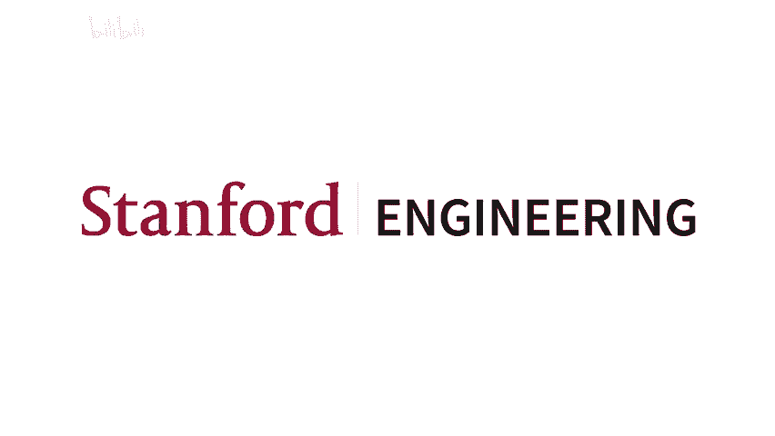
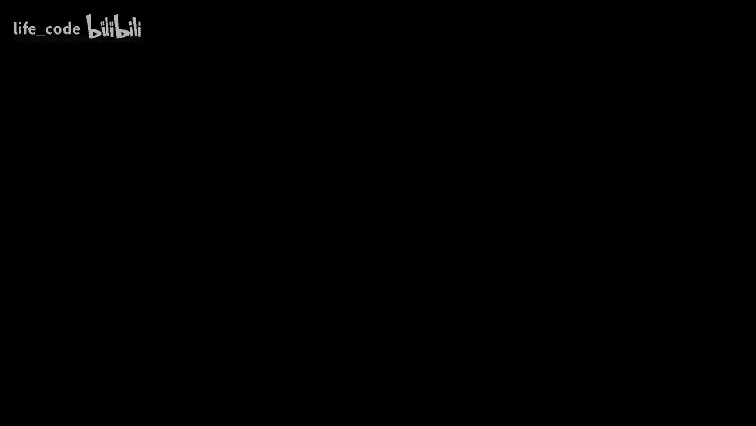
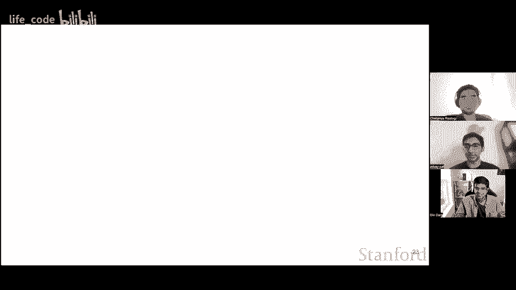
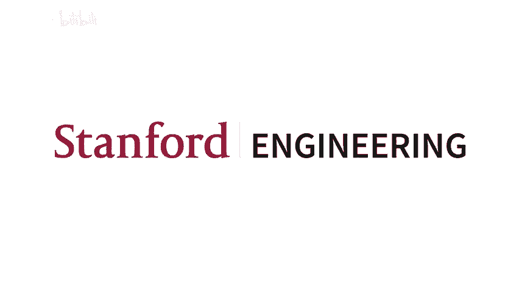

# P1：1. 改变 NLP、CV、RL 的 DL 模型 - life_code - BV1X84y1Q7wV

大家好，欢迎来到 CS25《变压器联合》的第一节入门讲座。CS25 是我们三个人在 2021 年秋季于斯坦福大学创办并教授的一门课程，课程内容并不是如图片所示的那样关于可以变形为汽车的机器人，而是关于深度学习模型，特别是一种已经在多个领域引发革命的深度学习模型，涉及自然语言处理、计算机视觉和强化学习等多个方面。我们为大家准备了一系列激动人心的视频，并邀请了一些真正杰出的讲者，分享他们如何在自己的研究中应用变压器模型。

我们希望您能享受并从这些讲座中学习，这段视频纯粹是介绍性讲座，谈论一下变压器。在开始之前，我想介绍一下讲师，所以我叫 A，是一家名为 Applied Intuition 的公司的软件工程师。在此之前，我是在斯坦福大学的硕士生。

嗨，大家好。我是 CS 25 的共同讲师之一，Chaanya Dave。如果你们两个可以介绍一下自己就好了。大家好，我是一个博士生，在 exampleford 学习，在此之前我在这里攻读硕士学位，研究很多生成建模、强化学习和机器人，所以很高兴见到大家。是的，那是 Dave。他的名字是 Chaanya，如果你想介绍一下自己的话。是的，大家好，我的名字是 Chaanya，目前我在一家名为 BoWorks 的创业公司担任机器学习工程师。在此之前，我在斯坦福大学攻读硕士，专注于自然语言处理，并且是获得 Alexa 奖挑战赛的斯坦福获奖团队的一员。

好的，太棒了。那么，接下来我们要谈论这个讲座的其他内容。我们希望你在观看这些视频时能够学到的，以及我们希望在 2021 年秋季参加我们课程的人学到的有三件事，第一件是我们希望你能理解变压器的工作原理。

其次，我们希望您能够学习，并在这些讲座结束时理解变压器如何在自然语言处理之外被应用。第三，我们希望这些讲座中的一些内容能够激发您心中的新想法，并希望能够引导您走向新的研究方向。

新型创新以及类似的事物。首先，我们将稍微谈谈变压器，并介绍一些与变压器相关的背景。因此，我想把话题交给戴夫。嗯，大家好，欢迎参加我们的变压器研讨会。我将首先概述注意力时间线，以及它是如何成为变压器的关键理念的。变压器的关键思想是 2017 年开发的子注意力机制，这一切始于一篇名为“注意力即你所需”的论文。在 2017 年之前，我们经历了一个史前时代，当时使用较旧的模型，比如 RNN、LSTM 和更简单的注意力机制。最终，变压器的增长扩展到了其他领域，并在整个机器学习中变得非常重要。我将展示它是如何被使用的。在史前时代，曾经有 RNL。

有不同的模型，比如序列序列 LSTM，它们在编码某种记忆方面表现不错，但在编码长序列时效果不佳，并且在编码上下文方面也非常差。因此这里有一个例子，如果你有一个句子，比如“我在法国长大……所以我说流利的”，那么你想根据上下文填入一些像法语的内容，但像 LSTM 模型可能不知道这是什么，可能会在这里犯一个很大的错误。同样，我们可以在这里展示某种相关性图谱，如果你有一个代词像“它”，我们想要将其与之前看到的某个名词相关联，比如一个动物，但同样，旧模型在这种上下文编码上真的很差。

目前我们正处于起飞的边缘，我们开始意识到变压器在不同领域的潜力。我们已经开始使用它们来解决蛋白质折叠中的长序列问题，比如来自 DeepMind 的 AlphaFold 模型，在不同挑战中的准确率达到 95%。我们可以将其用于文本和图像的少量短期无中心化应用，我们还可以用它进行内容生成。以下是来自 OpenAI 的一个例子，你可以给出不同的文本提示，让 AI 为你生成虚构的图像。

所以有一个辩论你也可以在 YouTube 上观看。它基本上说 LS 学生已经去世，变压器长存。那么未来如何使变压器能够启用更多的应用呢？它们可以应用于任何形式的序列建模，所以我们可以用它们来真正理解，金融领域以及更多的应用。所以，基本上想象一下各种遗传建模问题。

然而，还有许多缺失的成分，所以像人类大脑一样，我们需要某种外部记忆单元，这就是海马体。他们在这里提到了一些早期的工作，其中一项值得你关注的研究叫做神经治疗机器。类似地，目前的注意力机制在时间上非常复杂，这一点在规模上也同样明显，我们稍后会讨论这一点，我们希望使它们更线性。第三个问题是，我们希望将当前的语言模型与人类大脑的工作方式和人类价值观对齐，这也是一个重大问题。

好的，现在我将深入探讨紧张机制，并展示它们是如何产生的。最初，注意力机制非常简单，它的灵感来自于重要性评分的过程。在图像的不同部分上操作注意力，类似于人类在看到一张狗的图像时，可能会更多地关注前景，而不是背景。因此，在软注意力的情况下，你所做的是为每个像素学习简单的软注意力权重，这个权重可以在 0 到 1 之间变化。这里的问题是，这是一个非常昂贵的计算。正如左侧图中所示，我们正在为整个图像计算这个注意力，你可以选择的替代方法是……

点击一个零到一的注意力图，我们直接在狗的位置上标记一个一，而在背景上标记零，这样的方式竞争较少且成本低，但问题是它不具备防御性，并且让训练变得更加困难。往前看，我们还有不同种类的基本注意力机制，这些机制是在自我保留之前提出的，所以这里的第一种变体是全局注意力模型。在全局注意力模型中，对于每个隐藏层。

层输入甚至层输出，你学习一个注意力权重 A 与 P，这是与当前输出逐元素相乘，以计算最终输出 Y。类似地，你有局部注意力模型，在这些模型中，你不是计算整个序列长度上的全局注意力，而是仅在一个小窗口内计算注意力，然后将窗口的注意力加权到当前输出中，以获得所需的最终输出。

接下来，我将把时间交给 Chattanya，让他讨论细胞保留机制和课堂教学。谢谢您，博士，感谢您简要概述了早期注意力机制的工作原理，现在在我们谈论自注意力之前，有一个小趣闻，这个术语最早是在 Lial 的一篇论文中引入的，该论文提供了自注意力机制的框架，用于句子的处理。现在我们进入变换器论文的核心内容，即自注意力模块。自注意力是变换器模型运行良好的主要构建块，使其功能强大。为了更容易理解，我们可以将自注意力视为一个搜索和检索问题。问题是，给定一个查询队列，我们需要找到一组与队列 Q 最相似的键 K，并返回对应的值 V。

现在这三个向量可以从同一个来源绘制，例如，我们可以将 Q、k 和 V 都等于一个单一的向量 x，其中 x 可以是前一层的输出。变压器。这些向量是通过对 ws 应用不同的线性变换获得的，以使模型能够捕捉句子中不同位置不同符号之间的更复杂交互。现在注意力的计算只是查询向量和键向量之间相似度的加权求和，权重由这些键的各自值加权。

在变压器论文中，他们使用缩放点积作为查询和键的相似性函数。另一个变压器的重要方面是引入了多头自注意力。因此，多头自注意力的意思是每一层都有单元注意力。自注意力执行多次，这使得模型能够学习多个表示子空间。

所以，从某种意义上来说，你可以认为每个头都有能力关注不同的事物并学习不同的语义。例如，一个头可能在学习尝试预测那些标记的词性。另一个头可能在学习句子的句法结构，以及理解即将到来的句子的含义所需的所有内容。现在，为了更好地理解自注意力的工作原理以及不同的计算。

有一个简短的视频。あそう那。在这里，你可以看到有三个输入标记。输入一个到输入三，我们应用线性变换来获取每个输入的关键值向量，然后给出一个查询立方体。我们计算与各自关键向量的相似性，然后将这些分数与值向量相乘，最后将它们全部相加以获得输出。然后对所有标记执行相同的计算，因此你可以看到，自注意层的最终输出是深绿色的，位于屏幕的顶部。

所以现在再次针对最后一个标记，我们执行所有相同的查询乘以键。我们得到了相似度分数，然后这些相似度分数成为值向量。最后，我们执行教育，以获得变换器的销售关注输出。来。除了自我重塑，还有一些其他必要的成分使得变换器如此强大，一个重要的方面是位置表示或嵌入层的存在，因此这种处理信息的顺序方式非常有效，因为它们以顺序方式处理每个信息，因此这种排序的概念是正确的，这在理解语言时也非常重要，因为我们都知道，在大多数语言中，我们从左到右阅读任何文本，而在某些语言中则是从右到左，因此在某种自我重塑中，排序的概念是丢失的，因为每个词都在关注其他每个词，这就是为什么这篇论文引入了单独的嵌入层来引入位置表示。

第二个重要方面是具有非线性。因此，如果你考虑在细胞潜力层发生的所有竞争，它都是线性的，因为这都是度量的乘法。但是正如大家所知，深度学习模型在能够学习输入与输出之间更复杂的映射时表现良好，这可以通过一个简单的 MLP 实现。第三个重要组成部分是变换器的掩蔽。

因此，掩蔽是使操作能够被禁用的原因，因为在变换器的解码器部分，每个词可以关注其他所有词，而接下来要讨论的问题是，你不希望解码器查看未来的信息，因为这可能导致数据泄露，所以掩蔽有助于解码器避免未来信息的影响，只学习到目前为止模型所处理的内容。

现在我们来谈谈变压器的编码器 E 架构。是的，谢谢 Sasonia 提到自我保留。自我注意力是变压器能够如此有效工作的关键成分之一。但从高层次来看，2017 年 vwa etal 论文中提出的模型与之前的语言模型相似，因为它具有编码解码器架构。这意味着，假设你在处理翻译问题，你想将英语翻译成法语，那么它的工作方式是，你会读取整个英语句子的输入，你会对该输入进行编码，这就是网络的编码器部分，然后你会逐个生成对应的法语翻译，而解码器是负责生成这些标记的网络部分。

所以你可以把这些编码器块和解码器块看作是类似乐高的东西。它们由这些子组件组成，特别是编码器块有三个主要的子组件，第一个是自我保留层，之前的 Cheania 也提到过这一点。

之后你需要一个前馈层，因为自我保留层只执行线性操作，因此你需要一些能够捕捉非线性特征的东西。你在这之后还有一个层归一化，最后，不同编码器块之间有残差连接。

解码器与编码器非常相似，但有一个区别，就是它多了一层，因为解码器不仅对前一层的输出进行多头注意力处理。所以为了提供背景，编码器在编码块中的每个自注意力层都进行多头注意力处理。

在每个编码块中，它确实存在。多头注意力机制查看编码块的前几层。然而，解码器的工作方式是它同样查看解码器的前几层，但它也会查看编码器的输出，因此它需要在编码块上使用多头注意力层。最后，还有遮蔽机制，因为每个标记可以查看其他每个标记，你需要确保在解码器中不查看未来，所以如果你在位置三的情况下。

你不应该能同时查看第四个和第五个位置。W 持。因此，这些大致就是促成 Vaswani 等人论文中模型创建的所有组成部分。😊，让我们稍微谈谈这个模型的优缺点。所以两个主要优势，这些是巨大的优势，也正是变压器在许多领域取得巨大成功的原因。

深度学习的许多领域如下，第一个是序列中任意两个位置之间存在恒定的部分长度，因为每个**token**都在查看其他**token**，这基本上解决了我之前提到的长序列问题。在长序列中，如果你试图预测一个依赖于某个单词的**token**，你不会遇到这个问题。

这在很久以前的一个句子中，你现在没有失去上下文的问题，二者之间的距离在部分长度上仅为一。同时，由于正在发生的计算的性质，变换器模型非常适合并行化，并且由于我们在 GPU 方面取得的进展，基本上，如果你使用一个具有 n 个参数的变换器模型，和一个不是变换器的模型，比如一个 MSTM，同样也具有 n 个参数，那么训练变换器模型将会快得多，因为它利用了并行化的优势。

所以这些是优点，缺点基本上是自注意力需要二次时间，因为每个标记都要查看每个其他标记，或者说是 n 的平方，正如你所知，这不具备扩展性，实际上已经有很多工作在尝试解决这个问题。所以我们在这里链接了一些内容，**Big Bird**、**Leanformer**和**Reformer**都是试图使其线性或准线性的方法。

😊，我们强烈推荐查看 J Aammer 的博客《插图变压器》，它提供了很好的可视化，并详细解释了我们刚刚讨论的内容。是的，我想把话题交给 Chaanya，让她讲讲变压器的应用。好的，现在我们来谈谈一些最近的工作，以及在《变压器》论文之后不久进行的一些研究。

所以出现的模型之一是 GPT，GPT 架构是由 OpenAI 发布的，因此 OpenAI 在 GPT 系列中最新的模型是 GPT-3，它仅由变压器的解码器块组成，并且专注于我们传统的语言建模任务，即预测当前标记，即根据模型已看到的最后 T 个标记生成下一个标记。对于任何下游任务，现在模型可以仅在最后的隐藏状态上训练一个分类层，这可以拥有任意数量的标签，并且由于模型本质上是生成性的。

你还可以将预训练网络用于生成类型的任务，例如摘要和自然语言处理。对于这个例子。另一个使 GPT-3 受欢迎的重要方面是它能够进行上下文学习，作者称之为上下文学习，这是一种模型在少量示例设置下学习完成任务的能力，而无需进行大量输入。例如，假设模型展示了一堆加法示例，然后如果你输入一个新的内容并仅留一个等号，模型尝试预测下一个标记，这通常会是所示数字的和。另一个例子可以是拼写校正任务或翻译任务，这就是使 GPT-3 在自然语言处理领域备受关注的能力，目前也有许多应用使用了 GPT。

其中一个例子是 VS Code 中的 Copit，它试图根据某种自然语言文本生成一段代码。另一个基于 Transformers 架构的主要模型是 BT，BRT 这个名字来源于其全称“双向编码编码器变换器”(Bidirectional Encoder Representations from Transformers)。

它仅由变换器的编码器块组成，这与只包含解码器块的 GPT3 不同。现在，由于这一变化，出现了一个问题，因为 BRT 只有编码器块。它能够看到整段文本，但无法在刀语言现代任务上进行预训练，因为存在未来数据泄露的问题。因此，作者提出了一个聪明的想法，他们提出了一种新任务，称为**大规模语言建模**。

这包括用占位符替换某些鸟类，然后模型根据整个上下文尝试预测这些单词。现在，除了这个整体任务外，作者还添加了一个名为下一个句子预测的第二个目标。

这是一个句子级的任务，其中给定两段文本。模型试图预测第二句是否跟随第一句，或者是否不跟随第一句，而现在在预训练后，该模型可以用于任何下游任务。

这个模型可以在额外的分类层中进一步微调，就像在 GPP3 中一样。因此，这两个模型非常受欢迎，并且在许多应用中取得了很大成功。但自从我们上这门课以来，形势发生了很大变化，出现了不同技术的模型，比如 E deerta，还有一些在其他模态下表现良好的模型，我们将在其他讲座系列中讨论这些内容。所以，这就是本次讲座的全部内容，谢谢你的收看。

是的，我想最后感谢大家观看这个视频，我们有一系列令人兴奋的视频，邀请了真正了不起的演讲者，希望你们能从中获得价值。

，谢谢马克，谢谢你，谢谢大家。
