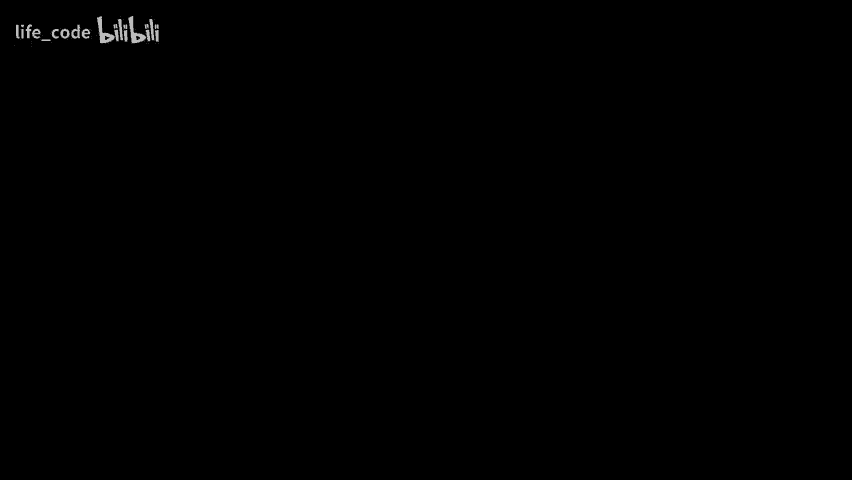

# P10：10. 在神经网络中表示部分-整体层次结构，Geoff Hinton - life_code - BV1X84y1Q7wV

在开始之前，我最近在斯坦福做了同样的演讲。我建议邀请我的人可以让我只做一次演讲，让两个观众一起参与，但他们更希望分开成两场演讲。所以如果你最近参加了这个演讲，我建议你现在离开，你不会学到任何新东西。

好的。嗯。我将结合一些关于神经网络的最新想法，尝试解释一个神经网络如何表示部分-整体层次结构，而不违反神经元工作的基本原则。我将通过一个假想系统来解释这些想法。我开始为一个系统写设计文档，最后我决定这个设计文档本身相当有趣。

所以这只是一种虚幻的东西，实际上并不存在，只有小部分不真实。但不知为何，我发现很容易在一个假想系统的背景下解释这些想法。所以，现在大多数学习神经网络的人都在做工程，他们并不在意这是否正是大脑的工作方式。他们并不是在试图理解大脑是如何运作的，而是在努力创造酷炫的技术。

因此，在一个残差网络中，100 层是可以的，卷积神经网络中的权重共享也是可以的。一些研究人员，特别是计算神经科学家，研究神经网络，试图理解大脑可能的工作方式。我认为我们仍然有很多东西可以向大脑学习。

我认为值得记住的是，在大约半个世纪的时间里，推动神经网络研究的唯一动力就是相信这些东西能够学习复杂的内容，因为大脑可以。所以，每个图像都有一个不同的通路树，这就是图像中孔和部分的结构。在一个真正的神经网络中，你不能动态分配。

你不能随便抓一堆神经元说，好吧，你现在代表这个。因为你没有随机的额外记忆，你不能随意设置神经元的权重。神经元的功能是由它的连接决定的，而这些连接变化缓慢。

至少变化大多是轻微的。嗯。所以问题是，如果你不能快速改变神经元的功能，如何表示一个动态的通路树？在符号人工智能中，这不是问题。你只需抓取一块内存，这通常就是其本质，说明这将代表通路中的一个节点，并给它指向其他节点的指针。其他内存块表示其他节点，因此没有问题。大约五年。

我曾尝试一种名为胶囊的理论。你可以说，由于不能动态分配神经元，因此你将提前分配它们，所以我们将把一组神经元分配到潜在节点中。

对于大多数图像，这些神经元组中的大多数将是静默的。少数会处于活动状态。而对于那些活跃的神经元，我们必须动态地将它们连接到一个树状结构中。因此，我们必须有一种方法来在这些神经元组之间进行连接。这就是胶囊理论。

我有一些非常有能力的人与我合作，他们实际上使这一切工作。但过程相当艰难。我的看法是，某些副想法想要发挥作用，而有些想法则不愿意工作，而胶囊理论则介于两者之间，比如反向传播这样的想法则想要工作，你尝试它们，它们就会有效，而我有些其他想法就是不愿意工作，胶囊理论则在两者之间，我们最终使它工作了。

但我现在有一个新的理论，可以看作是一种奇怪的胶囊模型，其中每个胶囊是通用的。也就是说，与其将胶囊专用于某种特定的事物，每个胶囊可以表示任何种类的事物。但是硬件仍然以胶囊的形式出现，这种胶囊有时也被称为嵌入。因此，我将谈论的虚拟系统称为 Gm。

在 Gam 中，硬件分配给列。每列包含对图像小补丁中发生的事情的多个层次的表示。因此，在一列中，你可能有一个较低层次的表示，表示这是一个鼻孔。接下来的层次可能表示这是一个鼻子，再往上层可能表示这是一个脸，顶层可能表示这是一个派对，这就是整个场景。

表示部分空心层次结构的想法是利用这些不同层次的嵌入之间的共识岛屿。因此，在场景层面，在顶层，你希望图像的每个补丁都有相同的嵌入，因为该补丁是同一场景的补丁。

在对象层面上，你希望属于该对象的所有不同补丁的嵌入都是相同的。因此，随着你向上移动这个层次结构，你试图让事物越来越相似。这就是你挤压冗余的方式。嵌入向量像指针一样起作用，嵌入向量是动态的。它们是神经激活而不是神经权重。

因此，为每个图像拥有不同的嵌入向量是可以的。这是一个小图示，如果你有一个一维的补丁行。这些是补丁的列。而且，你会有类似于神经网络前端的卷积。然后在前端之后，你生成最低级别的嵌入，以说明每个特定补丁中发生了什么，因此底层的黑色箭头都不同。当然，这些嵌入是成千上万维的。

也许在你大脑中有成千上万的这种情况。因此，二维向量并不准确。但至少我可以通过方向来表示两个向量是否相同。所以在最低层面，所有的补丁都会有不同的表示。但下一个层面，前两个补丁，它们可能是鼻孔的一部分，例如。嗯。是的。

它们会有相同的嵌入。但上面的下一个层面，前三个补丁可能是鼻子的部分。所以它们都会有相同的嵌入。注意，尽管图像中的内容非常不同，但在部分层面上，那三个红色向量都是意味着相同的。

我们正在做的是为表面上非常不同的事物获取相同的表示。😊我们通过给予不同事物相同的表示来寻找图像中的空间一致性。😊在物体层面上，你可能有一个鼻子和一个老鼠。它们是同一张脸，它们是同一张脸的一部分，因此所有这些向量都是相同的，而这个网络尚未稳定到产生看不见的层面。

所以一致性的岛屿捕捉到了过去的树。现在它们比过去的树更强大，它们可以捕捉像“闭嘴”这样的东西。你可以在一个层面上将“闭”与“嘴”看作不同的向量，但在更高层面上，“闭嘴”可以有完全相同的向量，即“闭嘴”的向量。

它们可以是断开的，所以你可以在这里做一些比上下文无关文法更强大的事情。但基本上，它是一个过去的真实。如果你是物理学家，你可以将每个层面视为一个冰淇淋模型。用实值向量而不是二进制自旋。你可以认为它们是层间的坐标变换。

这使得情况更加复杂，这是一种多层次的冰淇淋模型。但是各层之间有复杂的互动，因为，例如。在上面的红色箭头和黑色箭头之间。你需要在鼻子和脸之间进行坐标变换，但我们稍后会讨论这个。

如果你不是物理学家，那就忽略这些，因为这没有帮助。所以我想开始，特别是在自然语言课程中，对你们中的一些人来说，这尤其相关。通过试图证明坐标系统不仅仅是笛卡尔发明的。坐标系统早在很久以前就由大脑发明了。

我们在理解图像中的内容时使用坐标系统。我还想展示图像中过去树的心理现实。所以我将用一个我很久以前发明的任务来进行演示。事实上是在 1970 年代，当时我还是研究生。你需要完成这个任务才能充分受益于它。

所以我想让你想象在你面前的桌面上，有一个线框立方体。它处于立方体的标准朝向，静静地放在桌面上。从你的视角来看，有一个前下右角和一个后上左角。好了，开始吧。前下右角和其他四个角一样，都在桌面上。

而后上左角位于穿过立方体中心的对角线的另一端。好的，到目前为止一切顺利。现在我们要做的是旋转立方体，使得这个手指保持在桌面上，另一个手指垂直地指在它上方。😊，这个手指不应该移动。好的。现在我们把立方体放在一个朝向上，使得原本是对角线的东西现在是垂直的。

你要做的就是用底部的手指，因为它仍然在桌面上，指向立方体的其他角。所以我希望你实际去做，来吧，拿起你的底部手指。把你的顶部手指放在那条对角线的另一端，然后指向其他角在哪里。幸运的是，大多数你们，其他人可能看不到你做了什么，我可以看到你们中有些人没有指，这非常糟糕。

所以大多数人会指出其他四个角，最常见的反应是说它们在这里、这里、这里和这里，他们在那条轴的中间画出一个正方形的四个角。嗯。这是错误的。正如你所想象的那样，很容易看出这是错误的，因为如果你想象这个立方体，正常的朝向，并且数角，一共有八个角。而这两个角就是其中之一。

那么其他两个角去哪里了呢？有一种理论认为，当你旋转立方体时，离心力使它们飞入你的无意识，这并不是一个很好的理论。那么，发生的事情是，除非你是像结晶学家那样的人，否则你对其他角的去向毫无头绪。你可以想象立方体的某些部分，但你就是无法想象其他角的结构。

它们形成什么结构。这种人们常见的反应是四个角在一个正方形中。正在做一些非常奇怪的事情。试图说，好的，我不知道立方体的样子，但我对立方体有些了解。我知道角是成四个出现的，我知道立方体具有四重旋转对称性或两个平面的双侧对称性，但都是直角的。因此，人们在回应中保持了立方体的对称性。

他们给出了四个角在一个正方形中。现在，如果他们这样做，实际上他们指的是什么是两个金字塔。每个金字塔都有一个正方形底面，一个是倒过来的，它们底对底地粘在一起。所以你可以很容易地想象，一个正方形底面的金字塔下面再有一个。于是现在你的两个手指作为这两个金字塔的顶点。

有趣的是，你在做一些相当激进的事情的代价下，保留了立方体的对称性，那就是将面变成顶点，顶点变成面。你指出的事情是，如果你这样做，得到了一个八面体。它有八个面和六个顶点，而立方体有六个面和八个顶点。😊所以为了保留你所知道的立方体的对称性。

如果你这样做了，那真的很激进，改变了面与顶点之间的关系。嗯。我应该给你展示一下答案是什么样子的，所以我将后退一步，尝试得到足够的光，也许你可以看到这个立方体。所以这就是一个队列。你可以看到其他边。

前面的编码是 Zigza 环绕中间的样子。我有它的图片。这些有色杆是立方体的其他边，不接触你的指尖。你的顶部手指连接到这些翻转的三个顶点，而你的底部手指连接到最底部的三个顶点。

而立方体的样子是你对它完全没有想法的，这只是一个完全不同的立方体模型，它如此不同，我给它一个不同的名字，我称它为六面体。😊值得注意的是，六面体和立方体在概念上是完全不同的。

如果你把一个看作正方体，另一个看作立方体，你甚至不会知道它们是相同的。这就像倾斜的正方形和直立的菱形之间的模糊性，但更强大，因为你对它不熟悉。嗯。这就是我的演示，表明人们确实使用坐标系统，如果你用不同的坐标系统来描述事物。

在这里，我强迫你使用不同的坐标系统，使对角线竖直，并要求你相对于这个垂直轴进行描述。然后熟悉的事物变得完全陌生。😡当你相对于这个新框架看到它们时，它们就是完全不同的东西。注意，卷积神经网络没有那样的。

他们不能看着某样东西，却对同一事物有两个完全不同的内部表征。我还在向你展示你确实在解析，所以我把它涂成颜色，你将它传递给我所称的皇冠，它有三个向上倾斜的三角形翻转。这里有一个不同的政策。相同的绿色翻转向上倾斜并向外扩展，现在我们有一个向下倾斜并向外扩展的红色翻转。

我们有一个中央矩形，而你只有矩形的两个端点。如果你感知到这个，现在闭上眼睛问你，那里有没有平行边？

你非常清楚那两条蓝边是平行的。通常你不会意识到其他任何平行线，尽管你知道通过对称性，必然还有其他对。同样，对于皇冠，如果你看到皇冠，然后我让你闭上眼睛，问你平行线在哪里，你不会看到任何平行线。

这就是因为你为那些襟翼使用的坐标系统与边缘不对齐，只有当它们与所用坐标系统对齐时，你才会注意到平行线，所以在这里对于矩形，平行线与襟翼的坐标系统对齐，而它们并没有。

所以你意识到这两条蓝边是平行的。但你没有意识到一条绿色边和一条红色边是平行的。嗯。这不像内克尔立方体的模糊性，当它翻转时。你认为现实中的东西不同，事物处于不同的深度。

这就像下个周末我们应该去拜访亲戚。因此，如果你拿下个周末我们将拜访亲戚这句话，它可以意味着下个周末我们要做的就是拜访亲戚。或者它可以意味着下个周末我们将是拜访亲戚。

现在这些是完全不同的意义，它们恰好有相同的真值条件。在真值条件上它们意味着相同的东西，因为如果你正在拜访亲戚。你就是在拜访亲戚。正是这种模糊性。对世界上发生的事情没有分歧。

但是对句子的两种完全不同的看法。因此。这是在 1970 年代绘制的。这就是 1970 年代的人工智能。这是一种皇冠解释的结构描述。因此，你为层次结构中的各个部分设置了节点。我还在弧上标注了 RWx 是皇冠与襟翼之间的关系。

而这可以用矩阵表示，实际上是铬的内在参考框架与襟翼的内在参考框架之间的关系。😊，请注意。如果我改变我的视角，这一点完全没有改变。😡。所以这种关系将是放入神经网络权重中的好东西，因为你希望神经网络能够独立于视角识别形状。而 RWX 是关于这种形状的知识，它独立于视角。

这是锯齿形的解释。还有其他我添加的内容。在深蓝色框中的事物。它们是之间的关系。😡，指的是 aode 和观众。更明确地说，是皇冠的内在参考框架与观众的内在参考框架之间的坐标变换。你的眼球就是那个 R WV。这完全是另一种东西，因为当你改变视角时，那会改变。

实际上，当你改变视角时，所有蓝框中的事物都会以一致的方式一起变化。还有一个简单的关系，就是如果你取 RWV 并乘以 RWx。你会得到 Rx v。因此，你可以轻松地在结构描述中传播视角信息。这就是我认为的心理图像，而不是一堆像素。

这是一个结构描述，带有关联视点信息。嗯。这让许多心理图像的特性变得有意义。比如，如果你想用 RWX 进行任何推理，你会形成一个心理图像。也就是说，你填写了你选择的视点。我还想做一个演示来让你相信，在解决心理想象问题时你总是选择一个视点。

所以我将给你另一个非常简单的心理想象问题，冒着超时的风险。想象一下。你在一个特定的点上，向东走一英里，然后向北走一英里，然后再向东走一英里。你回到起点的方向是什么？这并不是一个很难的问题。它有点向南，并且相当向西，对吧？并不完全是西南。

但它有点向西南。现在，当你完成那个任务时。你从你的视点想象的是你向东走一英里，然后向北走一英里，再向东走一英里。我告诉你你没有想象的是什么，你没有想象你向东走一英里，然后向北走一英里，再向东走一英里。你本可以在北方不指向上方的情况下很好地解决这个问题，但你是以北为 A。

你也没有想象这个，你向东走一英里，然后向北走一英里，再向东走一英里。你没有想象这个，你向东走一英里，然后向北走一英里，等等。你在特定的比例、特定的方向和特定的位置进行了想象。😊。就是这样。你可以回答关于它大致有多大的问题等等。

所以这证明了，解决涉及使用事物之间关系的任务时。你会形成一个心理图像，好吗，这就是心理想象。因此，我现在将给你一个非常简短的对比学习介绍。这在演讲中是一个完全的断裂，但我会很快把它们重新结合起来。所以。

与自我智慧学习相对，我们所尝试做的是让图像的两个不同裁剪部分具有相同的表示。嗯。很久以前，Becker 和 Hinton 有一篇论文，我们用这个方法来发现图像中的低级一致性，比如表面的连续性。我。表面的深度。自那以后，这一方法得到了很大的改进，并已被用于分类等任务。

也就是说，你取一幅图像，其中有一个突出的物体。然后你说。如果我裁剪出包含该物体任何部分的图像，这个裁剪部分的表示应该与包含该物体部分的其他裁剪部分相同。而且。这个方法在过去几年中得到了很大的发展。

我将谈论我在多伦多的团队几年前开发的一个模型，叫做 Sinclair，但还有很多其他模型，自那时起情况也有所改善。因此，在 Simclair 中，你取一幅图像 X。你取两个不同的裁剪，同时还对裁剪进行颜色失真。

每个裁剪的不同颜色扭曲。这是为了防止它使用颜色直方图来判断它们是相同的。所以你在颜色上做一些调整，以便它无法使用颜色。这是一个简单的方法。然后你得到 Xi tilde 和 Xj tilde。接着你将它们放入相同的神经网络 F 中。然后你得到一个表示 H。然后你将你的表示 H 放入另一个神经网络中。

这会稍微压缩它。它变为低维度。这是一个额外的复杂性，我不打算解释，但它让它运行得更好。你可以在不这样做的情况下进行，并得到两个嵌入 Z 和 Zj。你的目标是最大化这些向量之间的共识。

所以你开始这样做，你说，好吧，让我们从随机神经网络开始。在神经网络中使用随机权重，然后我们取两个图像块，将它们通过这些变换，并尝试使 ZI 与 ZJ 相同，因此我们对 I 和 J 的组件之间的平方差进行反向传播。

嘿，奇迹发生了，你发现当一切崩溃时。对于每个图像，它总会产生相同的 ZI 和 Zj。然后你意识到，这不是我所说的共识，我的意思是它们应该是相同的。当你获得两个相同图像的裁剪时，它们是相同的，而当你获得两个不同图像的裁剪时，它们是不同的。

否则，没有真正的共识，对吗？嗯。所以你必须有负例。你必须展示来自不同图像的裁剪，并说它们应该是不同的。如果它们已经不同，你就不需要让它们变得更不同。让事物变得非常不同是很容易的，但这不是你想要的，你只想确保来自不同图像的裁剪不会被视为来自同一图像。

所以如果它们恰好非常相似，你就将它们分开。这阻止了你的表示崩溃，这称为对比学习。效果很好。因此，你可以通过尝试最大化来自同一图像的两个图像块之间的表示的共识来进行无监督学习。

在你完成后，你只需获取图像块的表示。然后将其输入线性分类器，一堆权重，以便你将表示乘以权重矩阵。通过 softmax 获得类别标签。然后你通过梯度下降来训练它。你发现，这与在标签数据上训练几乎是一样好的。

现在你训练的唯一标签数据是最后一个线性分类器。之前的层是在无标签数据上训练的。你已经成功地训练了你的表示，而无需标签。现在这有一个问题。它工作得很好。

但这确实令人困惑的是对象和整个场景。所以说同一场景的两个不同片段应该在接缝处得到相同的**向量标签**是有道理的，因为它们来自同一场景。但如果其中一个片段包含对象 A 和 B 的一部分，而另一个片段包含对象 A 和 C 的一部分呢？

你并不希望这两个片段在对象层面有相同的表示。因此，我们必须区分这些不同的表示层级。对于对比学习来说，如果不使用任何形式的**门控**或注意力机制，那么所发生的事情实际上是在接缝层面进行学习。我们希望的是，在对象层面获得的表示应该是相同的。

如果两个片段都是来自 JA 的片段，但如果一个来自 JA 而另一个来自 JB，它们应该是不同的。为此，我们需要某种形式的注意力来决定它们是否真的来自同一事物。因此，Glom 的设计旨在进行对比学习，并引入变换器中获得的注意力，以避免在不相同的情况下声称它们是相同的。

我应该提到此时大多数人对 Bert 是熟悉的。你可以将输入 Bert 的单词片段看作是我在这里使用的图像片段。在 Bt 中，你会看到同一单词片段的整个表示列。在书中，随着层级的提升，你会获得更语义丰富的表示。

但在 Burt 中，并没有尝试获得像整个短语这样的更大事物的表示。嗯。我将要讨论的这个方法是修改 Bch 的方法，随着层级的提升，你将获得越来越大的**一致性岛屿**。所以例如，经过几个层级后，像“New”和“York”这样的事物将会有不同的约克片段。

我想如果在正确的 G 中处理，它将有两个不同的片段，确切地会有相同的表示。而当你深入到另一个层级时，新的或新闻的片段可能本身就很薄。但约克的片段将会有完全相同的表示。那将是一个**一致性的岛屿**，代表一个复合事物，而随着层级的提升，你将得到这些代表越来越大事物的一致性岛屿，这将是一种更有用的表示，因为它不是通过取每个部分的最大值等方式来处理表示单词片段。

这真是一件疯狂的事情，因为你在学习过程中显式地形成更大部分和整体层级的表示。好吧。所以在 Glom 中，我们追求的是一种特定的空间一致性，这种一致性比由于表面倾向于在相邻图像片段中处于相同深度和方向而引起的空间一致性要复杂得多。

我们追求空间一致性。U 这意味着如果你在图像中找到一个嘴巴，并且在图像中找到一个鼻子，然后找到构成面孔的正确空间关系，那么这就是一种特定的一致性。我们希望以无监督的方式去追求这一点。😊

我们想要在图像中发现那种一致性。在深入探讨 Alom 之前，我想先声明一下。啱。多年来，计算机视觉将视觉视为一个静态图像，具有统一的分辨率，并试图判断其中包含什么。这并不是现实世界中视觉的运作方式。在现实世界中，这实际上是一个循环，你决定要看哪里。如果你是一个人或一个机器人。

你最好聪明地去做。这给你提供了对象数组的样本。它将对象数组和入射光转化为视网膜图像，而在你的视网膜上，中间是高分辨率，边缘是低分辨率。因此，你专注于特定细节，而你从未。

你永远不会以统一的分辨率处理整个图像。你总是专注于某个东西，并在高分辨率下处理你所注视的部分，而其他所有部分则以更低的分辨率处理，特别是在边缘。因此，我将忽略你如何决定看哪里以及你如何将从不同扩展中获得的信息整合在一起的复杂性，简单地说，我们只讨论对新图像的第一次注视，所以你看向某处，现在第一次注视发生了什么。

我们知道大脑中的相同硬件将在下一个注视中被重复使用，但我们先只考虑第一次注视。因此，最后，这是一张架构的图。😊这是单个位置的架构，就像 Bt 中的一个单词片段。它展示了多个帧的发生情况，因此 Gom 确实是为视频设计的。

但我只讨论将其应用于静态图像。那么你应该把静态图像视为一个非常无聊的视频，其中每一帧都是相同的。因此，我展示了层次结构中的三个相邻级别。我正在展示时间上的变化。因此，如果你看中间级别，或许那是主要部分级别。

看看那个标记为级别 L 的框。那是在第四帧。所以右侧的级别 L 框。让我们问一下那个框的状态，那个嵌入的状态是如何确定的。因此，在框内，我们将获得一个嵌入。嗯。这个嵌入将代表图像中那个小补丁的主要部分级别发生的情况。在这个图示中的级别 L，所有这些嵌入将始终用于同一视网膜图像的补丁。

好吧。右侧的 L 级嵌入。你可以看到有三件事情在决定它。有绿色箭头。对于静态图像，绿色箭头相当无聊。它只是表示你应该与 L 级别的前一个状态相似。所以它只是进行时间整合。第一。😊，蓝色箭头实际上是一个具有几个隐藏层的神经网络。

我在这里只展示嵌入，而不是神经网络的所有层。我们需要几个隐藏层来完成所需的坐标变换。蓝色箭头基本上是从前一个时间步的下一级别获取信息。所以在第三帧的 L-1 级别可能表示我可能是一个鼻孔。好吧。

如果你认为你可能是一个鼻孔，那么在上一级别你预测的是鼻子。更重要的是，如果你有鼻孔的坐标框架，你可以预测鼻子的坐标框架。也许不是完全准确，但你对鼻子的方向、位置和尺度有相当好的概念。所以那个自下而上的神经网络。😡，是。一个可以在任意层级接收部分的网络，它可以接收鼻孔。

但它也可以接收方向盘并预测方向盘的汽车。并预测你在下一级别的情况。😡，红色箭头是一个自上而下的网络。所以。红色箭头。是从整个面部预测鼻子。同样，它有几个隐藏层用于坐标变换。

因为如果你知道面部的坐标框架，并且知道面部与鼻子之间的关系，而这将包含在自上而下的网络权重中。那么你就可以预测它是鼻子以及鼻子的姿态。这一切都会在那个嵌入中的活动中体现。好吧。现在，所有这些都是在一个硬件列中发生的，都是关于图像特定区域的。

所以这与 Bt 中的一个词片段的情况非常相似，你有所有这些表示层。嗯。确切来说，这与 Bt 的比率有点令人困惑，我会在最后给你一个长档案论文的参考，里面有一整节讲述它与 Bt 的关系。

但这很令人困惑，因为这涉及到时间步。这使得事情变得有点复杂，好吧。所以这有三个决定水平和嵌入的因素，但还有第四个因素。就是底部的黑色部分。这是不同位置相互作用的唯一方式。这是变压器的一个非常简化的形式。如果你把变压器视为 Bt，然后你说。

让我们让嵌入、键、查询和值彼此相同。我们只有这个向量。所以现在你要做的就是使一列中的 L 级嵌入与附近列中的 L 级嵌入相同。但这会受到限制，你只会试图使它们相同。如果。它们已经相当相似。

所以这就是注意力如何工作的。你取位置 X 中的级别 L 嵌入，也就是 Alex。你取附近位置 Y 中的级别嵌入，也就是或 Y。你进行点积。你进行指数运算。然后你进行归一化，换句话说，你做一个 softmax。这给了你权重来使用。😡，在。你想让 LX 与 LY 相同的愿望中。

所以由此产生的输入。来自邻居的，是附近列的级别嵌入的注意力加权平均？

额外的输入试图让你与周围的事物达成一致，这就是导致你获得这些共识岛屿的原因。所以回到这个图。我想。是的。这是我们想看到的。😡，而原因是。我们在对象层面获得那么大的共识岛屿，是因为我们在努力达成共识，我们在尝试学习坐标变换。

从红色箭头到上层，从绿色箭头到上层。这样我们就能达成共识。好的。现在，我们需要担心的一件事是，感知中的困难之处。嗯。在语言中没那么糟糕。可能比视觉感知更糟，很多模糊性。

如果我在看一幅线条画，例如，我看到一个圆。那么这个圆可能是脸的右眼，也可能是脸的左眼，或者它可能是汽车的前轮或后轮，这个圆可以有各种可能。

我们希望消除圆圈的歧义。这里有一系列的工作，使用诸如马尔可夫随机场的东西，这里我们需要一个变分马尔可夫随机场。我称之为变换随机场。因为例如，某个可能是眼睛的东西和某个可能是嘴巴的东西之间的互动。

需要通过角点变换来限制。你知道，让我们把鼻子放在嘴巴上，因为那是我的标准。如果你拿一个可能是鼻子的东西，你想问。有谁支持 IR 鼻子？好吧，你想做的就是向附近的所有东西发送一条信息。

😡，嗯，你是否拥有正确的姿势和身份来支持“我知道”的想法？

所以你想，例如，从鼻子发出信息。你会向所有附近的位置发送信息，询问是否有嘴巴的姿势符合我通过鼻子的姿势乘以鼻子与嘴巴之间的坐标变换所预测的姿势，现在我可以预测嘴巴的姿势，是否有谁认为他们可能是嘴巴？

我认为你可以看到，你将不得不发送很多不同的信息。😊。对于可能支持你的每一种其他事物，你将发送不同的信息。因此，你将需要一个多头变换器，它将进行这些坐标变换，你必须在返回时进行逆变换，因为如果鼠标支持你，它需要支持的是鼻子，而不是嘴巴的姿势。

但要有适当的姿势。因此，这将变得非常复杂。你将有 n 平方的交互，都是带有坐标变换的。有另一种做法，更简单，被称为半变换。😊。至少如果你有办法表示模糊性，那就简单得多。

所以，代替这些部分之间的直接交互，比如鼻子和嘴巴。你要做的是让每个部分预测整体。因此，鼻子可以预测脸，并且它可以预测脸的姿势，而嘴巴也可以预测脸。😊，现在这些将位于 G 的不同列中。

但在 G 的一列中，你会有一个鼻子在预测脸。在附近的一列中，你会有一个嘴巴在预测脸。如果这真的是一张脸，这两张脸应该是相同的。因此，当你对附近的事物进行注意力加权平均时，你所做的是获取确认。那就是支持你假设的证据。

我的意思是，假设在一列中提出假设，这是一个具有这种姿势的脸。这个假设得到了来自附近列的支持，这些列从不同的数据中推导出完全相同的嵌入，一个是从鼻子推导的，另一个是从嘴巴推导的。这不需要任何动态路由。因为这些嵌入始终参考的是图像中同一小补丁上发生的事情。

在一列中没有路由。在列与列之间，有些类似路由的东西，但这仅仅是标准变换器类型的注意力。你只是试图与相似的事物达成一致。好的，这就是 Gs 的工作方式。大问题是。😡，如果我看到一个圆圈，它可能是左眼，也可能是右眼。

它可能是汽车的车轮，也可能是汽车的电池，因为我对特定层上特定补丁的嵌入必须能够表示任何东西。当我遇到模糊的事物时，我必须处理它可能属于的所有整体可能性，因此，代替在部分层面上尝试解决模糊性，我可以跳到更高级别，并通过说事物是相同的来解决模糊性。

这是一种更简单的方式来解决模糊性。但这样做的代价是我必须能够在下一个更高级别上表示所有的模糊性。结果证明，你可以做到这一点，我们做了一个小玩具示例，实际上可以保留这种模糊性。

但这很困难，这是神经网络擅长的事情。所以如果你考虑下一层的嵌入。你有一大堆神经元，它们的活动就是那个嵌入。你想要表示一个高度多模态的分布。

比如说可能是一辆车在这个姿势，或者一辆车在那个姿势，或者一张脸在这个姿势，或者一张脸在那个姿势。所有这些都是寻找一个圆的可能预测。因此你必须表示所有这些。问题是，你能做到吗？我认为它们必须是这样做的。嵌入中的每个神经元。代表着这个巨大空间中可能身份和可能姿势的未归一化对数概率分布。

这种身份与姿势的交叉乘积。嗯。所以神经元就是这个空间的对数概率分布。当你激活神经元时，它所表示的是将该对数概率分布添加到你已经拥有的内容中。因此，现在如果你有一大堆低概率分布。并且把它们加在一起。

你就能得到一个更尖锐的对数概率分布。当你指数化以获得概率分布时，它会变得非常尖锐。因此，非常模糊的基函数。在这个姿势和身份的联合空间，以及该空间中的对数概率。可以结合起来产生明确的结论。所以，我认为这就是神经元如何表示事物的方式，大多数人对神经元的思考是他们正在表示的事物。

但显然在感知中，你必须处理不确定性，因此神经元必须善于表示多模态分布。这是我能想到的唯一有效的方法。这是一个相当薄弱的论点。我的意思是，这是导致乔姆斯基相信语言不是学习的论点，因为他无法想到它是如何学习的。我的观点是，神经元必须使用这种表示方法，因为我想不出其他任何方法。

好吧。我刚才说了这些，因为我有点兴奋，提前开始了。现在你能这样做的原因，你在未归一化的低概率空间中拥有这些非常模糊的分布。是因为这些神经元都专注于图像的一小部分，它们都在试图表示该图像区域内发生的事情，所以你只是在试图表示一件事情。你并不是在试图表示一些可能对象的集合，如果你试图表示一些可能对象的集合，你会面临可怕的绑定问题，而无法使用这些非常模糊的分布，但只要你知道所有这些神经元。

所有活动的神经元都指向同一事物时，你就可以进行交集。你可以将低概率分布相加，并交集它们所代表的事物的集合。好的，我快到最后了，如何训练这样的系统呢？显然。你可以用你训练的方式来训练，但你可以进行深度的端到端训练。对于 Gm。

这将包括我们如何训练一个玩具示例的方式。你。拿一张图像。你留下一些图像的补丁。然后让 Gom 沉淀大约 10 次迭代。并试图填充图像中最低层次的表示。最低层的嵌入。它填充了这些角色，因此你知道反向传播那个误差，并且你正在通过这个网络在时间上进行反向传播。

所以它也会在层级之间向上和向下反向传播。灯。因此，基本上你只是在进行时间上的误差反向传播。由于错误地填充内容，这基本上就是 B 是如何训练的，你也可以用同样的方法训练 G。但我还想在训练中加入一个额外的部分，以鼓励形成岛屿。嗯。

我们希望在高层次上鼓励大规模相同向量的岛屿。你可以通过使用对抗学习来实现这一点。所以，如果你考虑下一步。你考虑一个嵌入是如何确定的。是通过结合许多不同因素来确定的，这些因素来自于前一个时间步骤的情况。

在这个位置的表示层级中。前一个时间步骤在此位置发生了什么。但要到下一个层次？下一个小 a 的层次。还有前一个时间步骤在附近位置的情况。在同一层次上。所有这些事物的加权平均我称之为共识嵌入。这就是你用于下一个嵌入的内容。如果我们尝试让自下而上的神经网络与自上而下的神经网络一致。

如果我们尝试让预测与共识一致。共识已经折叠了来自附近位置的信息。由于注意力机制的权重，这些信息大致上已经一致。因此，通过让自上而下和自下而上的神经网络与共识一致。

你试图让它们与相似的附近位置的情况一致。假设你要将其训练成四个岛屿。这对神经科学家来说比对自然语言处理者更有趣，所以我将忽略这一点。嗯。你可能会觉得在对象级别复制所有这些嵌入是浪费的，因此在对象级别会有大量的补丁，它们都有完全相同的向量表示。

这似乎是一种浪费，但实际上生物学中充满了这样的现象。你所有的细胞都有完全相同的 DNA，器官的所有部分几乎都有相同的蛋白质表达向量，所以有很多复制发生以保持事物的局部性。

😊，这里也是如此，实际上这种复制在你确定一个解释时非常有用，因为在你确定之前，你不知道哪些东西应该与其他东西相同。因此，在每个位置拥有独立向量以表示物体层次上发生的事情，可以让你在以合理的方式逐渐分段时保持灵活性。

😊，这让你能够对风险进行对冲，而你所做的并不像聚类，你是在创建相同向量的簇，而不是在固定数据中发现簇。所以在聚类中，你是给定数据且数据是固定的，你会找到这些簇，而这里的嵌入在每个层次上随时间变化，它们由自上而下和自下而上的输入以及来自附近位置的输入决定，因此你所做的是形成簇，而不是在固定数据中发现它们。

而这有着略微不同的特性，不能更快地稳定下来。还有一个好处是这种复制。你不希望在更高层次的变换器中有更多的工作。但在更高层次上，你确实需要更长范围的交互。显然，对于最低层次，你希望在变换器中有相对短的交互，并且在向高层次移动时，它们可以是密集的，而在高层次时你希望有更长范围的交互，因此你可以使它们变得稀疏。

人们已经做过类似的事情。对于像这样的系统，在这里很容易使它们稀疏，因为你期待有大岛屿，因此你所需要做的就是看到一个大岛屿的一部分，就知道该岛屿的向量表示是什么，因此如果你有这些大的共识岛屿，稀疏表示会更有效，所以这个想法是你在向上移动时有更长范围和稀疏的连接，因此每一层的计算量是相同的。

总结一下。嗯。我展示了如何结合神经网络中的三个重要进展，但我实际上没有谈到神经场，这对自上而下的网络很重要，也许因为我还有两分钟的时间，我将简要提及神经场。

是的，当我训练那个自上而下的神经网络时，我遇到了一个问题。这个问题是。😰。如果你看那些红色箭头和绿色箭头，它们是相当不同的。😡。但是如果你看物体层次之上的层次，所有那些向量都是相同的。当然，在一个工程系统中，我想在每个位置复制神经网络。

所以他在每个地方都是完全相同的自上而下和自下而上的神经网络。因此问题是，如何给同一个神经网络一个黑色箭头？

有时产生红色箭头，有时产生绿色箭头，它们有着截然不同的方向。它如何在没有鼻子的地方产生鼻子，在有嘴巴的地方产生嘴巴？即使面部向量在任何地方都是相同的？

答案是，自上而下的神经网络不仅获得面部向量。它还获得生成 PA 向量的补丁位置。因此，应该获得红色向量的三个补丁与应该获得绿色向量的三个补丁的位置是不同的。所以如果我使用一个神经网络并将位置作为输入，这就是它可以做到的。

它可以提取黑色向量中编码的姿势，即面部的姿势。它可以获取位置。在它预测下层向量的图像中。并且姿势与图像也是相关的，因此了解图像中的位置以及整个面部的姿势，它可以确定在该位置需要预测面部的哪个部分，因此在一个位置它可以预测“好吧，那里应该有鼻子”，并给你红色向量；在另一个位置它可以预测“那里的图像补丁应该有嘴巴”，因此它可以给你绿色箭头。

😊，所以你可以在上层获得相同的向量，通过提供它所预测的位置，来预测下层不同位置的不同向量，这就是神经场中的运作方式。😊，好吧，这个讨论相当复杂，关于这个主题有一篇更详细的长文在 archive 上。

你可以将这个讨论视为在我完成后鼓励你阅读那篇论文。正好准时。谢谢。很多。
