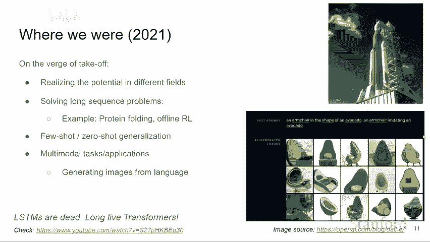
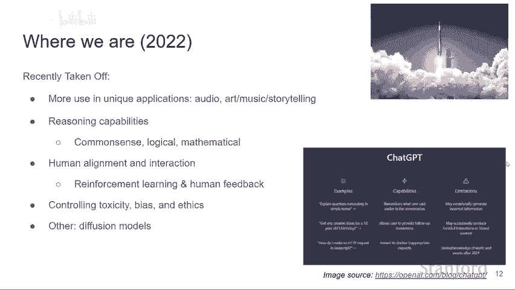
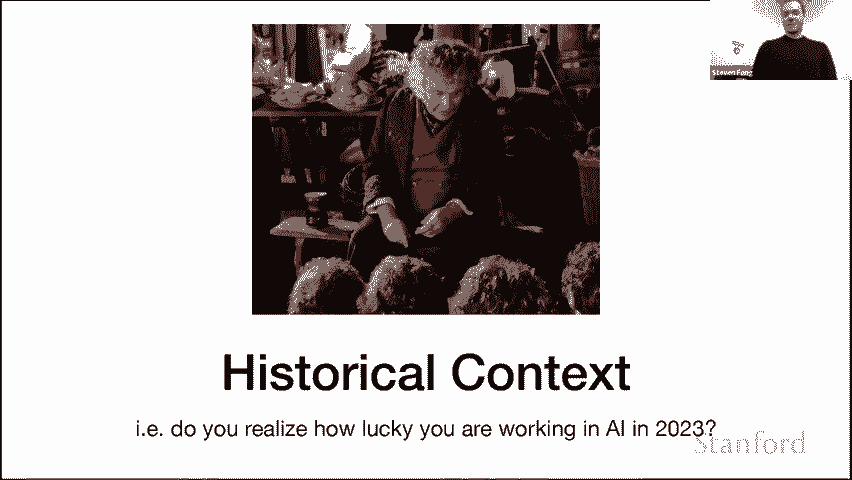

# P11：11. 变压器介绍与 Andrei Karpathy - life_code - BV1X84y1Q7wV

大家好，欢迎来到 CS25 Pro UnitedV。这个课程在 2023 年冬季于斯坦福举办。😊 这个课程并不是关于可以变成汽车的机器人，而是关于深度学习模型，它们引起了世界的轰动，彻底改变了人工智能等领域。从自然语言处理开始，变压器已广泛应用于计算机视觉等领域。

强化学习、生物学、机器人等。我们为您准备了一系列令人兴奋的视频，邀请了一些真正迷人的演讲者。跳过演讲。展示他们如何将变压器应用于不同领域的研究。希望您能享受并从这些视频中学习。所以不再拖延，让我们开始。这是一场纯粹的入门讲座。我们将深入探讨变压器的构建模块。

所以首先，让我们介绍一下讲师。我目前在 PhD 项目中暂时挂名，并在一家机器人初创公司担任领导，致力于一些通用机器人，类似于这个。我对机器人和构建辅助学习算法充满热情。

我在个人贷款和远程建模方面的研究兴趣，以及在机器人、政府、驾驶等领域有很多出版物。大学时在康奈尔，某本书提到康奈尔，这是一个估算的呼叫。所以我是一名 CSP 演讲者，完成了 CMU 的硕士和本科学位。主要从事自然语言处理研究，涉及语言和文本的任何内容。

但最近我对计算机视觉和一些娱乐项目也越来越感兴趣。我有很多音乐相关的活动，制作了钢琴曲。有一些自我宣传，但我在 Instagram、YouTube 和 TikTok 上发布了很多内容。如果你们有兴趣，我和我的朋友们也在成立一个斯坦福钢琴俱乐部，所以如果有人感兴趣，可以随时发邮件询问 Y 的详细信息，除此之外，我也练习武术。

我们正在尝试一些动画、偶尔玩游戏。😀 好的。我的名字是 Ryland，简单介绍一下自己。我想简短地说，我非常兴奋能参加这个课程。上次我教这门课时，我觉得我们带来了一个非常优秀的演讲者团队。我对这次课程感到非常期待，谢谢大家的到来，我期待一个非常有趣的学期。你是去年最活跃的学生，明年有意成为讲师。

好的。😊，继续。让我们看看，如果有几分钟。我们希望你在这堂课中学到的第一件事是，变压器是如何工作的？它们是如何被应用的，现如今在人工智能和机器学习中无处不在，以及在这些主题中的一些新有趣研究方向。

所以这堂课只是一个介绍，只是谈论变压器的基础，介绍它们。讨论一个自我潜力机制，这是它们的基础，我们将深入探讨像 GPT 这样的模型。所以，准备好得到扎实的知识。好的，让我开始展示注意力时间线。注意力的所有一切始于 2017 年这篇壁纸论文，注意力是由 Vaswani 等人提出的，在那之前我们有许多模型，如 RNN、LSTM 和简单的注意机制，这些并没有涉及规模部署。

从 2017 年开始，我们在 NLP 领域解决了变压器的爆炸，大家开始将其应用于所有事物。我甚至听说谷歌的支持，每次我们与语言学家合作时，性能都有所提升。嗯。在 2018 年之后，2020 年，我们看到客户在其他领域（如视觉）中的激增。😊，还有生物学，去年 2021 年是基因生成错误的开始，我们开始了很多基因建模，比如 Kox 模型。

GT，Dali，稳定方程与许多在基因建模中发生的事情相关，我们开始在人工智能上扩展，现在是 2022 年，像 23 年的初创公司，现在我们几乎有一群其他的“喋喋不休”的声音，我们在不断地扩展，这很好。

所以这就是未来。深入讨论一下。所以一旦进行了审计，我们有两个模型，LTN 和 GIU。这里有效的是它们擅长结束历史。😊。但无效的是它们未能编码长序列，且编码内容的能力非常差。所以考虑这个例子。试着预测文本中的最后一个词。

我在法国长大……我流利地说 D。在这里你需要理解上下文才能预测法语，而注意力机制对此非常有效。而如果你只是使用 LSTM，就行不通。变压器擅长的另一件事是，基于内容的上下文预测，像是找到注意力图，如果我有像“它”这样的词。

现在它收集了什么，我们可以给出可能激活的概率关注，这些工作比现有机制更好。好的。所以在 2021 年，我们快要起飞了。我们开始意识到变压器在不同领域的潜力。我们解决了许多长序列问题，如蛋白质折叠、Al fold、离线 Arl。

我们开始看到零样本泛化，我们看到了多模态任务和应用，比如从语言生成图像，这一切都与 DLI 有关，是的，感觉像是亚洲两年前分享过的内容。这也是关于变压器的一个讨论，可以观看并提供。

是的。这就是我们从 2021 年到 2022 年所经历的变化，我们已经从起飞的边缘真正起飞，显然我们在音频生成、艺术和音乐等领域看到了独特的应用。我们开始看到推理能力，如常识、逻辑推理和数学推理。我们现在也能够进行人类启发和互动。

他们能够利用强化学习和人类反馈，这就是悲剧训练得以表现良好的原因。我们现在有许多机制来控制毒性、偏见和伦理问题，同时在其他领域也有许多发展，比如不同的模型。

够。😡，啊。所以这个功能就像是一艘飞船，我们都对此感到兴奋。😊。还有很多其他收购，我们可以启用，如果你能看到变压器也在这里工作就更好了，一个很好的例子就是你的理解和生成，这是每个人都感兴趣的，我希望今年在这个领域能看到很多模型，包括金融和商业。

😊，我会非常兴奋看到 GT 创作小说，但我们需要解决非常长的序列建模问题，而大多数变换模型仍然限制在大约 4000 个开放词左右，因此我们需要改进它们，使它们在长序列上表现得更好。我们也希望拥有能够执行多任务的通用代理。

Amatic 输入。像 Goto 这样的预测，所以我认为我们也会看到更多这些，最后我们还希望有特定领域的模型。所以你可能希望有一个在某些方面表现良好的 GP 模型，比如医生 GPT 模型，或者一个仅基于原始数据的大型 GP 模型。目前我们有的 GP 模型是在各种数据上训练的，但我们可能会开始看到更多专注于单一任务的细分模型，我们可以像咨询专家一样，有专家 A 模型，可以根据不同需求去不同的模型。

是的。要使这一切成功仍然缺少很多要素，首先是外部记忆，我们已经开始在像 ChaGPT 这样的模型中看到这一点，交互是短暂的。没有长期记忆，也无法长期记住存储的对话，这正是我们想要解决的问题。

😊，每秒每秒都在减少计算复杂度。因此，注意机制在序列长度上是二次的，我们想要减少它，使其更快。诶。你还想做的另一件事是增强这些模型的可控性，因为很多模型可能是随机的，我们希望能够控制我们从中获得的输出类型，你可能体验过这种变化，只需刷新一次，每次得到的输出都不一样。

但你可能想要有机制黑箱打印机，看看你能做些什么。最后，我们希望将我们最先进的语言模型与人脑的工作方式对齐，我们正在看到搜索，但我们仍然需要更多研究，看看它们能如何更重要。可系哼。😊，是的。我很高兴在这里，我住得很近，所以我收到了来上课的邀请，我就像。

好的，我就走过去，但我在幻灯片上花了大约 10 个小时，所以这并不简单。所以，是的，我想谈谈变压器，我将跳过前两个。我们不会讨论那些，我们将讨论这个，以简化讲座，因为我们没有时间。

嗯。好的，我想提供一些背景，解释为什么这个变压器类存在，所以我觉得有一点历史背景。我加入 AI 大约在 2012 年，全职课程，所以大约十年前。那时候你甚至不会说你加入了 AI，那个词有点脏，现在谈论这些是可以的，但那时甚至没有深度学习，只有机器学习，这是一个认真的术语。但现在 AI 可以使用，我觉得。

所以，基本上你有没有意识到你有多幸运，潜在地进入这个领域，大约在 2203 年。那时候，大约在 2011 年，我专门从事计算机视觉的工作。

你的管道看起来像这样，你想分类一些图像，你会去查论文，我觉得这很有代表性，论文中会有三页描述各种不同特征的“厨房水槽”。

描述符，你会去计算机视觉会议的海报展，每个人都有他们提议的论文特征描述符，这简直是荒谬的。你会记录哪些应该纳入你的管道，因为你会提取所有这些特征，然后在上面放一个支持向量机（SVM），所以你会这么做。确保你获取你的稀疏直方图。

你的 SSIs 是颜色直方图、纺织品、微小图像，别忘了几何特定直方图。它们本身的代码基本上是复杂的，你从各处收集代码并运行，完全是一场噩梦。所以，更糟的是它还不管用，我认为这代表了那时的预测，你偶尔会得到这样的预测，你只能耸耸肩，觉得这就偶尔发生，而今天你会寻找 bug。

更糟的是，每个 AI 领域都有自己完全独立的词汇。如果你去看 NLP 论文，这些论文会完全不同，你在读 NLP 论文时，可能会疑惑“这是什么？词性标注、形态分析、句法解析、指代消解，NPBT、JJ 又是什么？”因此，词汇和一切都是完全不同的，你几乎无法跨领域阅读论文。

这种情况在 2012 年发生了变化，当 Askochevsky 及其同事展示了如果在大型数据集上扩展大型神经网络，可以获得很强的性能。到那时，大家对算法的关注很多，但这表明神经网络扩展得很好，所以你现在需要关注计算和数据，如果你扩大规模，它的效果相当不错。这种方法也在 AI 的许多领域复制粘贴，因此自 2012 年起我们开始看到神经网络在各处出现，包括计算机视觉、自然语言处理、语音、翻译和强化学习等。因此，每个人开始使用相同的建模工具和框架，而现在当你去阅读 NLP 领域的论文，比如机器翻译时。

这是一个论文的序列，我们稍后会再提到。当你开始阅读这些论文时，你会发现“哦，我能识别这些词：有神经网络、有一些参数、有一个优化器”，它开始读起来像你熟悉的内容。这大大降低了进入不同领域的门槛。

不同的领域。我认为关键在于 2017 年变压器（transformer）问世时。并不是说工具包和神经网络相似，而是架构确实趋向于一种架构，你可以在所有地方复制粘贴。那时这是一篇看似不起眼的机器翻译论文，提出了变压器架构，但自那时起我们发现，基本上可以随意复制粘贴这个架构。

并且将其应用于各个领域，变化的只是数据的细节、数据的分块方式以及如何输入数据。你知道这有些夸张，但这基本上是一个正确的一阶陈述，因此现在的论文看起来更加相似，因为每个人都在使用变压器，这种趋同在过去十年中令人瞩目。我发现有趣的是，我认为这或许暗示我们可能正在趋向某种大脑在做的事情，因为大脑在整个皮层的表面上是非常同质和均匀的。好的，也许一些细节在变化，但那些感觉像是变压器的超参数，你的听觉皮层、视觉皮层以及其他一切看起来都非常相似，因此我们也许正在趋向某种统一的强大学习算法，我觉得这一点相当有趣。

好的，我想简要谈谈变压器的历史起源。我想从 2003 年开始，我非常喜欢这篇论文，这是神经网络首次被应用于语言建模问题的流行应用，因此在这种情况下预测序列中的下一个单词。这使你能够建立文本的生成模型，而在这种情况下，他们使用了多层感知器，所以这是一个非常简单的神经网络，它取三个单词并预测序列中第四个单词的概率分布。到目前为止，这很好。随着时间的推移，人们开始将其应用于机器翻译，这使我们回到了 2014 年的序列到序列论文，那篇论文相当有影响力，而这里的大问题是。

好的，我们确实只想取三个单词并进行预测，我们想预测如何将英文句子转换为法文句子，关键问题是：好的，你可以在英语中有任意数量的单词，在法语中也有任意数量的单词，那么如何构建一个能够处理这种可变大小输入的架构呢？

在这里他们使用了 LSTM，基本上有两个部分，这些部分被 Sla 所覆盖。但基本上，左侧有一个编码器 LSTM，它一次消费一个单词并建立它所阅读内容的上下文。然后它作为解码器 RN 或 LSTM 的条件向量，后者基本上逐个单词翻译序列中的下一个单词，将英语翻译成法语，或类似的东西。人们很快识别到的问题是所谓的编码瓶颈。

所以我们试图进行条件处理的整个英文句子被打包成一个从编码器传递给解码器的单一向量，因此这可能包含的信息太多，无法维持一个单一的向量，这似乎不太正确，于是人们开始寻找缓解编码瓶颈（当时被称为编码瓶颈）的方法。

这让我们回到这篇论文，神经机器翻译通过联合学习对齐和翻译。这是这篇论文摘要中的一段，我们推测使用固定长度向量是提高基本编码解码器架构性能的瓶颈，并建议通过允许模型自动 soft 搜索与预测目标词相关的源句子部分来扩展这一点，而不需要显式形成这些部分或核心片段，因此这是一种回顾来自编码器的词汇的方法，使用这种 soft 搜索实现了这一点，因此在解码时。

这里的词汇，当你在解码它们时，你可以通过这篇论文提出的 soft attention 机制回顾编码器中的词汇，因此我认为这篇论文是我第一次看到基本的注意力，因此来自编码器的上下文向量是编码中词汇的隐藏状态的加权总和。

然后，这里的权重来自一个基于当前状态和编码器生成的隐藏状态之间兼容性的 softmax，因此这是你第一次真正开始关注它，这是现代注意力机制的当前方程，我认为我第一次看到这个概念的论文是首个使用“注意力”这个词的论文，据我所知，这是首次称这种机制的，因此我实际上试图深入了解注意力的历史，第一作者德米特里，我与他有过电子邮件交流，我基本上给他发了一封邮件，我说德米特里，这真有趣，变压器已经接管了，你是从哪里想到 soft attention 机制的，这个机制成为变压器的核心，令我惊讶的是，他回了我一封非常长的邮件，内容非常引人入胜，这里是那封邮件的摘录。

嗯。因此，基本上他谈到他在寻找一种方法，以避免编码器和解码器之间的瓶颈。他有一些关于光标遍历序列的想法，但没有完全实现。然后有一天，我想到，让解码器 RNN 学习在源序列中放置光标的位置会很好，这种想法受到了我初中学习英语时翻译练习的启发，涉及到在源序列和目标序列之间大量的注视转移。所以字面上来说，我觉得这很有趣，他不是以英语为母语的人，这让他在机器翻译中占了便宜，导致了注意力机制的出现，进而导致了变换器的出现。这真是令人着迷，我将软搜索表达为 softmax，通过这种方式对 ByN 状态进行平均，基本上让我非常兴奋的是，这项工作在第一次尝试时就成功了。所以我认为这是一个非常有趣的历史片段，后来发现 RNN 搜索这个名字有些不妥，最终的好名字“注意力”是来自约书亚的最后几次修改。

当他们回顾这篇论文时，也许“注意力就是你所需要的”会被称为“驾驭”或者“仅仅保持”。但我们要感谢**约书亚·本尼奥**为这个名字的改进。显然，这就是这个主题的历史，挺有趣的。好的。这让我们回到了 2017 年，“注意力就是唯一”的这个组件在迪梅特里乌斯的论文中只是一个小部分，还有所有这些双向 RNN 和解码器，而这篇论文上的注意力是说，实际上你可以删除所有东西，真正让这个工作顺利的就是注意力本身。

所以删除所有东西，保留注意力，而这篇论文的显著之处在于，通常你会看到一些论文不太完整，他们添加一件事并展示出更好。但我觉得“注意力就是唯一”像是同时结合了多种东西，以一种非常独特的方式组合在一起。

然后在架构空间中也实现了一个非常好的局部最小值。因此对我来说，这真的是一篇具有里程碑意义的论文。这相当显著，我认为在背后有很多工作。因此删除所有 RNN，只保留注意力，因为注意力是作用于集合的，我将在接下来详细讲解。你现在需要对输入进行位置编码，因为注意力本身并没有空间的概念。

他们。你必须非常小心。他们从共振中采用了这种残差网络结构。他们将注意力与多层感知器交错使用。他们使用了来自不同论文的层归一化，提出了应用于并行的多头注意力概念，他们给了我们一组我认为相当好的超参数，直到今天仍在使用，因此多层感知器中的扩展因子上升了四倍，我们将稍微深入一点，这个四倍的因子一直存在，我相信有许多论文尝试对变换器的各种细节进行调整，但没有什么像它一样有效，因为这个设计实际上非常好。根据我所知，唯一没有持久的变化是将层归一化重组为预归一化版本，在这里你可以看到层归一化在多头注意力之后或之前，他们只是把它们放在前面，所以只是层归一化的重新排列，但其他的 GPST 及你今天看到的所有内容基本上是五年前的 2017 年架构，尽管每个人都在对此进行研究，但它证明了相当强的韧性，我认为这很重要。

我认为有一些创新也被采用于位置编码。使用不同的旋转和相对位置编码变得更加常见等等。因此，我认为有一些变化，但大多数情况下它证明了非常稳定。所以这篇论文确实相当有趣，现在我想深入了解注意力机制。我认为。

我有点喜欢我解释的方式，不是。与我以前见过的展示方式不相似，所以让我试试另一种方式来描述我如何看待它。对我而言，注意力就像是变换器的沟通阶段，而变换器交错着两个阶段。

沟通阶段是多头注意力，而计算阶段是这个多层感知器或人们所形成的。因此，在沟通阶段，这实际上只是基于数据的消息传递在有向图上。你可以想象，忘掉机器翻译的一切，让我们在每个节点上存储一个向量，然后让我谈谈这些向量在这个有向图中如何互相沟通，计算阶段则只是一个多层感知器，它基本上对每个节点进行单独处理，但这些节点如何在这个有向图中相互沟通，所以我写了一些简单的 Python 代码。

我在 Python 中写了这个，基本上是为了创建使用注意力作为消息传递机制的一个沟通轮次。所以这里，一个节点有这个私有数据向量，你可以把它看作是这个节点的私有信息。然后它还可以发出一个键、一个查询和一个值，这只是通过从这个节点进行线性变换来完成的。键是我是什么东西，抱歉。

查询是我正在寻找的内容之一，键是我所拥有的内容，而值是我将要传达的内容。因此，当你拥有由一些随机边构成的节点图时，当这些节点实际进行通信时，发生的事情是你以随机顺序循环遍历所有节点，你在某个节点上，获得查询向量 Q，这代表我是图中的一个节点，这是我正在寻找的内容，这只是通过这里的线性变换实现的。

然后我们查看指向这个节点的所有输入，广播我所拥有的内容，也就是它们的键。因此，它们广播键，我有查询，然后这些通过点积相互作用以获得分数。通过点积，你基本上获得了指向我的所有信息的有趣性未归一化权重，以及我正在寻找的内容，然后当你用 softmax 进行归一化时，它只会总和为 1。

基本上，你最终会使用那些现在总和为 1 的分数，它们是概率分布，你对值进行加权求和以获得更新。因此，我有一个查询，他们有键的点积来获取有趣性或亲和力，使用 softmax 进行归一化，然后对这些值进行加权，流向我并更新我。这对于每个节点都是单独发生的，然后我们在最后进行更新，因此这种信息传递机制在变换器的核心，发生在更向量化的批处理方式中，这更复杂，并且还与层归一化等交错在一起，以使训练效果更好。

但这大致上就是我认为的注意力机制在高层次上的运作方式。所以，在变换器的通信页面中，这种信息传递机制在每个头中并行发生，然后在每一层中串行进行，每次都有不同的权重。这就是多头注意力的全部内容，因此如果你查看这些编码器-解码器模型，可以将其视为图中这些节点的连通性。

你可以将其视为，编码器中的所有令牌都是彼此完全连接的，因此当它们计算特征时，进行完全通信，但在解码器中，由于我们试图构建一个语言模型，我们不希望有来自未来令牌的通信，因为它们在此步骤中泄露了答案，因此解码器中的令牌与所有编码器状态完全连接，同时它们也与所有在其之前的内容完全连接。

所以你最终会在有向图中得到这样一个三角结构，但这基本上就是消息传递机制的实现。然后你还需要稍微小心，因为在这里与解码器的交叉注意力中，你会使用来自编码器顶部的特征。因此，可以想象在编码器中，所有节点彼此之间都在相互关注，所有的令牌彼此之间也在关注许多。

多次，他们真正搞清楚里面有什么，然后解码器在查看顶部节点时。因此，这大致就是我想要深入讲解的消息传递机制。关于这一点我不知道有没有问题。哦，你问。自注意力和多头注意力。但是什么是那个。不是。嗯。是的，所以。自注意力和多头注意力，所以多头注意力就是这种注意力机制。

但这只是以并行的方式多次应用，"多次"仅仅意味着对同一注意力的独立应用。因此，这个消息传递机制基本上就是在并行中多次发生，并且对于查询、键和值使用不同的权重。

所以你总是可以这样看：我在并行中寻找不同类型的信息来自不同节点，并且我把所有信息都汇集到同一个节点中。这一切都是在并行中完成的。所以头部实际上就像是在并行中的复制粘贴，而层就是复制粘贴。

但它是串行的。也许这样说有意义。而自注意力，当提到自注意力时，指的是这里的每个节点生成这里的每个节点。因此，正如我在这里描述的，这确实是自注意力，因为这些节点中的每一个都从这个独立节点生成一个键、查询和值。当你有交叉注意力时，来自编码器的一个交叉注意力在这里。

这仅意味着查询仍然是从这个节点生成的，但键和值是作为来自编码器的节点函数生成的。因此，我有我的查询，因为我试图解码序列中的第五个词，而我在寻找某些信息，因为我是第五个词，然后关于可以回答我查询的信息源的键和值可以来自当前解码序列中的前一个节点，或者来自编码器顶部，因此所有已见过所有编码令牌的节点许多。

多次现在可以广播它们在信息方面所包含的内容。所以，我想总结一下，自注意力有点像。交叉注意力和自注意力只在于键和值的来源不同。要么键和值是从这个节点生成的，要么是从某个外部源生成的，比如一个编码器和那边的节点。

😡，但算法上是相同的微操作。好的。O。在消息传递图范式中。所以是的，所以。嗯，我。所以想象一下，这些节点每一个都是一个标记。嗯。我想它们在变换器中的图像并不是很好，但像是。这个节点可以表示解码器输出中的第三个单词。起初。

这只是单词的嵌入。嗯。然后。好的。我得仔细思考一下这个知识，今天早上我想到了它。没有。实际上。我昨天。我的结果。车站。ごい。笔记被封锁了。我们最好。那些笔记基本上是向量。我会去实现，我会去实现。

然后也许我会建立与图的连接。所以让我先尝试，不去考虑这个直觉，至少去 NAGPT，这是一个非常简约的变换器完整实现，这就是我在过去几天里所做的，这里它在开放网页文本上再现 GT2，所以这是一个相当严肃的实现，我会说再现了 GPT2，并提供在一个计算上，这是 HP 的一个笔记，持续了 38 小时左右，而且它非常可读，只有 300 行，所以每个人都可以看一下，好的，让我基本上简单地讲解一下。

所以让我们尝试只使用解码器的变换器，这意味着它是一个语言模型，它试图建模序列中的下一个单词或下一个字符序列。因此，我们训练的数据总是某种文本，所以这里有一些假的莎士比亚，这是实际的莎士比亚，我们将生成假的莎士比亚，这被称为迷你莎士比亚数据集，这是我最喜欢的玩具数据集之一，你将所有莎士比亚连接在一起，它是一个兆字节的文件，然后你可以在上面训练语言模型，获得无穷的莎士比亚，如果你喜欢，我认为这是医学的。所以我们有一个文本，第一件需要做的事情是将其转换为整数序列。

因为变换器本质上处理，你知道。你不能直接将文本放入变换器中，你需要进行某种编码。因此，编码的方式是我们将每个字符转换，例如，在最简单的情况下。每个字符变成一个整数。然后不是高在那里。我们会有这个整数序列。因此，你可以将每个字符编码为一个整数，并得到像 NAA 这样的整数序列，你只需将它们全部连接成一个大型一维序列，然后你就可以在上面训练。现在这里我们只有一个单独的文档，在某些情况下，如果你有多个独立的文档，人们喜欢创建特殊的标记，并将这些文档与那些特殊的文本标记交替插入，以创建边界。

但这些边界实际上没有任何建模影响，只是变压器应该学习超出这种传播的内容，文档序列的结束意味着你应该清空记忆。😡，好的，然后我们生成批次，这些数据批次意味着我们回到一维序列，并提取出这一序列的块。

所以假设块大小是八。那么块大小指示你的变压器将处理的最大上下文长度。如果我们的块大小是八，那意味着我们将有最多八个字符的上下文来预测序列中的第九个字符。

批量大小指示我们将处理多少个序列并行。我们希望这个尽可能大，以便充分利用 GPU 和电缆下的并行性。因此在这个例子中，我们正在进行 4x8 批次，所以这里的每一行都是独立的例子。然后每一行都是我们将要训练的小块序列，并且我们在每个点上都有输入和目标。

所以要完全阐明包含在单个 4x8 批次中的内容，对变压器来说就像是压缩在这里，所以当输入是 47 时，目标是 58，而当输入是序列 4758 时，目标是 1，当是 47581 时，目标是 51，依此类推，实际上这个 4x8 的单个批次实例有很多个体例子，我们期望变压器能够并行学习，所以你会看到这些批次是完全独立学习的，但时间维度在这里水平排列，也是在并行训练，所以你真正的批量大小更像是 deted。

只是上下文在你沿着 T 方向进行的预测中线性增长。在模型中，这就是模型将从这个单一批次学习的所有示例。因此现在这是 GPT 类。因为这是一个仅解码的模型，所以我们不会有编码器，因为没有我们要翻译的英文，我们不是试图以其他外部信息为条件。

我们只是试图生成相互可能跟随的词序列。所以这都是 pytorch，我的成长速度更快，因为我假设人们已经接受了 2 31 或类似的东西。但在前向传递中，我们获取这些索引。然后我们通过嵌入查找表对这些索引的身份进行编码。

所以每一个整数都有一个索引，我们索引到这个 n.dot 嵌入的查找表中，提取出该令牌的词向量。然后因为 transform 本身并不实际处理，所以我们需要对这些向量进行位置编码，以便我们基本上同时拥有令牌身份和其在序列中的位置（从 1 到块大小）信息。现在，关于什么和位置的信息是加法结合的。

所以令牌嵌入和位置嵌入正如这里所示直接相加。所以这里的 X。😡 然后有可选的 dropout，这里的 x 基本上只包含词汇集合。还有它们的位置。这些信息输入到我们将要查看的 transformer 的块中，这里暂时只是 transformer 中的一系列块。😡 然后在最后。

有一个层归一化，然后你使用这个 transformer 输出的线性投影来解码下一个单词或下一个整数的 logits。所以这里的 LM 头，语言模型头的缩写只是一个线性函数。因此，基本上对所有词进行位置编码，将它们输入到一系列块中。然后应用一个线性层来获取下一个字符的概率分布。

然后如果我们有在数据顺序中生成的目标，你会注意到这些目标只是时间上偏移一个的输入。然后这些目标输入到交叉熵损失中，所以这只是一个负对数似然，典型的分类损失。现在让我们深入了解这些块中的内容。这些块是顺序应用的。😡 再次。

正如我提到的沟通阶段和计算阶段，在沟通阶段，两个节点互相交流，因此这些节点基本上是。如果我们的块大小是八，那么在这个图中我们将有八个节点。这个图中有八个节点，第一个节点仅被自身指向。第二个节点被第一个节点和自身指向。

第三个节点被前两个节点和自身指向，等等。所以这里有八个节点。因此你应用，X 中有一个残差路径，你将其提取。你应用一个层归一化，然后是自注意力，这样这八个节点就进行交流。但你必须记住批次是四，所以因为批次是四，这也是应用的，因此我们有八个节点在交流，但这四个批次中的每一个都在这些八个节点上各自进行交流。

在批次维度上当然没有交叉，批次归一化范围也没有，因此运气更好。一旦它们交换了信息，就使用 modo receptor 进行处理。这是计算基础。所以这里还有缺失，我们缺少交叉注意力，因为这是一个仅解码器模型。因此我们只有这个步骤，即多头注意力，这是这个沟通阶段。

然后我们有前馈层，即 MLP。这是完整的阶段。我稍后会回答问题。这里的 MLP 相当简单，MLP 在每个节点上进行个体处理，只是在该节点上转换特征表示。

应用一个两层神经网络，带有一个伽尔非线性。可以将其视为一个重映射或类似的东西，这只是一个非线性。而且 MLP 很直接，我认为这里没有什么太疯狂的。这是因果自注意力部分，通信阶段。

所以这有点像事物的轮廓，最复杂的部分。之所以复杂，是因为批处理和实现细节，比如如何在图中屏蔽连接，以便在预测标记时无法从未来获取任何信息。

否则它会泄露信息，所以如果我是第五个标记，并且处于第五个位置，那么我会获得第四个标记作为输入，我会关注第三、第二和第一个标记，并试图弄清楚下一个标记是什么。在这一批的下一个时间维度的元素中，答案在输入中，所以我无法从那里获取任何信息，这就是为什么这一切都很棘手，但基本上在前向传递中。

嗯。我们基于 x 计算查询、键和值。这些就是我在计算注意力时的键、查询和值。我有查询矩阵乘以键，因此这是对所有查询和所有头部的并行点积。所以我觉得还需要提到的是头部的部分也是在这里并行完成的。

所以我们有批处理维度、时间维度和头部维度，你最终会得到五维张量，这一切都很混乱，所以我邀请你稍后逐步了解，并确认这实际上是在做正确的事情，基本上就是拥有批处理维度。

头部维度和时间维度，然后你会得到它们的特征。因此，这是在评估所有批处理元素、所有头部元素和所有时间元素。之前给你的简单 Python 示例，就是 queryductpro P。然后我们在这里做一个填充掩码，基本上是在限制这个。

注意力在不应该相互通信的节点之间被设置为负无穷，我们这样做是因为我们即将进行 softmax，因此负无穷会使那些元素的注意力基本上为零。😡 所以在这里我们基本上会得到权重。

它们在这些节点之间服务于亲和性。可选的 dropout，然后这里的注意力矩阵乘以 V，基本上是根据我们计算的亲和性来汇集信息。这只是所有这些节点上值的加权和。所以这个矩阵乘法就是在进行这个加权和。

然后转置连续视图，因为这一切都很复杂，基于五维张量。但它实际上并没有做任何可选的 dropout，然后再线性投影回到残差路径。所以这是在实施通信阶段。然后你可以训练这个变换器。然后你可以生成无限的莎士比亚，你只需这样做，因为我们的块大小是八。

我们从一个总标记开始，比如说我在这个案例中使用的。你可以使用换行符作为起始标记。然后你只与自己沟通，因为这是一个单一节点，你会得到序列中第一个词的概率分布。然后你解码它，或者是序列中的第一个字符。

你解码这个字符，然后你将字符带回来，并重新编码为一个整数，现在你得到了第二个东西，所以你得到了第一个位置，而这就是它的整数值。将位置编码添加到序列中进入变换器，这个标记现在与第一个开放的标记及其身份沟通，所以你不断地将它插入，直到你耗尽块大小，块大小是八，你开始爬升。因为你在训练这个变换器时，块大小永远不能超过 8，所以我们有越来越多的上下文，直到八。如果你想生成超过这个值，你就必须开始裁剪，因为变换器在时间维度上仅适用于八个元素，因此所有这些变换器在简单设置下都有一个有限的块大小或上下文长度，在典型模型中，这通常是 1024 个标记或 2048 个标记之类的，但这些标记通常是 EE 标记或句子片段标记或词标记，这些标记有很多不同的编码，所以并不是那么长，这就是我认为我们真的想扩展上下文大小并且变得复杂的原因，因为注意力在简单情况下是非常小的。

现在，如果你想实现一个编码器而不是解码器的注意力。你所要做的就是这个主节点。你只需删除那一行。所以如果你不屏蔽注意力，所有节点都会相互沟通，一切都是允许的，信息在所有节点之间流动。因此，如果你想在这里有编码器，只需删除所有的编码器块，注意力将在删除那一行的地方使用。

就是这样。所以你允许我存储中编码的任何内容，比如说 10 个标记，10 个注释。它们都可以相互沟通，传递到变换器的上层。如果你想实现交叉注意力，那么你就拥有一个完整的编码器-解码器变换器，而不仅仅是一个仅解码的变换器或 GPT。那我们还需要在中间添加交叉注意力。

所以这里有一个自注意力部分，所有的自注意力部分，一个交叉注意力部分和这个 MLP，在交叉注意力中。我们需要从编码器的顶部获取特征。我们需要在这里添加一条线，这将是交叉注意力，而不是我应该实施的，而不仅仅是指向，我认为。

但这里会有一条交叉注意力线，所以我们会有三条线，因为我们需要添加另一个块，查询将来自 x。而片段和数值将来自编码器的顶部。基本上，信息将严格地从编码器流向 X 内部的所有节点。就这样，所以在解码器注意力上做了非常简单的修改。

所以你会听到人们说，你有一个仅解码器模型，比如 GP。你可以有一个仅编码器模型，比如 Bt，或者你可以有一个编码器解码器模型，比如 T5 做机器翻译等。而在 Bt 中，你不能用这种方式进行训练。

语言建模设置非常激进，你只是试图预测下一个序列，你正在将其训练到略有不同的目标，你输入完整的句子，并且完整的句子可以完全沟通，然后你试图分类情感或其他类似的东西，所以你并不是试图建模序列中的下一个标记，这些在数学上稍有不同。

啊。使用遮罩和其他去噪技术。好的。这就像变压器，我将继续，所以是的，可能还有更多问题。你说我。哦。对。我真的。好吧。你，好的，胡椒仍然是。找到的是一种动态路径。我们实际上可以在所有方面进行更改，你也有一些东西。

这就像我们通过遮罩强制施加这些约束一样，我不太确定是否完全理解，所以可以从不同的角度来看这个类比。但一个类比是你可以将这个图表解释为固定的，只是每次我们进行沟通时，我们使用不同的权重，你可以从下面看。

所以如果在我的例子中，我们有块大小为八，我们将有八个节点，这里有两个、四个、六个，好吧。所以我们将有八个节点，它们会相互连接，你将它们摆放并且你只从左到右连接，但我们是不同的。是的，我们会有一个非常连接的部分。哦。为什么连接不随着数据或其他因素变化呢？

我在想是否有任何。我不认为我见过任何一个连接随着数据动态变化的例子。通常情况下，如果你有一个编码器并且你正在训练一个 Bt，连接是固定的。你想要多少个标记，它们是完全连接的。如果你有一个解码器，长模型。你有三角形的东西，如果你有编码器解码器。

然后你有点尴尬地有两个工具节点。诶呀。啊对啊，就是我们。最后就。家佢你嗯。嗯。不要对起。作为直播人我诉。第划孙嗰月啊。我想知道。对此了解得更多，然后去。都走。你冇想出去。有直。好的。哪一部分。好的。对系咧。これ。嗯。哦，有か。冇 your。不同的东西。我是多。是的，真的很难说，所以我认为这篇论文是如此有趣，因为。是的，通常你会看到一条路径，也许他们内部有一条路径，只是没有发布，而你所能看到的东西并不像变压器，我的意思是你有很多这样的 resnets，但 resnet 就像这样，但没有自注意力组件。

但是 MLP 在某种程度上是存在于一个 resNe 里。嗯。所以共振看起来非常像这个。只是没有，你也可以使用层归一化和共振，我相信也是。通常有时它们可以是 bash 归一化。所以这有点像 renet。就像他们把一个 ressonnet 和一个转置自注意力块结合在一起，加上了原有的 MLP 块。

这有点像卷积，而 MLP 严格来说是逐一反卷积。但我认为这个理念是类似的，MLP 就是那种典型的权重。没有非线性权重或操作。嗯。但是我想说，嗯，是的。这有点有趣，因为。很多工作并没有在那时出现，然后他们给你这个变压器，结果五年后它没有改变，尽管每个人都在尝试改变它，所以对我来说这有点有趣，就像一个包装来了，我认为从历史上看真的很有趣，我也和论文的作者交谈过，他们当时并没有意识到变压器会产生的影响，所以当你阅读这篇论文时，实际上有点不幸，因为这是改变一切的论文，但当人们阅读它时就像是问号，因为它读起来就像一篇相当随机的机器翻译论文，我在做机器翻译时哦这里有一个很酷的架构，好吧，结果不错，像这样。

它并不知道会发生什么，所以当人们今天阅读它时，我认为他们可能会感到困惑，像是有这种感觉。我将在最后有一些推文，但我认为如果考虑到事后诸葛亮，我会重新命名它。

好吧，我会谈到它。是的。这个。好的。我个放。是的，我认为这也是个好问题，目前我当然不喜欢自回归建模方法。我认为像采样一个 token 然后承诺它有点奇怪。所以。也许有一些混合方式，例如扩散。我认为这会非常酷。或者我们会找到其他方式来稍后编辑序列，填补我们的回归框架。

但我认为融合是一种正在兴起的建模方法，我个人觉得更具吸引力。当我采样文本时，我不会一个块一个块地进行，然后提交，而是先做一个初稿，再做一个更好的二稿。这感觉像是融合过程。所以那将是我的期望。好吧，还有问题，是的。

你喜欢这种逻辑，但它。你说的时候，像是注意力有点像计算，像是一个调节器，因为要在概念上采用产品。而且我们拥有的优势就像是将其他值相乘。然后恰当地应用它，是的，是的，对，你认为有没有像这样。像是盈利的网络。我发现图神经网络有点像一个令人困惑的术语，因为。

我是说，是的，之前有这种观念。我有点觉得，也许今天一切都是图神经网络，因为变换器是一个图神经和处理器。变换器操作的原生表示是通过边直接连接的集合，所以这是原生表示，然后是的。好的，我应该继续，因为我还有大约 30 张幻灯片。G 解决。那些想要提供的。哦，是的。

是的，根 D，我认为基本上就像你用随机权重初始化，与融合分开，因为你的维度大小增长，你的值也会增长，方差增加，然后你的 softmax 将变成一半的向量。所以这只是控制方差并保持在 softmax 和良好分布的范围内的一种方式。哦。这几乎就像是一个初始化的事情。好的。

所以变换器已被应用到其他领域，我认为这方式有点荒谬。因为我是计算机视觉领域的人，你有公共的，它们有一定的道理。因此，我们现在所做的以位为例，是将一幅图像切成小方块，然后这些方块字面上输入到一个变换器中，仅此而已。这有点荒谬，所以。下面。是的，因此变换器在最简单的情况下甚至根本不知道这些补丁可能来自哪里。

它们通常是位置编码的，但在某种程度上，它必须重新发现很多结构。我认为在某些方面它们是这样。以这种方式接近它有点奇怪。但它就像是将大图像切成小方块，然后作为单个节点输入的最简单基线，实际上效果相当不错，而这就是在变换器编码器中，所以所有补丁在整个解释过程中相互交流。

这里的节点数量就像是九个。好的。在语音识别中，你只需将梅尔谱图切成片段并输入到变压器中。所以写了这样的论文，但还有 Whisper，Whisper 是一个基于复制的变压器。如果你看到 OpenAI 的 Whisper，你只需将梅尔谱图切片并输入到变压器中，然后假装在处理文本，这样效果非常好。决策变压器和强化学习中，你把在环境中体验到的状态、动作和奖励假装成一种语言，并开始建模这些序列，然后你可以在后续规划中使用，这种方法效果相当不错，甚至像 AlphaFold 这样的东西。所以我们简要谈到分子以及如何将它们连接进来，AlphaFold 在计算上也是基于变压器的。

我还想谈谈变压器，我发现它们非常灵活，我真的很享受这一点。我给你一个来自特斯拉的例子。比如说你有一个模型，它接收图像并对图像进行预测，那么最大的问题是如何输入额外信息，这并不总是简单的。比如我有额外信息想要提供，我希望输出受到影响，可能我有其他传感器，比如雷达，也可能我有一些地图信息、车辆类型或音频。问题是如何将这些信息输入到模型中，在哪里输入？是拼接起来，还是在什么阶段添加？因此，使用变压器会容易得多，因为你可以随意选择你想要的内容。

你将它切成片段，并用你之前的集合来输入，然后让自我注意力去确定它们应该如何交流，坦率地说，这实际上是有效的。所以，简单地将一切切碎并混合就像是一种方法，它解放了神经网络，使其摆脱了艾利迪空间的限制，而以前你必须安排计算以符合三维的艾利迪空间布局，实际上计算就像在正常的三维空间中进行，如果你仔细想想的话。

但在意图上，一切都是集合，因此这是一个非常灵活的框架，你可以像将这些东西扔进你的条件集合中一样，一切都会自我注意到，所以在某种程度上是相当美妙的。那么，到底是什么让变压器如此有效呢？

我认为一个很好的例子来自 GT3 论文，我鼓励大家阅读，语言模型是双-shot 学习者。我可能会稍微改变一下，我会说变换器能够进行上下文学习或类似元学习的东西，这正是它们特别之处。所以基本上，他们正在处理的是，我有一些上下文，我正在尝试，例如，一个段落，这是许多例子中的一个，我有一个段落并且在问关于它的问题。

然后我作为提示中的上下文，给出了问题和答案。因此，我给了一个问题答案的例子，另一个问题答案的例子，另一个问题答案的例子，依此类推。这变得非常重要，大家都跟我说。好的，真正有趣的是基本上。

在上下文中提供更多示例可以提高准确性，这暗示变换器能够在激活中学习，而不采用典型的梯度下降微调方式。因此，如果你进行微调，就必须提供示例和答案，并且使用梯度下降，但看起来变换器在其权重内部正在做一些类似潜在梯度下降的事情，这种学习就像在阅读提示时发生的。因此，在这篇论文中，他们区分了随机梯度下降的外循环和上下文学习的内循环，内循环是变换器像在阅读序列一样，而外循环则是通过梯度下降进行训练，因此在变换器消耗序列时，在激活中确实发生了一些训练，这可能看起来像梯度下降，因此一些近期的论文暗示并研究了这一点。在这里的论文中，他们提出了一个称为原始算子的东西，并主张这个原始算子是由变换器实现的。

然后他们展示了你可以在原始算子上实现像 Ri 回归这样的东西。因此，这在他们的论文中暗示，变换器的激活中可能存在类似基于梯度学习的东西。

我认为考虑这一点并非不可能，因为基于梯度的学习是什么呢？前向传播、反向传播，然后更新？这看起来像一个简历。因为你只是改变你在权重上的添加，因此你从一组随机初始权重开始，前向传播、反向传播并更新你的权重，然后前向传播、反向路径权重。

看起来像是残差网络，变换器是一个残差网络，更加模糊。但基本上有些论文试图暗示这为什么可能。然后我在最后这里粘贴了一些推文，这些是为了公众消费。

所以它们有点更高层次，但我在谈论为什么这种架构如此有趣，以及为什么可能会如此受欢迎，我认为它同时优化了三个非常理想的特性，第一。

这个变换非常有表现力，如果超越它，就像能够实现非常有趣的功能，潜在的功能甚至可以进行元操作。第二，它非常可优化，得益于残差连接等因素；第三，它极其高效。这一点并不总是被重视，但变换器确实如此。

如果你查看计算图，它是一个浅层宽网络，非常适合利用并行 GPU，因此我认为变换器是非常有意图地设计以在 GPU 上高效运行的，还有之前的工作，比如神经 GPU，我也很喜欢，这实际上是在思考如何设计在 GPU 上高效的神经网络，并从硬件约束反向思考，这是一种非常有趣的思维方式。

啊。哦。哦，对，所以在这里我说我可能会称变换器为一个通用高效可优化的计算机，而不是“注意力机制是你所需要的一切”，也许从后来看，我会把那篇论文称为提出这是一个模型。

嗯。非常通用，所以前向传播表达力强。它在 GPU 使用方面非常高效，并且通过梯度下降易于优化，训练得很好。然后我还有一些其他热门推文。无论如何，你可以稍后阅读，但我认为这些可能有趣，因此如果以前的神经网络是为特定任务设计的专用计算机。

GPT 是一个通用计算机，可以在运行时重新配置以运行自然语言程序。因此，程序作为提示给出。然后，Chi 通过完成文档变成了 Ro 的程序。所以我个人非常喜欢这些类比，像计算机一样强大，而且可以通过梯度下降优化。然后……我不知道啊。

我想你可以稍后再读，但我就在这里感谢你，我就把这个留着。😊，是的。所以抱歉，我刚找到这个线索。结果发现，如果你扩大训练集并使用足够强大的神经网络，比如 transformer，网络就变成了一种通用的文本计算机。所以我认为这是一种不错的看法，而不是仅仅执行一个文本序列，你可以在提示中设计序列，并且因为 transformer 既强大又在足够大的复杂数据集上进行训练，它就变成了一种通用的文本计算机，所以我认为这是一种有趣的看法。

是的。哦。是的。后。是的。哦。对。啊。系 guess。我系。什么。好。好。哦。那已经不错了。有。哦。所以是的。哦。抱歉，我感动了。是的我，但我觉得好。好的。其实大一开过。哦。我最喜欢这个。它真的很不错，大部分是。你知道。它大多数更高效。它是个好地方，但你有那个。大会。すて。博士。是的，很。嗯，我认为这有点那样，所以我会说 RNNs 原则上是的。

它们可以实现任意程序，我认为这在某种程度上是一种无用的说法，因为它们可能。我不确定它们是否真的是可表达的，因为在某种意义上，它们能够实现这些任意函数。

但它们并不可优化。😡，而且它们显然效率低下，因为它们是串行计算设备。嗯，所以我认为，如果把它看作一个计算图，RNNs 是非常长的。变了。佢血挂。啊。就像如果你拉伸神经元，把所有个体神经元的连接拉开并试图可视化它们，RNNs 会像一个非常长的图，这样不好，也不易优化，因为我不完全知道原因，但大致的直觉是当你进行反向传播时。

你不想进行太多步骤。😡，所以 transformers 是一个浅而宽的图。从监督到输入的跳跃数量非常少。这是沿着残差路径进行的，使得梯度非常容易流动，并且有所有这些层归一化来控制所有这些激活的梯度规模，因此跳跃不多，从监督到输入非常快速，并且就这样流经图。

所有这些都可以并行完成，所以你不需要做这个编码器解码器 RNNs，你必须从第一个词开始，然后是第二个词，然后是第三个词，但在这里，transformer 中每一个词都是完全并行处理的。这些都非常重要，因为所有这些都真的很重要，我认为第三点虽然讨论得少，但极其重要，因为在深度学习中，规模至关重要，你可以训练的网络规模非常重要，因此如果在当前硬件上高效，我们可以把它做得更大。

我现在出来了他对我，我自己。嗯。是的，这样数据是如何的。所以是的，你拿你的图像，然后显然把它们切成补丁，所以有第一千个标记或其他，现在我有一个特殊的，所以雷达也可能，但我实际上不知道雷达的原生表示是什么。

但你可以，只需要将其切割并输入。然后你必须以某种方式编码它。就像变换器需要知道它们来自雷达。因此，你创建一个特殊的。你有某种特殊的标记。这个雷达标记在表示上略有不同，并且可以通过梯度学习得到。就像车辆信息也会通过一个特殊的嵌入标记进入，这也是可以学习的。

所以。你有那些，比如你不，它只是一个集合。只是当声音保证没有击中并且它说按钮。是的，它只是一个集合。但你可以对这些集合进行位置编码，如果你愿意。但位置编码意味着你可以硬连线。例如，坐标就像使用正弦和余弦，你可以硬连线。

但如果你不硬连线位置，那就更好。它只是一个始终悬挂在这个位置的向量。无论那里有什么内容，只需添加到上面，这个向量可以通过背景训练，这就是我怎么做的。是的，我觉得它们有点像代理，它们似乎有效。

但似乎有时我们的解决方案想要放置子结构。嗯。如果我理解问题，对我来说位置编码器实际上就像它们的偏见很少或者类似的东西，它们只是悬挂在位置上的向量，而你试图以某种方式帮助它们的网络。我认为直觉是好的，但。如果你有足够的数据，通常尝试干预是个坏事，就像试图在数据集本身已经包含足够知识的情况下输入知识，通常没有生产力。因此这真的取决于你的规模，如果你有无限数据，那么你实际上希望编码越来越少，这结果效果更好，而如果你有很少的数据，那么你确实想编码一些偏见，也许如果你有一个更小的数据集，卷积是个好主意，因为你实际上有来自更多过滤器的偏见。

但是我认为。因此，变换器是极其通用的。但有一些方法可以对编码进行调整，以加入更多结构，比如你可以，例如，编码正弦和余弦并固定它，或者你实际上可以去注意机制说。好吧，如果我的图像被分成补丁，这个补丁只能与这个邻域通信，你可以在注意矩阵中做到这一点，只需屏蔽掉你不想通信的部分，因此人们真的在玩这个，因为完全的注意力是低效的，所以他们会进行交错。

例如，某些层只进行小块之间的通信，然后还有一些层进行全局通信，它们会用各种技巧来慢慢引入更多的归纳偏差。你会这样做，但这些归纳偏差就像是从核心变压器中剔除出来的。

在笔记的连接性中，它们被剔除在定位上，也可能造成混乱。P 命题。你怎么记住？大。不该我。哦。现在可能有大约 200 篇关于这个的论文，如果不是更多，老实说很难跟踪，就像我电脑上的 Safari 浏览器，打开了 200 个标签页。但。是的。

所以我甚至不确定我是否想选择我的论文。你可以也许使用一个变压器，就像我其实更喜欢的另一个，可能保持上下文长度固定，但允许网络以某种方式使用一个草稿板，所以这个方式是你会通过示例教导变压器，嘿，你实际上有一个草稿板，基本上你不能记住太多，你的上下文线是有限的，但你可以使用一个草稿板，你这样做是通过发出一个草稿板，然后写下你想要记住的东西，然后结束草稿板，然后继续你想要的内容，然后在解码时，你实际上会有特殊的逻辑，当你检测到开始草稿板时，你会保存它放入外部东西中，并允许它在上面关注。

基本上，你可以动态地教导变压器，因为它学习得非常元。你可以动态地教它使用其他小工具，从而扩展它的记忆，如果这样说有道理的话，这就像人类学习使用记事本一样，你不需要把所有东西都记在脑子里，所以将东西记在脑子里就像变压器的上下文线。

但也许你可以给它一个笔记本，然后它可以查询笔记本，从中读取和写入，也许你还有另一个。是的。咁觉现在你怎下。去这儿的方式。都快嘅啲。为什你嘅。我不知道我是否检测到那。感觉你觉得这只是一个展开的长提示吗？咱再。我没有广泛尝试，但我确实看到了一次遗忘事件，感觉块大小只是移动了。

啊。也许我，我实际上不知道悲剧的内部。得到两个。所以有一个问题是。你对架构有什么看法？S 对于 S。我要说我不知道这个，哪个是这个？

第二个问题，这是一个个人问题，你接下来打算做什么？我的意思是，我现在在做一些像 nanoGPT 的项目。😊，呃。我的意思是，我基本上是稍微偏离计算机视觉，像部分基于计算机视觉的产品，稍微进入语言领域，尝试 GT。好的，然后在 GT 上。所以最初我有 MinG，我曾经写给 nanoGPT，我正在努力重现 GPTs，我认为像 chat GPT 这样的产品以逐步改进的方式将非常有趣。

我觉得很多人感受到这一点，这就是它传播如此广泛的原因，所以我认为有类似于 Google 的更多可能性可以构建，这很有趣。我们多样性是否在思考？

