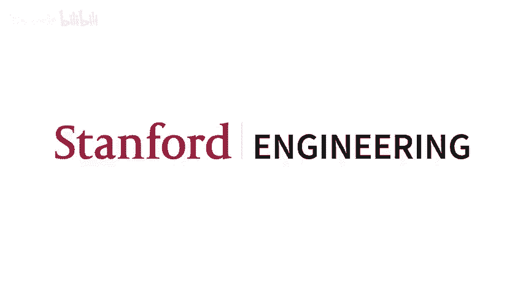
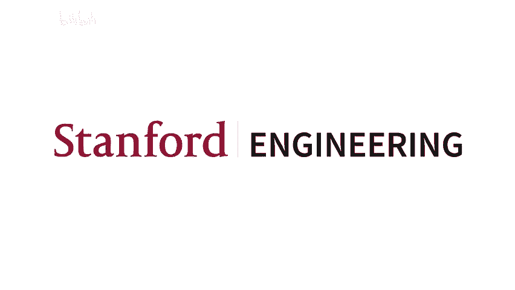

# P18：18.源于联合神经科学的人工智能 - life_code - BV1X84y1Q7wV

嗨，能在这里真有趣。所以我今天要展示的工作标题是“注意力应用体育分布记忆”。这是与 Drrens Peavvan 和我的博士生导师 Gabriel Kma 合作完成的。那么，为什么你应该关心这项工作呢？我们展示了启发式注意力操作可以以生物合理的方式，利用高维向量的简单属性来实现。

所以，正如你所知，变压器和注意力机制是极其强大的，但它们是通过启发式方法开发的，softmax 操作和注意力机制尤其重要，但同样是启发式的，因此我们展示了用于运动学生记忆的超球体交集在理论上和一些训练变压器的实验中，近似地反映了 softmax 和注意力机制。因此，你可以看到 SCM 应该在大约 30 年前通过预先注意的方式读取记忆，而这项技术是在 1988 年开发的。这令人兴奋的是，它满足了生物学上的高可信度标准。希望我有时间实际深入到小脑的连接结构，以及如何将每个操作映射到电路的某个部分。

首先，我将为您概述 Sprse 分布式记忆。然后，我会提供一个变换器注意力的总结，但我假设你们已经了解这些内容。我们可以先到那里，然后决定想深入探讨多少。我将讨论注意力如何实际近似 STM，并更广泛地解释变换器，然后希望有时间探讨 STM 的生物学可能性。

另外，我将保持所有内容在高层次的视觉直觉上，然后再深入到数学部分。不过请随时打断我，问任何问题，真的没问题。好的，所以分布式存储的动机是基于一个问题：大脑如何读取和写入记忆，以便稍后能够检索到正确的记忆。它考虑的一些因素包括高记忆容量、对查询噪声的鲁棒性、生物学上的可能性，以及某种容错的概念。

SDM 与您可能熟悉的其他关联记忆模型（如 Hopfield 网络）独特之处在于，它是稀疏的，因此在一个非常高维的向量空间中操作，并且存在于这个空间中的神经元仅占据了可能位置的很小一部分。它也是分布式的，因此所有的读写操作适用于所有附近的神经元。顺便提一下，如果您熟悉 Hopfield 网络，它实际上是稀疏分布记忆的一种特殊情况。我现在不打算深入探讨这个，但我有一篇关于它的博客文章。好的，首先我们将查看稀疏分布记忆的写操作。我们处在这个高维二进制向量空间中，目前使用的是 Cannon 距离作为我们的度量，稍后我们将继续讨论。我们有这个绿色模式，由实心和空心圆圈表示，这是假设的神经元。

也要将一切抽象地考虑，然后我们稍后会映射生物学，所以这个模式有一个红色半径。这是某种汉明距离，它激活了该汉明距离内的所有神经元。然后在这里，我只是指出这些神经元现在存储着那个绿色模式，而绿色模式已经消失。所以我用这种模糊的空心小球来跟踪这个位置，这将在后面变得相关。

所以我们在另一种模式下写作，这个橙色的。并且请注意，神经元可以在内部存储多个模式，从形式上讲，这实际上是这些高维向量的叠加，而不是求和，因为它们的高维结构使得你不需要那种交叉步道，所以你可以这样处理。

但现在你可以认为它就像一个神经元，可以存储多个模式。嗯。最后，我们有第三个模式，它是蓝色的，我们在另一个位置写入。是的，所以再次强调，我们在跟踪原始模式的位置，它们可以是，但它们可以通过存储它们的邻近神经元进行三角定位。

所以我们已经写了三种模式，现在我们想从系统中读取。我这颗粉色星星的眼睛。它似乎是由一个给定的向量表示，该向量在空间中的某个位置激活了神经元。但现在神经元输出它们之前存储的模式，因此你可以看到基于这个位置，它得到了四个蓝色模式、两个橙色和一个绿色。然后它执行一个简单的多数运算，根据它所看到的模式进行更新。所以在这个例子中，由于蓝色实际上是多数，它将完全更新为蓝色。我稍后会对此进行更详细的 formalize，但这真的只是为了让你直观了解 SCM 的核心操作。

所以，将这与注意力相关联的关键在于抽象掉在后台运作的神经元，只需考虑这些圆的交集。因此，粉色主圆与每个右侧圆之间的交集意味着，这个交集是那些既存储该模式又被查询读取的神经元。

这个交集的大小对应于查询将要读取多少个模式。因此，我们正式定义这个圆形交集中的神经元数量为模式中神经元数量、查询中神经元数量及其交集之间的共性。好的，在我深入数学之前，有没有什么高层次的问题？

我不知道我能否检查一下，检查 Zoom 对我来说是否容易，抱歉，Zoom 的人，我不打算检查，好吗？是随机分布的，是的，是的，之后还有更近期的工作，他们可以学习并更新他们的位置瓷砖流形，但在这里你可以假设它们是随机初始化的二进制高维向量，好吗？所以这是完整的 SDM 更新规则，我将把它分解。

首先，你要清楚这是为了阅读，所以你已经将模式写入了你的神经元中。你做的第一件事是根据每个模式的圆形交集的大小来加权每个模式。每个模式都有一个圆形交集。然后，你对所有模式进行求和。😡

这些已经写入这个空间的内容，你只是对它们进行加权求和。然后通过你所拥有的交集总数进行归一化。最后，因为至少现在我们在这个二进制空间中，你会映射回二进制，仅仅是查看这些值是否大于一半。

好吧，我想知道人们对注意力机制有多熟悉。我看了你们之前的讲座，似乎水平很高。你们能为我写出注意力方程吗？如果可以，请给个赞。是的，好吧，我不会详细讲解，但我可能会比其他时候更快地讲。当我第一次做这个演示时，这就是变压器的最新技术，现在的进展真是有趣，我不需要告诉你们变压器有多重要。

所以。是的，我将使用这个例子，好吧，我将使用这个例子，这里是猫坐在空白处，因此在这个环境中，我们正在预测下一个令牌，即单词“数学”。因此，注意力操作有四个主要功能，首先是在这里，它生成所谓的键、值和查询，再次，我稍后会详细解释这个过程，我只是想先保持高层次的理解，然后我们将比较我们的查询与每个键。因此，单词“the”，即我们下一个预测的单词，作为我们的查询，我们正在查看它与每个键向量的相似度。

然后，我们基于这种相似性进行 softmax 归一化，以便所有的注意力权重加起来为一。然后，我们将它们的值向量相加，用于传播到下一个层或用于我们的预测。因此，从高层次来看，你可以认为这个查询词正在寻找名词及其相关动词，并且假设它与像“cat”和“sat”这样的词有很高的相似性，或者它们的键。因此，这会给予“cat”和“sat”值向量较大的权重，这些权重会被传递到网络的下一个部分，而“cat”值向量假设上包含了其他动物（如老鼠）以及可能与“mat”押韵的词，而“sat”向量也包含了包括“mat”在内的坐着的东西。因此，从关注“cat”和“sat”的值向量中，你实际上得到的是类似于三倍的“mat”加上一倍的“mouse”加上一倍的“sofa”，这再次是一个完全假设的例子，但我想强调的是，通过关注，你可以从你的值向量中提取出对预测下一个标记有用的东西。

所以特定的键。嗯。对。所以我想另一个要点是，你所关注的某些内容和实际提取的内容可能不同，你关注的是你的键，但你得到的是你的值向量。好的。这里是完整的注意力方程，上面的行我把投影矩阵 W 下标分开，你支付 Q，第二行我只是把它们合并成新的 OAC。

是的，所以将其拆分，第一步是我们比较我们的查询向量和我们的键之间进行点积，这实际上应该是一个小的人力资本，所以我们在它们之间进行这个点积，以获取相似度的概念。接着我们应用 Somax 操作，这是一个指数和指数和的操作，思考 Som 的方式是它只是让大的值变得更大，这在与 SE 的关系中将是重要的，因此我在这里花一点时间。在顶部，我有一些超项，索引从零到九，然后在第二行中是每个项的值，我只是对它们进行正常化，所以顶部的项变为 30%的值，但如果我改为使用 Somax，这取决于 beta 的共定义和 Somax，但值变为 0。

所以，这里你的分布峰值可以看作是一种思维方式，这对注意力是有用的，因为你只想关注最重要的事物或附近的事物，忽略那些更远的东西。因此，一旦我们应用了我们的 softm，我们就只需对我们的值向量进行加权求和。

实际上提取并传播到下一层。嗯。好的，那么这是。完整的方程。我稍微快速地讲了一下，乐意回答你们的问题。可是我觉得你们一半会，一半不会。好的。那么，变压器注意力是如何近似稀疏分布式记忆的呢？

这件我提到的三十年前的事情在生物上是可信的。所以，是的。我接受这种可能性，所以我会在最后提到这一点。注意力也是在所有注意力的意义上，而不是。😊。我认为我在这里展示的注意力公式是经过开发的。

我的意思是，你需要关注的只是重点，但 Benjiio 在 2015 年发表了一篇论文。那是首次以这种方式写的。如果我错了，请纠正我，但我很确定。我的意思是，我想这特别的一个，这就是我问这个问题的原因，因为不。这是个好问题，你展示了两种可以被归类为注意力提案的不同方法，它们是相同的，就像他自己肩负的那样。

其中一个喜欢。是的，正是这样，我将展示 SDM 在神经层面与电路之间的良好映射，然后现在它与注意力之间有联系，我想你提到的其他注意机制是个好观点，这是主导的机制，但我认为这并非巧合；像计算的 Somax 成本很高，并且还有很多工作，比如 Lformer 等，试图摆脱 Somax 操作，但效果都很差，现在 Twitter 上有很多玩笑，称试图摆脱 Somax 的人就像掉进了黑洞，所以看起来这些和其他版本的变压器在同样的方式上不够扩展，因此这个特定的注意力方程式显得很重要。

但是就像之前那样往回说，如果这真的很重要，那么 SDM 实际上是错过了你。因此，我认为重要的是你有这种指数加权。你真的在关注那些重要的事物，而忽略其他一切，这正是 SDM 所近似的，可能会有方程式，但我想说的是，Soax 似乎确实很重要，而这个方程式似乎非常成功，我们还没有提出更好的公式。

是的，这个问题很好，所以事实证明，稀疏分布记忆在你将查询和模式分开时，就像你把这些圆圈拉开一样，读取和亮起的圆圈之间的交集中的神经元数量在一个足够高维的空间中大约是指数衰减的。在这个右侧图中，我把蓝色和粉色圆圈拉开，X 轴是我拉开的过程，Y 轴是交集中神经元数量的对数尺度，因此在对数尺度上这是线性图，它是指数的。

这适用于特定的设置，我有 64 维的餐向量。这就像在 D2 中使用的一样，它适用于许多不同的设置，特别是更高维度，现在用于更大的变压器。好的。所以我有这个圆交叉方程的简写。

我将展示的是圆的交集大约是指数级的，因此我们可以用两个常数 C1 和 C2 来表示，外面的那个因为你在归一化 softmax 时是对某些指数进行指数运算，这将抵消重要的部分 C2，而你可以很好地用在 softmax 中使用的 beta 系数来近似它。

所以是的，我想我会首先关注 SEM 的二进制原始版本，但我们也会开发一个连续版本。好的，所以是的。使这个圆形交集和指数衰减有效的两个因素是你需要映射到注意力，即你需要某种连续空间的概念，因此你可以使用这里的这个方程将距离映射到离散的相似性值，其中的帽子表示向量是 L2 标准化。

然后你可以在左侧写出圆的交集方程。这个指数与这两个你需要学习的概念有关，然后通过转换 C2 来重写它，看看。你可以将其写成贝塔系数。让我来展示一些图，是的，你需要正确的系数，但你可以用对数线性回归和闭合形式来拟合它。啊。我想在这里展示一张图。是的，好吧，蓝色是我们在两个不同的 he 距离下的圆交集，都是使用 64 维向量，而橙色是我们的实际 StockAx 注意力操作，其中我们拟合的贝塔系数表明，注意力使用的 hem 距离等于 SEM 使用的 hem 距离。你可以看到，主要图是归一化权重，简单地相加后除以 1，而这里是对数图，你可以看到在未对数化的空间中，曲线相当吻合，你可以看到对于较高维度，抱歉，更大的 he 距离。

你看到的对数图在这里出现下降，圆形交点不再呈指数形，但实际上这并不是问题，因为下降的点大约在**20**这里，你基本上对任何那些点的关注都微不足道，因此在指数法则重要的范围内，这个近似是成立的。

对对，对刚刚就说这是感觉。是的，没错，我只是想实际展示一下，想在这里获得一些基础知识。所以我们在这里做的就是，我们处在一个原始的 EM 二进制空间，利用这个映射来计算余弦相似度。

然后你需要做的就是拥有贝塔系数，然后你可以将你的贝塔系数和注意力视为决定 PP 事物的程度。这与您在华盛顿进行阅读和写作时使用的圆圈的距离直接相关。

所以，是的，要在这个幻灯片上以数学方式展示这一点，我没有使用任何技巧。我只是用模式和查询的 SEM 符号重写了注意力。因此，这个小框框并没有做任何事情。而这是关键幻灯片，我们在这里更新我们的查询。左侧的内容。

我们的注意力方程用 SE 符号表示，我们扩展了子轴。然后主要的陈述是，如果我们用角落世纪方程的 SMM 替换掉指数，这个方程是紧密近似的。是的。因此，为了使这有效，你需要的两个东西是：第一，你的注意力向量。你的键和值需要进行归一化处理，然后。你想要。

如果你决定了 SEM 的距离，那么我会深入探讨这些距离适用于不同的事物。然后你需要有一个与之相关的 beta 系数。但再次强调，这到底是你想关注多少个事物？所以，是的，作为一个简短的旁注，你可以使用连续向量编写 SDM，然后不需要这个映射来关注相似性。

所以这里我再次展示了这些图表，但添加了这个。我增加了这个。绿色的橙色已经翻转，但我在这里也增加了连续性。而连续版本的好处在于你实际上可以将**Srse**分布式内存写成一个多层次的概念框架，假设略有不同。我现在不打算讨论这个，但这是**Spe**分布式内存作为持续学习者的一个特点。

这被添加到了附加阅读材料中，抱歉，这里不应该说 ICML，而是应该说 ICl。它刚刚被接受为今年的声明。好的。那么训练变换器是否使用我提到的类似于 SDI 的这些贝塔系数呢？根据你设置 STM 的距离，对于某些事情来说，效果更好，这并不令人惊讶。

例如，你只是想尽可能多地存储记忆，而你假设你的查询不是嘈杂的，或者你假设你的查询确实很嘈杂，因此你无法存储太多，但你可以从远处检索，并且如果注意力机制的变换器在实现先前的分布式记忆时。

我们应该预期看到变换器使用的 beta 系数与这些良好的 SDM 实例相对应，因此我们有一些微弱的证据表明情况确实如此。这是注意力的关键查询归一化变体，在这里你实际上可以学习到你的 beta 系数。

通常在变压器中，你不会这样做，但你不需要将向量延长，因此你可以有这样一个有效的 beta 系数。在这种情况下，这只是一个更清晰的实例，我们实际上是在学习 beta，而这是在多个不同的翻译过程中进行的，我们跨层学习 beta 系数。

并将其绘制为直方图，红色线条对应于三种不同的火花分布式内存概念，适用于不同的情况。再次强调，这是微弱的证据，因为无法推导出最佳的 SM beta 系数或相应的处理距离。

我们需要假设在这个高维空间中存在随机模式，显然现实世界的数据并不是随机的。然而，看到所有数据系数都在范围内是很不错的，第二，它们偏向于最大查询噪声，这在处理复杂的现实世界数据时更有意义，因为你接下来看到的数据点可能会超出它们过去所见的分布。

最大内存容量变体假设没有任何噪声。因此，就像我可以假设在提问时系统的问题是完美形成的，我能放入多少东西。好的。稍微谈谈变换组件更广泛的内容。我提到过，你可以将前馈层写成一种具有某种长期记忆概念的 SDM 版本。

嗯。还有层归一化，这在变压器中至关重要，和 SDM 所需的高度归一化不完全相同，还有一种关键查询归一化变体，它明确地进行这种高度归一化，至少在他们进行的小测试中，它确实获得了稍微更好的性能，我不知道这是否适用于更大的模型。

所以我想这项工作之所以有趣，是因为我即将提到的生物可行性，以及与变压器的联系。到目前为止，它并没有改善变压器架构，但这并不意味着这个视角不能以某种方式被使用或有用。嗯，是的。我列出了几个与 STM 相关的其他方面，这些方面可以用来引导进入，实际上在新的工作中，STM 是一个持续学习者。

我们扩展了小脑电路，查看其组成部分，特别是抑制性中间神经元。将这些实现到深度学习模型中，它在持续学习方面表现得更好，因此这是一种有趣的方式，实际上利用这个联系来提升最终的性能。

好吧，这一节的总结基本上就是两个超球体的交集近似于指数，这使得 FM 的读写操作在理论上和我们的有限测试中都能近似于注意力，因此，从大局来看，可能会出现的一些研究问题是，变压器之所以成功是否因为它执行了一些关键的认知操作。

小脑是一个非常古老的脑区，大多数生物包括果蝇，甚至可能还有头足类动物都在使用它，这一过程经历了发散但现在趋同的进化。考虑到变压器在经验上如此成功，SDM 究竟是否是小脑功能的正确理论，这仍然是一个悬而未决的问题。

随着我们对小脑了解的越来越多，目前没有任何证据否定 SDM 在这里的作用，我认为我可以大胆地说，这是一种更具说服力的理论，解释小脑是如何实际工作的。是的，我认为这项研究激励我们去探讨更多这样的问题。

这两个问题都更加严肃。嗯，好吧。我们有时间吗？

很酷，这是实现 SDM 的电路，底部有用于读取或写入的模式。实际上，我对这些幻灯片进行了分析。好的，是的。所以首先我们有输入的模式，每个神经元在这里。这些是每个神经元的树突。它们正在决定是否对输入信号进行放电。

然后，如果神经元确实发火，而你以那种模式在写。😡，那么你同时。我要在这里解释，这真是疯狂，大脑并不这样做，然后我希望能触发你，不仅需要让模式激活神经元。

但是你需要有一个单独的行来告诉神经元该存储什么。就像你在键和值之间存在差异一样，这里它们可以是表示不同事物的不同向量，你可以有一个输入的键来告诉神经元何时激活，而对应的值则是它实际上应该像是飞翔一样，然后放入层。

这被称为异构关联映射。然后，一旦你从系统中读取数据。你的查询也会在这里到达，激活神经元。然后这些神经元输出它们存储的内容，而神经元向量是存储的特定列，作为提醒。它在超连接中存储了模式，然后会将它存储的内容通过这些输出线路转储。

然后你有这个 G 主导位操作来转换为零一。决定神经元是否会发放信号。因此。这里是相同的电路，但我叠加了细胞类型和 ce。因此。我会回到这张幻灯片，因为大多数人可能对 Sarahbeller 电路不太熟悉。它在水中，所以小脑是相当均匀的，并且整个过程遵循这种模式，此外，大脑和小脑中约有 70%的神经元很小，所以你不会知道，但小脑是非常被低估的，并且有大量证据表明它与大多数高级处理具有闭环系统。现在，如果你的小脑受损，你更可能出现自闭症等情况。

等等，因此它的功能远不止于许多人过去所认为的精细运动协调。好的，输入通过这里的大部分纤维与颗粒细胞相连接，这是一个主要的投射，那里有大量的颗粒细胞。

每个颗粒细胞都有称为平行纤维的结构，这些纤维是极其细长的轴突，以 T 形结构分支。然后，它们会受到普金杰细胞的冲击，这些细胞可以接收多达 100,000 个平行纤维输入。这是大脑中连接性最高的部分。

然后，普金基细胞将决定是否发射并向下发送输出。因此，这就是整个系统，父母参与并决定它们是否发射，以及它们输出自己的方式。然后你会有一条独立的右线，即爬升纤维。爬升纤维向上延伸，它们的连接非常惊人，重要的是，它们并不是非常强的，真正重要的是它们向上延伸并缠绕在个别的树突细胞周围。

而且纤维与普金细胞之间的映射几乎是一一对应的，至少是一个非常强的特性。因此，你在这里与我们连接，所有这一切都是对的。哦，原来有来自不同区域的独立神经元，特别是进入深小脑核，像是在小脑的核心，然后反馈给更高阶的大脑区域，或者像是肌肉运动等等。很多人会认为小脑就像是一个精细调整的查找表，你已经决定了想要的肌肉运动，但小脑会进行一系列调整，使其更加准确。不过，这似乎也适用于下一个词的预测，我们有 FMRI 数据支持这一点，一个神经科学家说，fMRI 的一个小秘密就是小脑与所有事物相一致。所以，好的。

那么回到这里的电路。是的，时间尺度或操作方式，我是说。信息存储和检索的时间有多长？我们对此有任何了解吗？就像只需几毫秒，还是有一个信息工作系统，所以主要理论是你需要通过更新。

时间依赖性塑性，其中你的爬升纤维会在你想要的事情发生之前或之后发放信号，因此这会更新长时程的突触，以促进进展或增强。因此，无论时间如何，爬升纤维上发生的事情都会产生非常大的动作电位，或者导致大量的解决。因此，我确实认为你可以获得相当快速的突触更新，并且这些更新也能持续很长时间，我认为这一点是可以确认的，但就像你生活的其他部分一样。

是啊。那么这个电路真正独特的地方在于你有这两个正交输入，其中有损失光纤将信息传入，以决定神经元是否可以激发。但是还有完全独立的量子光纤线路，可以更新特定神经元及其存储的内容，之后再输出。然后原型细胞是如此重要，它在每个神经元之间进行冷却，每个神经元记住以这种方式存储向量。

所以原始细胞正在进行逐元素求和，然后决定是否发放信号。这使你能够将向量存储在叠加状态中，之后再进行去噪。哦。这一切理论在地图上与 Mar 和所有关于太阳 vlor 功能的理论映射得相当好。这些理论仍然非常主导，如果有人从那里了解到这些，甚至那些模拟神经元的 SDM 和你之前介绍的内容，每个细胞的每个神经元基本上都是一个粒子歌曲的设置。

好的，然后是神经元的位置。这些空心圆圈对应于这里的胶质细胞树突。出现的模式对应于修饰符的激活，努力的突触连接与每个细胞有关。因此，它实际存储的是与每个细胞的突触连接。

在那个接口上。然后，prokee 单元主要进行决定是否失去火力的位操作。是的，我想我们基本上进入了提问时间，非常感谢。嗯，可以。嗯，还有件事。我对那个存在一无所知，但似乎它已经被使用很长时间了。我很好奇你的假设是什么，系统又是什么？

我们应该做的短期数字交付。因为似乎是这样。如果你有这个链接的变换器。是的，我认为长期记忆。让我们关注短期记忆，因为对我来说似乎是这样。我们现在在提示上下文中这样做，但我们如何能直接将这些融入进来，是的，是的。

所以这项工作实际上更关注短期记忆与注意力操作的关系，但你可以重写 SDM。它几乎更自然地被解释为一个多层感知器。它就像在其神经元之间进行一种 softax 激活，或者一种 top pay 激活，稍微复杂一些。但。是的，所以。是的，你听到的最有趣的事情是，我只有一堆神经元。

在这个高层次的思维空间中激活附近的神经元时，你会获得这种指数加权。这就是盐质量，然后因为这是一个关联记忆，就像你有键和值。这就是注意力。是的，我想我最想强调的事情是，大脑实际上能够相对容易地实现注意力操作。注意力操作，仅仅使用高维向量并激活你的后部。

所以这对于短期和资金来说是好的，如果你真的想用 SEM 来吸引注意力。是的，让我快速回到最初。这很重要。对 SDM 有两种看法，我不认为你在讨论时在场。我看到你稍晚才进来，这完全没问题，但哦，太好了，太好了。

好的，有两种方式来看待 SDM，一个是神经元的视角。这就是这里的观点，实际上这就是课程中正在发生的事情，唯一不变的是错误模式，然后是基于模式的视角。这实际上就是注意力在做的事情。因此，在这里你是在抽象神经元，或者假设你是在幕后操作。

但实际上你计算的是你模式的真实位置与查询之间的距离，这两者各有利弊。这样做的好处是你能获得更高保真的距离，确切地知道查询与某些原始模式的距离，而这在你决定更新方向时非常重要；你真的想要清楚什么是最近的，什么是更远的，并能够直接应用指数加权。问题在于你需要存储所有模式的限制并进行操作，这就是为什么变换器在上下文上有限的原因。另一种视角是长时记忆，其中你忘记了模式，只关注存储了一堆模式的神经元。这种方式下你实现了叠加，因此你无法真正模拟你原始模式是什么样的，结果也会变得更加嘈杂。

但你可以存储成百上千的数据，而不受上下文窗口的限制。或者你可以将任何惩罚层视为在嘈杂的状态叠加中存储整个数据集。是的，希望这能回答你的问题。我想这里有一个，然后是的。所以我想我的问题是这样的。所以我想你展示了现代的自注意机制是如何映射的。

SVM 机制似乎是可能的，并且某些方面看起来像现代当代理论，例如如何将 SDM 实施落到实处。我想问的是，这种情况在多大程度上存在呢？

像实验验证与之前提到的那样，实际上使用 MLP 层可能比这些机制更简单，那么实验者是如何区分假设的，比如说我并不完全清楚的一件事是。

对。即使大脑无法集中注意力，或者像 SM 那样，这并不意味着它一定会这样，因为也许它无法做到这一点。那么，这到底是如何被彻底测试的呢？是的，关于背景这一点。你不必在这里进行测试，因为你有可以直接提供训练信号的攀爬纤维。

通过你的喜好，选项存储在这种情况下。就像是一个监督学习任务，对于资金的削减，它想要写什么，或者如何更新就像细胞所看到的。但对于你更广泛的观点，你基本上需要做的就是测试这一点，你需要能够进行实时学习。果蝇的蘑菇体基本上与神经元相同，而果蝇脑数据集已经完成了大部分个体神经元的连接性。但你真正想做的就像任何体外的实时超级学习。

超高帧率的钙成像技术能够观察突触如何随时间变化，适用于如关联学习任务等场景。听到一个声音向左移动，再听到另一个声音向右移动，或者嗅到某种气味，呈现出类似的痕迹，找出那些发火的小子集神经元，我们知道这只是一个小子集。因此，通过最终的距离解释，我们可以看到科学如何更新，以及其输出如何与运动行为的变化相对应，然后消除那个数字，正确地更新新的数据，再次观察这一过程消失。我们的摄像头速度越来越快，钙指示剂和电压指示剂的性能也在不断提升，希望在未来三到五年内能够进行一些这样的测试，我认为这将是非常具有决定性的。

是的。是的，我们还有其他问题吗？我想还有一个，然后我应该……你不会把他们像这样最终的医学生物实现镜像化，你所映射的范围是什么。明白了，所以我不会混淆多头性，因为那是不同的注意力头，各自进行自己的注意力操作。有趣的是，脑盖有麦克风，可以认为它们在某种程度上像独立的注意力头。我不想把这个类比推得太远，但确实有点有趣，所以你与此的关系是。

在注意力机制中，你有你的 beta 系数，即有效 beta 系数，因为你的键和值的向量范数并不相关。这对应于一个指向，并且这里对应于任何给定输入时开启的神经元数量。

啊。那么你想要的海明距离，我之前有那张幻灯片。你想要的海明距离取决于你实际上想要做什么，如果你并不打算存储那么多记忆。例如，你将会有更高的海明距离，因为你可以在那个嘈杂的交叉点获得更高保真度的计算。是的。很酷，嗯，非常感谢。所以作为免责声明。在介绍我们的下一位演讲者之前，先说明一下。

这个人原定的日程不幸因为最后一刻的教职面试而取消了。所以下一位演讲者非常友好地同意在最后一刻进行演讲，我们对他非常感激，所以我想向大家介绍 Will。Will 是伦敦大学学院盖茨比单元的计算神经科学和机器学习博士生。我不知道是否有人听说过盖茨比单元，我有点历史爱好者或者说历史极客，取决于你怎么说。盖茨比单元实际上在 90 年代和 2000 年代是一个令人难以置信的强大中心，Hinntton 曾在那里，Zubin Gurimani 也曾在那里，他现在负责谷歌研究。我认为他们做了大量出色的工作。现在我想邀请 Will 谈谈如何构建认知地图。

你想分享你的屏幕吗？好的，你能站在这里吗？让我停止分享。

好的。所以我将要介绍这项工作，它是关于我所在小组的人如何研究海马体神经系统的。结果发现它与变压器有些相似，所以我将要讨论的这篇论文描述了这个联系，这篇建立这一联系的论文是由这三位作者撰写的：詹姆斯是一位斯坦福大学的博士后，他是一位牛津大学和伦敦的教授，而乔是一位在伦敦的博士生。

😊，所以这个模型所要解决的问题是，海马体进入我们系统的观察，基本上是世界上有很多结构，我们应该利用这些结构来快速在任务之间进行泛化。我所指的就是，你对 2D 空间的理解是因为你在这个世界上生活了很长时间，所以如果你从这个温室出发，向北走，就会看到橙色的一个和红色的一个，然后再想想，因为 2D 空间的结构。

😊，你可以在心里想，哦，如果我向左走会发生什么，你知道你会最终回到绿色的那个，因为这种类型的循环在二维空间中是封闭的。好的？😡，而这，你懂的，也许这是一座你刚到的新城市。

这就像是零商店的概括，因为你某种程度上意识到这个结构更广泛地适用，并在新的上下文中使用它。😊，是的，通常会有很多这种情况，其中结构在世界上不断重现。

所以会有很多情况，其中相同的结构对于执行这些任务是有用的，比如零-shot 泛化来预测你接下来会看到什么。😊，好的。那么你可能会看到我们已经开始将其映射到某种序列预测任务，这听起来有点像变换。

这意味着你接收了一系列类似的观察，在这种情况下，是动作。在空间中的运动，而你的工作是给定一个新的动作步骤，你必须尝试预测我们将要坐的地方，所以这就是那种序列预测的版本。😊，我们将尝试解决这个问题的方法是基于因式分解。

这就像你不能只在一个环境中学习该环境的经验。你必须分离出结构和你所经历的经验，以便可以重用在世界上经常出现的结构部分。

😊，好的，所以是的，将记忆与结构分开，你知道的。这是我们对两者的分离，我们有个家伙在这个二维网格世界中游荡。你想要区分的是，存在二维空间，并且这个二维空间有其基本规则。而在你所处环境的特定情况下。

你需要能够记住环境中哪些物体位于哪个位置。好的。所以在这种情况下，就像，哦，这个位置有一栋橙色的房子，这个位置。😊，抱歉，Greams。橙色。红色和粉色，所以你必须把这两个绑定在一起。你必须在意识到自己回到这个位置时，回想起你将在那里看到的观察。😡，好的。

因此，他们要构建的这个模型是一个试图实现这个目标的模型。是的。新的开始，所以当你进入时，想象你进入一个结构相同的新环境。你四处游荡，意识到它的结构是一样的。你要做的就是将看到的新事物与位置绑定，然后你就明白任务了，你知道世界是如何运作的。

😊，神经科学家所说的认知地图是指将事物分开并理解其结构的理念，以便在新情境中重用。而且，实验室构建的这个模型是关于这一过程的模型，描述了它们之间的分离，以及如何利用它们进行新的推理。这部分应该看起来像一个转换，这就是一般介绍，接下来我们将深入探讨一下。

😊，虽然有道理，但总体来看是这样的。很好。沉默，我假设是好的。那么我们先从一些大脑相关的内容开始，因为在空间导航方面有大量证据表明大脑在进行类似的处理。我想你可以想象，当你去一个新城市或者试图理解一个有你之前认知结构的新任务时，你自己如何在进行这样的处理。空间导航在神经科学中占据了重要地位，过去大约 50 年中有大量发现，并且有许多关于这种计算的神经基础的证据。所以我们将讨论一些例子，还有其他心理学家，比如 Tllman，他们展示了老鼠可以进行这种路径整合结构。这项工作的方式是，他们被放置在这里的起始位置，使用 RMS 进行训练，让它们了解到这里的路径可以获得奖励，所以这是我们必须绕行的迷宫。

😊，然后他们被问到被放在这个新的环境中，情况是一样的，但他们封锁了这条通往漫长曲折路线的路径，而是提供了所有这些可以选择的分支，他们观察老鼠选择哪条路径，结果发现老鼠走的是朝这个方向的路径。因此，老鼠似乎不仅仅是学习一个选项，而是像盲目记忆一样，知道自己需要采取的行动来探索，而是实际上在学习，将奖励嵌入其中，理解 Trudy 的脸，并选择一条直接的路线，尽管它之前从未走过。有证据表明老鼠也在这样做，和我们一样。

然后关于这个基础的一系列神经发现。所以约翰·奥基夫在海马体里插入了一个电极。这个脑区我们会进一步讨论，他发现了被称为位置细胞的东西。因此，我在这里绘制的每一列都是一个单一的神经元，而小鼠或我记不清是哪个正在一个方形环境中跑动，黑线是啮齿动物随着时间描绘的路径，每当你看到这个个体神经元发放时，就会在上面放一个红点，而底部的图是这个发放活动的平滑版本。你可以把这个发放率想象成神经元和神经网络的活动，这是人们通常所绘制的类比。这些被称为位置细胞，因为这些神经元在特定空间位置上有反应。多年来，这曾引起巨大的兴奋，人们主要研究感觉系统和运动输出，而突然间，深层认知变量的位置变得重要。你没有 GPS 信号，但不知怎的，大脑中有一种信号可以理解为位置。

😊，我猜这次发现链中最大的一步是 Mosa 实验室。这个实验室位于挪威，第二次讲座涉及大脑的不同区域。媒体内嗅皮层，因此我们将讨论的这个是海马内嗅系统，他们发现了一种被称为网格细胞的神经元。因此，这里展示的图结构是相同的，但这些神经元不是在房间的一个位置响应，而是在房间内呈六角格状的多个位置响应。

😊，好的，所以这两个，我想我向你展示是因为它们确实激发了这种空间认知的神经基础，以某种方式体现了这个空间的结构。😊，好的，而且这个发现非常令人惊讶，为什么神经元选择用这种 Xmatic 来表示事物，确实引发了很多研究，并且在这个领域已经有了更多的发现，所以有位置细胞，谈论网格细胞，响应的细胞根据你不是自己而是另一个动物的位置，响应的细胞当你的头朝着特定方向时，响应的细胞在离某个物体特定距离时，比如说我在某个物体的南边一步，这种细胞。

😊，对奖励位置做出反应的细胞，细胞对边界的向量做出反应。对各种各样的结构做出反应的细胞，这对大脑结构的配对。这里的海马体，这个红色区域，以及这里的内嗅皮层，这个蓝色区域。许多物种中保留下来的这些结构被表示出来。

这里还有一个有趣的发现，他们对伦敦出租车司机进行了 FMRI 实验，不知道你是否注意到。伦敦的出租车司机要进行一个叫做“知识”的测试，这是一个为期两年的测试，他们必须学习伦敦的每一条街道。测试的内容大致是这样的：哦，这里有交通堵塞，这里有施工，我需要你从卡姆登镇到沃恩斯沃斯以最快的方式走，你会选择哪条路线？他们必须告诉你他们将通过哪些道路，以及如果遇到阻碍他们将如何重新规划路线。这有点像是一种紧迫感，你可以看到他们有时驾驶着汽车学习所有这些路线，手里拿着小地图。尽管他们正在被谷歌地图稍微取代，但幸运的是，在这个实验进行之前，他们还没有被取代。因此，他们在实验中测量了使用 FMRI 的海马体大小与你作为出租车司机的时间（以月份计算）之间的关系，基本上，作为出租车司机的时间越长，海马体越大，因为你需要进行更多的空间推理。

😊，所以这是一大堆证据表明这些大脑区域与空间有关，但还有很多证据表明在这些区域中发生着某种超越空间的事情，好吧，我们将把这些结合起来，做出更广泛的关于这种潜在结构推理的主张，因此我将讨论其中几个，第一个是一个叫做病人 HM 的人，这是医学史上研究最多的病人，他有癫痫，而治疗癫痫需要切除导致这些类似癫痫发作的大脑区域，在这种情况下，癫痫源自他的海马体，因此他们切除了双侧海马体，结果发现这个人随后出现了严重的健忘症，他再也无法形成新的记忆，只能回忆起手术发生前很久的记忆。

😊，好的，但实验显示了很多关于我们如何理解记忆神经基础的东西，比如他能学习做运动任务，因此某种程度上运动任务是被完成的。例如，他们给他一些非常困难的运动协调任务，这些任务一般人通过大量练习也很难做到，而他最终变得非常擅长，和其他人一样，学习去做这个任务，但他对自己做过的任务没有任何记忆。他会去做这个新任务，然后说：“我从来没有见过这个，我不知道你让我做什么。”然后他做得非常好，这里有一些证据表明海马体至少在某些记忆部分中是参与的，这似乎与我之前跟你谈论的空间内容有些分开。

😊，第二个是想象事物，这实际上是一篇由 Deisa Sabbth 撰写的论文，他在成为 Deep Mind 的科学家之前是一名神经科学家。这里也许你看不清楚，我来读一些内容，你被要求想象你躺在一个白色沙滩和美丽热带海湾上。因此，控制下方的内容说了一些，比如“非常热，阳光照射在我身上，沙子在我身下几乎热得难以忍受，我能听到小浪花拍打沙滩的声音，海水是迷人的海洋色，非常漂亮”。这种对美丽场景的清晰描述，而有海马损伤的人则说：“至于看，我几乎什么也看不到，除了天空，我能听到海鸥的声音，能感觉到沙粒在我的手指间。”

😊，然后就像，是的，挣扎基本上就是为了想象这个场景。这些事情读起来非常令人惊讶。最后这个是**传递推理任务**。😊，所以在推理方面，A 大于 B，B 大于 C，因此 A 大于 C。😊。

它们将这一实验转化为啮齿动物实验的方式是，你会得到两个有不同气味的食物罐，而你的任务是去找出哪个食物罐有食物，抱歉，哪个气味的罐子里有食物。因此，这两个罐子被标记为气味 A 和 B，啮齿动物需要学会去特定的罐子，在这种情况下是气味为 A 的那个。他们进行两次实验，当 A 与 B 配对时，A 有食物，而当 B 与 C 配对时，B 有食物。然后他们测试当老鼠面对 A 和 C 这种全新的情况时会怎么做，他们说有海马体的老鼠会选择 A 而不是 C。

他们进行传递推理的方法是，如果没有一个，他们会删减。因此，有一个更广泛的集合，这就像，哦。我已经向你展示了如何使用 hip campusampus 来处理人们对此空间内容的兴奋。但还有所有这些关系方面的东西，想象你的情况。

里面有一些稍微复杂的故事。😊，我最后要做的是关于内嗅皮层的，如果你记得海马体，那么这些内嗅皮层是这些网格细胞，内嗅皮层似乎在做一些更广泛的事情，这一切都是模型的动机，只是试图将所有这些东西结合在一起。

😊，所以这个任务叫做“拉伸鸟类任务”，好的，所以你把人放进 FMRI 机器里，让他们在鸟类空间中导航。鸟类空间是一个二维图像空间，每张图像都是一种鸟。当你在 X 维度上变化时，鸟的腿会变长或变短；在 Y 方向上变化时，鸟的脖子会变长或变短。患者坐在那里，受试者看着鸟类图像的变化，这描绘出二维空间中的某些部分，但他们从未看到过二维空间，只是看到了图像。基本上他们被要求完成某种导航任务，比如说，哦，每当你在二维空间中的这个位置时，你会看到圣诞老人和鸟在一起。所以参与者必须将特定的鸟类图像与二维空间中的圣诞老人对应起来，并被要求使用某种非定向控制器再次找到圣诞老人，他们就这样导航回去。

😊，而且这个说法是，这些人使用网格细胞，因此内嗅皮层在这些人导航这个抽象的认知鸟类空间时是活跃的。你验证这个说法的方法是观察参与者在鸟类空间某个特定角度时内嗅皮层的 FMRI 信号。

由于六边形晶格的六重对称性，你会看到这种六重对称的上下波动的**外侧皮层**活动，随着你在二维集合中特定方向的移动。这就像是证据，表明这个系统不仅仅用于二维空间中的导航，而是用于任何具有某种潜在结构的认知任务。

你用它来做这些人们还没有做过的实验。但人们确实做过一些事情，比如观察网格细胞，但他们没有做到。😊。他们做过三维空间的研究，但不是像认知三维空间那样。他们确实做过，比如在蝙蝠身上进行研究。

他们粘贴电极在蝙蝠身上，让蝙蝠在房间里飞，看它们的网格细胞如何反应。嗯，确实如此。😊，我认为他们在序列空间中已经做到这一点。所以在这种情况下，你会听到一个具有层级结构的声音序列，就像月份一样。

周、天和餐，这样的东西，所以像周有一个周期结构，月有一个周期结构，天有一个周期结构，餐也有一个周期结构，因此你听到的声音序列正好具有这种层级序列的结构。通过 fMRI 观察内侧颞皮层的表现，你会看到完全相同的结构被展现出来，甚至更进一步，你实际上会在内侧颞皮层看到一个长度尺度的阵列。在内侧颞皮层的一端，你会看到非常大尺度的网格细胞，它们对空间中的大变化作出反应；另一端则是小尺度的细胞，你会在那里看到相同的东西，比如餐的周期，这个周期在内侧颞皮层和 fMRI 中表现得要快得多，而月的周期则位于另一端，两者之间有一个尺度。因此，对此有一些证据。

😊，没问题，所以我一直在谈论 MEc，内侧内嗅皮层。另一个人们不太关注的脑区是 L，外侧内嗅皮层。但在这个模型之前，你需要注意的是，它似乎代表了非常高层次的相似性结构，外侧内嗅皮层似乎像是一个非常高层次的语义结构，例如。

你展示了一些图像，观察在视觉皮层中，如果它们看起来相似，事物的表示会更加相似。但当你猜测外侧内嗅皮层时，事物的相似性更多是基于它们的使用。例如，熨衣板和熨斗会被相似地表示，即使它们看起来非常不同，因为在某种程度上它们在语义上是相似的。😊，好的。

所以这就是 LEC 在这个模型中将要扮演的角色。嗯，基本上这个说法是，它不仅仅适用于二维空间。神经实现的这个认知地图，是不仅仅针对二维空间的，而这个漫画本来是要表现的就是这一点。

还有其他任何结构的事物，比如推理的结构。这种结构比那种结构更快，也比那种结构更快，或者像家谱这样的结构，比如这个人是我母亲的兄弟，因此是我的叔叔。这些东西。😊这些更广泛的结构推理，你希望在很多情况下都能使用，所以基本上是同样的问题。😡太好了，这在神经科学中有很多内容。😊现在我们要进入一个模型，它试图总结所有这些内容，这个模型最终会像一个变换。

所以我们基本上想要这种分离。这些图表应该代表你在其中游荡的特定环境，它具有潜在的网格结构，你在这些网格的每个点上看到一组刺激，这些小卡通图形。你想尝试创造一个东西，将这种二维结构网格与实际看到的体验分开，而我展示给你的映射是，这种网格状的代码实际上是中脑皮层中的网格细胞在以某种方式抽象出结构，侧脑皮层编码这些语义上有意义的相似性，将是你看到的物体。因此，这就是我在世界上所表达的内容。

😊，他们两者的结合将形成海马体。所以，嗯，还有其他图表吗？你有 G，结构代码，MEc Lc 中的网格代码，谁在问问题？😊。从早上开始，现在是 Strstein，是的。抱歉，如果你在问问题我听不见。如何将某人静音？如果有聊天的话，也许可以打字。嗯，对。很好。那么，是的。

我们在中间有一个海马体，这将是我们将它们两个结合在一起的部分。😊。好的。接下来我会逐一介绍这三个部分，以及它们如何完成我分配给它们的任务，然后再结合在一起展示完整模型。

所以侧内侧皮层编码你所看到的内容，就像我们之前看到的这些图像或房屋，那只是一个随机向量 Xt，对于每个事物都是不同的。😊，内部皮层负责告诉你在空间中的位置，并承担路径积分的任务，这意味着接收你在空间中所采取的动作序列。

例如，我向东北和南方移动，并告诉你在二维空间中的位置，所以这在某种程度上是嵌入世界结构的那部分。😡，我们将通过这个 G of T 来实现，这个脑区的活动向量将通过一个矩阵来更新，这个矩阵依赖于你所采取的行动。好吧，如果你向北走，你就用向北的矩阵更新表示，好吧，这些矩阵必须遵循一些规则。例如，如果你向北走并向南走，你实际上是没有移动的，因此向北的矩阵和向南的矩阵实际上是互为逆的，这样活动保持不变，并且代表世界的结构。

好的，这就是世界结构的部分。最后，关于记忆。因为我们必须记住我们发现了哪些东西，或者在 HiAcus 中将要发生哪些位置，这将通过你在最后一场演讲中提到的热场网络的某种形式来实现。

所以这就像是一种内容可寻址的记忆，并且在生物上是可行的，类似于游戏。它的工作原理是你有一组活动，P。这些是所有这些神经元的活动，当它接收到信息时，它就像是不断地自我更新。因此这里有一个权重矩阵 W，一些非线性，并且你将其向前运行在时间上，就像是进入了某种动态系统，它稳定到了某种吸引状态。

😊，你创建新记忆的方式是通过权重矩阵，好的。所以你将它表示为这些 chi mu 的外积之和，每个 chi 都有一些记忆。你想要回忆的某种模式。😡，好的。😊，然后是的，这只是把它写进去。更新模式就是这样，基本上声明是 FP，即记忆。

神经元的活动，海马神经元与某些记忆密切相关，比如 ku。😊。因此，这个文档产品将比其他所有文档产品大得多，包含所有其他成员。因此，它们的整体效果基本上会被这个术语 kinu 主导，因此你的吸引子在网络中将基本上会稳定在这个 ku 上。😡，而且可能会提前处理一些稍后出现的内容。

你可以看到这种点之间的相似性是如何存在的。是的，powerI 相似性，然后将它们加权后相加，这部分看起来有点像注意力。😊，所以你可以用这些系统做的一些酷炫的事情，比如这是一个被某人编码在热场网络中的图像集合，然后有人将这个图像呈现给网络，并要求它运行到其动态吸引子最小值，结果它重新创建了所有存储的记忆，所以它就像完成了剩下的部分。

😊，所以那就是我们的系统。是的，我很抱歉，这就像。就像他们看起来感觉像。我听说这种解释就像是现代解释。这实际上是保守的，抱歉，是的。😊。是的，是的，链接到变压器基本上只通过经典咖啡网络和现代网络来实现，现代网络大约在 2016 年，而注意力与现代之间的链接正是经典与现代之间的链接不是那么明确，我是说，是的，现代。

😊，没也没什么好。随着非线性变化的到来。因为那时你得进行指数运算。好吧，也许等会儿你可以告诉我一些不，不，不，更多的问题是好的。😊。我们会得到，是的，也许是分离的能量波动。我认为指数在其中。好的，没关系。所以这基本上是我们的系统将如何运作，但这个标志性的机器叫什么呢？所以你想在海马体中存储的模式，这些我们想嵌入的记忆是位置和输入的组合，就像莫尔的半张脸一样。如果你决定要到达特定位置，你可以回忆起你在那里看到的刺激，并将其预测为你的下一个观察，反之亦然。如果你看到一个新东西，你可以推断出，哦，路径整合错误，我实际上应该在这里，假设那是，但世界上通常会有不止一件事情可能在不同的位置。

是的。😊，对，这就是整个系统，汤姆和 Iicenba 机器大致是这样运作的。😊，好的，基本上最后这一部分是在说它真的很好，所以我在这里展示的是 2D 导航任务，它是一个大网格，我想他们使用的是这样的。

😊，11 乘 11 或类似的情况，就像在新环境中四处游荡，需要预测接下来会看到什么，这里是你在该图中访问的节点数量，Y 轴表示你预测的正确程度，每条线基于我之前见过的那些环境的数量，展示了我学习的速度。基本现象是，随着时间的推移，当你看到越来越多的环境时，你学会了学习，像是了解世界的结构，最终能够迅速泛化到新的情境，预测你会看到什么。这个尺度与访问过的边的数量无关，那将是“学习一切”的选项，因为如果你试图预测在当前状态和动作下会看到什么，以一种笨拙的方式，你只会看到所有状态和动作，也就是所有边。但这个模型能够更加全面地进行预测，因为它需要访问所有节点，仅仅记住每个位置是什么，而你可以看到它的学习曲线跟随访问的节点数量的学习曲线。

😊，这确实很有意思。对于神经科学来说，令人兴奋的是，这些模型区域的神经反应模式与观察到的大脑反应模式相匹配。在海马区，你可以看到类似位置细胞的活动。这个六边形是探索环境的网格，而绘制的是该神经元的发放率，而内侧皮层中的神经元则表现出这种网格状的发放模式。是的。我们从这里的例子操作一些离散空间，你对如何将这些转化为连续的世界事物有什么看法吗？

你认为我们只是把 Nathan 映射到一个非常离散的空间中，我们认为这可能会变得更复杂。是的，我想象着可能有更复杂的东西在发生，我想就是这个。所以有一个超级的禁忌，嗯，也许你可以提出一些论点，就像我之前说的，这些不同的模块在不同的尺度上运作。你可以在这里看到这一点，比如在一个尺度上的网格细胞，在另一个尺度上的网格细胞，因此你可以想象这对其中一个在最高水平运作的模块是多么有用，而另一个则在最低水平运作。你知道，这些模块似乎可以根据环境的不同而自适应地扩大或缩小，所以有一组适应性长度尺度可以使用，但这相当推测。

😊，好的，抱歉，嗯，为了确保我理解你是否会很好。好的，再来一次。是的。所以你有你的。关键是什么，值是什么？是的，所以那个。热账单网络总是自动的，而不是与 E 相关的，那么你怎么样？

我们要放入的记忆，所以这些模式，假设你这样说。将会是某种在给定时间位置的外积和。扁平化。是的。所以我们是的，取这些的外积，因此 X 中的每个元素都可以看到 G 中的每个元素，把它们扁平化，这样就能到达政府床。😊，让我们理清思路，抱歉，我应该加上那个。是的，然后你进行相同的操作，只不过是在扁平化时使用一个身份。

假设你处于一个关键的位置，我们将看到，你将 X 设置为单位矩阵。你进行这个操作，从 G 创建一个非常大的向量。你将其放入并让它运行其动态，它会回忆起模式，你就像学习一个网络，从中描绘出 X。你展示的图形，如果你仔细查看，嗯，是好的。

这很难看清，但 X 轴上是什么，以及这是什么？

你是在用这个训练一个领域网络吗？这本书的产品实际上是更关注于世界的结构，因为它必须学习那些矩阵。它被告知的只是它采取了哪种行动类型，它必须学习向东迈步是向西迈步的反义。因此，所有的学习都在那些矩阵中，学习如何获得正确的结构。

😊，还有，我是说因为热片网络学习，热片网络会像重新初始化每个环境，而你就像在推它们的原因。😊，所以这看起来少了一点，这是造成这种情况的原因。

但这并没有导致像这种提升，这在许多不同环境中的训练过程中会出现。你在这个任务上会变得更好，因为它学习了任务的结构。😡，好的。还有我认为这都是现代热门网络的链接。所以最初的论文实际上是塑料鸡尾酒网络，但没错。

现在新版本的它是现代鸡尾酒网络，对吧？而且在某种程度上，现代鸡尾酒网络等于关注。😊 这是一个传输。但那样你没问题，然后你有一些结果可以看。激活。嗯，这些是大脑的记录，或者说这些实际上是 in10。

所以这就是左侧的神经元，以及中间部分的 G 区在内侧皮层的部分 10。就像你的位置一样。然后我的最后一部分是关于这些 1 的样子，所以希望我们能清楚地了解之间的联系。好的，我们对这个没问题，希望很酷的 T 大约等于变换。是的，你似乎知道所有这些，但我想我的标记至少可以澄清一下，你得到了数据，也许是你的输入标记，然后你得到了位置嵌入，而位置嵌入在这里将发挥非常重要的作用，这就是 E，它们共同形成了这个向量 H，好吧，这些会随着时间的推移而到达。

😊，是的，你得到了关注更新，你会发现关键字和查询之间有一些相似性，然后你将这些相似性加权值，我们都对此很满意。😊，这是工作人员版本。所以，这些部分如何相互映射的基本直觉是 G 是位置编码，正如你可能能够预测 x 或输入标记的那样。

当你把这个家伙放入记忆中，尝试回忆哪个记忆最相似时，这就是注意力的部分，也许还有一些，你将当前的 GT 与所有之前的 GT 进行比较，并回忆起结构相似度高的那些，然后返回相应的 x，我还有 10 分钟，不行。

😊，也许存在一些差异，或者我认为我将要讨论的是如何将普通变压器映射到以下内容。所以其中第一个是，在所有时间点上，键和值是相同的。

所以从标记性到键和标记查询的映射矩阵没有区别。同一个矩阵，且只依赖于编码的位置。好的。所以你只会根据它们位置的相似性来回忆记忆。因此，是的，这就是。K 在时间 τ 等于查询在时间 τ 等于仅应用于时间位置嵌入的某个矩阵。

然后这些值仅依赖于这个 x 部分，所以这有点像两个部分的因式分解。时刻塔的值就像是应用于那个 x 部分时的一些值度量。所以这就是你想要学习的唯一部分。😊，回想一下，我想是这样，对吧，想得对吗？然后这是一个因果变换器，因为你只关注过去时间点到达的事物。

有意义。最后，也许奇怪而有趣的区别在于，位置编码中有路径积分的存在。所以这些 E 相当于网格细胞，G 来自前面那部分。它们将通过依赖于你所采取的动作的矩阵进行更新。😊，是的，基本上这就是我将要讲述的对应关系，接下来我会稍微介绍一下霍特菲尔德网络如何大致类似于对之前的标记进行注意力处理。

😊，所以是的，我之前在向你描述经典的热场网络。如果你去掉非线性，看起来是这样的，映射。我想这就像海马体的活动，当前的神经活动是查询。😊。记忆集合本身是关键，你正在进行这个点积，以获取查询和键之间的当前相似性。

然后你将它们按点积加权求和，这些记忆都是值。😡。所以这是一个简单的版本。但实际上，这些跳跃网络在某些方面相当糟糕。它们往往会失败，对于 n 个神经元，它们的记忆容量很低。它们只能嵌入大约 0.14 n 个记忆。

就像 80 年代统计物理的一个重大结果。😊不过没关系，人们对此进行了改进。导致它们不好的原因基本上是你的查询和记忆之间的重叠对于太多记忆来说太大了。你知道，你基本上看起来与太多事物太相似。那么你该如何处理呢？你需要增强你的相似性函数。😊好的，我们将通过这个函数来增强它，而这个函数将是柔和的。

所以这将会是“哦，我与这个特定模式有多相似，经过加权的指数运算，然后我与其他所有模式又有多相似？”

😊，这是我们新的相似性度量，这是现代热门领域的负号。😊，是的。😊，然后你可以看到这个东西，是的，它基本上在做注意力机制。😊。而且它在生物上是合理的，我们会快速浏览一下，你有一些活动 PT。这就像神经活动，你要将其与每个 chiute 进行比较，这通过这些记忆神经元来实现，因此有一组记忆神经元，每个神经元对应你记住的模式 mu。

😊，这个记忆神经元的权重将是这个 chiyute。然后这个神经元的活动将是这个点积。😡。接下来你将进行除法归一化，以便在这些神经元之间运行这个操作，让它们相互竞争，只回忆那些最相似的记忆，通过根据这个 softm 操作激活程度最高的记忆，然后它们会投射回 PT，并通过将加权的记忆相加来产生输出，这个权重乘以 kimu，也就是权重，然后输出到记忆神经元，再返回到海马体，都是 ku。

所以，这就是你如何在生物学上可能运行这个现代热门电影网络的方式。然后，嗯，记忆的想法过得可能不太好，我想不管怎样，你必须有知识。你知道，在这种情况下，它运作得很好，因为我们每次都会抹去这个可怜的代理的记忆，只记住环境中的事物，因此你需要某种东西来控制它，使其只查找当前环境中的事物。我不太确定这怎么发生，有人声称这就像是随着时间的推移发生了某种转变，基本上这个说法是，随着时间的推移，表示方式就像旋转一样，然后他们还嵌入了一些时间相似性，因为你越接近时间，你就越在同一个旋转的事物中。所以，也许这是一种机制，你知道，过了一段时间你就不会有酷炫的东西。

😊，但是关于其他机制的证据和争论很多，我相信。😊。也许上下文实际上是另一个，我们简要讨论过，如果你知道自己处在同一个上下文中，那么你可以发送一个信号，就像前额叶编码可以推断出我这边是什么样的设置，你可以把那个信号发回去，像是。哦，确保你关注这些处于同一上下文中的事物。😊，所以，是的，就这样。

ti transformformer，这是工作，它的路径集成了位置编码，这有点有趣，使用这些位置编码计算相似性，并且它只比较过去的记忆。但否则它看起来有点像变压器设置。😊，这是我们的 MEc，LEC 的设置。

海马体和地方。有些是的，所以这是一个简要说明。我最后要说的就是这样的。😊。这很好地扩展了 T，因为它允许你之前必须进行外积并扁平化，但这种维度的扩展真是可怕，比如说你想做位置，我看到的上下文信号是在像外积三个向量并扁平化后，像这样扩展得大得多，你的扩展比你想做的要大，而这个 TM 版本结合这个新的现代热场网络，确实很好地扩展到了将上下文输入作为以前这个现代热场网络中的另一个输入。

😊，有一些，所以我们的结论是，这是一种双向关系，从人工智能到神经科学。我们使用这个新的记忆模型，这个现代热门领域的网络，所有这些知识都应该存在于海马体中。以前我们只是在经典的热门领域网络中有这些记忆单元。

所以这对海马体中不同地方细胞结构做出了有趣的预测，而且代码加速得不太对。😊，从神经网络 AI 来看，也许有一些略有不同的地方，比如可学习的递归位置编码，所以人们会进行一些尝试，我认为他们会得到位置编码，并学习更新的 RN，但也许这会激励他们尝试，比如他们没有权重矩阵，而这些权重混合通常偏向于表示非常干净的结构，比如二维空间，所以在这里可能会很有趣。另一个方面是这只有一个注意力层，因此通过使用。

😊，很棒的额外推荐，使得处理 X 和使用正确的位置编码变得非常简单。你可以仅用其中之一来解决这个任务。😊。还有一种不错的，或许是一种很好的解释，就是你可以深入探究这个网络中这些神经元在做什么，并真正理解我们知道的位置编码看起来像网格细胞，我们对网格细胞为什么在进行部分积分时是有用的有很深的理解，希望这有助于解释所有这些事情。哦对了，如果我有一个术语要告诉你关于网格细胞的事情，可能有点跑题，但我觉得没时间了，所以我就不继续了。

😊，开始。好。问题。非常多的问题，这些品种与神经或这些有关系，是的，那是一个神经反应。是的，让我告诉你更多关于网格细胞系统的知识，因为你的电极卡在这里，对吧？他们通常使用经典的测量技术，一个四线电极 okay，它们接收这些尖峰，就像神经元发射的电波波动，它们可以三角定位那个特定的尖峰，因为在四根电线上的活动模式必须仅来自一个位置，因此它们可以算出是哪个神经元发送了那个特定的尖峰。

😊，是的，但有一组神经元具有群体细胞模式，许多神经元的模式只是彼此的翻译版本，因此相同的网格像是在空间中移动，这被称为模块，然后有一组模块，它们是相同类型的神经元，但具有更大或更小的晶格，大约是七个，所以在每个模块内有七个模块形成了一个非常惊人的晶体结构，每个神经元只是由一个翻译，是的，如果你想根据你的速度信号进行环境中的部分集成，这是一个非常合理的理论工作。

😊，Al。这件你说的事情真是太吸引人了，关于那种友好的东西。它的产品适配性或学习的产物。进化，就像它在出生后 1 天就开始出现，所以那个结构似乎非常偏向于被创造得不清晰。你知道，我们在谈论它是如何被共同利用来编码其他东西的，所以关于它的灵活性或难度是有争议的。

但是似乎你知道，我们的 fMRI 证据表明，系统中有一些更大的灵活性，但不太清楚它是如何编码的。可是，获取它的神经记录会很酷。😊 那。太棒了，让我们来一次手指下降的轮换。

