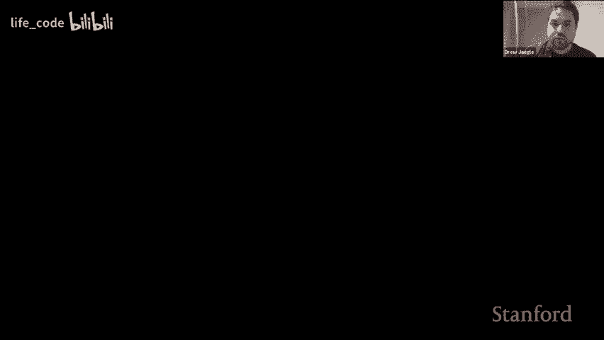
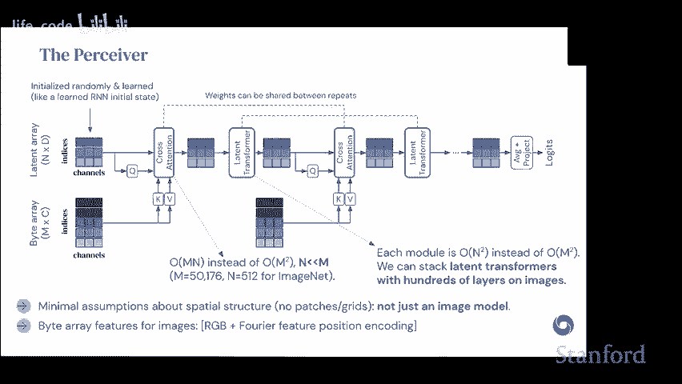
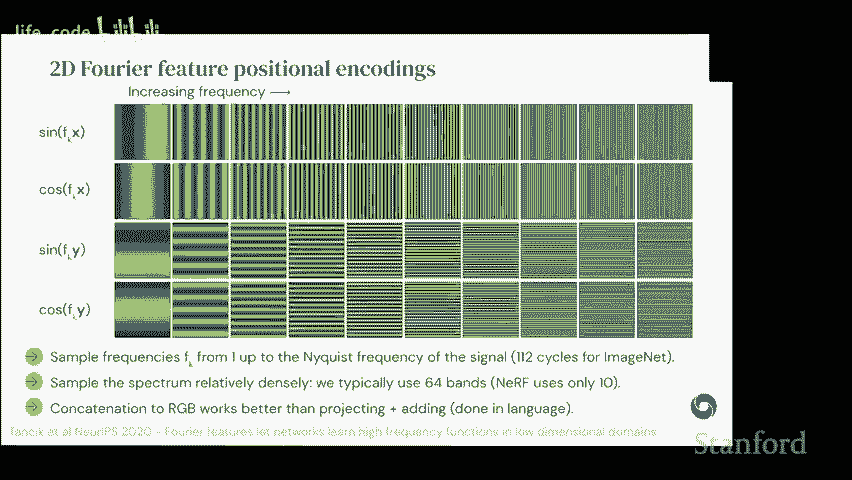
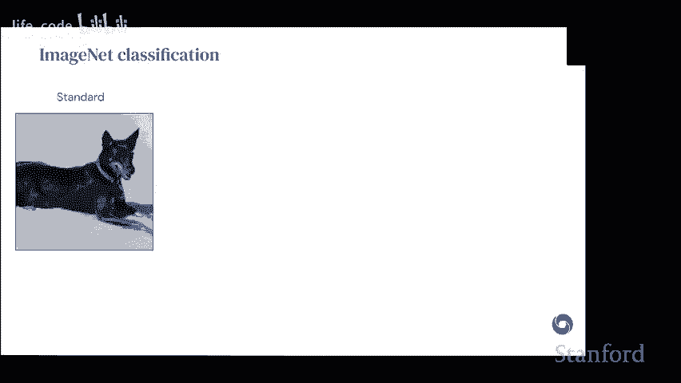
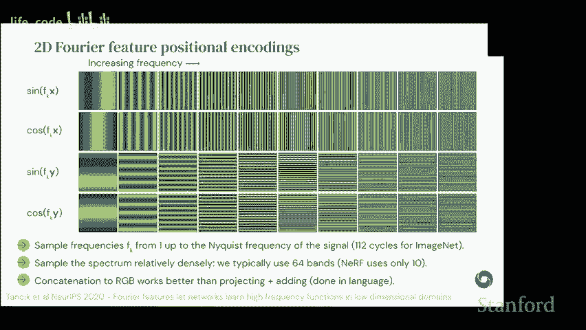
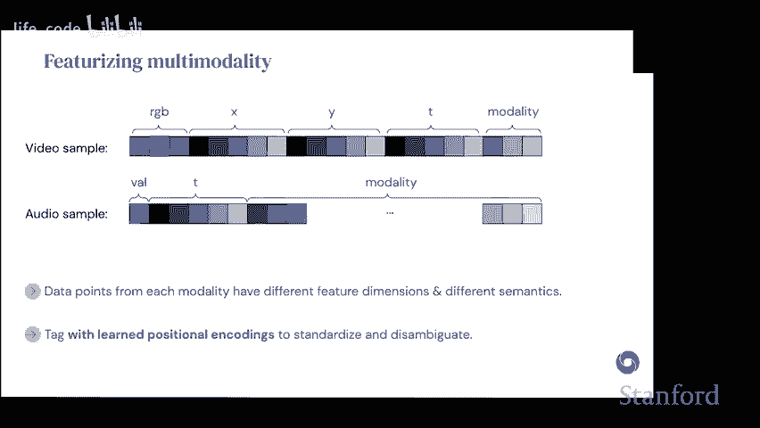
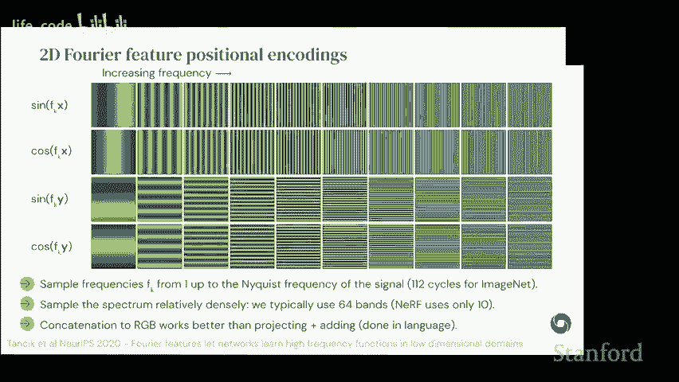
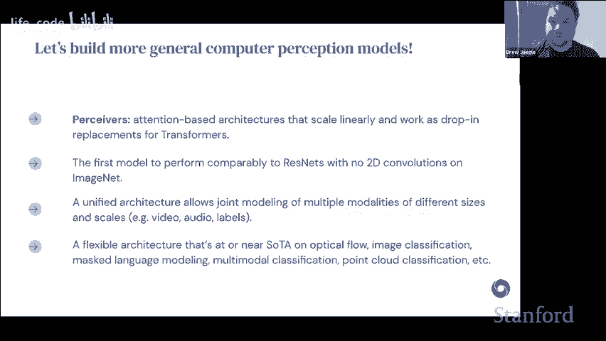

# P6：6.DeepMind 的 Perceiver 和 Perceiver IO 新数据家族架构 - life_code - BV1X84y1Q7wV

所以今天我将讨论我们在 DeepMind 进行的一些最新工作，开发我们称之为“感知”的这一系列架构。我将以我们发展的通用架构目标为动机，所以我想直接阐明我们为什么关心通用架构，第一两个理由都是相当务实的。

但基本上这个想法是，如果我们考虑到在世界上可能收集的所有数据，其中很多基本上涉及我们认为的传统感官方式。这些东西可能包括从触觉、前庭感知到回声定位，以及你需要以任何想要的格式摄取文本的那种感知，甚至还有更奇特的事物，比如基于事件的摄像头。

触觉与其他感官的结合，包括嗅觉、深度感知，以及我们在考虑科学感知时真正关注的感官模式。基本上，如果我们考虑到所有数据的完整集合，以及实际上对每种不同的感官模式进行建模所需的东西，尝试为每一个模式工程归纳偏见几乎是不切实际的。因此，我们不想一个个地进行工程设计，这种方法在某种程度上确实有效，也许合理地描述了我们如何考虑为不同问题开发新架构，但这根本无法扩展。作为一个社区，我们无法承担为每一个模式手动设计归纳偏见的成本，因此，我们希望构建至少在初步上能处理所有事物的架构。

还有一个关于为什么我们应该研究通用架构的实用论据，那就是这将使我们能够构建更简单、更统一的系统。如果你查看复杂的多模态数据流在感知计算机视觉或模式识别文献中的典型处理方式，实际上，通常的做法是利用我们知道适用于单个模态的归纳偏见，然后工程设计结合这些不同子系统的方法。这可能意味着为每一个模态构建特定的输入模块，然后尝试各种不同的组合方式。

所以这可以起作用，但它给我们提供的系统原则上只会在一个或少数几个领域内有效，并且这些系统维护起来非常困难，往往脆弱，依赖于输入模态的特定处理假设。因此，我们希望朝着拥有统一黑箱架构的方向发展，这种架构可以更方便地工作。这里的想法是，如果我们能达到这一点，我们就可以抽象出架构构建过程，真正关注其他更高层次的问题，这就是这项工作的动力所在。

我们要做到这一点的方法当然是通过使用到目前为止最通用的架构，也就是变换器。你们都会非常熟悉变换器的基本构建块，但从一个非常高的层面来看，我们可以考虑它们的功能。

变换器使用通用的归纳偏差，因此它们是非局部的。这意味着它们不会对哪些点应该相互比较做出领域特定的假设。相反，它们在注意力聚焦上倾向于全球性。它们将位置作为特征，而不是架构的硬性约束。

这与基于 MLP 的架构或典型工作方式的卷积网络形成对比，它们将位置作为架构组件来限制计算的发生。当然，最后，它们在设计上有广泛的权重共享，并且由于它们关注矩阵运算，它们通常对 TPU 和 GPU 友好，因此这是变换器工作方式的一些优点。

当然，另一方面，它们在计算内存扩展方面表现很差，这有两个组成部分。因此，注意力本身的扩展是平方的，变换器的核心是这种大 O 的 m 平方 L 复杂度。我喜欢以这种方式书写，因为它真正强调这是一个属性，基本上是随着你增大模型，无论是输入大小还是深度。

这个问题只会变得更糟，因为你还涉及到深度的扩展。这里还有另一个实际的问题，因为我们进行的计算量与输入大小成正比，因此在标准变换器的工作方式中没有瓶颈，即使线性扩展也会成为一个问题。因此，在实际应用中，对于非常非常大的变换器，这通常是一个真正重要的瓶颈，但这两者都在这里起作用，所以我们确实希望抑制这两者，从而使我们拥有真正通用的架构。

我们不能仅仅有一些原则上通用的函数。我们必须有一些实际可以在我们关心的尺度和数据类型上使用的函数。因此，对你们来说这可能都是旧的，但标准的 QKV 注意力的工作方式基本上是这样的。

所以这全是关于矩阵乘法的。我们有一些输入，通过一维卷积和一乘一卷积计算查询键和值，然后计算注意力，注意力得分是一个矩阵乘法，具有以下这些形状。然后我们使用这里的输出来计算。

权重，以计算注意力模块的实际输出。最后，我们通过一个额外的多层感知机（MLP）运行这个，应用卷积来获取输出。这是我们在这里工作的起点。让我简要重申一下，为什么我们会想要这些标准变换器的优势。

所以非局部性是我们这里的两种归纳偏差原则之一，我认为将其与有效局部性进行对比是有用的，这在卷积中意味着什么。如果我们基本上从深度的角度来看，哪个输入可以看到其他输入，这意味着表达两个输入点的函数有多容易。假设我们看一下输入中的这个黄色和紫色点，我把它们尽可能地分开，但我们可能会问，有效计算必须多深才能处理这两个点，如果你看一下三乘三的卷积。

你必须基本上等到网络的最后，才能将这些东西一起处理。这意味着你能够表达的函数实际上看起来非常浅，因为它们必须建立在这个非常深的堆栈之上，而这个堆栈仅提供局部性。实际上，如果你看看例如 ResNet 的工作方式，你会发现初始块有一个七乘七的卷积，然后之后是三乘三的卷积，直到最后，你需要 283 个三乘三的卷积，才能使图像中的 224 乘 224 像素互相查看。这意味着在 ResNet 50 中，像素边缘的点实际上从未看到彼此。我发现这一点有点违反直觉，但它表明我们确实在很大程度上限制了这些模型中容易表达的函数，因此有些图像函数你根本无法用 ResNet 50 捕捉到。

另一方面，如果你看一个在整个输入上具有全局注意力的架构。因此，变压器，如果可以这样缩放，或者说我们将讨论的感知。所有像素都可以相互作用，因此模型基本上可以捕捉这些东西，并更容易地表达这些功能，这些功能可以以将局部性放在首位的方式来表达。我们还发现这些架构的另一个有趣属性是位置被特征化，这基本上意味着我们不再对某物的架构位置进行编码，以确定它相对于其他物体的位置，这允许网络基本上使用它想要的任何位置信息。

但也可以根据需要丢弃，这是标准的做法。当然是在使用傅里叶或正弦特征的架构背景下。但这里有很多灵活性。好的，那么现在考虑一下卷积与变压器在对立端的关系。可能看起来我们在可扩展性与通用性之间有一种权衡，因此如果我们观察卷积的应用方式，通常我们可以认为它们是在网格结构数据上使用。

当然，它们是可以应用于具有更有趣拓扑的数据集的卷积的广义，但通常我们可以认为它们在某种空间的网格上操作。而变压器适用于通用集合，因此从这个角度来看，变压器更为通用。另一方面，它们的缩放要差得多，因此卷积在输入点上是线性的。

该架构的过滤器大小和层数。而变压器具有这种平方缩放，且在深度上仍然是线性的。因此，从这个角度来看，我们在感知工作中的兴趣在于缩放变压器，但保持通用性属性。所以我们希望有一些介于这两种极端之间的东西。

我们这样做的方法是观察自注意力，并在某种程度上修改它，以便更好地进行缩放。因此，为了理解自注意力在标准变压器中实际上做了什么。我们取输入数组，这里以索引形式写出，表示标记的数量或像素的数量，基本上是输入单元的数量以及数量和通道。我们有一个一维卷积，因此这是关于 QK 和 V 的 O（M）。

然后，我们使用该操作的输出计算注意力图。这给我们带来了一个矩阵乘法，这是平方缩放的来源。最后，我们用另一个矩阵乘法计算输出特征。这里我们已经受到速率限制，因为即使是标准分辨率的图像也相当大，所以大约是 50。

对于标准的 imagenet 图像，大小将会非常小，因此如果我们想要深度架构，这种情况是行不通的。所以我们所做的是在架构的输入处进行替换。我们将自注意力层替换为交叉注意力层，这基本上是通过一个学习到的查询来实现的。因此，我们只替换输入中的查询，使用一个学习到的组件，这些索引和通道可以被看作是基本上作为 RNN 的学习初始状态。

在文献中，这个想法有很多不同的名字。我们将它称为某种潜变量，但有时也称为诱导点或其他名称。基本思想是我们学习查询的输入，并保持它的键和值相同。这样做的好处是，当我们在此之后计算注意力图时。

现在我们基本上将其从一个方阵转换为一个矩形矩阵，并将矩阵乘法的复杂度降低到 MN。因此，现在它在输入大小上是线性的。第二个矩阵乘法也具有相同的特性。因此，从二次变为线性，这一点很酷。交叉注意力的复杂度是线性的，但输出实际上更小，所以我认为这里更重要的一点是，这使我们能够将一些非常大的东西映射到一个与输入无关的大小上。我们对此有完全的控制，这是一种超参数，这使我们能够在此基础上构建深层网络，因为这是一个可以控制的小尺寸。

我们可以在此基础上承受二次复杂度。所以我们使用这个想法，对不起，我仍然有点困惑，你们是如何在第二步中将查询转化为矩形的。是因为你们将查询替换为一个学习到的东西，而这个东西的大小相比于第一步的输入大小要小得多吗？是的，正是如此。如果你看看这里的基本矩阵乘法，它写作 QK 转置，所以外部维度的形状是 n，这由查询决定，因此通过缩小查询，我们只是在改变矩阵乘法的输出。

好的，谢谢。嗯。😊，是的，我想。对不起，请继续。好的，所以基本上你只对查询这样做，对吧？所以键和值仍然保持原始大小的矩阵。对吗？没错，好的，但基本上。嗯，我不太明白，基本上对我来说，问题是对于一个查询，现在在我脑海中我在寻找。假设我现在有 I token，现在没有 IF 查询了。这不会导致问题吗？

就像我在尝试使用它时一样。并且要计算得分。是的，所以这里发生的事情是你会比较，你会有一个较小的子集，因此如果你从比较每个查询与每个键的角度来看，而不是从矩阵乘法的角度来看，在正常的自注意力机制中，我们对每个键都有一个查询，因此每个点都与其他每个点进行比较，对吧？所以在这里我们所做的是，不是将每个点与其他每个点进行比较，而是我们有一组可以想象成“聚类中心”的东西，所以这是一个较小的数量，我们将每一个聚类中心与每一个输入点进行比较。

但我们不知道哪些标记技术上属于哪些聚类，对吧？

没错，所以它必须是学习的，没错。所以我们可以这样思考这里发生的事情：在正常的自注意力和变换器中，通过对所有点进行比较，我们可以说，好的。我知道这个点的特征，我想让它关注相似的特征。在这里我们所说的是，我们正在学习一组补充点，这些点应该与某个输入子集尽可能相似。

如果我说错了，请纠正我，但这本质上是在进行某种硬性约束，你是在说，比如说，不是对所有点进行查询，而是选择一些我们认为是重要且相似的点，并且只对这些点进行所有的注意力。

这样加固是指你选择的点，对吧？

是的，所以它们是相关的，这可以是一种思考方式，但这种想法的稍微修改是，它们基本上生活在一个抽象空间中。因此，它们并不是一一对应于某个输入查询或某个输入点，而是某种程度上是学习得来的，所以它们可以在中间某个位置，但我认为这是一个好的思考方式，这是一种良好的直觉。

但是我想我在这里有些困惑的是，你这里有索引和两个矩阵（紫色和绿色）的索引，在最左边。但这些索引不一定对应于输入，例如在 NLP 领域，这些不一定是标记，对吧？这些只是一些随机的标识。

但是在这种情况下，影响矩阵是某种从输入标记映射到 N 维矩阵的结果。是这样吗？不，实际上它基本上就像是，它是一个学习的权重集，这可以是一种思考方式，所以它的功能与学习的位置编码完全相同，因此它基本上只是一种学习的嵌入，但并不是基于任何条件的，它只是一种。

这只是一组权重。好的，这样更有意义，谢谢你。好的。如果没有其他问题，我将继续，但当然请随时打断我。基于这个想法，我们有这个学习的潜在数组，它的功能有点像 RNN 的初始状态，或者说它是一组权重。

我们基本上是随机初始化，然后利用它来关注输入的字节数组，因此这里的字节数组是像 ImageNet 这样的像素平面集合。而这个输出将与潜在数组处于相同的空间中，即相同的索引空间。

并且在意图层的方式中有残差连接。因此，一旦我们进入这个空间，就可以通过使用标准的变换器，在潜在空间中构建一个架构，而不是在输入空间中，这将使我们基本上能够因为我们将输入提炼到较小的空间中，仍然灵活地允许所有这些点进行交互，所以这仍然应该与普通变换器一样具有表现力，而且这里的每个模块现在的潜在大小是二次的，而不是输入大小，所以这是我们可以相当控制的。

所以在程序的原始版本中，我们发现增加交叉注意力是非常有帮助的。这绝对是你可以做的事情，背后的直觉是如果这个瓶颈相当严重，我们无法保持所有输入的信息，因此我们希望这些查询现在在某种程度上依赖于过去，能够回顾输入点。因此，这在为第一篇论文进行调优时被发现非常有帮助，但我会说的警告是，我们不再推荐这作为最佳实践，因为这些交叉注意力最终是相当沉重的，但如果你希望有更多的条件查询，或者希望能够交叉关注新输入，这绝对是你可以探索的事情。

在数据集有有限数据量的背景下，我们发现另一件非常有帮助的事情，针对这些架构（包括 INe），是允许在深度中共享权重。因此，这基本上只是意味着将不同的交叉注意力和自注意力层的权重绑定在一起，因为它们是重复的，所以这最终看起来像是在深度中注册的 RN。

从高层次来看，这为我们提供了一种可以应用于图像的架构，但不对图像结构做任何假设。因此，你可以在其他地方使用它，我们基本上通过使用位置编码提供有关输入空间结构的信息，这里我们使用 2D 傅里叶特征位置编码。为了给你一个概念，每个输入点基本上会被分配一个位置，我们在 2D 中使用正弦和余弦特征，这基本上是 2D 输入位置的傅里叶合成。我们发现，如果我们取样的频率是信号的最大频率，我们的表现会比使用较低版本的频率要好，这基本上是因为这将使每个点都能意识到每个不同的点。

图像中的每个点，而如果你在较低频率下取样，可能会出现混叠。因此，并不是所有点都会清晰可读。我们还发现，较密集地采样频谱往往有助于对比，在我们开发这项技术时，与 Nerf 相比，Nerf 在早期实现中使用的频带数量相对较少，我们发现增加频带数量能显著提高效果，因此一般来说，这是一个需要关注的方面。

最后，与语言不同，通常你会将嵌入与正弦或位置编码相加，但我们发现连接它们的表现一直更好。这可能是因为内容嵌入的定位不像语言中那样稀疏。

我们并不完全确定，但这是我一贯观察到的事情。在我转向结果之前，我想将其与在图像上下文中使用变换器的其他一些方法进行对比。因此，这里显而易见的先例是视觉变换器，我认为这项工作在图像上下文中特别出色。但关于它有一些限制，使其不太适合更通用的用途。

所以，视觉变换器确实使用了输入的 2D 卷积。这通常被描述为输入补丁，2D 变换器的特殊情况。因此，这限制了你可以使用的输入类别。而且因为我们基本上将这种补丁或卷积构建进来了。

这意味着这种方法在非网格数据上实际上是不够的。还有其他方法可以调整它，但这是你需要为每个领域特别处理的事情。最后，由于我们有这种输入，告诉架构在初始分组中应该首先关注什么，这确实意味着消除了非局部性假设，但不太清楚这样做一次会有多大差别。

但这是在考虑这种架构时需要注意的事情。最后，交叉注意力在视觉文献中被广泛使用。因此，我只想强调几个例子，比如来自 Facebook 的一个物体检测方法。

基本上有一个卷积主干，然后用于生成输出特征图。这被传入一个变换编码器-解码器，当然，每当你想到编码器-解码器时，就会想到交叉注意力，因为从编码器到解码器有一个交叉注意力步骤。

所以他们基本上使用交叉注意力将某些特征图表示转换为更像物体边界框的东西。关于学习自监督或无监督物体分割模型的研究也相当不错。

在这项工作中，他们做了非常类似的事情，使用了一个卷积主干。他们然后使用我们在这里引入的潜在变量，称之为“槽”，基本上是将一些输出像素分配到不同的槽，以便在分割模型中对槽进行独立的互补解码。还有很多其他内容。好的，我首先会补充一下，现在我将带你们了解这个模型的结果。嗨，我可以哦，你先说，我在你之后。好的，抱歉，你能回到几张幻灯片吗？你知道的，就是输入是如何流入的，我想是那张，对，就那张。好的，有两个问题，潜在变换器基本上是自注意力，对吗？

是的，潜在变换器是一个完全自注意力的变换器，明白了。为什么像关键和价值直接流入交叉注意力，同时查询也流入，但潜在数组是并行流入交叉注意力的，能解释一下吗？

是的，这里只是想描述残差连接，因此交叉注意力被描绘为一个交叉注意力模块，交叉注意力本身具有注意力和残差连接，然后还有一个 MLP，这就是这部分的意思。好的，但基本上是 QKV 标准。

好的。谢谢。😊，我有一个稍微相关的问题，如果我们可以继续这张幻灯片。关于这个事情我认为有趣的一点。抱歉，我失去了。你在打断我。它主要由注意力层组成，无论是自注意力还是创建图像变换器。你能听到我吗，传过来了没有？不，信号有点卡顿，但我想，最近的。哦。

好的。我应该打字吗，是的，我觉得这是个好主意。我会打的，谢谢，抱歉。好的，随意进行，我会慢慢打。

听起来不错，听起来对我来说也很好。实际上，我可以插嘴吗，德鲁，当你在那张幻灯片上时，这些残差连接我其实不知道交叉注意力是如何依赖这些的，这些序列交叉注意层对残差连接的依赖程度如何。

是的，这里。在初始阶段，我会说两件事，在初始的交叉注意力中，这其实并没有什么区别。我们在制作 proIO 版本时进行了消融实验，在解码器的交叉注意力中也做了同样的事情，这可能会有一些区别，具体取决于你在做什么。我认为在使用这种重复交叉注意力时，实际上是必需的，所以当你有这种迭代结构时，原因在于，实际用于条件查询的东西基本上是你目前架构状态的完整表示，因此跳跃连接是在查询通道中，处于潜在空间中。这基本上使你能够得到这种密集且稳定的架构。

谢谢。😊，嗯。😊，好的。那么，关于 imagenet，实际上我们在标准的 imagenet 处理过程中，基本上是比较几个基准，所以这个信息在目前来看有点过时。但对比一下 Res 50，以及当时纯粹在 imagenet 上表现最佳的视觉变换模型，我们绝对在合理范围内。

在你最先进的结果中，但这是一个架构，它同样没有使用任何二维卷积，因此能够做到这一点让我们感到非常惊讶。这个架构有一个很酷的地方是，因为它没有对输入图像的空间结构做出任何假设，我们可以查看置换的 Imagenet，在这个架构的第一个版本中，我们基本上使用二维位置计算特征，因此二维位置是固定在像素上的，然后我们将其全部洗牌，这基本上会让你感受到基线对输入图像结构的依赖性。所以如果我们观察变换器，由于构造原因，它们不会改变，因此这不是一个经验发现，而是模型的一个特性，但我们发现 Resnet 50 的性能下降了大约一半，而 VIT 只有一层依赖于空间结构。

此外，它大约有 15 个点的下降，这表明它在相当程度上依赖于第一个以提供有关结构的一些信息。我们可以通过不依赖于二维傅里叶特征而完全学习位置编码来推动这一点，基本上这是一个现在完全没有关于输入结构信息的架构，所以洗牌并再次学习是完全等效的，我们发现这个架构也能推动大约 70%，而且我们在这里得到了稍微更好的数字，总体来说，这似乎效果更差，但二维信息是有用的，能够得到五六年前与当时最先进技术相当的数字，真是很酷。

抱歉，我有点迟钝，你是说最后两行之间的区别在于倒数第二行有一个二维的投注位置，而最后一行本质上有一个一维的投注位置。我说得对吗？所以它是被学习的，基本上它会是我相信的一个 256 维的向量。

但它的意思基本上是模型本身对输入的空间结构没有任何信息。因此，我们使用的二维位置编码最终大约有 200 个。这是 200 多个特征，具体取决于你在看什么，但它们能给你非常详细的信息，关于输入的二维结构，因为它们是基于输入空间的 480 个组成。

好的，这有道理，谢谢。嗨，德鲁，我可以问一个关于你用来生成那些传感器波的频率的问题吗？是的，就像之前的封面幻灯片。

是的，是的，没错。他们喜欢。所以基本上，我确实在信号处理方面上过一些课。我知道如果我。

想要避免，你知道的，别扭。我需要至少按我的频率进行采样。因此，我很好奇为什么要使用从 1 到奈奎斯特频率的频率，而不是从微频率开始到非常高的频率。哦，我明白了，所以使用的最大频率总是奈奎斯特，因此任何超过奈奎斯特的频率都会产生混叠，因此实际上无法解析，因为它是在像素空间中。因此，采样 1 基本上只是给你一个覆盖整个图像的振荡，这基本上是为了采样非混叠频率的全范围。

啊，好吧，酷。谢谢。很好。是的。好的，接下来在图像结果之后。我们想尝试在其他领域，尤其是我们对如何在多模态领域中应用这项技术感兴趣。一个挑战或在这些领域中遇到的问题是，来自不同模态的数据最终会有不同的特征，且语义总是不同。因此，如果你将位置编码加上视频的 RGB，你会得到一定数量的通道，而如果你有对应的音频，数据可能是成对的，但特征往往较少，且只有 1D 位置编码。我们处理这种情况的方式基本上是学习模态特定的位置编码，这些编码是专门为每种模态学习的嵌入。这基本上为来自音频或视频的特征打上标签，使网络能够学习并区分它们。鉴于这些填充的特征向量，我们随后将它们连接在一起，这就是我们处理多模态数据的方式。因此，架构的输入看起来仍然像一个大数组，只是构建时我们知道其中一些特征和行是这样。

Aray 来源于视频，有些来自音频，但模型本身并没有关于这些的具体信息，除了它所学习的内容。我们还有一些很好的问题，所以可以先问。返回转向？是的，抱歉。我以为是这样，但没错，当然。如果你能听到我，这只是一个原因。就像正式开始很多变换的东西。我只是不知道那是哪个位置。哦，那我们的位置是什么？是的。

所以基本上，位置嵌入是一个特征，表示这个东西，最简单的思考方式是在文本中，所以文本的输入是一维的，事物生活在某个一维序列中，对于每个点，你会表示它在那个序列中的位置。最简单的方法是如果你有负一到一的完整范围，它实际上表示它在那个序列中的位置，但我们通常会想要特征化，使其维度超过单一维度，因此傅里叶变换，傅里叶分解是一种方法，可以提供关于高频结构的特权信息，但我们也可以仅使用位置来索引某个嵌入数组，这就是我们在更多学习中所做的，基本上它只是一个权重集，添加到该点的特征上，给网络提供关于它在基础序列中位置的信息。

如果你想继续？嗯，抱歉，我得找个静音按钮。解除静音。好的，我实际上有两个问题，关于特征较少的部分，我想你们是均匀采样还是说你们喜欢学习这些特征？

是的，所以基本上我们线性地对它们进行采样，基本上我们取完整空间，并用预算线性采样，在各种设置中，我们实际上尝试学习这些，所以你可以初始化一个数组，然后学习它，有时确实有帮助，你也可以尝试更复杂的策略。

好的，酷，我的后续问题是，我觉得你的研究的卖点基本上是你不做任何结构假设，对吧？你可以接受任何格式，但是对于编码来说，维度不会影响吗？例如，如果是文本就是一维，对吧？如果是图像就是二维，而如果是视频就是三维，你会有更多的维度。

就是位置编码会有更多的点，对吧？这不会固有地透露输入的本质吗？是的，确实如此，我完全同意，你说得对，从这个角度来看，我们学习位置编码的版本是最纯粹的。

所以这基本上给了它关于真实空间结构的信息非常有限。它给模型的是什么呢，当你进行学习的位置编码时，它会说，比如图像 1 上的点 K 和图像 2 上的点 K 之间存在对应关系。因此，这基本上是你能给它的最少信息，同时仍然允许它理解输入点之间的结构关系。这是我们一直在推动的方向，通常让架构访问这样的真实结构信息，比如这个点在二维上的位置是有帮助的。所以这里有几件事，从实际的角度来看，如果你想要好的结果，你需要利用这些东西，利用这些东西是有帮助的，但我们确实想朝着减少依赖这些东西的方向发展。

所以这基本上是我们正在积极研究的内容。好的，明白了，谢谢。所以我认为她在聊天中发布了她的问题。我也看到你举了手，所以如果你想的话，可以试试，如果不想的话，我会读出问题。好的，我会尝试，告诉我如果有点卡顿。是的，所以现在还不错吗？哦，好，太好了，我很好奇看着你提到的感知图，它是很多注意力层，对吧，比如交叉注意力和自注意力。我觉得最近的视觉变压器工作中有一种小趋势，试图用卷积替代最后几个层，而不是使用注意力，以不同的方式解决这个注意力扩展问题。这里的感知架构正试图让自注意力成本更低，他们只是想替代它，并且避免了这个问题。

所以我很好奇，我看到有些论文是两种方式的，有些试图做你提到的那样，还有一些也在尝试这样做。在我看来，每个人总是有好的结果等等。所以我好奇你是否认为有理由去做其中一种，还是你觉得这种替代方法也很有前景，或者有没有理由研究应该朝着某个方向发展。

是的，在我看来，主要的权衡是一个……视觉文献我认为在这些混合体方面已经爆炸性增长，人们写在 Pato 曲线上速度和性能的最佳平衡点。但是他们基本上主要关注视觉特定的问题。因此，计算机视觉社区通常并不会自我规范，以避免那些不适用于视觉的问题。

所以你最终会得到在视觉问题上非常高效和表现出色的东西。我认为从这个角度来看，这是一个极其重要的研究方向，这可能是正确的做法。我们所追求的，是尽可能通用，同时仍然保持高效。

明白了，所以这种事情是关键的。哦，抱歉，你继续。没有，没有，请继续。我想说这种事情很重要，简而言之，你觉得关注注意力很重要，因为这对 NLP 至关重要；你不能仅仅在最后放入一个卷积来解决问题，但或许可以，这样理解对吗？

这其中的一部分是，视觉和 NLP 并不是唯一两个领域。所以我们真正关注的，是我们想用这个解决的问题，包括事件驱动相机、细胞生物学、蛋白质等这些方面，我们可能没有正确的卷积归纳偏置来知道如何构建这些东西，或者它们最终成为整个研究项目，比如基于网格的卷积工作。

哦，Co，谢谢你。我还有一个关于架构的问题。所以我看到你提到的。我很抱歉如果你说过这个而我没听到，但你提到的交叉注意力，然后是变换器，再到代价注意力。我很好奇，如果你把这些层中的自注意力替换为交叉注意力，会发生什么？这会影响你的准确性吗？这甚至可行吗？这是一个有效的问题吗？是的。

所以你可以做的事情是修改它，使其具有某种层次结构，这样就会有多个阶段的交叉注意力。我们还没有让这个工作，但这并不意味着这不是一个好主意。所以，可能有一种正确的方法来做到这一点，而我们还没有找出正确的方法。

但我们试了一点点，哦，酷，谢谢你，我很感激。是的，没问题。好吧，让我。我们时间不多了，也许我可以跳过一些内容。嗯。好吧。所以，在我们花太多时间之前，我想至少谈谈我们为使这个架构更通用而做的修改。因此，我们在这里看到的第一个架构的问题是，它基本上适用于任意输入，但仅设计用于分类和回归任务输出，因此我们希望看看是否可以使用相同的交叉注意力策略进行解码，结果证明是可以的，这种方法相当有效，几乎可以直接使用。我们的想法是，如果我们有交叉注意力输入和自注意力来进行处理，我们可以引入一组额外的查询，这些查询基本上为每个你试图解码的点提供语义。

我们将这些输入传递给另一个交叉注意力层，该层的配置基本上与编码器交叉注意力的配置相反。所以现在查询将是潜在的大，而键和值则来自这个潜在空间，这基本上让我们保留了原始感知的所有优点，因此我们有一个线性扩展的编码器和一个处理阶段。

这种潜在自注意力独立于输入大小扩展，我们现在有一个解码器，保持解耦，但与输出大小呈线性扩展，因此通过这样做，我们基本上可以将相同的方法应用于密集输出任务。

为了让你更直观地理解它的工作方式。如果我们对这张小狗的图像进行自编码，基本上我们的做法是编码处理，然后解码。我们取一个对应于每个点的查询，然后将其传递给这个解码器，这样我们就可以查询其中一个点。

我们获得一个像素查询，再来一个，直到获得所有 10000 个点，这就是我们如何进行重建的。而这件事的酷点在于，它开启了一些新应用，我们可以通过改变查询的方式得到不同种类的输出。

所以，如果我们想做一些多模态自编码，比如我们有一些输出是视频，我们使用相同的构造技巧来获取位置，得到具有相关语义的查询，尽管这些不同数据的大小，即点的数量差异很大，在这篇论文的多模态自编码实验中，我们同时进行了视频、音频和标签的处理。

所有的输入都被传递到统一网络中，然后逐个解码。但我们现在也可以通过对序列中的位置进行条件处理来进行大规模语言建模。我们可以通过基本上提供一个索引来进行多任务分类，指示你正在从网络查询哪个任务。我们还可以通过传递输入特征以及位置来处理光流。

所以我将跳过几个不同的部分。我可以在之后将这些幻灯片分享给大家供大家查看。这些内容中有些相当酷，但我想快速谈谈语言和光流。因此，关于语言，我们想做的是看看是否可以用它来替代标记化，以及为什么我们关心去掉标记化。首先，我们主要使用标记化是因为变换器在序列长度上扩展较差，而标记化将序列长度减少了四倍。

但是，出现了各种各样的问题，那么我们为什么要关心去掉标记器呢？

首先，标记器在处理稀有单词时表现不佳。所以如果你比较基于字节的分解和基于 TF 的 UTF8 编码输入序列，你会发现基本上每个输入字符在内存中都有均匀的点分配。

例外或变音符号会导致它被拆分为两个，但如果你查看句子片段的标记化，就会发现“pepper”是一个标记，而“jalapeno”在这种情况下被拆分为五个。这基本上表明你分配的容量取决于单词的稀有程度，这可能导致次优编码。

它们还容易受到细微扰动的影响，一个著名的例子是，如果你玩过 GPT-3，你会注意到输出对在末尾添加或省略空格非常敏感。这基本上是因为空格可能会被分解成标记化的不同部分。这儿还有其他问题，但这是其中一个原因。

最后，标记在不同语言间不转移。因此，如果你想拥有一个可以在许多不同语言上使用而不需调优的模型，标记器就是一个障碍。所以如果我们能去掉它们，将简化管道，还会使事情变得更不脆弱，进而希望能导致更通用的模型。我们进行大规模语言建模的方式与我在那个示意图自动编码实验中展示的方式相同。

因此我们掩盖了约 15%的输入，这大致是标准的魔法数字。然后我们在被掩盖的位置进行解码，并要求模型解码在这些位置掩盖的字符。一旦我们有了这个模型，这就是我们进行预训练所做的。然后我们可以通过将解码器替换为多任务解码器来微调它，后者接受我们在下游评估设置中使用的任务，并训练模型按任务基础重构 logits。

好的，为了查看这个模型的表现，我们基本上首先将其与 Bt basease 进行比较，这只是一个我们非常了解的可靠基准。首先通过查看两个模型匹配的 flops，我们可以看到 perceive IO 和 Bt basease 的表现相当，你会看到这里存在不同的权衡，因此为了获得相同数量的 flops，基本上我们让 perceive IO 更深，这最终导致了更多的参数。

但在每 flop 基础上，它的表现基本上相同。另一方面，如果我们从 Bt 中去除 tokenizer 并保持 flops 不变，我们会看到参数的数量和深度急剧下降，这是因为 Bert 在序列长度上扩展得相当糟糕，因为它使用了普通的 transformer。但如果我们使用没有 tokenization 的 perceive，我们可以看到在 flops 计数上参数的减少只是轻微的。

但性能几乎完全相同，这意味着在这种设置中 perceive 的表现与有无 tokenization 基本上相同，它学习了不同的策略，使用了不同的参数，但它基本上可以达到相同的性能。

然后我们可以通过深入了解 tokenizer-free 设置中发生的事情来进一步扩展这个模型，我们看到我们也可以获得适度的性能提升。我认为在语言设置中，查看注意力图也是有用的，这里可视化的内容基本上是针对某些潜在特征，我们在输入序列中查看它关注的地方，其中一些最终是局部的，指向句子中的特定点。

其中一些是周期性的，因此它们看起来会在序列的重复点上，而其中一些看起来也像是提取了句法特征，这非常不错，因此它们基本上提取感叹号、大写字母或其他从序列开始就很有用且可解码的标点符号。

我们也基本可以在光流上使用完全相同的架构，而光流基本上是计算机视觉中的一个重要经典问题，给定视频中的一对帧，我们基本上想要跟踪所有的点，以便从一帧到另一帧计算每个点的运动，因此光流通常使用这些底部显示的彩色图像进行可视化，这基本上给你提供了每个点的速度的逐像素指示。

你可以看到，角色手中的刀刃向右移动，而她身后的生物则是向下移动。因此，光流存在几个有趣的挑战，所以它是一个密集任务，基本上涉及长距离的对应关系，但标准的训练协议中基本上没有大规模的真实训练数据，因为标记真实场景中的所有像素并找出它们的去向是非常困难的，因此通常的做法是先在一些合成数据上进行训练，然后在更真实的场景中进行评估。此外，光流也很有趣，因为它基本上是文献中一些最复杂的视觉架构的核心，所以之前的最先进结果是一个叫做 RAFT 的方法，它在去年 DCCCVE 上获得了最佳论文奖，我强调这一点是为了让你了解人们在手动设计这些架构上付出了多少努力，因此这是一个非常巧妙设计的架构，基本上包含了像显式计算的全局关联体积这样的东西。

不同的偏移量基本上允许模型推理不同尺度的事物是如何相互移动的。它还具有局部邻域聚合操作以及更新模块，以跟踪每个特定关联模块内发生的情况。

最后，开发了一些特定于流的上采样操作。因此，与此相对，我们基本上想看看 PerceivedIO 在这里的表现如何，只是为了让你了解我们对这一点的预期。

我们想，也许 PerceivedIO 抛弃了很多结构，所以我们希望能够得到一些好的结果，但它可能会过拟合，并且这里存在领域转移的问题，但另一方面，自注意力似乎是匹配这种对应关系的合理方法。

我们实际上发现，仅仅通过这里非常、非常简单的预处理，即提取每个像素周围的一个补丁，然后使用标准的感知 IO 架构，我们能够在这里获得最新的结果，因此这基本上验证了这种尝试采用通用架构以便进行迁移的总体方法。因此，基本上在最小调整下，我们能够在这两种 Cel 评估方法上获得令人信服的基准结果，并在 Kity 上获得可比结果。

这些是标准指标。我们还可以可视化在真实世界数据上应用此方法时发生的情况。所以这里没有基准，我们不能真正进行比较，但仍然有助于看到它是如何移动的，从定性上看，它能够捕捉到很多细微的结构，并能正确表示那些明显在特定方向移动的事物。我们也可以看看它是如何成功表示小结构的，这段视频正在播放。

可以的。好的，很酷，这里需要关注的是那些在鸟飞过时飞翔的细小水滴，因为我们在每个输出点进行解码。架构能够表示这些，因此能够捕捉到非常细微的变化。

非常细致的分割，如果你在这里使用卷积上采样器，就很难捕捉到这些。好的，所以我只是想提到这个房间里的灯光熄灭了。嗯。我也很感兴趣你是否尝试过其他任务，比如深度估计，特别是看起来它在那种模式下也能很好地工作。是的。

所以我们还没有发布任何内容，但一些内部结果表明这确实有效。基本上似乎没有什么令人惊讶的事情。我们有点不确定的是这个潜在空间中将包含多少信息，因为基本上你在抽象很多，并且它本身并没有任何 2D 结构，但似乎它能够很好地表示事物，这些解码机制似乎也能做到这一点。

当然。所以我现在出于时间的考虑，跳到结论。我有一个关于你分享的光流指标的问题，表格中的数字像是中心最终清洁实体，这些是不同的数据集，还是说这些是针对不同数据集的相同指标，或者是这三个不同的指标？

是的，这些是三种不同的数据集，所以 Cintelcle 和 Stel final 基本上是 Cintel 的最终渲染的两种方式，在所有情况下，这些方法仅在光流数据集上进行训练，因此它们是在这种一般用途的奇特合成运动数据集上进行训练的，然后我们在这些不同领域上进行评估，而没有进行微调。

好的。是的，流量的数据集相当小，因此一般来说甚至在微调时也会有问题。谢谢。嗯。好的，简单总结一下，没错。那什么是找到端点误差的真实情况呢？是的。这种方式是 Cintel，这是一个计算机生成图像，基本上是一个相对高质量的 CGI 电影，基本上是开源的，因此他们实际上有真实情况的依据，如果你知道真实的 3D 状态，就可以计算每帧之间的像素对应关系，这就是在 Cintel 上使用的，然后 Kity 基本上有一个 LiDAR 传感器，用于确定所有点的深度，然后计算对应关系，所以真实情况实际上是光流的真实情况，但一般来说，获取密集光流是很困难的，收集成本非常高。

很好，谢谢。嗯。😊，好的，基本上总结一下，感知器是基于张力的架构，能够线性扩展，并在多种设置中作为变压器的替代品。它们似乎也能够在性能上与依赖于 2D 卷积的模型相媲美，但当然这里有权衡，所以要非常注意一般性与速度以及特定领域之间的关系，正如在可以使用 2D 卷积的设置中所指出的那样。

将它们纳入循环中当然是有益的。这基本上是一个统一的架构，允许对不同大小的不同模态进行联合建模，整体来看，它似乎是一个相当灵活的架构，能够在各种不同领域产生最先进或接近最先进的结果。在这两篇论文中，我们研究了许多我没有提到的其他领域，包括 3D 点云建模，替代在《星际争霸》中使用的变压器，以及其他一些行为克隆代理，因此我们有很多证据表明这种通用方法似乎在广泛应用中有效，并且还有很多事情我们尚未尝试，所以我们非常希望推动这一点，并且始终欢迎建议等。

我们依赖于大量相关工作的基础，因为我们从许多不同的领域汲取灵感。这些是一些亮点，我只想感谢我的合著者们。当然，我乐意进一步讨论。谢谢，是的，非常感谢。我有一个问题：你认为像感知模型的未来会是什么样的？你觉得这些模型会在变换器社区中被更多使用，以替代卷积网络等其他东西吗？

是的，我认为，从广义上讲，我认为感知模型现在是一种选择，因为我们知道如何很好地将它们适应于我们对如何构建架构没有很清晰想法的领域。这种归纳偏差，我认为这是一个非常强有力的案例。

所以在你并不确切知道如何构建问题的情况下，我也认为这些方法可以与需要领域无关的内容结合使用。但我认为多模态和新领域确实是显而易见的选择。你觉得目前在这方面有哪些瓶颈？如果你不介意的话，能否透露一下你在这方面的下一步工作是什么？

所以我不能谈论太多细节，但有几个领域，首先，我们对如何在小规模数据上使用它们并没有很好的把握，所以数据的数量不足以恢复归纳偏差，我认为这是一个非常重要的领域。另一方面，我们还没有讨论的事情，但你可能会想象我们会考虑的是如何同时在多种模式或多种事物上进行训练，因此现在所有这些架构都是孤立训练的，但有很多机会可以一起解决问题并在所有问题上使用单一架构。

明白了，我不确定你是否尝试过，但你能否将其用于表格数据？是的，因此该架构将任何输入数据视为表格数据，所以我认为这正是思考的正确方式。课程听起来不错，谢谢你的提醒。我会为学生们提出一般性的问题。所以我们开始录音。

