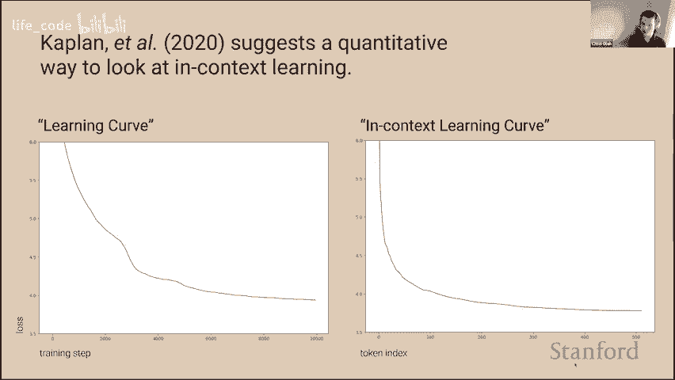
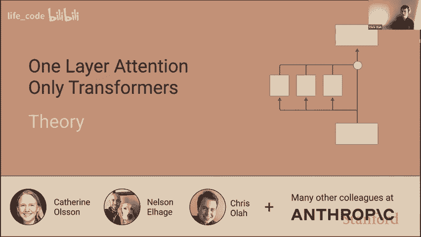
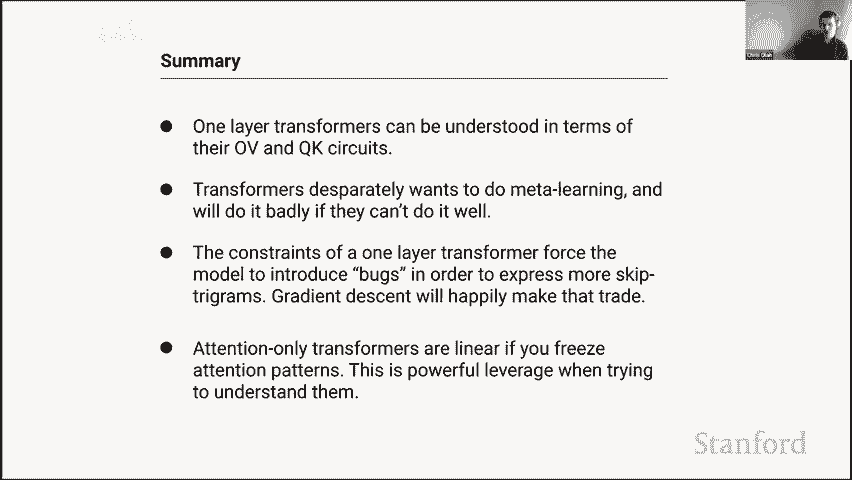
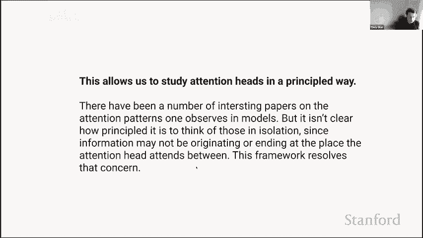
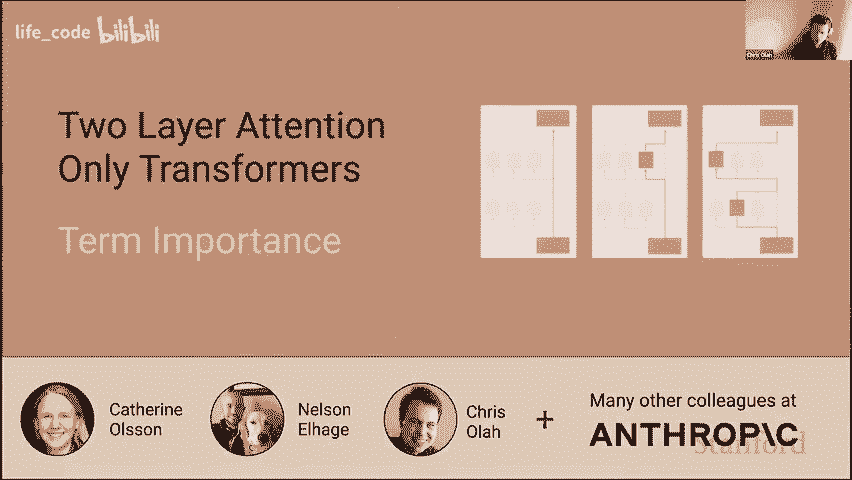
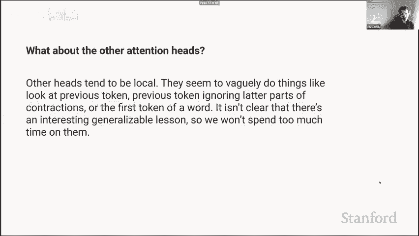
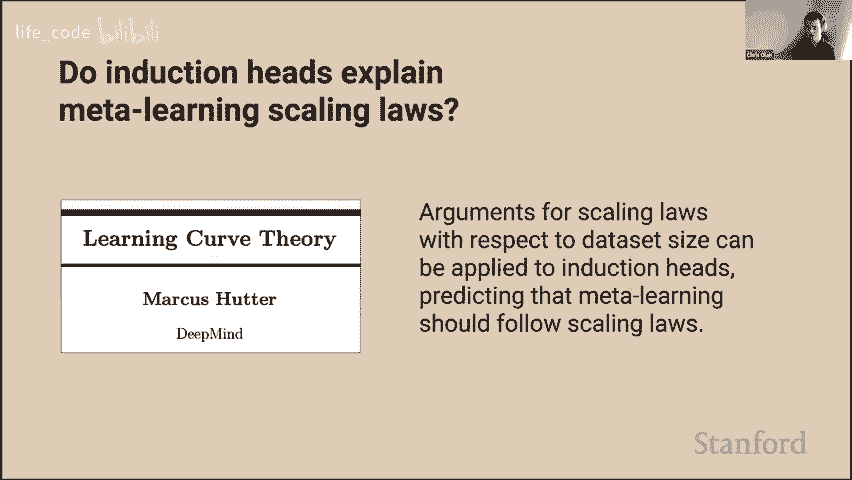

# P8：8.Transformer 电路、诱导头、上下文学习 - life_code - BV1X84y1Q7wV

感谢大家邀请我，能在这里我很兴奋，我最喜欢的事情之一就是谈论神经网络内部发生了什么，或者至少我们试图弄清楚神经网络内部发生了什么，因此总是很有趣聊聊这个。

😊，嗯。天哪，我得想办法做这件事，好吧。好吧，我想要的好吧，现在我们正在推进幻灯片，这似乎很有希望，所以我认为“可解释性”对不同的人意味着很多不同的事情，这是一个非常广泛的术语，人们对此有各种各样的理解。

所以我想简单谈谈我思考的那种可解释性，我称之为机械可解释性。我的大部分工作实际上并不是针对语言模型或递归神经网络或变换器，而是理解视觉卷积，并试图理解这些模型中的参数是如何映射到算法的，因此你可以将神经网络的参数视为一种编译过的计算机程序，而神经元有点像变量或寄存器，以某种方式，这些复杂的计算机程序嵌入在这些权重中，我们希望将它们转化为人类可以理解的计算机程序，这是一种反向工程的问题。

😊，所以这是我们找到的一个有趣的例子，其中有一个汽车神经元，你可以实际看到，我们有汽车神经元，它是由一个轮子神经元构成的，它在寻找底部的轮子，那些是正权重，而它不想在顶部看到它们，所以那是负权重，还有一个窗户神经元，它在寻找顶部的窗户而不是底部，所以我们实际上看到这是一种算法，它就是在说，你知道，一辆车在底部有轮子，顶部有窗户，中间有车身，而这实际上就是最强的神经元，因此我们实际上看到了一个有意义的算法，这并不是一个例外，这种情况基本上是一个普遍的故事，如果你愿意去查看神经网络的权重，并且愿意投入大量精力去试图进行反向工程，那么在这些权重中有意义的算法正等着你去发现。

有很多原因让我认为这是一个有趣的思考课题。其中一个就是，没有人知道如何去做神经网络能够完成的事情，比如说，没有人知道如何编写一个可以准确分类 ImageNet 的计算机程序，更不用说我们正在进行的语言建模任务了。没有人知道如何直接编写一个能够完成 G3 所做事情的计算机程序，然而不知何故，**破坏性下降**能够找到一种方法去实现这一点。我想知道到底发生了什么，我想了解在这些系统中它们发现了什么可以做的事情。

我认为这是重要的另一个原因就是安全性。如果我们希望在会对世界产生重大影响的地方使用这些系统，我认为我们需要问自己一个问题，那就是：当这些模型出现意想不到的失效模式时会发生什么，失效模式是我们不知道需要去测试、寻找或检查的。我们如何发现这些事情，特别是如果它们是某种程度上病态的失效模式，或者模型在某种意义上故意做了一些我们不希望的事情。那么，我认为我们能做到这一点的唯一方法就是到达一个真正理解这些系统内部运作的阶段。

😊，所以这就是我对此感兴趣的另一个原因。实际上，对语言模型和变压器进行解释对我来说是新的。在这一年之前，我花了大约八年的时间试图逆向工程内容和视觉模型，因此这次演讲中的想法是我和我的合作者们思考的新事物，我们可能还要一到两个月，甚至更长时间才能发表这些内容。这也是我首次公开进行相关演讲，所以请理解，我即将讨论的内容对我来说仍然有些困惑，确实会在我的表述中造成混淆。如果我说的事情让你感到困惑，请随时问我问题。有些点我可能会快速讲述，因为内容很多，但在最后我会有一段时间可以和大家讨论这些内容。此外，如果我对 Zoom 不熟悉而犯错误，我也很抱歉，但就是这样。

让我们深入探讨一下。

所以我想以一个谜团开始。在我们试图深入了解这些模型内部发生的事情之前，我想通过一个我们发现并想要理解的非常奇怪的行为来激励这一点。嗯。顺便说一句，我应该提到这项工作是和我的同事**Philanthropic**一起完成的，特别是我的同事**凯瑟琳**和**纳尔逊**。好的，那么进入谜团。

我认为关于变压器（transformers）最有趣和最令人兴奋的事情就是它们的上下文学习能力，或者有时人们称之为元学习（meta learning）。

你知道，GT3 论文描述了语言模型作为少量学习者的情况，GT3 有很多令人印象深刻的地方，但他们选择专注于这一点，现在每个人都在讨论提示工程，安德烈·卡拉希还开玩笑说你知道软件 3。

0 是设计提示，因此这些大型变换器语言模型在响应其上下文、从中学习并根据其上下文改变行为和响应的能力，似乎确实是它们最令人惊讶、引人注目和卓越的特性。

我的一些同事之前发表了一篇我非常喜欢的论文，其中有一个技巧。我们都习惯于查看学习曲线。你训练模型时，损失会降低。曲线有些不连续并且下降。

你还可以做的另一件事是，可以拿一个完全训练好的模型，问你知道在我们处理上下文时。你知道当我们预测第一个标记，然后是第二个标记和第三个标记时。我们在预测每个标记时变得更好，因为我们有更多的信息来进行预测，所以你知道第一个标记的损失应该是单元语法的熵，然后下一个标记应该是双元语法的熵，它不断下降。

它不断下降，且不断变得更好。从某种意义上说，这就是模型进行上下文学习的能力，能够在预测后续标记时比预测早期标记更好，从某种意义上说，这是一种数学定义，说明了在上下文学习或元学习方面这些模型的优秀之处，这真是太酷了，因为这给了我们一种方法来判断模型在上下文学习中的表现。

不。如果我可以问一个澄清性的问题，当你说学习时，实际上没有参数，是的，我是说上下文学习的奇妙之处在于，确实，我们传统上认为神经网络在训练过程中通过修改其参数来学习，但不知怎么的，模型似乎也能够在某种意义上学习，如果你给他们几个示例，他们就可以在上下文中执行，尽管没有参数改变，这是一种相当不同的学习概念。

好吧，我觉得这越来越有意义了，你能否在这种情况下描述上下文学习，就像是在一个十个标记的句子的前五个标记上进行条件化，然后是下五个标记。是的，我认为人们有时会将这视为上下文学习或元学习，因为你可以做一些事情，比如实际取一个训练集，将训练集嵌入你的上下文中，比如仅仅两个或三个示例，然后突然间你的模型就能去做这个任务，因此你可以通过在上下文中嵌入事物来进行少量学习。是的，正式的设置是你只是对这个上下文进行条件化，而这种能力就像是有某种感觉，长期以来人们，实际上我想这段历史是我们开始在神经网络学习上取得进展，对吧，我们可以训练语言、视觉模型和可以做所有这些显著事情的语言模型，但随后人们开始觉得这些系统需要更多的示例。

humansumans 所做的事情是去学习，我们该如何去解决这个问题，我们有很多关于元学习的发展想法，想知道去哪里训练模型。😡，明确地能够从少量示例中学习，人们发展出这些复杂的方案，真正荒谬的是，变压器语言模型几乎无需任何努力。

我们可以免费获得这些，能够仅仅在上下文中给出几个示例，他们就能学习新的事情，我认为这在某种意义上是 G3 论文中最引人注目的事情。因此，是的，这种能够对上下文进行条件化的能力。

它可以免费提供新的能力，而在某种意义上，能够推广到新事物是最重要的。对我来说，变压器语言模型最引人注目和令人震惊的事情就是这一点。🤧这很有道理，我想。以我的观点来看，我正在努力将这种情况下的学习概念与众不同的东西结合起来。

如果你或我得到一个提示，比如“一加一等于二，二加三等于五”作为少量示例设置，然后其他人输入“像五加三等于”，我们必须填补这个空白。在这种情况下，我不会说我们学习了算术，因为我们已经有点知道它，而是我们只是在提示上进行条件化，以知道我们应该生成什么，对吧？

但在我看来，这似乎是一个光谱，因为你也可以给出完全无意义的问题，模型从未见过这种函数，给出该函数的几个示例，而模型之前从未见过它，我可以稍后在上下文中这样做。我认为在很多情况下你学到的东西是，你可能并没有学习到算术，你可能在使用某种天生的算术能力，但你可能学到了，“哦，好吧，现在我们在做算术问题”。

明白了，如果这是我同意这里存在一个语义元素，是的，这很有帮助，只是为了澄清一下我们所讨论的内容。谢谢你逐步讲解这一切。当然。我认为这一切中最引人注目的事情是。😊。

我们已经讨论了如何查看学习曲线，我们也可以查看这种上下文学习曲线，但实际上这只是二维空间的两个切片。从某种意义上说，更根本的问题是我们在训练的不同点上生成最后一个标记的能力如何，你会注意到，如果你查看这一点，当我们谈论损失曲线时，我们只是在谈论如果你在这个维度上取平均。

如果你喜欢这样的平均值并将其投影到训练步骤上，那就是你的损失曲线，而我们称之为上下文学习曲线的东西就是这条线。是的，这条线在这里结束。嗯。有一点引人注目的是，它存在一个不连续点，就像有一个时刻，模型似乎在某个方面变得极为优秀。

在非常短的时间跨度内进行预测后期标记。所以在早期时间步长中并没有太大不同，但在后期时间步长中，突然你变得更好。

使这一点更加显著的一种方法是，你可以计算预测第 50 个标记的能力与预测第 500 个标记的能力之间的差异，你可以从第 500 个标记中减去第 50 个标记的损失。你会看到，在训练过程中。

你知道，你对此并不是很擅长，你变得稍微好一点，然后突然你有了一个悬崖，然后你再也不会变得更好了，至少这两者之间的差异永远不会改善，因此模型在预测事物时变得更好，但它在预测后期标记与早期标记之间的能力永远不会提高。

😡，所以在仅仅几百个训练步骤的时间跨度内，模型在进行这种上下文学习的能力上有了显著的提升。所以他可能会问，那时发生了什么？这只是一个模型，但首先值得注意的是，这不是一个小的变化。

所以我们并不常常考虑这一点，但通常我们只是关注损失分数，比如模型是否比另一个模型表现更好或更差，但你可以从 NAs 的角度考虑这一点，这只是信息的量和 NA，你可以将其转换为 Tibit。

所以，你可以这样理解：模型 0.4nas 大约是 0.5 比特，差不多每个其他的标记模型都可以去采样两次并选择更好的一个。实际上，情况比这更强，这只是对获得更好结果的一个低估。

这是模型在预测后续标记时能力的真正巨大差异。我们可以用不同的方式可视化这一点，也可以问一下我们在预测后续标记时的改善程度，并查看导数，然后我们可以清楚地看到在这一点上导数存在某种不连续性，我们可以取二阶导数，并相对于训练进行推导，现在我们看到在这几步和几百步之间存在明显的变化，这导致了某种大的变化，我们有某种相变发生。

这一点在不同模型规模中都是如此。你实际上可以在损失曲线中看到一点点变化，这个小峰值对应于我们可以更早看到的损失曲线中的变化。就是这个峰值。抱歉，所以我们有这种相变发生，我认为有一个很诱人的理论，就是无论如何，模型输出和行为的变化，以及外部表现的属性，可能对应于模型内部算法的某种变化，因此如果我们观察到这种大的相变。

尤其是在模型行为的一个非常小的窗口中。可以推测模型内部电路的某些变化正在推动这一点。至少这是一个自然的假设，所以如果我们想要问这个，我们需要能够理解模型内部运行的算法。

我们如何将模型中的参数转化为这个算法，这将是我们的目标。现在这需要我们在相对较短的时间内覆盖大量内容，所以我将在下一部分稍微快一点，并突出一些关键要点，然后我非常乐意深入探讨其中任何内容。通话后我还有一个小时，随时愿意深入讨论细节。

😊。

所以事实证明，在单层注意力变换器中，空间变化并没有发生，而在双层注意力变换器中是会发生的。如果我们能够理解单层注意力变换器和双层仅注意力变换器，这可能会给我们一个很大的线索，帮助我们理解发生了什么。

😡。

所以我们在注意力上也将省略层归一化和偏置，以简化事情。所以你知道，一种描述注意力变换器的方式是我们将嵌入我们的标记。然后我们将应用一堆注意力头并将它们添加到残差流中，然后应用我们的解嵌入，这样就能得到我们的逻辑。

我们可以将其写为方程式，如果我们想乘以嵌入矩阵。😊。应用注意力头。然后计算日志，打印动画。而这里有一点棘手的是理解注意力头，这可能是描述注意力的一种传统方式，实际上模糊了注意力的结构。我认为我们通常会使注意力头比实际更复杂，隐藏了有趣的结构。那么这是什么意思呢？它的意思是对于每个标记计算值向量，然后根据注意力矩阵混合值向量，然后用输出矩阵将它们投影回残差流。

😊，所以还有另一种符号表示法，你可以把它看作是使用张量积，或者使用。好吧，我想左乘和右乘，你可以用几种方式来解释这一点。但我会尽量解释这个符号的意思。14 年级。😊。对于我们的每个 x 残差流，我们有一个针对每个单独标记的向量。

这意味着去独立地将每个标记的向量乘以 Wv。所以计算每个标记的值向量。😡，另一方面，这意味着注意到现在我们 A 在左侧。这意味着去做。去乘以注意力矩阵，或者进行值向量的线性组合，所以不要改变值向量。

你知道逐点的，但根据注意力模式将它们混合在一起。创建加权和。然后，再次，对于每个位置，去应用输出矩阵。你可以将分配属性应用于此，它只会揭示实际上在中间进行注意力并不重要。你可以在开始时进行注意力，也可以在结束时进行。

这是独立的，实际上重要的是有一个 WVWO 矩阵，它描述了注意力头从每个位置读取的信息以及如何将其写入目标。

而 A 描述了我们从哪个令牌读取和写入。这种描述更为基本，注意力头负责将信息从一个位置移动到另一个位置，而哪个位置被移动到哪个位置的过程与移动什么信息是独立的。

如果你以这种方式重写你的变换器，首先我们可以将注意力头的总和写成这种形式。然后我们可以通过添加一个恒等映射来写出整个层。如果我们将这一切代入我们的变换器并进行展开。我们必须将所有内容相乘，得到这个有趣的方程。

因此，我们得到这一项，它对应于直接通过残差流的路径。它想要存储 pgram 统计信息，实际上，它就是知道所有的，假设是前一个令牌，并试图预测下一个令牌。因此，它会尝试预测或通过统计信息进行存储，对于每个注意力头。

我们得到这个矩阵，它表示，好的，我们有注意力模式，这个矩阵描述了哪个令牌关注哪个令牌，同时我们这里还有一个矩阵，描述了每个可能的令牌如何影响逻辑，这只是一个表格，你可以查看，它只是说明，对于这个注意力头，如果它关注这个令牌，它将增加这些令牌在单层注意力变换器中的概率，这就是全部。

😊，是的，这就是我所描述的解释。嗯。还有一点值得注意的是，根据这一点，注意力变换器是线性的，如果你固定了注意力模式，当然，注意力模式并不是固定的。但每当你有机会去使某些东西线性时，线性函数其实很容易理解，因此如果你能够固定少数几个东西并使某些东西线性，这实际上是很有杠杆作用的。

好的。嗯。是的，我们可以讨论一下注意力模式是如何计算的。如果你展开它，你会得到这样的方程。请注意，我认为这会更简单。好的。我认为从这一切中要得出的核心故事是，我们有这两个看起来相似的矩阵。那么这个矩阵告诉你，如果你关注一个令牌，逻辑是如何受到影响的？

你可以把它想象成一个巨大的矩阵，针对每一个可能的输入令牌，逻辑是如何受到影响的？

通过那个令牌，它们是变得更可能还是不太可能？而我们有这个，它有点儿说。每个令牌想要关注其他每个令牌的程度。你可以这样想象，好的，当我们考虑一个注意力头时，实际上涉及三个令牌。我们有要移动信息的令牌，它是向后关注的。

我们有源标记将要被关注，还有输出标记的逻辑将会受到影响。你可以跟踪这个过程，询问关注这个标记会发生什么，首先我们嵌入标记。然后乘以 WV 以获得值向量，信息通过注意力模式被移动。

我们乘以 WO 以将其添加回残差流中，但被嵌入影响了逻辑，这就是那个矩阵的来源。我们还可以询问是什么决定了当我们计算注意力模式时，某个标记获得高分的原因，它仅仅是说嵌入那个标记。

将其转化为查询，嵌入另一个标记，将其转化为键。然后计算它们的点积。那就是这两个矩阵的来源。所以我知道我讲得比较快。也许我在这里稍作停顿，如果有人想询问澄清，这将是一个好时机，然后我们将实际进行逆向工程。

你知道，单层注意力变换器中发生的一切现在尽在我们的掌握之中。这是一个非常简单的模型。实际上没有人使用单层注意力变换器，但我们能够理解单层注意力变换器。所以，确实，你看到的快速键电路正在学习注意力权重。

像本质上负责运行不同标记之间的注意力排序一样，这个矩阵在学习时会涉及到所有三个部分。但这就是它表达的注意力模式，这就是生成注意力模式的地方，对于每对标记都进行计算。你可以把这个矩阵中的值看作每个标记想要关注其他标记的程度，假设我们在这里忽略位置的信息，所以在某种程度上，我们也是在对其进行全局对齐，但总的来说，每个标记想要关注其他标记的程度如何，对吧，电路就像是使用这种注意力。

是的。像影响最终输出，假设注意力头关注某个标记。那么我们暂时放下如何计算的问题，假设它关注某个标记。关注那个标记会如何影响输出？你可以计算，这只是一个大值表，表示对于这个标记。

这将使得某个标记更可能，而这个标记将使得另一个标记的可能性降低。好的。这仅仅是。并且它们是完全独立的，就像是两个独立的矩阵，它们并不是。你知道，公式可能让它们看起来是纠缠的，但实际上是分开的。对我来说，讲座的监督似乎来自输出值集，而查询键则更像是无监督的东西，因为没有。

我的意思是，我觉得在某种意义上，在一个模型中，每一个神经元在某种意义上都是这样的。你知道，就像信号在某种程度上是来自最终信号的下游，所以你知道，输出值信号的输出值开始变得越来越直接，可能会得到更直接的信号，但确实如此。

是的。我们将能够深入探讨这个问题，尽可能详细，所以我们可以也许推进一下，我认为实际上如何使用这个逆向工程一个层次模型的例子，可能会让它更有动机。

好的，所以。只是为了强调这一点，我们可以讨论三种不同的令牌。一个是被关注的令牌，一个是进行关注的令牌以调用目标，然后还有一个是被影响的令牌，它的下一个令牌的概率也会受到影响。

嗯。因此，我们可以注意到，唯一连接这两个的令牌是被关注的令牌。所以这两个是通过它们与源令牌的互动建立了桥梁。因此，有一种自然的方式是问，对于给定的源令牌，你知道，它如何与这两个互动？所以我们拿，比如说，令牌完美。

我们可以问的一个问题是，哪些令牌希望关注完美。显然，最希望关注完美的令牌是“完美”、“是”、“看”和“提供”。所以“是”是最主要的，接下来是“看”，依此类推。然后当我们关注完美时，这只是一次单一的关注。

所以你知道，如果我们使用不同的关注方式，那结果会有所不同。它实际上想要增加完美的概率，然后在较小程度上增加超级、绝对和纯粹的概率。我们可以问你，这一特定组希望互相关注并变得更可能的令牌序列是什么。😡，事情是形式上的。我们有我们关注的令牌，并且我们跳过了一些令牌。

它们不必是相邻的，但后来我们看到令牌 R，它倾向于完美并增加完美的概率。因此，你可以把这些视为我们正在创建或改变我们可能称之为跳过三元组的概率的事物。

你知道，我们在中间跳过了一些令牌。但我们实际上是在影响三元组的概率。所以完美或者完美，完美，看起来超级。我们可以看看另一个，我们有令牌大。这些令牌包含了希望回头看并增加大和小的概率，以及受到影响的跳过三元组的事物，比如大使用大。

大包含小，像这样的事情。😊，如果我们看到数字二，我们会增加其他数字的概率，影响像 2，1 的标记或跳过图表。二，二有三个。现在你们都是技术领域的人，应该能认识到这个。我们有 Lambda，然后看到反斜杠，然后我们想增加 Lambda、排序和 Lambda 操作符的概率，所以这都是落后技术。

它想要，如果它看到 Lambda，它会认为，下次我使用反斜杠时，也许我应该放入一些 LaTeX 数学符号。对于 HTML 也是同样的事情，我们看到 NSP 表示不间断空格，然后看到一个百分号，我们想让它更可能。所有这些的结论是，一层注意力变换器完全在作用于这些跳过三元组。

😊，而且。所有这些，嗯，我想，它也有影响图表的路径。但主要是影响这些跳过图表。还有很多，它就像是这些巨大的跳过三元组表，使得某些可能性更大或更小。还有其他有趣的事情，有时标记化会以多种方式拆分一个单词。

所以我们有 Indie，好吧，这不太好 k，我们有单词 Piike，然后我们看到标记 P，然后我们预测 IC。😊，当我们预测尖峰等东西时，或者这些东西有点有趣。也许值得讨论一下。我们看到标记 void。😊。然后我们看到一个 L，可能我们预测 Lloyd 或 R，预测 Ralph，C，Catherine。

但我们稍后会看到，嗯，是的，我们稍后会回到这一点。因此，我们增加像 Lloyd Lloyd 和 Lloyd Catherine 或 Pixmap 的可能性，如果有人用过 QT，我们看到 Pixmap，并再次增加 P Xmap 的概率。

但也有 Q。😊，Canvas。还有。当然，这里有一个问题，那就是它无法选择哪些与哪些匹配，所以如果你想制作 Pixm 像素图。并且让 Pixmap Q Canvas 更可能，你还必须去创建并使 Pixmap Pixmap P canvasvas 更可能。如果你想让 Lloyd Lloyd 和 Lloyd Catherine 更可能。

你还必须让 Lloyd Cloyd 和 Lloyd Latherin 更可能。因此，变换器确实存在一些奇怪的 bug，至少在这些只有一层的注意力变换器中有这些 bug，这些看起来很奇怪，直到你意识到这是一个巨大的跳过三元组表在运作，而这种性质是你将会。

😊，是的，这种方式在你想这样做时迫使你去做一些奇怪的预测。Chris，简要地说。你为什么在第一个字符前有一个空格呢？

是的，我只是举了一些例子，说明标记化是如何以特定方式断裂的，好的，因为在某些东西前面有空格时，空格会被包含在标记化中，然后有一个例子是空格不在它前面。

它们可以以不同的方式进行标记化，太酷了，谢谢。是的，伟大的问题。好的，所以有些只是为了抽象出我们看到的一些共同模式。我认为一个相当常见的情况是你可以描述的像是 A B。所以你进去后，看到一些标记，然后你看到另一个可能在那个标记之前的标记，然后它们就像。

可能我之前看到的标记会再次出现。或者有时你预测一个稍微不同的标记，比如第一个的例子是两个。一，二。但是你也可以做两个加三。所以三并不等同于二，但有点相似，这就是一件事。另一个例子是你有一个标记，突然它被一次性标记在一起，然后又被拆分开，你看到这个标记，然后看到可能是标记的第一部分，然后你预测第二部分。

😊，嗯。我认为这非常引人注目的是，某种程度上这都是一种非常粗糙的上下文学习。而且尤其是，这些模型的上下文学习大约是 0.1 而不是 0.4，并且它们从未经历相位变化。因此，它们进行了一种非常粗糙的上下文学习，并且几乎将所有的注意力头都投入到这种粗糙的上下文学习中。

所以它们并不是很擅长，但它们正在投入能力。😊。我注意到现在是 1037，我想检查一下我能持续多久，因为我可能应该加速一下。哦，克里斯，我觉得没关系，因为学生们也在间歇中提问。所以你应该没问题。好的，所以我的计划可能是我会讲到 1055 或 11 点。

然后如果你，我可以在之后回答一段时间的问题。是的，没问题。太好了。所以你可以把这看作是一种非常粗糙的上下文学习，基本上我们所说的是，这种情况类似于我看到这个标记，可能这些其他标记，类似的标记更有可能去继续关联，看看这是一个机会，看起来我可以注入我之前看到的标记，我将把它注入到这里，表明它更有可能，基本上就是这样。

并且它几乎把所有能力都投入到了这一点上，所以你知道，这有点和我们过去对 RNN 的想法相反，过去每个人都觉得哦，你知道 RNN。要考虑长距离上下文是多么困难。

你知道，也许我们需要去使用水坝之类的东西，但如果你训练一个变换器，它会专注于你给它的足够长的上下文，它几乎将其全部能力都投入到这类东西中，这真有趣。有一些注意力头主要是位置性的。

通常我训练的模型是一个有两层的模型，或者只是一个有 12 个注意力头的单层模型。通常其中两个或三个将成为这些更具位置性的、较短期的东西，做一些更像是局部三元组统计的事情，而其他一切都会变成这些跳跃三元组。

是的，所以一些收获是，你可以理解单层附加变换器的 OV 和 QK 电路。变换器非常渴望进行上下文学习，它们迫切，迫切，迫切想去看这些长距离的联系并预测事情。它们可以从中减少那么多熵。😡，嗯。😊。

单层的限制使得意图变换器迫使它产生某些错误。但它不会做正确的事情。如果你冻结注意力模式，这些模型是线性的。

好的，稍微插一句，因为到目前为止，这种工作需要我们进行大量的手动检查，就像我们在走过这些巨大的矩阵。但有一种方法可以让我们逃脱，如果我们不想的话，我们不必查看这些巨大的矩阵。

😊。

我们可以使用特征值和特征向量，所以回想一下，特征值的定义。特征向量只是意味着如果你将那个向量乘以矩阵，它等价于仅仅是缩放。在我经验中，这通常对于可解释性并没有太大帮助，因为我们通常在不同空间之间进行映射。

但如果你映射到同一个空间，特征值和特征向量是一个美妙的方式来思考这些东西。😊因此，我们将它们绘制在极坐标图上，并将使用对数极坐标尺度，因为它们的幅度会变化，变化的数量级会有很多个数量级。

好的，所以我们可以继续，我们的 OV 电路将令牌映射到令牌，这在输入和输出中是相同的向量空间，我们可以问，如果我们看到某种特定类型的特征值，这意味着什么，好吧，正特征值，而这实际上是最重要的部分，意味着复制。所以如果你有一个正特征值，这意味着存在一组令牌，当你看到它们时，你增加了它们的概率。

如果你有很多正特征值，你在做很多复制。如果你只有正特征值，那么你所做的一切都是复制。现在，虚数特征值意味着你看到一个词，然后你想增加无关词的概率，最后负特征值是反复制的，它们就像，如果你看到这个词，你就会降低它未来出现的概率。😡

嗯，这真的很不错，因为现在我们不需要去挖掘这些巨大的矩阵（词汇大小乘以词汇大小），我们只需查看特征值，这些是我们单层注意力变换器的特征值，我们可以看到，嗯。

😊 许多这些几乎都是正的，这些几乎完全是正的，实际上这些几乎完全是正的，只有两个有大量的虚数和负特征值。

😊 所以这告诉我们的是，通过一幅图，我们可以看到，嗯，好吧。这 12 个注意力头中有 10 个只是做复制，它们就是在做这种长距离的事情，嗯，我看到这个词可能会再次出现，这真不错，我们可以非常快速地总结它。

😊 好的，现在你可以，嗯，这个是为了第二。我们稍后将查看一个双层模型，我们会发现它的许多头也在做这种复制的事情。它们有很大的正特征值。😊 你可以做一个直方图，像学校里的一样，你可以把特征值加起来，然后除以它们的绝对值，这样你就会得到一个介于零和一之间的数字，这就像是复制的程度。

能够总结你的模型是很好的，我觉得这有点像我们从非常底层的方式开始，我们没有对模型做出假设，而是尝试理解其结构，然后我们能够以有用的方式总结它，现在我们能够说些关于它的事情。

现在你可能会问的是，QK 电路的特征值是什么意思，在我们到目前为止的例子中，它们并不那么有趣。但稍后它们会变得有趣，因此我会简单描述它们的意义，正特征值意味着你想关注相同的词。

😡 想象一下你的特征值，这在我们到目前为止看到的模型中，你主要会看到的意思是你想关注一个无关或不同的词，而负特征值则意味着你想避免关注相同的特征。

这将在稍后相关。是的，这些在多层注意力变换器中通常会很有用，我们可以有注意力链，所以我们可以问你，嗯，我马上会说。😊是的，所以有一张总结表，不幸的是，一旦你有 MLP 层，这种方法完全失效。

你知道，现在你有了这些非线性，因为你没有这种属性，即模型主要是线性的，你可以仅仅查看一个矩阵。但如果你只处理注意力变换器，这是思考 P 的一种很好的方式。

😊。

好吧，回想一下，单层注意力变换器不会经历我们一开始谈到的相变。就像现在我们在寻找，我们试图解答这个相变的奥秘，模型是如何突然在上下文学习中变得优秀的。我们想要回答这个问题，而单层注意力变换器不经历这个相变，但双层注意力变换器会经历，所以我们想知道双层注意力变换器有什么不同。

😡。

好吧，在之前处理单层注意力变换器时，我们能够以这种形式重写它们，这让我们有了很大的理解模型的能力，因为我们可以说，这就是双元组，而这些每一个都在某个地方查找，我们得到了这个描述其影响的矩阵。

嗯，这让我们在思考这些问题时有了很大的能力。我们还可以用这种分解形式书写，其中包含嵌入、注意力头和反嵌入。😊好吧，为了简单起见，我们通常写 WOV 而不是 WO WV，因为它们总是一起出现。这在某种意义上是一个幻觉，WO 和 WV 是不同的矩阵。

其实它们只是一个低秩矩阵，它们总是一起使用，类似的 WQ 和 WK 也是一种幻觉，它们是不同的矩阵，但总是一起使用，键和查询只是这些低秩矩阵的一个副产品。

因此，无论如何，将它们写在一起是有用的。好的，很好。所以双层有意变换器，我们所做的是通过嵌入矩阵。😊然后通过第一层注意力，再通过第二层注意力。最后，我们经过反嵌入以及注意力头。

我们总是有这个恒等式，它对应于沿着残差流下去，所以我们可以沿着残差流下去，或者我们可以通过一个注意力头。接下来，我们也可以沿着残差流下去，或者通过一个注意力头。

还有一个有用的恒等式，混合乘积恒等式，任何张量乘积或其他解释方式都遵循这一点。也就是说，如果你有一个注意力头，且我们有相同的，你知道，我们有权重和注意力模式，以及 WOV 矩阵和注意力模式，注意力模式相乘，OV 电路相乘，它们的行为相同。

😊，太好了，所以我们可以扩展那个方程式，我们可以将最开始的那个大乘积展开，得到三种不同类型的项。我们做的一件事是得到这条路径，它直接通过残差流，进行嵌入和解嵌入，这将想要表示某些二元统计。

😊，然后我们得到看起来像之前注意力头项的东西。最后，我们得到了对应于通过两个注意力头的项。并且。😊。现在值得注意的是，这些项实际上并不相同，因为第二层的注意力头和注意力模式可以从第一层的输出中计算出来。它们也会更加表达，但在高层次上，你可以将其视为这三种不同的项，我们有时称这些项为虚拟注意力头，因为它们并不存在，或在模型中并未明确表示。

但实际上，它们具有注意力模式，几乎在所有功能上像一个微小的注意力头，而且它们的数量是指数级的。嗯。事实证明，它们在这个模型中并不那么重要，但在其他模型中可能是。

这可能很重要。对，正如我所说，这让我们能够以一种真正有原则的方式思考注意力。我们不必去考虑。我想人们一直在观察注意力模式，我想你也会有一些担忧。

你知道有多种注意力模式，比如信息是由一个注意力头移动的。它可能是由另一个注意力头移动的，并不是起源于那里，它可能仍然被移动到其他地方。但实际上，这给我们提供了一种避免所有这些顾虑的方式，只需从单一原则的角度思考事物。

好吧，反正。

一个重要的问题是，这些不同的项有多重要。我们可以研究所有这些项，它们有多重要，事实证明，你可以使用一个算法，通过淘汰注意力，淘汰这些项，然后你去询问它们有多重要，结果是，在这个模型中，最重要的无疑是这些单独的注意力头项，虚拟注意力头基本上没有那么重要。

它们仅使用上述方法有效为 0.3nas，而二元组仍然相当有用。所以如果我们想尝试理解这个模型，可能应该将注意力集中在虚拟注意力提示上，这不是最佳的进入方式。

特别是因为有很多这样的例子，共有 124 个，对于 0.3nas 来说，学习这些术语几乎没有什么可理解的。😊。所以我们知道这些是图示统计时，我们可能想要做的事情是理解各个注意力头的术语。

这是我将跳过的算法，出于时间考虑，我们可以忽略这个术语，因为它很小，事实证明，第二层的注意力头比第一层的注意力头做得更多，这令人惊讶，因为第二层的注意力头更具表现力，因为它们可以使用第一层的注意力头来构造它们的注意力模式。

😊，好的，所以如果我们能理解层级的注意力头，我们可能就能理解这个模型中的许多内容。而且，关键是这些注意力头现在是从前一层构造的，而不仅仅是从标记中构造的。所以这一点仍然相同，但注意力头。

注意力模式更复杂，如果你把它写出来，你会得到这个复杂的方程，说明你嵌入标记，然后你使用注意力头为键进行洗牌，然后乘以 WQK，然后再次用查询洗牌，然后再次乘以嵌入，因为它们被嵌入，然后你又回到标记。

😊，而且。😊，啊。但让我们实际看看它们，所以要记住，当我们在 OB 电路中看到正特征值时，我们在进行复制，所以我们可以说有七个出自 12，实际上具有最大特征值的那些正在进行复制，因此我们仍然有很多注意力在进行复制。

😊，嗯。而且是的，QK 电路，所以你可以尝试从这个更复杂的 QK 来理解事物，或者可以尝试实证上理解注意力模式在做什么，所以我们来看其中一个复制的例子。

我给了它《哈利·波特》的第一段，我们可以看看它在哪些地方集中注意力。而且，确实发生了一些有趣的事情。几乎所有时候，我们只是回到第一个标记。我们在序列的开头有这个特殊标记。

而我们通常认为这只是一个空注意力操作，它实际上没有做任何事情。如果你看这个值向量，基本上是零，它根本没有从中获取任何信息。😡。而且，当我们看到重复的文本时，会发生一些有趣的事情，所以当我们到达 Mr。😡。Tryries 看起来有点弱，然后我们到达 D。而且打算是 Ers。

这很有趣。然后我们到达了地球。它开始离开。因此它并不是关注相同的标记。它是在关注相同的标记，但向前移动了一位。嗯，这真有意思。实际上，有很多注意力网络在做这个。所以我们这里有一个，当我们到达陶器时，我们关注的是 T。

也许这是我在构建这个例子时的同一注意力。我记不太清了。😊。结果发现这是一个超级常见的事情，因此你去查看之前的例子。你向前移动一位，你会觉得，好吧，上次我看到这个，这就是发生的事情。可能同样的事情将会发生。我们可以去看看注意力头对逻辑的影响。

大多数时候这并不影响事情，但在这些情况下它能够预测当它向前看时的下一个标记。所以我们称之为归纳头，归纳头寻找前一个副本，向前看，并说可能上次发生的事情将会再次发生。你可以将其视为最近邻，类似于上下文中的最近邻算法，它在上下文中进行搜索。

找到相似的东西，然后预测接下来会发生什么。它们的工作方式，实际上，有两种方式。但在使用旋转注意力或类似模型中，你只有一种方式。你首先移动你的键，早期的保持头将你的键向前移动一位，因此你将前一个标记的值嵌入到当前标记中。

然后你有你的查询在你的键中，去查看，没错。试着去匹配，所以你寻找相同的东西。😡。然后你去预测你看到的东西将是下一个标记，所以这是高层次的算法，有时你可以做一些聪明的事情，实际上它会关注多个早期的标记，并且会寻找短语等，所以归纳头在它关注的先前上下文的程度或方面上可能会有很大变化，但这个寻找相同的东西向前移动预测的通用技巧就是归纳头所做的。

有很多这样的例子。很酷的是，你现在可以使用 QK 特征值来表征这个。你可以说，好吧，我们在寻找向前移动一个的相同东西，但如果你以正确的方式扩展注意力网络，这会奏效，我们在复制，所以归纳头是一个具有正 OV 特征值和正 QK 特征值的头。

所以你可以把它放在图上，左下角是你的归纳头对应的 OV 特征值和 QK 特征值，我认为其实 OV 是这个轴，QK 是另一个轴，无所谓，在角落里是你的特征值或你的归纳头。

😊，是的，所以这似乎是好的，我们现在有一个实际的假设。这个假设是，我们所看到的相变是这些归纳提示的发现，这将是我们的假设，而这些要比我们最初的算法有效得多，那个算法只是盲目地复制任何可能合理的内容，现在我们可以真正识别模式，观察发生了什么，并预测类似的事情将再次发生，这是一种更好的算法。

嗯。

是的，还有其他注意力提示正在进行更局部的事情，我将跳过这一部分，回到我们的谜题，因为我快没时间了，我还有五分钟。好吧，这与上下文学习有什么关系？现在我们有了假设，来检验一下，我们认为可能是归纳提示。

嗯 m。我们相信有几个原因。首先是归纳头。好吧，我会直接说到最后。所以你可以做的一件事是消融注意力头。这样，你可以给这里的注意力头上色，表示它们作为归纳头的程度。这是隆起的开始，这里是隆起的结束。

我们可以看到，首先，归纳头正在形成，之前这里没有归纳头，现在它们刚开始在这里形成，然后这里和这里有非常强烈的归纳头。对于注意力头，当你对它们进行消融时，你会得到一个。

你会得到一个损失，或者说，我们幸运的是没有损失，这个元学习分数。上下文学习分数的差异。第 500 个标记和第 50 个标记之间的差异。所有这些都可以用归纳头来解释。现在我们实际上有一个归纳头并没有贡献，相反，它的作用正好相反，这很有趣，也许它正在做一些较短距离的事情，还有一个有趣的现象，就是它们都争着成为归纳头，最终只有少数几个胜出，所以这里有一些有趣的动态，但在这些小模型中，情况似乎真的是这样。

😊，上下文学习都是由这些归纳提示解释的。😡，好吧。大模型呢？在大模型中，这会更难去问。但你可以做的一件事是，你知道，我们可以查看我们的归纳、我们的上下文学习分数随时间变化的情况。它们会出现这个明显的相变。哦，看。

引导头在完全相同的时间点形成。所以这仅仅是相关证据，但这是一种相当有提示性的相关证据，尤其是考虑到我们有一个明显的，你知道，引导头应该具有的显著效果，我想可能是在大型模型中同时发现其他机制，但这必须在一个非常小的窗口内。😊，所以。😊，这真的表明驱动这一变化的东西是在上下文学习中。

好的，所以。显然，引导头可以去复制文本。😡。但你可能会问，是否能进行翻译，因为模型可以做许多令人惊叹的事情，而在上下文学习或这种复制机制中并不明显，所以我只是想很快地。

看几个有趣的例子。所以这里我们有一个注意力模式。是的。我想我需要打开 lexoscope。让我再试一次。抱歉，我在这次演讲前应该考虑得更周全。嗯。😊，克里斯，你能稍微放大一点吗？是的，感谢你。那么。好的，我不是。

我的法语不是很好，但我叫**克里斯托弗**，来自加拿大。我们可以在这里探讨一下注意力如何随着时间流动而集中，这在第二个句子中会变得特别明显。现在我们在句号上。我们倾向于展示。现在我们在“anjos”上，我用法语说“我”。好的。现在我们在“eye”上，我们关注瑞典。现在我们在“am”上，我们的趋势是从这里到加拿大。

所以我们正在做一个跨语言引导头，这可以用于翻译。确实，如果你看一些例子，这似乎是模型能够正确进行翻译的主要驱动力。另一个有趣的例子是，我认为对我来说，在上下文学习中最令人印象深刻的事情是模型能够学习任意函数，只需展示给模型一个函数，它就能开始模仿那个函数，好的。

我有一个问题。是的，这些引导头是否仅仅进行前瞻性复制，或者它们能否也进行某种复杂结构识别？是的，它们既可以使用更大的上下文和以前的上下文，也可以复制更抽象的东西。

所以像翻译的那个显示给你们的是它们可以复制，而不是字面上的翻译版本，我称之为软归纳头。是的，你可以让它们复制相似的词，你可以让它们查看更长的上下文，你可以寻找更结构化的东西。我们通常将它们表征为是否在大型模型中经验性地表现得像归纳头，因此当你试图包含这些更模糊的边界时，定义就会变得有点模糊，但似乎有很多注意力头在做更抽象的版本。我最喜欢的版本是我即将展示的这个，它可以做模式识别，所以它可以在上下文中学习功能。我这里编造了一个无意义的函数，我们将编码一个二元变量，选择是否做颜色或一个。

这第一个词是什么？然后。我们要说这里有绿色或六月份。让我们更深入一点。所以我们有颜色或月份和动物或水果，然后我们必须将其映射为真或假，这就是我们的目标，最终会是一个异或，我们有一个以这种方式表示的二元变量。

我非常有信心这从未出现在训练集中，因为我刚编造出来，它看起来像是个无意义的问题。好的，那么我们可以问，模型能否去推动这个，它可以，它使用归纳头来做到这一点。我们可以看看，所以我们查看一个冒号，它要去预测下一个词，例如在这里。

我们有四月的狗，所以这是一个月份和动物，它应该是真的。它会寻找之前的案例，其中有一个动物、一个月份，然后是一个动物，特别是当月份相同时，去看看并说这是正确的。因此，一个模型可以去学习，学习一个完全任意的功能。

通过进行这种模式识别归纳头。因此，对我来说，这使得这些模型更可信，但这些模型实际上能否做到？它们可以在上下文中学习，所有这些惊人的事情的普遍性，我们看到这些大型语言模型所做的可以通过归纳主义来解释。我们不知道，可能还有其他事情在发生，但这在我看来似乎比我们开始时更可信。

😊，我意识到我实际上超时了，快点过一下这最后几张幻灯片。是的，我认为把这个视为上下文中的邻居思维是一个非常有用的思考方式。😊，其他事情绝对可能在贡献。这可能解释了为什么变换器在长上下文中的上下文学习表现得比 LSTM 好，而 LSTM 无法做到这一点，因为它对所需计算量不是线性的，而是平方或 N log n，如果它真的很聪明的话。所以变换器能做到这一点，而 LSTM 则无法做到这一点，变换器在同一点上会分歧，但如果你仔细观察。

我可以在 Mar Hill 深入讨论这个，如果人们想要的话。Marcus Hutter 有一篇非常好的论文，解释了我们为什么观察到缩放定律和模型，试图进行预测和解释。值得注意的是，这篇论文中的论点恰好适用于这个例子和理论。事实上，它们在考虑与最近邻算法相关的上下文学习时效果更佳，而不是在常规情况下。

是的，我很乐意回答问题，我可以根据人们想要的程度深入讨论这些内容。如果你发我电子邮件，我也可以发送更多相关信息。是的，你知道，这项工作尚未发表，你不必保密，但如果你能考虑到这是一项未发表的工作，可能还有一两个月才会发布，我将非常感激。非常感谢你的时间，是的，真的非常感谢。

😊，Inter。所以我也会打开一些一般性问题，然后我们可以进行学生提问的环节。我非常兴奋地想知道，你目前正在从事的工作是什么，是在扩展这个吗？你认为接下来要做的事情是什么，以使其更具可解释性，接下来是什么呢？

我的意思是，我想要逆向工程语言模型，我想要弄清楚这些语言模型中发生的所有事情。你知道，我们完全不理解的一件事是 MLP 层，虽然我们对它们了解一些，但并不能很好地理解 MLP 层。大型模型中有很多我们不理解的东西，我想知道模型是如何进行算术运算的。我还非常感兴趣的是，当有多个说话者时，模型显然能够表示出基本的心理理论，我想理解其中的运作，但老实说，我们还有很多不理解的地方，回答这个问题真的很难，因为需要弄清楚的事情实在太多了，我们在这个领域有很多不同的研究方向，但就是这样。

Anthropic 的 interpretpoly 团队正在努力探索这些模型内部发生的事情，试图弄清楚参数是如何编码算法的，以及我们能否将其逆向工程为有意义的计算机程序，以便我们理解？

😊，另一个问题是，你谈到他们如何进行元学习。你花了很多时间谈论类似的事情，这很有趣，但你能否将他们可能正在学习的元学习算法形式化？是否可以说，这可能是一种内部算法，使他们成为优秀的元学习者，我不知道，我认为大致上有两个算法，一个是在单层模型中看到的算法，我们在其他模型中也看到了，特别是在早期。

这只是试图复制，知道你看到的一个词，可能是之后会出现的类似词，寻找适合的地方并提高概率。所以这是我们看到的一件事，另一个是归纳头，基本上可以总结为对邻居的上下文，它似乎与其他事物一起有效，但这两种算法及其具体实例似乎是驱动上下文学习的关键，这就是我的初步理论。

是的，听起来很有趣。好的，我们就开始前两个问题吧。请随意提问。
