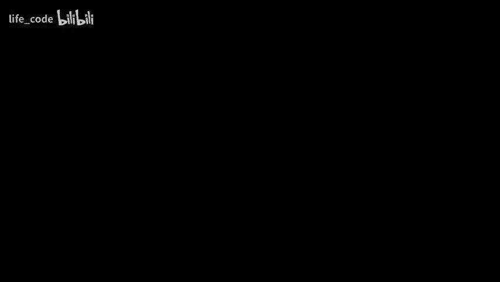
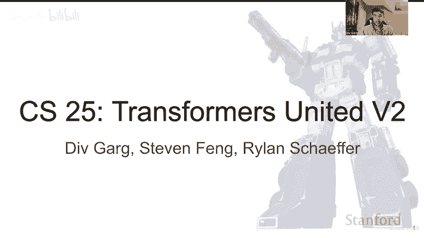
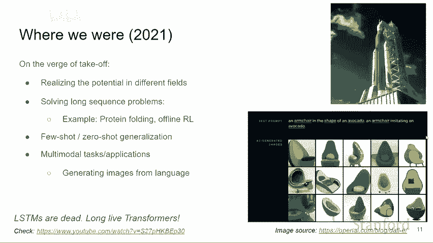
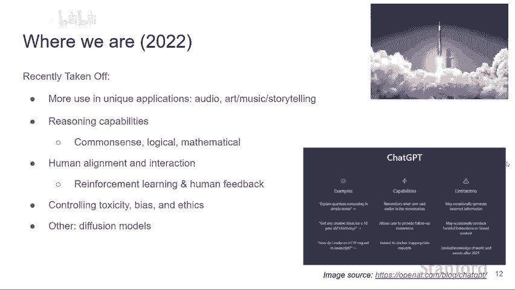
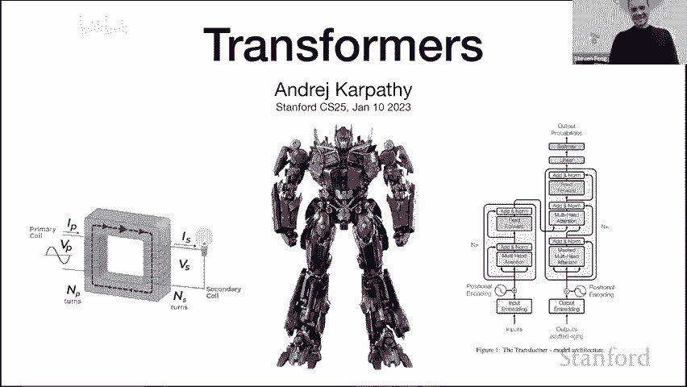
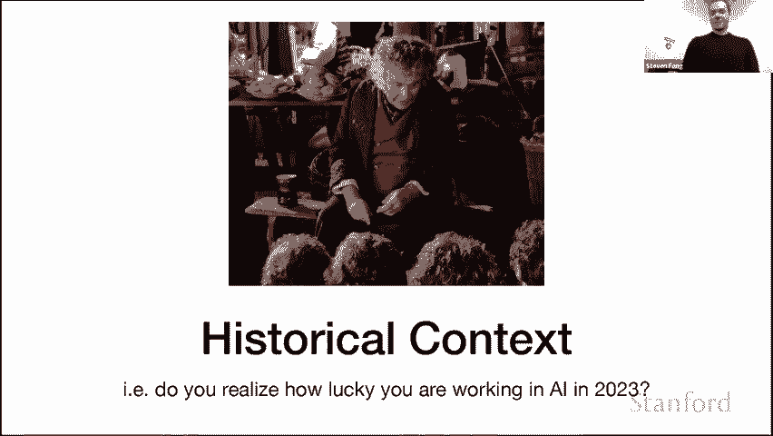
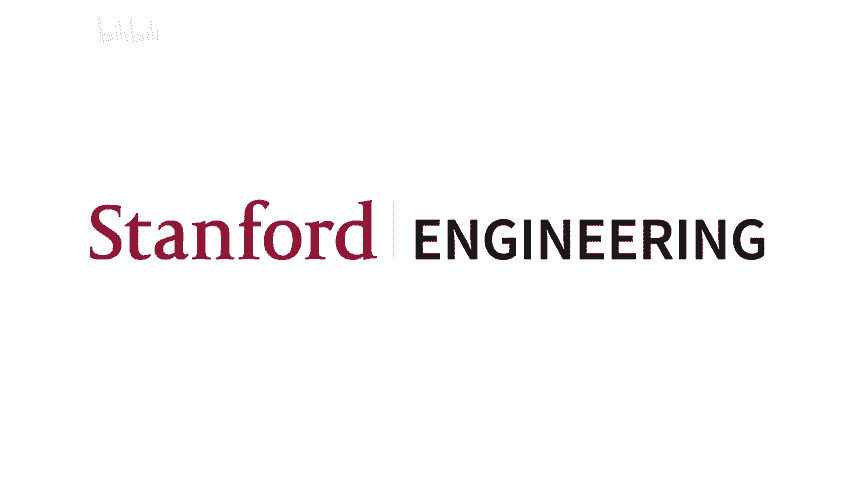

# 斯坦福 GPT／Transformer 原理介绍 (中英文双字幕) - P11：11.Introduction to Transformers w_ Andrej Karpathy - life_code - BV1X84y1Q7wV

Hi everyone， welcome to CS25 Pro UnitedV。This was a course that was held at Stanford in the winter of 2023。

😊，This course is not about robots that can transform into cars， as this picture I suggest， rather。

 it's about deep learninging models that have taken the world by the storm and have revolutionized the field of AI and others。

Starting from natural language processing， transformers have been applied all over from compvis。

 enforcementment learning， biology， robotic， etc。We have an exciting set of videos lined up for you with some truly fascinating speakers。

 skip talks。Presenting how they're applying transformers to the research in different fields and areas。

We hope。You'll enjoy and learn from these videos。So without any furthereddo， let's get started。

This is a purely introductory lecture。And we'll go into the building blocks of transformers。

So first， let's start with introducing the instructors。So for me。

 I'm currently on a temporary diploma from the PhP program and I'm leading here at a robotics startup。

 collaborativeative robotics working on some general purpose robots， somewhat like a the。

 and yeah I'm very passionate about robotics and building assist learning algorithms。

 my research interests in in personalsonal lending ands in remote modeling and I have a bunch of publications in the robotics government driving other areas。

Undergrad close at Cornell， it's someones book Cornell， it's an estimate call。

So I'm Stephen a Gr Fer CSP speaker， Per did my master's at CMU and an undergrad。

Mainly into NLP research， anything involving language and text。

 but more recently I've been getting more into computer vision as well as Mon。

And just some stuff I do for fun， a lot of music stuff made piano。

 some self promo but I post a lot on my ins YouTube and TikTook so if you guys want to check it out my friends and I are also starting a Stanford piano club so if anybody's interested feel free to email with Y for details other than that you know martial arts。

 bodybuild。P're trying a pig dramas anime。Occasional game。😀。Yeah。Okay cool yeah。

 so my name'sryland the same talk about myself I just want to very briefly say that I'm super excited to take this class I the last time was sorry to teach this class me I the last time it was offered of I thought we brought a really great group of speaker last time I'm super excited for this offering and yeah I'm thankful you're all here and I'm looking forward to a really fun quarter you was the most out speakak outspoken student last year and so someone wants to become instructor next year in。

Okay。😊，Go。Let's see if okay a few minutes。So what we hope you will learn in this class is first of all。

 how do transforms work？how they being applied just don cannot and now days like we are pretty much in them everywhere in the AI machine learning and what are some new interesting directions of research in the topics。

Co so this class is just an introductor， just talking about the basics of transformers introducing them。

 talking about a self potential mechanism on which they are founded and will do a deep dive more on like a model like to GPT so get。

Happy to get solid。Okay， so let me start with presenting the attention timeline。

Attention all started with this wall paper attention is all by wasman L in 2017 that was the being transformers before that we had the field story error where we had models like RNM LSTMs and simple attention mechanisms that didn't involve for scale depot。

Start in 2017 we solve this explosion of transformers into NLP where people started using it for everything。

 I even heard the support from Google as like our performance increased every time we fight our linguist。

诶。For the course 2018 after 2018 to 2020， we saw this explosion of customers into other fields like vision。

😊，Bch of other the stir and like biology and last year 2021 was the start of the geneticative error where we got like a lot of genetic modeling started like models like Kox。

 GT， Dali， stable equations to a lot of things happening in genetic modeling and we start scaling up in AI and now the present。

So this is 2022 and like the startup in 23 and now we have almost like a chattyy whisper a bunch of others and we are like scalinging onward without spell out so that's great。

 so that's the future。So going more into this。So once there were audit。So we had two models， LTN。

 GIU。What worked here was the day of good at ending history。😊。

But what did not work was they didn encode long sequences and they were very bad at encoding content。

So consider this example。Consider trying to predict the last word in the text。

 I grew up in France dot dot dot， I speak fluent D。

Here you need to understand the context for it to predict French and take attention mechanism is very good at that。

 whereas if you're just using LSTMs， it doesn't work that。Another thing transformers are good at is。

U。More based on content is like also context prediction is like finding attention maps if I have something like a word like it。

 what now does it collect and we can give like a probability attention on what are the possible activations and this works are better than existing mechanisms。

Okay。So where we were in 2021， we were on the verge of takeoff。

We were starting to realize the potential of transformers in different fields。

 we solved a lot of long sequence problems like protein folding， Al fold， offline Arl。

We started to see zero short generalization we saw multimodal tasks and applications like generating images from language so that's all dli yeah and it feels like Asia shared but person like two years ago。

And this is also a talk on transformers that can watch in give。

Yeah。Co and this is where we was going from 2021 to 2022。

 which is we have gone from the verge of taking off to actually taking off and obviously we are seeing unique applications in audio generation art。

 music sort towering we are starting to see reasoning capabilities like common sense。

 logical reasoning， mathematical reasoning。We are also able to now get human enlightenment and interaction。

 they're able to use reinforcement learning and human feedback that's how tragedy is trained to perform really good we have a lot of mechanisms for controlling toxicity bias and ethics now and a lot of also a lot of developments in other areas like different models。

够。😡，啊。So the feature is a spaceship and we are all excited about it。😊。

And there's a lot of more acquisition that we can enable and it'll be great if you can see transformers also work here one big example is for your understanding and generation that is something that everyone is interested in and I'm hoping we'll see a lot of models in this area this year also finance business。

😊，I'll be very excited to see GT author novel， but we need to solve very long sequences modeling and most transformative models are still limited to like 4000 opens or something like that so we need to do a。

Make them general much more better on long sequences we are also we also want to have general agents that can do a lot of multitask。

Amatic input。Predictions like Goto and so I think we will see more of that too and finally we also want domain specific models。

 so you might want like a GP models that's good at like maybe like help so that could be like a doctor GPT model you might have like a large GP model that's like on only on raw data so currently we have like GP models that are trained on every but we might start to see more niche models that are like good at one task and we could have like a mixture of expert and think like this is like how you normally consult an expert will' have like expert A models and you can go to a different air models for your different needs。

Yeah。There still a lot of missing ingredients to make this all successful the first of all is external memory we are already starting to see this with models like ChaGPT where the interactions are short lived。

 there's no long term memory and they don't have ability to remember stored conversations for long term and this is something we want to fix。

😊，Second over second is reducing the computation complexity。

 so attention mechanism is quadtic over the sequence length which is slu and we want to reduce itra make it faster。

诶。Another thing you want to do is we want to enhance the controllability of these models like a lot of these models can be stochastic and we want to be able to control what sort of outputs we get from them and you might have experienced the charge if you just refresh you get like different output each time。

 but you might want to have mechanism black printers， what sort of things you can。

And finally we want to align our state of art language models with how the human brain works and we are seeing the search。

 but we still need more research on seeing how they can be more important。可系哼。😊，Yes。

 I'm excited to be here I live very nearby so I got the invites to come to class and I was like。

 okay I'll just walk over but then I spent like 10 hours on the slides so it wasn't as simple。

So yeah I want to talk about transformers， I'm going to skip the first two over there。

 we're not going to talk about those we're going to talk about that one just to simplify the lecture here since we've done have time。

嗯。Okay， so I wanted to provide a little bit of context of why does this transformers class even exist so a little bit of historical context I feel like Bbo over there I joined like telling you guys about this I don't know if you guys saw the drinks and basically I joined AI in roughly 2012 and full course so maybe a decade ago and back then you wouldn't even say that you joined AI by the way that was like a dirty word now it's okay to talk about but back then it was not even deep learning it was machine learning that was a term use if you were serious but now now AI is okay to use I think。

So basically do you even realize how lucky you are potentially entering this area and roughly 2203 so back then in 2011 or so when I was working specifically on computer vision。

Your your pipelines looked like this， so you wanted to classify some images you would go to a paper and I think this is representative you would have three pages in the paper describing all kinds of a zoo of kitchen sink of different kinds of features。

 descriptors and you would go to poster session and in computer vision conference and everyone who have their paper feature descriptors that they're proposing and it's totally ridiculous and you would take notes on like which one you should incorporate into your pipeline because you would extract all of them and then you would put an SVM on top so that's what you would do so there's two pages make sure you get your spars sip histograms。

 your SSIs your color histograms， textiles， tiny images and don't forget the geometry specific histograms。

 all of them had basically complicated code by themselves you're collecting code from everywhere and running it and it was a total nightmare so。

On top of that it also didn't work so this would be I think representative prediction from that time you would just get predictions like this once in a while and you'd be like you just shrug your shoulders like that just happens once in a while today you would be looking for a bug。

And worse than that。Every single every single sort of feel every single chunk of AI had their own completely separate vocabulary that they work with。

 so if if you go to NLP papers， those papers would be completely different so you're reading the NLP paper and you're like what is this part of speech tagging morphological analysis syntactic parsing coreference resolution what is NPBT JJ and you're confused so the vocabulary and everything was completely different and you couldn't read papers I would say across different areas？

So now that changed a little bit starting in 2012 when Askochevsky and colleagues basically demonstrated that if you scale a large neural network on large data set you can get very strong performance and so up till then there was a lot of focus on algorithms but this showed that actually neural net scale very well so you need to now worry about compute and data and if you scale it up works pretty well and then that recipe actually did copy paste across many areas of AI so we started to see a neural networks pop up everywhere since 2012 so we saw them computer vision and NLP and speech and translation in RL and so on so everyone started to use the same kind of modeling tool modeling framework and now when you go to NLP and you start reading papers there in machine translation for example。

 this is a sequence of sequence of paper which will come back to in a bit you start to read those papers and you're like okay I can recognize these words like there's a neural network there's some parameters there's an optimizer and it starts to read like things that you know of so that decreased tremendously the barrier to entry across。

The different areas。And then I think the big deal is that when the transformer came out in 2017。

 it's not even that just the toolkits and the neural networks were similar is that literally the architectures converge to like one architecture that you copy paste across everything seemingly so this was kind of an unassuming machine translation paper at the time proposing the transformer architecture but what we found since then is that you can just basically copy paste this architecture。

And use it everywhere and what's changing is the details of the data and the chunking of the data and how you feed in and you know that's a caric but it's kind of like correct first order statement and so now papers are even more similar looking because everyone is just using transformer and so this convergence was remarkable to watch and unfolded over the last decade and it's crazy to me what I find kind of interesting is I think this is some kind of a hint that we're maybe converging to something that maybe the brain is doing because the brain is very homogeneous and uniform across the entire sheet of your cortex and okay maybe some of the details are changing but those feel like hyperparmeters of like a transformer but your auditory cortex and your visual cortex and everything else looks very similar and so maybe we're converging to some kind of a uniform powerful learning algorithm here something like that I think is kind of interesting。

Okay， so I want to talk about where the transformer came from briefly historically。

So I want to start in 2003， I like this paper quite a bit it was the first sort of。

Popular application of neural networks to the problem of language modeling so predicting in this case the next word in a sequence。

 which allows you to build generative models over text and in this case they were using multiier perceptron so a very simple neural the neural net took three words and predicted the probability distribution fourth word in a sequence So this was well and good at this point Now over time people started to apply this to a machine translation so that brings us to sequence to sequence paper from 2014 that was pretty influential and the big problem here was。

 okay we do just want to take three words and predict it for we want to predict how to go from an English sentence to a French sentence and the key problem was。

 okay you can have arbitrary number of words in English and arbitrary number of words in French so how do you get an architecture that can process thisvariably sized input。

And so here they use a LSTM and there's basically two chunks of this。

 which are covered the Sla by the。まです。But basically have an encoder LSTM on the left and it just consumes one word at a time and builds up a context of what it has read。

 and then that acts as a conditioning vector to the decoder RN or LSTM that basically goes chunk chunk chunk for the next word in a sequence translating the English to French or something like that。

Now the big problem with this that people identified I think very quickly and tried to resolve is that there's what's called this encoded bottleneck。

 so this entire English sentence that we are trying to condition on is packed into a single vector that goes from the encoder for the decoder and so this is just too much information to potentially maintain a single vector and that didn't seem correct and so people are looking around for ways to alleviate the attention of sorry the encoded bottleneck as it was called at time。

And so that brings us to this paper， neural machine translation by jointly learning to align and translate。

Here just quo from the abstract in this paper， we conjected that the use of a fixed length vector is a bottleneck in improving the performance of the basic encoded decoder architecture and proposed to extend this by allowing the model to automatically soft search for parts of the source sentence that are relevant to predicting target word yeah without having to form these parts or heart segments explicitly so this was a way to look back to the words that are coming from the encoder and it was achieved using this soft search so as you are decoding in the。

The words here， while you are decoding them you are allowed to look back at the words at the encoder via this soft attention mechanism proposed in this paper and so this paper I think is the first time that I saw basically attention so your context vector that comes from the encoder is a weighted sum of the hidden states of the words in the in the encoding。

And then the weights of this come from a softmax that is based on these compatbilities between the current state as you're decoding and the hidden states generated by the encoder and so this is the first time that really you start to like look at it and this is the current modern equations of the attention and I think this was the first paper that I saw it in is the first time that there's a word attention used as far as I know to call this mechanism so I actually tried to dig into the details of the history of the attention so the first author here Dmitri I had an email correspondence with him and I basically sent him an email I'm like Dmitri this is really interesting transformers have've taken over where did you come up with the soft attention mechanism that ends up being the heart of the transformer and to my surprise he wrote me back this like massive email which was really fascinating so this is an excerpt from that email。

嗯。So basically he talks about how he was looking for a way to avoid this bottleneck between the encoder and decoder。

 he had some ideas about cursors that traversed the sequences that didn't quite work out and then here so one day I had this thought that it would be nice to enable the decoder RN to learn to search where to put the cursor in a source sequence this was sort of inspired by translation exercises that learning English in my middle school involved bulk you gaze shifts back and forth in the source and target sequence as you translate so literally I thought this was kind of interesting that he's not made English speaker and here that gave him an edge in this machine translation that led to attention and then led to transformer so that's really fascinating I expressed a soft search as softmax and that way the averaging of the ByN statess and basically to my great excitement this dis work from the very first try so really I think interesting piece of history and as it later turned out the name of RNN search was kind of blame so the better name attention came from Yohua on one of the final passes。

As they went over the paper， so maybe attention is all you need would have been called like harnesss or just hold。

But we have Yoshua Benio to thank for a little bit of better name I would say。

 so apparently that's the history of this subject that was interesting。Okay。

 so that brings us to 2017， which is attention is all unique so this attention component which in Dimetrius paper was just like one small segment and there's all this bidirectional RN RN and decoder and this attention on paper is saying okay you can actually delete everything like what's making this work well very well is just the attention by itself。

And so delete everything， keep attention and then what's remarkable about this paper actually is usually you see papers that aren't very incommer they add like one thing and they show that it's better。

 but I feel like attention is all unique was like a mix of multiple things at the same time they were combined in a very unique way。

And then also achieve a very good local minimum in the architecture space。 And so to me。

 this is really a landmark paper that。And it's quite remarkable and I think have quite a lot of work behind the scenes。

So delete all the RNN just keep attention because attention is operates over sets and I'm going to go into this in a second。

 you now need to positionally encode your inputs because attention doesn't have the notion of space by itself。

Theyて。You have to be very careful。They adopted this residual network structure from resonance。

 they interspersed attention with multilayer perceptrons。

 they used layer norms which came from a different paper they introduced a concept of multiple heads of attention that were applied to parallel and they gave us I think like a fairly good set of hyperparmeters that to this day are used so the expansion factor in the multilayer percept on goes up by forx and we'll go into like a bit more detail and this forex has stuck around and I believe there's a number of papers that tried to play with all kinds of little details of the transformer and nothing like sticks because this is actually quite good the only thing to my knowledge that stuck that didn't stick was this reshuffling of the layer norms to go into the prenorm version where here you see the layer norms are after the multi-headed attention or before they just put them before instead so just reshuffling of layer norms but otherwise the GPSTs and everything else that you're seeing today is basically the 2017 architecture from five years ago and even though everyone is working on it it's proven remarkably resilient which I think is relevant。

There are innovations that I think have been adopted also in position encoings。

 it's more common to use different rotary and relative position encoings and so on。

 so I think there have been changes， but for the most part it's proven very resolute。

So really quite an interesting paper now I wanted to go into the attention mechanism。And I think。

I sort of like the way I interpreted is not。Is not similar to the ways that I've seen it presented before so let me try a different way of like how I see it basically to me attention is kind of like the communication phase of the transformer and the transformer interleaves two phases。

 the communication phase， which is the multiheaded attention and the computation stage。

 which is this multio perceptron or people form。So in the communication phase。

 it's really just a data dependent message passing on directed graphs。

And you can think of it as okay forget everything with a machine translation and everything let's just we have directed graphs at each a node you are storing a vector and then let me talk now about the communication phase of how these vectors talk to each other in this directed graph and then the compute phase later is just a multi of receptron which now which then basically acts on every node individually but how do these node talk to each other in this directed graph so I wrote like some simple python。

Like I wrote this in Python basically to create one round of communication of using attention as the message passing scheme。

So here。A node has this private data vector as you can think of it as private information to this node。

 and then it can also emit a key a query and a value and simply that's done by linear transformation from this node。

 So the key is what are the things that I am。Sorry。

 the query is one of the things that I'm looking for。

 the key is where are the things that I have and the value is one are the things that I will communicate。

😡，And so then when you have your graph that's made up of nodes in some random edges。

 when you actually have these nodes communicating， what's happening is you loop over all the nodes individually in some random order and you are at some node and you get the query vector Q which is I'm a node in some graph and this is what I'm looking for and so that's just achieved via this linear transformation here。

And then we look at all the inputs that point to this node。

 and then they broadcast where are the things that I have， which is their keys。😡。

So they broadcast the keys， I have the query then those interact by dot product to get scores。

 so basically simply by doing dot product you get some kind of an unormalized weighting of the interestingness of all of the information in the notes that point to me and to the things I'm looking for and then when you normalize that with softbacks so it just sums to one。

 you basically just end up using those scores which now sum to one and our probability to distribution and you do a weighted sum of the values to get your update。

So。I have a query， they have keys dot products to get interestingness or like affinity。

 softmax to normalize it and then weight at some of those values， flow to me and update me。

And this is happening for each note individually and then we update at the end and so this kind of a message passing scheme is kind of like at the heart of the transformer and happens in a more vectorized batched way that is more confusing and is also inter interspersed with layer norms and things like that to make the training behave better。

 but that's roughly what's happening in the attention mechanism I think on the high level。U。So yeah。

 so in the communication page of the transformer， then this message passing scheme happens in every head in parallel and then in every layer in series。

And with different weights each time。And that's it as far as the multiheaded tension goes and so if you look at these encoder decoder models。

 you can sort of think of it then in terms of the connectivity of these nodes in the graph。

 you can kind of think of it as like okay all these tokens that are in the encoder that we want to condition on they are fully connected to each other so when they communicate they communicate fully when you calculate their features but in the decoder because we are trying to have a language model we don't want to have communication from future tokens because they give away the answer at this step so the tokens in the decoder are fully connected from all the encoder states and then they are also fully connected from everything that is before。

And so you end up with this like triangular structure of in the directed graph but that's the message passing scheme that this basically implements and then you have to be also a little bit careful because in the cross attention here with the decoder you consume the features from the top of the encodeder so think of it as in the encoder all the nodes are looking at each other all the tokens are looking at each other many。

 many times and they really figure out what's in there and then the decoder when it' it's looking only at the top nodes。

So that's roughly the message passing scheme I was going to go into more of an implementation of a transformer。

 I don't know if there's any questions about this。哦，你问。Self attention and move by attention。

 But what is the the。不是。嗯。Yeah， so。Self attention and multi headeded detention so the multi headeded detention is just this attention scheme。

 but it's just applied multiple times in parallel multiple has just means independent applications of the same attention so。

This message passing scheme basically just happens in parallel multiple times with different weights for the query key and value。

 so you can always look at it like in parallel I'm looking for I'm seeking different kinds of information from different nodes and I'm collecting it all in the same node。

It's all done in parallel。So heads is really just like copy paste in parallel and layers are copy paste。

 but in series。Maybe that makes sense。And self attention， when it's self attention。

 what it's referring to is that the node here produces each node here， so as I described it here。

 this is really self attention because every one of these nodes produces a key query value from this individual node。

When you have cross attention。You have one cross attention here coming from the encoder。

 that just means that the queries are still produced from this node。

 but the keys and the values are produced as a function of nodes that are coming from the encoder。

So I have my queries because I'm trying to decode some the fifth word in the sequence and I'm looking for certain things because I'm the fifth word and then the keys and the values in terms of the source of information that could answer my queries can come from the previous nodes in the current decoding sequence or from the top of the encoder so all the nodes that have already seen all of the encoding tokens many。

 many times can now broadcast what they contain in terms of the information。So。

I guess to summarize the self attention is kind of like。

So cross attention and self attention only differ in where the piece and the values come from。

 either the piece and values are produced from this node or they are produced from some external source like like an encoder and the node over there。

😡，But algorithmically is the same micro operations。好的。O。In the message passing graph paradigm the。

So yeah， so。嗯我。So think of so each one of these nodes is a token。嗯。

I guess like they don't have a very good picture of it in the transformer， but like。

Like this node here could represent the third word in the output in the decoder。And in the beginning。

 it is just the embedding of the word。嗯。And then。Okay。

 I have to think through this knowledge morning， I came up with it this morning。没有。Actually。

 I ca yesterday。我结果。Station。ごい。Notes have been blocked。We better。

These notes are basically the vector。I'll go to an implementation， I'll go to the implementation。

 and then maybe I'll make the connections to the graph。

So let me try to first go to let me not go to with this intuition in mind at least to NAGPT which is a complete implementation of a transformer that is very minimal thats why I worked on this over the last few days and here it is reproducing GT2 on open web textex so it's a pretty serious implementation that reproduces GPT2 I would say and provide it in a compute this was one note of HPs for 38 hours or something like that correctly and it's very readable it's 300 lives so everyone can take a look at it and yeah let me basically briefly step through it。

So let's try to have a decoder only transformer so what that means is that it's a language model it tries to model the next word in a sequence or the next character sequence so the data that we train on it's always some kind of text so here's some fake Shakespeare so this is real Shakespeare we're going to produce fake Shakespeare so this is called the tiny Shakespeare dataset set which is one of my favorite toy datasets you take all of Shakespeare concateninated and it's one megate file and then you can train language models on it and get infinite Shakespeare if you like which I think is medical so we have a text the first thing we need to do is we need to convert it to a sequence of integers。

Because transformers natively process， you know。You can't pluck text into transform you need to some outencod。

 So the way that encoding is done is we convert， for example， in the simplest case。

 every character gets an integerr。And then instead of high there。

 we would have this sequence of integers。So then you can encode every single character as an integer and get like a NAA sequence of integer so you just incatetcatenate it all into one large long one dimensional sequence and then you can train on it Now here we only have a single document in some cases if you have multiple independent documents what people like to do is create special tokens and they intersperse those documents with those special text tokens that they splice in between to create boundaries。

But those boundaries actually don't have any。Any modeling impact it's just that the transformer is supposed to learn beyond that propagation that the end of document sequence means that you should wipe the memory。

😡，Okay， so then we produce batches， so these batches of data just mean that we go back to the one dimensional sequence and we take out chunks of this sequence。

 so say if the block size is eight。Then the block size indicates the maximum length of context that your transformer will process。

 so if our block size is eight， that means that we are going to have up to eight characters of context to predict ninth character in a sequence。

And the batch size indicates how many sequences and parallel we're going to process。

 and we want this to be as large as possible， so we're fully taking advantage of the GPU and the parallelels under the cords。

So in this example， we're doing four by8 batches， so every row here is independent example sort of。

 and then every。Every row here is is a small chunk of the sequence that we're going to train on and then we have both the inputs and the targets at every single point here。

 so to fully spell out what's contained in a single4 by8 batch to the transformer is sort of like compacted here so when the input is 47 by itself the target is 58 and when the input is the sequence 4758 the target is one and when it's 47581 the target is 51 and so on so actually the single batch of examples that's 4 by8 actually has a ton of individual examples that we are expecting the transformer to learn on in in parallel and so you'll see that the batches are learned on completely independently but the time dimensions sort of here along horizontally is also trained on in parallel so sort of your real batch size is more like deted。

It's just that the context grows linearly for the predictions that you make along the T direction。

In the in the model， so this is how the this is all the examples of the model will learn from this single back。

So now this is the GPT class。And because this is a decoder only model。

 so we're not going to have an encoder because there's no like English we're translating from we're not trying to condition on some other external information。

 we're just trying to produce a sequence of words that follow each other are likely to。

So this is all p torch and I'm growing sluy faster because I'm assuming people have taken 2 31 and or something along those lines。

 but here in the forward pass we take this these indices。

And then we both encode the identity of the indices just via an embedding lookup table。

 so every single integer has a we index into a lookup table of vectors in this n dot embedding and pull out the word vector for that token。

And then because the message， because transform by itself doesn't actually。

 it processes sets natively， so we need to also positionally encode these vectors so that we basically have both the information about the token identity and its place in the sequence from one to block size。

Now those the information about what and where is combined additively。

 so the token embeddings and the positional embeddings are just added exactly as here。So this X here。

😡，Then there's optional dropout， this x here basically just contains the set of words。

And their positions。And that feeds into the blocks of transformer that we're going to look into what's blocked here。

 but for here for now， this is just a series of blocks in the transformer。😡，And then in the end。

 there's a layer norm， and then you're decoding the logits for the next word or next integer in a sequence using a linear projection of the output of this transformer。

 so LM head here， a short for language model head is just a linear function。

So basically positionally encode all the words， feed them into a sequence of blocks。

 and then apply a linear layer to get the probability distribution for the next character。

 and then if we have the targets which we produced in the data order and you'll notice that the targets are just the inputs offset by one in time。

Then those targets feed into cross entrytropy loss， so this is just a negative one likelihood。

 typical classification loss。So now let's drill into what's here in the blocks。

So these blocks are applied sequentially。😡，There's again。

 as I mentioned communicate phase and the compute phase so in the communicate phase both of the nodes get to talk to each other and so these nodes are basically。

If our block size is eight。Then we are going to have eight node in this graph。

There's eight nodes in this graph， the first node is pointed to only by itself。

 the second node is pointed to by the first node and itself。

The third node is wanted to buy the first two nodes and itself， et cetera。

 so there's eight nodes here。So you apply， there's a residual pathway in X， you take it out。

 you apply a layer norm and then the self attention so that these communicate these eight nodes communicate。

 but you have to keep in mind that the batch is four so because batch is four this is also applied so we have eight nodes communicating but there's a batch of four of them all individually communicating on those eight node。

 there's no crisscross across the batchsh dimension of course there's no batchche norm range anyway luckier。

And then once theyve changed information， they are processed using the modo receptor。

 and that's the compute base。So and then also here are missing we are missing the cross attention and because this is a decoder only model。

 so all we have is this step here， the multiheaded attention and that's this line the communicate phase。

 and then we have the feet forward， which is the MLP。And that's the complete phase。

I'll take questions a bit later。Then the MLP here is fairly straightforward the MLP is just individual processing on each node just transforming the feature representation sort of at that node so。

Applying a two layer neural nu with a gal nonlinearity。

 which is just think of it as a re or something like that， it just a nonlinearity。

And then MLP straightforward， I don't think there's anything too crazy there。

 and then this is the causal self attention part， the communication phase。

So this is kind of like the loo of things and the most complicated part。

 it's only complicated because of the batch。And the implementation detail of how you mask the connectivity in the graph so that you don' you can't obtain any information from the future when you're predicting your token。

 otherwise it gives away the information so if I'm the fifth token and if I'm the fifth position then I'm getting the fourth token coming into the input and I'm attending to the third second and first and I'm trying to figure out what is the what is the next token well then in this batch in the next element over in the time dimension the answer is at the input so I can't get any information from there so that's why this is all tricky but basically in the forward pass。

嗯。We are calculating the queries， keys and values based on x。

So these are the keys queries and values here when I'm computing the attention。

 I have the queries matrix multiplying the keys， so this is the dot product in parallel for all the queries in all piece。

In older heads。So that I I felt to mention that there's also the aspect of the heads which is also done all and parallel here。

 so we have the batch dimension， the time dimension and the head dimension and you end up with five dimensional tenss and it's all really confusing so I invite you to step through it later and commit yourself that this is actually doing the right thing basically give have the batch dimension。

 the head dimension and the time dimension and then you have features at them。

And so this is evaluating for all the batch elements。

 for all the head elements and all the time elements。The simple Python that I gave you earlier。

 which is queryductpro P。Then here we do a mask to fill and what this is doing is it's basically clamping the。

The attention between the node that are not supposed to communicate to be negative infinity and we're doing negative infinity because we're about to soft max and so negative infinity will make basically the attention that those elements be zero。

😡，And so here we are going to basically end up with the weights。

They serve affinities between these notes。Optional dropout and then here attention matrix multiply V is basically the。

The gathering of the information， according to the ainities we've calculated。

 and this is just a weighted sum of the values at all those nodes。

 So this matrix multiplies as doing that weighted sum。

And then transpose contiguous view because it's all complicated and bashed in five dimensional testors。

 but it's really not doing anything optional dropout and then a linear projection back to the residual pathway。

So this is implementing the communication phase now。Then you can train this transformer。

And then you can generate infinite Shakespeare and you will simply do this by because our block size is eight。

 we start with sum token， say like I used in this case。

 you can use something like a new line as the star token。

And then you communicate only to yourself because there's a single node and you get the probability distribution for the first word in the sequence。

 and then you decode it or the first character in the sequence。

 you decode the character and then you bring back the character and you reencode it as an integer and now you have the second thing and so you get okay。

 where the first position and this is whatever integer it is。

Addd the position encodings goes into the sequence goes into transformer and again this token now communicates with the first open and its identity and so you just keep plugging the back and once you run out of the block size。

 which is eight， you start to crawl。Because you can never have block size more than8 in the way you've trained this transformer so we have more and more context until eight and then if you want to generate beyond date you have to start cropping because the transformer only works for eight elements in time dimension and so all of these transformers in the naive setting have a finite de box size or context length and in typical models this will be 1024 tokens or 2048 tokens something like that but these tokens are usually like EE tokens or sentence piece tokens or work these tokens there's many different encodings so it's not like that long and so that's why I think did' mention we really want to expand the context size and gets gnarly because the attention is sp in the na case。

Now， if you want to。Implement an encoder instead of a decoder。Attention。

Then all you have to do is this master。You just delete that line。So if you don't mask the attention。

 then all the nodes communicate to each other and everything is allowed and information flows between all the nodes。

So if you want to have the encoder here， just delete all the encoder blocks will use attention where this line is deleted。

 that's it。So you're allowing whatever is encode in my store， say 10 tokens， 10 notes。

 and they are all allowed to communicate to each other going up the transformer。

And then if you want to implement cross attention， so you have a full encoder decoder transformer。

 not just a decoder only transformer or GPT。Then we need to also add cross attention in the middle。

 so here there's a self attention piece where all the there's a self attention piece。

 a cross attention piece and this MLP and in the cross attention。

We need to take the features from the top of the encoder。

We need to add one more line here and this would be the cross attention instead of I should have implemented it instead of just pointing I think。

 but there will be a cross attention line here so we'll have three lines because we need to add another block and the queries will come from x。

 but the piece and the values will come from the top of the encoder。

And there will be basically information flowing from the encoder strictly to all the nodes inside X。

And then that's it， so it's very simple sort of modifications on the decoder attention。

So you'll hear people talk that you kind of have a decoder only model like GP。

 you can have an encoder only model like Bt or you can have an encoder decoder model like say t5 doing things like machine translation so and in Bt you can't train it using sort of this。

Language modeling setup that's utter aggressive and you're just trying to predict the next omin sequence you're training it to a slightly different objectives you're putting in like the full sentence and the full sentence is allowed to communicate fully and then you're trying to classify sentiment or something like that so you're not trying to model like the next token in the sequence so these are trans slightly different with math。

啊。With using masking and other deno techniques。Okay。

 so that's kind of like the transformer I'm going to continue so yeah， maybe more questions。你说我。哦。对。

我 really。I。Okay。You， good pepper still for。Find is a dynamic route that。

We can actually change in everything and you also have something。

Did it like we are enforcing these constraintsprints on it by just masking by give aware of it。啊啊。

So I'm not sure if I fully follow， so there's different ways to look at this analogy。

 but one analogy is you can interpret this graph as really fixed it's just that every time you do the communicate。

 we are using different weights， you can look at it down。

So if we have block size of eight in my example， we would have eight nodes here we have two four six okay。

 so we'd have eight nodes， they would be connected in you lay them out and you only connect from left to right but we're different。

Yeah， we'll have a very connected part。Oh。Why wouldU the connections don't change as a function of the data or something like that？

The not。 I wonder if I theres any。I don't think I've seen a single example where the connectivity changes dynamically option data。

 usually the connectivity is fixed if you have an encoder and you're training a Bt。

 you have how many tokens you want and they are fully connected。And if you have decoder a long model。

 you have the triular thing， and if you have encoder decoder。

 then you have awkwardly sort of like two tools of nodes。诶呀。啊对啊就是我们。最后就。家佢你嗯。嗯。不要对起。作为直播人我诉。第划孙嗰月啊。

I wonder。Do much more about this and then go。都走。你冇想出去。有直。Okay。Which。Part。Okay。对系咧。これ。嗯。哦，有か。冇 your。

Different things。我是多。Yeah it's really hard to say so that's why I think this paper is so interesting is like。

 yeah usually you'd see like a path and maybe they head path internally because just didn't publish it and all you can see is sort of things that didn't look like the transformer I mean you had resnets which have lots of this but a resnet would be kind of like this but there's there's no self- attention component。

 but the MLP is there kind of in a resNe。嗯。So a resonanceson looks very much like this。

 except there's no， you can use layer norms and resonances I believe as well。

 typically sometimes they can be bash norms。So it is kind of like a renet。

 it is kind of like they took a ressonnet and they put in a trans selfpottiary block in addition to the preexistent MLP block。

 which is kind of like convolutions and MLP was strictly speaking deconvolution one by one convolution。

 but I think the idea is similar that MLP is just kind of like you know typical weights。

 No nonlineararity weights or operation。嗯。And but I will say like， yeah。

 it's kind of interesting because。A lot of work is not there and then they give you this transformer and then it turns out five years later it's not changed even though everyone's trying to change it so it's kind of interesting to me that iss kind of like a package came like a package which I think is really interesting historically and I also talked to paper authors and they were unaware of the impact that transform would have at the time so when you read this paper actually it's kind of unfortunate because this is like the paper that changed everything but when people read it it's like question marks because it reads like a pretty random machine translation paper I go over doing machine translation oh here's a cool architecture okay great good results like。

It's it doesn't sort of know what's going to happen and so when people read it today I think they're kind of confused potentially like having like having。

 I will have some tweets at the end， but I think I would have renamed it with the benefit of hindsight of like。

 well I'll get to it。Yeah。这个。Okay。我个放。Yeah I think that's a good question as well currently I mean I certainly don't love the autoaggressive modeling approach。

 I think it's kind of weird to like sample a token and then commit to it。So。

know maybe there's some ways some hybrids with diffusion as an example。

 which I think would be really cool。Or we'll find some other ways to like edit the sequences later about filling in our regressive framework。

 but I think the fusion is kind of like an up and coming modeling approach that I personally find much more appeal when I sample text I don't go chunk chunk chunk and commit I do a draft one and then I do a better draft two。

And that feels like a the fusion process。So that would be my hope。Okay， also question so yeah。

 you like the logic but it。When you say， like the。Se attention is sort of like computing like a agiator because to the adopt product on the notionary。

And then those we have the edge the like multily by the other values。

And then just appropriate it yes， yes right， and do you think there's like a。

Agy like profitable networks and。I find the graph neural networks kind of like a confusing term because。

I mean， yeah， previously， there was this notion of。

I kind of thought maybe today everything is a graph neural network because the transformer is a graph neural and processor。

 the native representation that the transformer operates over is sets that are connected by edges in a direct way and so that's the native representation and then yeah。

Okay， I should go on because I still have like 30 slides。G solve。Those want one provide by。Oh， yeah。

Yeah， the root D， I think basically like as if you're initializing with random weight separate from ausion as your dimension size grows。

 so does your values， the variance grows and then your softmax will just become the one half vector。

 so it's just a way to control the variance and bring it to always be in a good range for softmax and nice distribution。

O。So it's almost like an initialization thing。Okay。

So transformers have been applied to all the other fields and the way this was done is in my opinion kind of ridiculous ways honestly。

 because I was a computer vision person and you have commons and they kind of make sense。

 so what we're doing now with bits as an example is you take an image and you chop it up into little squares and then those squares literally feed into a transformer and that's it。

Which is kind of ridiculous and so。下面。Yeah， and so the transformer doesn't even in the simplest case like really know where these patches might come from。

 they are usually positionly encoded， but it has to sort of like rediscover a lot of the structure I think of them in some ways。

 and it's kind of weird to approach it that way。But it's just like the simplest baseline of just choing up big images into small squares and feeding them in as like the individual nodes actually works fairly well and then this is in transformer encoder so all the patches are talking to each other throughout the interpret。

And the number of nodes here would be sort of like nine。Okay。Also in speech recognition。

 you just take your Mel spectrogram and you chop it up into your slices and feed them into a transformer。

 so there wrote paper like this but also whisper whisper is a copy based transformer if you saw whisper from OpenAI you just chop up Mel Spectrogram and feed it into a transformer and then pretend you're dealing with text and it works very well。

Decision transformer and RL you take your state's actions and reward that you experience an environment and you just pretend it's a language and you start to model the sequences of that and then you can use that for planning later that works pretty well you know even things like alpha fold so we were briefly talking about molecules and how you can plug them in so at the heart of alpha fold computationally is also a transformer。

One thing I wanted to also say about transformers is I find that they're very they're super flexible and I really enjoy that I'll give you an example from Tesla。

Like you have a come that that takes an image and makes predictions about the image and then the big question is how do you feed in extra information and it's not always trivial like say I have additional information that I want to inform that I want the output to be informed by maybe I have other sensors like radar maybe I have some map information or a vehicle type or some audio and the question is how do you feed information into a come that like where do you feed it in do you concatenate it like how do you do you add at what stage and so with the transformer it's much easier because you just take whatever you want。

 you chop it up into piecessis and you feed it in with a set of what you had before and you let the self- attentionten figure out how the potentially should communicate and that actually frankly works。

So just chop up everything and throw it into the mix is kind of like the way and it frees neurallet from this version of Eidean space where previously you had to arrange your computation to conform to the Elidean space or three dimensions of how you're laying out the compute like the compute actually kind of happens in normal like 3D space if you think about it。

 but in intention everything is just sets so it's a very flexible framework and you can just like throw this stuff into your conditioning set and everything just self-ated over so it's quite beautiful with retro respect okay。

So now what exactly makes transformers so effective？

I think a good example of this comes from the GT3 paper which I encourage people to read language models are twoshot learners。

 I would have probably remained this a little bit， I would have said something like transformers are capable of in context learning or like meta learning that's kind of like what makes them really special so basically the something that they're working with is okay I have some context and I'm trying to let's say passage this is just one example of many I have a passage and I'm asking questions about it。

And then I'm giving as part of the context in the prompt， I'm giving the questions and the answers。

 so I'm giving one example of question answer， another example of question answer。

 another example of question answer and so on。And this becomes a。可以， people跟他说一啊。Okay。

 it is really important for me think。Okay， so what's really interesting is basically like。

With more examples given in the context the accuracy improves and so what that hint at is that the transformer is able to somehow learn in the activations without doing any gradient descent in a typical fine tuning fashion so if you fine tune you have to give an example and the answer and you fine tuning using gradient descent but it looks like the transformer internally in its weights is doing something that looks like potentially gradient decent some kind of the mental learning in the weights of the transformer as it is reading the prompt and so in this paper they go into okay distinguishing this outer loop with stochastic gradient descent and this inner loop of the in contexttext learning so the inner loop is as the transformer is sort of like reading the sequence almost and the outer loop is is the training by gradient descent so basically there's some training happening in the activation of the transformer as it is consuming a sequence that may be very much looks like gradient descent and so there's some recent papers that kind of hint at this and study it and so as an example in this paper here they propose something called the raw operator and they argue that the raw operator is implemented by a transformer。

And then they show that you can implement things like Ri regression on top of a raw operator。

 and so this is kind of giving their papers hinting that maybe there is something that looks like gradient based learning inside the activations of the transformer。

And I think this is not impossible to think through because is what is gradient based learning。

 overpas， backward pass， and then update？Well， that looks like a resume。

Right because you're just changing you're adding to the weights so you start initial random set of weights。

 forward pass backward pass and update your weights and then forward pass backward path weights。

 it looks like a resnet transformers is a resnet so much more hand wavy。

 but basically some paper trying to hint that why that would be potentially possible。

And then I have a bunch of tweets I just gotten and pasted here in the end。

 this was kind of like meant for general consumption。

 so they're a bit more high level and high a little bit。

 but I'm talking about why this architecture is so interesting and why why potentially became so popular and I think it simultaneously optimizes three properties that I think are very desirable number one。

 the transform is very expressive and if overpass it's sort of like is' able to implement very interesting functions。

 potentially functions that can even like do metaer。Number two。

 it is very optimizable thanks to things like residual connections layerknow and so on and number three it's extremely efficient。

 this is not always appreciated， but the transformer。

 if you look at the computational graph is a shallow wide network which is perfect to take advantage of the parallelmal GPUs so I think the transformer was designed very deliberately to run efficiently on GPUs there's previous work like neural GPU that I really enjoy as well which is really just like how do we design neural adss that are efficient on GPUs and thinking backwards from the constraints of the hardware which I think is a very interesting way to think about it。

啊。Oh。Oh yeah so here I'm saying I probably would have called I probably would have called the transformer a general purposeus efficient optimizable computer instead of the attention is all you need like that's what I would have maybe in hindsight called that paper is proposing it is a model that is。

嗯。Very general purpose， so forward passes express it。

 it very efficient in terms of GPU usage and is easily optimizable by gradientd descent and trains it very nicely。

Then I have some other hot tweets here。Anyway， so yeah you can read them later。

 but I think this ones maybe interesting， so if previous neural nets are special purpose computers designed for a specific tasks。

 GPT is a general purpose computer reconfigurable at runtime to run natural language programs。

 so program the programs are given as prompts。And then Chi became Ro the program by completing the document。

So I really like these analogies personally to computer。

 it's just like a powerful computer and it's optimizable by gradient descent。And。系 don't know o啊。

I think you can read this later， but it's right out just thank you， I'll just leave this up。😊，Yeah。

So sorry， I just found this lead。Turns out that if you scale up the training set and use a powerful enough neuralNes like a transformer。

 the network becomes a kind of general purpose computer over text。

 so I think that's a kind of like nice way to look at it and instead of performing a single text sequence you can design the sequence in the prompt and because the transformer is both powerful but also is trained on large enough very hard data set it kind of becomes a general purpose text computer and so I think that's kind of interesting way you look at it。

Yeah。哦。Yeah。后。Yeah。哦。对。啊。系 guess。I系。What。Good。好。哦。That was alreadyient。有。Oh。So it is。Oh。

Im moved sorry。Yes me，但是我意思觉得好。Okay。其实大一开过。Oh。I was too favorite。Its pretty really like most of it。

 you know。It mostly more efficient。It very good place but you have that。大会。すて。Dr。 By。Yeah very。

So I think there's a bit of that， yeah， so I would say RNNs like in principle yes。

 they can implement arbitrary programs， I think it's kind of like a useless statement to some extent because they are they're probably。

 I'm not sure that they're they're probably expressive because in a sense of like power in that they can implement these arbitrary functions。

But they're not optimizable。😡，And they're certainly not efficient because they are serial computing devices。

Um so I think， so if you look at it as a compute graph， RNNs are very long。变了。佢血挂。啊。

Like if you stretched out the neurons and you look like take all the individual neurons in our connectivity and stretch them out and try to visualize them。

 RNNs would be like a very long graph in a bad and it's bad also optizability because I don't exactly know why but just the rough intuition is when you're back propagating。

 you don't want to make too many steps。😡，And so transformers are a shallow wide graph。

 and so from supervision to inputs is a very small number of hops。

And it's along residual pathways which make gradients flow very easily and there's all these layer norms to control gradient the scales of all of those activations and so there's not too many hops and you're going from supervision to input very quickly and just flows through the graph。

Ands it can all be done in parallel so you don't need to do this encoder decoder RNANs you have to go from first word。

 then cycle word then third word， but here in transformer。

 every single word was processed completely as sort of in parallel。

Which is kind of the so I think all these are really important because all these are really important and I think number three is less talked about but extremely important because in deep learning scale matters and so the size of the network that you can train gives you is extremely important and so if it's efficient on the current hardware then we can make it bigger。

我而家出嚟佢对我我个有我自己。か。Yeah how does that believe the dataNo so yeah so you take your image and you apparently chop them up into patches so there's the first thousand tokens or whatever and now I have a special so radar could be also but I don't actually know the native representation of radar so。

But you could， you just need to chop it up and enter it。 And then you have to encode it somehow。

 Like the transformer needs to know that they're coming from radar。 So you create a special。

You have some kind of a special token that you。These radar tokens are much slightly different in the representation and it's learnable by gradientcent and。

Like vehicle information would also come in with a special embeddedbedding token that can be learned。

So。Have you those like you don't， it's all just a set。

And just's when the voiceman guarantee know hit and it say button。Yeah， it's all just a set。

 but you can position encode these sets if you want。But position encoding means you can hardwire。

 for example， the coordinates like using sinusoss and Posons， you can hardwire that。

 but it's better if you don't hardwire the position。

 you just it's just a vector that is always hanging out at this location。

 whatever content is there just adss on it and this vector strainable by background that's how I do it。

Yeah唔。I think they're kind of delegate， like they seem to work。

 but it seems like sometimes our solution want to put sub structure。咁嘢佢系 might。嗯。

I' if I understand question， so I mean the position encoders like they they're actually like not they have okay。

 so they have very little inductive bias or something like that they're just vectors hanging out the location always and you're trying to you're trying to help them network in some way。

And。I think the intuition is good， but。Like if you have enough data usually trying to mess with it is like a bad thing like trying to like trying to enter knowledge when you have enough knowledge in the data set itself is not usually productive so it really depends on what scale you are if you have infinity data then you actually want to encode less and less that turns out to work better and if you have very little data then actually you do want to encode some biases and maybe if you have a much smaller data set and maybe coalutions are a good idea because you actually have this bias coming from more filters and so。

But I think。So the transformer is extremely general。

 but there are ways to mess with the encodings to put in more structure like you could， for example。

 encode sinuses and cosines and fix it or you could actually go to the attention mechanism and say。

 okay， if my image is cho up into patches this patch can only communicate to this neighborhood and you can you just do that in the attention matrix just mask out whatever you don't want to communicate and so people really play with this because the full attention is inefficient so they will intersperse。

 for example， layers that only communicate little patches and then layers to communicate globally and they will sort of do all kinds of tricks like that so you can slowly bring in more inductive bias。

 you would do it but the inductive biases are sort of like they're factored out from the core transformer and they are factored out in the。

In the connectivity of the notes， and they are factored out in positioning and can mess this。

P proposition。AndHow you pocket？大。不该我。哦。So there's probably about 200 papers on this now。

 if not more， they're kind of hard to keep track of honestly like my Safari browser。

 which is what's sort on my computer， like 200 open tabs。But。Yeah。

 so'm not even sure if I want to pick my paper honestly。

And you can a maybe use a transformer like the other one that I actually like even more is potentially keep the context length fixed but allow the network to somehow use a scratchpa and so the way this works is you will teach the transformer somehow via examples in the hey you actually have a scratchy hey basically you can't remember too much your context line is finite but you can use a scratchpad and you do that by emitting a scratchpa and then writing whatever you want to remember and then end scratchpad and then you continue with whatever you want and then later when it's decoding you actually like have special logic that when you detect start scratchpad you will sort of like save whatever it puts in there in like external thing and allow it to attend over it。

So basically you can teach the transformer just dynamically because it's so meta learned。

 you can teach it dynamically to use other gizmos and gadgets and allow it to expandend his memory that way if that makes sense it's just like human learning to use a notepad right you don't have to keep it in your brain so keeping things in your brain is kind of like a context line from the transformer。

 but maybe you can just give it a notebook and then it con query the notebook and read from it and write to it maybe you another。

Yes。咁觉现在你怎下。The way going to this。都快嘅啲。为什你嘅。I don't know if I detected that。

 I kind of feel like did you feel like it was more than just a long prompt that's unfolding？咱再。

I didn't try extensively， but I did see a forgetting event and I kind of felt like the block size was just moved。

啊。Maybe I'm， I don't actually know about the internal of tragedy。Get two。So one question is。

 what do you think about architecture？S for S for。I' say I don't know this， which one is this for？

And second question， this was a personal question， what are you going to work on next？I mean。

 so right now I'm working on things like nanoGPT where is nanoGT。😊，呃。I mean。

 I'm going basically slightly from computer vision and like part kind of like the computer vision based products do a little bit in the language domain whereas tryGT。

 okay then on GT。So originally I had MinG， which I ever wrotete to nanoGPT and I'm working on this I'm trying to reproduce GPTs and I mean I think something like chat GPT I think incrementally improved in a product fashion would be extremely interesting。

I think a lot of people feel it and that's why it went so wide so I think there's something like a Google plus plus plus to build that I think is very interesting。

Do we diversity run thought？

