# 斯坦福 GPT/Transformer 原理介绍 (中英文双字幕) - P12：12.Language and Human Alignment - life_code - BV1X84y1Q7wV

我很高兴欢迎来自 OpenEI 的 Jan，他领导着那里的对齐团队，之前也曾是 Deep Mind 的研究员。拥有强化学习理论的博士学位，思考对齐问题超过 10 年，今天他将进行非常有趣的演讲，希望大家喜欢。

是的，非常感谢你的介绍，也很高兴我能参加。😊。我很兴奋能够讨论这些内容，我也非常乐意保持互动，如果你在任何时候有问题，请随时打断我。😊，啊。是的，我想开始谈谈。我认为发生的事情的一些非常基本的观察。而且。所以第一个是。

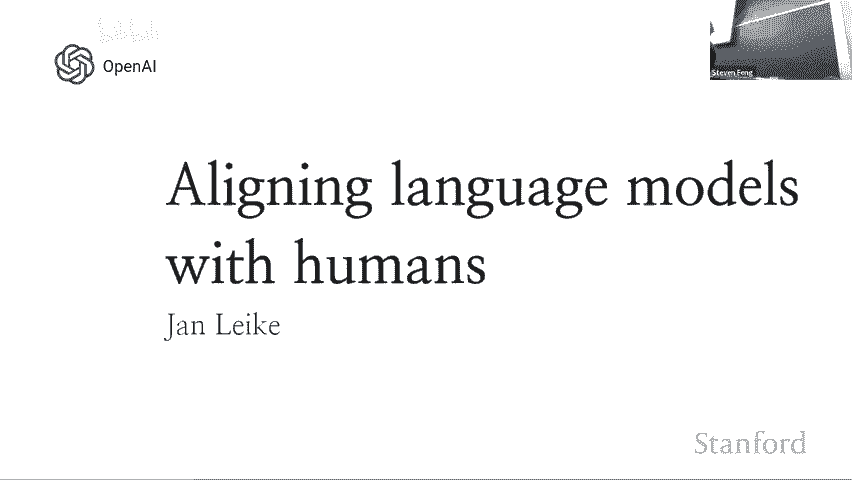

TmiI 正在加入游戏。所以 hemiI 有很多不同的因素。他们并不是同时加入，而是一个接一个地加入。而且他们的参与者在能力上差异很大，目前许多参与者到目前为止。我真的不那么聪明，通常只能完成非常狭窄的任务集合。诶。😊，但是。

我们观察到的一件事是，随着时间的推移，你知道。我们看到越来越强的参与者加入。这就是我们现在的状态。然后一般来说。我们预计 Himmiai 有一些极其强大的参与者。因此，这些参与者能够比人类思考得更好。

快得多，便宜得多。而且。这些还没有加入。因此。对。拥有像我们一样的锚基金，如果你考虑一下，比如说 chattP。😊，ChatTBT 已经可以做到。任何人都能了解更多事实或说更多语言。而且它可以以每秒大约 50 个声音的速度写作。并且成本是人类在最低工资下的约 100 倍。

所以。你知道，有。CheBT 也有一些非常重要的局限性，还有很多事情他们无法做到。但是这算是一个。你知道，某些未来可能加入的参与者的指标。因此，似乎从长远来看。TmiI 将拥有所有对团队人类的优势。但是。还有一个重要的警告，就是。

Kim Kim 有一个重要的优势。团队人类可以选择哪些来自团队 mi I 的参与者加入并获胜。因此，这是一种在我们思考该做什么时，应该真正重视的优势，当我们思考。你知道，我们正在与 CMI 玩这个游戏，以及我们将与 TI 玩。哦。

所以我认为作为人类团队我们应该做的两个主要目标是，首先，我们应该尝试招募。来自地 I 到客户的 Pes。因此，这大致上是我将要追踪的内容。这就是我面临的问题。还有其他目标。所以我认为另一个非常重要的目标是，你要制定游戏规则，以便人类团队不会失去。

现在，人类掌握了主动权，我们可以制定规则，所以我们应该制定合理的规则，以便于未来继续进行这场游戏。因此，在这次演讲中，我不会谈论第二点，而是将讨论第一点，因为这是我所了解的，并且那不是浪费时间。诶。😊。

用不同的方式表达，或者让它更像。

实际上，我所考虑的对齐的一个方式是，你想要构建遵循人类意图的 AI 系统。而且，你知道的，遵循我们想要的那种人类偏好。所以，有很多事情，基本上我将讨论两个主要方面，第一部分将是我们过去所做的工作。😊，大致上属于我们正在尝试弄明白如何实现的范围。

我们今天拥有的模型已经尽可能地对齐，我们正在努力尝试这个，看看我们能做到多远。第二个方面是我们接下来必须做的事情。我们尚未完成的事情，我们认为将非常重要。我想大致说明一下为什么我认为它们可能是。对。现在，我说，你知道。

我正试图使这个更加清晰，或像分解一下对齐的含义。所以不在这里，因为现在的重点是：遵循人类攻击意味着什么？

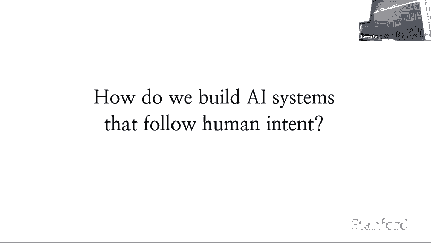

我们关心的意图大致分为两个主要类别。我会说，如果它对你有帮助，你知道，我给助手指令，或者如果你想做我的助手，它应该做我的助手，我应该遵循这些指令。但还有许多其他意图在我通常情况下没有说明，你知道的。

与系统或人类交谈时，他们最终真的在乎的是。就像你知道的，它不应该字面上总是执行我说的每一句话，而是理解我的意思，它不应该编造东西，不应该做有害的事情，并且在不确定我意思时应该提出后续问题，等等。

所以。这些都属于那些通常很难准确指定的事情，或者像……你知道，什么是我同意的？但这仍然是我们想要实现的事情，我们必须弄清楚如何去……你知道，进入这个领域。因此，今天我们使用的主要技术之一是我们所称的重要反馈，这曾用于训练脚本 GP 和聊天 GPT。

这就像是占据这个公园的主要调音。诶。基本系统非常简单，而且也像是适用于大多数 AI 模型和模式的超级通用技术。但在这种情况下。我们将使用管理质量，因此分为两个步骤。

实际上没有链限制的步骤，所以我会从这些事情开始。首先，你想要从 Comp 训练一个模型。在这种情况下你已经通过了。现在解释何时不。或者你知道，帮我进行翻译。不管是什么，然后模型会做一堆事情，然后你会选择哪个更接近你想要的模型。

因此，你有一个更大的偏好集，你训练你的奖励模型，而奖励模型基本上学习预测你更喜欢哪个。书。所有一切都可以说，就尽快多花时间在镜头前。我觉得这看起来不错。😊，抱歉。也许我们把它转动一点。哦，对。没有。好吧。现在我们通过模型捕捉到我们关心的偏好和我们希望模型做的事情。

然后第二步是现在你用输入优化你的奖励模型。😊，因此不是设置。你知道，模型尝试一堆不同的事情，然后模型告诉它哪个可能更接近你想要的事情。

不。他们将依赖于字母，不同的标签。他们可能还会存在不一致性，你可以给出这些关于偏好的示例。😊。但这些在目前并没有真正成为问题。到目前为止，你知道，我们的飞行往往并不一致，但模型整体平均起来是这样。😊，下。不，是的，所以。

这就像是基本技术，概念上非常简单。如果你没有翻译成一个模型，而是像每个 R 那样标记，你可以使其更简单。😊。但这将大大降低数据效率，因此你可以将其转变为思考。

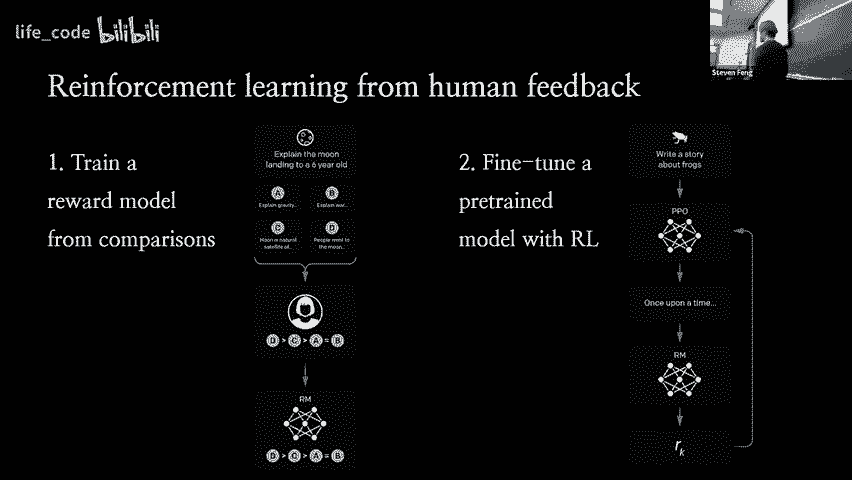

对的。对。那么它将如何运作，这实际上是论文中的一个主要思想，而这是我喜欢展示的，因为这真的让我大开眼界，至今仍然如此。我们在这里看到了什么？在 X 轴上，你会看到这是来自 GP3 模型系列的，并且这是不同的三种模型，跨越两个数量级。😊，然后 Y 轴是人类偏好的评分水平如何？😊。

所以如果你给一群人展示一些样本，他们更倾向于选择其中的一个吗？

然后我们看到即使是最大的 G3 模型。😊。也比最小的指令 G 变体更受欢迎，因此 100 倍小的指令模型？😊，如果。实际上更受欢迎。超过更大的模型。接屏我晒接屏电话。这有点疯狂。抱歉。让我完成我的发言。那么为什么。我也这是没写就没退过去。这基本上表明，它想在 COD 的线上，整个模型让它们变得更有用。

😊，或者说更糟，没有人想用它。你们能听到我吗？我们做了很多花哨的对齐技术，但并没有被采用。所以我们原本是在第一个版本中看到了这些回归，然后这里标记为 PPO PX 的部分，实际上是在最后阶段，我们将自由训练数据混合到微调中，这减轻了我们看到的一些回归。

嗯。😊，是的，我刚好想跟进一下。那微调的重要性如何？你们是从人类那里收集数据的，对吧？如果你们使用一些预训练的迁移模型来评分，或者类似的东西，那样可以做到吗？确实有其他论文讨论过这个问题，我认为他们写过一篇关于**宪法人工智能**的论文，正是试图做到这一点。

就某些方面而言，语言模型将能够自动排序某些事物，而有些事情则不能，因为你知道，它不会知道你的确切偏好，也不会知道我们想要做的是什么。因此，每当语言模型执行某个操作时。

我们更喜欢这样，实际上我们必须提供另一个数据点，换句话说，如果你要与人类对齐，某种程度上你必须把人类纳入环路，否则，模型怎么知道它应该做什么呢？还有很多问题，我不知道克里斯是谁。😊，是的，你的意思是大约需要多少个提交的偏好来实现这些？

我马上就会提到这个问题。是的，有些问题。😊，那么你进行实验的原因是什么？

我们还没有。我们实际上没有仔细比较我们的算法，可能不同的神经算法会更好。😊，那是连接生活。我知道 PVO 是在 OpenAI 发明的，所以我们才使用它。这不是个好理由，除了它运作得相当不错。是的，eCompisons。

这个比其他的东西要好。所以通常我们让人们比较大约三到六个来自不同模型的不同响应。好的，是的。😊，那么 PPO 和奖励模式目前在聊天 GT 中投入生产吗？你们是否使用任何人类反馈，比如你知道的，你可以重新生成响应之类的东西来帮助？

作为奖励函数，你是指重新生成的方式吗？就像在 T 上有一个按钮，你可以选择重新生成响应，或者你使用任何隐含反馈吗？基本上在人类使用中，我不知道目前的情况如何，我预计人们会尝试使用它。

但是你知道 GBT 推出的时间不久。是的，我对这个图感到好奇，似乎像你提到的，增加参数并没有给你带来太多的**保真度**，在质的方面你已经追踪这个一段时间了。

你能否一开始就判断你是在与 10 亿模型还是 100 亿模型互动，就像伪图灵测试一样，但参数规模如何？我给你一个黑箱，你能告诉我它有多少个参数吗？

😊，可能不是非常准确。但我认为大反问是，我能否写提示。如果你只是随机从人们在*游乐场*上输入的内容中提取提示，而这正是我们用于 TPT 的点，那么我可能需要相当多的提示才能分辨出差异，但如果我可以写提示，我大概能在一两次内做到，尤其是如果任务是区分这个和那个。

是的。我想我可以再做两张幻灯片，或许你的问题会得到解答，然后。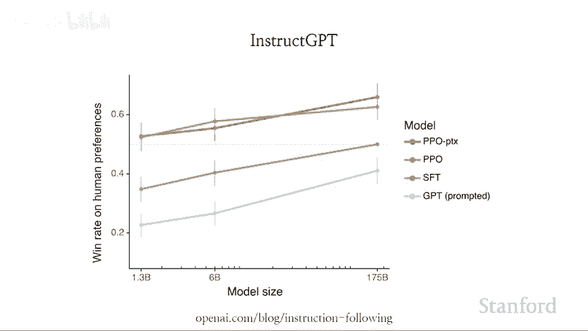

这是关于训练成本的问题，所以这一点真的让我大吃一惊，与预训练相比，它是极其便宜的。如果你看看训练 GB 所需的实验室数量，然后与微调的成本进行比较，以及 R 与预训练的关系。

😊，像是最贵的讲师 B 版本价格不到预训练计算机的 2%。😊。如果你想训练一个更大的模型，那成本会更高，但你仍然可以使用相同的*微调*步骤来使其更一致。

当然，我认为这里需要注意的重要一点是，我们还没有解决所有问题。还有一些重要的限制，因此我不会说这是你知道的最后一个版本，我们将努力探索未来如何利用更多的计算资源和更多的人类数据。

😊。

但总的来说，这个效果出乎意料地好。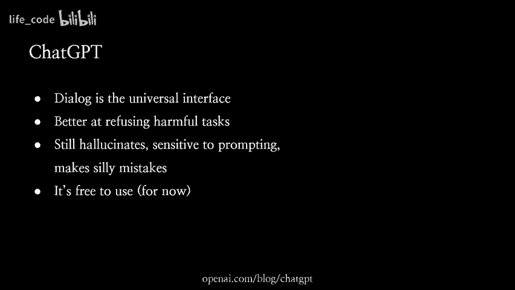

好的，还有更多问题。😊，我的问题是，我只是想问 PTx 是什么。将预训练数据混入 IO F 微调，就像混合梯度一样。快速问一下，这个图的参数数量是多少？所以你固定了这个分支的数量，这是完整的 GP3 版本，也就是 1750 亿模型。所以。没有其他问题吗，好的。

Zoom 上也有一些问题，太好了，好的，当然。所以第一个问题是，你会如何处理所有边缘情况？例如，偏好是价值的一个良好代理。但优化它们是会激励设备感知的。是的，我会提到这个。😊，当然。下一个问题是，如果你想进行自动对齐研究，发生了什么，如果你需要概念视觉，其他人是专家，怎么办？好的。

我觉得我也会在最后得到一个机会，好的，我们来看看，抱歉。是的。我想有一个问题就是，*人类反馈*与*风扇功率*相比，乐趣感觉会如何呢？

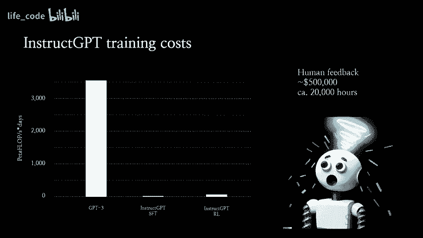

微调像监督性微调一样。但更像是，如果你直接使用人类选择的数据。是的，我也不确定是否可以。因此，我展示的一个基线是，如果你只是采取人类示范的方式。

你知道，我们有一堆任务，我们只让人类去做它们，记录他们的操作，然后训练模型模仿。这实际上是非常基础的行为克隆，只是使用相同的损失进行重新训练。然后，你知道，它比 H shot hunted 版本明显更好，但仍然远不如。因此，这就是我们喜欢使用我们的基本概念。

模仿人类的方法有两个问题，一个是。人类在某些方面比模型更好，而在其他方面则更差，所以在模型擅长的事情上，你试图模仿你无法做到的东西。而在模型更擅长的事情上，你让模型变得更糟，因为你强迫它以人类的方式完成任务。

什么。然后。所以。通过我们的所有你与其他的杰夫，你有点让模型随心所欲。它可以找到做事情的最佳方式。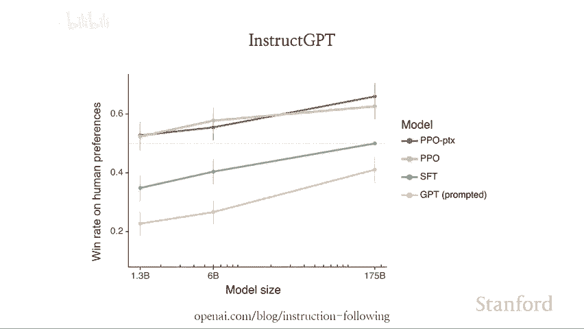

另一个重要的优势，我会提到这一点，但简要谈谈 Cha GBT。😊，所以我认为 CaGBT 就像是对 instructGBT 的升级，算是让模型更对齐并对人类更有用的下一步。

有些事情，比如，我认为章节做得更好的，就是把对话作为通用接口，你可以直接与它对话。你可以问后续问题，可以要求它完善答案，这些都使得处理变得更容易。

它在拒绝有害任务方面更擅长，但仍然有重要的局限性，最大的问题是模型会经常产生幻觉。当你给它任何任务时，它会编造事实，这使得它非常不可靠，同时也对提示非常敏感，这显示了。

😊，你知道，它仍然存在重要的不对齐问题。我们需要解决。真的。如果一个模型应该尽其所能地完成任务，无论你如何提示。嗯。😊。

但确实，我认为有一个重要原则，对于杰夫来说非常有用，就是评估比生成更容易。😊，所以如果我们让人类比较和排名模型给出的不同响应。嗯。😊，分辨模型生成的不同变体比直接完成任务更简单。换句话说，你可以对任务进行比较。

你仍然可以在你自己可能做得不好的任务上发现良好的行为。所以如果你给出这样的反馈。那就意味着，系统应该做得比你实际能够做得更好。我认为这是一个在很多领域都适用的非常普遍的原则。

所以你可能最熟悉的是，是的，你知道 P 与 NP，每个人。你知道我们实际上并不知道它们是否不同，但在实践中，似乎 NP 任务要难得多。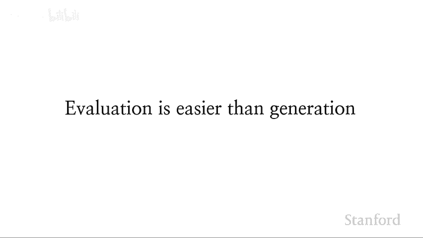

嗯，它还适用于许多其他环境，例如很多职业体育或电子竞技，如果你不能轻易判断自己是否获胜，那观看的乐趣就会大打折扣。比起实际在专业水平上竞争更容易。它适用于许多消费产品，你可以看两个智能手机，告诉你更喜欢哪个，这不仅仅是看规格那么简单。实际上，这很难把它和我的手机相提并论。它还适用于学术研究。

你知道，查看一篇论文并指出其所有缺陷要简单得多，而写好一篇论文则要困难得多。它适用于，我不知道何时。嗯。是的。基本上，这在许多领域都适用。所以我认为这就像是一个非常。😊。这个原则在我们希望对 AI 系统的任务进行对齐时非常有用，而这些任务可能是我们自己无法做好。

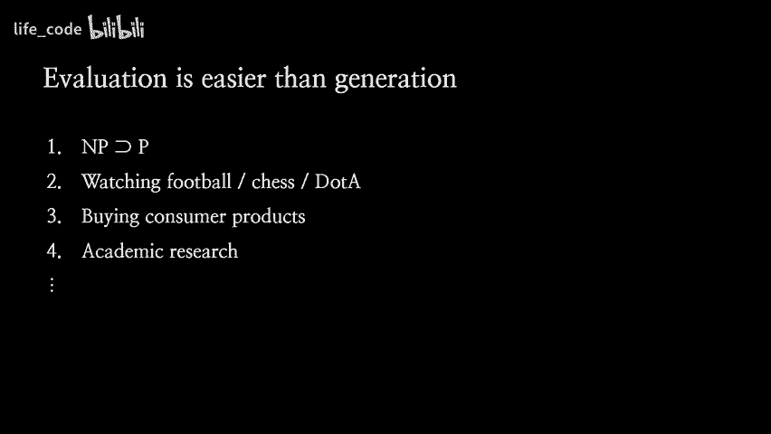

好的。好的，既然这么说。我觉得杰夫有一些非常重要的局限性，我认为这会使得我们的 Hf 在对齐时变得非常困难。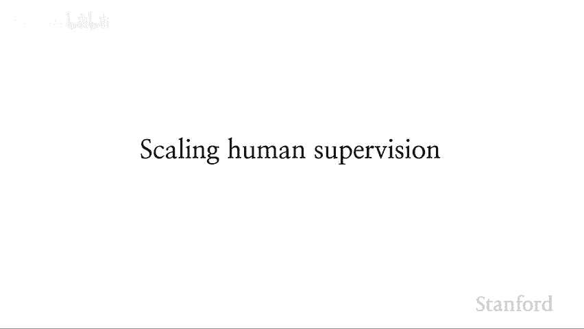

嗯。😊，让我用图表解释一下，基本上在 X 轴上。绘制 AI 进展。而在 Y 轴上，绘制不同任务的难度。随着我们的 AI 进展，AI 能够完成的任务难度也在上升。而像。一个根本性的问题是，人类能够可靠评估的任务水平并没有提高，因为人类不会随着 AI 进展而变得更好。

所以。我觉得我们大概在这里。但是问题是，一旦你跨过这条线。你就真的不知道。😡，你的模型是否真的在做正确的事情，因为你无法再可靠地评估，因此这就像是 RLHF 训练开始崩溃的点，我们可能看到的就是之前我提到的问题，现在系统被优化为响应我们给出的任何反馈，因此它们会试图告诉我们我们想听的东西，而不是它们知道的真相，你知道，它们可能会学会如何欺骗我们，因为这让事情变得更简单。

Justis 在偏好评分上很高。因此，基本的想法是我们想要利用的原则与我刚才提到的有关。这就是评估学生的便利性和生成能力，比如说，如果你有一个大型语言模型来写代码，像整个代码库那样，人类根本无法找到所有的错误和缺陷，或者代码库里可能有一个木马，你可能也无法察觉。

因为这实在太难了，这就是为什么我们会看到那么多有缺陷的代码。但是如果你让语言模型来找出错误并指出来，一旦你知道了这个错误，哦，是的，这确实是一个错误，你知道的，请修复它。因此，现在你只需将任务缩小到。

我只需要评估这是否是我心中规范所设想的错误。因此，我们感到兴奋的一般原则是，我们想要。😊。我们利用 AI 的帮助来进行人类评估。所以希望是，如果你将人类与 AI 配对，实际上会得到一个更像这样的结果。

你知道，人与 AI 一起评估的能力远超过单独评估的能力。😊。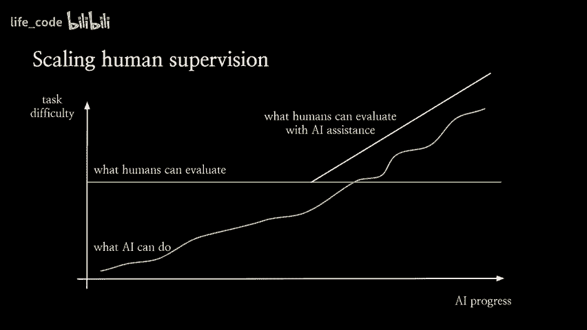

嗯。😊，所以。为了使这更具体，有两种不同的方式你可以做到这一点，或者有许多不同的方式你可以做到。我将强调一下，首先，你可以让 AI 来写一个批评，这是我们去年做的一个项目，在这个案例中有一个简单的总结任务，我们训练了一个语言模型来简单地说。

😊，总结中存在的问题。嗯，以及。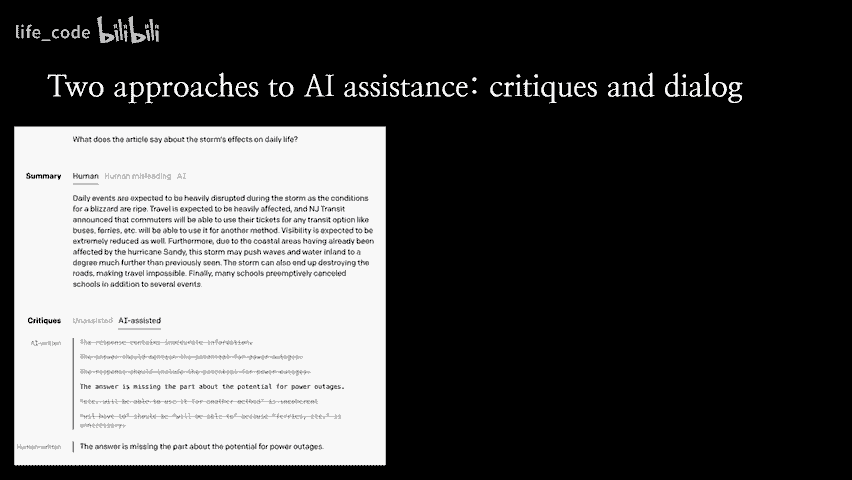

你可以做其他事情，例如，你可以让人们使用 ChatGPT，并问他们，好吧。使用 ChatGPT 来帮助你评估，然后你可以请求一个批评，或者你可以请求很多其他的东西，你可以请求解释，进行事实核查，或者你知道的，任何模型像 ChatGPT 实际上可以可靠地帮助你的事情。因此，想法是，使用 AI 的帮助，你可以获得。

所有的智能城市我拥有。并利用这一点来确定你应该如何评估这个系统的运行情况，以及它是否符合你的偏好，或者它是否在试图欺骗你。而且，这个问题的关键在于，我们如何知道它是否有效？

其中一个困难在于，根据假设我们正在处理一个难度较大的任务，在评估时困难重重，并且我们希望任务是真实的，因为我们不想解决一些无关紧要的高难度任务。因此，这就变得不一样了。

所以你需要一个真实的困难任务，但如果你没有那些，通常也没有基准，所以你不知道哪个是正确答案，你怎么知道辅助是否有效，或者它是否使每个人都偏向于说同样的事情。

所以，有一个简单的技术，我们在评估中使用。我们称之为目标扰动，你所做的是有一堆提示。这可能是人们在聊天中输入的内容。然后你稍微调整一下你的回答，假设这是他们的正确回答，它不一定要正确，但我们假设它是，现在你在要求一个人引入某种微妙的缺陷，这种缺陷很容易被忽视，但却是重要的缺陷。你得到的是一个良好回答和一个糟糕回答的同伴数据集，你知道哪个是好哪个是坏，因为你让它变得更糟。

所以，你知道，从某种意义上说，这给了你机会。现在你可以做的是，随机选择一个正确或有缺陷的回答，然后把它展示给一个人或一个有帮助的人。他们必须说出这是正确的还是有缺陷的，或者这个回答有多好。😊，嗯。在这种情况下，我们可以尝试许多不同的人工智能辅助或可扩展的监督技术，然后说。

你知道，这是否？实际上帮助人类发现我们植入的缺陷，比不帮助时更生动。如果是这样，那么你实际上是在真正帮助。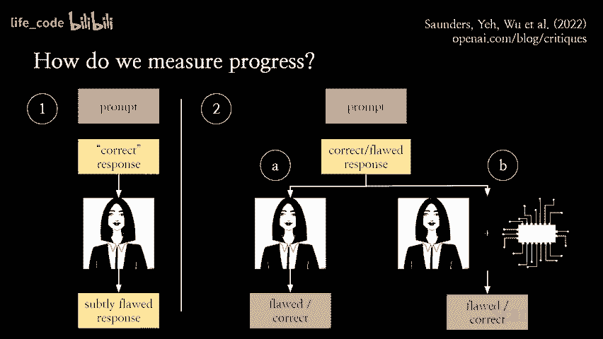

所以我们在评估论文中做了这个，训练语言模型写评估和总结。我们可以展示，当我们在评估中帮助人类进行评估时，他们实际上发现的缺陷比没有帮助时多 50%。这就像是现实生活中的真实迹象，表明你可以使用今天我们已有的模型。

帮助人类评估和发现他们可能错过的问题。当然，我们仍然需要在更困难的任务上进行这种评估，或者在某种意义上的实际任务中，我们还希望有更大的效应量。但我认为，这只是像。

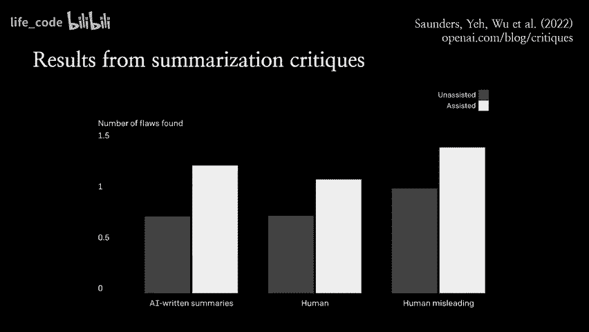

这表明这些技术已经显示出一定的前景。从长远来看。😊。嗯，我认为我们想要实现的是，利用人工智能来处理所有评估我们系统所做的认知劳动。这可能包括阅读相关内容、事实核查、做计算、编写代码或任何这些事情。然后人类应该专注于他们的偏好输入，了解他们真正关心的事情和他们想要的内容。

😊 模型来做。嗯。😊 以这种方式，你可以利用。你知道。AI 参与者将带来的能力以及他们最终会比我们更擅长的事情。然后。就像是利用它们来帮助传达我们实际关心的事情，以及我们真正希望它们做的事情。是的，仅此而已。😊 但是是的。

这些是主要的幻灯片，我很乐意回答更多问题。是的。我在想这种响应的幻觉。你有没有尝试考虑一些关于访问的不确定性的概念，比如采样或类似的东西，响应之间的价值方差，以及某种价值。

是的。这。集成是困难的，因为要么你在同一个预训练模型上训练一个精细的集成，因此在集成中没有太多的障碍，要么你预训练了一堆不同的模型，现在你在预训练上花费了很多钱。

一件事，我是说。看起来这应该是一个可解决的问题，就是让模型在不确定时说它不确定。朝这个方向已经有很多研究，但我认为现在我们仍然不在一个好的状态。做一些聪明的事情。她。是的。

你认为在 AI 建议批评 AI 答案时，我们可能会遇到信号与噪声比的问题吗？因为我肯定，当 AI 试图指出文本中的潜在问题时，人类更可能会支持更多的问题，但如果这些问题是人类一开始并不一定有问题的呢？是的。

所以我们确实尝试通过让人类评估法律的严重性和他们是否会注意到这些法律来对此进行一些控制。他们仍然能看到显著的效果。但还有很多时候模型是在挑剔，而这些并不是有趣的案例。对了，如果你看看我展示的例子，我认为是来自于博客文章，很多关键其实非常糟糕。

😊 使批评变得容易的事情是。大多数都是垃圾，因为人类可以轻松击败它们并将其丢弃，这样就有助于评估者知道应该关注哪里，或者注意到他们可能会错过的东西。所以更像是。你知道，批评帮助你进行头脑风暴，如何进行评估或其他的事情。

但是如果你像是在使用助手，你可能希望获得比仅仅填补大多数答案更可靠的东西。😊 是的。我们如何确保我们在你的递归词建模方法中使用的评估指标，比如检测欺骗，比如左转或其他什么，不会出现重大不连续性。

是的，我认为。嗯，这在很大程度上取决于你所说的是什么类型的社区，对吧？如果。你知道。你收到一夜之间的模型信件，上面说参数数量大了一千倍或同样更好。我可以像。创造一个很大的进步，这使得进行这种评估变得相当困难？嗯。😊，所以从这个意义上说。

我认为将 BI 更加持续地扩展并进行更多增量步骤将非常重要。也就是说，我认为。关于奖励建模的请求的基本情况是。你正在训练系统来帮助你评估，知道吗？系统可以从同一系统中训练或找到你，所以如果你能搞清楚如何去获取。

像以它们提到的一切有用和相关的方式来寻找它们，那么它仍然能够。评估系统，即使它们比你以前评估的任何东西都要聪明得多。也许让我更具体一点，因为我认为你可以用某种方式来衡量这一点，或者我们尝试过的一种方式是使用我们称之为判别的批评差距。所以要衡量这一点，你正在训练两个不同的或你微调的两个不同的模型来自同一个训练模型。

一个是判别器，它只是说。这个是有缺陷的响应还是正确的响应或更正确的响应？

另一个是批评模型，它告诉你缺陷是什么。现在你可以衡量判别器有多频繁地正确，判别器只是纯粹的梯度下降。它并不需要想告诉你任何事情，你基本上只是通过表示与模型连接，并试图获取它对这个预测任务的所有相关潜在见解，而在另一方面，你有这个批评模型或这个一般的辅助模型，你在衡量这个助手实际上多频繁地帮助我指向正确的缺陷。

然后如果你比较这两个分数，你可以查看它们之间的差距。因此。抱歉，判别的批评差距。如果差距很大，那么模型对任务了解得很多，但却没有告诉你，这会非常令人担忧。而如果差距很小。那么，你知道的，可能模型没有告诉你的事情就少得多。

但我想确保这种方法是稳健的，并在学习中进行更多的逐步测试是很有价值的。这就是为什么我们想要在当前模型上进行测试。是的。我不知道谁是第一个。我想是后面有人。😊，我。我想问一下，也许首先是 NX 幻灯片，上面有关于人类强度的内容。所以，你知道，我一直在帮助注意到，部分内容也是在传达你希望 AI 做的事情。

没错，不仅是评估，还有沟通。也许我想让你这样做。也许，我希望我这样做。所以至少在我个人的聊天体验中，有些事情可以做到。这太疯狂了。例如，我会说，不。那是怎么来的？或者你知道，如果你能询问点击。

有不同的事情，对吧？或者我在想，好吧，我可以要求什么，到了什么程度。让我觉得有点担忧的事情就是，像这样，人们并不总是沟通他们的偏好，老实说，我们可能会。可能会有协调的努力，对吧。

就像是为了特定能力而设立奖励的协调努力。一个想法是，我尝试询问是否有一些关于 Wi 本身的想法，但我一开始不知道怎么用。所以我想，也许用户应该有这样的东西。似乎并没有。但是我希望有一个。

对于 G3 来说是有的，对吧？我认为我有一点希望。我的问题是，你如何使这类事情安全？你是否认识到协调努力来具体奖励某种行为，可能某个群体决定他们想要这样。

你知道，给它一些能力，这就是一个非常好的问题，以某种方式。我的意思是，首先显而易见的事情是你不应该仅仅在使用接口的人提供的数据上进行训练，我们已经看到了其他例子的结果，如果你考虑像微软的 T 之类的东西，事情可能会变得相当糟糕。

另一件事是，我的意思是，现在我们所做的就是雇用一群人，然后让他们评估不同模型的响应。但现在问题变成了，你知道，谁会被雇佣，他们的背景是什么，他们在试图做什么。因此，特别是，我认为我们现在做得相当糟糕的是，实际上。

就像导入多样且具有代表性的人类偏好一样，更像是你知道的，我们最终能雇佣谁，所以我有点希望能有更有针对性的研究，关于我们该如何做到这一点，以及如何才能做到好，其中一些也许更适合在大型科技公司之外进行，因为如果你是在科技公司，总是有动力去。

是的。以人类偏好的方式导入，可能并不是我们在灵活状态下人类实际上会做的事情，所以我认为这是一个非常重要的问题，比如数据污染，这就像是这个双重问题，你觉得明显吗？是的，我的意思是，这是不是人们可以用任何人都可以通过自由训练的方式污染网络上的东西？

而且，这一点我们必须非常注意。是的，我不知道。考虑到我们目前正在训练这些模型，也应该解决这些问题。希望此时能更接近偏好。随着人类实践的变化，正如我们看到的过去一样，是否还有什么东西应该跟上？

我的意思是，最明显的事情是模型的知识库就像是预训练截止日期的某种东西；你知道，无论你输入了什么数据进行预训练，它对之后发生的许多事情都一无所知。在更新人类偏好或用于机器人模型的比较方面也是如此。

你只需收集更多数据并重新训练，而功能运行相对便宜，所以你可以再次这样做。我认为变得更难的是，当你部署模型后，人们开始使用它来进行各种任务，以便围绕他们的公司构建东西；如果你更新并更改模型，他们也必须进行大量工作来适应他们正在做的事情。

所以这并不是零成本的。是的，抱歉，我不知道人类的表现，但 G3 的一个优势是它拥有这个庞大的语料库，几乎涵盖了整个互联网。如果你想在特定领域如化学或材料科学中专业化，生成新的内容。

对。己知的但仍然要使用更少的数据，这里仍然是我们应该快速的地方。你的意思是，在化学领域的数据更少，是的，你可能只需要过去 30 年的研究论文，然后可以将其投入到预训练中，模型就知道这些内容，但模型真的能在没有那么多数据的情况下有效学习吗？

或者无法以某种方式适应 GP3 背后的抽象概念？或者这没关系。是的。我的意思是，这就是你打算通过微调实现的总体思路，在某种程度上我们已经看到了这种泛化的方式。例如，instrcutBT 几乎完全在英语语言上进行训练。反馈和演示。而且它在其他语言中也能工作，这真是太神奇了，因此类似地，你可以用对化学一无所知的人来训练模型，然后它会学习如何遵循指令，并在化学主题上这样做，而这种微调可以非常高效，比如用 100 个数据点就能实际改变模型行为。

所以这可以非常有效。我觉得有人问过，没错。关于。响应生成。你在不同表达风格上的努力和培训有多少呢？我注意到，从活动中，它总是给你非常结构化的、科学结构化的答案。如果它把你变成一个科学的科学东正教回答，还是说一个星号。

嗯，是的。我觉得棘手的地方在于，理想情况下，模型应该给你想要的答案，有些人更喜欢科学或技术性的答案，而有些人可能更喜欢更通用的答案。而且，现在的 chat GT 没有办法让你设定具体的偏好，这真是令人兴奋。但我还认为。

你观察到的那种状态实际上可能是我们标注者池的产物。因此，很多 chatB 的工作人员更像是，你知道的。我认为他们更像是计算机科学相关的，还有更多数据是由程序员生成的。相比之下，指令 GT 的标注者更像是通才。而且，是的。

这就像不同，它的风格也会改变。所以没有特定的区分。是的，我的意思是。我们应该做出明确的努力，给你想要的风格，对吧？嗯，是的。所以我想到的一件事是，如何能快速地。在你的这一代或未来的代际，回归到。AI 的进步。对，人类水平，是的。

让人类进行评估，我在想的是。过于伟大，我给我的 10 岁表弟展示了你的聊天程序，仅仅是为了玩一下，那条绿色线比你想象的要多。此外，如果这成为他们教育体验的一部分，他们将更难以区分甚至更简单的任务。

所以我在思考这件事。长期来看，这可能会扰乱或使对齐变得更加困难，因为你有更多的旋转人。例如，杰克说的那个真相。我只是想知道什么？

我的意思是，过于依赖一个不成熟且尚未准备好的技术确实存在风险。你知道。请不要相信模型说的一切，没错，但我认为有一件事。😊我希望的是，你的表亲最终会找到解决办法，他们从小就接触到这些越来越好的 AI 工具，学会如何实际利用它们。

😊，有效地使用，对吧，就像是。你知道，二十年前，或者在某个时候，当你使用谷歌搜索时，比其他人早得多。你可能会在使用这个工具方面变得更好，来完成你想做的一切。嗯。是的，我觉得你举手举了一段时间。任务中的幻灯片。呃，聊天测试。模型任务。嗯。

哦，喂，最后一个。是的，所以现在，看起来你们在使用人类作为与现实世界的生物传感器，获取物理真相。并且使用语言作为对这种真相的压缩接口。你们是否也在考虑直接使用接入技术与模型结合，以获取更真实的答案？

你知道。是的，我的意思是，这取决于传感器可能是什么。我想，最简单的事情之一是你可以要求模型浏览，然后它可以自行核实答案，能导入我不记得的外部知识。而且。😊，嗯，我觉得这会很有用。

我认为这对于辅助人类评估非常有用。😊，那将如何进行？

你可以看看 WebGbT，众所周知，这是一个关于使用模型进行浏览的已发表工作。嗯。我觉得，当你使用这些外部传感器时，有一件事情使得使用变得更困难，或者如果你让模型与现实世界更直接互动，会引发更多安全问题，对吧？如果让你的语言模型进行任意 API 调用。

然后你必须更加小心选择调用哪个。这些调用。如果你作为发布者在审查模型所说的一切。然后你可以决定想要做哪些。嗯。😊，所以是的，这是一个开放的问题。好的，还有一个问题。我想你没有讨论。这些模型的推理能力。

我见过不同的人讨论如何仅仅是每个令牌固定数量，而人类则有系统一和系统二，我们可以快速说话，或是进行一些推理和深入思考，这需要更多的努力。

然后我看到其他人试图强迫它解决一系列问题，或者进行一系列推理，逐步来做事情。你觉得这些东西足以真正获得推理吗？这是我们想要的水平，还是需要真正的大规模微调或架构改变？

我不知道。我也不是问这个的合适人选，我大多数时候并不想这样做。让模型具备新的能力，更像是让它们加入人类团队。哦，我们想做在线问题吗？呃，是的，有。我也觉得有道理，但我的问题是。你觉得对于成年人来说，特别是如果你有像人类一样的东西，这是否是一种角色，你并不教它们。

对人类来说更难。所以你觉得这个配方甚至会更加频繁地使用。是的，很可能。嗯。😊 我的意思是，正如你指出的那样，确实有很多对话数据，如果你能利用这些数据，那将是有用的。我认为可以广泛地将这种事情归类为让 R 算法变得更好，以及我们的反馈，我觉得这很有价值，这应该帮助我们使相同的预训练模型更符合我们收集到的人类偏好。

嗯。😊 但你仍然会遇到所有我们的反馈所存在的局限性。我认为 G3 有一个不错的 API，但我不认为它现在提供我们的角色，但可以进行监督微调，所以你可以这样做。😊 你可以把它们结合起来，进行这种类型的实验或所有问题，所以第一个问题是你能更清楚地描述完整的训练过程，从文本 Dancy 001 和 X 或编程数据开始，按更高的步骤进行吗？

😊 对不起，我没听清，从文本 001 开始，那么你需要多少图像数据，还有多少步骤部分在那个提案中？😊。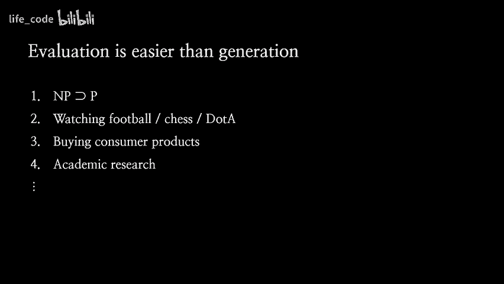

而且，我认为确切的数字是保密的，基本上与指令 GBT 类似，关于指令 GBT 的数字。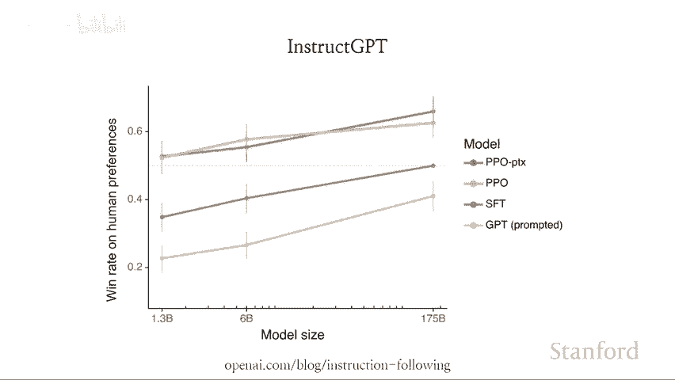

我们有。我想大约有 50,000 次比较。还有大概 10,000 次演示，或者说可能是成千上万次，我不记得确切的数字。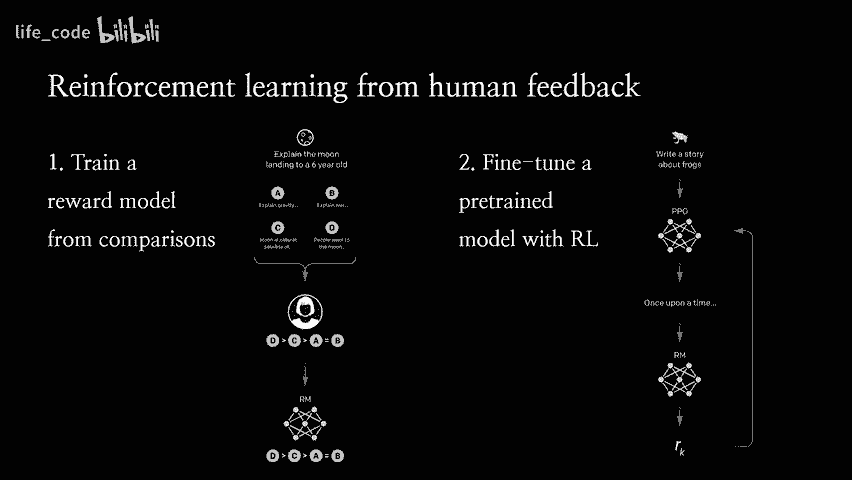

所以我有另一张幻灯片，是关于 20,000 小时的人类反馈，这是我计算的。我的意思是，大问题是你如何确保质量？😊。

嗯。😊 不管怎样，有时需要切换并点击，我会给你一些东西。但这就是整个问题，对吧？假设你真的有一个值得信赖的模型。好的。没问题，下一个问题我认为之前的建议是，你想要自动化对概念问题的研究搜索，这对于专家来说是很难验证的部分。我的意思是，这个计划的目标是训练一个能够进行这种概念研究的模型。

你知道，你可以想象这就像一个语言模型，它像是，写一篇对齐研究论文，我们像是读了这篇论文，然后我们就觉得，哦，这是个很酷的想法，我们应该尝试一下。😊 我觉得，回到评估方面，生成时会更容易。

我认为这同样适用于对齐研究，至少我发现评估对齐研究要比制作对齐研究容易得多。因此，尽管可能有我们需要的概念性突破，但我们现在甚至无法评估它们，因为它们就像，如果我们看到它们，我们会想，这是什么？这有点像。

这就是我们想要减少监督的原因，对吧？因为你知道，如果语言模型产生了这个非常出色的见解，而我们当时甚至无法识别它。嗯，如果我们使用 DI 辅助，并利用我们最好的 AI 模型，我们应该能够更轻松地识别它，😊，以确定那是否是个好主意，它的弱点和优点是什么，以及我们应该进行什么样的实验来知道这是否是个好主意。

是的，我基本上觉得。你知道，利用我们的 HF 训练一个模型以进行良好的对齐研究的故事。你会面临明显的陷阱，也就是说，模型可能会写出看似不错的对齐提案，但实际上，并不是一个好的提案，导致产生与人类不对齐的人工智能。😊。因此，为了区分这两者，可能会非常困难，也许不会，但你知道。

我认为我们应该预期这会非常困难，然后利用情感智能（EI）协助进行评估，这似乎是一个非常有前景的计划。所以关于人工智能，这将是技能的问题。我是说，这正是我的观点。这是不够的。かち。但是你觉得需要更多的东西，还是你想要一种开放策略，你认为如果能获取大量反馈数据，这是否足以产生良好的结果，还是你觉得还需要更多？我觉得我可能搞错了，像是记者，或者我认为是这样的。

😊，基本上，模型的大多数能力以及你看到的所有酷炫功能都来自于预训练，现在则来自于微调阶段。人们有时将其归因于微调阶段的原因是你在预训练模型中没有看到它，我认为我们在预训练模型中没有看到的原因是，预训练模型是如此不对齐，它并不想帮助你，也不想向你展示它能做的所有事情，而是仅仅复述了一些随机的网络文本。

😊，这不是你所寻找的。所以，是的。我认为我们所做的基本上是解锁已经存在于模型中的能力，并使其对人类可用。在某种程度上，像你知道的，对齐研究在某种意义上是双重用途的。

如果你有非常好的对齐技术，你可以用它来对齐任何你想要的价值观。包括一些我们不会特别赞同的价值观。而且 B。如果你对齐得当，它总是会看起来像是你让 AI 系统更强大，因为之前它并没有真正努力帮助你，而现在你让它更对齐，所以你实际上看到了它原本就有的能力。

当然。让我们看看。是的，这个问题跟之前如何处理那种写的前景有关，所以这是一种参考，但是为了优化它们的价值以激励欺骗，那么我们如何应对？

是的，所以这就是我在这里讨论的内容，对吧？😊。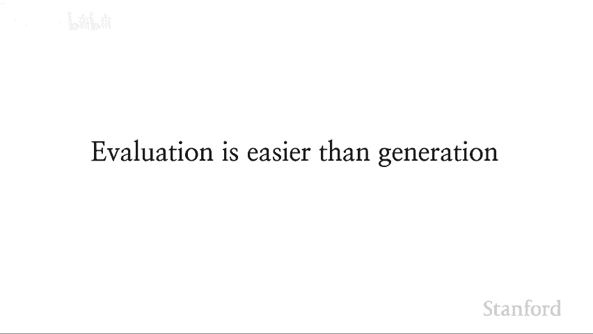

这就是我们所面临的整个问题。人类能够评估的是恒定的，因此我们将无法评估复杂的欺骗尝试，这就是我们希望进行可扩展监督的原因，以便我们能够识别这些欺骗尝试。

是的。到。你们的监控合同计划如何应对我们的区分转变，并避免因其他护理支持而真正改变？是的，所以。我认为这些是真实的担忧。在某种程度上，我们必须通过实证测试来看如何。

实际上它们有多困难和严重，我个人目前的立场是，我认为。试图正确获取外部对齐信号将占据 90%的努力。一旦我们有了这个，很多其他事情也可能会顺利进行，比如。例如。这有点依赖于你担心的不对齐故事。

但你知道，一个故事是你训练你的系统，它学习如何去做。基本上，它是一堆内部优化者，有点像元强化学习。😊所以例如。像 GPT3 可以进行上下文学习，这是一种你知道的，学习的优化器。所以现在你正在进行我们的 A Jeff 训练或其他任何对齐训练。

你就像是优化者学会了你在分部上想要的事情。但是现在如果你有一个分布转变，这个分布转变可能是自我引起的。也就是说，模型自己导致了它。🎼现在你正走出分布，所有这些内部优化者都在尝试优化其他东西。而且。有一种方式你可以这样做。

你知道，这在实践中实际上会发生多少。但是有一个更重要的问题是。如果你有一个非常可靠的外部对齐信号，并且有一个你信任的通用训练信号。你也可以在新的分布上使用它来训练系统。

或者想要连续优化，基本上。所以你就把内部对齐问题简化为如何应对分布变化，以及如何构建一个值得信赖的外部对齐信号？

这些是我们必须面对的问题。嗯。但我不知道这实际上会如何发展，但。有一些重要的开放问题。嗯，是这样的。关于思考，一个线索是，这可能算是一种。需要进行会计讨论的问题。似乎在解释如何应对这些判断方面并没有太多兴趣，或者在 AI 中对分解这些模型的兴趣似乎不大，这就解释了为什么这甚至第二次是任意的，确实在周围有一些真相，但至于它为何会这样做。

你们能更多地质疑判断吗？我的意思是，我认为目前的情况相当不令人满意。你可以问模型为什么给出某个响应，但你不知道它的回答是否真实。而且，你也可以，我的意思是。

你还可以做的另一件事是，给模型一个响应，并要求它找出缺陷。这就是我们在 C 的论文中所做的。嗯。😊，但你知道，我觉得就有一个版本，你试图改善这一点。但问题是，你的信号是什么？

我认为更好的切入角度可能是可解释性。在这里，你可以弄清楚如何深入模型内部，然后。是的。我对可解释性研究的热情在于，这似乎真的对你们的模型有很大帮助，且具有较高的复杂性。

你当前的思考正在向黑箱那一类转变，比如降低这种表示的任务性，这需要。是的，我的意思是，我们正在研究这个问题，但我认为现在没有任何我想展示的东西。

这似乎普遍不是一个容易解决的问题，但你知道，我对我们能做一些事情感到乐观。总体而言，利用可解释性进行对齐的问题有点棘手，因为我怀疑它既不充分，也可能不是必要的。

因此，任何你可以利用的可解释性都将是有用的，因为这是你检测欺骗或了解模型为何给出特定答案或做出特定决定的工具之一。而且，😊，S。你知道的，这有点不清楚，如果你真的能在可解释性方面做到很好。

你如何利用这一点？对于对齐，假设你可以查看模型，并且随意排除所有发现不对齐的模型。但那样的话，你不就是在选择那些在你当前工具下很难发现的重大不对齐模型吗？

其实，只是全面接触，因为我对此的看法在一般伦理实践中是，你必须进行解释。嗯，我在我的问题中，比如说，为什么你会选择这个。嗯，是的，为什么这并不是必要的？再一次。

这有点像一个开放性问题，但基本上你可以采取的立场是，归根结底，真正重要的是模型所做出的决策，而不是它做出这些决策的原因。因此，如果你能做到这一点，你就可以确信模型所做的一切都与你的期望一致。

那么模型内部的想法还重要吗？

我不知道，对，我们就是在努力做这个，我们想要做一个非常好的评估信号，然后你可以选择。你知道的，你可以训练模型去做你想让它做的事情，因为你总是可以进行评估。

比模型更能做事情。是的。嗯，我可能会有很多问题。嗯，他个。很好，但非常感谢你精彩的讲座，非常有趣，我可能实际上不太多，我可能只想做一个直播，我只想像应用一样。好的，最后的部分。

😊，我输了，抱歉，那你觉得这个事情怎么样。😊，我们只围绕了一次。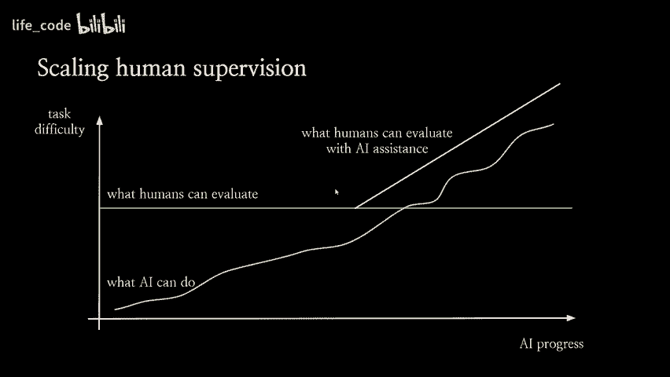

