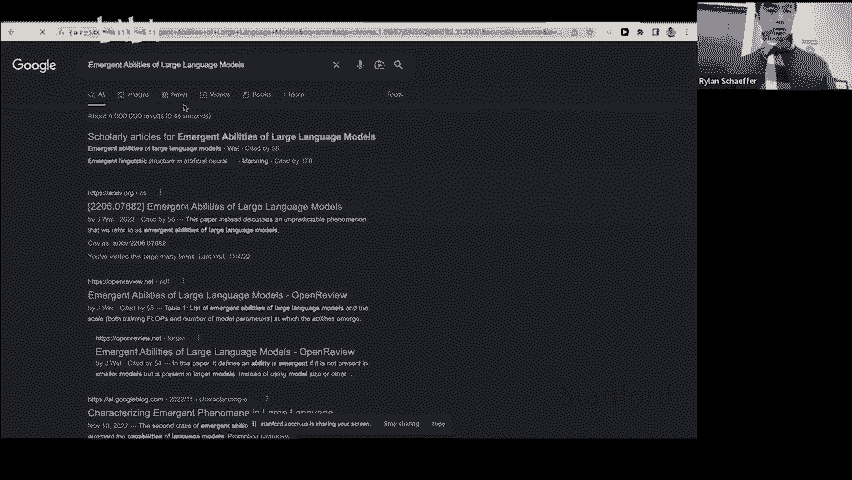
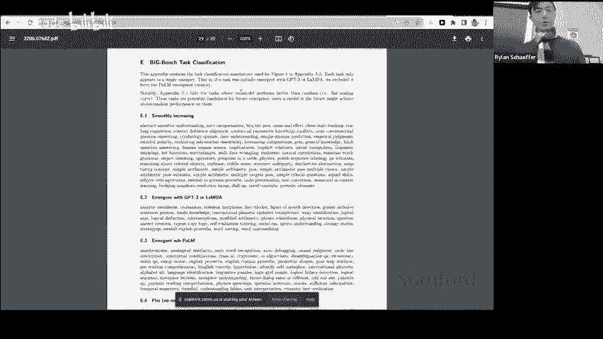
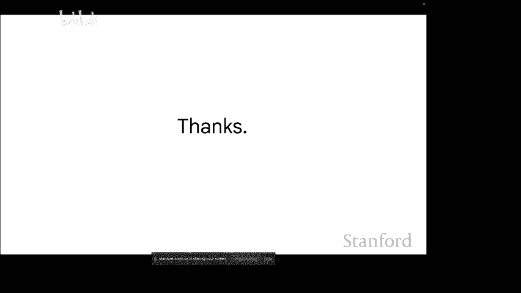

# 斯坦福 GPT／Transformer 原理介绍 (中英文双字幕) - P13：13.Emergent Abilities and Scaling in LLMs - life_code - BV1X84y1Q7wV

Okay， great so the first sort of paper I'm going to be talking about is called emergent abilities of large language models and this paper was especially cool。

 I think because we got people from Google in a Deep Mind and also at Stanford you might recognize Percy or Tatsu or Riishhi。

 I mean we got people to sort of agree on what's a nice framework of looking at why we want to scale and emergent abilities。

So。One of the things that we've seen throughout language models is that you sort of get these predictable gains as a result of scaling。

 so here's the canonical you know Kaplan et all paper where you can see that if you scale up the size of the language model measured either in compute in data set size or in parameters。

You see that the loss on the test set actually goes down predictably I don't know if you're screen sharing so people on zoom I don't think can see the slides Okay all these okay。

O。I guess I'll say this for the third time， as we've seen in language models。

If you scale up the size of the language model measured either in compute。

 in data set size or a number of parameters， you can see that there's a sort of this predictable improvement in the test loss。

嗯。Now， what I'm going to be talking about in terms of emergence is something that's actually unpredictable。

If you only look at smaller language models， so one way that emergence has been described in the broader science literature is it's basically seen as a qualitative change that arises from quantitative changes and it sort of started with this article in science by a Nobel Prize winning physicist called More is different。

And I really like this post from Jacob Steinart that sort of describes emergence and he gives a couple of good examples here。

For example， he says with uranium， with a bit of uranium， nothing special happens。

 with a large amount of ur impact densely enough， you get a nuclear reaction。And then also with DNA。

 for example， given only small molecules such as calcium。

 you can't meaningfully encode useful information， but given larger models such as DNA。

 you can encode a genome。So for this particular work。

 we use this definition of emergent abilities of large language models in particular。

 so we say that ability is emergent if it is not present in smaller models。

 but it is present in larger models。And the sort of natural question here is like how do you measure the size or the scale of the language model and there's sort of traditionally three axes of scale so the training flops are the amount of compute that you use to train the language model。

The number of model parameters are like the size of the language model and also the size of the training data set that the model is trained on。

And a lot of the plots here will use either training flops or the number of model parameters。

 the reason is that the training dataset size is usually fixed for different size models and because training flops is just the data set size times model parameters。

 you can get a similar plot from either training flops or number of model parameters for most language models。

Great， and so the first type of emergence， yes， I go。きくだ。Yeah， for me。

 it seems nice like it'd be relatively easier to measure the size versus it's like what quaifies。

You find okay。就是。哪里。Yeah， sure。So yeah， for example。

' I'll just give an example here which is actually the next slide。

 so basically we have this way of interacting with language models called fu shot prompting and the way it works is like you know the language model is a really good next word predictor。

And when you give the model an example， and then you ask it for an unseen like movie review for example。

 and then you say what's the output and then here the language model can say positive because it understands to use the context from the review to give the next token。

And the definition of let that we use for like having ability or not is that basically a few shot prompted like tasks。

 for example， sentiment analysis， is emergent if it has random accuracy for small models。

 but above random accuracy for large models。Does that make sense。

 so basically if the model isn't doing any better than random。

 then we say it doesn't have the ability to do this particular task。个。

And I'll give a few examples here。嗯。So here's sort of the canonical way that we look at plots for emergence。

 so basically what we have each of these different plots is a different task and I'll go over some examples soon。

But the way you read the plot is the X axis is a number of training flops or the model scale。

 and then the Y axis is like the accuracy or like how good the model is doing the task。

And then know we have different language models from Open AI from Google and from Deep Mind。

 and then each of the points is like a different language model it's not a language model over the course of training like each point is a different language model。

And what you see is that for the very small language models。

 you basically get performance that's close to random or not being any better than random。

And then once you pass a certain threshold。You can see that the performance suddenly gets like a lot above substantially above random and this is what we call emergence so basically if you were to extrapolate like the lines from the small language models。

 you might predict that it would never know do better than random because it's just a flat line。

 but the interesting phenomenonize that when you scale up past a certain threshold。

 you actually do see this emergent phenomena where the model does a lot better than random。

So let me go over some concrete examples。So here's one task。

 it's basically a benchmark called multitask NLU or MLLU， and basically what it is。

 it's a bunch of test questions ranging from high school all the way to like professional level exams。

And how it works is the language model sort of given， for example。

 here is a high school math example， and the language model is given like a few examples and then for an unseen question it has to give the answer。

And then you can see in the plot on the right， so for the model scale。

 if you go up to sort of 10 to the power of 22 training flops。

 you don't actually get any better than random accuracy on this task。

 but if you scale up to 10 to the 24 training flops。

 then you see that all the like three models there do much better than random accuracy。Yeah。

 perfect the scale of the data used to train this， is it roughly similar or because these are like different models trained by different words？

Yeah， the scale is， I think within an order of magnitude for these models here yeah。Yeah。

 and like every single do。Individual tracks is the same data yes the data the data is fixed except for Chnchiilla。

 Chinchiilla uses more data for larger models， but I believe for all the other models here。

 the amount data is the same。Yeah， here's just another example to sort of。

Show it more concretely so this is a task from the big benchmark benchmark just as an aside the big benchmark benchmark is like 200 benchmarks and basically it's like a crowdsource set of benchmarks I'd recommend looking at if you're doing that lot of work。

And basically， the task is the language model has to take an English sentence。

And then give the international phonetic alphabet transliteration or the IPA transliteration。

 which is basically like how to pronounce it。And for this task。

 the evaluation metric is actually blue or like an Ngram overlap metric。

And you get a similar phenomenon where as you increase the size of the language model。

 it's flat for a while and then suddenly the improvement is above random。嗯。对。

So I'll talk about another interesting result I hear that that's why it's emerging。

 so this was a technical report that we put out a couple of months ago and basically there's this really interesting prize in or it's like a one time prize in。

In language models where Anthropics， which is like a startup。

 basically had this prize where if people could come up with a task where the performance on the task would actually decrease as you increase the size of the language model。

 then you would get like a bunch of money。So basically there are a lot of submissions to this and here's one example of like a task where they found that the performance would actually decrease if you increase the size of the language model。

 so the task is attribute here it's like repeat my sentences back to me and then the input is like all that glists is not glue and then the output is the model has to completely has to accurately say a glueib。

嗯。And so what happened is for the small language model。

 it doesn't know the phrase all that gllisters is not gold。

 so it just like copies the input and actually gets like 100% on that。

But then for the medium size language model， what you would see is that the forms to actually decrease because the medium size language model knows the phrase all that gllylists is not gold and then it says gold。

 which actually is not what the task asks it to do Yeah someone ask can you give a physical estimate 10 to the 24 plots possibly in terms of training time or number of。

Yeah， so I think。10 to the 24 flops is around， so at Google we use TUs and one pod of TUs。

 I believe is equal to like 4000 A100s。And 10 to the 24 flops is like two pods for around six weeks or something like that。

So it's a lot of compute to do the pre training。诶。I don't know。

 but do you guys remember in like chemistry class when you'd have like moles？

And it would be like 10 to the 23 and then you're like teacher would be like， oh。

 don't even think about like how big this number is。

That's like the number of like floating point operations that goes into the pretrannous in these models。

Okay， great anyways， so yeah so basically the medium size language model will actually do worse Oh yeah did you have another question great。

😊，This the prizeThis one is one of the the winner I think it's like a third place winner or something。

す great question。But the task， because like， I would like my initial opinion would be like， oh。

 you can just like put a negative slide on how you evaluate。

What do you mean it's flip a negative side all of this depends on which evaluation？Yeah。

 to measure if you do your task break， so like it's like the the the measurement is very sparse like you only get credit if you do it。

Yeah， yeah， like a lot of things emerge because like you just won't hit it perfectly。

Really optimized for a long time。 Or like if you take a test and then like evaluate it with like a minus sign like。

 wouldn't it。It was。Like something that's。Yeah， I mean， they they so for this thing。

 they like account it for all like， you can't just say like the task should be to do badly on something。

 it has to be like a meaningful sort of task。And then I guess your point about like the how credit time or the valuation metric works is actually a really good one yeah so I guess it still kind of counts if like you know I guess the argument is sort of that that。

The performance might not look emergent if you assign partial credit。

 but we have like a bunch of I can show example later， but even if you use partial credit metrics。

 you'll often still see the same type of emergence so it's not purely a phenomenon of like not assigning partial credit based on the valuation metric。

诶。过。And then great， so what what we sort of sort of argued in this paper is that yeah。

 there might be some tasks where the performance starts to decrease if you use a medium sized language model。

 but if you keep scaling all the way to you the largest model that we have at Google that's known publicly。

Palm， you'll see that the language model I can actually go back and do the task correctly because the large language model also knows the phrase all that gllisted is not gold。

 but it also understands repeat my senses back to me so it's able to get 100% on this task so this is a different type of emergence also。

And another class of emergence that we sort of talk about in the paper is like an emergent prompting technique。

So basically， you know， other than futuretop prompting。

 there's like other ways of like interacting with the language models that。

Can be considered emergent yeah。The question is， did all modelss undergo construction fine tu？

None of these models under one instruction fine tuning for this plot。Great， yeah， so yeah。

 so one way of interacting with language models is by basically finding the model using a technique called RHF。

 and basically the way it works is you have this data and humans rate like preferences for what type of outputs they prefer。

And then the model strand on RL to sort of optimize for human preferences。

And what this plot is showing here is that if you do this RHF on the model。

The model performance on a different zero shot task actually gets worse for small models。

 you can see the blue line is above the orange line， blue line is the baseline line。

 the orange line is RHS。And then if you do it for large models， though。

 then you can see that the performance actually has a positive delta from doing RLHI。诶。

And so this is sort of interesting thing where like a certain technique might only help if you try on a large enough language model。

 so if you only try it on the small language models。

 it' would be tough to draw the conclusion that it wouldn't help performance。And then later。

 I'll talk about chain of without prompting as another emergent prompt。

So here's sort of the hand wavy diagram that I sort of used to think about emergence as a framework so on the X axis here there's like a scale of the language model and on the Y axis is a sort of imaginary like you know。

A scale of like a range of things that a language model can do。

And then basically you can pick like some random point like say 100 billion parameters in the language model and there will be certain abilities and okay。

 so first you can see as you increase the size of the language model。

 the number of like tasks or things the language model can do increases and then you can see there are some tasks where like models above 100 billion parameters for example can do them。

 but models below 100 billion parameters can't do them and we call these emergent abilities。Sorry。

 question Where the colors。Oh， it's just highlighting like the dark blue is like。

Tasks that a smaller language model wouldn't be able to do。 Does that make sense。 Yeah。

 and then to the right， the dotted line， the right region up top。Oh。

 that just means like tasks that we haven't been able to solve yet with models yet。个。

And I'm curious to know， do you think that it's not that those tasks in the white region are unsolvable at like $100 billion scale？

Or do you think that better models。Specific training data would allow us to the 100 billion scale to get into that。

Yeah， I definitely think that it's not a fixed， I'll give an example shortly but it's not it's not。

You know it's not a rule that you have to have 100 blend parameters to do a certain task。

 it's just that that happens to be the threshold that we've observed in models so far and I do think with better training data and architecture and algorithms we can probably beat that。

过嗯。Yeah， so as Rland just mentioned， one example of Getty emergence can be with better data。

 so it's not all about scale I'll sort of give some nuance here。

 so for this task is just one of the tasks in the Big Ben benchmark。

 you can see that for like Lambda which is a Google model and GPT3。

 you actually don't get emergence from scaling to 137 or  137 or 175 billion parameters。

But when you come in with a different language model palm。

 which is trained on better data than Lambda and GT3。

 you actually can get this emerge ability even with the smaller language model shown here at 62 billion parameters。

See inventory better model as better data， or also better。Ttro masking， you know。

 choices or most interesting。Yeah， so the challenging thing is that's a great question。

There's like a lot of differences between Palm and Lambda， for example。

 and we can't really abllate them in any controlled way because of the cost of pretraining。

 but our like sort of running hypothesis is that P is trained on better data and that accounts for a lot of the difference between Palm and Lambda like the smaller it is possible to stuff Yeah。

这个。Yeah， that's a good question， so I guess even here you can look at like for example。

 the Palm 8 billion model。Like that。That point there。

 you can abllate it and it's like a little bit higher。

 but it's not really an emergent yet at that point。

 so it's it's hard to tell for you know for example， this particular task what the effect is。Yeah。

 there's a question on Zoom， are there two different versions of Paul， if not。

 why are there two lines more？Oh so I think the two lines here。

 one is like maybe three shot and then one is like zero shot something like that。

 so it just refers to the way that we're using the language model either with the without exemplars。

嗯。Great。I'll talk about a yeah， small ablation here that sort of shows this。

 so this is an ablation on sort of a toy task where basically the language model has to know that like in English。

 you have to use plural verbs with plural subjects and singular verbs with singular subjects。

And the way that what we're doing here is basically we train like these small BRT models from scratch and then we held out like we fixed the frequency of certain verbs in the training data set。

 which basically says like， okay， what's the effect of seeing a certain verb in the data more often？

In this plot the x axis is like the frequency of the verb and the y axis is the error rate and what you basically see is that if you have more in domain data so if the model sees the verb more times it does the task a lot better and this is sort of an example of like having high quality data or data that's more in domain for the task that you're evaluating on can make a big difference。

 even if you're fixing the compute the size of the model and the rest of the data。

Yeah question on Zoom。 Someone asks， could there be a way to dispillel emerget abilities down to smaller models for larger teacher。

Yeah， I think so so。Larger teacher models can basically you can use them for example。

 to generate data and then if you finet larger the smaller model on data。

 it's pretty likely that you'll be able to get the ability to emerge in the smaller model I'll talk about example of this too let me see。

Oh， actually， next slide。Desired behaviors can be induced in smaller models once you sort of know what behavior you want。

 so for example， here's the instructorstruct here's a figure from thestructGPT paper。And basically。

 the desired behavior here is like instruction following。

And you can see that there's multiple models， so on the left you have these small models that are trained with RLHF and they actually have better performance than larger models train on weaker techniques so basically the point is like if you know that you want a certain behavior that sort of you saw previously emerge in an emergent way in a larger model you can find a way to fine tune on that behavior specifically and induce that behavior in a smaller model。

I guess one of the limitations is that like unless you know like all the behaviors that you want。

 you can't really get this natural emerge behavior。Yeah。

 another sort of discussion point here is that like。

There's this question of like what's the right X axis for emergence so like right now we mostly talk about like model parameters and training flops but like I guess you could like if you ask Deepmind people like how they look at it。

 you'll sort of get this argument that model parameters and training flops are really just a proxy for like how good the model is and how good the model is can really be measured by like perplexity or like how well it's doing some on some dev sets such as WikiTex 103。

So basically， you can also measure。Emergnce in terms of perplexity so here is WikiTex perplexity and then you can see like on a downstream task that as the perplexity gets better。

 there's sort of this threshold where you're able to do a lot better on a downstream task。

And there's sort of the strong correlation right at least right now between perplexity and training compute so you can see like these two lines are are pretty similar and。

Basically， I think in the future， if we have much better models that are a lot smaller trying on much better data and better algorithms。

 then maybe WikiText complexity can show a different type of plot than using other metrics。

So wki textex is basically a， I think it's like a subset of Wikipedia。

And then perplexity is like a measure of how well you can predict the next word in a data set。

So basically， if you're really good at modeling the next word on this like particular evaluation set。

 that's sort of a measure of like how well you understand language。Make sense。

But wouldn' it just harass。Oh， this is like a held out test set。对。好。嗯。

And then a final thing that I think is like pretty exciting about emergence。

Is that there's sort of not just like technical emergence that we've talked about。

 but there's sort of sociological changes in how the AI community views like scaling and how to use language models。

So here's some examples of。Where scaling up the size of the language model enables you to in the sort of few shots scenario。

 beat a task specific fine tune language model that's usually fine tune on say thousands of examples。

So basically the green line is the prior state of the art achieved by fine tuning and if you just and then the blue dots basically show if you take a pre-trained language model and you do fu shot prompting。

 which means the language model isn't intentionally trained to do the task。

 you can often get stay of the art results just by continuing to scale up the size of the language model。

And obviously there's limitations here you don't want to just keep scaling up in order to get save of the art。

 but I think it's a pretty big change in people's minds that you could actually get some of the best results just by scaling up the size and language model and doing prompt。

Question from Zoom。 someone ask， is that not a contradiction graph from two to three slides ago。

What is that。Which one， this one？I'm sure shouldn't be in general assume he said yes。ok。We said。

 should we in general assume that scale tru's lie to。

Yeah so that's a great question so this plot is saying that you fine tune and you can do and okay yeah so it depends on your like particular。

Task， but what this plot is saying is that。Like。We're not like fine tuned smaller models can do well on some tasks if you target it well。

 but for like tests that are more complicated， often you can do better just by scaling so there's sort of。

Tasks that fall into both of these categories， and I wouldn't say that。It's contradictory。

 I guess some tasks。You would do a lot better just by scaling the sizeizing the model and then other tasks。

 if it's like a very narrow domain or the large language model might not be trained on that kind of data。

 then you would do better by fine。O，对。So here's sort of a little summary slide。

 so basically emergent abilities can only be observed in large models and if you try to predict their emergence just by looking at the plots for small models then you wouldn't be able to do it。

And I sort of had a little reflection on how to look at this。

 so emergence is really this framing of like how to view new abilities that are not intentionally built in to the pretraining and I think the subtext for this is super important。

 which is like you can see it as implicit argument for why we should keep scaling up language models because you get these abilities that are really hard to find otherwise。

And the context around this is pretty important because it's really expensive to continue scaling up these models and you even like one year ago。

 a lot of people didn't believe that you could do better on certain tasks just by scaling up the size of the language model。

They sort of if you work in industry at all， there's like this interesting tension between emergence and also like many production tasks。

 so emergence is sort of this like task general phenomena where you scale up the model and it's like really expensive but the single model can do a lot of tasks is sort of like a in the direction of AGI。

And then for many production tasks， you have sort of the opposite where you know what task it is。

 for example， translating into Spanish， and then you have these constraints on compute because you know when we will translate。

 for example， you don't want people to have to wait a couple seconds just to get the translation。

And then you also happen to have a lot of in domain data， so you have， for example。

 like you know a million pairs of English Spanish sentences to train on。

And this is like sort of the opposite setting where you don't really care about the model's emergence。

 you can just train a very small model on the data and do one of the task without having to use a lot of compute。

And the final point is that I think a really promising research direction if anyone is interested in doing research is to like work on predicting future emergent abilities and I haven't seen a lot of work on it recently just because I think maybe it's too hard for example。

 like you could only like predict emergence for a specific task or like one way of predict emergence might not be super general and so I haven't seen much work on that but I think this is a pretty promising direction to work on and maybe Anthropic is working on it。

 I don't know。Okay， great， any questions on that before I move on to chain of promptmpton？Yeah佢。😊。

你先是。系我有呢条都俾见。Which parametersmateurs are best scale to get like properties。

 is obviously there are many different options for where。什么意外的。Didt G， for example。

I want to be back there。Is that mostly something we just test。

 And we find out which ones scale battery gives result or like。Yeah。

I would say that we don't have very principled methods for like how to scale these architectures。诶。😊。

I'm not an expert in this， but some of it has to deal with like how many parameters you can fit onto a particular TPU。

 but in general I think you scale up like the number of intentions heads and embeddings like somewhat proportionately but yeah I think this is like an open research question because you you can't really do ablations over these pretraining。

 you can't really do ablations over pretraining， it's hard to sort of you know have any principled way of doing it other than some engineers who are in charge of like doing it saying okay。

 I think this is the right thing to do and then it kind of works when we go with it。Yeah。

Do you have any indication of the asymptootic behavior of this gambling。

 if you would expect that eventually you would you know reach either some plateau of flip finite but non zero loss。

 or it would just go all the way down to zero。Yeah， that's a great question。I think。

 I mean there's you mean on like perplexity or like on a particular task or just in general on like an next word prediction Well seems like these are also pretty general pretty task independent right？

It's like emergent scaling。 Yeah， but you know， if you take the limit of the infinite parameters。

 then even analytically， is there any sense of whether that how to。Yeah。

 I have no clue I think if if like for most of these tasks there's like a limit to accuracy like 100% for example。

 so there's some there's some sort of asympote there。

 but I guess the deeper question that you might be asking is like can a language model like perfectly no like。

You know how to predict the next word for any given input。And maybe like， I mean。

 I guess there's some like， limit to like。Like if I say a sentence。

 there are like two possible next words or something。

 and you might not be able to guess that perfectly。So I think there's some limit。

 but like I think we're far from reaching that limit and there's still a lot of unsolved tasks that sort of indicate that there's a lot of headroom。

Yeah， if researchers are interested in studying emergence。

 what family of different sized models is publicly available or best for studying？Yeah。

 good question。So I think the open AI API has like a lot of language models and we actually use that a lot even at Google it's used to study emergence and that's sort of one way of doing it and actually a lot of these models are currently free they're rate limited but they're free so that so we also use that。

I think there's also。Smaller language models like for example。

 there's like a UL2 model that's like 20 billion parameters。

 but I guess you're right there is sort of this challenge where like small language models you won't see a lot of these emergent behaviors so you kind of have to either train。

Yeah， you should kind of have to either use like open AI API for now or wait until people train larger models。

 I guess there's also the bloom and like you guys probably know better than the OPT models that are publicly available but I haven't seen a lot of experiments on them yeah yeah。

嗯。So like my question is， are there， are there emerge abilities that are accessible and lower parameter。

I can part to speech。P to recognition。should maybe there might be some better maybe not like chain of thought。

 but I heard or some that。 Yeah， definitely， I think in the paper。

 we had like the list of couple dozen abilities that would be emerging at like 8 billion parameters or like 60 billion parameters or something like that。

 yeah。Yeah。Yeah， we have two questions from zoom。 The first question is， do you see strategy。

Between the larger tech。Differing systematically in studying these models。

 or basically everyone taking the same approach。诶。I wouldn't say that everyone is taking the same approach。

I think。As one example， Anthropic takes like a very safety centric approach and they're super interested in like emergent abilities because there could be emergent abilities that are undesirable and they want to predict those types of things。

I also don't know what happens at other companies other than at Google。

 so I can't really speak too much to that。有。questions。

What are some examples of tasks or abilities that have not yet emerged。

 even in models like Lada and Cha GT etc？Oh yeah， I have maybe I'll show this real quick。

诶。

There's like a nice list， somewhere。So。So yeah， so basically what we did is。

There's like 200 tasks in Big benchn。 And then we basically classified them and so like。

Smoothly increasing emergent with GP3 or lambda， emergent with palm and then flat。

 which is like no model better than random So I think if you look at any of these tasks here。

They should still not have emerged yet， and if you can get them to merge， that'd be interesting。仔。

I think chat should be T 20 question。Oh okay， yeah。

 this is not a super I think this is like a couple months old。Yeah， yeah。Oh， 20 questions， Okay。

 yeah。Some意。Yeah， I think。Like the cool thing is like you can see over time right like originally like maybe only like these were you know emergent and then when Po came out you'd see a couple dozen moreab abilitiesities became emergent and then you know I suspect you know in a year or two most of these will become emergent and we need harder benchmarks Yeah there's another question on why doesn't Google take as much of a safety center。

Like we said in dropping。Are there reasons to believe powerful capabilities wouldn't be emerging？

Yeah， I don't want to answer the question on behalf of Google。

 I just can only talk about my own opinions。But I think the reality is that Google。

 even if you look at like the amount of research that Google does it might not be in the large language models space specifically。

 but like the amount of safety research that we do I think is more than enthropic if you actually look at like the number of papers published。

 don't quote me on this， but I think that's correct。Okay。诶 great。So。Yeah。

 I'll talk about chain of thought prompting so basically chain of thought prompting is this way of doing reasoning multistep reasoning with large language models and。

Yeah， I wanted to say that it's super exciting to see like a lot of people at Google working on this and also to see Sdar CEO present this at our last year's Google IoC event。

嗯。And basically， the motivation for this is that we want language models to do like more complicated tasks that。

 you know， for example， we know language models can do easy tasks like sentiment analysis or translation。

 but what about like more complicated tasks that might even take a human emit minute or more to do？

And the goal here is to basically guide them with metadata so for example。

 instead of just giving like an input output of pair。

 we want to give them the entire reasoning process and have them mimic that。

And basically you can see here， you know， in a standard prompt you have like the question and then the answer and then you have a question the model gives a new answer。

 unfortunately it's wrong。And then with chain of thought prompting。

 you give the model a question and then kind of like how your teacher would ask you to show your work。

 you give like the chain of thought is what we call it or basically a reasoning path and then you give the final answer and then when the model sees this unseen question。

 now it's able to give the reasoning path and then give the correct final answer。

And the way that we add these prompts into the prompt is basically we just manually write a couple and then add it into the prompt。

So let me just show how that works。So this was the Open Air API。And basically。

Here's like the non chainF thought way of doing it， so basically you would have。Question answer。

 question answer， question answer， and then new question about， you know， cafeteria asked3 apples。

 they use 20 to make lunch and about six more how many apples they have。And the model gets it wrong。

And the only difference with chain of thought is that you give these intermediate reasoning paths。

Before giving the final answer， so here's a path， there's a reasoning chain。

 there's another reasoning chain。And then now the model for this unseen question。

Gives the entire reasoning process， and then this actually enables them model to get it correct。

I'll give another quick example， this one。So here the task is just take the last letters of the words and Bill Gates so like L from Bill and Ss from Gates and then concatenate them and the answer should be LS。

And then here the model gets it wrong。 The answer should be N。Says SK。

And then if you do chainF thought， obviously this it becomes very easy for the model。

 so you know it says the last letter of bill is L， the last letter of gates is S answers LS。

And then here it's able to do the last letter of Elons M and the last letter of musk is K and answer is N K。

诶。So any is this clear any questions about what's going on here？Okay。嗯。

So basically we can have these similar plots where the X axis is the model scale。

 the y axis is the performance so on the left we have this mathboard question benchmark called GSMAK it's basically like questions that you'd see in like an elementary school math test。

And you can see the blue dot is standard and the purple star is chain of dot and basically you see that the chain of thought if you use a large enough model。

 does a lot better than standard prompting。And actually beats the fineine Tus Stay of the art at the time。

A similar example is on this benchmark called Str QA。

And what strategy here is it's basically like this world knowledge plus common sense reasoning benchmark。

 so the question would be like can you hide a basketball in a Sancat's ear and then the model would say you know a basketball is about this size。

 a Sancat's ear is that server would not fit and now this benchmark you can also see that we can beat the fine tune save the art from before just by using chain of thought with a large enough language。

So one way we use this is that we evaluated champf thought on a certain subset of Big benchch tasks。

 so we created a subset called Big benchch hard and basically it's like 23 challenging tasks from Big benchch where like no model had done better than the average human rateer。

So the way that you prompt the model is that you'd have like a task description question options。

 chain of dot， and then the test time question。And so I'll give a couple of examples of like tasks here。

So one example is navigate basically what the language model has to do in this task is it has to basically follow these so the question is like。

 if you follow these instructions do you return to the starting point， turn left， turn right。

 take five steps， take four steps， turn around， take nine steps。

And then the model following the fusile exemplars is able to like basically track state after all of the actions。

 and then at the end it says， okay， we at the final answer。

 so answer are we at the original location， mean if it is zero is0 then the answer is yes。诶。

Just give an example of another task， here's a task that's like very easy for humans basically word sorting。

 so like there's a list of words Burley， Bela， I'm not going to read them and basically the model has to sort them alphabe order。

And here the model can follow the future exemp， so you have this pretty complicated like chain of dot where the model has to like sort each of the subparts and then finally it gets to the final answer。

 which is correct。So here's sort of this result summary on this subset of Big Bennch。

 so you can see okay we have two metrics， one is just the average performance on all these tasks and the second is the percent of tasks that are above the average human rateer so average human rateer is 67 max human rateer is 94。

And then prior results， the model was doing like way worse， it was like 50。

 and this is sort of by construction of this subset。And then we use Code Vinci O2。

 which is like one of the open AI models and actually you can use this one for free with the open API。

And basically， if you do answer only prompting without chainF thought。

 then you sort of are being the average rater on like five of 27。

 but if you use chainF thought prompting， then the performance increases by this pretty decent amount and you're able to pass the human average human other majority of tasks。

And then below is just this visualization of the tasks that are doing worse than humans in red and then better than humans in blue。

2 questions。 Boy， isn't this similar to R HF S， at least。Hiss what similar？

I can change up on own for not。被拳到。嗯。Yeah， I think it's there。I wouldn't call it similar。

 so like chainF thought is basically you take a pre trade language model and you use a prompting technique that includes intermediate reason path。

The way that RLHF works is that you have this additional data that you want to fine tune the model on and you have a preference model that sort of predicts like how well does a certain output。

How likely is that to be preferred by humans and then RLHF what that does is it tune it fine tunes like the language model to do well on the preference models prediction。

 so basically it's sort of aligning the model with what humans would prefer。

Is there a second question？やいです。Okay Grace asks， can China be includedd in fine tuning rather than having a。

Yes， the short answer is yes。The sort of complicated thing about that is that you have to have like chain of thought intermediate steps and those are pretty。

 it can be costly to sort of to gather that data and to do the fine。One last question。

 sorry for everybody another student asks， do you think that chain of thought and prompt engineering in general is just an artifact that won't be necessary with larger scale models that are better able to understand the function。

Yeah so that's a great question basically the question is like how like ephemeral is like prompt engineering going to be I think we'll find out but some initial intuitions are that like for easy tasks that are like you know easy to describe and maybe there multiple choice larger models will probably be more robust to prompt engineering and there's sort of less you can do with that。

But I think as language models get more powerful。It'll sort of be more normal to use them on a lot more challenging tasks and in those tasks you'll have to specify exactly what you want the model to do。

 et ce， so I think there'll still be some room for prompt engineering there at least in near future。

Yeah， correct you know how this general for example， you a simple。

And then the other one is concerning sorting the words。Yeah， so mean see that。

Give the channel thought like words of that。Yeah that's a great question so for some tasks where you've seen similar data and pretraining。

 the model can do really well even if the chain of thought is from another task， so for example。

 like math word problems you actually don't really need a math chain of thought because mod already knows how I do that but like for a task like this。

You probably haven't seen any data that's like the chain of thought here。

 so without task specific exemplars you probably wouldn't do super well on tasks like this without manually writing them for other examples。

Yeah。as the researcher behind this， like what mental model would we do to like even try this like do you pursue the model as like if I was a person。

 how do I think it's better or is it like trying to give it more like？Compute in order to like。

Before deesttiy answered。Yeah， great question。I think my motivation was just thinking about it says you said like what's going on in sort of a human's mind while they try to solve this math question and well if you notice like at least some humans will think actually in natural language so like if you just like think about like if you pay attention a lot to like what's going on in your mind you' actually notice that you sometimes you think language and so while the language model can thinking language too so that was kind of the motivation behind asking language while to do that and。

I think one thing that sort of went well is that the development of like this technique actually coincided with like the development of palm and so。

Yeah， basically having the model palm sort of allowed us to do a lot better tasks or a lot more challenging tasks using chain of thought。

Yeah。我听蚊 the第一个。We're saying that it matters like the absolute number of examples of like this chain of thought process or whatever in the data set。

Or the function。s that the main significant thing or is it like this a relative number？

Fqu of like those examples are just like negative examples that are like not good examples of how to reason。

Do those matter as much as the absolute number of。啊，这第3。Yeah， good question。

So I guess the challenging thing is like we can't really measure how many similar examples are in the training set you know。

It's it's hard to do that well。 and I don't think anyone has done that before。

 So it's more of this open question of like why China F thought even works because you actually don't see。

Similar data like that in the training set。Yeah， I think it's a open question like why it works。

what is your model。Theition that mean said okay。Think about like how。things。

Thinking language and then knowledge do that too。 But like， how do you actually think like in like。

 what a situation for the model。I mean， is make a shift in。For a specific task。

 like some weights get like more。好送翻过嚟扣雨点啊。Yeah， I don't really think about it in terms of like what's going on in the weights。

 I guess the way that I think about it is that like。

It'd be unfair for me to like give you a math question and ask you to give me the answer within like half a second。

 which is basically like what you're doing with the model and when you don't do a chain of that right' basically asking this like challenging question and the model doesn't have enough compute to like solve it in one pass to give you the next answer immediately。

I think the second thing that。I sort of think about is that like the model has learned like a compositional set of skills during during pretraining so maybe it hasn't really learned like you know this particular navigate task during pre traininging but's learn other things right it's learn like okay if you take five steps and you're facing this maybe yeah you should add five here or something like that right and it's learned how to do pattern matching so。

Maybe in the future exemplars it can match sort of what the reasoning path is with like what the question was and sort of there's sort of these little skills that the model might know and then maybe if you can combine them together in some clever way then you can get the model to solve the more challenging problems。

Okay。ran how much time do we have？哦，原也审看的看。okay，50 okay。Okay。って。诶 okay， great。

A a good example of how we judge this cut。Anyway， a bunch of different answers， all them are right。

Yeah。Okay， great， yeah， feel free to keep asking questions if you have any。So。Yeah。

 here's another example of emergence so basically you can see there's three models here instructTBT codex and palm chain of thought in blue non chainF thought is is in gray and then you can see you actually have to have sufficient model scale to get chainF thought to work well and。

I guess the intuition here is that like if you have a really small model。

 the model sort of will keep repeating itself for not saying anything coherent or navigate a final answer。

 which is why using chain of Thought for the small models doesn't really work well and then for the large models obviously like for multistep problems。

 the model is going to be able to solve the task at a lot higher accuracy with chain of thought。

And another cool thing about chain of Though is there are sort of some tasks where you sort of wouldn't get emergent behavior at all。

 so emergence hasn't been unlocked yet， but you can see that the if you use chainF thought you can unlock this emergent performance in smaller models。

One example here is like multistep arithmetic where like I don't know if you'll ever。

 you know maybe I don't want to say ever， but like you can it's hard to imagine a model like getting this。

 you know here's the question and then the next token is correct that's pretty hard to solve in one step but with chain of thought you can get like you know 50% accuracy on this just by having the model output' these intermediate intermediate recent steps。

Oh yeah。This is something that like needs a rehatuition about what。ly。

 I know that like a transformer can definitely do addition。でまた。

Can like take in the numbers and like do the carries。 Defitely， Yeah， yeah， but like。哦。

Then there's this question of like， what happens empirically， right？ And like。

 I understand that like， it isn't necessarily a lot space to do public protect。 Yeah。

 So like my question is like， how。I really。Tell the difference。

 Like maybe there are there like ways to tell the difference between like things that haven't emerged because like。

 there's just like no space。Or like like like there's so many tasks that like it couldn have like allotted any any space to specifically do that one versus like like the task is so hard that like。

It just can't， even if you will。Yeah， yeah， that's a good question I think。

There seems to be like some subset of tasks where it's just like doesn't fit well with the way that we train language models。

 so for example like。In language models， we use tokens， right？ And so if you give it like。

The token  four actually doesn't take the number four。

 it takes like this embedding that's like you know 1000 dimensions or something or if you like give it a word and ask it to reverse like the letters。

 this is like a super easy test， but like the way we train the model doesn't actually look at the letters and stuff。

So I think there's a certain subset of tasks where like it doesn't really just fit well with the way that we train transformers and。

You can actually like I mean I think these if you really care about these tasks you can just solve them using like code or something like that。

 but yeah I think I don't think like this is really an inherent。

Something that would never emerge because it's too hard， yeah。Yeah。

 we have a question on zoom also by the way， sorry I forgot to mention somebody asking you repeat repeat the questions because they can't always Oh okay。

 that's why that that's why that so the question someone asked is。

 do you think chain of thought would be a viable interpretability technique for very advanced AI systems？

And they mentioned that there's some research by called externalized reasoning oversight by camera La。

Will it be a viable interpretability technique for advanced day on？Yeah。

 am I supposed to repeat this sorry oh so the question is。

Can chain of thought be a viable interpretability technique for AI。

 I think there's no guarantee that like。The chain of thought is how the model actually arrives at the final answer。

 but often you can use it to like sort of debug like why isn't the model getting this question correct or like what can we do better in the chain of thought to help the model get this correct？

I haven't read the anthropic paper that was mentioned， so I actually don't know the answer to that。

嗯 ok k 。Another interesting result that we had here was that you can actually do like multilingual chain of thought prompting and so basically what we had is like we translated this like you know benchmark of math word problems to 10 languages and then we prompt them the model to do it in like say Bengali and then the model has like basically do the math problem in Bengali and give the final answer。

I think the cool thing about this is that like this input is like highly improbable right so like Benngali is like 0。

01% of the pre trainingion data and you know math word problems are probably even smaller subset of that。

😊，And basically the interesting thing is the model can actually do like these types of questions pretty well to probably surprising degree。

 so like you know if you ask people before I showed them this result like oh how well can the model do you like these math questions in Swahli。

 like probably like 10%， but actually even like you know very underrepresented languages like Swahli or Bengali or Telegu and TI。

 the model can do to like surprisingly well despite the fact that they only occupy like a very small subset of the pretraining data。

对。this and most of my experience with this is G。 but like if you ask things in different languages。

 despite not being like explicitly trained these languages， right。

 it seems to have sort of like derived reasoning independent language， to that extent。

 Yeah you can do the reasoning actually kind of funny sometimes it always looks like it does the reasoning in English and then translates back to the other language answers it gives you sort of like if you like reason the English and then translate to the other thing。

 So you think that like learning the like structure of a language and learning reasoning abilities or like somewhat separate large language models or that like it inherently will like learn chain of thought reasoning within that language within the structure of the language like the way thought works in that language。

Yeah that's a great question I'm not sure how to measure that。

 but I've definitely thought about I think the language I mean。

 based on these results like you definitely you probably didn't have any math questions in Swwakili for the model to learn from and I think definitely there's something language agnostic going on where the model learns reasoning sort of independently of the language and then it can express it in different languages if it needs to Yeah。

 but I don't have a I don't think anyone I don't think we know the answer to that yet。诶。Yeah。

 so so basically like one question that comes up frequently is like why does scaling up improve chain of dot and one way of looking at this is like we can take a smaller model like P 62b and see like what types of errors are fixed from scaling up to 540 billion parameters and you can see that like for these three categories that we came up with some of all of them get fixed so scaling seems to have this like sort of universal effect on improving different types of errors from smaller models。

And then here's the same handwi who weav diagram and expressed in different ways so basically you have like some tasks that are doable with standard prompting so in blue and then the goal of chain of thought prompting is to sort of increase the set of tasks that we can do so for example。

 now the ones shown in pink include math word problem， symbolic reasoning and。

Challenging common sense reason。 Yeah， question， have you done anys to figure out how like much is。

 is any of this contribution just because of the fact that you do more computations when you put in longer prompts like you know。

 like you multiple tasks through the model you create multiple inbeddings to like， you know。

 just things and models looking at in a way， Yeah， how much would that like to be tried non shade of thought prompts with like saying open length。

Yeah， yeah。 we tried with like X X， X X X or something and doesn't really it doesn't work。

 So I think it's not just about the compute。 I think it's about。

The language guiding the model as part of the reasoning。I see。

 have you tried like describing the problem in more sales not being shown。 I know。

 this is like a super I'm just very curious about like， So it's like a very interesting。

Property and emergency is like to be。Yeah， you mean like describing the question in three different ways and seeing if that describing more instead of explicitly step by step and seeing that Yeah。

 I haven't tried that， but I would be surprised if that worked。estDid you try having it。

I'll put the answer and then explain its reasoning into that Yeah， that doesn't work as well。 Yeah。

 but it depends on the task also so like yeah yeah me。こいつ。That seems to be the case， yeah。Yeah。

 those reactions be like reasoning， it would be like just any all that's your calculation。

Sort of imagine if it was the answer。Like in a way， you know， like in a way。

 like an in a of chain of soil is like a very structured。It like。

 what if the same structures like we do some more randomly。Yeah， you could try。

 I would be surprised if it works I think like outputting tokens is pretty important for the model yeah。

Okay。诶。So we're doing on time。 Okay， great。 So the last part。

 I think is a pretty cool trick with chain of thought。 So basically。😊，嗯。

What people usually do is they'll just generate one chain of thought and then they'll take the final answer but there's' this nice trick called self consistency where you can use like temperature sampling with the model to generate like a bunch of different reasoning pads and final answers and then if you just take a majority of vote over the final answers。

 this ends up like improving performance by like a pretty big margin so。For example， here。

 you can see on GSMAK， which is like the MathW Pro data set， the improvement goes from like you know。

 the performance like 56 and then if you do self-con then it becomes 74。

 which's like a pretty big improvement。对。Yeah， here how many are the averaging number for self consistency Oh。

 I think 40。 So it increases the cost of the inference time compute， but。Yeah。

 improve performance by might not to answer this， I'm curious to know how many samples or how many chains does one need to draw to get a significant what is the trade off between number of chains averaged over？

I think it depends on the sorry， the question is how many chains do you need to get a performance gain I think。

The answer really depends on the data set， but usually you can get something good with like 16。

 I think。Yeah。Im sorry。 We have a question。 How does the temperature change the way the model work。

Oh okay， the question is how does the temperature change the where the model works。

 basically when you use temperature decoding， the language model can like stochasticically pick one of the outputs instead of always picking the highest probability next word。

 so basically you get these like more stochastic outputs that are still based on what the language model has learned。

 but it's just a little bit more random。Okay。And then like finally like yeah selfconsistency also seems to be emergeibility。

 I guess part of it is because chain of thought is emergingnt because you wouldn't get any better than random performance without doing chain of thought。

 but yeah， you kind of see this big delta from self-consency through larger models。嗯。🎼Great。

 so I'm gonna run out of time。 Let me just go to。I'll just talk about this a little bit so I think in addition to just purely scaling up the language model which is only available to like people in industry。

 I think there's like a couple interesting directions to to work on one is like better prompting and characterization of language modab abilitiesities I think right now we're sort of just at the edge of you know knowing what the best way to prompt language models is。

There's also like pretty good applied work， so like you can use language models I've heard to train therapists to help with creative writing to help with science。

 I think chatGT has really shown what language models can do in this regard。

I think benchmarks are also something that's pretty lacking because I think we solve benchmarks pretty quickly。

 for example Palm beat the average human on Big benchch you know within a year or something of big bench coming out and so I think we need more benchmarks and I think that's going to be an important contribution。

And then the final one is like， how can we like？Have computer fission methods to make language models better so that it's less expensive to use them and more for get to use them。

Great， so I'll end here and feel free to email me if you have any feedback and if you're interested in Google。

 yeah feel free to as。😊。

