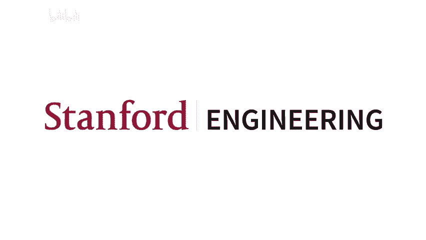
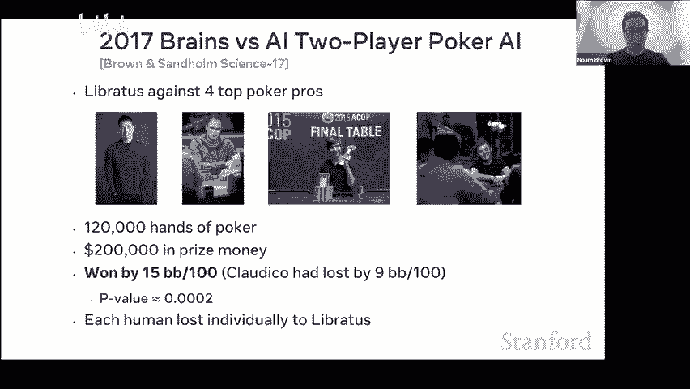
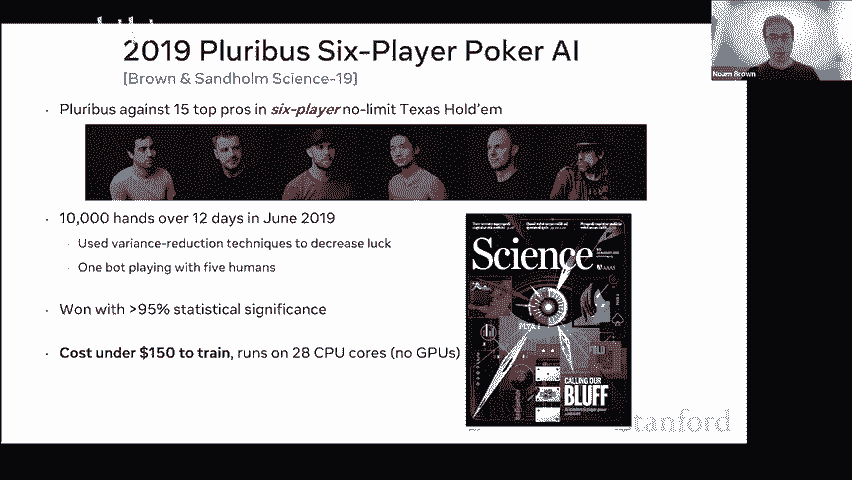
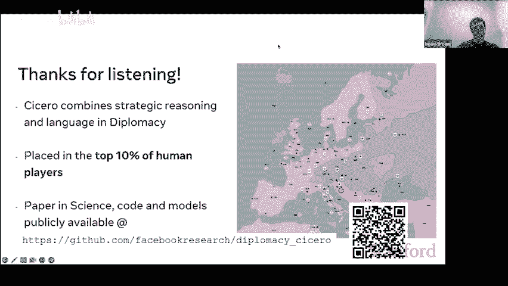

# 斯坦福 GPT／Transformer 原理介绍 (中英文双字幕) - P14：14.Strategic Games - life_code - BV1X84y1Q7wV

So it spend sometimes like two months training the bots。On thousands of CPUs。

Tabytes and memory sometimes， but when it came time to actually play against the humans。

 they would act almost instantly， it was just a lookup table。And the humans。

 when they were in a tough spot， they would not act instantly。

 they would think they would sit there and they would think for five seconds。

 maybe five minutes if it was a really difficult decision and it was clear that that was allowing them to come up with better strategies。

And so I wanted to investigate this behavior in our bots like if we could add this to our bots。

 how much of a difference would it make， the ability to instead of acting instantly to take some time and compute a better strategy for the spot that the agent was in。

And this is what I found。So on the X axis here we have like the number of buckets。

 the number you can think of this as like the number of parameters in your model and on the Y axis we have distance from national equilibrium so this is basically like how much you would lose towards worstk's adversary so the lower this number is the better your poker bot is and you can see as you scale the number of parameters。

 your performance improves and as you increase the number of parameters by about100 x you know your exploitability goes down by about half and indeed you're getting a much better poker bot。

But you can see the blue line here is if you don't have search and the orange line is if you do add search。

😡，And you can see just adding search， adding the ability to sit there and think for a bit。

 improve the performance of these models。And it reduced the exploitability。

 the distance from ra equilibrium by about 7 x。And if you were to extend that blue line and see how many prim would you need in order to be comparable to adding search。

 the answer is you would need to scale up your model by about 100，000 x。Okay。

So this was pretty mind blowlowing to me when I saw this， I mean， over the course of my PhD。

 the first three years， first three or four years of my PhD。

 I' managed to scale up these models by about 100 x。嗯。And I was proud of that， I mean。

 that's like a pretty pretty impressive result， I think。

But what this plot was showing me was that just adding search。

Was the equivalent of scaling things up by about 100，000 x。

 and so all of my previous research up until this point。

Would just be a footnote compared to adding search。So。When I saw this， it became clear。

 this was the answer to beating top humans in poker， and so for the next year， basically nonstop。

 I worked on scaling search。Now there's a question that naturally comes up which is why wasn't this considered before there's a few factors so first of all I should say like the search had been considered in poker before and it's actually quite natural to say like well you know if you had search and chess and search and go like why would you not consider search in poker。

There's a few reasons， one is that。Culturally like the poker research grew out of game theory and reinforcement learning and so it wasn't really from the same background as like the people are working on chess and working on go。

When you scale search scaling test time compute it makes all your experiments much more expensive and just like more unpleasant to work with and there are just like incentive structures I mean people are always thinking about winning the next annual computer poker competition and the ACPC limited the resources that you could use at test time so search wasn't really possible effectively in the ACPC。

And I think the biggest factor is that people just didn't think it would make such a huge difference I mean I think it's reasonable to look at something like search and think like oh yeah that might make like a 10 X difference you probably wouldnt think it makes a 10000 x difference and so there were some people working on it but it wasn't really the focus of a lot of people's research。

So anyway， focused on scaling search and that led to the 2017 Bras versus AIT competition where we again played our bot against four top poker pros。

 120，000 hands of poker $200，0000 prize money and this time the bot won by 15 big blinds per100 instead of nine big blinds per100。

This was a crushing victory， each human lost individually to the bot and。

Four standard deviations of statistical significance。

We followed this up in 2019 with six player poke AI competition。

The big difference here is that we figured out how to do depth limited search。

 so before the 2017 bot it would always have the search to the end of the game here it only had to do search a few moves ahead and it could stop there。

And so this time again， it wont with statistical significance。

 and what's really surprising about this spot is that despite it being a much larger game。

 the six player Pokerbot Plebuvis cost under $150 to train on cloud computing resources and it runs on 28 CPU cores at inference time。

 there's no GPUs。

So I think what this shows is that。This really wasn an algorithmic improvement。

 I mean this would have been doable 20 years ago if if people knew how to do it。

And I think it also shows the power of search， you know。

 if you can figure out how to scale that compute at test time。

 it really can make a huge difference and bring down your your training costs by a huge amount。诶。😊。

Okay， anyway， yeah， so I wanted to say also this is not limited to poker if you look at go you see a similar pattern。

 so this is a plot from the alphago zero paper。On the X axis。

 we have different versions of alphaphago and on the y axis， we have elo rating。

 which is a way of comparing different bots， but also a way of comparing bots to humans。

And you can see if。Okay， so superhuid performance is around 3，600 elo。And you can see Alpha Go Lee。

 the version that played against Li Addal in 2016， that's right over the line of superhuman performance。

Alphago is zero， the strongest version of alphaphago is around 5，200 elo。

But if you take out the test time search， if you just play according to the policy net and not do any modc research in alphago was zero at test time。

 then the eO rating drops to around 3，000， which is substantially below expert human performance。

So what this shows is that if you take out Montegli research at test time。😡。

The alphaphaGo zero is not superhuman and in fact nobody has made a superhuman gobot that does not use search in some form。

 nobody has made a raw neural network that can beat top humans in go。And I should say also。

 this is just if you're taking out the search at test time。

 I'm not even talking about taking it out of training time， if you took it out of training time。

 we wouldn't even got off the ground。Now there's a question of like okay well。

 surely you could just scale up the model， scale up the matter of training and you would eventually you know surpass the humanment performance and match the performance if you added search and that's true yes。

 if you scale up the models and if you scale up the training。

 then you would eventually match the performance with search。

 but there's a question of like how much would you have to scale it up by。Now。

 a rough rule of thumb is that in order to increase your eO rating by about 120 points。

 you either have to double the amount of model size and training or you have to double the amount of test time search。

And so if you look at that gap of around 2000 elow points and you calculate the number of deadlings that you would need。

 the answer is that in order to get the raw policy net from 3，000 e to 5200 elow。

 you would need to scale your model and your training by about 100，00x。Okay。

 so why is this important？😡，I think you look at what's happening today with large language models and transformers and and you see something similar。

 I mean， you're getting。Huge there's a question of like what do I mean by search there's a specific kinds of search like multiult research。

 the ability to just like plan ahead what you're going to do instead of just like acting instantly based on your precomputed policy。

 but really what I mean by search more broadly is the ability to scale the amount of computation to get better performance。

I think that's the real value that search is adding instead of just like acting according to your precomputd。

You know， front loading all of your computations so you're doing everything all your computation ahead of time and then like at inference time acting basically instantly。

Could you get a better solution if you had five minutes to output an action instead of 100 milliseconds？

Okay。So。Yeah， I think you look at。I'm sorry， there's a question。

 does a transformer with a search circuit count as search。

 or do you mean and engineering search algorithms？I don't want to get bogged down into like the details of like how to do this because like the answer is nobody really knows yet。

 nobody really has a general way of doing search and all the domains that we've done search successfully like poker and go it's done in a fairly domain specific way。

 you know go use this algorithm called multiola research。And yeah。

 you could think of beamS searcharch as like one simple form of search， but。

 it does seem like there should be better， better ways in the future。Yeah。So anyway。

 where I'm going with this is like you look at how large language models are being trained today and you know。

 you're seeing millions of dollars being thrown at pre training like。

I wouldn't be surprised if we see a large language model that would cost like $100 million to train。

We might even get to a billion dollars。But。The inference cost is still going to be very small。

And so there's a question of like， could you do substantially better if you could？

Scall the amount of inference cost as well。Maybe that could like amortize some of your training cost。

Yeah。Okay， so there's this。There's this lecture called the Bi lessons by Richard Sutton that says the biggest lesson that can be learned。

 and so it's a really great essay I recommend reading it。

 but one of the big takeaways is like he says the biggest lesson that can be learned from over 70 years of AI research is that general methods that leverage computation are ultimately the most effective。

The two methods that seem to scale arbitrarily in this way are search and learning。Now。

 I think we've done a great job with generalizing search， sorry， generalizing learning。

 and I think there's still room for improvement when it comes to search。U and yeah。

 the next goal really is about generality， like can we develop a truly general way of scaling inference compute instead of just doing things like Montecalo research that are specific to a better domain to a specific domain。

And also better than things like chain of thought。嗯。

What this would look like is that you have much higher test time compute。

But you have much more capable models。And I think for certain domains that trade off is worth it。

 like if you think about what inference cost we're willing to pay for proof of the Raymond hypothesis。

 I think we'd be willing to pay a lot。Or you know， the cost of。

What cost were we want to pay for new life saving drugs， I think we'd be willing to pay a lot。

So I think that there is an opportunity here。Okay， anyway， so that's why I prelude。

 I guess any questions about that before I move on to Cicero？By the way。

 the reason why I'm talking about this is because it's going to inform。😡。

The approach that we took to Cicero， which I think is quite different from the approach that a lot of other the researchers might have taken to this problem。

Someone asked can you give an example of search well multicarural research is one form of search。

 you could also think of like breadth for search depth for search these kinds of things they're all search I would also argue that like chain of thought is doing something similar to search where it it's allowing the model to like leverage extra compute at test time to get better performances。

But I think that that's the main thing that you want。

 the ability to like leverage extra compute at a test time。

What's the search what's the space that you are searching over again like in in a game like go it's like different board positions。

 but you could also imagine searching over like you know different sentences that you could say things like that。

There's a lot of flexibility there as well。Okay， so now I want to get into Cicero so first thing I should say when it comes to Cicero。

 this is。A big team effort。This was like this is actually one of the great things about working on this project that there was just such a diverse talent pool。

 experts in reinforcement learning， planning， game theory， natural language processing。

 all working together on this and it would not have been possible without without everybody。

So the motivation for diplomacy actually came from 2019。

 we were looking at all the breakthroughs that were happening at the time and I think a good example of this is this XKCD comic that came out in 2012 that shows like different categories games。

 games that are solved， games where computers can beat documents。

 games where computers still lose documents and games where computers may never outplay documents。

And in this category， computer still lose to top humans you had four games， go Arima。

 poker and Starcraftft。In 2015。😊，Actually， one of my colleagues。

 David Wu made the first day out to beat Top humans in arema。

 in 2016 we have Algo beating Lisa do and Go。In 2017。

 you have the work that I just described where we beattop humans in poker。And in 2019。

 we had Alpha star beating X humans in Starcraftft。

So that shows the incredible amount of progress that had happened in strategic reasoning over the past several years。

 leading up to 2019。And at the same time， we also had GP2 come out in 2019。

 and it showed that language model like。And natural language processing was progressing much faster than I think a lot of people。

 including us expected。And so we were thinking about what after the sixth player poker work I was discussing with my colleagues。

 what should we work on next？And we were throwing around like different domains to work on。

Given the incredible amount of progress in AI， we wanted to pick something really ambitious。

 something that we thought。You couldn't just tackle by scaling up the existing approaches that you really needed something new in order to address。

And we landed on diplomacy because we thought that it would be the hardest game to make an AI for。

So what is diplomacy？Diploomacy is a natural language strategy game。

 it takes place right before World War I you play as one of the seven great powers of Europe。

 England， France， Germany， Austria， Russia and Turkey。

 and your goal is to control a majority of the map in practice that rarely happens like if you control a majority of a majority of the map and you've won in practice nobody ends up winning outright and so your score。

Is proportional to the percentage of the map that you control？

Now what's really interesting about diplomacy is that it is a natural language negotiation game。

 so you have these conversations like what you're seeing here between Germany and England where they will probably communicate with each other before making their moves and so you can have Germany ask like want to support Sweden。

 England says let me think on that and so on。So this is a popular strategy game developed in the 1950s。

 it was JFK and Kisser's favorite game actually。And like I said。

 each chart involves sophisticated private natural language negotiations。

 and I want to make clear like this is not。Negotiations like you would see in a game like Sotos and Katan。

 for example， you're seeing。It's much more like survivor， if you've ever seen a TV show survivor。

 you have discussions around like alliances that you'd like to build discussions around like specific tactics that you'd like to execute on the current current and also you know like more long- term strategy around like where do we go from here and how do we divide resources。

Now the way the game works， you have these negotiations that last between five and 15 minutes depending on the version of the game。

 and then on each term and all these negotiations are done privately in parawise negotiation。

 also I think that you are not muted， okay thank you。And then after the negotiation period completes。

 everybody will simultaneously write down their moves。😡。

And so a player could promise you something like I'm going to support you into this territory this term。

 but then when people actually write down their moves。

 they might not write that down and so you only find out if they were true to their word when all the moves are revealed simultaneously。

And so for this reason， alliances and trust building is key。

 the ability to trust that somebody's going to follow through on their promises。

 that's really what this game is all about and the ability to convince people that you are going to follow through on your promises is really what this game is all about。

And so for this reason。Diploacy has long been considered a challenge problem for AI。

 There research in the game going back to the 80s， the research really only picked up。

It picked up like quite intensely in starting in 2019 when researchers from DeepMd， ourselves， MiA。

 other places started working on this。Now a lot of that research。

 the vast majority of that research actually was focused on the non languageguage version of the game。

 which was seen as a stepping stone into the full natural language version。

 though we decided to focus from the start on the full natural language version of the game。

So to give you a sense of like what these negotiations and dialogue look like。

 here is one example so here。England， you can see they move their fleet in Norway to St。

 Petersburg and that occupies the Russian territory。

And so this is what the board state looks like after that move and now there's this conversation between Austria and Russia。

 Austria says， well what happened up north Russia says England stabbed I'm afraid the end may be close from you my friend Austria says yeah that's rough are you going to be okay up there Russia says I hope so England seems to still want to work together Austria says can you make a deal with Germany so the players are now discussing like what should be discussed with other players Russia says good idea then Austria says if we find as long as you can defend Sevetopol so Sevesttopol is this territory down to the south you can see that Turkey has a fleet and an army in the Black Sea in Armen next to Sevestoppo and so they could potentially attack that territory next turn。

嗯。😊，Austria says can you support hold Sevetooles Ukraine and Romania I'll support hold Romania。

 Russia says yep， they'm already doing so， Austria says awesome。

 hopefully we can start getting you back on your feet。

So this is an example of the kinds of conversations that you'll see in a game of diplomacy in this conversation。

 Austria is actually our bot Cicero。😊，So that kind of gives you a sense of the sophistication of the agent dialogue。

诶。Okay I'll skip this for okay so I guess I'll go into this I don't want to take up too much time really what makes diplomacy interesting is that support is key so here for example。

 Budapest and Warsaw the red and the purple units both try to move into glacia and so since it's a one verse one they both bounce back and now they was into the territory in the middle panel you can see Vienna supports Budapest into glacciia and so now it's a two verse one and that red unit will indeed enter Galacciia。

And what's really interesting about the po is that it doesn't just have to be your own units that are supporting you。

 it could be another player's units as well， so for example。

 the green player could support the red player into glacciia and then that ready unit would still go in there。

So support is really what the game is all about negotiating over support and so for that reason diplomacy has this reputation as the game that ruins friendships it's really difficult to have an alliance with somebody for three or four hours and then have that。

😊，Have them backstb you and basically is ruining your game。

But if you talk to expert diplomacy players， they view it differently。

They say diplomacy is ultimately about building trust in an environment that encourages you to not trust anyone。

And that's why we decided to work on the game， you know。

 could we make an AI that is able to build trust with players in an environment that encourages them to not trust anybody can thebo like honestly communicate that it's going to do something and and evaluate whether another person is being honest when they are saying that they're going to do something。

Okay so。W diplomacy， it sits in this nice intersection of reinforcement learning and planning。

 and also natural language。There's two perspectives that we can take on why diplomacy is a really interesting domain one is the multiedging perspective so here。

😡，All the previous game we have results like chess go poker。

 these have all been in purely zero sum two player zero sum domains。

 and in these domains selfplay is guaranteed to converge to an optimal solution basically what this means is you can start to having the bot play completely from scratch with no human data。

And by playing against itself repeatedly， it will eventually converge to this unbeatable optimal solution called the mini Max equilibrium。

But that result only holds in two players zero sum。

 that whole paradigm only holds in two players zero sum games。

When you go to domains that involve cooperation， in addition to competition。

Then success requires understanding human behavior and conventions you can't just treat the other players like machines anymore。

 you have to treat them like humans， you have to model。😡，Human irrationality， human subbotality。

 one example of this is actually language like。You can imagine if you were to train a bo completely from scratch in the game of diplomacy。

Like the full natural language version of the game。

 there's no reason why the bot would learn to communicate in English。

 it would learn to communicate in some weird gibberish robot language。

 and then when you stick it in a game with six humans。

 it's not going to be able to cooperate with them。😡，嗯。

So we have to find a way to incorporate human data and be able to learn how humans behave in order to succeed in this game。

😡，诶 ok k 。There's also the NLP perspective。Which is that current language models。

Are essentially just imitating human like text。 Now there's been some progress with things like RLHF。

 but。That's still like not really the way that humans communicate they communicate with an intention in minds right they come up with this intention and then they communicate with the goal of communicating that intention and they understand that others are trying to do the same。

😡，And so there's a question of like， can we move beyond shitt chat？To grounded intentional dialogue。

So Cicero is an AI agent for diplomaacy that integrates high level strategic play and open domain dialogue。

And we use 50，000 human games of diplomacy acquired through a partnership with the website webdplomacy。

net。So we entered Cicero in an online diplomacy league just to give you the results up front。

 Cicero was not detected as an AI agent for 40 games with 828 players。

 there was one player that mentioned after the fact that like they kind of like made a joke about us being a bot but they didn't really follow up on it and nobody else followed up on it and they later accuseduse somebody else of also being a bot so we weren't sure how seriously to take that accusation but I think it's sad to say it made it through all 40 games not being detected as bot and then we in fact we told the players afterwards that it was a bot the whole time these are the kinds of responses that we got people were quite surprised。

 pleasantly surprised fortunately， nobody was was upset with us but they were quite surprised that。

There was a bot that had been playing this game with them the whole time。So in terms of results。

 Cicero placed in the top 10% of players， it's a high variance game and so if you look at players that played five or more games that played second out of 19。

 and it achieved more than double the average human score。

So I would describe this as a strong level of human performance。

 I wouldn't go as far as to say that this is superhuman by any means。

 but it is currently quite a strong result。Now， to give you a picture of how Cicero works。So。

The input that we feed into the model is the board state and the recent action history that's shown on the top left here。

 and also the dialogue that it's had with all the players up until now。

So that's going to get fed into a dialogue conditional action model that's going to predict what Cicero thinks all the players are going to do this turn and what they think we will do this term。

These。These lead to what we call anchor policies that are then used for planning。😡，嗯。Now。

 planning here。Again， this is like the part where we leverage extra compute at test time in order to get better performance。

So essentially we take these initial predictions of what everybody's going to do。

 what are called anchor policies。And we improve upon these predictions using this planning process called pickle。

 where basically we account for the fact that players。

Willll pick actions that have higher expected value with higher probability we're essentially adding this like rationality prior to all the players to assume that they're not going to blunder as often as the model might suggest and they're going to pick smarter actions with higher probability than the initial model might suggest。

And what we find is that this actually gives us a better prediction of what all the players will do than just relying on the raw neural net itself。

This gives us the action that we actually play in the game。

 and it also gives us what we call intense。So intents are an action for ourselves and an action for the dialogue partner that we're speaking to。

And now we have this dialogue conditional so we have we have this dialogue model that conditions on these intents。

 so the intents are fed into the dialogue model along with the board state and action history and also the dialogue that we've had so so far and that dialogue model will then generate。

Candidate messages that。Are conditional on those intents。

These candidate messages go through a series of filters that filter out nonsense， grounding issues。

 and also like value action low expected value messages。And ultimately。

 we get out a message to send to our dialogue partner。Now every time we send or receive a message。

 we will repeat this whole process。So there's actually a lot that is quite novel in Cicero and I'm going to try to talk about。

The contributions as much as possible， I might go through this a little quickly just so we have time for questions。

The first one is a controllable dialogue model that conditions on the game state and a set of intended actions for the speaker and the recipient。

So we have a question， what is the action space here for the model？诶。And the action space。

For the action prediction model is like all the actions that you could take in the game that a player could take in the game。

For the dialogue model， it's like messages that you can send。Got it， so oh the sick。H。😊，Okay。

 so we try what we call an intent model that predicts what actions people will take at the end of truthful turns。

 basically where we're trying to predict what are people intending to do when they communicate a certain message。

And。Then we use this to automatically annotate the data set with basically what we expect people's intentions were when they sent that message and we filter out。

We filter out as much as possible lies from the data set so that the text in the data is annotated with the truthful intention。

And then during play Cicero conditions the dialogue model on the truthful intention that it intends to take。

 and the goal then is that the hope then is that it will generate a message consistent with that intention。

And that is then fed into。Into everything else that' that's you know。

 sorry that the intentions that we generate through planning are fed into the dial model。

So to give you an example of what this looks like， this gives us a way to control the dialogue model through a set of intentions。

😡，Like， here。诶。We are Cicero England in pink， and their action is to move to Belgium。

 among other things。And so if we feed this attention into the dialogue model。

 then the message that might get generated is something like England saying to France。

 do you mind supporting me， do you mind supporting Eddie to Belgium？On the other hand。

 let's say Cicero's action is to support France to Belgium。Then if you feed that into the dial model。

 then the message that's generated might say something like。

 let me know if you want me to support you to Belgium， otherwise I'll probably poke Hol。Now。

 what we find is that conditioning the dialogue model on these intentions in this way。

 it makes the model more controllable， but it also leads to higher quality dialogue with less nonsense。

So we found that it led to dialogue that was more consistent with the state。

 more consistent with the plan， higher quality， lower perplexity， and I think the argument。

 the reasoning for why this is the case is that we're kind of like relieving the dialogue model of the burden of having to come up with。

A good strategy we're allowing the dialogue model to do what it does best to focus on what it does best。

 which is dialogue。And we're relieving it of the strategic components of the game because we're feeding that strategy into the dialect model。

Okay， so that's one main contribution， this controllable dialogue model that conditions on a plan。

The second is a planning engine that accounts for dialogue and human behavior。So。Okay。

 I mentioned that a lot of。Previous work on games。Was done using self play in two players here or some settings。

Now， the problem with like pure self play。Is that it can learn strong policies， but it doesn't。

It doesn't stick with human conventions and it can't account for dialogue。

 it's just going to ignore the human data and the human way of playing if you just do self play。

So that's one extreme。The other extreme that you can go is you just do supervised learning on human data。

Create this model of how humans play and then train with those you know imitation humans。

And if you do this， you'll end up with a bot that's consistent with dialogue and human conventions。

 but it's only as strong as the training data， and we found that it was actually very easily manipulable through adversarial dialogue。

 so for example you could send messages to it saying like thanks for agreeing to support me at the Paris and it will think like well I've only ever seen that message in my training data when I've agreed to support the person of the Paris and so I guess I'm supporting them at the Paris thisern even though that might be a terrible move for the bot。

So I came up with this algorithm called Pickle， that kind of like is a happy medium between these two extremes。

嗯。The way pickle works is it''s basically trying to it's it's doing self play。

 but regularized toward。Sticking to the human imitation policy。

So it has a KL penalty for deviating from the human imitation policy。

So we have this parameter lambda that controls how easy it is to deviate from the human imitation policy at lambmbda equals zero。

It just ignores the human imageization policy completely and just does pure self play。

And so just like do cell play as if from scratch， add them be equals zero。At Lambda equals infinity。

 it's just playing the human imation policy and not doing self Plaal。

But for intermediate values of Lambda， what we find is that it actually gives you a good medium between sticking to human conventions and performing strongly。

So you can kind of see this behavior emerge here。Sorry there's a question is this similar to offline Rl or also incorporates exploration。

 so I'd say there's actually a lot of similar work on you know having a KL penalty。

And so yes I would say that it's like very similar to a lot of that work and it's also been done actually an alphapha star where they had a KL penalty。

 though that was more about aiding exploration like using human data to aid exploration rather than trying to better imitate humans so I think what's interesting about the pickle work is that one we find it imitates humans better not than just doing supervised learning alone and two we are。

Doing a bit of theory of mind where we assume that the other players are also like we're using this as a model for our behavior。

 what we expect other people to think our behavior is in addition to modeling the other players。

So it's like a common knowledge。Common knowledge like。Algorithm that we're using here。Okay。

 so the kind of behavior that you see from this。You can see here， let's say England agrees， sorry。

 so let's say we're in this situation， this actually came up real in a real game。

And it inspired a figure from our paper。So England and France are fighting。

 France is the bot and France asks if。If England is willing to disengage。And let's say England says。

 yes， I will move out of English channel if you head back to NAO。Well， we can see that Cicero does。

 in fact back off。Leeaaves and。Goes to NAO and the disengagement is successful。

 and so this shows that the bot strategy really is reflecting the dialogue that it's had with this other player。

Another message that England might send is something like。

 I'm sorry you've been fighting me this whole game， I can't trust you that you won't stab me。

And so in this case， Cicero will continue its attack on England， and you can see again。

 this is reflective， it's changing its behavior depending on the dialogue。

But you can also have this kind of message where you know England says， yes。

 I'll leave English channelnnel if you move tota Munich at Hall to Belgium。

 so these are really bad moves for Ccero to follow and so if you just look at the raw policy net。

It might actually do this， it might actually do these moves because England suggested it。

 but because we're using pickle that incorporates like it accounts for the expected value of different actions。

 it will actually harshly back off but ignore the suggested moves because it recognize that those will leave it very vulnerable to an attack。

Okay， I's skip this slide for time。嗯。Oh。Another thing I should say is that。

We're not just doing planning， we're actually doing this in a full self play reinforcement learning loop。

And again， the goal here is it's really about modeling humans better than supervised learning alone and we found that doing this selfplay reinforcement learning with pickle allowed us to better model human behavior than just doing imitation learning。

Finally， we have an ensemble of message filtering techniques that filters both nonsensical and strategically un soundund messages。

UmSo to give you an example of what these filters look like， here。

 one that we developed is value based filtering。😡，So。

The motivation for this is that when we feed into our dialogue model is a plan for ourselves and for our speaking partner。

 but it's the entire plan that we have for ourselves。

 and so we might end up feeding into the dialogue model the fact that we're going to attack the player that we're speaking to。

Now， the dialogue model is， you know， to be honest kind of dumb and it doesn't really know。

That it shouldn't be telling this player that theyre going to be attacked this term。

And so you have these messages that might be sent， something like the second one shown here where England says to France。

 we have hostile intentions towards you， you must be wipeding the board， please provide a croissant。

So this is actually like a message that the bot sent to a player not to a player it was a this was like preliminary testing and kind of like motivated this whole approach。

嗯。So we don't want the bot to send these kinds of messages if it's going to attack a player。

 we want it to send something that's like， you know， not an outright lie necessarily。

 but just something either not send a message or send something that's much much much more bland。😡。

And so we filter out these kinds of messages by looking at the value like。

What we do is we generate a bunch of candidate messages。

And then we see if we were to send this message， what is the behavior that we would expect the other players to take like what actions will we expect them to do after we send this message and what do they expect we will do after we send this message？

And then we see。What is the expected value of the action that we intend to take。

 given the prediction of what everybody else is going to do？😡。

So if our intention is to attack France， then we can see well。

 if I were to send this message to France， then they're going to get really defensive and defend against an attack from us and our attack is going to be unsuccessful and so therefore I probably shouldn't send this message to them。

嗯。And so in this web， we can actually filter out messages that have low expected value。

And we thought that this worked surprisingly well。Dialogue examples。

 I'll go through one just for the sake of time。So here we have。

Cicero is France and France is saying France is conversing with Turkey， who's a human player。

 and they're debating over who's going to get tunis， this territory circled in red。

You can see they both have fleets next to the territory。

 if they both go for it neither them we're going to get it。

 and so they need to work out some sort of deal。So France says， I'll work with you。

 but I need tunes for now， Turkey says， nope， you got to let me have it。France says no， I need it。

 and then France suggests， you know， you can take these other territories instead you have Serbia and Rome to take。

Turkey says they're impossible targets and then Cicero suggests specific moves。

That would allow Turkey to capture these territory so Cicero says Greece Iionion I unate to Tian。

 Turkey saysm you're right good ideas and then France says then in the fall you take Rome Austria collapses and so that allows Turkey to you know make progress against Austria but conveniently it also allows France to capture tus because Turkey will be using those units for something else。

Okay， so limitations in future directions intent representation is just an action per player。 Okay。

 so there's a question of like。The intentions that we're feeding into the dialogue model is an action that we're going to take for this turn and for the next turn for ourselves and for the other player。

But ideally， we would have a richer set of intentions。

 we would be able to like condition on things like long term strategy or style of communication or like asking questions。

That is that's one of the limitations of this approach now of course。

The richer you make the space of intentions， the more room there is for things to go wrong。

 and you also have to like then train the model to be able to handle these like wider space of intentions。

😡，There was a question， do you think the dialogue model is learning an internal model。

 internal world model to be so good at predicting moves？This is this is arguably why we're。

Conditioning on intentions， we're relieving the dialogue model of having to come up with a good world model because we're telling it like these are the moves that we are planning to take this turn and these are the moves that we would like this other player to take this turn。

So we're like。We're able to like。Have the world model separate from the dialogue model。

 but condition on the output from the world model。Okay。

 another limitation is that Cicero's value model doesn't condition on dialogue。

 and so it has a limited understanding of the long term effects of dialogue。嗯。

This greatly limits our ability to。Plan what kind of messages we should be sending。

And this is actually why we always condition Cicero's dialogue generation on its truthful intentions。

You could argue that there is situations in diplomacy where you would want to lie to the other player。

 the best players rarely lie， but they do lie sometimes。And。

You have to understand the trade off between like if you lie， you are going to。😡。

It's going to be much harder to work with this person in the future。

And so you have to make sure that the。Value that you're getting positionally is worth that loss of trust and that broken relationship。

no。Because Cicero's value model doesn't condition on dialogue。

It can't really understand this trade off。😡，And so for this reason。

 we actually always conditioned it on its truthful intentions。No。

It is possible to have Cicero Viol condition on dialogue。

 but you would need way more data and it would make things much more expensive and so we weren't able to do it further for this spot。

And finally， there's a big question that I mentioned earlier， which is。

 is there a more general way of scaling inference time compute to achieve better performance？

The way that we've done planning in Cicero is I would argue a bit domain specific。

 I think it's like the idea of pickle is quite general。

 but I think that there are potentially more general ways of doing planning。诶。

Somebody's asking looking forward to the next two to three years。

 what criteria will you use to select the next game to try to conquer honestly。

Like I said we chose diplomacy because we thought it'd be the hardest game to make an AI for it and I think that that's true I don't think that we're going to be working on games anywhere because I can't think of any other game that if we were to succeed at that it would be truly impressive。

And so I think where the research is going in the future。Is generality。Like。

Instead of getting an AI to play this specific game， can we get an AI that is able to play diplomacy。

 but could also play go or poker or could also write essays and stories and solve math problems and write theorems。

I think what we will see。Is games serving as benchmarks？For progress。But not as。The goal， you know。

 it'll be part of the test set but not part of the training set。

 and I think that's the way it should be going forward。Finallyly。

 I want to add that diplomacy is an amazing testbed for multi agentent AI and Gred dialogue。

If you are interested in these kinds of domains， I highly recommend taking advantage of the fact that we are。

We've open sourced all of our coded models and the dialogue and action data is available through a what's called an RFP where you can apply to get access to the dialogue and data。

Okay， so thanks for listening to wrap of Cicero combined strategic reasonaing and natural language and diplomaacy in place in the top 10% of human players and the paper is in science and code of models are publicly available at this URL so thanks and for there any time I'll take questions great thanks a lot my talk。

So we'll also open some questions from the class， but you finished their Zoom questions so if anyone has like Zoom questions there I think no we can answer those。

Yeah， there's one question are you concerned about AIs out competingeting humans at real world diplomatic strategic negotiation at deception tasks。

 so like I said we're not very focused on deception even though you know arguably deception is a part of the game of diplomacy。

系。Think for diplomatic and strategic negotiation。I don't like look the way that we've developed is real。

It's designed to play diplomacy the game of diplomacy specifically and you can't use it out of the box for other tasks that said I do think that the techniques are quite。

General and so hopefully others can build on that and to be able to do different things。

 and I think it is you know entirely possible that over the next several years。

 you will see this entering into real world negotiations much more often I actually think that diplomacy is a big step towards real world applicability compared to breakies in games like go and poker。

Because because now your action space is really like the space of natural language and you have to model human behavior。

Do you think in the future we could appoint AI to the UN Council？

hopefully only if it does better than humans， but that would be very interesting to see。Great。

 I'm also curious like what what's like the future things that you're working on in this direction like do you think you can do something like Alpago zero where you just like take this take this like repeated model and then maybe just make it Excel play or like what sort of future actions are you thinking for improving this sort of box。

😊，I think the future directions are really focused around generality。

 like I think one of the big insights of Cicero is like this ability to leverage planning to get better performance with language models and in this strategic domain。

I think there' was a lot of opportunity to do that sort of thing in a broader space of domains。

 I mean you look at language models today and they do token by token prediction。

And I think there's a big opportunity to go beyond that so that that's what i'm excited to look into I'm also curious like I didn't understand the exact details how using planning or Montete research with your like the models that you have。

So is it like we didn't use Monla research in Cicero， Mongla research。Is a very good heuristic。

 but it's a heuristic that is。Particularly useful for deterministic perfect information games。

And I think in order to like have a truly general form of planning we need to go more abstract than multic research we use this algorithm called pickle based on a regret minimization algorithm I don't really want to go into the details of it because it's not that important for the class。

 but the idea is like it is this iterative algorithm that will gradually refine the prediction of what everybody's going do and get better and better predictions the more iterations that you run。

But and that's similar research。Yeah。Co， yeah， sure。对。Go for it， you're un mututed。Okay。So yeah。

 my question is like when we were talking about gender likeibility。

 how does the communication between different modules of the model look like？

Particularly when we're talking about the dialogue model。

Like how do you send information from the policy network to the dialogue model and in the future。

 if you have a model that's good at different tasks。

 are we going to have like a really big policy net that learns all of them or like separate language modules for all of them like how do you break it down？

So we actually convert the policy like action for ourselves and for our dialogue partner into a string naturaltro language string and to that into the dialogue model along with all the dialogue that it's had so far。

 so it's just all text in text out。And that works great。

And then what was the second part of your question？Something like。

 are we just going to have like one giant policy net trained on everything？Yeah。

 it was like so if you're only using text first doesn't it limit the model and if you're using it for different games like are you thinking like when you say in the future you will work on generalizability。

 are you thinking about a big policy network that is trained on separate games or is able to like understand different games at the same time or do we have like separate policy networks for different games？

And yeah， like doesn't this like text interface limit the model in terms of communication like if you're using vectors it might like。

Yeah， it might be a bit of a bottom way。I mean， I think ideally you go in this direction where you have like you know a foundational model that works for pretty much everything does text I mean certainly yeah just like a text in text out that like limits what you can do in terms communication。

 but hopefully we get beyond that。

I think it's a reasonable choice for now。Thank you。We questions。

And I think we have more some questions Okay so there's a question in the chat i'd love to hear speculation on the future for instance we've seen some startups that are fine tuning LLMs to be biased or experts in say subject experts of。

This seems like a pretty general question。系。Don't have strong opinions on this。诶。系下面。Like， I'm not。

 I'm not too。I'm not too focused myself on fine tuning language models to specific tasks。

I think the direction that i'm much more interested in going forward is you know like the more general forms of planning。

 so I don't think I can really comment on。You know， how do you。Two in these language models。

In these ways。So what sort of planning methods are you like interested in looking at like like MCps is one so let me sorry I got to step out for just one second。

Got the switch rooms， excuse me。Okay， never mind we're all good sorry what was the question Oh yes I was I was just asking like what sort of planning algorithms do you think are very interesting to combine So you can think like we have like so many options like we have like planet kind of stuff or Rl there's like MCps there's like the work you did with Cro so what do you think are the most interesting algorithms that you think will scale well can generalize。

😊，Well I think that's the big question that a lot of people are trying to figure out today and it's not really clear what the answer is I mean I think you know you look at something the chain of thought。

I think there's a lot of limitations to chain of thought。

 and I think that it should be possible to do a lot better。

 but it is really impressive to see just how general of an approach it is。

And so I think it would be nice to see。诶。To see things that are general in that way。

 but hopefully able to achieve better performance。Go。好。Also。

 when you see like citra is like an encoder decoder model in the sense it encodes the world。

 and then you have the dialg model， which is time to de it。It was an encoder decoder model， yes。

 I don't think that that's necessarily the right choice， but that's what we used。Any questions？嗯。

Okay I think youre mostly good。Ay， thanks a lot this was a good well yeah。

 hope you all enjoyed it and if there are any questions feel free to email me reach out I'm happy to happy to chat。

