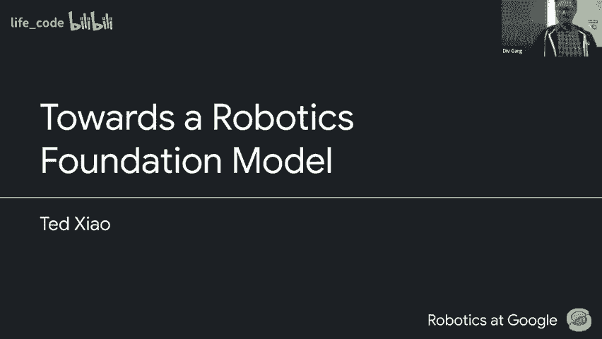
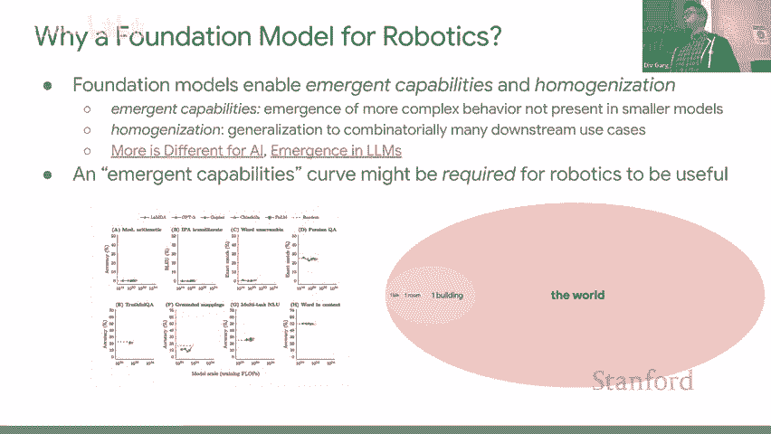
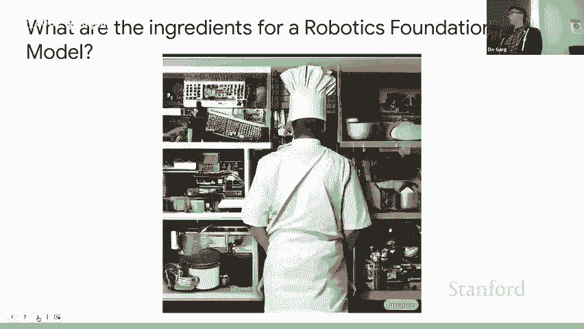
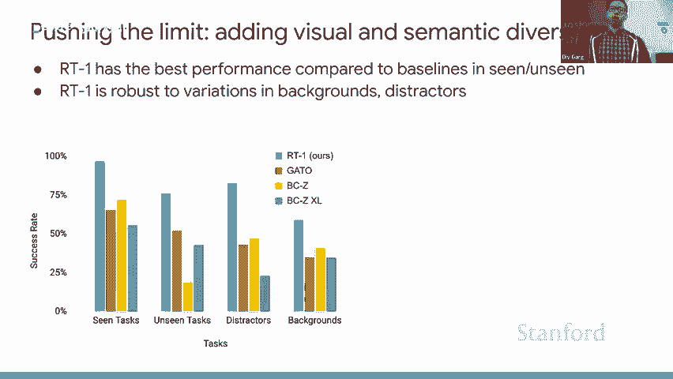
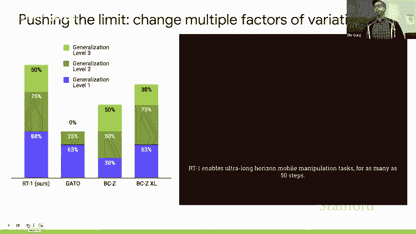
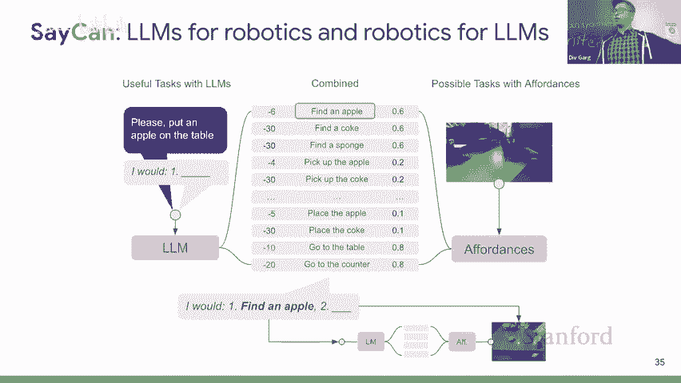
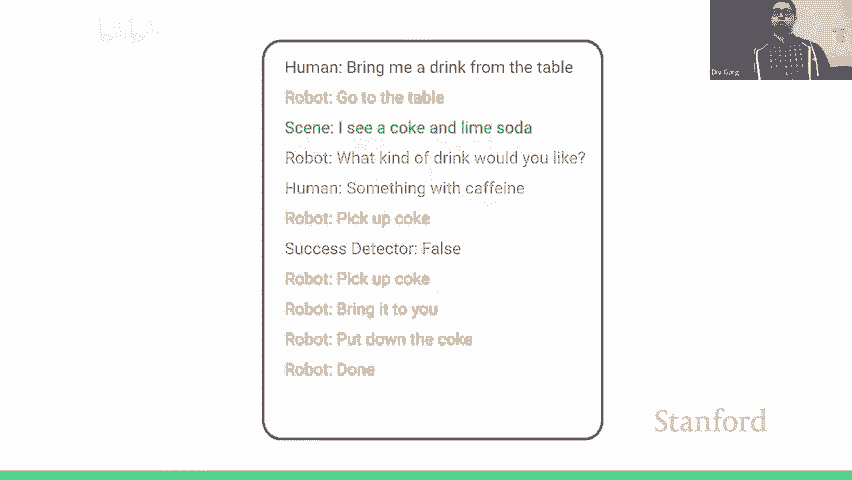
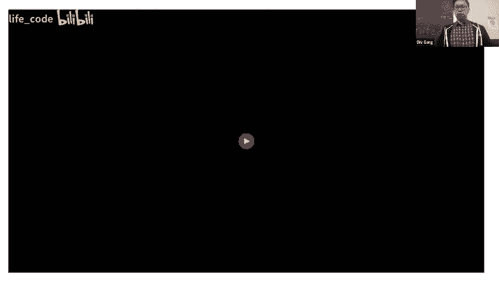
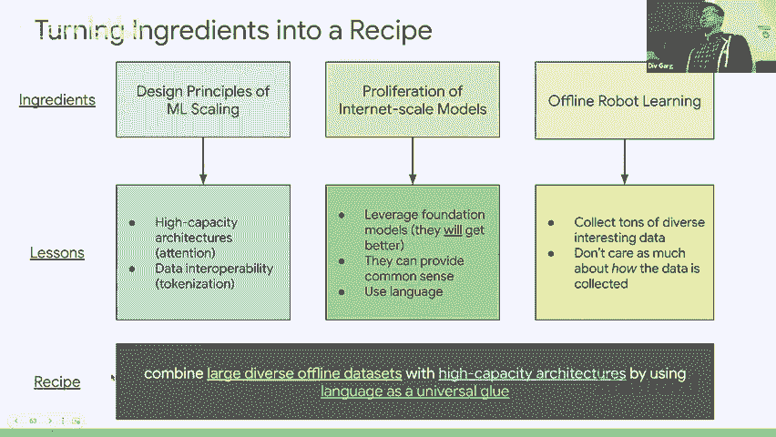

# 斯坦福 GPT／Transformer 原理介绍 (中英文双字幕) - P15：15.Robotics and Imitation Learning - life_code - BV1X84y1Q7wV

Hey guys yeah thanks for waiting i'm really happy to be here I guess to shortly introduce myself my name is Ted Shao i'm a senior research engineer at the Google Bra team I've been on working on robotics now for the past five years I've touched upon a few topics including multitask learning reinforcement learning and then lately just broadly thinking about how we can scale robots to make sure that we can actually work in the wild in the real world。

😊，I guess today I'll be talking about quite a few different topics。

 but as a first preface I guess the first thing to know is that our team is pretty massive now all of these projects are huge collaborations with some projects have more than 40 people working on these for many years so these are large efforts and i'm just very fortunate to call myself to be on teams of very smart people and secondly some of my takes are spicier or more controversial than others and so all of those opinions are definitely only my own and don't reflect those of Google or anyone else on the team。

So with that out of the way， yeah， welcome to my TEDx talk。

嗯。So I think maybe some of you have seen you know a lot of the cool robot videos learning videos out in the wild these days。

 but I am more excited than ever and it's not just hype I think I think there's been a fundamental shift in how researcher and robotics view learning over the past two years and I think the shift has a lot to do with all of the trends happening more broadly and foundation modeling in largescale internet models across different fields like language audio and so on but I think my goal today is to convey to you why I am particularly excited about this time today right and now and why there's been a very fundamental 18 degree paradigm shift I think across the robot learning field and if you walk away from this talk with just one thing and that's you're slightly a bit more excited about robotics than you were before or believe that the time is now for these robots to really start scaling exponentially and doing something really cool I think then my talk will have succeeded。

嗯。galaxy。The talk will have a few parts we're going to start at a very high level and just talk about why a foundation for foundation model for robotics at all。

 what that might look like and the ingredients and recipe for how we might get there then we'll dive into a few different works pretty deeply that my team has been very proud of over the past year or two and finally we'll go back to the high level and then zoom out and think about what's next for robot learning。

So why a foundation model for robotics？One second， let me try to hide this thing。

No that's fine I will keep that bar there for now but the top bar says why foundation model for robotics you know being coined here at Stanford and I'll use the phrases internet scale model foundation model and large language model pretty interchangeably throughout and I hope it's pretty clear but generally when I'm talking about these big monolithic beasts that are training on tons of data。

 they have two very important properties that I think are quite nice one is emergence when very simple things kind of work at a small scale they get a ton better when you just scale things up more data more compute larger models and what we see here is that when these models even become good enough the domain space of what they're good at and able to do starts to go combatorial even larger and here for these two points I would like to suggest two blog posts I highly recommend one is from Jacob Steinhart called more is different for AI and this kind of links the phenomenon。

See in other fields like physics or biology， for example。

 individual water molecules will behave very differently and have very different let's say electrostatic forces then they start to up clump up and start behaving as a liquid altogether we see this in herds of animal and flocking patterns we see this in humans in economies we see this all across different fields and now even in AI we see models that are doing stuff that will not be even possible or they add a smaller scale。

 but when they reach some critical scale in size， they start to work really really well this is documented by Jason in this blog post emergence in LOMs which you see this plot on the bottom left success rate across a bunch of different tasks whether it's modly arithmetic or purging question answering the success rate is basically flat until these models get big enough good enough and then these success rates just kind of skyrocket and that's why I think these are particularly exciting sky question I'm curious to know。

The body foundation model display scaling now。Great question and I'm really glad you asked we have。

I'm pretty excited to present some directions we have along that I hope we'll answer a question in maybe about 10 minutes or so yeah。

 but I think that's a question on all of our minds including myself。

so I think before we even get to the feasibility or the existence of any robotics foundation models like is this even needed and I think the argument that I don't think is obvious is that I think emerging capabilities in relying on these might be actually indispensable for robotics to actually work a lot of the research over the past decades of robotics has been in one bin one room one table。

 one robot one building even but these are so vastly different from the orders of magnitude more complex while real world situations that humans operate in every single day and I think to make that gigantic leap we're going to have to rely on this emerging capabilities scaling curve where things kind of work you have very can demos maybe you have you know a humanoid robot programd the backflip after hundreds of trials but going from that to like the chaotic real world I think we're going to have to rely on this emergence phenomenon for that。

And I think maybe even intellectually or academically it's also interesting to think about why or why not a foundation model for robotics might even work it's worked in so many other domains。

 there's existence proofs in audio music coding language another domain every single day it seems with 3D models and beyond but if there is something very special about robotics whether it's embodiment or causality or physical grounding and that is the barrier to making this very simple recipe that's worked in all these other domains if there is something special about robotics that causes this recipe to fail I think that's quite interesting to study why that is I'm personally an optimist I don't think there is some magical secret sauce that's going to keep robotics from being tackled with the same formulas and recipes that's worked elsewhere。

 but you know I think this is a concept I'd like to find out the answer to。

And so maybe then instead of just motivating this philosophically okay we need foundation models foundation models are great let's try to build them for robotics how do we actually do that Well I think we can leverage a few ingredients by standing on the shoulder of giants and looking at other domains The first one is looking at different design principles of Ml scaling from other domains let's look first at highcapac architectures。

 the topic of this class today ideas such as self- attentiontension as all the different ideas encompass in the transformer as Andre Carpathy famously said。

 it's like a magical universal differentiable computer that's very general。

 very robust and very remarkably scalable on many different dimensions let's use those we should also leverage the more guiding principles that have been seen the scaling laws。

 the trends this here is Stcha know we not only have to scale the model size we also have to scale compute and we also have to scale the number of unique tokens in the corpus of the vast data sets that we train。

But if we do all three together， this has been shown to reliably have a pretty good chance of succeeding no matter what domain you're looking at。

And so and finally what that kind of means， and I think this is actually going to come up later is that data set size seems to matter these days a lot more than quality。

 even if you have some sentences on Wikipedia that are misspelled or some some you know falsehoods or some things that aren't so desirable if in aggregate your data set is diverse enough and interesting enough。

 these things will hopefully wash out in the mix。Inreedient number two。

 the proliferation of the internet scale models themselves， not just the principles。

What's exciting and I'm sure it's you know definitely been very shocking for both experts and lay people alike is that a lot of these generative models across many different modalities have been experiencing emergingnt capabilities and have been surpassing all of our wildest expectations time and time and again but even when we think that we're exhaust at all this stuff is too much is not going to work something will come out and completely blow me out of the water and I think this trend will definitely keep continuing and I think in addition to that they not only will continue coming on and accelerate more rapidly they're going to happen with whether or not like we do anything you in the grand scale speaking me as a robotics researcher or you know you in whatever subfield you on there are parts of machine learning that likely you'll probably not ever touch in at least the near future and those parts will be seeing tremendous breakthroughs and scaling and new capabilities coming online every single week。

And you can look at this not only in the impressiveness of the models。

 but also the acceleration of progress， the time scales in which new models are being released where large collaborations are being worked on by many groups and then you know being available to access for all to use and build upon。

And the final ingredient and this trend is more of a robotic specific one。

 but it is a vast shift from online robotic learning where robots collect experience online make actions and learn through trial and error to an offline setting where we decouple the data generation process from the data consumption process as we've seen in all these other foundation modeling domains。

 these big internet scale data sets are so diverse and they're static we just scrape them once or scrape them multiple times continuously but we aggregate a continuous pile that's just growing here we see either the pile data set from a Luther or Lyon 5B for image paired image text and these are pretty big and they' orders of magnitude more than what we've seen before and they are definitely a key ingredient to why other domains have been doing so well by training these big foundation models。

And。This coming back to robotics then I'd like to take a brief detour into how the shift came to be because it's very easy to say in a sentence yeah robotics is offline more than online and this is coming as kind of a no brainer to many folks who are coming from other domains like this is the way things are done but in robotics this has been a very big shift and I think robotics has also been synonymous with RL reinforcement learning for a lot of people and I think increasingly this is becoming less true and so I'd like to take you down a brief trip down the history of my team the slide of the talk as brief history of robotics at Google and yeah of course thanks and I think this is not just for dramatic exposition it's really to try to guide you through how drastically our team's thinking has kind of evolved over the years and how that's going to inform the design decisions and and the kind of risks and research directions that we take in the specific projects that I'm going to show coming up thank you。

So in 2016 some of you may have seen this we had what we called the arm farm7 cua robots in a room collecting picking data 247 and this was doing on policyL in the real world we were the first team to kind of say hey can we can we even do this with the goal of saying can we do end to end robot learning with results in the real world this was kind of risky at the time that was not a common take and from that we developed several interesting research directions that we started exploring we looked into stuff like QTO which is a Q learning method working on continuous control actions while taking vision inputs we worked on cyclegan to transform simulationbased images into real real-look images for Sim to real we looked at concurrent role of how we get robots looing faster and more efficiently in the real world I'm sorry do you have a question yeah great question and that one I think was basically。

The arms would pick stuff up from the bin if they messed up and it fell out well we'd come back the next morning and there'd be objects scattered all throughout the room。

 so there was no reset but if they missed a little bit the objects would fall back into the bin and hopefully be in a position where they could pick them up again。

😡，Oh yeah of courseChat thanks I'll do that in the future this specific question was for this 247 arm farm how did we do resets and the the answer is well we didn't we designed the bin so that they were kind of banked so that objects slightly missed they would fall back in the bin reorn themselves maybe add more diversity with the training data but this was doing off policy online Rl with Q learning and we mixed it with SIim data deployed again。

Next we kind of went through this consolidation phase around 2020 when we're like all right this is pretty cool and you know but we want to get out of the bin how do we do more complex tasks and a more practical setting that could be closer to something that humans would want to use that's more general every day there we kind of settled on this office micro kitchenitchen environment if you heard of the famous Google micro kitchenitchs and I think this was the setting we decided's operate in and there we started collecting data we scaled our real operations and there we kind of scaled approaches to some different things and I think in the bottom right here is like the more mechanized reset version I would say of the arm farm here we had a bin that folded in half and this was doing multitask Rl in the real world and the bin would flip in half dumping objects from one side to the other so you could do more interesting tasks whereas the arm farm was pick anything up now we could say hey pick up the carrot and place the tomato onto the plate and then the bin would flip and you'd reset。

Some other works to at multitask imitation learning， this is BC0。

 and then we also looked at stuff like combining reinforcement learning with imitation learning bootsottrapping。

But in 2020 once again we realized we were working on a ton of different directions and we wanted to consolidate and I think the two main things that were really boling us point at the time where we were hitting two main walls across all these methods some of them were plateauing at this 50 to 70% you know rough range in the real world and other methods were requiring very specific data distributions they had to be on policy or they could only use demonstrations or they blah。

 blah， blah like there are so many different nuances and like gotchas to all these different methods and all these different drawbacks and so the question we posed was we're open to any method。

 any strategy that will enable us to solve tasks in a very performant matter more than 90% in the real world and also that can scale with some kind of data that we can collect you know and maybe this is a bit more lax than let's say an academic setting where you're much more resource constrained but at the end of the day you know even our team does not have infinite money we still have a certain number of row。

certain of operators and we're constrained by the laws of physics so we need some way to acquire more data that we can then learn from and so we're all scratching our heads thinking about this for a few months in spring 2022。

We decided on going with multitask imitation learning so this was a vast departure from the 247 arm farm this was a vast evolution of how we approached the problem we found that you know with enough you know gentle care and love multitask imitation learning was able to hit these 90% numbers and those able to get better with more demonstrations these aren't the cheapest thing but it was able to scale with additional demonstrations which was the sign of life that we were looking for so that brings us to less than a year ago our team was deciding this is the path forward at least in the near termm future but。

Maybe you know we could just think about how the approach we were taking here might also spread out in the future and we might be able to bring back these other threads。

 for example， if now that we're decoupling this data collection of demonstrations or et from how you learn from them with a multitask imation learning policy。

 maybe we in the future then do something like offline RL。

But I think at a high level now I've just you know in a few short minutes just compressed six years of very bitter lessons that our team has been learning and I think from where we are today and looking back even just two years ago。

 if you told me that the strategies were at point today could just scale the way they are。

 I probably would not have believed you。😡，啊，有几。But anything they do instead of like trying figure out how it did。

Great question so I think task conditioning is definitely still was an open question at the time。

 but I think with this work BC0 we found that language was able at least in a templated language kind of representation was good enough where we could direct I think BC zero is over 80 tasks so they were very templated like pick grapes or like move grapes onto play or drag this drag cloth across table and I think this representation was still enough where you're learning a good number of skills you're passing in essentially a one hot ID into your policy network and it will learn to imitate that and for each one of those 80 task could collect hundreds or thousands of demonstrations。

And I will touch upon the specifics of that a bit later too。Um。So yeah， today， or at least in 2022。

Let's do offline methods， let's decouple data generation from data consumption。

And let's take these three lessons now that we touched upon。

 let's take the design principles of ML scaling and then figure out what lessons can actually be applied when we go look into the future for recipe for robot learning and foundation models。

The first lesson I think is very important is these high capacity architectures like attention and the second I'll touch on later is data interoperability tokenization discretization and the second ingredient is the proliferation of these models themselves Can we leverage them because they will get better over time and I think here I would like to plug my colleague Carol Helsman's bitter lesson 2。

0 which is the bitter lesson the first one from Richard Sutson was you should leverage methods that scale with more compute and maybe in today's day and age the lesson is that we should leverage methods that are able to utilize improvements and foundation models because they're going to get better yeah so the lesson 1。

0 and。0 one thing thats compare me is have a set。And I want to choose the methods that are going to scale with more computer or in this case scale with better foundation models the question is how do I actually decide which of those methods meet those criteria？

Yeah， great question I think and maybe it's and I think that's a very I don't have a good answer for that Oh sorry the question was in bitter lesson 1。

0 and bitter lesson 2。0 the question is well that's great that's the lesson but how do we actually decide which methods meet this criteria and I think you my answer is it's not always obvious and it's actually quite tricky sometimes but maybe you know sometimes you know what you can be very confident that。

 oh yeah this will definitely scale with more data and compute and some that are but basically the more hardcoded you are。

 the more assumptions， the more heuristic you bake in the more you in our day and age。

 the more you rely on a specific implementation of a specific foundation model of a specific class of algorithm。

 maybe that will be less robust than a method that just assumes some very abstract input and output and assumes that how you get from that input and output can improve over time and maybe the algorithm itself even changes altogether so I think that would be my take on the bitter lesson 2。

0 but this is definitely still I think the jury's still out on this。😊，で。

And my basic one of the things I like to propose is that language is the way that we can leverage bitter lesson 2。

0 if you have language as the universal representation through which all these foundations communicate to each other。

 whether it's you know captioning or generation or whatnot。

 I think that's one way that we could leverage bitter lesson 2。0。And finally， the third ingredient。

 offline robot learning， decoupling data generation from data consumption。Putting these all together。

 my recipe for how one take at a modern attempt that embodied intelligence would look like would be to combine these large offline data sets with high capacity architectures by using language as the universal group and in the works I'm going to present shortly all of our different projects I think in some way or another are inspired by this philosophy。

Oh。And now now that we've kind of you know， understood the motivations and potentially one possible approach。

 sorry of course the bottom often is that architecture using languages and I'm curious to know which if any of these are currently。

Waternck's not the right word originals are limited。

Got it because it seems like we already have architecture architecture seems we already not the question was it seems like we have a lot of these ingredients and so why hasn't robotics been solved yet so I would argue that actually this take here and maybe this is to the wrong audience at the moment。

 but I think this is not very nonobvious across the robotics field many people do not agree with all of these much less two of these or even any of these points and so I think and also the existence of the scale of how mature each of these components are within robotics is at very different stages and I would say like and we can talk a bit later about like for example like data scale or the architectures that have kind of diffused through osmosis from other ML domains into robotics but I think we're still at very different stages on how how much people have actually bought into these lessons and invested in them。

you're not getting into this， sorry I'm curious to know I'm asking you to make names。

The people who might not be mining into all these pieces。1。

yeah I can probably I also don't want to get into too much trouble here i'll probably get myself in a bit of hot water in a few slides so I'll expand upon of it then yeah yeah yeah and I would say that like me personally and you know not speaking for my team but a lot of people on my team are probably at the very extreme end of learning scaling data drivenve you know foundation model based let's go big and I think a lot of people don't believe that yeah happy to discuss why later。

Maybe after the zoom as well so yeah well okay， then let's let's go ahead and dive in and see how this recipe might actually percolate into specific domains。

😊，And the first one is RT1， this is a recent work from our group that works on how we can scale imation learning and let's look at how we can actually apply these first principles。

So the first one is to consider what we actually let' let's put ourselves into the spring 2020 mindset we've been collecting demonstrations for a while。

 This is a ton of demos like 100000 over that was collected over like a year and a half on many。

 many robots on many， many tasks that exists it was expensive and over time this will actually not trickle up at insane amounts like we won't just get 100000 new high- quality demos every day this will grow over time but it's not going to grow for free and autonomous ways of doing this is very hard as you saw earlier with MT with a bin reset mechanism or DeepM has a work called Rgb stacking where they try to do autonomous resets and the way that we're doing it right now or at least for this paper was human teleop pioneered by BC0 and that was very expensive as well so this is gonna to be limited through and finally BC0 used a resnetbased backbone and it was pretty good but it found that it was very sensitive to training distributions for example when they remove data from some teleopators to make the data more。

genous performance got better and that's not really a property we like right we want more data even if it's not exactly the same so the lesson here models need to be robust and they need to generalize。

Cool so we have models need to be robust and generalized what else do we have well off the shelf models are pretty slow if we take in these huge you know vision transformers other domains they're not going to run on the real robot we need to be able to run at a pretty high frequency they need to be reactive inference time need to be slow because all our models are vision based。

And finally， we want our data to be able to understand language， as I mentioned。

 if language is the universal glue， our data set already has some language and we want eventual models to be very multimodal。

 this is a first principle that we need to take in。

What does this mean we can't just take something existing。

 we probably need to design or at least modify something from the ground up and let's take the best practices that we've seen work in other fields。

And so we worked for a bit and we came up with this architecture for RT1 again once again。

 this was a large team with a bunch of different contributions and I'll just go through a few of them here。

At a high level RT1 is robotics transformer it operates at three hertz it takes in visual input from the robot RGB camera as well as a natural language instruction there the image is patchrified and fed into a film efficient net tokenizer it's then passed into token learn which I'll talk about soon and then also the language instructions are tokenized and then they are put into the same transformer and then finally we output discretized actions as tokens and send that to the real world in threeHtz in closed loop。

This transformer is a decoder one we use a sparse categorical entropy objective for action prediction by applying a causal mask。

 we use the pretrained efficient net backbone and we also use token learner very for faster inference。

Ding a little bit deeper， oh sorry yeah a question。对到。对对对。Great question。

The image token when it goes in from so each image is the you know the high fidelity RGB image from the camera we split that up into 81 separate patches and so each patch is you know spatially just like the square there but the cool thing is that what token learner does here this thing here is it's a previous work from our group that takes in a bunch of possible you know image patches and dynamically selects which of those image patch tokens are more relevant for the tax at hand given the existing context so from those 81 image patch tokens we subsample eight of them to use for inference and this happens at every time then。

And that process has learned which of the eight patches are relevant at any given moment and otherwise we're sending in way too many tokens and the context length of explode and we wouldn't be able to do inference on robots we are also passing in a sequence length of six images history is quite important when you're doing temporal coherent tasks in the real world where things like physics and you know exactly this nuanced detail of what the objects are doing in relation to each other into to your robot those details really matter。

And in total， the model size is 35 million parameters。

 which is quite a bit smaller than a lot of these other huge internet scale models。

And finally one main difference here is action discretization before a lot of the products we were doing we' doing continuous control and if you think about it right our robot does have we do end effectector pose control position control and the real world is a continuous state space but and to do that we had to come up with many algorithmic novelties for example。

 a CM actor that did basically sampling of these continuous action spaces to propose the highest ones that would get rated by the Q function and we do this fly blah。

 blah， blah， and but that's like so sensitive but we needed to get do that to get things to work。

 but now we just decided let's just know bin our actions it's only 256 discrete actions and let's just predict those as tokens。

Any question Yeah， what I was mentioning there。You have this design requirement or engineering requirement about speed and latancy reaction。

I mean when you say that that necessitates having relativelyly small model which makes sense。

 but important message of scaling when we're talking about foundation models is that built be bottleneck by either data compute four parameters so I guess what I'm curious to know is how do you balance these off in the sense that you want to have lots of parameters that have a really powerful model or on the other hand you want to have very fashion input。

Yeah， great question and to repeat it the question is we kind of set a pretty hard constraint with 100 millisecond inference time yet a lot of the lessons in foundation modeling is that you shouldn't be constraining yourself against any dimension。

 whether the status set size compute or model capacity and I think my initial answer to that is that's the very great point and something I think that's going to be coming up as a severe bottleneck in the future but for our initial case I think this is more of an exploration of whether these principles and even scaling well beyond what we were looking at now could work already this 35 million is gigantic compared to a lot of prior work using for example Resnet 34 or whatnot so this is already much bigger than you a lot of other options and maybe for now at least it's the easiest it's the largest scale we could go to roughly in the short term without having to think of more tricks I guess got。

Yeah， we can talk about a bit later， maybe I think I'd also love to hear your thoughts too because it's very non obvious how we can get past some of these bottlenecks。

sort yeah， great question we ran some abls on model size， I might have that in a few slides。

 but maybe we can return to that then and if not yeah but great question。

So yeah that's the architecture and I'll discuss some of the ablation of the trends later on。

 but maybe you know this is a robotics lecture I should show you some pretty visuals right so let's look at some evaluations we did we compare against some baselines one is gotto which you might be familiar with and then other ones species0 the reite based and we find that we evaluate on scene tasks versus unseen tasks and we also in various toer objects our normal data collect looks like this top left picture three cans on a great ask that's basically it but then we push it further by bringing in a lot more objects so that the table is so clutter that even as a human sometimes it it's hard to find the object that you're actually looking for we add in table class to make the textures very different we bring it to new micro kitchenitchs with these surfaces altogether and we find that Rt1 is more robust than these other different methods。

this dataGood question question was from the was the gotto model trained on our data or was it just already included in gotto the answer is this data was not included in gotto and so we retrained the gotto model only on our data。

And yeah so here's just a different visualization of the robot going out in our micro kitchenitchen and doing different interesting things you can see here that it's trained on one setting。

 but then it goes into brand new kitchen brand new countertops new objects and it's able to do all of them pretty robustly we also put it into a long horizon setting using the Saan framework that we'll talk about next but in these settings a lot of them are mixing all of these generalization capabilities and plot on the left here we're using what we call generalization levels inspired by the VeEMA paper that would basically increasingly change more factors of variation simultaneously and here we found RT1 is the most robust。

就系好，你都可同力睇落去前度第个过去。Yeah good question we'll go into a bit more detail later but I think at a high level teleoperators get a structure templated command of like verb noun verb or something like like pick Coke can or move Apple near sponge and we have around 700 tasks set up this way and they go ahead and collect that data test done and then later we have we make sure that successes are actually successes and we discard stuff that's like unsafe for example。

Oh yeah， got it for this paper， we utilize 130，000 demonstrations for this。佢都个写翻。啊这个这。

Is there any issue could in。Yeah great question I think a lot of prior work has also noted that when you have for example the question was did you find that the trajectories in your data were very multimodal and I think what you mean by that is that to go from point a to point A to point B I can go left or I can go right or I can go straight and I think this kind of diversity in basically for a single image state but yet my data has three possible labels that can have very bad effects sometimes for us I think because we are using teleoppper demonstrations the data was more homogenous than perhaps like in the while for example there's a type of data function called play data where operating just do whatever they want and we label in hindsight and I think our data is more homogenous in that but we did not find a lot of the issues that we've seen in prior projects one potential answer is maybe it's the architecture itself but we can talk about that later too that question。

再到到叉市。Right。我好的。Great question we actually do have a termination action so the policy itself so the question was how do you determine when a episode is complete and the policy is able to predict terminate because at the end of the H teley operation session the operator can click a button and it's marked as the episode's done。

think。Yeah， I think for these evaluations we were quite strict but definitely I think in some cases you know。

 maybe maybe if we're just doing an experiment for ourselves we'll have a dense reward scale of like grasp the object and move closer grasp the object and almost got there if I messed up at the end and we'll have like a grading curve basically。

 but for all these all of these stats I'm showing here it was zero or one one fully complete zero。

Was not fully complete。

哦。And I think what was expecting exciting maybe talking about the multimodality aspect is then we pushed to limit even further and were we decided to train on very diverse data distributions your so right now you saw 1301000 demonstrations trained on this everyday robot proprietary mobile manipulator。

 but we were also looking to train on very different data distributions with very different action distributions。

 very different trajectories， even very different visual objects tasks and to do that we included two other data sources one was simulation data which was kind of our robot but in SIim but it looked quite different and also this data was collected with reinforcement learning and not with teleoper demonstrations in the past with all the IL plus RL work that I mentioned we found that combined these two types of data was going to be very difficult because RL data has very short actions it's very quick that's very optimized for the specific reward function versus。

Human collected teleoperationation data is a lot more human lab so to speak and finally we revived a data from many years ago of 2018 if you remember the Ka project。

 that Ar farm has not been operational in that state for many years now。

 but we had that data still and so we were hoping to see if a different robot with a different action space on different objects with different visuals in a different building could still be combined with data from this macro kitchenitchen data set that we trained on originally and what was very surprising to me is that RT1 was able to learn from all these very diverse data distributions I had never seen a result like this where any other architecture for example。

 a resnet or even the learning method like reinforcement learning could successfully learn on such different data distributions so robustly and we evaluated for example on combining concepts so we would have the original everyday robot robot pick up objects that were only seen in the Ka project or we would put objects only seen in simulation。

And see if our policy could understand that so it did seem like it could generalize between objects had seen in other data sets and concepts that had seen in other data sets into the setting it was in now in the real microfi and that was a very result question action of the everyday robot。

Great question yeah we just tokenized it and made sure that the tokenization scheme was kind of interoperable and I think that was the I can dive that in a bit later too yeah yeah。

And note that does not mean we can send the exact actions for one robot to another and have it execute it was more just like in the data set I think even by human inspect you can tell that these are coming from two different robots。

😡，So yeah let's look at some ablations for the scaling laws that we're all here for now we found that you know reducing data size reduces performance。

 but more interesting maybe is task diversity was quite important here we have two different trends。

The green line is what happens when you reduce the total amount of episodes per task and then gray here the purple curve is for what happens when you reduce the total number of tasks when we found that having more tasks is relatively more important than having more data for each task。

And I think this was a lesson that I think is probably going to suggest ways that you know we should scale robotics even further is not to just collect more data of the same task in the same settings。

 but to go out into the wild and get more diverse behavior。

questionI haven't defined diversity dataGreat question question is how do you define data diversity in this case it's just a number of unique structured templated commands that teleops receive so those 700 templated commands when you start reducing them and only train on 500 or only train on 300 of them performance drops much quicker than if we had take taken the same proportional cuts to the total method yeah so I guess'm curious。

没要头。It that it see donmes and really to point very things。

Yeah I don't think we the question was there seems to be almost a linear correlation between a data size and success rate and I think you know we could apply some fancy like you know scaling law you know try and curve fitting but we didn't look too much into that because you know this is a trend that we kind of expected we just weren't sure about the magnitude of how much it would affect us and I think。

I don't have any really good insights on this besides that we see this phenomenon empirically。

ItThere should be one about。Yeah and great question so the question is oh maybe this will just go on indefinitely more is there something magical about you know January 2023 and I think this is maybe also this is when we start to conflate the algorithmics exploration with like practical considerations of scaling real world operations which was when we got up data our policies were hitting you saturating on these hitting close to 100% we're like all right let's collect another data set so we basically collect until it's at 100 and then we switch to something else but at this point what was interesting is that when we kind of bet really big on this Rt1 architecture we we'd already been collecting demos for a while so it was possible that we had collecting more than we needed and in some cases actually you could cut tasks without losing too much performance which was quite interesting but。

Yeah。He says if this at all related the fact different task trajectory data might be more diverse among the different tasks but among multiple trajectoryor with the same tasks like if you just use like the same author for all the tasks or like saying there no fields like given。

朱类喺度要发过俾猪呢啊呢啊。Great question and the question is whether or not all tasks are created equal in terms of like their capacity and entropy for different behaviors you can learn from them and yeah that's definitely true some tasks are much easier we have a task that's just pick up this object that's going to have much less interesting stuff you can squeeze out of it than you know moving something into a drawer and then closing the drawer but yeah great question。

Great now， ablations， we also trained without the big model size。

 we did it without pretraining without you know with continuous set of discrete actions with autoregressive actions without history without the transformer。

 and I think all of these design choices did seem to be required for robust performance。Oh yeah。

 of course。Yeah。分正家成。Yeah I think all I mean like and again you know for paper writing it's kind of like the best thing that we can empirical find that's that's the method and then we'll figure out why each of these are important and so yeah I think what one surprising thing here perhaps was that autoaggressive actions hurt you might think that passing in more information is always better than passing in fewer fewer information but in this case maybe conditioning on your previous actions was kind of doing kind of like in context learning was doing online systems identification to figure out what。

Teleoc rateer this data came from and like how you can overfit to that specific set of action history and so removing that was actually better。

One interesting tibit there。没。Cool then and maybe in the interest of time I'll try to get through the other ones a bit more quicker and then we can maybe just do few i'll just do the questions at the end if that's possible just so we have time to get through everything。

The next work here moving a bit away from skill learning then and actually onto the planning level。

 I think the first project took a lot of the design principles of other fields and this offline robot learning paradigm and put it into the skill learning so we actually bring that out to other parts of the robotic system and the first work here is Sacan if you remember here back in this timeline in 2022 we started thinking about oh yeah how do we scale this multitaask im learning but at the same time large language models and other types of foundation models we really picking up steam whether it was Iogen or Do2 and we definitely wanted to figure out how we could use those as well we had come up with this RT21 design that we're betting big on but from here we started to explore how all of the better lesson 2。

0 we could start utilizing foundation models within the context of our full stack system。

The problem of doing this naively is that language models are not completely a very natural fit for robotics。

 for example， if you're a robot in a kitchen you ask a language model I still my drink what can you do language model will give you stuff that's not very relevant it's going to ask you to vacuum it it's going to ask you to call cleaner or it's going to apologize and these are not things that the robot can do in your kitchen with your spill drink to help you。

And so there are two parts of this then one issue is that our robots are limited。

 they are very constrained with what they can do， they cannot do everything but they can do certain things and then the second problem is that the language models are also constrained they don't know what the robot sees they don't understand that they are in a robot body in a micro kitchenitchen needing to do real stuff in the physical world and so we need to get the robots to speak language model language and then the language model to speak robot language to do this we present say can in the same setting you know please put a napple on the table we score the predictions of the language model on a constrained set of tasks that we know the robot has been trained to do and then we also take the affordance function from the robot an affordance function is a estimation of given some kind of state what the robot is able to do how confident it is that it can successfully accomplish that task in the given state in our case we use something like a value function from reinforcement learning。

Wch kind of encompasses this quality given these two values。

 these two scores we have the confidence from the language model and then the confidence from the robot we can combine these and then hopefully the combined prediction is both something that's going to be very sevantically relevant for the high-level instruction finding an apple is the first step in please put an apple on table but it's also something that the robot can do because no robot on the frame but it knows that it's been trained to find an apple so it can navigate around to find it and so hopefully you can do this then in closed loop and then keep on going and predicting a highlel plan from the language model that's grounded with the affordance function of what the robot understands。

There's a video here of the sick hand doing different stuff。

 but you know happy to share it later offline it's very cool trust me it's the greatest thing since sliced bread。

😊。

好。没有异议。And yeah， some numbers then we tested this out on very long horizonor instructions encompassing more than 10 separate navigation and manipulation skills in the micro kitchenitchen that you see on the bottom right。

 we evaluated hundreds of different evaluations on this and we tested out very a lot of different concepts including things like refphrasing by using single prohibits by drawing instructions that just came from you know colleagues and friends。

 and then and we found that while they were failures in both the language model planning stuff side。

 where it would predict the wrong path for the current situation。

 as well as on the policy execution side， even when it gets a good plan the robot will mess up sometimes overall it was still doing quite well。

And now let's kind of take this back to the lesson I think this is a very great example of how we can leverage Internet scale foundation models as they get better when we started the project we started with a language model calledFlan from Google throughout our implementation palm came online half language model and when that happened we were able to just hot swap it in and performance just kind of got better for free without us having to do anything by just assuming that language was the API the plan just has to be any string it can come from any source it can come from a human it can come from a language model when we improve that language model。

 the system gets better overall and here you see with a scaling size is as the model LOM increased in size our planning performance got even better。

And some cool tricks here to get it working well how did we actually produce this plan well just by prompting as is the ridge these days with chain of thought and with better prompting of just giving examples of here's some great robot plans now give me a new plan starting with this highlevel instruction we saw that the robot could do all things from understanding different languages to asking them to do very complex reasoning like hey give me something caffeinated or I don't do a caffeine anymore or get me something like you know better or I could bring me a healthy snack versus bring me a unhealthy snack so Kevin was able to reason through all of these。

Let's you know I think that was our kind of the first contact of robotics with language models on our team and it was the first exploration into how these two worlds could overlap there was definitely still improvements so in our monologue we try to improve those further by bringing in vision language models。

The idea here is that you know we had very high plan rate success with Sacan but unfortunately it wasn't really able to recover from failures what I mean by that is that the language model would not really get updates of what was going on in the world so that if this was the plan proposed go to the table。

 pick up a Coke bring it to you but you messed up in the coca you dropped it on the floor it would still continue trying to bring it to you put it aside all of that does not really matter anymore because you dropped the cocan and so in this work in your monologue we are really hoping to figure out how you could add closed loop dynamic feedback from the environment into this planning process。

Let's take that exact same example now instead of just directly correcting every instruction。

 maybe we add back some feedback from the scene also conveyed using language as the universal API here。

 the scene can tell you what's actually in them maybe the robot asks a question now in the robot this is a language model asking the clarification question maybe hear a human response or another language model then you can predict action the next task to do once the language model has enough context and maybe you even add in stuff like success detection and so on and so forth。

How do we do this then well the first thing that we implement is what we call passive scene description just using either and off the shelf engineer heuristic using objectic detection models。

 something like vile， you can describe the scene and text and just convey all that context to the language model。

For active scene description， this is maybe similar to visual question answering if you're familiar with that field。

 the language model can actually propose active queries that it's curious about in the scene。

 maybe to make sure that has enough context to move on and here either a human can provide the answer or in the future a VQA model as they improve can provide that。

And finally， for success detection， this is very important to allow the language model planner to know when to try to retce something here we take in the first and last image fine tune a clip success detector and use that to provide binary success failure information back to our language model。

嗯。

And for the results wise， we can see a very similar say can long horizon evaluation。

 but here we actually what's interesting is that we're able to and basically implement all these different automated feedback mechanisms on the robot and so that it's able to reason and recover from things here you see it's going to try to go to the table but the humans actually been saying hey。

 I change my mind and then it changes the human change its mind again ask to go back and forth and the robot's able to you know maybe we're kind of touch the language model at this point but the language also able to replan and you know make sure that the human intent is satisfied。

We also tried， I'm not sure if this video shows it。

 but situations where we did adversarial inputs where I walked around and just kind of knocking objects out of the robot's hands and forcing the success detector to tell it。

 hey， you messed up， you know， try again。啊。And we also tried this out on a couple of different domains。

 a simulated tabletop manipulation domain as well as a real world manipulation domain。

 and we found that this was much better than SaanN or let's say just only using visual features themselves with something like clipport。

And I think here it really speaks towards a trend that I've really come to appreciate in 2018 a robotics professor once said that when they look at all of the different things preventing robot learning from scaling tremendously。

 it thought the bottleneck was high- levell semantic planning about reasoning about common sense and I think in 2022 and 2023 language models can provide a one path of how this can kind of be offloaded at least in the interim。

 and I think if language models are the API， then you can just bring in these vision language models as object detectors get better as success detectors as VQA as language models get better。

 you can bring them all into the fold and the act is kind of a lifefest if your robot currently does not have common sense reasoning。

 these other models can act as a scaffold in a lifefest to bring you up to par with what they currently load and maybe then in the future you'll get beyond what the language models know but in the short term it does seem that we can leverage them to accelerate what we can do in the real world。

Moving on now from we saw now how language models could do planning。

 we saw how vision language models could help planning。

 and now we're going to switch gears a bit and think about how vision language models can help other aspects of the bottlenecks that robot learning faces。

One of these is that data collection is very expensive as we mentioned before， we did have this 130。

000 episode demonstration data set， but it was collected over a year and a half at significant cost both in resources in time and money and with many many robots and of course these tasks too were also。

A bit limited right we use 700 very templated commands instructions that would give to teleopators because we knew that was this would scale right if we collected enough data for each of these templated tasks。

 we could do that specific task and here's the flow that someone was asking about earlier we give this pick coA instruction the operator controls the robot in the real world finished the task marks the episode is terminate and then shade that out to this big orange data set and that big orange data set is so we trained on in all the previous projects for the control policies。

What we initiallyly considered was adding a bit of crowdsourced hindsight annotation if you're familiar with it with a hindsight experience replay and reinforcement learning with goal conditioning with you know maybe the robot did something that wasn't just this highlevel templated instruction who could ask a human to describe more verly what the robot did maybe it picked up the coca that was on the right side of the table maybe it picked it up and then knocked it over maybe it moved it very slowly to the middle there's a lot of semantic diversity encompassed in this demonstration that that is not totally you caught by this highle templated pick coca instruction so we labeled 3% of this big orange data set with these very ver descriptions。

And next we kind of applied the pseudo labelbel str strategy that's been seen in other fields such as video pretraining with their inverse dynamics model。

 but instead we apply that to the instructions to the semantics of what's contained in your data set so step one。

 we pretrain a clip model on your small label data set of 3% of your main data。

Then you go ahead and use that trainBLM data to label all of the templated instruction demonstrations that you had before that 130。

000 episode dataset sets， now you have a relabel data which has a large diversity of interesting semantic instructions and then we plug in all of these data sets into RT1 and just train a language condition behavior cloning policy similarly to how we would and normallyally。

 but even though normally we just use data B， the orange one， now we use all three dataset sets。

And then finally we evaluate on entirely new unseen instructions in the prior works right we were evaluating mainly on the 700 templated instructions。

 but in this work we actually go beyond that we can type in you know almost anything you want that you think might succeed and you can phrase it how you can you can add typos you can even do it by referring to semanttic concepts you can add spatial concepts and we see how it does。

The reason that this might work maybe visually to represent this is here are the TN embeddings on the left and the right it's the same embeddings but on the left they're colored by the original templated instruction that was used to collect that episode and on the right is what the vision language model thinks if it's allowed to put a freeform natural language caption and assign it to that episode you see that on the left you have these big clusters of pick coca is like you know hundreds or thousands of episodes but we all just call them pick coca well on the right then we can then expand those concepts and say actually this episode is picking up the red coca this episode is picking up the crumpled coca this is picking up the coca that's next to the chip bag and so you can get a lot more mileage out of the same underlying data set by just using language as the diversity mechanism through which you kind of expand the concepts that you're considering and for example in the middle you see you know open top drawer to become hold and pull out the top drawer。

We have stuff like the center left for for the middle episode for the bottom one pick green rice chips from whitepo becomes lift up the chip bag from the bowl and drop it at the bottom left corner of the table。

 so you had a lot of these semantic know spatial concepts that are now going to be in your target supervised labels。

I a question。That time I be their perspective。I heard languages simply you have to that are。Yeah。

Great question so I guess if I can rephrase a bit the problem is that like is actually a very difficult and perhaps even untract problem of how you map all the linguistic concepts you see out in the wild down to like maybe like embodied specific types of episodes and like。

Here maybe I would say is that we are definitely introducing a lot of our priors and our biases onto like maybe what we call as left you mean left 10 centimeters of two centimeters like like what do words mean and these definitions what do they mean to us to the cloudcomp raters that generated these caption what do they mean to the robot what do they mean to the language models maybe these are all slightly different but the hope is at least if they're roughly similar we'll get like directionally correct improvements so I would say the nuances of the specific hard lines of definitions and like actual like semantic meaning of these words I think that's maybe out of scope right now but maybe something will dive into further at a higher level though I think basically the bar is just so low we have these 700 template instructions that are basically one hot IDs and we just want to make those closer to natural language even if by a little and I think at least we're trying to get towards that with these vision language models that are。

I hope that answers your question。And we also compared to a few baselines on the top left here。

 we look at what if we only train on this 3% of these fancy human rated labels。

 what if we only train on the original RT1 data set what if we train on both of these and what if we train on both of these plus all of the predictions given by our VLN and what's interesting here is that you know relabeling seas to universally help we evaluated only on novel instructions that was new for this project it's the first time on a robotics project where we only tested on something I could type whatever I thought I would type it in and that became the test set and we just had to make sure that it was never contained in the training coverage and you see all these interesting examples on the right here of stuff like move the lonely object to the others I have no idea how this worked stuff like lifting the yellow rectangle talking about colors talking about move the right apple to the left here we actually two apples in the scene and actually in our training demonstration。

Data we never collected scenes with duplicate objects just because you know we thought of this low pay modality problem if you just say pick cocan and these two cocans it's going to be very difficult to figure out which one to do but with language labeling it seems like maybe you could do that now so even though we never trained on scenes of two apples now you could evaluate on them and just specify with language which apple you want to go for and it was working pretty reasonably。

And finally， for the last example here I thought it was kind of interesting a single coca we tried to do a novel behavior pushed towards the left was not a templated instruction we only had move coca near why where why is another object move coca near Apple move coca near sponge so pushing this motion of just pushing the coca into air essentially was not something that we ever encompass but maybe it was in one of the labels maybe like if you've seen like move coca near apple and the apples on the left and you saw move coca near sponge and the sponges on the left you would general the model can generalize and be like oh left means this side of the table not a specific object so maybe that's what's happening but it's very unclear this as I said you know just I thought of something I typed it and just solid happened and we definitely hope to explore this more quantitatively in the future bottom left of course is I think comparing against nonvisual augmentation so maybe you can also get these interesting concepts just from language alone。

Here we had adding random noise or we do Madlib style just swapping out words。

 or we'd even use a LOM GT3 in this case to propose rephrasings of existing instructions。

 but I think my takeaway there is that you really need visual grounding for the visual language model to say actually yeah this caption is factually accurate at this given point in time and that it's something perhaps that would be interesting for a robot。

 that fine tuning process provides both of this。Yeah。不。喂。

Yeah yeah definitely these are just some subsets of five of these evaluation instructions but we had over 60 of them we didn't do a full quantitative ablation。

 for example as we did in RT1 we had this like scene in unseen task set and that was compositional you would see you know move Coke near Apple and you would see move Apple near sponge but we'd hold out move Cokene Sponge and we'd test that out but in this case I think we can go much be more beyond that because our language is completely free form the compositional space of what you can kind of combine is just going to be much larger so we did try a little bit to answer question we tried some combinatorial evaluations but there's definitely a lot more thoroughness that we could do then too。

How am I doing on time Okay10 minutes maybe i'll try to wrap up pretty soon then the dial of' takeaway then is that two parts right lesson two leverage foundation models excuse use them as data augmentation and lesson three let's make sure that our offline data set you know is robust enough where these different behaviors exist and you can describe them in language if you don't have enough diverse behaviors no matter how good your labeling is you probably can't elicit all the interesting concepts that you want to learn from。

And maybe most exciting for me here was that actually some label noise is okay notoriously in supervised learning and imitation learning you need very clean labels that are always 100% true right you don't want to be learning from like noisy data where some like large percentage is just not accurate but in our case it seems that like some label noise was okay the vision language models was not always predicting factually accurate descriptions of the scene and I think this definitely hurt when it got too high the noise but at smaller levels it definitely still seemed to be okay and robust enough to handle that。

So that was a deep dive then on some individual works that use this big recipe of language。

 foundation models， off data sets in different parts of the robot system。

And this was the kind of pitch at the beginning， and I hope you at least see a little bit of how our team has tried to take these principles and apply them to accelerating robot learning in the real world。

As we see these different types of ingredients and lessons map onto different parts of the robot system altogether for skill learning right that was RQ1 that we talked about for planning that was they can and then adding the close feedback with vision language models that was in monologue for low-lel control we didn't talk about this today but an exciting work from our team is actually using language models to predict code that's executed on the robot directly perhaps this lowlevel controllers language models you know they read textbooks they read they've read Rossstockocs they've read you know you are5 documentation code and they can write code for these robots and we can execute that。

For data documentation， we saw dial with vision language models and also I didn' talk about this here。

 but for object centric representations for things like feature activation map for specific objects。

 we can use those as task representation for mapping a scene and in NL map they did that for object object centric navigation around the microfi that we looked at。

And I think hopefully in the next you know coming weeks and months。

 we have a few more rows and entries to add here as well。

 but I think this kind of mindsetet is a very exciting research direction of how you can apply these big high-level concepts about foundation models and offline data sets and you look at what exists in the robot systems up today and you find many gaps and opportunities still available where we can do everything from exploratory pilots on how this might look like all the way to more extensive evaluations and really building out robust systems。

 I think both of these high value。So I'll conclude with just saying that it was very fun exploring all of these complementary directions。

 but there are still some major questions of how we can take these concepts even further and how these trends and ideas might even evolve moving forward as foundation models get better as more data becomes available online as more data becomes homogenized and tokenized and interoperable and I think a lot of the concepts from other fields like linguistics and vision and from you know all of the big scaling kind of level questions that are being pioneered in languagebased foundation models。

 hopefully those kind of ideas can trickle down to robotics。

 maybe even robotics can provide something back by providing embodied action。

 causal datas that maybe might improve the quality of reasoning of some of these large language models that are not embodied with that though I guess I'd like to thank everyone for your time and for David and for providing me and open to any questions about papers or just at a high level as well。

Thanks so much。嗯。嗯。8是。I。等一下啊。诶。But。你买打。Yeah great question so the question I guess is like what about tasks that require more semantic reasoning like you know operating at a certain speed or with maybe like I don't know numerical reasoning within the question of prompt itself I would say so for a lot of the more common sense reasoning like you know throw away three cocans know after another I think you know the language model is very good at that right now so for the saycan planner it will predict you know throw away the coca three separate times for the low-level skilled policy learning though I think that's more of a that's more high variance I would say and definitely for right now we don't really condition on speed or how you do exactly but that's definitely maybe something that I could do if you could relabel with like pick up the coca slowly versus pick up the coca quickly maybe that is something a vision language model could recognize。

检是。我今日唔佢啲人你使过。How many tutorials in evaluation so if we have data two tasks？

Ping something because that one thing only been thought that I the right talk only then thought I pick up government law。

II want do that。Great question the question was at what scale do we see like combinatorial generalization start to occur maybe between like you've seen colors of one block and then you want to evaluate on a new color and I think that's a great question and unfortunately my answer is gonna to be very vague it depends it depends on how you define your tasks it depends on the scale of your data and it depends on like the concept that you're trying to generalize across I think there have been a numerous attempts to kind of basically formalize what it means to generalize within learning and within robotics even within like the specific settings we consider and I don't think there are any clear trends like of where you can say oh yeah。

 this is the number I need to hit where you know I can generalize across X Yz dimensions like you could evaluate all of those but I don't think it will help you predict new trends at least right now I think we're probably this is just me talking I would say we' one order of magnitude off before we can start to make very broadly generalizing statements about。

Generalization capabilities， I think you know add one to two more zeros to our data set size and we can start to talk about that in terms of task object skills。

Yeah。嗯。你怎么了。嗯。So say you have to please specify the inspection。And notice in vaccines。So we发个你系。Yeah。

going extend。对。Yeah， very astute observation so the question was that in Sacan the value functions that predict these scrs on the right here for the affordances are only storing a certain limited number of tasks so is that the bottleneck and I would say yes 100% scaling the number of tasks that your system is able to do that you can then give to the planner as it's buffet of options to choose that is the bottleneck right no matter how good your planner is if you can only do like three tasks there's only certain like combinations of those three tasks that it can do to you know map onto a highlel instruction so as you add more tasks as the lowlel skill capabilities of your robot increases you're kind of like adding precision to like the coverage of the highlevel instructions that your robot can try to do so that's one of the main bottlenecks I see today。

对。放系到英点咩。Great question so have we tried RT1 with RLHF or with RL I think。

The short answer is I think we have some stuff in the works that is doing that but right now for all of our projects currently we're just using this implementation learning loss again I think I view this Mohead bet that we're making as kind of an existence proof it works it's not cheap but it kind of does work and it does scale and that at least is a good starting point and our main you know hope over the next months and years is can we improve beyond that can we add back in offline improvement you know can we add in our L back to the equation somehow I'm an R person at heart so I really hope so。

好啊啊。having。法听你份。So I could repeat that。好。嗰个生日己睇唔啲得。Do we or if the event be different。Go。

Yeah good question so regarding task balance and whether like text only data is sufficient for helping like motor control learning I think my hope is that when you know models when we experience emergence in both the robotic space and we've already seen emergence in the language space at some point maybe these reasoning concepts will start to transfer between the two I would point them to one interesting paper which is I think can Wikipedia help reinforcement learning from Shane and some other folks they pretrain you know a large policy network on like you know autoaggressive token prediction on Wikipedia just text only and they use that to initialize like control for Atari games and this actually help so you know maybe this is philosophical but maybe there's something about decision making reasoning that transfers between text and action data so。

对。好好。question for this past images。having with。Great question I definitely agree you know passing in six images is not going to be enough when you're executing tasks for minutes at a time like clean my whole house and then you can only pass in the last like you know two seconds like come on so I think that's definitely going to be a limitation as our tasks at more complex and long horizon and I think here it's another open question too is context length we have high dimensional images even with token learning for reducing the number of patches that we pass through it's still you know very high dimensional and we quickly hit the context length cap can we do how do we you improve it beyond this maybe it's like retrieval transformers or some other kind of mechanism。

哦这就是啊一审这这边现在个这个的。Great question I think we are hoping to explore that in the future。

 but with this like context length limitationation we are already near the context length capacity with just the six images alone much less you know passing in whole trajectories of zero shot behavior few shot behavior we wish to see so2 yeah。

好的对。好的，听到。Cool， thank you guys。

