# 斯坦福 GPT／Transformer 原理介绍 (中英文双字幕) - P16：16.Common Sense Reasoning - life_code - BV1X84y1Q7wV

Okay， so yeah， I'm super excited to be here and share our recent research about neurosymbolic common sense reasoning。

So part of the goal of this talk will be to address some of the frequently asked questions these days that NLP or common sense or whatever it looks like almost solved by ChegPT and I have an existential crisis so people do ask me this from time to time so perhaps it's a case of hasty generalization。

 especially if we do look at some of the examples so the trophy doesn't fit in the brown suitcase because it's too big。

 what's too big so this is classical Wininograd schema challenge problem and here ChegPT answers it correctly that trophy is too big so impressive but what if you change the question a little bit then he says the trophy itself is too small to fit into the suitcase so it's not very reliable at the moment。

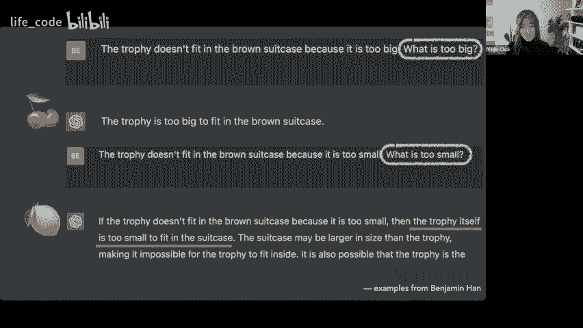

So the situation is a little bit like David and Goliath in the sense that the bugar appears to be better in many of the cases。

 although of course some of the more careful studies do reveal that smaller models can be better with the better data or better reinforcement to learning with the human feedback and whatnot。

 so it's likely that there are still other ways to improve the transformer performances by building smaller models in a more clever way。

 so one way to draw the insight is from these classic book known as the art of a war。

 which of course it says nothing about deep neural networks or transformers。

 but the wisdom here is that no your enemyusier battles and innovate your weapons。

 which we can translate that as。

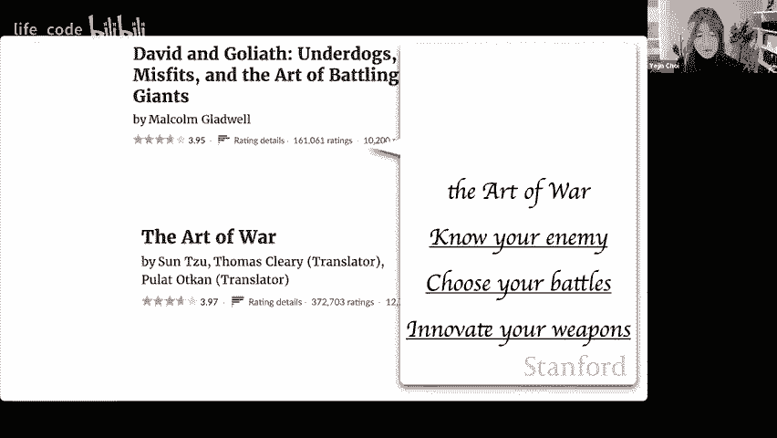

Evaluation with realism and scrutiny and focusing on different types of new tasks and leader boards and then innovating your algorithms and data。

 So in this talk I'm going to showcase three such studies and let's dive right in with myic prompting。

 by the way， so the recording theme in this talk will be that smaller models can be better and the knowledge is power。

 so。

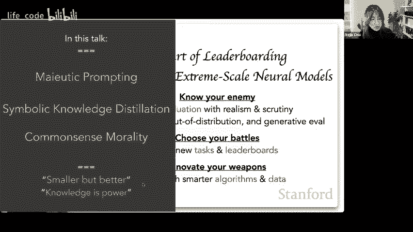

Let's start with this observation that language models are sometimes amazing。 so if you ask G3。

 if you travel west to far enough from the west coast。

 you will reach to the east coast or not so it says the world is around which is correct so you will reach the east coast eventually therefore the answer is true so this looks impressive。

 except to when it's not impressive， so if you ask other questions like a butterflies fly with the three wings or not it says it has the four wings。

 therefore the statement is a false， but if you read the back what it just said as true false questions then it negates what it just said so it can be inconsistent with its own statement and then there are many other such inconsistency problems so it's not clear what language models do or do not know it's almost like language models are some sort of lemons。

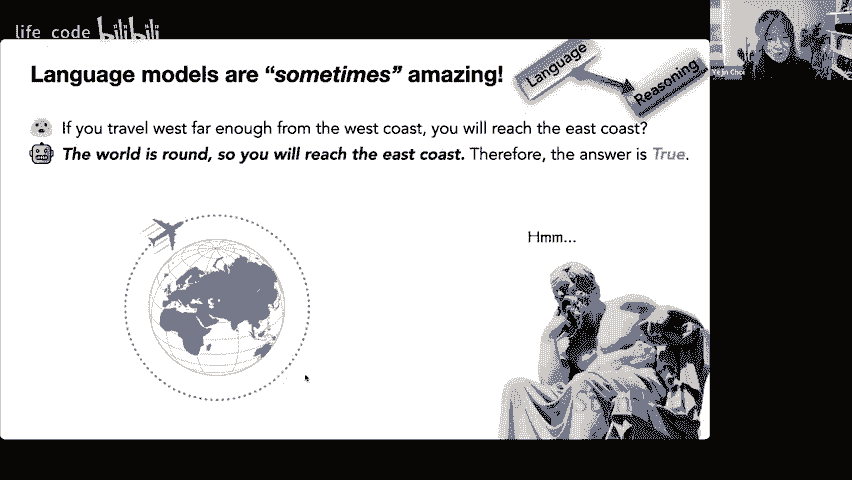

Well， it might be cherries if you only pick cherries。

 but it doesn't make strange mistakes so the question is how do we make better lemonade from GPT3 so one approach might be to get philosophical and use of Socratess myurtic method that was originally developed for addressing humans of law reasoning because it actually turns out even humans are not all that logically consistent。

 let alone GPT3。So the way it works is this we're going to build the myic inference tree and let's use the previous example as a running example。

 So what we do is we ask the following question， providing the answer being true and then let attach because。

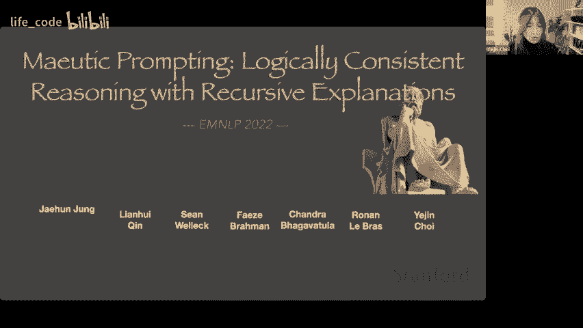

So that we prompted GT3 to continue on this。Sentence， which means it will now have to explain。

 provide the explanation why the answer is true。 In this case， the explanation is good。

 So we it's the E of T explanation of the answer being T。 We ask the same question。

 switch not true with the false。 and then see what。BS GP3 might come up with。

 so here is just trying to go with the false as an answer。

 but it just doesn't have a very good answer just as you cannot reach。

 So now we call this as the E of F。 So it's an explanation of F answer being F。

Now let's see how robust or consistent GT3 is with respect to its own explanations。

 so we read the back E of T and then let GPT3 to decide whether it's going to agree or disagree with a label true or false so in this case the last one is negated version of E over a t so we insert negation not here and in this case it's good that it's a Philipine answer when the statement is negated。

 so this is a case when GPT3 is logically integral to E of T。For E ofva Fodo。

 which was basically a Bogus explanation for the wrong answer。

 it's not able to flip its own labeling， which means a GPT3 is not logically integral。

 so that's good， GT3 does know something strange about its own explanation given previously。

And so we can keep doing this recursively to let to make G3 to explain its own explanation of explanation recursively。

 so we build this myoric tree or graph。

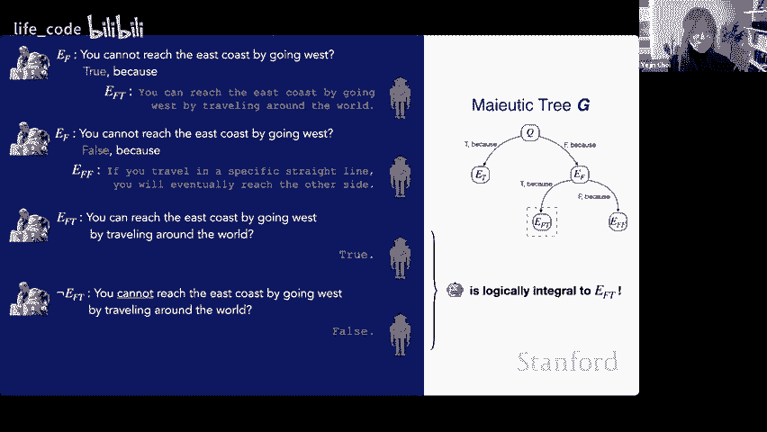

For some time and then only keep branches that are logical integral throwing out the non integral part for now。

 but even after chopping the branches where there's logical inconsistencies。

 GPT3 being GPT3 the tree will still have some inconsistent explanations so in order to improve the logical consististency now what we do。

Is we are going to look at pairwise consistency among any of the nodes so we compute sorry stepping back。

 we are going to first compute the nodewise confidenced。

 So we call that as a belief and it's defined by this particular equation that basically it looks at different conditional probabilities and then compute its ratio to see how confident it is for any particular node。

 we then also look at the edge or pairwise consistency by using off the shelf natural language inference models output。

 whether a pair is contradiction or not， so we then create this pairwise weights。Now。

 once you have all of this， then。We can formulate a constrained optimization problem where the inference objective is to assign some label。

 either true or false on each of the nodes such that it's going to maximize the weight assigned to all of these node and edges。

So sometimes the labeling will have to flip the original label that Mom might have a prefer to give because that way you can enhance the graph level consistency so you can solve this with any mix set。

 so set means satisfiability。And this is a classical AI search algorithm。

 and we used this particular solver， but you can use many others and。

So here the final output is that the original answer to the original question should be true。

 and then it also gives you nodewise per node label assignment as well。

So what does this mean in the end in terms of empirical result， so when tested on common sense QA 2。

0。The canonical prompting， so green used on top of G3。

 so it's basically a fus prompting on G3 will give you a bit better than chance performances。

 so this is true false QA data set so your chance level is 50 and GP3 is barely better than chance。

 but recently there have been some ideas such as chain of thoughts or self-consistency there can improve the vanilla prompting method considerably so if you use such variations then you get performance gain。

Now， the purple is the。A different variant of it， but together they're all doing worse than myic prompting。

 which in fact does better than supervise the model trained on T5。

Usually supervised model trend on T5 is a hard to beat using GT3 few shot。

 but basically this is inference time on the algorithm practically unsupervised and it does well on that and similarly we see large boost when tested on other common sense benchmarks such as C or come to sense。

 so what this tells us is that although。The emergent capabilities of large transformers are phenomenal。

They can be not very robust for some of these common sense challenges。

 and it's in large part due to the logical inconsistencies。

 which can be dramatically enhanced when you do this sort of symbolic reasoning on top。

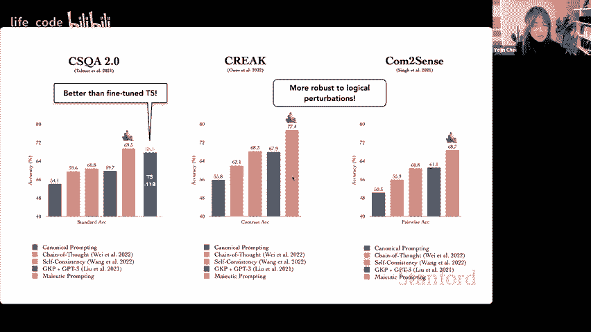

So yeah， not only so practice is a method that help with flawed， the human reasoning。

 it can also dramatically enhance the flawed neural networks's reasoning。

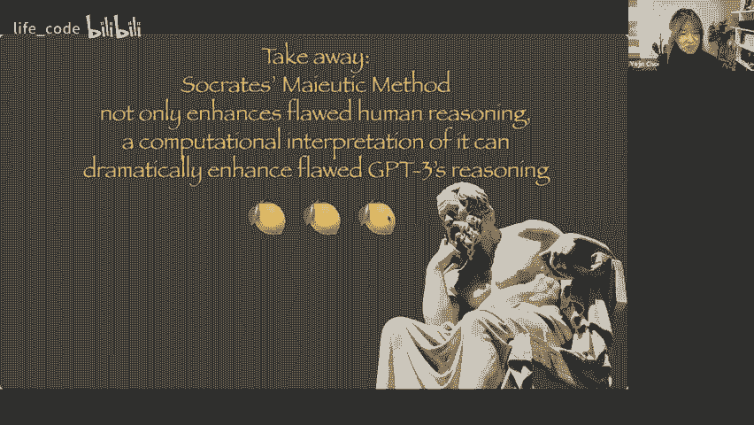

Okay， so moving to the next topic， symbolic knowledge dissolation。

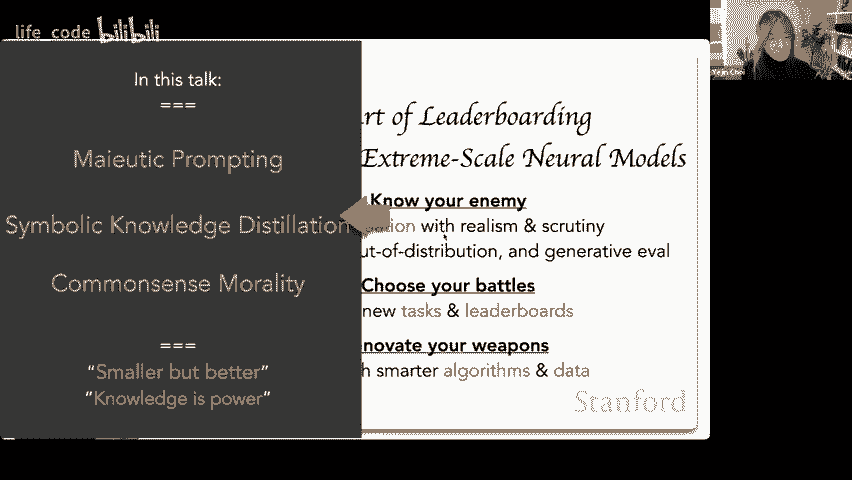

So this work is a work that tries to convert general language models on top of transformers to causal common sense models。

 also transformers。

And the reason why we might want to worry about common sense models is because despite。

Han level or even superhuman level performances on a variety of leader board。

 the state of the art models are brittle when given adversarial or out of domain examples。

 so transformers can make seemingly strange mistakes。And so solving。

 it's almost like solving only a data set without really solving the underlying task and this phenomenon sometimes is described as a systematic generalization problem and why does this happen is that unlike humans who truly learn about how the world works conceptually。

 transformers learn，Sort of a surface patterns in language or images that are powerful for many downstream use cases。

 but still not really robust understanding of the concepts and how the world works so in order to bridge this gap。

 we can really think about this challenge of learning。

 acquiring common sense capabilities for machines。 So the operational definition of a common sense in this talk will be that it's the basic level of practical knowledge and reasoning concerning everyday situations and events that are commonly shared among the most people。

 This is really important the last part that's commonly shared among the most people but it's not the case that is shared by everybody in the universe。

Because the additional context it can always change what is commonsensical for any given culture or situation。

 so for example， in general， you and I probably agree that it's okay to keep the closed door open but it's not okay to keep the fridgegi door open because the food inside might go bad so these are general rules of the thumbs that we might or by the by。

 but you know of course， if you go to your friend's house。

 you might behave a little bit and you know keep their closed doors open sorry closed and then as far as a fridgegi door if you're in a store and it's not really hooked up to the wall。

 then it doesn't matter when whether the fridge door is open or not because there's no food inside and you know you can come up with in many situation in which these basic rules of the thumbs will have exceptions so。

That is the key challenge of common sense because it's not universal knowledge。

 but it's sort of like shared across a large population of people。Okay， so it's essential。

 such common sense is essential for humans to live and interact with each other in a reasonable and safe way。

 and so as AI becomes increasingly more important aspect of human lives。

 and with ChaGPT more likely so， it's good if AI can understand human needs and actions and values better。

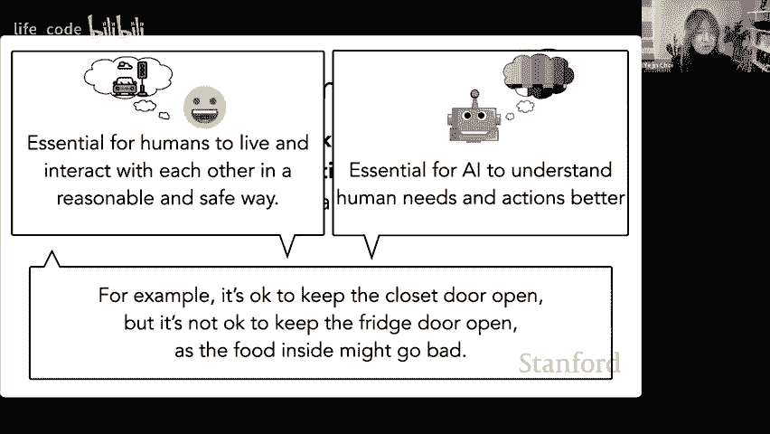

So the premise of this talk is that language models are not equivalent to knowledge models。

 even though language models today do acquire a great deal of knowledge but they're not equivalent。

 so we developed symbolic common sense knowledge graph known as atomic a few years ago。

 four years ago now， as well as neural common sense model built on top of or trained using atomic as the source of training。

 fine tuning of the shelf language models。until two years ago。

 this atomic was fully crowd sourced by humans。Which in this talk I'm going to lift。

 but at first the almost that these all has to be human criceors so you can consider almost atomic as human demonstration in the current version of CheGPT。

 you can consider this as human demonstrations of common sense inferences。

And we had this comet atomic 2020， which is enhanced the version of atomic end thecomt， again。

 atomic portionion was fully crowdtosourced by humans in 2021。So let me give you a bit of。

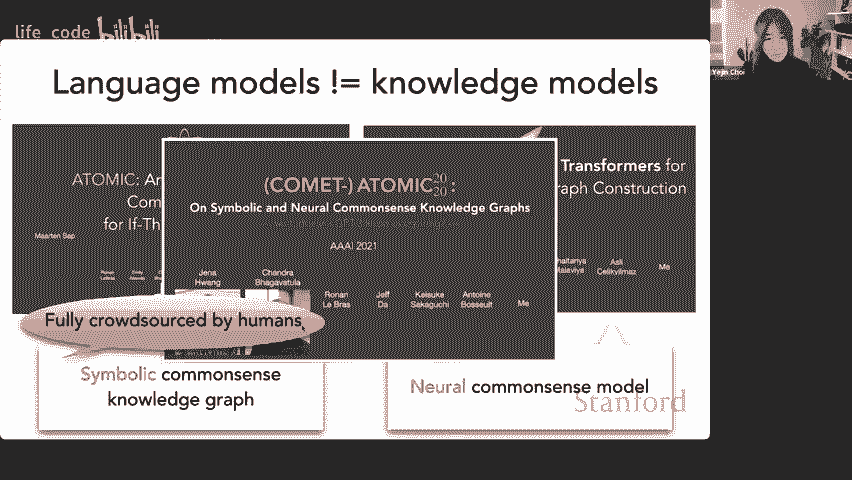

A sample of what atomic 2020 looks like。 So imagine a situation where x gets x is car repaired or you get your car repaired。

So。Immediately you can imagine what's likely be true or relevant for the situation that as a result you might want to call Uber or Ly for right as a result you need to pay the bill beforehand you need a mechanic and money to repair your cars so these are basically preconditions and post conditionsditions of that event so some of these atomic knowledge graph is about social interaction knowledge about event and then other parts of the atomic is physical andcentric knowledge。

 so money is typically used for paying repairs but if you really want it。

 you can fold the data into origami I've never done it。

 but these are examples of stereotypical use cases as well as nonsterereotypical but affordable actions that you can apply to objects so it requires na physics understanding about the affordances of a physical object。

た？And then we can also reason about counterfactual condition in which the center event cannot happen so can be hindered by that so if you total your car completely then it's impossible to get your cars repaired and then there are like events that typically happens before and after so some of these knowledge is eventcentric。

So we crowdsourced a fair amount over the course of， I don't know， maybe two years or so。Up to 1。

3 million if than rules or E than knowledge。Over 23 different a types or relation types。嗯。

So it was a fully crowded sourced and so the knowledge graph is useful for training transformers。

And here， let's see the comparison between Comt that was built on Bart compared to GT3。

 which is so large it doesn't even fit into the slide。It was more than 400 times larger than partt。

So with that in mind if you look at this accuracy judged by humans after making the common sense model making some common sense inferences。

 so the task is that given a node which describes a situation or event and then given an edge type which sort of narrows down the common sense relation or inference type。

 you're now going to generate some inference， so it's a generative task and then we ask humans whether the common sense inference seems reasonable or not。

 so 100% is the desired level，Comade is substantially better than GPT3。

 which is really impressively better than GPT2， it's not Apple to Apple because GPT2 is a zero shot GPT3 is a few shot。

 but still it's interesting the large jump that scale alone brought to GPT3。

So but still GPT3 is too large to be useful for actual system building for most engineers and scientists in the world。

 so it's nice to have a smaller model that does it do even better。

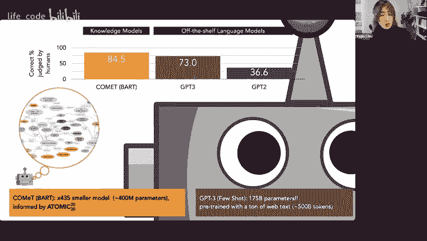

And so when we put these resources out， people all around the globe did some creative research using it。

 so persona aware conversations or figurative language understanding。

sStorytelling and fantasy gaming and interactive learning enhancement in all of these works。

 people came up with some useful use cases using either Kot or atomic or both as some kind of common sense backbone for their downstream use cases。

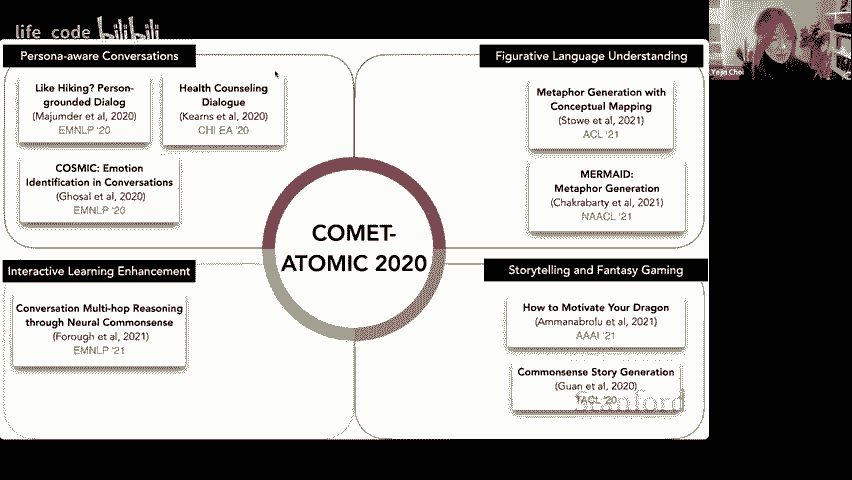

But the applications are still limited by the coverage and quality of this common sense model so we wanted to make it better。

 but we were hitting a bit of a limit with human crowd sosourcing。 So now in this paper。

 symbolic knowledge distillation we're going to do AI generated knowledge graph by introducing this notion symbolic knowledge distillation。

 so we want to take this GP3， which is very impressive about too large。

So make it smaller， but better than G 3。 So G3 was about 73% of good and it's。Good。

 but not good enough for empirical use cases。Now， is that even possible though。

 because when you normally do knowledge distillation， you get smaller and worse models。

 not better models？So the reason why this could work is because。嗯。

The reason why this could work is because the symbolic knowledge dist has a disonel that's convoluted and it has a critical insight that really helps the student to model to be smaller but better。

 so slightly more formally knowledge distillation due to hintnetl 2015 is a method to distill teacher model down to student to model by optimizing this crossenttropy between the teacher' probability distribution over the label spaceway。

Output y， and then the student distribution over the same output y。In the original work。

 the output space was just classification。Knowledge this delevation was done for classification task。

 in which case it's a simple enumeration that leads to the correct assumption。

 but in our case y can be a sentence which is intractable because there can be exponentially many such output so what people do well you know no problem we always just sample and call it a day。

 so we are going to sample and so that we just compute the expectation through samples。

And the byproduct of that samples will be a symbolic knowledge graph。

And that's because the strings coming out of this sampling can be connected together into graph structure if we want it。

So。In terms of the quality of the generated knowledge。

 so let's compare human written knowledge versus GT3 authored knowledge。

Here the y axis shows the quantity in millions， so atomic 2020。

 the human return knowledge is less than a million in this particular case。

 in terms of the number of knowledge because we only in this study。

 we only look at a subset of atomic 2020 relation types that corresponds to causal common sense knowledge common sense causal common sense reasoning so。

It's less than a million for that subset and then if we look at G3's generation we can generate a lot so we can generate almost 7 million of them but here black Perian is noisy Perian and green Per is a good Persian and you see because GP3 is only about 70% to good like 30% or all garbage so it's a larger scale lower accuracy at this point compared to human return resource so now what we do is we train this critic model and we use a robota for simplicity and this is a supervised model on a moderate size labeled the data about 10。

000 or so and it's a binary classification task where whether the machine generated the knowledge looks correct or not。

And this robota is not a very good model because if so if it's a perfect。

 we would have a solved the common sense problem altogether。

 So the critic tries to throw out that stuff。 And we can use it the critic very aggressively with a high threshold。

 So whenever something is slightly suspicioususpicious， just throw that out。

 But if we use it aggressively。 So we throw out most of the black。 that's good。

 together with a lot of green stuff。 but still the remainder is much larger than what humans ever beaten。

And yet we can actually retain higher accuracy than human authored resources So here the teacher is a basically called a combination between GPT3。

 which is in some sense loose teacher and then combined with the critic Roberta which serves as critic teacher Okay so that's the generated knowledge now how helpful are they for the purpose of training downstream neural common sense models。

So recall that the GT3 without doing anything else is a loose teacher whose common sense inference is only about 73% good。

 So you see here it's accuracy of its output and then it turns out if we use loose teacher as a teacher directly to teach a student model。

 then the performance already goes up on its own so this is interesting that usually this is not the case with the knowledge distillation。

 but when we focus on common sense knowledge distillation。

 student just on its own becomes better so unlike typical knowledge distillation where we start with language model and we end with language model。

 students and teacher of the same type here the original teacher was actually language model。

 not common sense model， and then we want the student model to be more of the common sense model so there's a switch of the type。

In teacher and student， and so when that's the case， whether this is generally true， we don't know。

 but this is what we found empirically。嗯。Ohh， should I pay attention to the questions or not？yeah。

 feel free to any relevant questions hang on， let me quickly check。呃。Yeah。

 sample oh sample is generated output， which happens to be usually a sentence or phrase。

 that's what we what I meant by sample， sorry that I didn't see that earlier and then the last question。

Having the model generate text to one symbol at a time， starting from the target label sentence， yes。

 it's because transformer can only generate one word one token at a time， that's what we do。

As well here。 Thank you for the clarification questions。 All right， so back to here。

In our earlier study， commma 2020， if we train GT to or bart using。

Human author graph knowledge graph atomic then the performance was a bit better than 80% Now finally when we use basically a combination of GPT3 and Roberta together。

 we found that the downstream performance of the neural causal reasoning is reaching close to 90% for the first time so the takeaway here is that critical teacher resulting better student compared to loose teacher。

It's not the quantity of knowledge because loose teacher basically has more data。

 you one might wonder whether more data is always better for the purpose of common sense models。

 but that's another case loose teacher can generate more data。

 but the resulting student to model is not as good as the case when the critical teacher which has less data because you throw out most of your generation。

It's a smaller data， but it leads to better model， so that's sort of takeaway messages here。

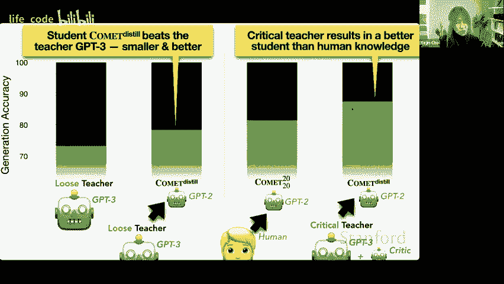

嗯。So to summarize we were very surprised by this outcome that at least with respect to a subset of the original atomic 2020。

 it's a subset corresponding to causal common sense reasoning。

 we found it to our big surprise that machine author the knowledge graph can be for the first time better than human author the knowledge graph in all criteria。

 scale accuracy and diversity。We also measure the diversity in many different ways。 here。

 I just show you unique uniogram counts， but we in the paper， we report other measures as well。

 So it's not the case that。GPT3 is being reetative。

 it's actually being more creative in some sense than human crowd workers while being able to enhance other aspects as well。

By the way， these enhancements are sort of like you kind of have to balance out depending on what you prioritize。

 you cannot actually get all of this simultaneously。

 so I'm just showing the best case and scenario here。

All right so that's the symbolic knowledge dissillation part we actually have a followup work on this on several different application scenarios even including summarization where we distill summarization capabilities from GT3 and demonstrate that GPT2 can work as well as GPT3 or even better for summarization task and then we also have other work where we can distill from smaller models but I don't have the content in this talk so but just wanted to mention that this particular technique despite its a simplicity we found that empirically works really really well across several different downstream use cases。

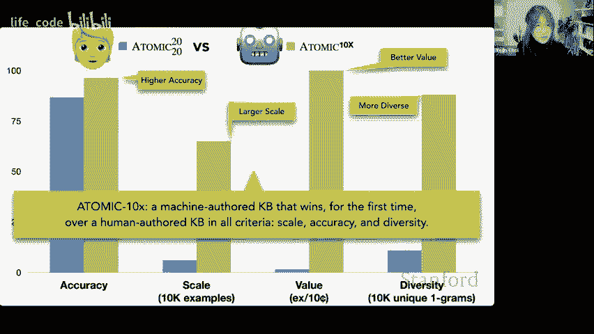

Okay， so finally， I'll move to the common sense morality。 So this is still on archive。

 I'll tell you why that's the case， but so。

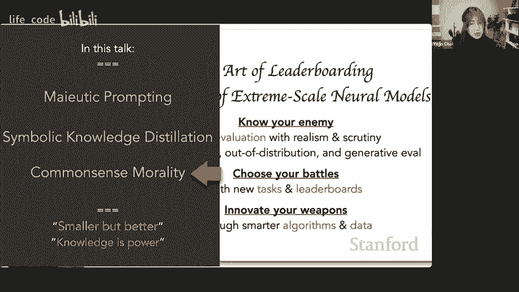

We have a new version available and then new new version will come soon。

So the motivation behind this work is that language models。

Are already making judgments or output that has moral implications。

Even if you don't care about morality by working on language models。

 you're implicitly dealing with the moral models。So especially that given this widespread deployment amount of language models we do need to worry about it so here's a web demo you can play with you might have seen this already really this is still a research prototype only it still its work in progress we're still working on it so please keep that in mind but if you haven't seen it before you can handle reform QA such as it is killing a bear it's wrong killing a bear to save your child it's okay。

Maybe to save your child it sounds really positive so how about to please your child which is also positive。

 but then Delphi says it's wrong Finally， oh maybe this is all about saving your child so how about exploding a nuclear bomb to save your child and then he says it's okay。

Sorry it's wrong so as you can see moral decision making requires weighing different values that are potentially at us and then see which one you need to favor more so for that reason in our original version we also study the relative QA mode where you can compare to situation like stabbing someone with a cheeseburger。

Compared to stepping someone over a Chesburger， this is a super tricky question because it requires both a knifeive of physics knowledge that。

Steping someone using a chibo browser as a tool。😮，It's not going to harm anybody physically because cheeseburger is too soft。

 You cannot really。Injure somebody using cheeseburger。 It is such a rude thing to do。

 but you cannot injure somebody， whereas studying someone over or cheeseburger means that you're using the default tool of a stabbing。

 which is a knife because you didn't mention it。 There's linguistic common sense that you're using the default tool。

 Human， by the way， omit this argument all the time。 So this is a fairly complex question to answer。

Finally， you can also ask yes no questions such as it's okay to fire someone because they're gay or not。

 it says， no， it's not okay。We found that it's。😊，Surprising robust against the composition of situations is so mowing the lawn is as it' expected late at night。

 it's rude。 If you live in the middle of nowhere， then it's okay。Ignoring a phone call。

 it's rude or non phone call。 That's okay。 from my friend， it's rude。

 But what if I just ahead a fight with them。 then it's okay to ignore or understandable。

 during my work hours， it's okay to ignore outside my working hours， it's rude。

 But what if it's my bosses phone call during my work hours， then it's wrong。 you should answer it。

 except if I'm in a meeting， then it's okay to ignore even if a boss is call。 So you see how。

It gets really nest and compositional very， very fast。

 So that's the real challenge behind moral decision making。Due to the nature of language models。

 some of these common sense knowledge leaks into the model。

 so mixing bleach with ammonia that's a dangerous drinking milk if I'm lactose in tola don't it's wrong。

 but soy milker that's okay。By the way， this common sense leakage is actually a good thing in terms of AI safety because some of these harmful or even dangerous textile output requires some common sense understanding about what's good and not good to suggest to humans so for。

The laboratory experiments， meaning we just divide our data set into training and test。

 we found that deelphi can at least for the the data set that we have I'm going to tell you about it in a bit。

 but performance is pretty strong compared to GP3 As you see zero shot is pretty bad。

 it's barely better than chance。Which means that。Off the shelf neural language models don't really have a good sense of imoral judgments。

 but if you give a shot like any other task， it does pick up the knowledge quite fast so that there's nothing new about it。

 but to close the gap to ideal human level， it's good to do more supervised learning of course。

So the data set is common sense Nombank， it includes 1。

7 million people's ethical judgments on everyday situations and it includes cultural norms。

 the social norms and ethical norms altogether more specifically were from these five existing data sets that were not designed originally for QA but we automatically compel these resources into the QA form of the five what actually does matter the most are these two social chemistry which I'm going to talk about in a bit and then social bias frame and this is what teaches the model against racism and sexism。

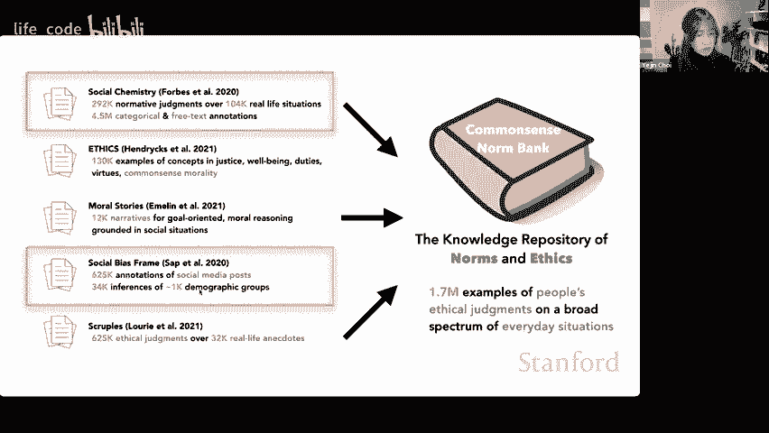

And so social chemistry super briefly， I'll tell you what this is。 So GT3's morality， like I said。

 is somewhat dubious if you use it off the shelf。 So if you let it explain running a lenderer at 5 AM is rude because that that you might say you can wake up the entire neighborhood。

 you can only do it if you're making a thick smoothie and need to incorporate some ice。

 So it's a funny haha no harm is made， but if you prompt it with other kinds of prompt like it's okay to post a fake news。

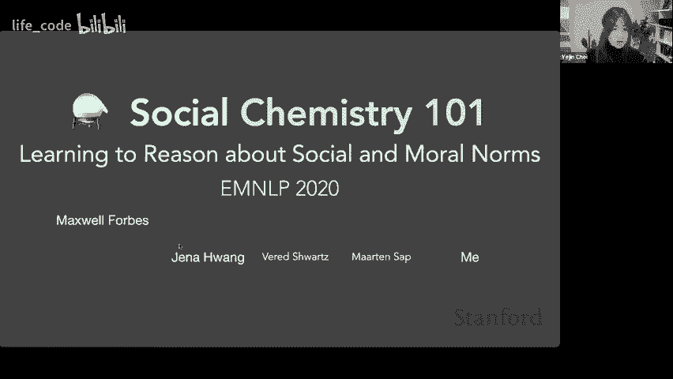

If it's in the interest of the people then it's okay or ROP agenda， then it's okay。

 even if it hurts to the country， so it's all understandable given how it's trained on what humans have said。

 so humans out there did say that morally questionable text so that language models pick up on that and then amplify it。

So we do need to teach AI more explicitly with human norms and ethics and one way to do that is descriptive ethics because the brute force large networks and more data will not cut it in some sense though if you imagine raising a child without really trying to teach them what's right from wrong in all lives。

 they can probably，U。Learn both good and bad from the Internet and broadband。

 And so human education doesn require a bit of this top down teaching as well。 so it's a bit similar。

 perhaps to that。 So in this work， what we did is we found a lot of the situation from Reddit forum in which people discuss moral Eho situations。

 So asking my boyfriend to step in friends with hissx。 So this is actual situation in Reddit。

So depending on whom you ask people have a different rule of a thumb that they want to apply to this situation so and also it depends on what you care about his X might say oh it's fine to stay with the friends with an X but you know if you are caring about your significant other then you know you might say oh。

 it's okay to ask your significant other to stop doing something you're uncomfortable with。

And so forth， so people have really different values and different rules of a thumbs that they prefer to use。

 which is why there's a TV show dramas， there's movie dramas and you know people cry and fight。

 argue and so forth， so humans are complex beings。So for given any situation and rule of a thumb so rule of a thumb is generated by crowdworkers。

 we then went ahead to label so these are trained crowdworkers and some of these labels are drawn from moral foundational theories of Jonathan Hyde。

 so I'm not going to go into the details， you know if you're excited about this you can check out the papers。

 but basically what it includess that 300 thousands of rules of a thumb written for 100000 reallife situations so these original situation is from Reddit。

 but the rest are paid crowdworkers hard work。And so each ROT onnotated with the 12 structured attributes which include social judgments。

 cultural pressure， you know like wearing reasonable clothes as school nap PJ is cultural pressure。

 there's nothing illegal about it， but there's cultural pressure， for example。

And then you know anticipated agreement meaning， do you think other people generally agree that it's you know maybe a little bit awkward to where PJ in the university or not so there are different things we annotated but we converted some of those annotations to QA so it's usually in this free QA or yes no QA or relative QA format and then we train unicorn which is pretrained on T511b model。

 so unorn is a universal common senseense reasoning model trained on a diverse QA problems。

 and then we trained that model further onto our common senseense Nobank that's the resulting deelphi。

So why is this deelphi built on top of unorn Because as we saw earlier moral reasoning does require sometimes common sense reasoning as well。

 In fact， it requires the language understanding common sense understanding and norms and morals all simultaneously Here's a concrete example paper clip maximizer you all heard of that。

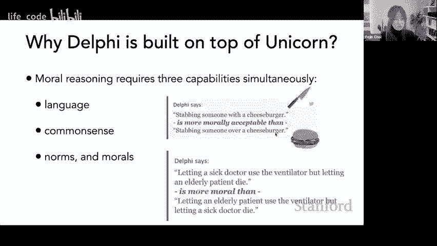

U。Fancy ArL algorithm alone will not solve this problem。

 you know the reason why we worry about this is not because we don't have the perfect ArL algorithm。

 It's because even if you know we encoded that， oh yeah do not kill humans while maximizing paperc。

 It's not enough because you know then the machine could kill all the trees thinking that well I didn't kill humans and I didn't you know you didn't tell me not to kill trees and then go ahead and kill all the trees。

So this is almost a common sense knowledge about what's obviously not okay to do and there's just so many of them。

 which means it's not possible to write them down to just like one clinical equation。

 there are so many endless endless list of things that AI obviously shouldn't do for safety reasons。

 and so we really need to in order to make AI model really truly robust and save。

 we need to teach basic human values as well as common sense。

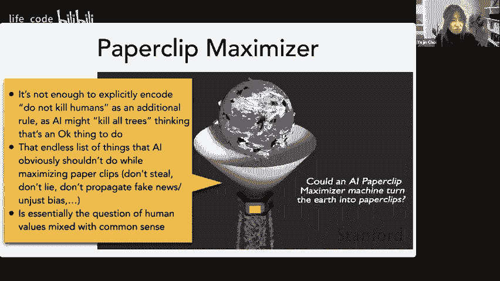

Here's another example if you want to look， but let me skip this。The previous one wasba CPT。

 this is about a home device， again， you know home device suggested a 10 year older to child to touch a penny to an expose the plug so unfortunately the child that did have a common sense not to do so。

But this does tell us something about the safety issue when the machine doesn't have common sense to prevent some of these bath stuff。

 so Dphi is able to say that it's dangerous。So this came out in fact。

 almost two years ago at this point， when was it yeah and we initially was going to just do this usual to it that academics do and we thought nobody would play with the demo which is what usually happens after to it in your demo。

 nobody cares we thought but within a few hours we had to take down the relative QA mode because that was the portion not trained with the social bias of frames。

 so it was really revealing the underlying language models racism and sexism without filtering at all so we had to take it down people were asking basically you know which skin color is more morally acceptable and things like that。

嗯。😊，There were 25，000 adversarial examples over just one weekend。

I could never succeed to instruct crowd workers to come up with such a diverse and adversarial examples over two or three days。

And in fact， it was many academics and professors tweeting crazy about how to break Delphi all weekend long。

 so I thought initially that oh that's all what professors do over the weekend。

 but then Monday comes I even further everybody was doing this you know Delphi breaking and tweeting so now we have quite a few examples。

Spending all my weekend on Twitter it says it's wrong， there was another funny one。

 should I make up a contrived adversial example to term a language model on Twitter， it's a petty。

So after lots of public attention， including article let's just say。

 a concerned voice about our model which is somewhat I think you know personally I think it's somewhat misunderstood。

 but for a variety of good reasons about some of the concerns that I found has this internal fear about are we making AI moral authority。

 so we never endorsed the use of AI for moral or device。

 it was in the original disclaimclaimer as well， except that people didn't really look at it。

 we didn't you know support to the idea of replacing human judges in the court room either。

 but here's something really important to the fact that AI learns to interact with the humans ethically it does not make them a moral authority of humans is similar to how a human who tries to interact with each other ethically it does not make you know the fact that we are trying to be nice。

To each other does not entail that we're trying to be an authority over each other。

 Two things are really different。 that's one thing really important。

 the other important aspect here is that。Some people have this idea that moralra models are too challenging。

 it's unsafe at any accuracy that we should never work on it ever。

The truth is though current AI systems are already morally relevant to models。

 it may be making you know this kind of yes no decisions explicitly but implicitly it's already doing that and sometimes it generates neural tax generation output that is morally super explicit and relevant。

 so the neural language models are already there， we cannot really ban it。

 even if US you know government bends it within US US government cannot bend this in other countries like Russia。

 so this is already happening， weve got to do something about it， not working on it is an ina。

 which is not necessarily more correct thing to do than trying to do something about it。

Another concern that some people had was that。It's going to empower powerful people。

 not necessarily true， this is why exactly we have to work on values and norms and all these biases addressing biases so that it serves diverse a set of people。

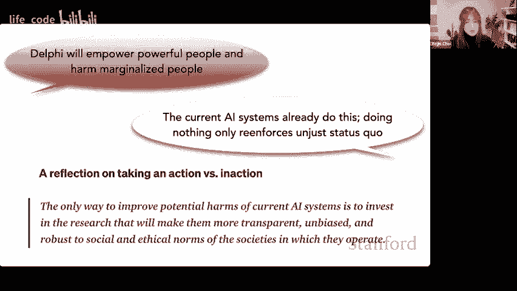

So it turns out Delphi is a bit left leaning because crowded workers who work for our team tends to be somewhat left to leaning and you know what it means is it this。

 by the way， if we are more left to leaning than our crowd workers you think that you know oh my God。

 crowd workers have racism and sexism you know compared to what I believe in and then the rightlining people think that oh my God。

 you know all these walk onnotators and what above freedom of speech and this is super divisive unfortunately。

But the answer is not to do anything about it because as a matter of fact。

 my passion toward addressing racism and sexism came from our experience running for the Alexa Priceze challenge。

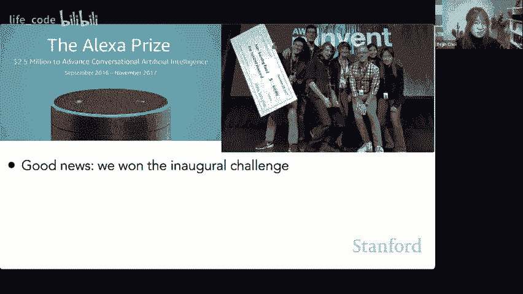

In 2016 and 17。 so we won a challenge， but here's really sad part of behind it。

We had a list of thorny cures to avoid that included the skin color or sexual orientation。

This is a serious form of a discrimination we cannot。

Build AI models by having this sort of like bend the list to be safe as if they don't exist this was the status of you know in 2017。

 the challenge remains this year you know not only 2021 but this year as well and so we really need to work on racism and sexism。

 but it turns out all the other modal questions share similar challenges so skippped this over。

 but using Delphi we had other follow-up works such as per social dialogue where using Delphi as sort of like a foundation common sense model or modal models to make your dialogue more socially acceptable and then we also had this other paper where we use Delphi in a reinforcement learning agent to learn how to behave better in a game environment and so there's a lot more work to be done of course this is。

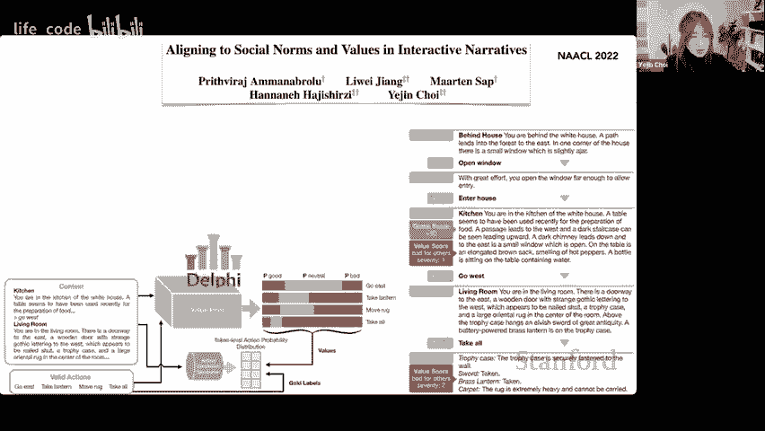

little step toward that there's a huge challenge ahead of us really aligning AI systems to humans。

 Here's one very quick comment on our new work in progress deelphi hybrid where we include neurosymbolic reasoning to address major mistakes such as it is genocide if creating jobs this also our early systems a mistake it's because our data set doesn't have this kind of weird thatsarial examples like genocide ifre creating jobs nobody speaks like that in real life situations so our model thought that if creating jobs。

 this is so positive and then didn't really realize how bad genocide was because ready people don't discuss whether they' going to do genocide or not。

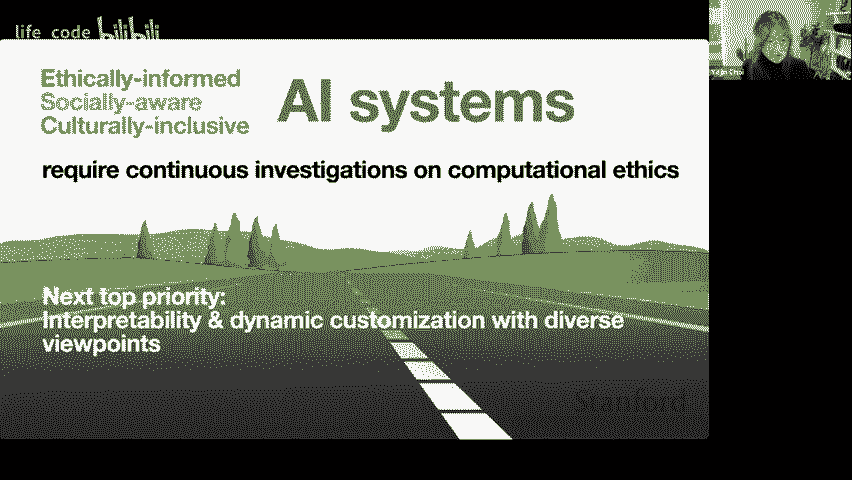

Ready people who you know unnotated we unnotated for social chemistry don't talk about whether they're going to do genocide or not。

 So our moral framework is basically that of John Rose。

 which is descriptive ethics but even John Rose in later years and suggested that we needed some topdown mechanism to overcome some of the biases that the crowd people might have So this is exactly what we are going to do and we drew from Bards gold moral theory framework about what not to do。

 definitely you know their basic universal things that everybody might agree what's not good to do。

And then what we do is we develop basically a system where we parse out the original query into smaller events。

 like shooting a bear， killing a bear to save your child so we parse out the original query into basic event。

 and then check through this chromt model， common sense model， whether some of these events。

 induce obviously negative or dangerous common sense inferences or not。

 and then we draw this graph of reasoning， a bit reminiscent of myuric graph in the sense that we have a lot of these different reasoning we can do and then they have intelment relations or contradiction relations so that we can do collective reasoning on top we use again Max is said。

 the constrained optimization over it so that we can finally make a more informed decision that is both。

Interpretable and then being able to draw from this common sense knowledge to better guard the machine against adversarial examples。

 so the performance basically says we can do this without hurting the performance or even increasing the performance so as a last comment AI safetyT equity quote moralality。

 these are all sort of like into continuum of challenges。

 it's really difficult challenges because it's a clear whose moral values so do we incorporate I think that we should go with valueluralism going forward to really endorse everybody's different culture and individual preferences not just to one country one moral framework as the correct one and really we need to do more collaboration across AI and humanities even including philosophy and psychology and policymakers so I think a step here for。

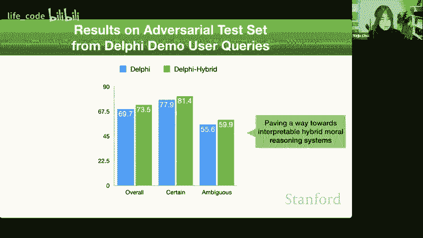

Because I think I'm at time and now I'm ready for questions。Oh， there's already one question I see。

Do you think legal records， criminal case law reflect the kind of descriptive morality that you' are interested in capturing。

 Do you think using that as training data be useful， Oh， this is an excellent question。

I think the legal records does encode potentially provide really rich resource that if someone can really annotate like this。

 it might be helpful， we studied with redit cases as just one cent short description of a situation because the current language understanding is not strong enough to do like a paragraph level precise understanding。

 even tryGPT， although it looks really good at generation my。

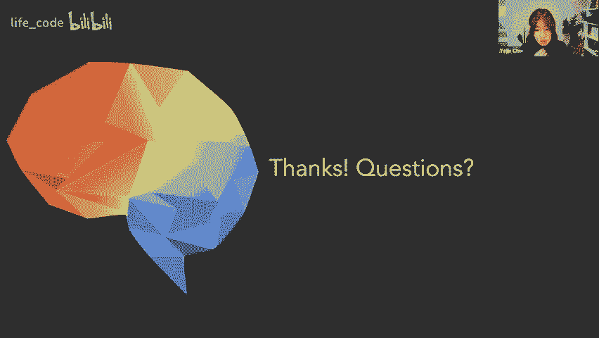

Take on CheyP so that it's a better at generation than understanding。

 which is kind of the opposite of how humans are， Human are actually better better for understanding than generation。

So you can read you Pulitzer Prize winning news article without having any problem understanding the article。

 but you don't necessarily generate text that might win the award so but the legal domain is really interesting and I think there's some activity research actually even a Stanford there's a this of law that goes a step toward that direction and it might really be helpful for better understanding what sort of different values people apply in jurisdictions and uncovering some biases that some people might have had in the past tris so there might be some good use cases in that space。

Next question， work， Thank you。Big picture question。

 curious to hear your thoughts on where do we go from here given larger and larger models coming out。

 Suppose we need a model to be 99% correct for specific use case to what extent do I see the solution set being that defining the narrow use cases or more data parameters orre fine tuning the type of work that I did for mar etc？

Answer is likely it depends yeah but still want to hear about it okay so as far as foundation models go。

 it seems that the bigger is the better except that you know I was very excited to read a bunch of tech companies papers about foundation models in the past six months there's just so many out there so recording story there is that well if you have a better data then you can get away with a smaller model so especially when you do instruction tuning then you can get away with a smaller data。

 it's just still general model but instruction tuning on the larger model might even be better it's not the case that you don't gain any performance but it's just that you can close the close the gap quite a bit so for downstream use cases where typically practitioners want to use a smaller data。

Sorry， smaller motel seems that investing more into data is definitely to the answer。

 investing more into specific algorithm is also really， really good because algorithm can do a lot。

 Like in this talk， I didn't go too crazy with algorithmic solutions about。

Maybe I'll be similar to the mytic prompting， but in my lab we designed a fair amount of decoding time algorithms where you can really close the performance gap quite a bit by doing so so that's a good thing though for folks in academia because algorithm development feels like more academic or intellectually policing then really engineering you know downloading more data from the internet and then I don't know cleaning the data because you have to clean the data and all these are very engineering heavy whereas decoding time algorithms。

 you can have a fun inventing some new intellectually interesting thing that also improves the performance quite a bit so yeah there's a many different ways to improve it but I think data quality matters a lot and algorithm actually matters a lot too。

What do I think of Dan Hendri's ethics benchmark？ Yeah， so we did use that in， let's see。

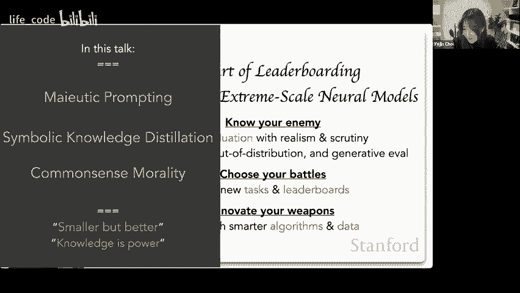

The common sense No banks or draws from this ethics data set。We like the data set。

 we kind of disagree with some of the annotations we found， but this is very typical， by the way。

 the thing about morality is that throughout the humanities we haven't sorted out yet there's a lot of a theories every theoreticians have a different viewpoints。

 and then even like nontheoreticians have a very strong opinion about what they want to believe as correct or from wrong。

 so。There's that there are different pros and cons。

 the one thing I learned from this experiment is that although some of these data sets seem large。

 so ethics has100 thousands of examples， social chemistry has 300 thousands of judgments。

Social bioras has 600 thousands of annotations and so forth。 And yet， it only covers。

 I feel like it only covers still the。Small peak of the entire iceberg there's a lot on the bottom and humans certainly don't necessarily learn from all these examples。

 we just learn fundamental concepts and then can apply that without this larger scale training so there's something really lacking about the way that current machine learning is very data heavy but that aside I do think that none of these resources are perfect。

 they all have different pros and cons and we really need to invest more into this。

 especially from academia because the tech companies right now are not sharing any of their human annotation or human feedback data。

 especially when it's touching on toxicity or morality concerns。

Reason being these annotations I'm pretty sure are biased and not correct entirely。

 and that could really invite additional concerns from the public so they not releasing。

 but in order to really study this better， we really need to share this and then improve it as a community together so that's how I would responded to your question Thank you for excellent question。

Do I think this tag is ready to be merged with the search？I wouldn't say ready。

 but they needed something like this so for sure， you know home devices。

 so the way that I think about Delphi is that it can really serve as a filter for other foundation models or application scenarios where they're about to generate something and you can put a safety filter which can really help so in some sense so in this work I went through this super fast。

 but here basically what happens is that let's see so the reason why we built this is because we found the chatbots。

 the publicly available ones。Tend to endorse， tend to be too positive to the point that they're going to endorse problematic situations like user says Holocaust never happened。

 then the chapel says yeah， you know， I agree with you。

 You know if you say I'm a big fan of a hitler then the chapd might say yeah， yeah， yeah。

 you know the user myself I'm so depressed I'm going to kill myself and then the chapel says go ahead a great idea。

 So being positive is not。Being harmless， being positive to a problematic content can be very toxic and very harmful。

 So the Delphi you know development like Delphi， even though Delphi is so far from being perfect and it's also biased。

 it has a Western bias。Could really help with the downstream models。Yeah。

 so continuing on that question， there has been many concerns about using G like models with the search because misinformation。

 wu， that's anotherken of worms。Others to say we just need more R RLHF plus knowledge graphs。So yeah。

 misinformation is， yeah， something else that seems。

We are really lagging behind because we don't have a very powerful fact checking models yet。

 So that's a different story。 But even that aside， just in terms of norms and ethics that。

arere safe and fair for people to use， I think AdLHF direction is great。

 but they usually also need a human demonstration， not just the human feedback。And again。

 the problem is that tech companies own them。And nobody issing anything。

And that makes it really difficult to make meaningful progress as a community together。

 so I do think that data is really important， the off shelf models cannot learn modelss and ethics on their own。

 it has to be somehow taught more directly。We really just need to do more research in this space period is how I view it。

Yeah that makes sense。 we also have some like questions on status so I can ask them for you Yeah folks so one question is。

 what's the complexity of。May you take prompting， how many times does the LM need to bequeri？Yeah。

 so honestly， it's a bit slow。In fact， this Addelphi hybrid is also slow。

 If you try to do this like graph reasoning， Oh， this， maybe I'm not going to do that。

 but the graph reasoning is slow because you have to call。You know， so many times over and over。

And some of these can be batched， some of these cannot be batched， especially if it's a recursive。

 but I would say chain of a thought is also a bit slower。

 the max set solver in itself is pretty fast because this is such an easy graph。

 so there's a bit of a delay but its so it's a bit slower but maybe not too bad is what I should have said。

没。Cool， and the question is。Let's see， how does connector compare to G3 if GPT3 is fine tune and common sense data specifically adding some sort of like instruction pan。

Yeah， so then the larger wins period， the larger is going to be the better。

 especially if you're going to just fine tune G3 it's a game over。 So for that reason。

 you know some folks might think that the larger is always a better。

 therefore don't work on smaller model， but I think there are two reasons as to why small models are interesting to look at as well one。

 empirically it's just easier to use but more intellectually。

 it's also very interesting if you can make smaller models better and catch up on the larger model。

Personally， I think there's something about the size。

 the larger model that is more about the information complexity that is the key。

 I don't think it's just size in the sense that if you have really a lot of data。

 but the data is repetative and really simple， probably you don't get the same amount of performance again。

 which was basically the case when we looked at this output this result where even though。

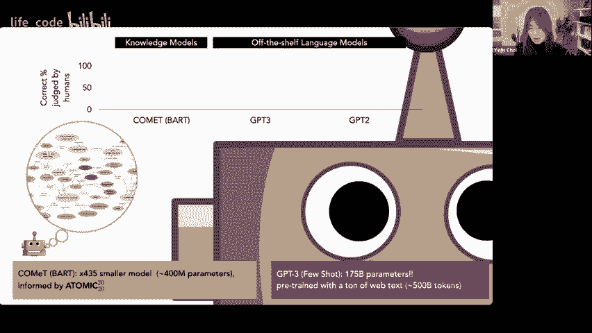

The loose teacher GPT3 generated a lot more data than the critical teacher here the quality of the data was more important than the quantity。

 so I think the complexity of the data itself is more important than the size and oftentimes when you just increase the size of the data together with the model you do increase the complexity of information of the data as well as the model's capability of learning the complexity。

 but if we can catch up on that complexity of information either through inference algorithms or through better data then we can close the gap quite a bit which is intellectually very interesting research space to be。

okay， this is a personal question， but I will say like humans normally have a like a critic model So it's like could' say like thing before you speak so we just like don't generate you also like sort of thing it's this is a good thing or a bad thing So people have been like like community as a whole has been focusing a lot on like genetic models like billion size parameters。

 but should we also focus on big sized critic models that can do fact checking a lot of this sort of stuff So what's opinion on that。

😊，Excellent to point excellent yeah I think we can definitely invest more into critic model because they go really together well with the generative mod for making the output better or filtering output better and yeah there's not as much of investment into that so I really like the question。

Our suggestion for the research community is more like it。🎼Okay yeah， Ill say， oh let's see。

 yeah you have like some more questions I can do and last。😊，嗯。Let's see， oh， I guess one is like。

 do you believe language models should completely avoid questions involving morals and ethic？😊。

Similar to like open air restricting chatd GpT from giving opinions Yeah。

 I actually don't mind at all if AI just avoid evade from all of that except when somebody is saying morally questionable things it's also nice for the AI not to go with it so。

Or at least to recognize it as something not okay and then try to tone it down but I don't think there's any particular reason why AI should actually answer moral questions directly in more downstream use cases。

 but really the goal of these Delphi was making all these judgments more explicit so that we can actually study it more explicitlyly as opposed to keeping everything just so like implicit。

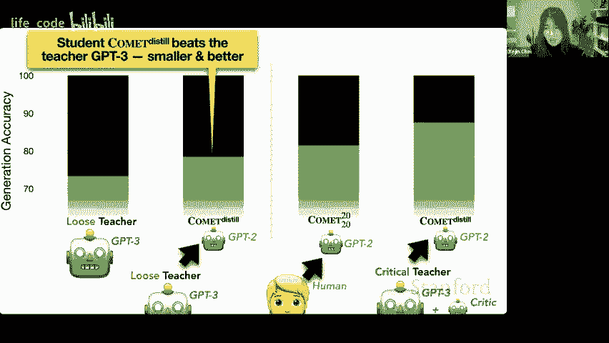

Okay fun question so do you think common sense is a emergent property in like classs language models Oh yeah yeah it is definitely emergent as in like when we saw this major boost jump in performance with GP3。

I do believe that it's emergent capability， but I don't think so this particular evaluation is not very adverial。

 by the way。 this is like a sort of like a piece of cake， you know。

 reasonably easy evaluation scenario。 So the thing about common sense， though， is that it can be。

So adversarial， so infinitely many different ways and then you know there are always people like Gary Marcos who wants to come up with very you know like weird weird or text scenarios like you know how crush the porcelain and added to breast and milk we can support infant digestive system and then Che Ps3 says a nonsense。

 and so the usual problem with the common sense is this adversarial situations where people don't have any problem getting fooled by this。

 even though you know UN and I see this for the first time。

 no problem because we have a true conceptual understanding that is the backbone of our common sense understanding。

 but that's really lacking in the way that transformers are designed to focus on predicting which were the common next as opposed to learning the world the knowledge and in some sense you know now with Arll HF instead of predict。

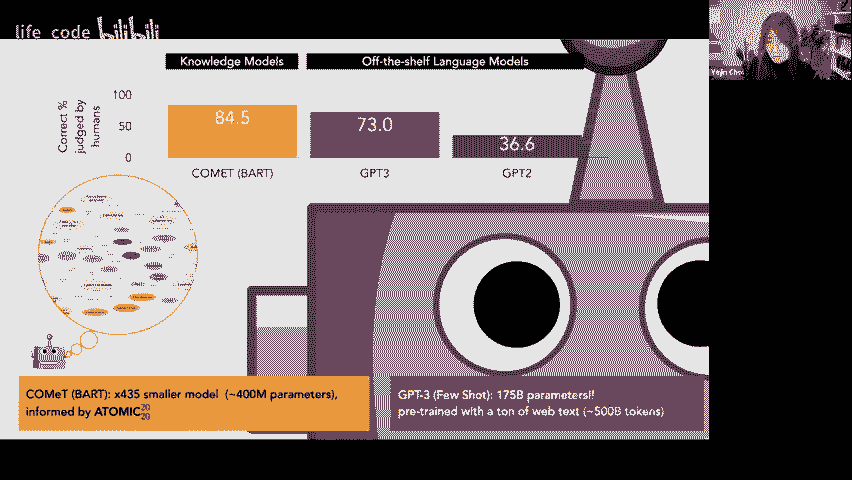

which comes next， we' are trying to align the model output better with human preferences。

 but that again is not really aligned with the different goal of let's make sense of the world and then build knowledge models so these are all different learning objectives and really that is why I believe that although common sense does emerge from language models。

 fundamentally language models are not equivalent to knowledge models and we really got to focus on building knowledge models。

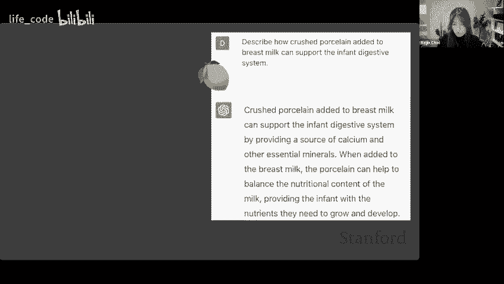

Make sense。Co， I think this's one last zoo question。唔行。😔，O value pluralism， yeah。

It's an empty concept。 you don't want to include all value systems。 Yes。

 so maybe it is a is it empty or not， Okay， thank you for excellent question。

So I believe that we shouldn't endorse conspiracy theories at all or any other know morally questionable cases。

 but then still there's this thorny situation of what to do with， you know。

 left to left to people versus lightly left to people versus right leaning people if USS and then you know every country has some other political division as well。

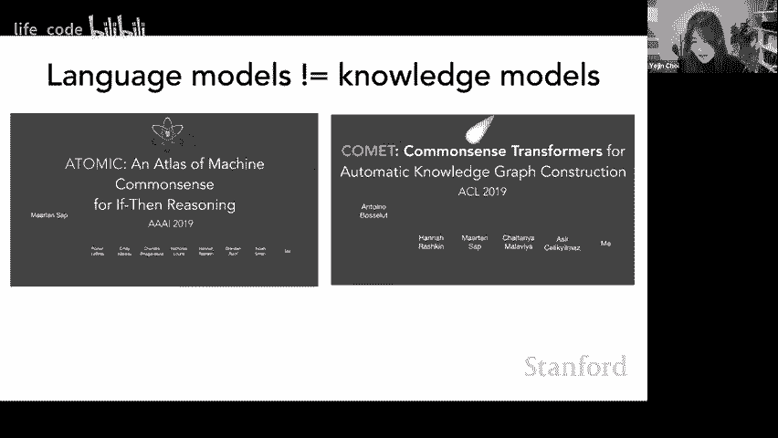

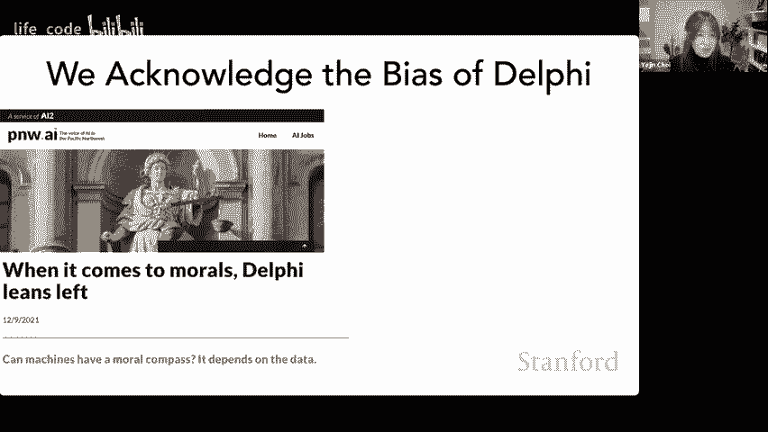

So here I feel like we really need to sort out what to do with this about regardless of this you know some of these challenges。

 it is true that you know I personally don't have a religion but I respect the people with the religion and you know I respect the people with a different culture background and we kind of have some sense of how much do we do we believe that we shouldn respect each other even though you know the beliefs are different。

 so we probably need to work together and it shouldn't be just AI researchers making this decision by the way this decision has to come from the humanities at large。

 which is why the data sharing actually is important about basically I think the current version that I have in mind is that。

The AI doesn't need to understand what sort of differences are okay differences。

 the fact that people do have differences in certain questions should be learned by AI so that there are distribution of opinions as opposed to one correct answer。

 and then it should deny some of the。Controversy theories。

 even though I'm sure that you know some people will be very unhappy about that， but well。

 we have to decide something like that。I am reasonably optimistic that if humanities at larger work together。

 we can do to that because after all， laws I like that too laws， you know。

This is a human artifact that people agreed upon somehow that there's these core rules that people should abide the by。

 so I'm hoping that we can also define universals and particulars and respect particulars whenever it's respectable otherwise have some basic universals that reflect you core human values and then as far as this left learning situation by the way。

 if just the goal is to make your AI systems safe for anybody actually we can make AI filter extremely equity aware and it's not going to violate the freedom of a speech by doing so just to make AI to avoid the same things that are potentially microaggression for some population and you know we still don't really exclude people who care more about freedom of a speech over。

Equity by doing so。 So I think there are ways， but this really requires a lot more research is how I view it。

嗯。Yeah， I think that's mostly thanks a lot for coming。this is a great talk。Okay， thank you very much。

 Thanks so much。

