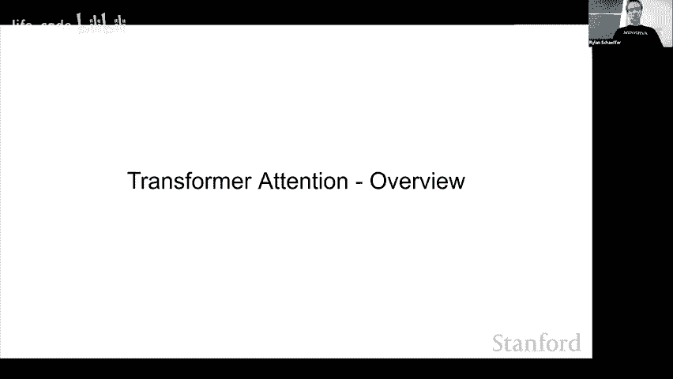
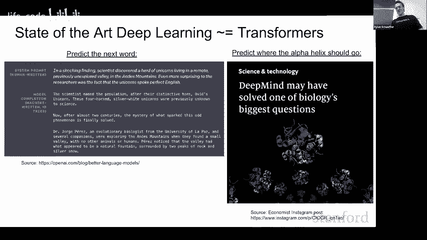
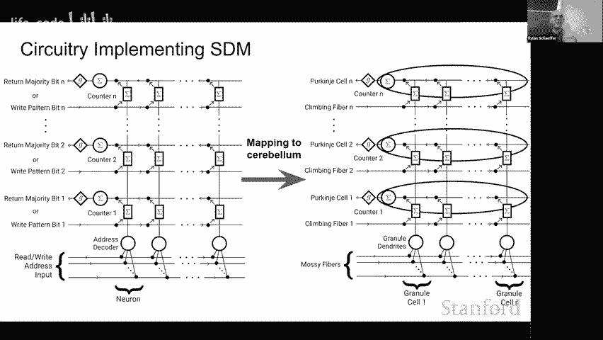
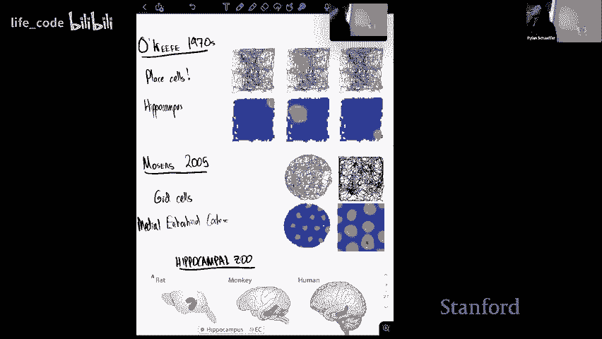

# 斯坦福 GPT／Transformer 原理介绍 (中英文双字幕) - P18：18.UnitedNeuroscience-Inspired Artificial Intelligence - life_code - BV1X84y1Q7wV

Hu， it's fun to be here。So the work I'm presenting today。

 title of it is attentiontention Appimate Sports Distribut Memory。

 and this was done in collaboration with Drrens Peavvan and my PhD advisor， Gabriel Kma。

So why should you care about this work we show that the heuristic attention operation can be implemented with simple properties of highdimenional vectors in a biologically plausible fashion。

 so the transformer and attention as you know are incredibly powerful but they were heuristically developed and the softmax operation and attention is particularly important but also heuristic and so we show that the intersection of hyperspheres that is used in sports student memory closely approximates the softmax and attention more broadly both in theory and with some experiments on train transformers so you can see SCM is supposed to read memory as preempting attention by approximately 30 years who developed back in 1988 and what's exciting about this is that it meets a high bar for biological plausibility hopefully I have time to actually get into the wiring of the cerebollum and how you can map each operation to part of the circuit there。

So first I'm going to give you an overview of Sprse distributedive memory。

 then I have a transformer attention summary， but I assume that you guys already know all of that。

 we can like get there and then decide how deep we want to go into it。

 I'll then talk about how actually attention approximates STM interpret the transformer more broadly and then hopefully there's time to go into STM's biological possibility。

Also I'm going to like keep everything high level visual intuition and then go into the math。

 but stop me and please ask questions literally whatever okay。

 so sp distributed memory is motivated by the question of how the brain can read and write memories in order to later retrieve the correct one and some considerations that it takes into account or high memory capacity。

 robustness to query noise， biological possibility and some notion of fault tolerance。

SDM is unique from other associated memory models that you may be familiar with like hop field networks ins so much as is it's sparse so it operates in a very highdiional vector space and the neurons that exist in this space only occupy a very small portion of possible locations it's also distributed so all read and write operations apply to all nearby neurons it is actually as a side note hot field networks if you're familiar with them are a special case of sparse distributed memory I'm not going to go deep into that now but I have a blog post on it okay so first we're going to look at the right operation for sparse distributed memory we're in this high dimensionional binary vector space we're using cannon distance as our metric for now we'll move to continue with later and we have this green pattern which is represented by the solid and the hollow circles are the hypothetical neuro。

Also think of everything like quite abstractly and then we'll map the biology later so this pattern has a red radius。

 which is some heming distance， it activates all of the neurons within that heming distance。

And then it here I just note that each of those neurons are now storing that green pattern and the green pattern has disappeared。

 so I'm keeping track of this location with this kind of fuzzy hollowicle that'll be relevant later。

So we're writing in another pattern， this orange one。

And note here that neurons can store multiple patterns inside of them and formally this is actually a superposition versus a summation of these highmenal vectors because they' highmennstrulo you don't have that crosswalk so you can get away with that。

 but for now you you may just think that it like as a neuron can store multiple patterns。嗯。Finally。

 we have a third pattern， it's blue one， we're writing in in another location。And yeah， so again。

 you can we're keeping track of the original pattern locations and they can be。

 but they can be triangulated from the nearby neurons that are storing them。

And so we've written in three patterns now we want to read from the system so I this pink star eye。

 it appears it has given it's represented by a given vector which has a bit of location of space it activates neuro neuro again。

 but now the neurons output the patterns that they stored previously and so you can see that based upon dis location it's getting four blue patterns two orange and one green and it then does a majority little operation where it updates towards whatever pattern it's seen from so in this case because blue is actually a majority it's just been to update completely towards blue again I'll formalize this more in a bit but this is really to give you intuition for the core operations of SCM。

So the key thing to relate this back to attention is actually to abstract away the neurons that are operating under the hood and just consider these circle intersection and so what each of these intersections between the pink lead circle and each of the right circle means is the intersection is the neurons that both store that pattern and was written in and are now being read from by the query。

And the size of that intersection corresponds to how many patterns the query is then going to read。

And so formally， we define the number of neurons in this circle intersection as the coinality between number of neurons in pattern。

 number of neurons in query and their intersection。Okay。

 are there any questions like at a high level before I get more into the math？

I don't know if I can check is it easy for me to check zoom na sorry zoom people i'm not going to check okay is randomly distributed yes yeah yeah and there's later there's more recent work that they can learn and update their location tile manifold but in this you can assume that they're randomly initialized binary high dimensional vectors okay so this is the full SDM update role I'm going to break it down。

So the first thing that you do so this is this is for reading to be clear so you've already written patterns into your neurons so the first thing you do is you weight each pattern by the size of its circle intersection so。

The circle intersection there for each pattern。Then you sum over all of the patterns。😡。

That have been written into this space， so you're just doing a weighted summation of them。

And then there's this normalization by the total number of intersections that you have。And finally。

 because at least for now we're working in this binary space， you map back to binary。

 just seeing if the values are greater than a half。

Okay， i'm how familiar are people with attention I looked at like the previous talks you had they seem quite high level like can you guys write the attention equation for me is that like。

Can I get thumbs up if you can do that？Yeah okay i'm not like i'll go through this but i'll probably go through it faster than otherwise so when I first made this presentation like this was the state of the art for transformers which is like Al and so it's kind of funny like how far things have come now I don't need to tell you that transformers are important。

So。Yeah I'm going to work with this example well well okay I'm going to work with this example here the cat sat on the blank and so we're in this setting we're predicting the next token which the word math and so there are kind of four things that the attention operation is doing the first one up here is it's ex generatingrating whatre called keys values and queries and again I'll get over the map in a second I'm just trying to keep it high level first and then we're going to compare our query with each of the keys so the word the which is closest to the word we're next predicting is is our query and we're seeing how similar it is each of the key vectors。

We then， based upon that similarity， do this softmax normalization so that all of the attention weights sum to one。

 and then we sum together their value vectors to use to propagate to like the next layer or uses our prediction。

And so at a high level you can think of this as like the query word the is looking for nouns and their associated verbs and so hypothetically it has a high similarity with words like cat and sat or their keys so this then gives large weight to the cat and sat value vectors which get moved to the next part of the network and the cat value vector hypothetically contains a superposition of other animals like mice and maybe words that rhyme with mat and so and the sat vector also contains things that are sat on including mat and so what you actually get from the value vectors of paying attention to cat and sat are like three times mat plus one times mouse plus one times sofa this is again like a totally hypothetical example but I'm trying to make the point that you can extract from your value vectors things useful for predicting the next token by paying attention。

So specific keys。嗯。对。So and I guess yeah another thing here is like what you pay attention to some cat and sat might be different from what you're actually extracting you're paying attention to your keys but you're getting your value vectors out Okay。

 so here is the full attention equation the top line I'm separating out the projector matrices W subscript you pay a Q and the second when I just collapse them into like the new OAC and。

Yeah so breaking this apart the first step here is we compare we do a dot product between our query vector and our keys this should actually be a small human capital and so yeah we're doing this dot product between them to see get a notion of similarity we then apply the Somax operation which is an exponential over sum of exponentials the way to think of the Som is it just makes large values larger and this will be important for the relation to SE and so I'll spend a minute on it at the top here I have like some hyper items index from zero to nine and then the like values for each of items in the second row I just do like a normal normalization of them and so the top item goes to 30% value but if I instead do a Somax and it depends on a beta co definition and the Somax but the value becomes 0。

6 so it。Your distributions peak here is kind of one way of thinking of it and this is useful for attention because you only want to pay attention to the most important things or the things that are nearby and kind of ignore stuff further away。

And so once we've applied our softm， we then。Just do a weighted summation of our value vector。

Which actually get extracted and propagate to the next layer。嗯。Okay， so here's the。The full equation。

 I went through that a little bit quickly I'm happy to answer questions on it。

 but I think half of you do it， half of you don't。Okay。

So how does transformer attention approximate Sprse distributed memory。

 this 30 year old thing that I've said is biologically plausible。So yeah。

A like accept that likely so I'm going to get to that at the end yeah。

 attention is also like in the sense of all attention not was。😊。

I think the attention equation I'm showing here was developed。

 I mean attention to all you need was the highlight， but Benjiio has a paper from 2015。

Where it was actually first written in this way。Correct me if I'm wrong， but I'm pretty sure yeah。

 I mean， I guess like this particular one that's why I was asking the question because like no。

 it's a good question like you show that like two。Different methods that could be classified as like attention proposals right are like the same than like himself shoulder。

One of them that like。Yes， exactly so I'll show that SDM has really nice mappings to a circuit a cebolumm at the neuronal level and then theres right now it's this link to attention and I guess you make a good point that there are other attention mechanisms this is the one that has been dominant but I don't think that's just a coincidence like there's been a bunch of computed your Somax is expensive and there's been a bunch of work like the Lformer etc cea et cea that tries to get rid of the Somax operation and it's just done really badly like there's a bunch of jokes on Twitter now that it's like a black hole for people that like try and get rid of Somax and you can't and so it seems like this and like other versions of a transformers just don't scale as well in the same way and so there's something important about this particular attention equation。

But like then goes the other way， right， which is like， if this is really important。

 then like SDM is like actually like miss。U。So the thing that I think is important is that you have this exponential weighting。

Where you're really paying attention to the things that matter and you're ignoring everything else and that is what SDM approximates there might be equations。

 but the point I was just trying to make there is like the Soax does seem to be important and this equation does seem to be very successful and we haven't come up with better formulations for it。

Yeah no it's a great question okay， so it turns out that sparse distributed memory as you move your query and your pattern away from each other so you pull these circles apart the read and bright circles the number of neurons that are in this intersection and a sufficiently high dimensional space decays approximately exponentially and so on this right plot here I'm pulling apart the X axis is me pulling apart the blue and the pink circles and the y axis is on a log scale the number of neurons that are in the intersection and so to the extent that this is the linear plot on a long scale it's exponential。

And this is for a particular setting where I have my I have 64 dimension meal vectors。

 which is like used in D2， it holds across a lot of different settings。

 particularly higher dimensions， which are now used for bigger transformers。Okay。

 so I have this shorthand for the circle intersection equation and。

What I'll show is how the circle intersection is approximately exponential so we can write it with two constant C sub one and sub of two with the the one outside because you're normalizing softmax is exponential over some exponentials that will cancel the thing that matters the C2 and you can approximate that nicely with the beta coefficient that's used in the softmax。

And so yeah， I guess as well， I'll focus first on the binary original version of SEM。

 but then we also develop a continuous version。Okay， so yeah。

 the two things that you need for this circle intersection and the exponential decay to work are you need to map to attention is you need some notion of continuous space and so you can use this equation here to map hem distances to disretize proine similarity values where the hat server the vectors are L2 normalizations。

And you can then write the circle intersection equation on the left。

As this exponential with these two concepts that you need to learn and then rewrite this by converting C2 and see。

 you can write this as the beta coefficient。Let me get to some plots yeah so you need the correct coefficient but you can fit this with a log linear regression and a closed form。

啊。I want to show a plot here。Yeah okay， so in the blue is our circle intersection for two different he distances both using 64 dimension vectors and the orange is our actual stockax attention operation where we fit the beta coefficient that it will it the hem distance used by attention is equivalent to the hem distance used by SEM and you can see so that the main plot is the normalized weights so just summed up in a divide to one and that I log plots here and you can see that in not loggged space the curves agree quite nicely you can see that for the higher dimensional sorry the larger he distance。

 the log plot you see this drop off here the circle intersection stops being exponential but it turns out this actually isn't a problem because the point at which the drop the exponential incorporates down you're approximately。

20 here and you're basically paying negligible attention to any of those points and so in the regime where the exponential rule matters this approximation holds true。

对对，对刚刚就说这是感觉。Yeah， yeah yeah， no， I just wanted to actually like show up figure to get some inition before yeah。

So all we're doing here is we're just， we're in a binary space with original EM and we're just using this mapping thing to cosine similarity。

And then what you need to do is just have the beta coefficient and then you can view your beta coefficient and attention as determining how PP things are。

 and this relates directly to the he distance of your circles that you're using for Read&W write on Washington。

And so yeah， to like mathematically show this now on this slide I'm not using any tricks。

 I'm just rewriting attention using the SEM notation of patterns and queries。

So this little box down here is doing that nothing。

And this is the money slide where we're updating our query。And on the left。

 we have our attention equation written in SE notation， we expand our subax。

And then the main statement is that this is closely approximated by if we swap out our exponential with the SMM for corner century equation。

Yeah。So and again， the two things that you need for this to work are one， your attention vectors。

 your keys and queries will to be l to normalized slide on hats on them and then。You want。

If you decided given he distance for SEM and I'll get into what he distance are good for different things。

 then you need to have a beta coefficient that relates to it。But again。

 that's just how many things are you trying to pay attention to？So yeah， just as a quick side note。

 you can write SDM using continuous vectors and then not need this mapping to concerned similarity。

And so here I have the plots again， but with this and。I added the。

The orange of the green have flippeds， but I've added the continuesnus across the here too。

And what's nice about the continuous version is you can actually then write Srse distributed memory as a multilayered conceptualron with slightly different assumptions。

 and I'm not going to talk about that now， but this is featured in Spe distributed memory as a continual learner。

 which is was added to the additional readings and' be in sorry this shouldn't say ICML。

 this should say ICl。It's just been accepted to declare for this year。Okay。

 so do train transformers use these beta coefficients that I've said are similar to those for SDI and so。

It shouldn't be surprising that depending on the how distance you set STM as better for certain things。

 for example， you just want to store as many memories as possible and you're assuming that your queries aren't noisy or you're assuming your queries are really noisy so you can't store as much but you can retrieve from a long distance and if attention of the transformers implementing things prior distributed memory。

 we should expect to see that the beta coefficients that the transformer uses correspond to these good instances of SDM and so we have some weak evidence that that's the case。

 so this is the key query normalized variant of attention where you actually learn your beta coefficient。

 normally in transformers you don't but you don't L to longer your vectors and so you can kind of have this like effective beta coefficient so in this case it' just a cleaner instance where we're actually learning beta and this was trend on a number of different translation pass we take the learn beta coefficients across layers across。

And plot as a histogram and the red bloodted line correspond corresponds to three different notions of spark distributed memory that are optimal for different things。

And again， this is weak evidence insomuch as to derive the optimal SM beta coefficients or corresponding handling distances。

 we need to assume random patterns in this high dimension space and like obviously real world data isnt random。

 however it is nice to see one all of the datata coefficients fall within the bound and two they skew towards the max query noise which makes more sense if you're dealing with like complicated real world data where the next data points you see might be out of distribution theyve seen the past。

 the maximum memory capacity variant assumes no very noise at all。

 and so it's like how many things can I pack in assuming that the questions I'm asking the system are perfectly formed。

Okay。Just talking a little bit about transform components more broadly。

So I've mentioned that you can write the feed forward layer as a version of SDM that has like a sort of notion of longer term memory。

嗯。There's also layer norm which is crucial in transformers and it's not quite the same that it can be related to the alTitude normalization that's required by SDM there's also the key query normalization variant that explicitly does this altU normalization and it does get slightly better performance at least on the small test that they did I don't know if this would scale to larger models。

And so I guess this work is interesting in so much as like the biological plaibility which I'm about to get to and then the links to transformers。

 it hasn't to date improved transformer architectures。

 but that doesn't mean that this lens couldn't be used or be useful in some way。Um， so yeah。

 I list a few other way things that STM is related to that could be used to funnel in and actually in the the new work where STM is continual learner。

 we kind of expand the cerebellar circuit， look at components of it。

 particularly inhibitory enter neurons。Implement those in a deep learning model and it then becomes much better at continual learning so that was kind of a fun way of actually using this link to get better bottom line performance。

By。Okay， so a summary of this section is basically just the intersection between two hyperspheres approximates an exponential and this allows FM's read and write operations to approximate attention both in theory and our limited tests and so kind of like big picture research questions that could come out of this is first is the transformer so successful because it's performing some key cognitive operation。

 the cerebellum is a very old brain region used by most organisms including fruit flies maybe even cephalopods through like divergent but now convergent evolution and then given that the transformers been so successful empirically is SDM actually the correct theory for cerebellar function and that's still an open question。

As we learn more and more about the cerebellum there's nothing that yet disproves SDM as working there and I think it's I'll go on a limb and say it's like one of the more compelling theories for how the cerebelin is actually working。

Yeah， and so I think this this work kind of motivates looking at more of these questions。

 both of these questions more seriously。嗯 okay。Do we have time？

Cool so here's the circuit that implements SDM at the bottom we have patterns coming in for either reading or writing。

And I actually， I breakdown down of these slides。Okay， yeah。

 so so first we have patterns that come in and every neuron here。

 these are the dendrites of each neuron。And they're deciding whether or not they're going to fire for the input that comes in。

Then if the neuron does fire and you're writing in that pattern。😡，Then you simultaneously。

 and I'm going to explain let' you here that this is crazy the brain doesn't do this and then I'm going to hopefully trigger you not only need to have the thing that the pattern activates neurons。

 but you need to have a separate line that tells the neuron what to store。

And just like you have this difference between keys and values where they can be different vectors representing different things here you can have a key that comes in and tells the neuron when to activate and the value for one it should actually like soar and then put layer。

This is called a heteroasso mapping。And then once you're reading from the system。

You also have your query come in here， activate neurons。

 and those neurons then output whatever they store and the neurons vector is this a particular column that it's stored and's again as a reminder。

 it stored patterns in superconion and then it will dump whatever it's stored across these output lines。

And then you have this G majority bit operation to convert to a zero one。

 decide if the neuro is going to fire or not。And so。Here is the same circuit。

 but where I overlay cell types and the ce。And so。I'll come back to this slide because most people probably aren't familiar with Sarahbeller circuitry。

It's in water okay， so the way that the cerebellum is pretty homogeneous and it follows this pattern throughout also cl back 70% of all neurons in the brainno and cerebellum they're small so you wouldn't know it but the cerebellum is like very underappreciated and there's abundant evidence that has a closed loop systems with most higher order by processing now a yourcerebellums damage you are more like autism et cetera。

 et cetera， so it does a lot more than just fine motor coordination which a lot of people have like assumed in the past Okay so inputs come in the most fibers here they interface with granular cells this is a major projection where you have tons and tons of granular cells。

Each granial cell has what are called parallel fibers。

 which is these incredibly long and thin aons that branch out in its T structure。And。

Then they're hit by the perkinji cells which will receive up to 100，000 parallel fiber inputs。

 it's the highest connectivity of any on the brain。

 and then the perkinji cell will decide whether or not to fire and send its output downward here。

So that's the whole system where parents come in and ground decide they fire or not and the way that they' then output their own。

You then have a separate right line which is the climbing fiber。

 so the climbing fibers come up and they're pretty amazing in that these connections here you've committed more that is important one that really matters is that they're not very strong enough one that really matters is it goes up and it wraps around individual oring cells。

And the mapping is close to one to one between cl fibers and pukine cells。

 at least a very strong attribute。And so youre connected to us here in the stuff all this line yeah right Oh so there's separate neurons coming from in separate areas particularly go into deep cerebelella nuclei kind of in the core the cerebonelum and that then feeds intous like back to higher order brain regions or like down the muscle muscle movement etc a lot of people will think that the cerebelbonelum is kind of like a fine tuning lookup table where like you've already decided the muscle movement you want to do but the cerebellum will then like do a bunch of adjustment adjustment so it's like much more accurate but it seems like this also applies to like next word prediction like we have FMRI data for this a neuroscienceist one that's made like a dirty little secret of fMRI is that the cerebellum lines up for everything So okay。

Going back to this circuit here then。Yeah， time scales or the operating Act， I mean。

 how long is the information stored and retrieved？Do we have any idea about this like it' just like a couple milliseconds or like there's a information work system so the main theory is that you have updating through。

Time dependent plasticity where you' climbing fiber will either which is' doing the what you want right in will fire either just before or just after your graile cells fire and so that then updates the pro cell sinapses for long-ter progression or potentation so whatever times still that's happening on the climbing fiber makes very large active potentials or it leads to very large amount when solve and so I do think you could get pretty fast synaptic updates and they also persisted for a long time I think so the have can say but like the rest of your life yeah。

是啊。So what's really unique about this circuit is the fact that you have these two orthopogonal inputs where you have the losss fibers bringing information in to decide if the neurons can fire or not。

 but then the totally separate quantum fiber lines that can update specific neurons and what they're storing and will later output and then the protiji cell is so important that's kind of doing this cooling across every single neuro and each neuron remember it's storing the vector this way。

 and so the protiji cell is doing elementwise summation and then deciding whether it fires or not。

 and this allows for you to store your vectors in superposition and then later dennoize them。哦。

This all the theory I see un maps quite well to the Mar and all us theories of solar vlor function。

 which are still quite dominant if anyone months from a there months about even those so they analog the neuron in the SDM and you introduced before and that might kind basically each neuron of thekengeji cell setting of each neuron is a grainno song。

Okay， and then yeah， so the location of the neuron。

 those hollow circles corresponds to the gra cell dendrs here。

Where the patterns that pop in correspond to the activations of modifiers and then the effort postynaptic connections are with the per cell。

 so that's actually what it's storing is in the synaptic connections with the N per cells。

At that interface。And then the prokee cell does the majority bit operation in deciding to loss fire or not。

yeah， I think we're basically into into question time so yeah， thanks a lot。嗯。可可以。嗯啊还有个事。

I don't know anything about that being， but it seems as understood it' very used for a long term now。

And I have curious what's your hypothesis whats system？

What we should be doing for short number delivery。Because it seems that。

So if you have this link transformers。YeahI think long term memory。

 let's go for a short term memory because for me it seems like。

We are doing this in the prompt context right now， but how could we incorporate these to to directly Yeah yeah。

 so this work actually focuses more on the short term memory where it relates to the attention operation but you can rewrite SDM。

 it's almost more natural to interpret it as a multied perceptron。

That does like a softax activation across its or a top pay activation across its neurons it's like a little bit more complicated than that。

 but。Yeah， so。Yeah， the most interesting thing you hear is the fact that like I just have a bunch of neurons。

And in activating nearby neurons in this high mental space， you get this exponential weighting。

 which is the salt mass and then because it's an associatedso memory where like you have keys and values。

 it is attention。And yeah， I guess like the thing I most want to drive home from this is like it's actually surprisingly easy for the brain to implement the attention operation。

 the attention operation， just using high dimensionsional vector and activating your back。

So it's good for a short of and money yes， if you were if you were actually use SEM for attention。

Yeah， so let me go all the way back real quick。 This is important。

 There are kind of two ways of viewing SDM and I don't think you were here for the talk。

 I think I saw you come in a bit later， which is totally fine， but Oh cool cool cool yeah， yeah。

 Okay， so so there are two ways of looking at SDM there's the neuron perspective。

Wwhich is this one here and this is actually what's going on in the very course and so the only thing that is exactly constant is the the。

 the patterns are error， and then there's the pattern based perspective。

 which is actually what attention is doing。And so here you're abstracting away than neurons or assuming you're operating under the hood。

 but what you're actually computing is the distance between the true location of your pattern and the query and there are pros and cons to both of these the pro to this is you get much higher fidelity distance like you know exactly how far the query is some of your original patterns and that's really important when you're deciding what to update towards like you really want to make know like what is closest and what is further away and be able to apply the exponential weighting directly The problem is you need to store all of your pattern limitations in operate and so this is why transformers have like limited context with the other perspective is this long-term memory one where you forget about the patterns and you just look at where you just have your neurons that store a bunch of patterns in them and this way you superposition and so you can't really you can tinyulate what your original pattern was like point and it's all much noisier。

But you can store tons of hundreds and you're not constrained by a context window。

 or you can think of any penalty layer as storing like the entire data set in a noisy superposition of states。

Yeah， hopefully that kind of answers your question。I think there's one here first then yeah。

So I guess my question is like。So I guess like you kind of showing that like being u modern what self attention mechanism on maps on like。

SVM mechanisms that like seems possible and like some look like the modern contemporary theories of like how bringing the down implement SDM。

And I guess my question is like， to what degree has that like been？

Like experimentally verified versus like you were like mentioning earlier that like it might actually be easier to have done as using like an MLP layer in some sense than like onto to these like mechanisms and so like how do experimentalists like actually distinguish with hypothees like for instance like one thing that like I was it entirely clear about is like。

对。Even if like the brain couldn't do attention or like SM like that doesn't actually mean it would because like maybe it can't do back yeah so like how do how does this like get actually tested totally yeah yeah so on the backdrop point。

You wouldn't have to do it here because you have the climbing fibers that can directly like give training signals。

Through your like what they options store so in this case you。

It's like a supervised learning task for the funding cut does it what it wants to write in or like how it should be updated the pretend be cell sees but for your broader point you basically need to do to test this you need to be able to do realtime learning the Drophila mushroom body is basically identical to the ser bone and the fly on the brain data set has done most of the individual neuron connectivity but what you would really want to do is like any vitro realtime super like。

Super super high frames per second calcium imaging and be able to see how synaps has change over time and so for an associative learning task like。

Hear a sound move left hear another sound moved right or smells or whatever present one of those trace like figure out the small subset of neurons that fire which we know it' a small subset so that are with the end distance interpretation see how the science is here update and how the outputs of it corresponding to changes in motor action and then extinguish that number so right in the new one and then watch it watch it go away again and like our cameras are getting fast enough and like our calcium and like voltage indicators are getting to be really good so hopefully in the next like three to five years we can do some of those tests and I think that would be very definitive。

Yeah。Yeah， can we have any other questions， I think there was one more， and then I should。

how you not be mirrorn theM like this final medical biological implementation what the range of your circle that you're mapping around that。

understand thatYeah so I wouldn't get confused with multiheadedness because that's different attention heads all doing their own attention operation it's funny that the cebolum has microphones which you can think of as like separate attention heads in a way I don't want to take that analogy too far and like but but it is it is somewhat interesting so the way you relate this is。

In attention you have your beta coefficient， that is an effective beta coefficient because the vector norms of your keys and queries aren't concerned。

 that corresponds to a heence and here that corresponds to the number of neurons that are on for any given input。

啊。And the heming distance you want， I had the slide before。

 the heming distance you want depends upon what you're actually trying to do and if you're not trying to store that many memories。

 for example， you're going to have a higher heming distance because you can get a higher fidelity calculation for the number of neurons in that noisy intersection。

Yeah。Cool， yeah， thanks a lot。So as it disclaimer。So as a disclaimer before introduce our next speaker。

 the person was scheduled unfortunately had the cad in soul last minute due to faculty interviews。

 so our next speaker has very graciously agreed to present at very last minute but we are very grateful to him so I'd like to introduce everybody to Will so Will is a computational neuroscience machine learning PhD student at the University College of London at their Gatsby unit so I don't know if anybody has heard about the Gatsby unit I'm a bit of a history buff or history nerd depending on how you phrase it the Gatsby unit was actually this incredible powerhouse in the 1990s and 2000s so Hinntton used to be there Zubin Gurimani used to be there he's now in charge of Google research I think they've done a tremendous amount of good work anyways and now I'd like to invite Will to talk about how to build a cognitive map。

Did you want to share your screen okay， can you stand in front of here， let me stop sharing。

Okay。So I'm going to be presenting this work， it's a it's all about how a model that people in the group that I work with。

To study the hippocampal Enino system it completely independently turned out to look a bit like a transformer so that's this paper that i'm going to talk about is describing that link so the paper that builds this link is by these three people James is a postdoc half at Stanford him's a professor at Oxford and in London and Joe's a PhD student in London so。

😊，So this is the problem that this model of the hippocampal enter our system which we'll talk more about is supposed to solve is basically the observation there's a lot of structure in the world and generally we should use it in order to generalize quickly between tasks the kind of thing I mean by that is you know how 2D space works because of your long experience living in the world and so if you start at this greenhouse and step north it's orange one and this red ones then think one because of the structure of 2D space。

😊，You can think to yourself， oh， what will happen if I step left and you know that you'll end up back at the green one because loops of this type clothes in 2D space。

 okay？😡，And this is， you know， perhaps perhaps this is a new city you've just arrived in。

 this is like a zero shop generalization because you somehow realize that the structure applies more broadly and use it in a new context。

😊，Yeah， and there's generally a lot of these kinds of situations where there's structures that like reappear in the world。

 so there can be lots of instances where the same structure will be useful to doing these like zero shot generalizations to predict what you're going to see next。

😊，Okay。And so you may be able to see how we're already going to start mapping this onto some kind of sequence prediction task that feels a bit transform e。

 which is you receive this sequence of like observations and in this case， actions。

 movements in space and your job is given a new action step left here。

 you have to try and predict what we're going to sit so that's that kind of sequence prediction versionly。

😊，And the way we're going to try and solve this is based on factorization。

 it's like you can't go into one environment and just learn from the experiences that one environment。

 you have to separate out the structure and the experiences you're having so that you can reuse the structural part which appears very often in the world。

😊，Okay， and so yeah， separating memories from structure and so you know。

 here's our separation of the two， we have our dude wandering around this like 2D grid world。

And you want to separate out the fact that there's 2D space and it's 2D space that has these rules underlying it。

 and in a particular instance in the environment that you're in。

 you need to be able to recall which objects are at which locations in the environment。Okay。

 so in this case， it's like， oh， this position has an orange house， this position。😊，Greams， sorry。

 orange。Red and pink and so you have to bind those two you have to be like whenever you realize that you're back in this position。

 recall that that is the observation you're going to see there。😡，Okay。

 and so this model that they we're going to build is some model that tries to achieve this。Yeah。

 new starts and so when you enter it imagine you enter a new environment with the same structure。

 you wander around and realize it's the same structure。

 all you have to do is bind the new things that you see to the locations and then you're task up you know you know how the world works。

😊，So this is what neuroscientists mean by a cognitive map is this idea of like separ it out and understanding the structure that you can reuse in new situations。

And yeah， this model that was built in the lab is a model of this process happening of the separation between the two of them and how you use them to do new inferences and this is the bit thats supposed to look like a transform so's the general introduction and then we'll dive into it a little more now。

😊，Make sense though， the broad picture。Good。Silence， I'll assume is good。

So we'll start off with some brain stuff so there's a long stream of evidence from spatial navigation that the brain is doing something like this I mean I think you can probably imagine how you yourself are doing this already when you go to a new city or you're like trying to understand a new task that has some structure you recognized from previously you can see how this is something you're probably doing but spatial navigation is in there in neuroscience which had like a huge stream of discoveries of the last like 50 years and a lot of evidence of the neural basis of this computation so we're going to talk through some of the examples the other of these psychologists like Tllman who were showing that rats in this case can do this kind of path integration structure so the way this work is they got put at a start position here done with RMS and they got trained that this route up here got you reward so this is the maze we had to run around。

😊，Then they were asked they were put in this new the same thing but they blocked off this path that takes us long winding route and given instead a selection of all these arms to go down and they look at which path the rat goes down and the finding is that the rat goes down the one that corresponds to heading off in this direction so the rat has somehow not just learn like you know one option of this is it's like blind memorization of action that I need to take in order to root around instead no it's learning actually that embedding the reward and its understanding of Trudy's face and taking a direct route there even though it's never taken it before there's evidence that rats are doing this as well as us。

And then a series of like neural discoveries about the basis of this。

 so John O'keefe stuck an electrode in the hippocampus。

 which is a brain area we'll talk more about and found these things called place cells so what I'm ploting here is each of these columns is a single neuron and the mouse or I can't remember is running around a square environment the black lines are the path the rodent traces out through time and you put a red dot down every time you see this individual neuron spike and then the bottom plot of this is just a smooth version of that spike brain so that firing rate what you can think of is like the activity of a neuron and neuron network that's the analogy that people you usually drawn and so these ones are called play cells because the neurons that respond in a particular position in space and in theem years this was like huge excitement you know and people mean studying mainly like sensory systems and motor output and suddenly the deep cognitive variable place something you never you don't have a GPS signal but somehow there's this like signal for what looks like position in the brain in very like understandable ways。

😊，The next step in the biggest step I guess in this chain of discovery is the Mosa lab。

 which is a group in Norway， the second lecture in a different area of the brain。

 the media entertoranal cortex， and so this is the hippocampal entertoranal system we're going to be talking about and they found this neuron called a grid cell so again the same plot structure that I'm showing here。

 but instead these neurons respond not in one position of room but in a like a hexagonal lattice of positions in the root。

😊，Okay， so these two， I guess I'm showing to you because they like really motivate the underlying neural basis of this kind of like spatial cognition embedded embodying the structure of this space in some way。

😊，Okay and it's very surprising finding why why are neurons choosing to represent things with this Xmatic is like yeah provoked a lot of research and broadly there's been like many more discoveries in this area so there's place cells that talk to you about grid cells cells that respond based on the location of not yourself but another animal cells that respond when your head is facing a particular direction cells that respond to when particular distance away from an object so like I' am one step south of an object that kind of cell。

😊，Clls that respond to reward positions， cells respond to vectors to boundaries。

 cells that respond to like all sorts， all kinds of structure that this pair of brain structures。

 the hippocampus here， this red area and the entertor anal cortex， this blue area here。

 which is conserved across a lot of species are represented。

There's also finally one finding in this that's fun is they didn't an FMRI experiment on London taxiab drivers and I don't know if you notice。

 but the London taxi cabab drivers they do a thing called the knowledge which is a twoy long test where they have to learn every street in London and the idea is the test goes something like oh there's a traffic jam here and a road work here and I need you to get from like Camden town down to one's worth the quickest way possible what route would you go they have to tell you which route they're going be able to take through all the roads and how they would replan if they found stop there's kind of sense so it's like intense you see them like driving around sometimes learning all of these like routes with a little map they're being made a little bit obsolete by Google Maps but you know luckily they've got them before this experiment was done before that was true and so they've got here is a measure of the size of your hippocampus using FMRI versus how long you've been a taxiab driver in months and the claim is basically the longer you're a taxiab driver the bigger your hippocampus for the more you're having to do this kind of spatial reason。

😊，So that's a big set of evidence that these brain areas are doing something to do with space but there's a lot of evidence that there's something more than that something non-spatial going on in these areas okay and we're going to build these together to make the broader claim about this like underlying structural inference and so I'm going to talk through a couple of those the first one of these is a guy called patient HM this is the most studied patient in like medical history he had epilepsy and cure in epilepsy have to cut out the brain region that's causing these like seizure like events in your brain and in this case the elepsy was coming from the guys hippocampus so the bilaally lesions hipcampus they cut out both this hippocpi and it turned out that this guy then had terrible amnesia he never formed another memory again and he could only recall memories from a long time before the surgery happened。

😊，Okay but so experiments were showed a lot of this stuff about how we understand the neural basis of memory things like he could learn to do motor tasks so somehow the motor tasks are being done for example they gave him some very difficult motor coordination task that people can't generally do a camera with a lot of practice and he got very good at this eventually and was as good at other people I'd learning to do that we had no recollection of ever doing the task so he'd go into do this new task and be like I've never seen this before I've no idea what you're asking me to do and he do it amazing be like so there's some evidence there that the hippocampus is involved in least some parts of memory there which seems a bit separate to this stuff about space that I've been talking to you。

😊，second of these is imagining things so this is actually a paper by Deisa Sabbth who's before he was Deep Minhead with a neuroscientist and here maybe you can't read that I'll read some of these that you're asked to imagine you're lying on a white sandy beach and a beautiful tropical bay and so the control this bottom one says things like it's very hot and the sun is beating down on me the sand underneath underneath me there's almost unbearably hot I can hear the sounds of small wavelelets laughingping on the beach see is gorgeous amarine color you know like so nice lucid descriptional this beauty scene whereas the person with a hippocampal damage saysAs for seeing I can't really apart from just the sky I can hear the sound of seagulls under the sea I can feel the grain of sandre my fingers。

😊，And then like yeah like the struggles are basically really struggles to do this imagine and imagine this scenario。

 some of the things read these is like very surprising。

 so the last of these is this transitive inference task。😊，So terms of inference， A is greater than B。

 B is greater than C， therefore A is greater than C。😊。

And the way they convert this into a rodent experiment is you get given two pots of food that have different smells and your job is to go to the pot of food you learn which pot of food has sorry。

 which pot with the smell has the food。And so these are colored by the two pots by their smell A and B and the rodent has to learn to go to a particular pot in this case the one that smells like A and they do two of these they do A has the food when it's presented in a pair with B and B has the food when it's presented in a pair with C and then they test what does the mouse do when presented with A and C a completely new situation and they say have a hippocampus they'll go for A over C。

 they'll do transitive inference is they don't have one they cut。

And so there's a much more broad set this is like， oh。

 I've shown you how hip campusampus is used for this spatial stuff that people have been excited about。

 but there's also all of this kind of relational stuff， imagining you situation。

 some slightly more complex story in it。😊，The last thing I'm going to do is how the Entoral cortex as well so that's where if you remember hipcampus was these guys Entoral cortex was these grid cells was how Entoral cortex was appearing to do some broader stuff as well this is all motivation for the model just trying to build all of these things together。

😊，So in this one this is called the stretchy birds task okay so you put people in the FMRI machine and you make them navigate but navigate in bird space and what bird space means is it's a twodisional space of images and each image is one of these birds and as you vary along the X dimension the bird's legs get longer and shorter and as you vary along a y direction the bird's neck gets longer and shorter okay and the patients sit there subjects sit there and just watch the bird images change so that traces out some part in 2D space but they never see the 2D space they just see the images and the claim is basically and then they're asked to do some like navigational task they're like oh whenever you're in this place in 2D space you show like Santa Claus next to the bird and so the participants have to pin that particular bird image that thick place in 2D space to the Santa Claus and you're asked to like go and find the Santa Claus again using some non-directional controller and they like navigate their way back。

😊，And the claim is that these people use grid cells so the Entornal cortex is active in how these people are navigating this abstract cognitive bird space。

 and the way you test that claim is you look at the FMRI signal in the Entornal cortex as the participants head at some particular angle in bird space。

And because of the sixfold symmetry of the hexagonal lattice。

 you get this sixfoldsymmetric waving up and down of the Entornal cortex activity as you head in particular directions in 2D sets。

 it like evidence that the system is being used not just for like navigation in 2D space。

 but any cognitive task with some underlying structure that you extract。

 you use it to do these tasks people haven't done that experiment。

 but people have done things like look at how grid cells but they haven't done。😊。

They've done things like 3D space， but not like cognitive 3D space。

 they've done like literally like make they've done it in bats。

 they stick electrodes and bats and make the bats fly around the room look at how their grid cells respond。

Yeah， but definitely。😊，I think they've done it they've done it in sequence space So in this case you hear a sequence of sound with hierarchical structure so it's like how months。

 weeks， days and meals， something like that so like weeks have a periodic structure months have a periodic structure days have a periodic and meals have a periodic structure and so you hear a sequence of sounds with exactly the same kind of structure of that hierarchy of sequences and you look at the representation of the entertornal cortex through fMRI and you see exactly the same thing that the structure is all represented and like that even more than that you actually see in the entertornal cortex a array of length scales so at one end of the Entornal cortex you've got a very large scale grid cells that are like responding to large variations in space the other end' got small ones and you see the same thing recaply there the like meals cycle that cycle a lot more quicker is represented in one end of the entertornal cortex and fMRI and the month cycle is at the other end with like a scale in between so there's some evidence to that end。

😊，No worries so I've been talking about MEc， the media internaltoranal cortex。

 another brain area that people don't look at as much is the L， the lateral entertorronal cortex。

 but wouldn't be important for this model and basically the only that you shouldnt be aware of before we get the model is that it seems to represent very high level the similarity structure in a lateral entertoral cortex seems to be like a very high- levell semantic one for example。

 you present some images and you look at how in the visual cortex things are more similarly represented if they look similar。

 but by the time you guess the lateral entertorranal cortex things look more similar based on their usage。

 for example， like an ironing board and an iron will be represented similarly。

 even though they look very different because they're somehow like semantically。😊，Okay。

 so that's the role that the LEC is going to play in this model。

So yeah basically the claim is this is for more than just 2D space。

 so the neural implementation of this cognitive map。

 which is for notmin only 2D space which this cartoon is supposed to represent。

 also things any other structure， so some structures like transitive inference。

 this one is faster than that and faster than that or family trees like this person my mother's brother and is therefore my uncle。

 those kind of things。😊，These like broader structural inferences that you'll want to be able to use in many situations so basically the same problem。

😡，Great， that was a lot in neuroscience。😊，And now we're going to get on to the model that tries to summarize all of these things and that's going to be the model that will end up looking like a transform。

So yeah， we basically want this separation。These diagrams here are supposed to represent a particular environment that you're wandering around it has an underlying grid structure and you see a set of stimuli at each point on these grid which these little cartoon bit and you want to try and create a thing that separates out this like 2D structural grid from the actual experiences you're seeing and the mapping to the things I've been showing you is that this grid grid like code is actually the grid cells in the middleenttoral cortex are somehow abstracting the structure the lateralenttor anal cortex encoding these semantically meaningful similarities will be the objects that you're seeing so it's just like this is what I'm saying in the world。

😊，And the combination of the two of them will be the hippocampus。So yeah， any more diagrams。

 you've got G， the structural code， the grid code in MEc Lc， who is someone else asking a question？😊。

Since morning， so now it's Strstein， yeah。Sorry， I can't hear you if you're asking a question。

How do I mute someone if theyre？Maybe type it in the chat if there is one。嗯对。Nice。So yeah。

 we got a hippocampus in the middle， which is going to be our binding of the two of them together。😊。

Okay。So I'm going to step through each of these three parts on their own and how they do the job that I assign to them and then come back together and show the full model。

So lateral intergriial cortex encodes what you're seeing so this is like these images or the houses we were looking at before and that would just be some vector Xt that's different for a random vector different for everything。

😊，The media internalnal cortex is the one that tells you where you are in space and it has the job of path integrating okay so this means receiving a sequence of actions that you've taken in space。

 for example， I went north east and south and telling you where in 2D space that you are so it's somehow the bit that embeds the structure of the world。

😡，And the way that we'll do that is this G of T， this vector of activities in this brain area will be updated by a matrix that depends on the actions you've taken okay so if you step north you update the representation with the step north matrix okay and those matrices are going to have to obey some rules for example if you step north and step south you haven't moved and so the step north matrix and the step south matrix actually inverses one another so that the activity stays the same and represents the structure of the world for。

Okay， so that's the world structure part。Finally， the memory。

 because we have to memorize which things we found or which positions going to happen in the HiAcus and that's going to be through a version of these things called the hotfield networks that you heard mentioned in that last talk。

So this is like a content addressable memory and it's biologically plausible with playing。

The way it works is you have a set of activities， P。

 which are the activities of all these neurons and when it receives so it just like recurrently updates itself。

 so there's some weight matrix in here W some nonlinearity and you run it forward in time and it's like settled into something some dynamical system it's settled into to some attractive state。

😊，And the way you make a new memory is through the weight matrix， okay。

 so you make it like a sum of outer products of these chi mu， each chi has some memory。

 some pattern you want to recall。😡，Okay。😊，And then it's yeah， this is just writing it in there。

 the update pattern is like that and the claim is basically the FP， the memory。

 the activity of the neurons， the hippocampal neurons is close to some memory， say ku。😊。

Then this doc product will be much larger than all of the other doc products with all the other members。

 so there's some over all of them will basically be dominated by this one term kinu and so your attractors at the network will basically settle into that one ku。

😡，And maybe the preemp some of this stuff that's kind of come later。

 you can see how this like similarity between points is。

 yeah powerI similarity and then adding some adding them up weighted by this powerI similarity is the bit that's going to turn out looking a bit like attention。

😊，And so some of the cool things you can do with these systems is like here's a set of images that someone's encoded in a hot field network and then someone's presented this image to the network and ask it to just run to its like dynamical attractor minima and it recreates all of the memory that it's got stored so it like completes the rest of。

😊，So that's our system。Yeah， I'm sorry that's like。Like they had looked feel like。

 Ive heard that like this interpretation is like the modern interpretation。

This one is actually which conservative sorry yeah。😊。

Yeah yeah it's only the link to transformers will basically only be through the fact there's classic coffee networks and then there's modern ones that were middle like 2016 and the link between attention and modern is precise the link with like classic is not as I mean yeah modern。

😊，没也没什么好。With it change in the non nonlinearity。Because then you have to do the exponentiation thing。

Well， maybe get to the later and you can tell me some no， no， no， more questions are good。😊。

We'll get yeah， maybe separate energy bump。And I think the exponential is in that。Okay， no worries。

So that's basically how our systems going to work but this to and iconicenba machine what the name of this thing is and so you the patterns you want to store in the hippocampus so these memories that we want to embed are a combination of the position and the input and like half of Mor's face here if you then have decided you' want going to end up at a particular position you can recall the stimulus that you saw there and predict that as your like next observation or vice versa if you like see a new thing you can infer oh like path integrated wrong I must actually be here assuming there' but there's usually more than one thing in the world that might be in a different position。

啱。😊，Yeah， that's the whole system， does the whole Tom and Iicenba machine make sense。

 roughly what it's doing。😊，Okay， cool and basically this last bit is saying it's really good so what i'm showing here is this is on the 2D navigation task and it's so it's a big grid I think they use like。

😊，11 by 11 or something and it's like wandering around and have to predict what's going to see in some new environment and on here this is the number of nodes in that graph that you've visited and on the Y axis is how much you correctly predict and each of these lines is based on how many of those type of environments I've seen before how quickly do I learn and the basic phenomena it's showing is over time as you see more and more of these environments you learn to learn so like learn the structure of the world and eventually able to quickly generalize to the new situation and predict what you're going to see and the scales not with like the number of edges that you've visited which will be the like learn everything option you predict because if you're trying to predict which say I'm going to see given my current state and action and in a dumb way youre just going to see all states in action so all edges but this thing is able to do it much more globally because it needs to visit all nodes and just memorize what is each position and you can see that it's learning curve follows the number of nodes visited Learn curve。

😊，It's a thing well。For neuroscience， this is what's exciting is that the neural patterns of response brain in these like model regions match the ones observed in the brain。

 so in the hippocampal section you get place cell like activities。

 this hexagon is the grid of the environment that's exploring and plotted is the firing rate of that neuron whereas the ones in the medial interinnal cortex show this gridlike firing pattern。

Yeah。This like example we from here operate some like discrete space in the century you have any thoughts about how that transfers what continuous those to world things。

 you think that we just like map over Nathan into like a very nicely discrete of space where we think it's can make like more complicated going on。

Yeah， I imagine there's something more complicated going on， I guess this。

So there's like a super no no yeah， maybe you can make maybe you can make arguments that as I was saying there's these different modules that have operated at different scales。

 you can see this already here like grid cells at one scale grid cells at another scale and so you could imagine how that could be useful for like one of them operates at the highest level and mix one of them operates at the lowest level you know like adaptable they seem to scale up or down depending on your environment and so like an adaptable set of length scales that you can use to but that's quite speculative。

😊，Okay， sorry， yeah， to make sure I understand if you'd go well。Okay，好 one more。 yeah。

 so you have your。What's the key and what's the value？Yeah， so the。

And hot bill networks are always auto instead of E associated， so how are you？

The memories that we're going to put in， so the patterns， let's say kind you。

Is going to be some like outer product of the position at a given time and the。Flatened。Yeah。

So we yeah， take the outer product of those so every element in X can see every element of G flatten those out and that's go get to the government bed。

😊，Let makes sense， sorry I should put that。Yeah， and then you do the same operation except you flatten with an identity in the。

 let's say you're at a position youre a critical we're going to see， you set X to the identity。

 you do this operation that creates a very big vector from G。

 you put that in and you let it run its dynamics and it recalls the pattern and you like learn a network that like traces out the X from that。

And the figures you show if you go down with good， yeah。

 the it's it's hard to see but what's on the X axis and what's like what？

Are you training a field network with this？s flattened out a product of the book yeah the actual the training that's going on is more in the structure of the world about because it has to learn those matrices all it gets told is which action type it's taken and it has to learn the fact that stepping east is the opposite stepping west so all of the learning of stuff is in those matrices learning to get the right structure。

😊，There's also， I mean because the the hot film network learning the hot film Network will like re initialitialize every environment and you're like shoving them reason。

😊，So it's less like that's less the bit of this screen， it's causing this certainly。

 but it's not causing this like shift up， which is as training progresses in many different environments。

 you get better at the task because it's learning a structure the task。😡，Okay。

 and the link to I think this is all just modern hot network。

so the initial paper was actually plastic cocktail networks， but yeah。

 now now the new versions of it are modern cocktail networks yeah right。

 and then insom much as modern cocktail networks equal attention。😊，This is a transport。

But then you're okay， and then you have some there are some results looking at。Activations。

Well these are recordings of the brain or these no these are actually in10。

 so this is the left ones and neurons in the G section in the middleentnal cortex part of 10。

As you very position yeah。And we're going to get my last section is about how these1 is like and so we'll get to hopefully we'll be clear the link between to after that Okay we are happy with that no hopefully cool T is approximately equal to transform yeah so you seem you know all of this but I guess my notation at least we can clarify that you got your data which is maybe your like tokens coming in and you got your positional embedding and the positional embedding will play a very big role here that's the E and together they make this vector H okay and these arrive over time。

😊，Yeah and you got your attention updates that you see some similarity between the key and the query and then you add weighted the values with those similarities we're all happy with that。

😊，And here's the staff version。So the basic intuition about how these parts map onto each other is that the G is the position encoding as you may have being able to predict the x or the input tokens。

 this guy when you put in the memory and you try and recall which memory is most similar to that's the attention part and maybe some yeah you you compare the current GT to all of the previous GTs and you recall the ones with high similarity structure and return the corresponding x I've still got 10 minutes's not okay。

😊，Maybe some differences， or I think I'm going to go through this between how you would maybe like the normal transformer and how to make it map onto this the following。

So the first of these is that the keys and the queries are the same at all time point。

 so there's no difference in the matrix that maps from tokenness to keys and tokenqueries。

 same matrix， and it only depends on the position of encoding。Okay。

 so you only recall memories based on how similar their positions are。So yeah， this is。

K at time tau equals query at time tau equals some matrix applied only to the position embedding at time。

Then the values depend only on this x part， so it's some like factorization of the two。

 which is that value at time tower is like some value metrics when you apply to that x part。

 so that's the only bit you want to learn。😊，Recall， I guess is that right， think that right。

And then it's a causal transformer in that you only do attention at things that have arrived at time points in the past。

Make sense。And finally， the perhaps like weird and interesting difference is that there's this path integration going on in the positional encodings。

 so these E are the equivalent of the grid cells， the G from the previous bit。

 and they're going to be updated through this matrix that depend on the actions you're taking the well。

😊，Yeah， so that's basically the correspondence I'm going to go through a little bit about how the hottfield network is approximately like doing attention over previous tokens。

😊，So yeah， I was describing to you before the classic hot field network。

 which if you remove the nonlineararity looks like this and the mapping。

 I guess is like the hippocampal activity， the the like current neural activity is the query。😊。

The set of memories themselves are the key， you're doing this dot product to get the current similarity between the query and the key。

 and then you're summing them up weighted by that dot product all of the memories that are values。😡。

So that's a simple version。But actually these hop networks are quite bad they like in some senses。

 they tend to have fail， they have a like low memory capacity for n neurons。

 they have something they can only embed like 0。14 n memories。

 just like a big result from statistical physics in the 80s。😊，But's okay， people have improved this。

 the reason that they're bad is it seems to be basically that the overlap between your query and the memories is too big for too too many memories。

 you know you basically like look too similar to too many things so how do you do that you like sharpen your similarity function。

😊，Okay and the way we're going to sharpen it is through this function and this function is going to be soft。

 so it's going to be like oh， how similar am I to this particular pattern weighted expentiated and then over how similar am I to all the other？

😊，That's our new measure of similarity， and that's the minus sign of the modern hot field one。😊，Yeah。

😊，And then you can see how this thing， yeah， it's basically doing the attention mechanism。😊。

and it's also biologically plausible we'll quickly run through that is that you have some set of activity PT。

 this like neural activity and you're going to compare that to each chiute and that's through these memory neurons so there's a set of memory neurons one for each pattern you've memorized mu。

😊，And the weights to this memory neuron will be this chiyute。

 and then the activity of this neuron will be this dot product。😡。

And then you're going to do divisive normalization to run this operation between these neurons。

 so like to make them compete with one another and only recall the memories that are most similar through most activated according to this like softm operation and then they'll project back to the PT and produce the output by summing up the memories weighted by this thing times is the kimu which is the weights so then weights out to the memory neurons and back back to their P the hippocampus are both ku。

And so that's how you can like biologically possiblyibly run this modern hot film network。

And so so yeah thoughts what the memories that are over probably not yeah I guess somehow you have to have knowledge you know in this case it works nicely because we like wipe this poor agent memory every time and only memorize things from the environment and so you need something that like gates it so that it only looks for things in the current environment somehow how that happens I'm not sure there are claims that there's this like just shift over time the claim is basically that like somehow as time passes the representation is just so they like rotate or something and then they're also embedding something like a time similarity as well because the closer in time you are the more you're like in the same rotated thing so maybe that's a mechanism to like you know past a certain time you don't have cool things。

😊，But the evidence and debate a lot around that other mechanisms like it， I'm sure。😊。

Maybe context is another one actuallyley we briefly talk about that you know。

 if you know you're in the same context then you can send a signal like somehow in the prefrontal code can like work out what kind of setting in my end you can send that signal back and be like。

 oh， make sure you attend to these one that are in the same context。😊，So yeah there we go。

 ti transformformer， that's the job， it path integrates position encodings which is kind of fun a compute similarity using these positional encodings and it only compares to past memories。

 but otherwise it looks a bit like a transformer setup。😊，And here's a set out we are our MEc， LEC。

 hippocampus and places。Some yes， so here's a brief。

 the last thing I think I'm going to say is it like。😊。

This extends T nicely because it allows it previously you have to do this outer product and flatten but the very dimensionality is like terrible scaling with like for example you want to do position what I saw and the context signal something after like outer product three vectors and flatten that as's much much bigger you're scaling like rather than what you'd like to do is just like3M and so this version of TM with this new modern hotfield network does scale nicely to adding a context input as just another input in what was previously this like modern hot field network。

😊，There's some， so yeah， our conclusions is there's like。

Proved somewhat interesting as a twoway relationship from the AI to the neurosci。

 we use this new memory model， this modern hot field network that has all of you know all of this bit is supposed to be in the hippocampus。

 whereas previously we just had these like memory bits in the classic hot field network in the hippocampus。

 so it makes kind of interesting predictions about different place cell structures in the hippocampus and it just sped up the code not right。

😊，From the neurodo AI maybe there's some a few things that are slightly different just like learnable recurrent position encod so people do some of this I think they get like position encodings and learn RN that updates them but maybe this is like some motivation to try for example they don't weight matrices and these weight mixes are very biased towards because they're invertible generally and think about that they're very bias towards representing very clean structures like 2D space so might you know interesting there the other thing is this is like one attention layer only and so like somehow by using。

😊，Nice extra recommendations making the task very easy in terms of like processing X and using the right position encoding。

 you've got it to solve the task with just one of these。😊。

Also kind of nice and maybe it's like a nice interpretation is that you can go in and really probe what these neurons are doing this network and really understand you know we know that the position encoding looks like grid cells we have a very deep understanding of why grid cells are a useful thing to have if you're doing this part integration it was like hopefully helps like interpret all these things oh yeah and if there was a term I was going to tell you all about that grid cells which might hobby horse but I don't think there's time so I'll stop that。

😊，开始。好。Questions。very questions so in the very those breeds are linked to one neuro or these yeah that's one neuro response Yeah let me tell you more about the grid cell system because you because your electrode stuck in here right and they generally have like the classic measuring techniques a tro which is four wires okay and they receive these spikes which like electrical fluctuations as a result of a neuron firing and they can like triangulate that that particular spike they measured because of the pattern of activity on the four wires has to have only come from one position so they can work out which neuronsn sent that particular spike。

😊，Yeah but there's so there's a set of neurons that have group cell patterns lots of neurons have patterns that are just translated versions of one another so the same grid like shifted in space that's called a module and then there are a set of modules which are the same types of neuronsn but with a lattice that's much bigger or much smaller and in wraps that's roughly seven so there's a very surprising crystalline structure of these seven modules within each module each neuron is just translated by one which yeah there's a lot of theory work about why that's a very sensible thing to do if you want to do part integration of workout where you are in the environment based on your like velocity signals。

😊，Al。So this thing that you said this was like really fascinating about that friendly thing。

And it's product fit or a product of learning。Evolution， it's like it emerges like。

1 days after in a baby rat's life after being born so or suddenly that structure seems to be like very biased to being created unclear you know we were talking about how it was being co-opted to encode other things and so it's debatable how flexible it is or how hard is。

 but it seemed you know we were that the fMRI evidence suggests that there's some like more flexibility in the system unclear quite how it's codingding it。

 but it'd be cool to get neural recordings of it and。😊，That。Excell， let's give a finger down round。

