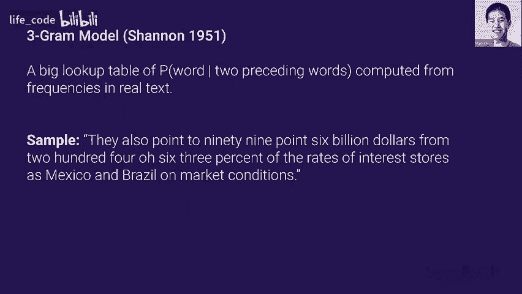
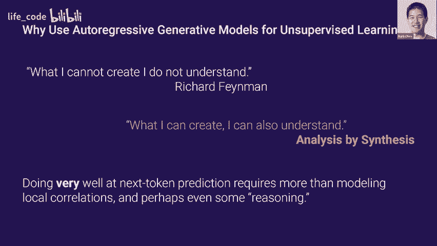
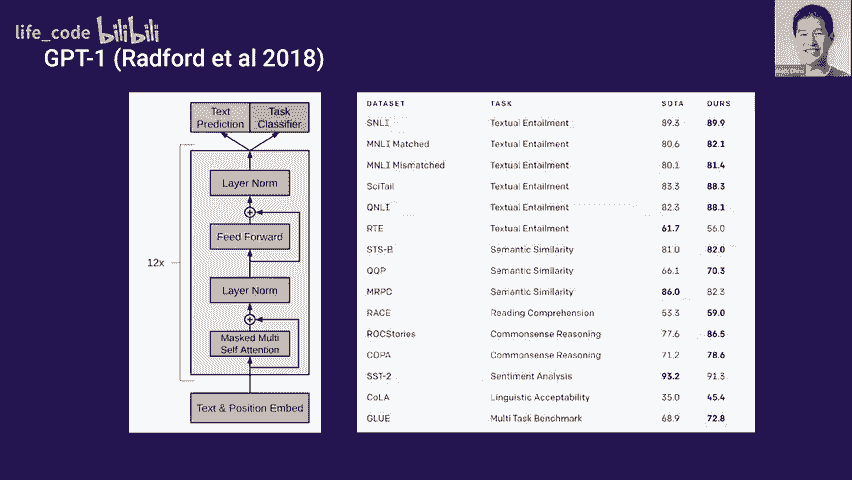
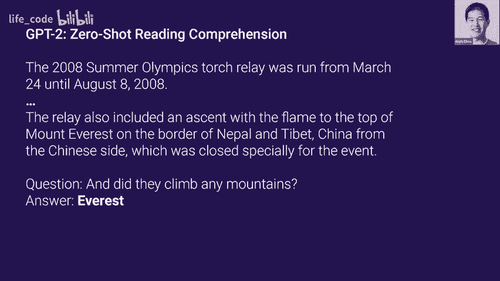
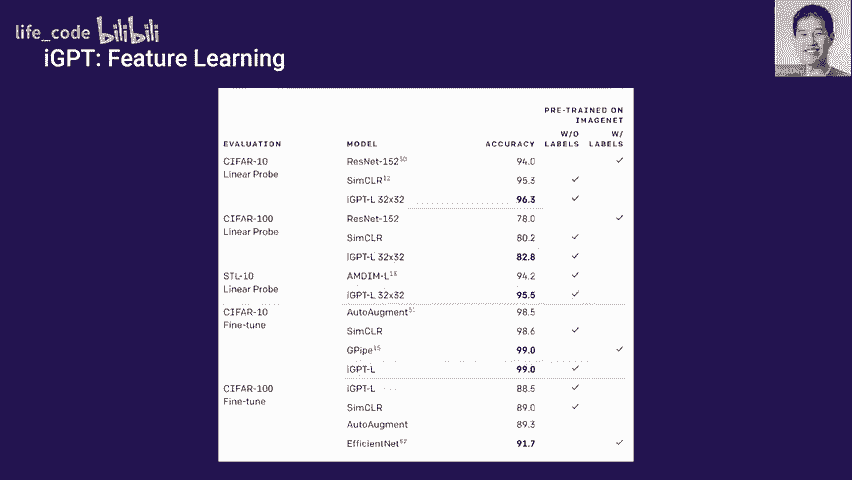
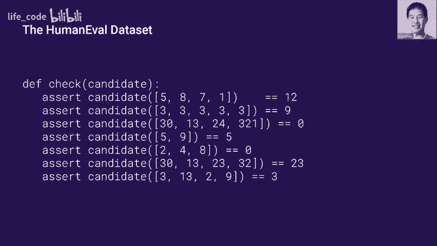
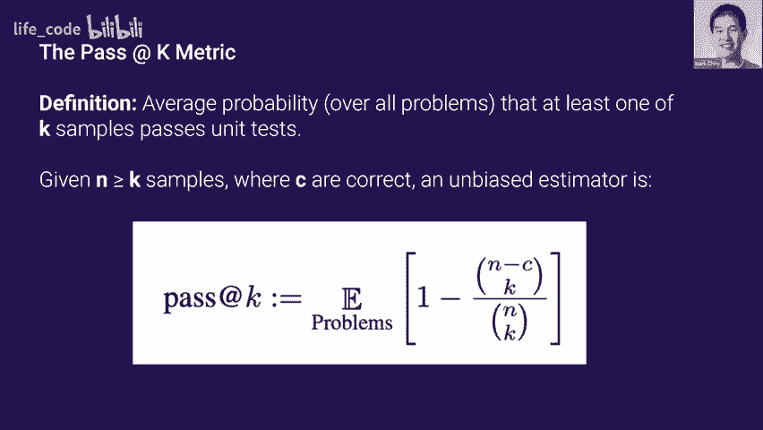
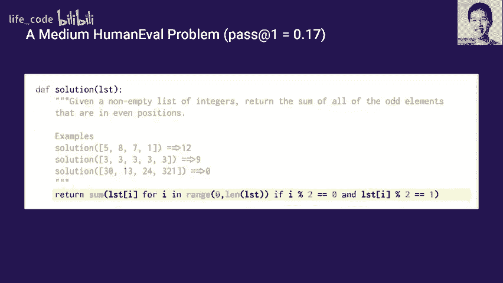
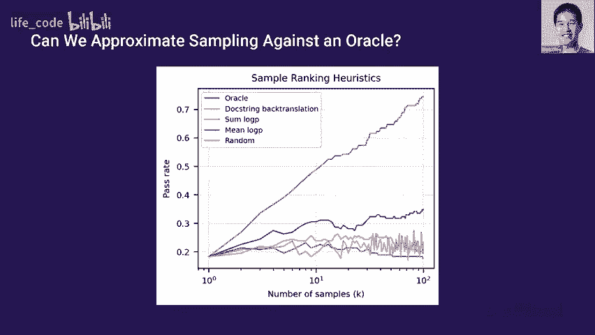
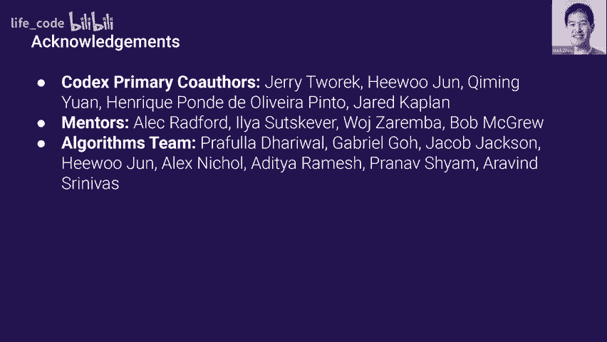

# 斯坦福 GPT／Transformer 原理介绍 (中英文双字幕) - P2：2.Transformers in LanguageThe development of GPT Models, GPT3 - life_code - BV1X84y1Q7wV

Great， okay perfect so a sample from this model looks like this， so they also point to 99。

6 billion from $2004063% know it's a bunch of kind of gibberish so the sentence isn't too coherent。

 but at least the words do seem to be somewhat related like they come from the same space。😊。

Yes。Now jumping forward to the beginning of the deep learning room in 2011。

 we have language modeling with neural networks now and in particular with recurrent neural networks。

 so we can get rid of this giant lookup table from the NG models and instead we can have our influences be these tokens and let this kind of recurrent cell remember some state and persist some state。

So if we set up a neural model like this， we get a sample as shown below so the meaning of life is the tradition of the ancient human reproduction is less favorable to the good boy for when to remove figure so again this doesn't really make any sense。

 but it kind of starts to have the flow of a real sentence。😊。

Yeah， so jumping forward even more to 2016， we have LSTM models and of course。

 LSTMs are an architectural innovation on top of R endNs and they have kind of better gradient flow so they're ever better to they can better model long term dependencies。

And so with an LSDM model， we get a sample like this with even more new technologies coming onto the market quickly during the past three years and increasing number of companies。

musust tackle the ever changing and ever changing environmental or challenges online。

 so this sentence is starting to make a little bit of sense。

 though there are clear artifacts like the repetition of the phrase ever changing。

Now， starting in 2018， we have our first autoaggressive transformer based language models。

 which are even better at modeling these very long term dependencies。

And here what I'm showing is an example of a completion。

 so in a completion the user supplies the prompt in this case it this text swings over Kansas。

And the model will continue from this prompt。So you can see that this completion is proherent across multiple sentences now。

 though there are notable spelling mistakes， so you see this like whatever do the fee is。

 so it doesn't quite make sense。And now we arrive at GPT2， which is a 1。

5 billion parameter transformer model。And I copied in what I personally found was the most compelling completion from PPT2。

And in contrast with the last slide， what this does is it sets up a clearly fake problem。

 so this we have something about finding unicorns and scientists in South America。

And so the model's probably not seen this exact prompt before and has to make up something that's consistent。

So the thing I find most impressive is it does so and is coherent across multiple paragraphs。

 it invents this fictional Dr。 Perez and it persists Perez throughout multiple paragraphs and I think it's like very aly named。

 you have him from University of Lapaz and yeah we just have fairly coherent completions at this point。

So it's worth disclosing that this was the best of 10 samples。

 so we still had to sample multiple times to get a sample like this。And finally， to end yeah， yeah。

 for sure I can post them up。 Yes， Yes， yes， yes。😊，Yeah。😊。

sorry one last when you have these1 you say we took the best the in what sense Yeah so this is human judge and I'll probably expand a little bit on that motivated。

So I want to end this kind of fly by overview with GPT3 and since GT2 already produces such coherent text like how do you characterize GPT3 and I would say that the best way to do so is that say you took the best of like one best out of five or 10 completions from GT2 that would be kind of your first completion from GT3 and of course best is kind of a personal metric here。

So here I'm showing completion from the blood class3 body problem。

You can see that the impressive things about this completion or that it really stays true to this style of the novel。

 I think the second thing that kind of impressed me was just how poet like the metaphors and siimmis that it produces are so you have this stuff like blood was seeing through her jacket and the dark red flowers blooming on her chest like these kind of like very very poetic and stylistic sentences。

So it definitely understands it's part of a novel and is' trying to generate this kind of prose that。

In the same style。So as generated text becomes more and more coherent。

 I think one really output Yeah so it's 175 billion parameters versus G2 which is one around 1 billion subtle Yeah that's a very good question So theres kind maybe we can dive into it a little bit after but there is work on kind of neural scaling laws and so the idea is like can you predict the performance of a larger model from a series of smaller models and so I would rather characterize the increase in performance not by kind the small gain perplexity but like whether it lines up with the projections and in that sense G3 does yeah that's some intuition for yeah I think personally Open we going to stop this experiment if it didn't。

This little bit general thing so we don't need to go through this changing in machine learning you be equal pushing for like an extra you know 1% to 。

5% accuracy， but the models are increasing in a scale that's professional right so I wonder sometimes。

Whether it's worth it like where you should stop right yeah。

 I think maybe this slide will get to it a little bit。

 but there's also some sense in which like as you reach kind of like the entropy floor of modeling like every having kind of gives you like like if you think about accuracy right it's not on a linear scale right like a 1% early on isn't the same as that last 1% and so yeah those last bits really do help you squeeze a little bit out of this accuracy Oh yes。

 yes， sorry this is accuracy I will explain the slide。So yep。

 so as generated text becomes more and more realistic。

 I think one very natural question to ask is whether humans can still distinguish between real and big texts right and so in here we have this is of course like a very setup scenario it's not in all cases the models they would occur humans。

 but this is for news articles， we kind of presented GPT3 generated samples against real news articles。

 and you can tell kind of as the number of parameters increases。

 the ability of humans to distinguish between the real Olympic big articles。

 that ability goes down to nerve randomom chance。😊，And oh yes。

 how did you generate the news articles what Oh I'm actually not completely sure so I didn't do this work particularly。

 but I think one possible approach would be to prime with a couple of news articles and then just to have a delimiter and just have it start generating news articles from there。

Yeah。Or any other precusions？Yeah。

Great， so even with all of these impressive results。

 I think it's worth taking a step back at this point and asking。

 what do we really care about language modeling for？And what is that actually useful for？

And I think you don't you make the argument that it is actually a fairly narrow capability。

 like why would you just want some system that just continues text for you？

And you can argue that there's more important test to solve like summarization or translation。

And I think most researchers， I open me， I would agree with this point of view。And in fact。

 GPT was not really a project that was focused on language modeling as an end goal。

 but mostly as a tool to solve a problem called unsupervised learning。

 which I'm going to go through in the next couple of slides。

So I want to do a history of language modeling at Open AI and hopefully motivate why we ended up at the GPT series of models and kind of how we arrive there and hopefully it'll become much more intuitive after this section。

So the deep learning boom started in 2012 with Alex。

Wwhich was a system that could take images and labels and it could classify images to their labels and what we found with Alexnet was these systems were able to generalize surprisingly well like you could take data sets that weren't necessarily the training distribution and used to have pretty good features on。

And since then， this kind of supervised approach has been really。

 really powerful right we've been able to train models in many different domains to classify very accurately。

😊，And you can even have some guarantees that supervised learning will work well。

 so there's critical risk immunization and but the problem with supervised learning is that oftentimes the labels are scarce。

 right especially in language tests， there isn't really that many kind of text paired with their summaries or too many pairs across languages for instance。

So collecting a lot of data can be not too hard， but actually scalably labeling all of that data。

 it could be very time consuming and expensive。So the main problem with unsupervised learning is can we also learn from unlabeled data？

And this is a lot scarier because all of a sudden we're starting to optimize an objective which isn't the one we care about thatstream right so there a lot of the guarantees that we used to have we no longer have。

And we can only kind of hope that we learn some features that are adaptable to a wide variety of downstream tasks。

But nevertheless， there's a reason to be very optimistic in language。

And the reason is that there is a huge trove of unlabeled data and it's called the internet and so the real question is can we leverage all this unlabeled data from the internet？

To solve language tasks where we don't really have that much data。

And the hope is that if we kind of pretrain this model on the internet。

 you'll see all of these words used in different settings， kind of understand the relationships。

And you'll be able to leverage this kind of understanding for any kind of task we development。

So now that we've established why language is such a good domain to try unsupervised learning in。

 let's talk about why use generative models for it and also why use auto aggressiveive generative models。

And I do want to stress that a lot of the guarantees we have with supervised learning are no longer there for unsupervised learning so some of these arguments will be a little bit kind of intuitive and so the first argument I want to present is this quote by Richard Feynman which is pretty widespread so what I cannot create I do not understand。

And there's the inverse of this idea which we call analysis by synthesis and it's what I can create。

 I can also understand and this has been studied by kind Josh Tenenbaum。

 there's definitely some kind of biological motivation as well for it。Um。对。

The the idea here is that if you're able to create a language model which can generate diverse samples that are coherent。

 then it must also build up representations that can help you solve language understanding。

And then the next question is， why do we use auto regressive models？

You might argue that autoregressive models are a kind of local objective right like you're just predicting the next words。

 you could do really well with kind of some ngram approximation right like why would it be good at solving things that allow you to summarize an entire piece of things？

And so an intuitive argument here could be， say that you wanted to do very well on language modeling for a mystery novel。

And there's this grand reveal at the end like oh， like the culprit was。

 and then you want to predict that next token and to do really well at that task。

 you really need to have a good understanding of what happened in the story along with all the twists and turns and maybe even some of this kind of like deductive reasoning book。

So the first sign of life， oh， did have a question？Oh yeah， Oh yeah， yeah。

So so the first sign of life we had at Open theI was in the task of predicting whether Amazon reviews were positive or negative and this was worked done in 2017。

 so instead of training a classifier in the kind of typical supervised way。

 what we did was we trained an LSTM model just to predict the next character in Amazon reviews。

And when we trained a linear model on the features from this LSPM。

 what we found surprisingly was like one of these cells or one of these neurons was firing in terms of predicting sentiment and positive activations for this neuron corresponded to positive reviews and negative activations to negative reviews and this was despite being not seeing any of the labels at training time。

So you can even track kind of what this neuron value is across a sample。

 so it's a little bit hard to read， but these are reviews where maybe someone says。

 oh I really like this film but I didn't like this part and you can kind of see the sentiment switching and as you go from positive to negative。

So yeah， just predicting the next character resulted in， oh yeah。yeah no no。

 this was just a P in the hidden state so you train a linear class on top of that and one neuron is firing with yeah just outsized predictive power great so next QPT1 was one of the first demonstrations that this kind of approach could work broadly for text so GP1 was trained on the internet not on Amazon reviews anymore and it was fine too on a bunch of different downstream。

Right， and one thing to stress here is kind of to your point that the fine training was very。

 I guess minimally kind of， you're not kind of bashing the architecture apart and kind of repurposing a new module and it's just a new head that classifies for your task。

And this showed that you can use this approach not just for center analysis。

But also for like entailments，matic similarity and getting so does on a lot of these benchmarks downstream。

So I've already presented QptT2 from the point of view of a very powerful language model。

 and now I think it's worth visiting from the viewpoint of principal supervisor。So like GT1。

 GT2 was trained on a large chunk of the internet。And it's only trained to predict the next token or word from previous words。

But the key insight of GT2 is that many downstream tasks can be expressed naturally as a language model impact。

And yeah， so GT2 explores how well we can perform on downstreamcast simply by using this method without any fine tuning。

Right so let me start with a couple of examples so let's say you want to solve some reading comprehension benchmark and this is usually set up as a prompt which is some passage you have to read and then a bunch of questions which you have to answer。

So you can literally just stick the entire prompting context， you put a question colon。

 you write out the question， answer colon and then have the model complete from there and this side kind of gives you zero shot reading comprehension。

We can also use it for other tasks like summarization， for instance。

 here's like of course the beginning of a CNN article about kind of some archaeological finding and you can just put TLDR after you see this passage and the model hopefully if it's good enough will produce good summaries。

And the final example I want to show is that you can do zero shot translation as well。

So the way you would do this is if you wanted to convert， let's say a French sentence into English。

 you could set up a prompt like the sentence insert the French sentence translated from French to English means and then the model will complete and they can sometimes do as well and one kind of critical thing to note here is that here's the chart of performance as you increase the number of parameters and。

嗯。In all of these models， they were trained on the same data set。

 so the only kind of compounding variable is scale。

And you can see that as we scale up the models these kind of zero shot capabilities emerge or and kind of smoothly get better so the role of scale is important here and yeah and I think these are starting to approach some I guess they're not great benchmarks but at least respectable benchmarks。

Yeah， yeah， yeah。 exactly。 It's not gonna be great in a lot of cases。 And to be honest。

 like the blue metric used for translation is actually often pretty you very much。

 it's not a great metric。 What it does is it takes a reference solution And basically。

 it does some kind of like Ngram comparison。 So it is a big problem to have good translation metrics in an LP。

 And yeah， I think when I talk about code， I'll talk a little more completely。😊，Right。

 so let's finally talk about how GP3 fit into this picture。

So the primary insight of GP3 is that the training process itself can be interpreted in the context of meta alert。

 which is kind of like learning over a distribution。And during training。

 what the model' is doing is it's developing certain kind of capabilities。

 it's picking up some set of like skills in terms of modeling certain passages。

And during inference time what it's doing， it's kind of quickly picking up on what a task is based on what the prompt is so far and adapting to that task to predict the next to。

So you can kind of view there's this outward loop of all the SGD steps you're doing during training and this inward loop of kind of picking up on what the task is and then modeling the next toing。

So you can imagine a lot of tasks being framed in this way。

 for instance on the left you can have addition kind of you have a lot of examples of the context and hopefully that would help you with a new edition problem where you can try to unscram a word for instance and I'll explore results on these two kind of benchmarks in the next slides。

So this setting we call fu shot arithmetic and just to explain what's going on。

 you're taking the entire context slide of your transformer and you're putting in as many examples as we'll fit。

And then finally you put in the example that you would like to solve so here like these examples could be。

These kind of first three edition problems and then you have 31 plus 41 equals and you ask the model to complete。

So you notice that as the language model gets bigger， it's better able to recognize this task。

And you can see that kind of performance on additions。

 subtracting even some kind of multiplication tests increases sharply as you go towards 20 billionion parameters and there just seem to be kind of some step function change right here。

And looking at word unscrambling this is also true so we have parameters again on the X axis we have accuracyn each should these as a different kind of unstble task so this blue line is you kind of do a cyclic shift of the letters and you want it to uncycle and there's a lot of other transforms you can do like randomly inserting words for instance。

Yeah。So the final point here is that this is a pretty general phenomenon we didn't just test it on these two aforementioned tasks we tried an array of I think 40 plus tasks and here you can see how the zero shot one shot and few shot performance increases as we scale the models so of course they're smoothly increasing but one thing to be aware of is that the gap between zero shot and fu shot is also improving as a function of scale。

阿什。So we've just seen that we can pre train the transfer oh good。One is。

Themelves that were used two is the number of parameters and then three my understanding is also the quantity of the tested I was curious sort of between those three which ones you've shown a lot of。

A number of parameters definitely helps I was curious though if you have a sense so the degree to which also the training tasks and the sophistication of the tasks as well as the quantity of the adjusted。

Yeah， yeah so I guess I can dive maybe it's something to say for a group but yeah yeah let's dig into that after yeah I guess GPPD2 and three aren't different GPD1 just has an extra classification head for certain tasks yeah。

😊，Great， yeah， good questions。 So yeah， we've just seen that we can use a transformer in this kind of pretrain and binding setup where we have some kind of a lot of unlabeled data in the pre training setting。

 and we have just a little bit of data in binding setting。😊。

And we can solve a lot of language tasks in this way。

 and I would say this has become the dominant paradigm in language over the last couple of years。

 so there's follow up objectives like BERT and T5 which have done extremely good at pushing the soda。

But there's nothing really that says that these transformative models have to be applied to language。

The transformer is a sequence model and as such it can just ingest any sequence of bytes and model them and when you think about this like all of the data that we consume like videos or audio they're represented on our computers as sequences of bitetes right and so we might think。

 oh could this approach be used to just model whatever modality we want？And I think this kind of。

Paraigm is very。At least interesting when when we don't really have good inductive biases like we don't we don't do it。

But one question to ask is does it even work when you do have really strong adaptductive biases so I'm going to present some work that suggests that the answer is yes。

 it still works fairly well in this case， in the domain of images where convolutions are already so popular and proven out。

And I'm going to show a second result very briefly here， which is Doli。

 which shows that it's strong enough to even ingest two different modalities be able to join the model。

It。So the first question is， how would you apply GPT to images？

And there's a few things you have to do， you have to modify this utteraggressive next word prediction objective。

 so the natural analog is you can think of images as a very strange language where the words are pixels instead and instead you need to predict the next pixel at each point。

 and so we can just change the objective for next word prediction next pixel prediction。

And of course， we want this kind of large。Yeah。Oh yeah。

 so you just unroll it as a sequence it's the same way it's it stored on a computer you just have like a sequence device yeah yeah good question so in the language study we pre on this large unlabeled data set。

On the internet and we fine tune on question answering or this other benchmark。And in images。

 one good analog of this situation is you can pretrain on imagenet without the labels you have a let's say a low resource low data sorry setting like SFR and you can try to attack SFR classification and of course in both settings you can do fine tuning in GPT you can do zero shot and I would say the standard eval on images is you do linear probes so you take features from your model the model is frozen you pass through SFR through the model。

 get some features and you see how predictive these features are of the CF classes。

Is it kind of pixel there， which basically you ask model to predict the next pixel given the。

Yeah yeah so pixelix CNN is an instantation of an autoive image model so what we're asking here is can we actually take the same transformer architecture that we use in language don't make any modifications at all and just throw so there's no kind of 2D prior on this。

So yeah I'll call this model that we train image sheet or IGP for sure and here you can see actually what some completions from the model look like so on the left column what I'm feeding in is the pixels of the first half of the image and the next floor columns what you're seeing is different model generated completions and the right column here is the original reference image。

And you can actually see that the model is kind of doing some interesting things right if you look at the last two rows。

 it's not coming up with tenisemmaticically the same completion every single time。

 it's like putting these birds in different settings， sometimes adding reflections。

 is putting this lighthouse in grassy areas and like watery areas， for instance。

So if you buy into this philosophy of analysis by synthesis。

 we definitely have some hint of this synthesis part。

So I don't have time to go through all of the results with you。

 but I just want to say that it is fairly successful in this SaFar setting where you don't have much label data if you train a linear model on top of the features。

 you get better results than if you do the same approach with a renet trained on Inet with so that's like the typical approach in the field you train some re on Inet you get the features oh yeah oh yeah and if you compare to yeah this approach a generative model on Inet without the labels。

 take the features it's actually better predictive yeah is exactly yeah yeah yeah yeah it。

So this and note so you can modify QP to have like 2D bias like you can do 2D position your bes well we don't do that we just want to see can you use the same exact approach Yeah at least so early recently data is just sequential Yeah but also there's like metadata showing about how that sequential should be reconstructed the image like what's the way。

For example， do you so the data on this stored yes。

But when you want to transform the sequencing into an image。

 you have metadata that will say something like just like in nu race。 it'll say here's the strike。

 Yeah so here's how to rearrange it to the two dimension I see what I'm curious to notice is D before it's given an image。

 at least given this metadata I see I see Okay that's extremely good question I don't know this problem is solved。

 in this case， all the images are have the same shape。不。

Yeah so but we don't tell it like the concept of row within the model like yeah all images of the same yeah so it needs to learn it from the data。

 but yeah the data looks same adjusting if it's like variable image shapes then I can adjust way to do it yeah。

哦や。啊，啊对了。A lot more pixel there are token sizes yeah， So this is a pretty low resolution images。

 Yeah， so we can actually， the models we're comparing us are trained on kind of high resolution images。

 So I think that makes it even more impressive。 Oh yeah。

 we're just training at the2 by the2 resolution。Yeah。Cool。

 so if we fine tune these models for s classification， we can get 99% accuracy。

 which matches G5 and this is G5， for instance， is a system which is pre traineded on imagenet with labels and then also fine tuned with labels。

So yeah， it just kind of shows you like even this approach which doesn't really know about convolutions can do well。

 I think you're going to hear more about that next week with Lucus Talk。

是。So by now， it shouldn't be surprising at all that you can model a lot of different modalities with transformers。

So in Dolly we just asked what about throwing two different modalities at the model and seeing if we can learn kind of how to condition on text to produce an image and for instance。

 one thing you might want it to do is like you one of these text captions and you wanted it to generate some image like the one below and the easy way to do this is just train a transformer around the contaminatation of a caption in an image。

And of course， in a lot of these situations like the idea is very simple。

 but the implementation and execution is where the difficulty is and I'm not going to talk too much about that。

 I think the focus today is on language but we can refer to the paper for a lot of those details。😊。

Caption。VeryOh yeah。 So you， you like， say， have a max cap length。

 And you just kind of cut it off at that length。 and you can pad up to that。

Right so you can see that it can generate fairly good samples so if you want like a storefront with the word opening eye on it it's not perfect。

 but it's understood at least it's kind of like reverse orcrR problem where you take some text and render it and it's kind of typically rendering it in like office looking places so that's one encouraging sign but I do think my favorite results here are zero shock emission image transformation So what's going on here is for instance。

 if your prompt is the exact same cat on the top as as a sketch on the bottom and you feed in the top half of this image which is a cap and you ask it to complete the rest of the image then it'll render the top cat actually as like。

😊，A sketch。 And you can do the same thing with like flipping over photos， for instance。

 You can zoom in a photo。 Of course they're not perfect。

 but it has some understanding of what the Texas training do in the captions originally like the training in the training set。

 do they have like wording such I screen close up you I think that that is the if it probably are some examples like that。

 And that's probably where it's picking up some of the knowledge from though we don't seek out these examples It's just yeah。

 yeah exactly Okay， perfect。Yeah， so this is just how we just go and do a massive web script。

 there's no kind of， we're not trying to find examples like this。

Right and so you can also do things like colorization right you can take the cat color red and this has to like kind of recognize that what the object is in the figure and yeah and so you could do stuff like seman transformations like adding sunglasses into the cat and you can put it on postage for instance yeah so justs remarkably that you can do a lot of these like transform zero shots it wasn't trained to do these things specifically。

Cool， so moving on， the last section of my talk today is on CodeX。

 which is our most recently released code writing models。

And the first question you should rightly ask here is。

Whyhy train a model on anyway isn't at this point isn't it just another modality？😡。

And what is the novelty that there is at this point right， so let me give you a couple of reasons。

So first is that GP3 it had a rudimentary ability to write Python code already from a do string or descriptive method name and we actually didn't train it on much code data actually I think there might have been active filtering to get rid of code data and so we were surprised that there is this capability anyway so that you know like if we actually purpose a model and trained it on the large amount of code that we can find maybe something interesting will happen there。

Next， what sets apart code from other modalities is that there is a kind of ground truth correctness of a sample and functions can be tested with unit tests and an interpreter so this is very different from language whereas to get a ground truth value you might need a human to come in and even then sometimes humans won't agree like this this is the better sample or this isn't the better sample。

And last thing is I used to double in competitive programming myself and yeah I really wanted to create a model that could solve problems that I could't。

😊，So if oh yeah，This is the same thing that we to get up on this， yeah。Yeah。

 we wrote a paper on it too， so yeah。😊，person is kind of a high level。

Programming language is similar to our human language。

I you guess ever try to predict some even lower level language like CP or yeah yeah yeah I think there's yeah。

 there's follow up work where we just trade on a bunch of different languages and I don't know the metrics off the top of my head but I have seen some assembly of writing models。

Cool so I guess yeah continuing on the third from before so we have this this setting where we have unit tests and interpreter so how do we actually evaluate these models in a way that's kind of aware of these two concepts so the first thing we did was we have a data set a new data set which is 164 handwritten programming problems。

And these kind of have the format shown here， like there's a function name， a doc string。

 there's a solution， and there's an average of around eight unit tests per problem。

And why is it important that we handrote these well the thing is we're training on such a large part of GiHub like if you said okay I'm going to take like some Vcode problems and I'm going to turn them into an evaluation that's not going to work because there's just so many GiHub reppos that are like oh here's the solution to this V code problem so while this doesn't kind of guarantee that this problem isn't duplicateupd at least someone wrote it without trying to copy it from another source。

Um。So here's some kind of examples of unit test that you would evaluate the previous function on。

 I think it should be fairly clear that we should be using this metric like this is the correct kind of ground truth metric to use I mean humans do use unit tests to evaluate code and I would say like if you're familiar with a competitive programming like you can't manually judge all like tens of thousands of submissions that are coming in。

 you need the unit tests and that is a fairly good filter。

So what an interesting point here was we had to create a sandbox environment to run these kind of generated solutions in because when you turn on Gitub。

 there's a bunch of malicious code， there's a bunch of kind of insecure code。

 you know why your model should be sampling that and kind of running that on your environment。

Yeah。Cool， so now that we have an evaluation data set， let's define a metric on。

And so the metric we're going to use is called pass at K。

 and the definition is the average probability over all the problems that at least one out of K sampless passes the unit test。

So if we evaluate this metric by just taking every problem exactly generating K samples。

 it's actually not there's high variances just kind of sampling in that way like imagine the past rate of a particular samples around one over k like this is kind of like an all or nothing metric so what we do instead is we generate a much larger set of samples and greater than K most of the times it's like greater than5 k and we count the number of that are correct and we compute this unbiased estcalator and it looks more complicated and actually is its just complementary accounting you you take kind of the number of combos where all of them fail subject that。

Cool， so then we train our model and like I alluded to earlier， there's about 160 gigabytes of code。

 which is collected from 54 million repositories。For efficient training what we did was we fine tune from GPT3 models of various sizes and this isn't actually strictly necessary。

 we find that we can get to roughly the same final loss and performance without C but it is slower to do it without without the free training step and so we already have these models why not just fine tune them。

And one extra trick to make training much faster here is in code there's a lot of runs of spaces right and those don't get compressed efficiently in language because you just don't see them very often so they typically get broken up into like many separate tokens and so we introduce additionally some tokens that compress runs of one space and that makes training maybe like。

30 or 40% more efficientYeah， exactly， yeah。

Great， so once we have these models， we can go and revisit the human E data set and I can share a couple of problems to give you a sense of where the models are at and also what kind of difficulty level the problems in the data set are at。

So this is a 12 billion parameter model the pass out is 90%。

 which means that 90% of the samples will pass the unit test and this is very something like anyone kind of doing a first day of Python would be able to do so you increment all the elements of a list by one。

Here is a problem where the pass rate is 17% so this is a solution I gave the problem I gave earlier so you are given a nonmp list of integers you want to return to some of odd elements that are in even positions and this might not sound that much harder to you but models can often get confused about like oh like is odd referring to positions or elements and so here you can actually see that it's doing the right thing。

And finally， this is an example of one of the harder problems in the data set So the pass rate is under 1% here and so what's going on here is actually there's an encode function which takes a stream。

 it kind of chunks it up into groups of three characters and it does a cyclic shift on each character and you have to write a decoder。

 something that reverses this operation so you can see that model this is a real model solution so it chunks up the characters in the same way you can see that the cyclic shift is the opposite way so up there it takes the first element of each group moves it to the end and now it takes the last element of each group moves it into the。

Okay， as I'm wondering， what's the effect of so like you had a couple of examples in the previous slide。

 it was in the comments。So like I'm wondering if the model will be able to extrapolate what it's doing by the examples so on and not relying on the right yeah so some of our tasks there are some examples in the doctrine and some of them don't I think it's just to kind of match the distribution of the old kind of tasks we find in the real world like in this case it doesn't have it but definitely for the unit tests none of those appear within I'm justing like if you just give it the examples and not the the description all the task Oh I see I see so can it do like pure induction where you like don't tell the task at off Yeah I haven't tried it to be honest I think it's worth the shot yeah thanks。

Yeah， so yeah at this point， we've trained codex models we've evaluated on this metric。

 but the thing is like was it worth all this trouble right you already have these metrics like blue that are matchbased in language couldn't we have just used this to Rosmate and we don't need like an interpreter we don't need like to generate so many samples and it would be great if like it kind of like separate it out like this but what we find is that this is if you take four random poems from human eva and you plot the distribution of blue scores for correct and wrong solutions you actually find a lot of distributional overlap right like it's hard to distinguish like。

😊，The green from the blue distribution and so this suggests that blue actually isn't a very good metric for gaugging functional correctness and that we actually do need this this new kind of metric and this new data set。

So now let's explore the setting where in passec K is greater than one。

And so the first observation we have here is that the temperature that you sample at it affects your pass I and just for some intuition。

 if you do temperature zero sampling， you're going to get the same sample every single time you're doing artifact sampling so it doesn't matter like how many samples you generate you're just going to get the same pass rate but if you want to generate 100 samples right you can afford to make some mistakes right you just want a very diverse set of samples。

So you can up the temperature， in can see kind of as you up the temperature。

 the slope of the kind of number of samples against pass weight， it becomes steep。

And so you can kind of take the upper hole of this and you can find the optimal temperature for each number of samples。

And so this brings me to personally my favorite result of the paper。

 which I call the unreasonable effectiveness of sampling。

And so let me explain what's going on here because this is the number of parameters in the model and here you have pass rate at one and a pass rate at 100。

And the reason I use this term unreasonable effectiveness is that I think there's a world where if the orange line and the blend weren't that far apart。

 I might not be that surprised like at these scales the model it rarely makes kind of syntactical errors anymore like if you run it ill run and produce some kind of output so you could imagine a world where basically what you're the model has some approach in mind is just repeatedly sampling that approach and it it's just either right or wrong。

 but instead we find is that the model is actually composing different parts and producing functionally different things。

And you get this huge boost from under 30% to over 70%。

 just by sampling a lot of samples from the model。So unfortunately。

 knowing that one of your samples is correct， isn't that useful if you don't have。

Access to the unit test and one setting where practical setting where you would care about this is see you're creating an autocomplete tool right and you generate 100 samples but you don't want to show your user 100 samples and help them pick one right you want to kind of try to pre filterter but you don't have unit tests so can we kind of approximate this oracle sampling with some other ranking heuristic。

So here I'm showing a couple of different heuristics like you randomly pick one。

 but the one that seems。Most promising is to rank by me in that probability and it's I know it's like kind of maybe not theoretical we walk around it。

 but in language this kind of heuristic is fairly strong as well。

So recall that what we're doing is we have this evaluation set where we have kind of standalone functions。

 we want to produce solutions to them。But when we're doing training there's a lot of code that isn't relevant for this task。

 for instance there's a lot of classes that we're seeing there's actually data classes too which aren't relevant at all and actually there's a lot of incorrect food on GitHub too so we might be modeling incorrect solutions as well as correct ones。

So。😊，One thing we thought was let's finet codex further on a couple of data sets where they are standalone functions and you have kind of more guaranteed correct solutions to that。

So what we did was we found these problems from a couple of sources。

 So one is competitive programming problems。 You can kind of go on these sites。 oftentimes。

 they'll just give you the unit test。 Sometimes when they don't give you the unit test。

 you can submit incorrect solutions and they'll tell you the first one you failed on and kind of keep it certain。

Yes so you can get a lot of competitive programming problems and another source is projects where continuous integration is enabled so why aren are these useful because you can actually kind of do an execution tracing so when you run the integration test you can get all the inputs to functions that are called and their outputs as well and so you actually have the true function body you know what the test output is supposed to be so you know kind of the ground truth inputs and output。

😊，And these are kind of like two orthogonal data sets。

 one kind of helps you with like algorithmic kind of tasks and one is more kind of like trying I manipulate command line utilities and tasks like that。

So this brings us to the main figure of the codetex paper。

 so really what we're seeing is a progression of capabilities so with G3 on this human eval data set the password rate at one is zero basically you can generate like one or two lines coherently never really a whole program coherently。

Now when you fine tune on code， which is Codex， this orange line。

 you start to see some kind of knowledgeable performance on this data set。

When you do this additional supervised flight training that's this green line。

 you get even better password ratess and then if you kind of generate 100 samples from this model rerank with mean log P。

 even better password ratess， and finally， of course if you have access to an Oracle。

 it gives you the best pass rates。Some one question here is can you actually use a deep link to like like further to the model can you use it for like as a backdrop signal Yeah。

 yeah， so we do you spoil that I don't know if I can say too much about these results got it but yeah。

And finally I don't want to suggest that these models are perfect。

 they have a lot of limitations that human programmers don't run into so one is like actually all generative models are autoaggressive geneative models kind of have some problems with binding so when there's like a lot of variables going on like a lot of operations going on sometimes it's like hard to figure out which operation is finding to which variable so you can kind of see some examples of that on the left and one other kind of counterintuitive behavior is composition so we can take a bunch of very simple building blocks like take a string and reverse it or like delete every pre third character or something and a human like if you can chain two of these operations you could probably chain n of them but our models aren't to do that yet。

Cool， so moving on to the conclusion， we have four main points in today's talk。

 so first progress in neural language modeling has been fairly rapid。And at GT。

 it wasn't the result of a push on language modeling and more a result of work on pushing unsupervised learning in language。

The third point is that autoaggressive modeling is universal and it can yield strong results even when there are strong inive biases like in images or in text images。

And finally， we can produce strong co generatingrating models like fine tuneing GPT for young code。

And as sampling is an unreasonably effective way to improve model performance。

Cool now to end with some acknowledgeknowments， I want to thank my CodeX primary coauors。

 some mentors at Open AI and the algorithms team which I've worked very closely with great thank you guys for your attention。

