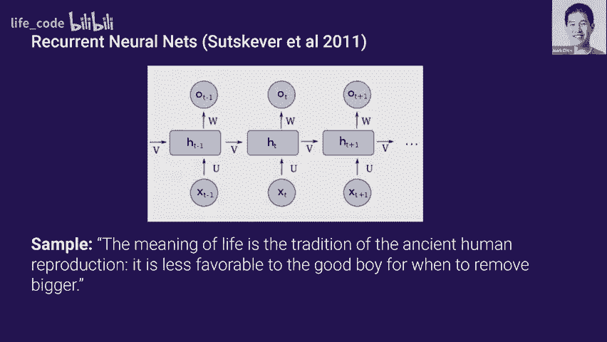
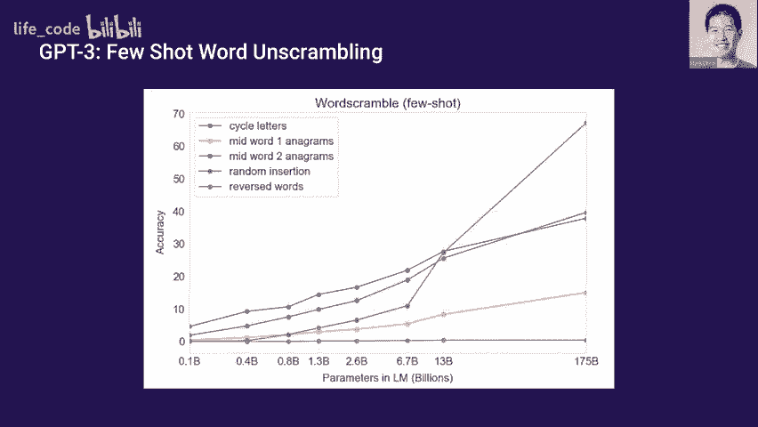
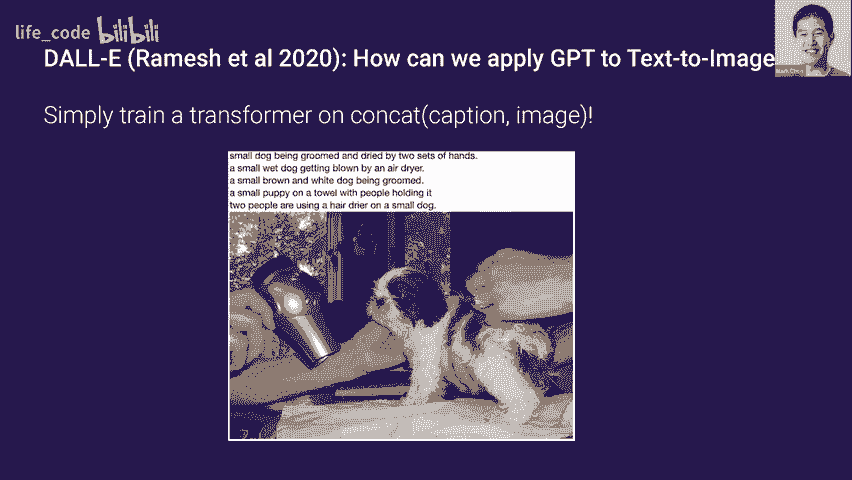
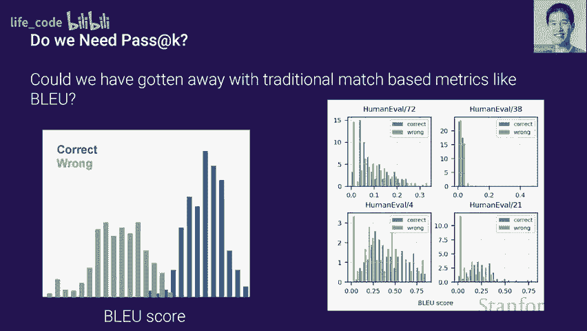
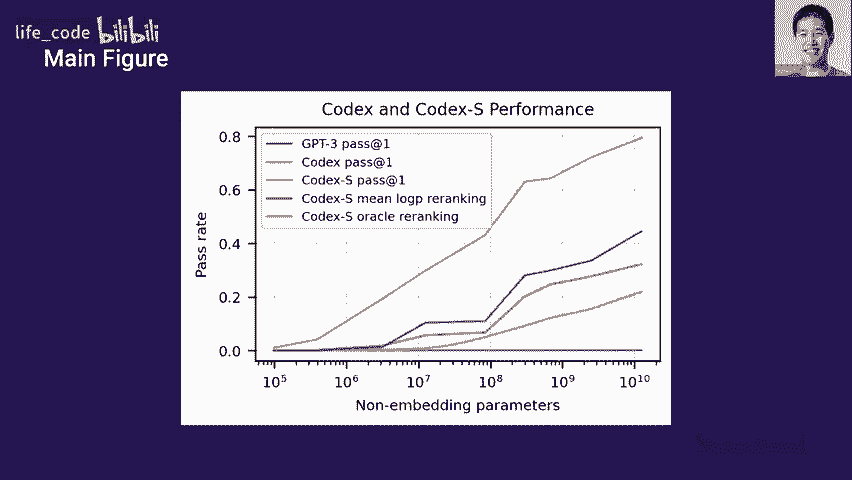
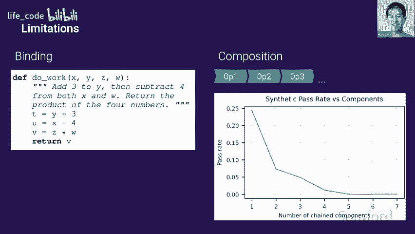

# 斯坦福 GPT/Transformer 原理介绍 (中英文双字幕) - P2：2.语言中的 Transformers GPT 模型的发展，GPT3 - life_code - BV1X84y1Q7wV

好的，完美，因此这个模型的样本看起来像这样，它们也指向从$2004063%的 99.6 亿，这是一堆无意义的话，所以句子并不太连贯。但至少这些词似乎还是有些相关，像是来自同一个领域。😊。

是的。现在跳到 2011 年深度学习的初始阶段。我们现在有基于神经网络的语言建模，特别是使用递归神经网络。这样我们就可以摆脱 NG 模型中的巨大查找表，而让这些标记成为我们的影响，让这种递归单元记住某些状态并持续某些状态。如果我们设置一个神经模型，我们会得到如下样本，因此生活的意义是古代人类繁殖的传统对好男孩的影响较小，因此移除图形的时机不佳，所以这实际上并没有什么意义。

但它开始有了真实句子的流畅感。😊。

嗯，所以再往前推到 2016 年，我们有了 LSTM 模型，当然。LSTM 是基于 RNN 的一种架构创新，具有更好的梯度流，因此它们在建模长期依赖关系方面表现更佳。通过 LSTM 模型，我们可以得到这样的样本，在过去三年中，市场上迅速出现了更多新技术，以及越来越多的公司必须应对不断变化的在线环境或挑战。

所以这个句子开始有点意思了，尽管明显有一些伪影，比如“不断变化”这个短语的重复。

现在，从 2018 年开始，我们有了第一个基于自回归的变换器语言模型，它们在建模这些非常长期的依赖关系方面表现得更好。在这里，我展示的是一个完成的例子。在这个完成中，用户提供提示，这里是“这段文字在堪萨斯州摇摆”。

模型将从这个提示继续。因此你可以看到这个完成在多个句子中是连贯的，尽管有明显的拼写错误，所以你会看到这像是“无论费用如何”。所以这并不太有意义。现在我们来到了 GPT2，它是一个 15 亿参数的变换器模型。我复制了我个人认为在 PPT2 中最引人注目的完成。

与上一张幻灯片相反，这个模型设置了一个明显虚假的问题。我们提到寻找独角兽和南美的科学家。因此，模型可能以前没有见过这个确切的提示，必须编造一些连贯的内容。所以我觉得最令人印象深刻的是，它确实做到这一点，并且在多个段落中保持一致。

它创造了虚构的佩雷斯博士，并且在多个段落中持续提到佩雷斯，我觉得这个名字起得很好。你可以看到他来自拉巴斯大学，目前我们得到了相当连贯的完成。因此值得说明的是，这是 10 个样本中最好的一个，所以我们仍然需要多次取样才能得到这样的样本。最后，结束时，是的，是的。

当然我可以把它们发上去。是的，是的，是的。😊，好的。😊。抱歉，最后一个问题，当你提到这些时，你说我们挑选了最好的，这在什么意义上？所以这是人类评判，我可能会稍微扩展一下这一动机。因此，我想以这种飞速的概述结束关于 GPT-3 的讨论，因为 G2 已经产生了如此连贯的文本，像 GPT-3 你会如何表征呢？我认为最好方式是说你从 G2 的五或十个完成中挑选了最好的一项，那就是你从 G3 得到的第一次完成，当然“最好”在这里是一种个人标准。

在这里，我展示了来自血液类 3 身体问题的完成。你可以看到这个完成的令人印象深刻之处在于，它真的保持了小说的风格。我觉得另一个令我印象深刻的地方是它所产生的隐喻和比喻非常像诗句，比如“血液透过她的外套，深红色的花朵在她的胸口绽放”，这些句子非常非常富有诗意和风格。

所以它确实理解它是小说的一部分，并且在尝试生成这种风格的散文。随着生成文本变得越来越连贯，我认为一个真正的输出是 1750 亿个参数，而 G2 大约是 10 亿个，这确实是个好问题。因此，可能我们可以稍后深入讨论一下，这里有一些关于神经网络规模法则的研究，想法是你能否从一系列较小模型中预测较大模型的性能。我更倾向于通过这种小的困惑度提升来表征性能的提高，而是看它是否符合预测，在这个意义上 G3 确实如此。对我个人而言，我认为如果没有这样的结果，我们将停止这个实验。

这有点普遍，所以我们不需要逐步讲解机器学习的变化，你会发现它们在精确度上推动了大约 1%到 0.5%的提升，但模型的规模正在专业化地增长，因此我有时会感到好奇。

是否值得，以及你应该在哪里停止，我认为也许这一张幻灯片会稍微提到，但还有一种意义是，当你达到建模的熵底线时，每一次的提高都会给你带来影响，思考准确性时，这不是线性比例，最开始的 1%和最后的 1%并不相同，最后的部分确实能帮助你挤出一点准确性。

是的，抱歉，这是准确性，我将解释这一张幻灯片。是的，随着生成文本变得越来越真实，我认为一个非常自然的问题是人类是否仍然能区分真实与生成的文本，因此在这里我们当然是在一个非常设定的场景下，并不适用于所有情况下模型的表现，但这是针对新闻文章，我们将 GPT3 生成的样本与真实新闻文章进行对比。

你会发现随着参数数量的增加，人类区分真实与生成的奥林匹克文章的能力下降到随机机会。😊，哦，是的，你是怎么生成新闻文章的？哦，我实际上并不完全确定，因为我没有特别参与这项工作。

但我认为一种可能的方法是通过几篇新闻文章进行引导，然后设置一个分隔符，让系统从那里开始生成新闻文章。对，或者还有其他的预处理吗？对！

很好，所以即使有这些令人印象深刻的结果，我认为此时值得退一步问：我们究竟为何关心语言建模？它实际上有什么用？

我认为你可以提出这样的论点：它实际上是一个相对狭窄的能力。为什么你只想要一个持续生成文本的系统呢？

你可以说还有更重要的测试需要解决，比如摘要或翻译，我认为大多数研究人员，包括我自己，都会同意这一观点。实际上，GPT 并不是一个以语言建模为最终目标的项目，而主要是作为解决一个被称为无监督学习的问题的工具。

我将在接下来的几张幻灯片中讲述这个问题。因此，我想回顾一下 Open AI 的语言建模历史，并希望能激励我们为何最终选择了 GPT 系列模型，以及我们是如何到达这一点的，希望在这一部分后会变得更直观。

深度学习的繁荣始于 2012 年，Alexnet 是一个能够将图像与标签匹配并对图像进行分类的系统，我们发现 Alexnet 这些系统能够出奇地很好地进行泛化，甚至可以使用那些并不一定属于训练分布的数据集。

从那时起，这种监督方法真的变得非常强大。我们能够在许多不同的领域训练模型以非常准确地进行分类。😊，而且你甚至可以有一些保证，监督学习会运作良好。因此，存在关键的风险免疫，但监督学习的问题在于标签往往稀缺。

尤其是在语言测试中，并没有太多文本与其摘要配对，或者跨语言的配对也很少。因此，收集大量数据可能并不难，但实际上要可扩展地标记所有这些数据却很困难。

这可能非常耗时且昂贵。因此，无监督学习的主要问题是，我们是否也能从未标记的数据中学习？

这让人更加恐惧，因为突然间我们开始优化一个与我们关注的下游任务无关的目标，所以我们以前所拥有的许多保证现在都不复存在。我们只能希望能够学习到适应各种下游任务的特征。

但是，尽管如此，对于语言来说，仍然有理由非常乐观。原因在于有大量未标记的数据，这被称为互联网，因此真正的问题是我们能否利用来自互联网的所有这些未标记数据？

在我们并没有太多数据的情况下解决语言任务。希望是，如果我们在互联网上对这个模型进行预训练，你将看到这些单词在不同场景中的使用，从而理解它们之间的关系。你将能够利用这种理解来处理我们开发的任何任务。

现在我们已经确定了为什么语言是尝试无监督学习的一个很好的领域。让我们谈谈为什么要使用生成模型，以及为什么要使用自回归生成模型。我想强调的是，许多我们在监督学习中拥有的保证在无监督学习中不再存在，因此一些论点可能会稍显直观。我想提出的第一个论点是理查德·费曼的一句广为流传的名言：“我无法创造的，我不理解。”

还有这个想法的反面，我们称之为合成分析，这是我可以创造的。我也可以理解，这一点已经得到了像乔什·特嫩鲍姆这样的研究者的研究。它背后肯定也有某种生物学动机。嗯。对。这里的想法是，如果你能够创建一个能够生成多样且连贯样本的语言模型。

那么，它还必须建立起可以帮助你解决语言理解的表征。接下来的问题是，我们为什么要使用自回归模型？

你可能会争辩说，自回归模型是一种局部目标，对吧？你只是预测下一个词。你可以用一些 n-gram 近似来表现得很好，对吧？那么为什么它在解决允许你总结整篇内容的事情上会表现得很好呢？

这里的一个直观论点可能是，比如说你想在推理小说的语言建模上表现得很好。故事的结尾有一个大揭示，比如说，罪犯是谁。而且你想预测下一个词，要在这个任务上表现出色，你真的需要对故事中的所有曲折和转折有很好的理解，甚至还要有一些像推理书那样的逻辑思维能力。

所以，我们在 OpenAI 的第一次生命迹象，哦，有问题吗？哦，是的，哦，是的，是的。所以，我们在 OpenAI 的第一次生命迹象是在预测亚马逊评论是正面还是负面这一任务上，工作是在 2017 年完成的。因此，我们不是以典型的监督方式训练分类器，而是训练了一个 LSTM 模型，仅用于预测亚马逊评论中的下一个字符。

当我们在这个 LSPM 的特征上训练线性模型时，我们惊讶地发现，像是这些细胞或神经元在预测情感时是激活的，正激活与正面评论对应，负激活与负面评论对应，尽管在训练时没有看到任何标签。

因此，你甚至可以跟踪样本中这个神经元的值。阅读起来有点困难，但这些是评论，可能有人会说，哦，我真的很喜欢这部电影，但我不喜欢这个部分，你可以看到情感的转变，从积极转为消极。所以，是的，仅仅预测下一个字符就导致了，哦，是的，不，不。

这只是隐藏状态中的一个 P，因此你在其上训练一个线性分类器，其中一个神经元的激活是巨大的预测能力，太棒了，所以下一个 QPT1 是首次展示这种方法可以广泛用于文本的案例，因此 GP1 是在互联网上训练的，而不是在亚马逊评论上，它在多个不同的下游任务上也表现得很好。

对，是的，这里要强调的一点是，正如你所说，微调是非常的。我想说是最小的，你并没有拆解架构并重新定制一个新模块，而只是增加了一个新的头部来为你的任务进行分类。

这表明你可以使用这种方法不仅用于中心分析，还可以用于蕴含、相似性等，并且在很多下游基准上获得良好效果。

所以我已经从一个非常强大的语言模型的角度展示了 QptT2。现在我觉得从主要监督者的角度来看也是值得探讨的。就像 GT1 一样，GT2 是基于互联网的大量数据进行训练的。它只训练预测先前单词的下一个标记或单词。但 GT2 的关键洞察是，许多下游任务可以自然地表达为语言模型的影响。

是的，所以 GT2 探索了我们在下游任务中仅通过这种方法而不进行任何微调的表现。好吧，让我先开始几个例子，假设你想解决一些阅读理解基准，这通常是设置为一个提示，其中包含一些你必须阅读的段落，以及一堆你必须回答的问题。

所以你可以字面上将整个提示上下文粘贴在一起，你写下问题：，然后写出问题，回答：，然后让模型从那里完成，这样就可以实现零样本阅读理解。

我们也可以用它来做其他任务，比如摘要。例如，这里有一篇关于一些考古发现的 CNN 文章的开头，你只需在看到这个段落后加上 TLDR，模型如果足够好，就会产生好的摘要。

我想展示的最后一个例子是，你也可以进行零样本翻译。所以你可以这样做，如果你想将一句法语句子转换为英语，你可以设置一个提示，比如这句句子“从法语翻译成英语意味着”，然后模型会完成，有时它能做到。这里需要注意的一个关键点是，随着参数数量的增加，这里是性能的图表。 

嗯。在所有这些模型中，它们都是在同一个数据集上训练的。所以唯一的复合变量是规模。随着我们扩大模型，这种零样本能力会出现，并且会逐渐变得更好，因此规模在这里是重要的。我认为这些模型开始接近一些，我想它们不是很好的基准，但至少是值得尊重的基准。

是的，是的，没错。在很多情况下它并不会很好。老实说，用于翻译的蓝色指标实际上经常相当不靠谱。这不是一个很好的指标。它所做的是取一个参考解决方案，并基本上进行某种 Ngram 比较。因此，在 LP 中有良好的翻译指标是个大问题。

是的，我认为当我谈论代码时，我会更全面地讨论。😊，好吧。让我们最后谈谈 GP3 在这个图景中的适应情况。GP3 的主要洞察是训练过程本身可以在元警报的背景下进行解释，这就像是在一个分布上进行学习。在训练过程中。

模型所做的是发展某种能力。它正在掌握某种技能，以建模特定段落。在推理时，它快速识别任务是什么，基于到目前为止的提示，并适应该任务以预测下一个。所以你可以将其视为训练期间你所做的所有 SGD 步骤的外循环，以及识别任务并建模下一个的内循环。

因此，你可以想象很多任务可以以这种方式进行构建。例如在左侧，你可以进行加法，你有很多上下文示例，希望这能帮助你解决新的加法问题，或者你可以尝试解开一个单词，例如，我将在接下来的幻灯片中探讨这两种基准的结果。

所以这个设置我们称之为 fu shot 算术，只是为了解释发生了什么。你将整个变换器的上下文滑块放入尽可能多的示例。最后，你放入你想要解决的示例，所以这里像这些示例可以是。这些前面的三道题目，然后你有 31 加 41 等于，并请模型完成。

所以你会注意到，随着语言模型的增大，它更能识别这个任务。你可以看到在加法、减法甚至某种乘法测试上的表现，随着参数接近 200 亿而急剧增加，这里似乎有某种阶跃函数变化。观察单词解码也是如此，因此我们在 X 轴上有参数，每种不同的不稳定任务都有准确性，这条蓝线是你进行字母的循环移位，你希望它解回去，还有很多其他变换你可以进行，例如随机插入单词。

是的。所以这里的最后一点是这是一个相当普遍的现象，我们不仅仅在这两个前面提到的任务上测试过，而是尝试了 40 多个任务，这里你可以看到零-shot、one-shot 和 few-shot 性能随着模型规模的增加而提高，因此它们是平滑增加的，但要注意的是，零-shot 和 fu shot 之间的差距也在随着规模的变化而改善。

阿什。所以我们刚刚看到我们可以预训练传输，哦，好。一是。被使用的主题，二是参数的数量，然后三，我的理解也是测试数量，我很好奇在这三者之间，你展示了很多的。

参数的数量确实有帮助，但我很好奇你是否有一种感觉，即训练任务的复杂性以及调整的数量对结果的影响。是的，我想我可以深入探讨，也许这对一个小组来说是值得讨论的，但我们可以在之后深入研究。我猜 GPPD2 和 3 与 GPD1 没有不同，GPD1 只是为某些任务增加了一个额外的分类头。

😊，很好，是的，好的问题。所以我们刚刚看到，我们可以在这种预训练和绑定的设置中使用变换器，在预训练环境中有大量的未标记数据，而在绑定设置中只有少量数据。😊。

我们可以以这种方式解决很多语言任务。我会说，在过去几年中，这已经成为语言领域的主导范式。因此有后续目标，如 BERT 和 T5，它们在推动效果上表现极其优秀。但没有什么真正说明这些变换模型必须应用于语言。

变换器是一种序列模型，因此它可以处理任何字节序列。当你想到这一点时，我们消耗的所有数据，如视频或音频，在计算机上都表示为比特序列，因此我们可以认为。

哦，这种方法能否用于建模我们想要的任何模态？我认为这种范式非常有趣，尤其是当我们没有好的归纳偏差时。但是一个问题是，当你确实有强大的适应性偏差时，它是否有效？我将展示一些工作，表明答案是肯定的。在图像领域，它仍然有效，卷积已经非常流行并得到验证。

我将简要展示第二个结果，即 Doli，显示它足够强大，甚至可以处理两种不同的模态并将其整合进模型。因此，第一个问题是，你将如何将 GPT 应用于图像？

有几件事情需要做，你需要修改这种极具攻击性的下一个单词预测目标。因此，自然的类比是，你可以将图像视为一种非常奇怪的语言，其中单词是像素，而你需要在每个点上预测下一个像素。

因此，我们可以仅更改目标，以进行下一个单词预测或下一个像素预测。当然，我们希望这样的规模。是的。所以你只需将其展开为序列，它与存储在计算机上的方式相同，你只需像处理序列设备一样处理。是的，很好的问题，因此在语言研究中，我们在这个大型未标记的数据集上进行了预训练，然后在问答或其他基准上进行微调。在图像上。

这种情况的一个不错的类比是，你可以在没有标签的情况下对 imagenet 进行预训练。假设你有一个低资源、低数据的设置，比如 SFR，你可以尝试攻击 SFR 分类。当然，在这两种情况下，你可以进行微调。在 GPT 中，你可以做到零样本评估，而我会说标准的图像评估是进行线性探测，所以你从你的模型中提取特征，模型是冻结的，你把 SFR 传递通过模型。

得到一些特征后，你可以看到这些特征对 CF 类别的预测能力。基本上，这是在问模型给定前一个像素时，预测下一个像素。是的，所以 pixelix CNN 是自编码图像模型的一种实现。我们在这里问的是，是否可以使用我们在语言中使用的相同变压器架构，而不做任何修改，因此没有任何 2D 先验。

所以，我会称我们训练的这个模型为图像表格或 IGP。在这里，你可以看到模型生成的一些结果。左列是我输入的图像前半部分的像素，接下来的四列是不同模型生成的结果，而右列是原始参考图像。

你实际上可以看到这个模型在最后两行做了一些有趣的事情。如果你观察，模型并不是每次都给出完全相同的结果，而是将这些鸟放在不同的环境中，有时还会添加反射。例如，它把这个灯塔放在草地区和水域中。

所以，如果你相信通过合成进行分析的这种哲学，我们肯定在合成部分有一些线索。

我没有时间逐一和你分析所有结果，但我想说，在这个没有太多标签数据的 SaFar 设置中，如果你在特征上训练一个线性模型，你会获得比用在 Inet 上训练的 renet 相同方法更好的结果。这就是该领域的典型方法，你在 Inet 上训练某些模型，然后提取特征，哦，是的，如果你与在 Inet 上没有标签的生成模型进行比较。

特征实际上更具预测性，是的，确实如此。所以请注意，你可以修改 QP，使其具有 2D 偏差，比如你可以进行 2D 位置调整，但我们并不这样做，我们只是想看看是否可以使用完全相同的方法。至少，最近的数据是顺序的，但也有元数据表明这个顺序应该如何重建图像，具体方式是怎样的。

例如，你问这个数据存储了吗？是的。但当你想把序列转换成图像时，你有元数据会告诉你一些事情，就像在 nu race 中一样。它会说，这里是打击。是的，所以这是如何将其重新排列成二维的。我很好奇的是在给定图像之前的 D。

至少给定这个元数据，我明白了。哦，这是个非常好的问题，我不知道这个问题是否解决了。在这种情况下，所有图像都有相同的形状。不。是的，但我们不会告诉它在模型中行的概念，是的，所有图像都是相同的，所以它需要从数据中学习。但数据看起来相同，如果是可变的图像形状，我可以调整处理方式，是的。

哦，对了。很多像素都是令牌大小，是的，所以这是相当低分辨率的图像。是的，所以我们实际上，比较的模型是在高分辨率图像上训练的。我认为这使得结果更加令人印象深刻。哦，是的。我们只是以 2 乘以 2 的分辨率进行训练。是的。酷。

所以如果我们为这些模型进行微调以进行分类，我们可以获得 99%的准确率。这与 G5 相匹配，而 G5，例如，是一个在 imagenet 上预训练并带有标签的系统，然后也进行了标签微调。所以，是的，这展示了即使这种方法不太了解卷积也能做得很好。我想你下周会听到更多关于这个的内容，Lucus 会谈。

是的。所以到现在为止，你应该不感到惊讶的是，使用变换器可以建模许多不同的模态。因此，在 Dolly 中，我们只是问将两种不同的模态输入模型，看看我们是否可以学习如何根据文本生成图像，例如。

你可能想让它做的一件事是，你有一个这样的文本标题，并希望它生成一些图像，像下面的那样，简单的方法是训练一个围绕图像中标题的变换器。当然，在很多情况下，这个想法非常简单。

但实现和执行才是困难所在，我不打算详细讨论这个。我认为今天的重点是语言，但我们可以参考论文获取许多细节。😊。标题。嗯，哦对了。所以你，有一个最大长度限制。你就把它切断到那个长度，并且可以填充到那个长度。

对，所以你可以看到它可以生成相当不错的样本，如果你想要一个上面写着“开门”的店面，它并不是完美的，但至少它理解了这是一种反向的 OCR 问题，你把一些文本渲染出来，通常是在办公室看起来的地方渲染出来，这是一个鼓舞人心的迹象，但我认为我在这里最喜欢的结果是零样本的图像变换。那么这里发生了什么呢？

比如说，如果你的提示是上面那只猫和下面的草图是完全一样的，你输入这幅图像的上半部分，即猫的部分，并要求它完成剩下的图像，那么它会把上面的猫渲染成像是😊，一幅草图。你也可以对照片进行翻转之类的事情。

你可以放大一张照片。当然，它们并不是完美的，但它对文本训练中原始说明的理解有一些了解，比如在训练集中是否有像“屏幕特写”这样的词，我认为这可能是一些这样的例子。而这大概是它获取一些知识的地方，尽管我们并不专门寻找这些例子，确实是这样的。

是的，正是如此，好的，完美。是的，这就是我们如何进行一个大型网页脚本的方式。我们并不是在寻找这样的例子。对，所以你也可以做一些像上色的事情，比如说把猫的颜色变成红色，这需要识别图像中的物体是什么，对吧？所以你可以做一些像语义变换的事情，比如给猫加上太阳镜，甚至可以把它放在邮票上，所以真的很了不起，你可以做很多这种变换的零样本，它并不是专门训练来做这些事情的。

很酷，所以接下来我今天演讲的最后一部分是关于 CodeX 的，这是我们最近发布的代码编写模型。你应该正确地问的第一个问题是：为什么要训练一个模型呢？在这个时候，这难道不只是另一种模态吗？😡

那么现在有什么新奇之处呢？让我给你几个理由。首先是 GP3 已经具备了从一个描述性方法名称或字符串写 Python 代码的基本能力，我们实际上并没有在很多代码数据上训练它，实际上我认为可能进行了主动过滤，以去除代码数据，所以我们对此能力感到惊讶。所以你知道，如果我们真的专门为模型进行训练，并在我们能找到的大量代码上训练，也许会发生一些有趣的事情。

接下来，代码与其他模式的区别在于，样本的正确性有一种标准真相，并且函数可以通过单元测试和解释器进行测试，这与语言是非常不同的，因为要获得标准真相值，你可能需要人类的参与，即使这样，有时人类也不会达成一致，比如这个样本更好或不更好。

我以前也参与过竞争编程，确实很想创建一个能解决我无法解决的问题的模型。😊所以，如果哦对了，这也是我们要做到的，没错。我们也写过一篇论文，嗯，个人感觉这种编程语言在某种程度上类似于我们的人类语言。

如果你试图预测一些更低级的语言，比如 CP，嗯，我觉得是有的。有后续工作，我们就用各种不同的语言进行训练，我不太记得具体的指标，但我见过一些汇编语言的模型。

好的，接着之前的第三点，我们有这样的环境，有单元测试和解释器，那么我们实际上如何以一种关注这两个概念的方式评估这些模型呢？我们首先做的是准备一个新的数据集，共 164 个手写编程问题。

这些有类似于此的格式，比如函数名、文档字符串，还有解决方案，以及每个问题大约八个单元测试。重要的是我们要很好地手动书写这些，因为我们在训练 GitHub 上如此大量的数据。如果你说我要把一些 V 代码问题转化为评估，那是不行的，因为有太多 GitHub 仓库是这样：“哦，这是这个 V 代码问题的解决方案”，所以虽然这并不能完全保证这个问题不是重复的，至少有人在没有试图从其他来源复制的情况下写了它。

嗯，这里有一些单元测试的例子，你可以用来评估之前的函数。我觉得很明显，我们应该使用这个指标，这是真正的标准真相指标，我的意思是，人类确实会使用单元测试来评估代码，而且我会说，如果你熟悉竞争编程，你无法手动评判成千上万的提交。

你需要单元测试，这是一个相当不错的过滤器。所以这里有一个有趣的点是，我们必须创建一个沙箱环境来运行这些生成的解决方案，因为当你开启 GitHub 时，有一堆恶意代码，很多不安全的代码。你知道你的模型为什么应该去采样那些，并在你的环境中运行。

是的，酷，现在我们有了评估数据集，让我们定义一个指标。我们将使用的指标称为 K 的通过率。其定义是所有问题的平均概率，其中至少有一个样本通过单元测试。因此，如果我们通过生成 K 个样本来评估这个指标。

实际上并不是这样，这里有很高的方差，只是在以这种方式采样；想象一下，特定样本的过去率在 1/k 附近，这有点像全有或全无的指标。因此，我们采取的方式是生成一个更大的样本集，大多数情况下大于 K，像是大于 5K，我们统计正确的样本数量，并计算这个无偏估计，这看起来比实际复杂，其实只是互补计数，你要考虑所有失败组合的数量。

酷，然后我们训练我们的模型，正如我之前提到的，有大约 160GB 的代码，来自 5400 万个代码库。为了有效的训练，我们从各种大小的 GPT-3 模型进行微调，这其实并不是绝对必要的。

我们发现，没有 C 的情况下，我们可以得到大致相同的最终损失和性能，但没有免费的训练步骤，速度较慢。因此，我们已经有了这些模型，何不直接微调它们呢？为了加快训练速度，我们在代码中发现有很多连续的空格，而这些在语言中并没有被有效压缩，因为你很少见到它们，所以通常会被拆分成多个单独的标记。因此，我们额外引入了一些标记，来压缩连续的空格，这样训练可能会更快。

效率提高了 30% 或 40%。是的，确实如此！

很好，一旦我们有了这些模型，我们可以重新查看人类 E 数据集，我可以分享几个问题，让你了解模型的表现以及数据集中问题的难度水平。这是一个 120 亿参数的模型，通行率为 90%。

这意味着 90% 的样本将通过单元测试，这对于任何第一次学习 Python 的人来说都是很简单的事情，比如你要将列表中的所有元素加一。这是一个通过率为 17% 的问题，这是我之前给出的一个解决方案，你会得到一个包含整数的列表，你想返回在偶数位置的奇数元素。这可能听起来不太难，但模型通常会对奇数是指位置还是元素产生困惑，因此在这里你可以看到它做对了。

最后，这是数据集中一些较难问题的示例。因此，合格率在这里低于 1%。这里发生的事情实际上是有一个编码函数，它会将一个流分成三字符的组，并对每个字符进行循环移位，你需要编写一个解码器。

一些反转这个操作的内容，所以你可以看到模型，这是真实的模型解决方案，它以相同的方式分块字符。你可以看到循环移位是相反的，所以在上面，它将每组的第一个元素移动到最后，并且现在它将每组的最后一个元素移到。

好吧，我在想，像你在之前的幻灯片中有几个例子，那是在评论中。所以我想知道这个模型是否能够通过这些例子推断出它正在做的事情，而不依赖于对的。是的，所以我们的任务中有一些例子在文档中，有一些则没有。我认为这只是为了匹配我们在现实世界中发现的旧任务的分布，比如在这种情况下没有，但绝对对于单元测试来说，所有这些都没有出现。我只是想，如果你只给它例子，而不是任务的描述，哦，我明白了，我明白了。所以它可以做到像纯归纳那样的事情吗，您不告诉任务的内容？是的，老实说我还没有尝试过，我觉得值得一试。谢谢。

是的，所以在这一点上，我们已经训练了 codex 模型，并在这个指标上进行了评估。但问题是，所有这些麻烦是否值得呢？你已经有这些基于语言的指标，比如蓝色分数，我们难道不能仅仅使用这些进行 Rosmate 吗？我们不需要像生成那么多样本的解释器，如果它能像这样分开那就太好了。但我们发现的是，如果你从人类 Eva 中随机取四首诗，并绘制正确和错误解决方案的蓝色分数分布，你实际上会发现很多分布重叠，没那么容易区分。

😊，来自蓝色分布的绿色，所以这表明蓝色实际上不是衡量功能正确性的一个很好的指标，我们确实需要这种新类型的指标和这个新的数据集。

现在让我们探索 K 大于 1 的设置。我们在这里的第一个观察是，您采样时的温度会影响您的通过率，仅供直观参考。如果您进行温度为零的采样，您将每次都获得相同的样本，您在进行伪造采样时。因此，无论生成多少样本，您只会获得相同的通过率，但如果您想生成 100 个样本，您可以承受一些错误，您只想要一个非常多样化的样本集。

所以你可以提高温度，你可以看到随着你提高温度，样本数量与通过权重之间的斜率变得陡峭。因此你可以大致取上面的这一部分，找到每个样本数量的最佳温度。这让我个人得出这篇论文中我最喜欢的结果。

我称之为采样的不合理有效性。所以让我解释一下这里发生了什么，因为这是模型中的参数数量，而这里你有在一个的通过率和在 100 的通过率。我之所以使用这个“不合理有效性”这个术语，是因为我认为在一个世界里，如果橙色线和混合之间没有那么大的差距，我可能不会感到那么惊讶；在这些尺度上，模型很少再犯一些语法错误了，比如如果你运行它，它会产生某种输出，因此你可以想象一个世界，基本上模型心中有某种方法，只是反复采样这种方法，而它要么是正确的，要么是错误的。

但我们发现模型实际上是在组合不同的部分，产生功能上不同的东西。通过从模型中采样大量样本，你会看到从不到 30%的提升到超过 70%。所以不幸的是，知道你的一个样本是正确的，如果你没有其他东西，那并不是很有用。

访问单元测试，而一个你关心的实际设置就是，你正在创建一个自动补全工具，对吧，你生成了 100 个样本，但你不想向用户展示 100 个样本并帮助他们选择一个正确的，你想尝试预筛选，但你没有单元测试，所以我们能否用一些其他的排名启发式方法来近似这种 oracle 采样。

所以在这里我展示了几种不同的启发式方法，比如随机选择一个。但似乎最有前景的是根据概率进行排名，我知道这可能不太理论化，但在语言方面，这种启发式方法也是相当强的。

所以回想一下我们所做的事情，我们有这个评估集，其中有一些独立的函数。我们想为它们生成解决方案。但在我们进行训练时，有很多代码与这个任务无关。例如，有很多类我们看到实际上也是数据类，这些类完全不相关，实际上 GitHub 上还有很多错误的代码，所以我们可能在建模错误的解决方案以及正确的解决方案。因此，😊，我们想到的一件事是进一步微调 Codex，在几个数据集上进行这些数据集是独立的函数，并且你有更保证的正确解决方案。

所以我们找到这些问题来自几个来源。其中一个是竞争编程问题。你可以去这些网站，通常他们会给你单元测试。有时他们不提供单元测试，你可以提交错误的解决方案，他们会告诉你第一个失败的地方，并继续反馈。

是的，所以你可以获取很多竞争编程问题，另一个来源是启用持续集成的项目。这些为什么有用？因为你可以进行执行跟踪，当你运行集成测试时，可以获取所有调用函数的输入和输出，你实际上拥有真实的函数体，知道测试输出应该是什么，所以你了解真正的输入和输出。

😊这些就像是两个正交数据集。一个有助于算法任务，另一个更像是尝试操作命令行工具和任务。

这引出了 codetex 论文的主要内容。所以我们看到的是能力的进展，在这个人类评估数据集中，G3 的密码率基本上为零，基本上你只能连贯地生成一两行，根本无法生成完整的程序。

现在，当你在代码上进行微调时，就是 Codex，这条橙线。你开始在这个数据集上看到一些有知识的表现。当你进行额外的监督训练时，就是这条绿色线。你会得到更好的密码率，如果你从这个模型生成 100 个样本并使用平均对数 P 进行重新排名。

甚至更好的密码率，最后，如果你有访问 Oracle 的权限，它会给你最佳的通过率。有一个问题是，你是否可以使用深度链接，比如进一步连接模型，是否可以用作背景信号？是的。

是的，所以我们对此有所了解，我不知道我是否可以多说这些结果，但确实如此。

最后，我不想暗示这些模型是完美的。它们有很多人类程序员不会遇到的限制，比如实际上所有生成模型都是自回归生成模型，有一些绑定问题。当变量很多、操作很多时，有时很难弄清哪个操作绑定到哪个变量，你可以在左侧看到一些例子。另一个反直觉的行为是组合，因此我们可以使用一些非常简单的构建块，比如反转一个字符串或删除每第三个字符，像人类一样，如果你可以链接这两种操作，你可能可以链接 n 个，但我们的模型还做不到这一点。

很酷，那么接下来我们进入结论，今天的讲座有四个主要观点。首先，神经语言建模的进展非常迅速。在 GT，这不是语言建模的推动结果，而是推动无监督学习在语言中的工作的结果。第三点是自回归建模是普遍的，即使在存在强烈的偏见（如图像或文本图像）时，它也能产生强大的结果。

最后，我们可以生成强大的共同生成模型，比如微调 GPT 以适应年轻的代码。采样是一种异常有效的提高模型性能的方法。很酷，现在以一些感谢来结束，我想感谢我的 CodeX 主要合作者，以及在 OpenAI 的一些导师和我密切合作的算法团队，感谢你们的关注。

