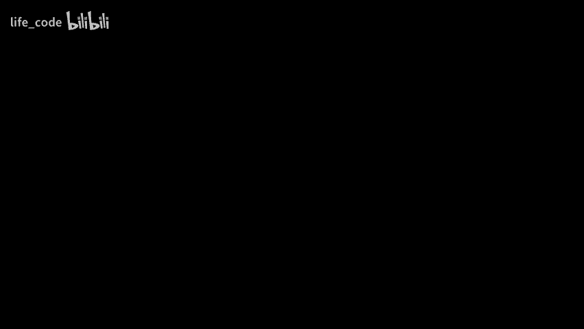
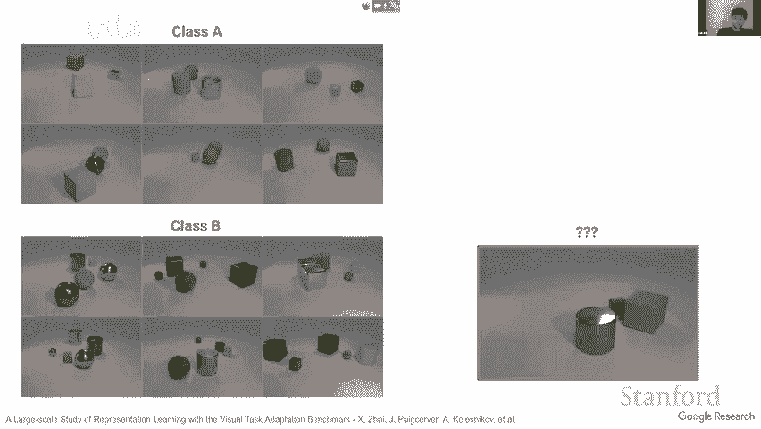

# P3：3.Transformers in VisionTackling problems in Computer Vision - life_code - BV1X84y1Q7wV

今天我将和大家讨论视觉变换器，因为这完全是关于变换器的，特别是它们在视觉表示学习中的应用。但在我们深入探讨变换器之前，我会花大约 10 到 15 分钟为大家提供很多背景信息，特别是关于视觉方面的思考，因为我认为你们看到的和将要看到的大部分内容将是关于语言的。

对，所以让我们开始吧，我和我的跨领域合作伙伴的目标是找到一般视觉表示，您很快就会看到这意味着什么。如果我们想象有一个一般视觉表示，我们可以做什么。希望通过这个我们能启动各种需要视觉输入的任务，这意味着当你睁开眼睛时基本上大多数你做的任务。因为如果你对所见有很好的理解。

然后你可以更快地理解发生了什么以及你应该做什么。嗯。最终我现在有一个小孩，自去年以来，我真的希望当他长大时，有某种机器人。它不需要像电影中那样漂亮，只需要可能是一只手臂或其他的，我的孩子可以教或者我的父母不能编程的可以教它做一些他们真的不想做的无聊任务，我相信其中一个组成部分是良好的视觉表示，它能够在视觉上普遍理解世界，这并不是所需的全部，但它是一个部分，也是我想推动的部分。

所以这是关于一般视觉表示的背景和动机，一个好的例子就是人类。我将向你们展示我所说的意思。这里是我给你们的一个任务。有三类，类 A、类 B 和类 C，我给你们每类五张图片，好的。😊。

这里我给你们一张新图。我相信到现在你们都知道这是什么类。我不会问，因为我实际上看不到你们，如果我在房间里我会让大家举手，但我相信你们现在知道这是类 A，好的，这没问题，我们在生活中见过数百万种花，但还有其他类型的图片，比如你们在生活中不常见的卫星图像，有些人可能从未见过，偶尔在飞行时或许在电视上或互联网上见过，但这很少见。

但依然是同样的故事，三类：类 A、B、C，每类五张图片，我给你们一张新图片。这可能比花稍微不那么简单，但我觉得我已经花了足够的时间来讲，所以现在你们大多数人应该知道这是类 B，这里是篮球场，对吧？

嗯。好了，现在更抽象了，你在现实生活中看不到这些，对吧。但我仍然给你展示 A 类和 B 类的图像，只展示两个，使其更容易一点，因为你需要在这里多动脑筋。我现在展示给你这个图像，我应该进行一些聪明的对话，让你思考。你会看到有一些框等等。我希望现在大多数人都知道这是 A 类，因为 A 类有三个对象，而 B 类始终是五个对象，无论它们是什么，长什么样。

好吧，我想到现在你或多或少明白我所说的良好的视觉表示是什么意思。通用的视觉表示，对，你的脑海和眼睛中有某种东西，使你能够迅速看到新事物，并通过少量示例理解正在发生的事情。

然后从中进行泛化。对，这就是目标。接下来的步骤，如果我们有目标，如何衡量朝着目标的进展？这是我们几年前与我的合作者完成的一篇论文，我们称之为视觉任务适应基准。这是一种对我们刚刚进行的小游戏的形式化。

所以这是一个基准，参与基准的你或任何人都需要做一些事情，那就是用一些数据创建一个模型，我们并不太关心是什么数据、什么模型和其他细节。只要在家里与母亲在一起。然后我们会有一个所有可能的视觉任务的全景，这些任务在逻辑上是有意义的。😊，这虽然是个模糊的说法，我们从中抽取了一些任务，这就是你刚才看到的那些任务，实际上是从这个任务适应基准中提取的。我们初步制作了 19 个这样的任务，试图涵盖各种类型的视觉任务，不仅仅是像这些狗和猫这样的自然图像类别，还有非常专业的图像，如卫星图像，以及涉及计数的非分类任务，比如我之前给你展示的那种，但可以用这个简单的分类 API 表达，虽然逻辑上需要更多思考。

😊，某些事物如距离，我们有与汽车相关的内容以及最接近的汽车的距离等。这应该涵盖广泛的变化范围。然后，借助你所提出的模型和这个基准，你可以对每个数据集逐一进行一些适应步骤。

同时，这实际上并不重要。但结果应该是，你拥有一个模型，基于这个数据集，它非常聪明，它仅仅见过每个类别的几个示例，然后能够在这些任务中表现出色。然后我们只是计算所有这些任务的平均得分，这就是我们所称的 VTAP 任务，这也是我们目前判断你的模型和适应算法的通用视觉表示能力的方法。

现在只是关于一些神经网络的准备，我们经常使用“预训练”这个词。有时我们称之为上游，比如上游数据、上游训练，等等。所以我可能会将这个词与预训练互换使用，然后还有第二部分，我们通常称之为迁移，有时我们称之为下游。对于我们的适应来说，原则上是你想要的任何东西。

但对于我们的工作，我们几乎总是使用非常简单的微调，而没有任何复杂的花哨，因为它简单且通常效果良好，我们尽量做到尽可能简单，同时仍能良好地工作，因此有时我甚至会说像“微调”，当微调时，这意味着从预训练迁移到迁移。

😊，好的，到目前为止的设置还不错。那么问题是我们如何达到这个目标，我们花了很多时间思考这个问题并尝试不同的方法，这也大致是我可以讨论的内容大纲，但这并不意味着我们会涵盖所有内容。

😊，所以我不会完全按照大纲来讲。但你会一次又一次地看到这个，当你看到视觉变换器时。你的变换器稍后才会出现，还有一些内容在那之前。😊。所以这个只是非常快速地提一下，因为这对于本课程来说并不重要。

我们花了一些时间尝试自监督预训练，这在语言处理上非常流行，而在视觉领域最近几年也变得流行。它并不是以这种方式运作，你不需要理解这些条形图，但基本上越高越好，看看蓝色的部分，那是 VA 得分。

在这几短时间内，自监督学习的表现就像这个条形图，我们尝试了多种方法和多种模型等等，这是一个相当好的基准，但这是几年前的事情。然后我们转向半监督训练。也就是说，一些带标签的示例和大量的未标记示例，这就是下一个蓝条。你能看到鼠标光标吗，抱歉？我们看不到鼠标光标。也许我需要做一些调整。

可以的。是的，然后这个半监督的蓝条比另一个蓝条高得多。这对我们来说意味着通过添加一些带标签的示例，我们能够获得更好或更通用的视觉表示。😊，然后我不会再花更多时间在这个问题上，以及具体是如何进行的。但我将转向下一个，这对我们来说是一个突破，当我们发现如果我们只保持完全监督的预训练。

然后我们得到的表示比之前见过的所有内容都要好得多，我想在这里稍微花一点时间讨论这个，因为它是使用视觉或将我们转变为视觉的前奏。😊，所以很简单，网上有大量的图像，这总是你听到的自监督或无监督学习的动机，对吧。

但实际上这些图像来自哪里，几乎总是有一些额外的信息，比如在网络上围绕图像的信息，或者如果你以其他方式收集，那里的某些额外信息可以作为一些弱信息源或弱标签，对吧？

😊，然后在谷歌有一个团队实际上为生产做这件事。他们已经收集了一个大型数据集，并且有一些管道可以从周围信号中有些自动但非常嘈杂地标注图像。我们想弄清楚，当我们扩展讲道时可以走多远？

然后长话短说，你需要几个成分。一个是耐心。我非常喜欢这个图。这是一个关于在大数据和大模型上预训练的曲线。好的，细节其实并不重要。只是在我缩放到这个小框时，我看到这里，这是训练的指标，像是我在花费八个 GPU 周的计算后看到的上游性能。GPU 周是什么意思？它是指八个 GPU 工作一周，或者，抱歉。

一台 GPU 工作八周，或者八台 GPU 工作一周，或者十六台 GPU 工作半周等等，对吧？但是这看起来合理的人会说，嗯，八台 GPU 一周没有进展，这就是平的，我要停止并尝试别的，但我们并不合理。所以如果继续进行，这是经过八台 GPU 一个月训练后看起来的完全相同的地方，你可以清楚地看到事情在进展。因此，这可能并不总是显而易见，你需要耐心。

第二件事是你实际上需要扩展所有内容，这项工作是用残差网络完成的，而不是用变压器，正如你在这里看到的很多残差网络模型，X 轴是可用图像的数量，在视觉上有这个 Imagenet 数据集，这是一个非常常见的数据集，包含 320 个。

300 万张图像，还有一个包含十倍更多图像的仍然公开的数据集，然后有一个来自这个内部组的子集，包含 3 亿个标注的图像。所以 Y 轴是某些任务的准确性度量，我们尝试了很多，它们看起来都很相似。

点的大小不同，蓝点是标准的 ResNet 50，大家都在用。如果你用更多的数据进行训练，开始看起来很有希望。但如果你用更多的数据看起来，这似乎并不太有用，这也是大多数人很长时间以来一直在做的，很多人甚至在谷歌的人都说，嗯，我在这种数据上尝试过这个内部检查点，它实际上没有太多。

然而，我们发现的并且事后看来有点明显的是，你实际上需要不仅扩展数据，还需要扩展模型。这蓝点是一个巨型的 ResNet，慢得要命。但当你与数据一起扩展时，你会持续受益于添加更多数据。如果你做到这两件事，扩展所有内容并耐心，耐心也可以是。

确实是大幅提升你的患者。嗯。这样你会得到很多好处。所以这里有几次迁移学习的示例。我之前展示的，X 轴是模型的大小，Y 轴是这些任务之一的准确性，但其他的任务也是类似的，这三条不同的曲线是用不同数据集大小预训练的，绿色的曲线是标准的，从较大的模型上你并没有看到明显的好处或只是小幅的好处，蓝色的曲线是十倍大。

你开始看到一些向上的斜率，但实际上只有在这个巨大的数据上。当你在更多数据和更大的模型上进行预训练时，几次迁移学习的表现会越来越好。😊，第二个好处我们完全没有预料到，但后来发现的是，这些模型在一切规模提升时非常稳健，这个对象网络。

这是一个专门设计用来测量稳健性的数据集，它展示了一些奇怪的情况，比如椅子在浴缸里，你应该识别出这是椅子。这里的粉色点基本上表示现有模型，而“确切的”则是模型的大小，粉色点是文献中的现有模型，然后这些线同样的颜色编码是我们发现的结果。

再一次，你会看到大量数据，然后使用大模型会在这个案例中提供惊人的好处，特别是在分布稳健性方面。😊，好的，所以这一切都是在惊人的规模上提升，一定要耐心，获得巨大的好处，对不起，卢卡斯，打断你了。

不过，班上有个学生的问题，对吧。😊。你想自己解开静音提问吗？

是的，我可以问我的问题，大家能听到我吗？也许还有其他人可以，我们能快速离开一下吗？所以我想知道的是，在预训练结束后，已经做了什么工作来表征参数，激励这个问题的原因是。

看起来我们做了大量的预训练。但似乎如果我们有更聪明的初始化方案，就可以显著减少这一点。是的，你知道，我其实想了很久这个问题。最后我得出结论，我认为不是。😊，我认为有两个部分，一个是我喜欢称之为权重数字的“手段”。

你知道一切都在一个合适的范围内，以便可以有良好的输入输出函数，并且你的优化器可以执行步骤，使输入输出函数的变化是合理的，但又不会太大等等，我认为这是其中的一部分，你可以通过良好的初始化或归一化来实现，但我也认为这些模型确实记住了很多东西，然后。

😊，个人认为，但我没有证据。或者说这些模型的确是做更多的事情。你知道吗？记住它们在训练中见过的东西的相似性，随着你不断发展，它们的记忆也会增加，它们见过的东西也会更多，因此它们在处理更新的内容时应该表现得更好，因为它们见过更多相似的东西，而我认为你不能仅仅从初始化中创造出一个。

但我现在脑海中没有立即能想到的要点或论文来回答你的问题。谢谢。我想我们还有更多问题，或者在聊天中发布了问题，有人举手，也许在这个音频中你想提问吗？

是的，当然可以，我只是想对这个图表进行快速澄清。图表编号三，bit L 和 bit N 以及 bit S 是同样的模型架构，但只是训练于不同的数据集，所以 bit S 是在 130 万到 3 亿的图像数据集上训练的，针对 bit L。

是的，不，架构在 x 轴上，所以在一个垂直切片内，这些是相同的架构，然后不同的点是随机重启，因为当你进行未来学习时，看到的几个示例之间会有很大的变化。然后，接下来的垂直切片是相同的模型，依此类推，随着你向右移动，模型会变得更大，因此你可以看到对于这小数据集来说，变大模型并没有太大帮助，只有在这个巨大的数据集上，这意味着巨大的数据不一定是在这种情况下的巨型模型。

😊，没错，这很有道理，谢谢，好的。你有问题吗？我看到你也举手了？

喂，个人你好。嘿，好的，谢谢。上游性能的直觉是什么，图 1 突然激增是为什么？

我想在训练中有 3 个点，对吧？是的，确实是。再次说，像第一轮。我不知道，这似乎就像一个看起来不错的训练曲线，嗯，那背后的直觉是什么？这是老派计算机视觉的东西，几年前是这样的，当学习率发生变化时，在计算机视觉中，通常很常见的学习率是阶梯模式，所以一段时间是恒定的，然后你停止，把学习率通常除以 10，然后继续，这会给你带来巨大的跳跃。如今人们不再使用这种方法了，我想这项工作是三年前的事，或者两三年前，我不记得了，那时这非常常见，而如今人们使用更连续变化的学习率计划，因此你不再会有突然的变化，但是如果你叠加它，结果会更连续，但大致相同，而在语言上，我认为大多数人或许许多人在使用。

😊，他们只是在逐渐减少的学习率调度，你也看不到这种效果，因为学习率持续下降。是的，听起来不错，谢谢。那么这是因为你问了这个虚线。实际上这里，如果你在这里，好吧，你可以说，好吧，但这太过了，对吧。也许它确实看起来几乎是平坦的，也许你可以更早地开始学习率，然后你会得到相同的效果，但更快，而这显示了那样会发生什么，最后你会落在一个比耐心训练时更糟糕的地方。

😊，好的，是的，没错，谢谢。还有其他问题吗，还是我继续？你有什么答案，因为我需要提到，我看不出我似乎像。是的，没关系，我们可以协调一下，卢卡斯。嗨，是的，我只是想确保我和你在同一页上。因此，基本上你要做的是与卷积神经网络/LSTF 的多任务学习，对吧？这有点像 ResNet。

但是你在做多任务学习，对吗？你知道，多任务来自哪里，或者它是什么？因为最初你展示了不同的。我明白了，所以有两个阶段，第一个是预训练，而这个预训练我没有提到。我只是说我不在乎你在预训练中做什么，只要以某种方式进行预训练，然后给我模型，然后我在多个任务上独立测试它，测试多个任务意味着将其转移到那个任务上，在我们的情况下，这意味着仅在该任务上进行微调，看看效果如何等等，但这可能意味着其他事情，比如后来我们转向在每个任务的嵌入上学习线性回归，而现在进行预训练时，你所做的就是常规的监督学习，只是将一切规模化，常规的监督学习就是这样。

😊，好吧，不是多任务，而是多标签的意思，一个图像可以有几个标签或者没有。但它通常不会有这种少数标签，明白了，谢谢。是的，关于这个问题我只是想快速跟进，而不是关于讨论，而是开始时谈论它更像是优化或者更多地是记忆预训练数据集中的数据。所以我知道在语言方面，有一个很有趣的现象，你可以在一个没有任何语义意义的合成语言上进行预训练。

但它只有结构性的配对前提或类似的东西。实际上，这几乎给你在下游迁移中与正常预训练相同的提升。因此，我想知道，比如说，这意味着对于语言，结构似乎贡献很大，可以通过利用来替代。但是我不知道在图像方面是否是不同的情况。

也许有人做过一些合成预训练数据集，用于图像，有一篇论文我忘了名字和作者。但它创建了完全合成的图像，甚至不是一些现实事物的渲染，而只是完全的图案。

波形和形状等，并用它们进行预训练，然后显示它们几乎获得了与图像相同的性能，实际上他们用视觉变换器做到这一点。但。是的，他们从未进一步发展，或者不在这里。你知道。他们几乎可以到达这个点。然后不清楚你能走多远。我认为可能没多远。

但我只是猜测它们不太可靠，我没有证据。因此我有一个问题，然后我们可以继续谈论，我们认为大型视觉模型在某种程度上就像是在学习它们所训练的数据集的相似性，你觉得它们在某种意义上像原型网络吗？

它们是这样的网络，所以像原型网络本质上就是当你进行少量学习时。你只需说我将学习一个网络，我可以学习度量空间。😊，可能不完全如此，但接近。嗯。我是说，我真的不能说，因为这只是我的一些直觉猜测。这就是它们的工作方式，但没有人真正知道它们读取的模型。😊，嘢啊。我是说。

当我们使用这些预训练模型进行原型网络的未来学习时，我们的表现确实比进行微调时要差得多，所以还有更多的东西在这里。然而，我不知道。这更多是什么？好的，谢谢。好吧，继续。好的，是的，所以。对。我没提到，但像 INe 这样，这是计算机视觉领域的顶级基准，与这项大规模转移工作相关。

最终我们能够提高分数，在经历了几年的没有改善的漫长时期之后，但许多附件让你看到成绩，太棒了。很棒的预训练，扩大一切并利用数据，然后好吧，我们不关心这个。

😊，是的，没问题，这只是一个小插曲，如果我们处于我提到的在大量数据上进行预训练然后在许多其他任务上测试的设置中。当然，你应该小心不要在你的预训练数据中有来自其他任务的图像，否则你就会看到并训练，这样你实际上并没有真正的泛化，你只是通过良好的分数自我拉高，这在我们处理大量数据时是一个真正的危险，因为这些图像可以完全包含在大量数据中。所以我们实际上使用内部管道。

它在寻找重复项以及新重复项方面表现非常出色，比如当它们被移动、旋转、压缩、颜色稍微变化时，它仍然能够找到，我们利用这一点完全移除了后续测试数据集中所有的图像，实际上我们发现许多经典的视觉数据集在训练集和验证集之间有明显的重复项。

😊，例如 ImageNet 和 CIFAR10 等测试集。因此，近重复是视觉中一个相当普遍的问题，这张幻灯片只是想说，有问题，但在我们所展示的所有内容中，我们实际上尽可能地确保在重复训练中没有近重复项。

嗯。现在回到我们发现大数据和更大模型的问题，然后事情变得真的很好，这就是我们如何在计算机视觉中走向变换器的。多年来，一切都是卷积网络，基本上没有其他方案。然而在语言处理中，我们最近看到了变换器的出现，曾经到处都是 LSTM。LSTM 曾经是王者，然后变换器来了，当可用数据量很大时，变换器的表现突然好于 LSTM，但在数据较少的情况下，情况并不是这样。

😊，所以我们当时想，既然我们现在拥有大量数据，我们能否从中获得好处？如果我们尝试变换架构和视觉，能否获得更多好处？这基本上就是我们所做的，第三方也有一些其他尝试在此之前并未使用变换器，我不想在这里详细说明，因为我不想过于指责，但他们实际上并没有真正利用变换器从数据中学习，总是先从某种结果中提取信息，比如目标检测提案或高度特征图之类的，然后在上面加一点变换器。

但是我们想要完全使用变换器。因此我们想出了最简单、最自然的应用变换器于视觉的方法，就是你获取图像，将其切割成两部分，就像拼图一样，分割成补丁。

就这样。每个补丁，你将其提取并投影到你的嵌入空间中。这个空间是变换器的输入，嵌入空间只是一个抽象空间，假设有 768 维度。例如，你如何进行嵌入？你只需取像素值并在其上加一个线性投影层，获取所有像素。😊，将向量展平，矩阵乘法转换成你想要的任意大小，并对其他补丁使用相同的矩阵。

然后我们就以最简单的方式进行了处理，使用不重叠的补丁和你能想到的一切，后来人们开始说：“嘿，这几乎就是卷积，让我们做一个真正的卷积，堆叠它们之类的。”但这是我们自然的方式，这只是最简单的做法。😊接着，我们有了这些嵌入补丁，我们将它们视作语言中的令牌，然后将它们传递给来自语言领域的鸟类变换器，正如在语言中，我们添加了这个类令牌，或者我认为语言中有一个句子结束令牌之类的，并且我们将位置嵌入添加到可以学习的令牌中。

然后我们将所有这些数据输入到一个变换器编码器中，编码器有一个 MLP 头部，它读取这个类令牌，然后将其映射到 softmax 层进行分类。例如。这就是视觉变换器。所以字面上讲，你拿到的是鸟类变换器，但不是单词或句子令牌，而是将图片转换为令牌，仅此而已。

😊，然后就像之前一样，扩展所有的计算、数据集、模型规模、耐心。一切都看看会发生什么，这是好还是不好。这就是问题，现在我们可以看到这里的图表，这是与之前类似的图表，灰色区域实际上是之前所有小点的位置，现在气泡是不同大小的视觉变换器，气泡的大小有点难以准确说出，你首先可以看到的是，在数据量较少的情况下，imagenet 是第一。

300 万张图像的情况下，它的表现不如 resnet。😊所以如果我们不相信这个想法，只是尝试一下：“好吧，这是个糟糕的主意。”而 1300 万张图像似乎并没有那么遥远。然后 10 倍更大的数据集开始与 resnet 在同一范围内，当我们进入更大的数据集，使用更大的变换器时，我们实际上开始超越 resnet，并且我们只是略微超越了它。但这个 resnet 确实很难获得，而且非常笨拙、缓慢且庞大，所以我们对此感到非常兴奋。

现在我们进行了更多的控制研究，内容包括使用这个相同数据集的子集，并且有很多曲线。但基本上，只需关注深灰色和浅蓝色这两个曲线，它们大致上在速度和使用方便程度上是相似的，稍微有点笨拙或容易使用，这是一个 resnet 变体与视觉变换器的比较。你可以看到，当我们数据量较少时，视觉变换器真的很差，相比之下，resnet 表现得更好，但随着数据量的增加，实际上视觉变换器开始超越 resnet，这非常有前景，因为我认为现在看起来巨大且数量庞大的东西在五年或十年后会发生改变。

这可能是十年前的常态，这个数据量看起来庞大而且不再正常。😊所以我们应该展望未来，这看起来对未来很有前景。然后回到同一基准，这是另一个小跳跃。是的，我们有一些问题。嗯。😊还有这个关于我的部分。😊所以，这样的顺序。

如果你想解除静音并提问，可以的，好的。我认为 Deval 已经回答了部分问题。但我想知道，在这些转换的输入中，当你将图像切割成小拼图块并将它们组合时，输入这些补丁的顺序是否重要，如果你改变顺序。

预测可能会改变吗？是的，这是个好问题。实际上，我有一张幻灯片谈论类似的内容，但不是完全相同的。让我跳过去。首先，如果训练期间顺序是一致的，对吧？并且对于每个新图像，你不再打乱顺序。

那么，这实际上是完全相同的，你得到相同的曲线，所有的说法，因为我们反正不编码顺序。如果你在训练期间总是开始随机化顺序，那么性能会大幅下降。让我给你展示为什么，幻灯片是我原本计划展示的。如果你问我们跳到这里，这些是位置嵌入的可视化。

😊这意味着什么，在这种情况下，我们将图像切割成 14 乘 14 的补丁。所以这也意味着我们有 14 乘 14 的位置嵌入，尽管我们只将它们视为一个连续的序列，是什么，00，50 多，或者我不知道，140 多。现在，这些图片展示了与该位置对应的嵌入，它与所有其他位置嵌入的相似度。比如看这个，黄色表示完全相似，正好相同，蓝色表示在余弦相似度方面相反。因此，这个位置嵌入与自身最相似，就是这里的像素，然后邻近像素与最初对应于邻近补丁的位置嵌入的相似度。我们确实看到一个非常明显的模式，每个位置嵌入与其周围补丁的嵌入非常相似，而我们并没有实现任何这些。我们只是将这些位置嵌入随机初始化为变量，并且它们像模型的其余参数一样自由学习，但它们学会了恢复邻近补丁是什么的概念，尽管我们在任何时候都没有提供这些信息，只是在原始图像数据中给出了任务去分类。

这真酷，我认为，但这也意味着，如果你现在拿到训练好的模型并以完全不同的随机顺序输入补丁，它的表现会很糟糕，因为这些学习到的位置嵌入不再有意义。😊

我们也尝试实现像位置嵌入这样的东西，它通过我们硬编码的位置来编码位置，还有其他花哨的相对位置嵌入。但基本上没有任何一种真的优于自由学习的，而自由学习很简单，你只需随机初始化，让它作为 SGD 的一部分学习，就是这样，所以我们就这样做。

我们还有一个问题。嘿，没错，我在想要读这个，对，就是这一页。我觉得非常有趣的是，我们在谈论数据的扩展和思维模型的扩展。但似乎你在继续这样做时，达到了一个瓶颈。所以我很好奇你对此是否有任何想法，是否这些点看起来就是这样，或者说有什么最佳方式可以做到，让我们继续，无论是关于数据的预训练还是你实际上无法获得的参数。是的，我还有另一张幻灯片，但在演讲的后面我想先不跳到那儿，如果你不介意，然后也许在 10 到 15 分钟内我们会到达那儿。

听起来不错，谢谢。是的，但也许有点乐观。最终似乎变压器在这里有更好的斜率，而 resnet 较早达到平台期。😊 对不起，卢卡斯，我不是故意打断你，在我们继续之前还有其他问题吗？是的，我可以快速问一下我的问题吗？对不起，我好奇的是，这个 VIT 和一个卷积网络相比怎么样。

比如说，Resnet。与一个注意力机制。这个结构的变压器和它特定的运作方式有多少是由此造成的，还是仅仅是普通卷积网络没有接触到的注意力的好处？是的，这个问题已经被尝试过很多次了。我知道的第一次其实是来自于我错发音的名字。

但我指的是 Resnet 的发明者和他的一些同事。他们称之为非阻塞网络。我认为这是在变换器论文之前的事情，如果我没记错，他们基本上在 resnet 的各个位置插入了这些块，然后展示了改进。但那只是微小的改进。那是个很酷的块和一篇简单的论文。

但这并不值得。而人们通常将注意力放置在像素上，你可以想象，如果你仅仅在像素上放置注意力，而不进行这种切片处理，这样计算成本太高了，对吧，如果你有 2 到 4 乘 2 到 4 个像素，那就是。是的，我无法在脑海中计算，我不知道大约是 40000 个像素对着 40。

000 个其他的办法不起作用，所以人们只在 resnet 的非常高和最终层中这样做，比如在 7x7 的地方，然后他们在那儿稍微添加一点注意力。但这样你实际上并没有获得太多好处，因为它本质上仍然是一个 resnet。

在 ResNet 中，有一个被称为 Sic S 的模块，这个模块变得非常流行，并且在很大程度上改善了 ResNet。这也是一种注意力的形式，但很好地针对图像进行了调整。我并不是在争论这个。但是，是的，它已经被多次尝试过。但它并没有显示出像……那样的缩放好处。

所以我觉得我在这里遗漏了一些关键的东西，就是你只是收缩，或者说在计算上是困难的。但最终，你处于 ResNet 的低层。但是为什么这与在视觉变换器中做一个注意力层有什么不同？

因为我们先切割了补丁，所以可能有 14 乘 14 的补丁，这并不是很多。好吧。但我有点困惑，你可以想象在不高的层次和不高的层次的 ResNet 中，而是在你应用了一两个卷积滤波器后相对真实的一层。卷积层，打扰一下，那么你会得到一些与补丁大小相关的东西。

这仍然是早期层的 50 乘 50，而 50 乘 50 显著少于 400 乘 400 或 100。可是仍然是 2500 个 tokens 在关注 2500 个 tokens，是的，我的意思是，这很多，但不能相提并论。我不知道。好吧，酷，谢谢你。是的，我的意思是，可以尝试。好吧，也许你问题的另一个答案是，我们慢慢接近我下一张幻灯片，在一系列问题之后，我们确实尝试了一些几乎就像你所说的，使用非常小的一部分 ResNet，然后在其上放置变换器，但是真正的全变换器编码器，而不仅仅是撒上一些注意力层，然后继续列等等，这是这个过程，我们称之为混合，但这几乎就是你所说的，实际上是来自 ResNet 的一些早期层，数量不同，然后贴上整个变换器编码器。

😊，而且这个。似乎也能很好地工作，尤其是在这种情况下，计算量不大，所以对于小的计算来说，它似乎表现不错。但是纯 ResNet 的缩放行为稍微好一些，所以我们关注了这一点。我认为我们后来也尝试了混合进一步右移，结果稍微低一些，但那是在论文之后，所以不在这个图上，我刚从论文中放出来，但你可以在这里看到趋势。

嗯。是的，如果你不完全缩放到顶端，那么这样做一点 ResNet 然后再加上变换器的编码器是完全合理的。你想问你的问题吗？是的，我只是想问一下，基本上，论文中有一个关于微调和高分辨率的简短部分。在这种情况下，预训练的位置和嵌入，抱歉，或者说是偏斜的，对吧。

然后基本上它说你们就像是在插值。你能谈谈这个吗，比如你是怎么插值发生的事情。对，实际上，当我今天早些时候查看幻灯片时，我就想，哦，最好有一张关于这个的幻灯片，而且我们在论文中也没有好的可视化。

因为这有点难以解释，但这是最好的起点。所以如果你想提高图像的分辨率，并且保持补丁大小固定。这意味着你突然有更多补丁，对吧？然后正如你所说，时尚嵌入，比如你到底用什么作为位置嵌入。

对，基本上你可以看到这里我们看到它们学习了一个非常规律的结构，对吧。我们并不知道这些位置嵌入的结构是什么。我们只看到彼此之间的相似性，且非常规律。因此这给了我们一种直觉，我们也许可以将它们想象成这些框。

它们分开，并且在它们之间出现新的框，它们只是周围的插值。这基本上就是我们对位置和嵌入所做的。我们在缺失的地方创建新的，因为我们需要更多，通过插值周围的，或者更准确地说，我们基本上将它们视为一张图片，在这种情况下是 14 乘 14，有 700 多个通道或者其他维度，然后我们基本上像通过近邻插值那样调整这个大小。

这样我们就能在我们不理解的位置获得更多新位置。它们遵循与已学习位置相同的模式，只是基本上分辨率更高。点过去。是的，这是个好问题。那么当你创建输入时，现在你正在进行 aject。最近首先。有没有工作做到这一点，一切都很奇怪吗，彼此之间非常接近？

是的，有很多话。他们尝试了各种奇怪的东西。其中我最近特别喜欢的一个是，早期卷积帮助变换器 C 更好，或者类似的东西。他们基本上说，好吧，代替这个线性投影。代替这个大的线性投影。我们用一个三乘三卷积堆叠来替代。

然后它们之间还有非线性关系和归一化。但总体而言步幅与补丁的差异是相同的。因此，结果将与在这个补丁切割后和投影后的维度相同。然后他们展示了。😊，据说这在优化上会稍微简单一些，因为更优化的设置是好的设置。

在许多场景中，它的表现是相同的。但更稳健地达到这个效果。而且他们也展示了一些场景，在这些场景中，它的表现更好，比如说。当在更多数据上进行预训练时，似乎表现得更好。嗯。我还没尝试去复现它，我并没有完全复现出来。

但我目前还没有看到和论文一样的好处。不过这并不意味着论文是错的，只是我还没到达那个点。这是它们的一个例子，还有其他论文也做了类似的研究。不过我发现这一篇尤其有趣，因为它简单。谢谢。好的。

继续，我们没有更多问题。那么，看看吧。是的。我还有三条来自论文的有趣细节。然后，取决于你想要更多讨论还是更多内容，我有更多内容。比如关于，是否在这里达到饱和的问题？嗯。好的。

所以我们在论文中有的另一个有趣的点，但它被埋在附录里。现在，其他人也对此写了后续论文，实际上是这样的。我们应该如何扩展这些变压器，对吧，变压器的高层形状。有很多设置可以选择，我们实际上尝试了很多。

所以我们从一个合理的中等规模的变压器开始，建在中间。然后我们逐一改变一些参数，这样我们总是将计算量翻倍。所以，比如说。这条粉色线。如果我们在这一点向右移动，宽度就增加了。😊。这样我们就双倍了计算，X 轴很简单是计算量。

相对于这个起始点，我们有所有这些不同的设置，宽度。即进行细胞功能计算的向量的宽度。基础模型为 768，其他模型则更大或更小。就像我所看到的那样。扩展这一点似乎不太有前景，因此我们并没有扩展得太多。

还有其他一些东西，比如多层感知器的宽度，或者有人称之为这些注意力机制中的一对一卷积，这似乎扩展得更好，这部分橙色我实际上很好奇它为什么会向左移，我不记得了，不知道它是否隐藏在某个地方，或者是否只是没有缩小，但任何风险还有另一个要扩展的东西，在文本的变压器中不存在的是补丁大小，当你缩小补丁时，你会从一张图像中获得越来越多的标记，从而获得更多的计算能力。

这是绿色的部分，似乎也很好地缩放。然后深度是一个有趣的点，是黄色的部分。这是编码块的数量。随着我们扩展，起初似乎很棒，这正是你想扩展的东西，但随后似乎停滞不前，如果你减少深度，它的缩放效果真的很差。😊，所以减少深度并不是好事。然而，如果你想通过较小的模型，宽度似乎是一个可以减少的好点，然后蓝色则是将所有内容一起缩放，使得计算大致保持相同的数量。

这似乎也能很好地缩放以及其余部分。这些相对简单，至少在概念上。所以我们喜欢这个。因此，无论何时我们扩展或缩小模型时，我们都这样做。😊，嗯。我非常喜欢的是推理速度，因为如果你有 2 到 4 像素的图像大小，这实际上意味着你有 2 到 4 乘以 2 到 4 的像素，对吧？

所以如果你有，然后用 16 乘 16 的补丁进行补丁化，比如补丁大小。然后你有。😊，14 乘 14 的补丁。所以序列长度实际上是 150，对吧？然后在序列长度之上，你有自注意力操作，这又是平方的。因此，整体上与图像大小相关。

自注意力操作是四次方的，Zip 称之为“quatic”。所以这真的很糟糕，任何看到四次方的人都会说你在做什么，这永远不会。于是我们检查了在我们操作的图像大小下实际情况如何，这就是我们看到的，A 轴的速度基本上就是推理的速度，X 轴是输入大小的变化。😊，所以这意味着目前看起来还不算太糟。

当你来到 512 到真实的 LA 时，你会发现变压器实际上下降得比重定向多得多。但在这个合理的图像大小上，我们称之为非常典型的。实际上似乎还不算太糟，所以我们还没有遭遇到那个可恶的大老虎。但随着我们规模的扩大，这可能会成为一个问题，并且有很多后续工作在努力改善这一点。

对，没错。这是来自原始论文的最后一部分，它关注输入引用的感受野大小。那么在自注意力操作中，头部通常尝试多远？在 X 轴上，我们看到网络的层次，右侧更接近输出，类，左侧则更接近输入的补丁。😊

Y 轴是平均距离，我想是整个验证集。自注意力的效果如何，这意味着自注意力的峰值或最大值，权重是多少，像这样的东西。😊，嗯。每个狗是不同的头，因为我们可以使用多头自注意力，对吧？所以这表明，在早期层中，实际上有一些头是看得很远的，但也有很多头是看得很近的，所以是局部的，随着我们深入模型，我们只剩下平均看得更远的头。

😊，所以。这只是一种分析，没有立即采取行动的内容，但看到早期层学习的是局部邻域和全局之间的混合，后来层只关注全局，这很有趣。😊，对。所以这是关于原始视觉变换器的。嗯。

不，我不知道我们想让我继续说多久或讨论，我有几个选项可以谈论，其中一个项目是进一步的扩展，这个项目也有答案。如果你不想听剩下的内容，我也可以直接跳到答案，但对于“它是如何继续向右的，我们是否在分离”的问题，还有另一个项目是关于如何在没有大量数据的情况下训练视觉变换器，你还可以这样做吗？

这样做是否合理，还是可能根本不合理。这可能有点不相关。我们不谈这个。最后一个就是我谈了很多关于在大量数据上训练大型模型的好处。好的，这很好，这就是我们如何得到一个好的模型，但实际上使用一个巨大的模型一点也不好玩。就像它不适合你的 GPU，你需要多个 GPU 才能使用。所以人们不乐意使用它，通常还是会回到小模型。

即使你知道像大型模型应该更好，我们能对此做些什么呢？😊，嗯。这是我们另一个项目的主题。所以，我会说这取决于你们想做什么，或者如果你们有很多问题，我们现在可以继续提问，因为我认为原定的一小时时间快要结束了。

好的。所以我认为一个建议是，我们可以继续讨论，并且我们还会录制它，这样那些错过的人可以去看一下。所以我们可以这样做。是的，另外有两个人举手了，我们可以。好的，问我们问题吧。

在你们之后。打架隐藏的方式。你们想问你们的问题吗？是的。我有个很基本的问题，所以如果一个物体位于补丁之间的边界，这是否会影响模型的性能？是的，我的意思是，那不是一个基本问题。这是个好问题。有多种答案，一个是我们没有特别去测试这个，确实在一些受控的环境下用一些训练过的模型测试一下会很有趣。另一个事情是。

当你有像 3 亿张图像这样的庞大数据集时，这简直是疯狂的数量。我曾试图概念化 ImageNet 的百万张图像，我想我做过计算，如果你去查看每一张图像，每张图像停留几秒钟，你可能会坐一个月左右，不太记得了。

但是 3 亿张图像简直是疯狂的庞大，此外，我们确实使用随机增强，比如随机裁剪图像。因此，我认为这是你在训练中看到的对象不落在区域上的默认情况，如果你在这里看，基本上这是标准模型，像 14 乘 14 的区域大致是这个大小。

然后一个对象通常会散布在多个区域，因为在典型图像中，物体相对较大，人们不会拍摄对象在角落里的微小图像。因此，这是你在预训练中看到的默认情况，我相信模型就是这样学习得更好的。

然后对这个问题的另一个回答是，好的。也许如果你做一些比这种非常粗糙的区域切割更好的事情，比如我提到的这个卷积的堆叠，可能这甚至会更好。谢谢。是的，你提到过，或者变换器，或者至少你在论文中提到过。

他们笑着说，地方性。嗯，我只是想，这些算不算？嗯嗯。尤其是当你在……为什么会这样？你个不说。嗯哼。😊，嗯。音频不是很好，但我相信我理解了问题，就是我们说变换器缺乏地方性偏见或先验，或者其他什么的，为什么这甚至是我们想要的呢，对吧？

如果我们的模型是关于图像的，难道不想了解地方性吗？是和不是。所以这就是我一开始给出背景的原因，这一切都是关于当你扩展事物时会发生什么。具体来说，理想情况下，至少在我们心中，我们希望有巨量的数据，我们相信随着时间的推移，这种数据只会不断增长。

然后我们希望模型尽量少地内置我们的思维，因为我们认为好的解决任务的方法实际上可能并不是最佳的解决方案。你知道，也许可以类比一下，比如 AlphaGo 的一些举动，专家们会说这很疯狂。这是一个愚蠢的举动，但实际上却更好。以类似的方式。

我们希望尽可能少地编码到模型中，这样如果我们抛出大量数据和困难任务，它可能会发现一些我们之前没想到的更好的东西。😊这是我们的做法，因为我们相信，就像我提到的，我认为已经。

现在看似庞大和过度的事情，在五年左右将成为常态。所以我们希望去看看方向是什么。然而，如果你只是想让某个东西现在工作，而没有大量数据，并且因为某种原因不想使用预训练模型，那么。总是使用预模型，但如果你不想，那么相信你的一些先前直觉和知识是有意义的，比如局部性。

😊，嗯。我希望这回答了你的问题。假设这是一个 PowerPot。或者我们关于的某种观点。谢谢。我们是说任何视觉任务，难道不是这种情况吗？像我不知道。也许我没看到那样。正是这就是为什么我们不想要食物的原因。你可以对此做更详细的阐述，但为什么我们不想要呢？

像局部性或者什么翻译那样。嗯，理想情况下。我们希望模型有足够强大的能力去学习这个概念本身，如果它对于解决任务是有用的。如果对解决任务没有用，那么。如果我们硬编码它，模型就没有办法不这样做，对吧？嗯。这理想的结果在某种程度上是相似的。

此外，在语言中，你知道，不编码从左到右的文本方向似乎毫无意义。就像在 R S 中。但接下来出现变换器，结果却并没有那样。如果你给它大量数据，它的效果会更好，并且能够恢复这些，加上一些更灵活的变体，或者像这样的东西，对于调查任务来说更好。

所以基本上，人类是。我们并不聪明到能够以最适合任务的方式设计这个东西。我们宁愿给它所有的灵活性和它解决任务所需的所有数据。我真的认为这是一种接近的哲学。我并不是说这就是唯一正确的方法，对吧。

好的，所以我们还有大约七分钟的时间，直到谈话的预定结束。而且，卢卡斯。我们也想关注你的时间，因为你那边是晚上。所以我们可以做的一件事是，我现在没有看到更多的问题，所以你可以实际浏览最后几部分，可能跳过细节，只讨论最终结果。我将这两个放在高层次上，那两个仍然非常与变换器相关，并回答之前发生的一些问题，比如第一个问题是，好的，我们是否达到了饱和，是还是不是。

这里，不。这是原始变换论文中关于这个基准的部分。但然后使用这些变换器时，我们注意到它们具有非常好的扩展性，并且实际上似乎更容易进行扩展。没有像共振那样支付巨额计算，这只是基于我们对两者的经验直觉。

因此，我们去看看如果将视觉变换器扩展到极限会发生什么，我们为实现这一目标付出了很多努力，其中一部分是扩展数据集。我们回到了这个谷歌内部团队，他们的 3 亿数据集只是他们使用的众多数据集之一。我们询问后发现，他们基本上有 30 亿个更大的数据集可以使用，因此他们进行了数据集的扩展。

这仅仅表明，是的，扩展数据集和切换数据集带来了好处。但这还不是全部。接下来我们需要弄清楚如何在设备上使用更少的内存，比如在 GPU 或 TPU 上。因为之前已经在这个得分下尽可能地拟合了模型。因此我们做了很多的调整，现在能够扩展得更大。这是像。

😊，这个图展示了我之前提到的不同形状字符中的现代大小。X 轴是 MIP 的权重，Y 轴是宽度，然后不同的图表示不同层的深度。😊这些图展示了我们在原始论文中构建的变换器有多大。

然后“砰”进一步迈进一步，再进一步。这只是我们在这个扩展中的超级大变换器。通过所有的技巧，我们能将其做得更大一点。然后是一些学习率的调整，但这真的很酷。

我建议大家查看平方根学习率计划。这很酷，通常被提及作为附带说明。嗯。这也很酷，但出于兴趣我将跳过它。基本上考虑到时间，我们进行了大量扩展，当然再次得到了稍微更高的 ImageNet 数值，这实际上比之前提高了 2%。

在这个高百分比范围内，这一点非常重要。但同样有趣的是，通过不断扩大所有内容，我们获得了超级大的提升。这是 ImageNet 的顶级准确率，例如，每个 ImageNet 类别仅需 10 张图像😊，这意味着总共 10000 张图像，因为有一千个类别。

我们得到了如此大的下降。我们获得了 85%的准确率，这是什么？基本上使用完整数据集时你通常会得到的。因此，实际上提高了少量短期工作的表现。然后我将跳过这一部分。好吧，这实际上有一个有趣的信息。这是三次相同的故事。

但以略微不同的方式进行测量，即如果你让模型变大，它实际上需要看到更少的图像才能达到类似的评分。这条蓝线是一个小型视觉变换器，而基础视觉变换器则是一个大型的。X 代表误差，因此数值越低越好。实际上我们仍在讨论数百万张图像，而这里是十亿张图像，但你仍然需要用更大的模型看到更少的图像。

这并不意味着计算量大幅减少，对吧，因为模型更大，速度更慢。😊这很有趣。然后在语言领域有一些流行的缩放法则，我们可能第一次在判别性图像学习中显示出这一点。

它们似乎也出现在这里。那么，对了，我们想要。所以我脑中把幻灯片的顺序搞混了。因此我有点惊讶。不过，另一个主题是除了进一步扩大模型，我们还希望在这个方向上更进一步。😊

更少的手工工程将事物融入模型架构。然后对于视觉变压器，一般来说，显然最手工设计的部分是输入层。因此，我们能做点更通用且不那么智能的事情吗？基本上我们最终将其替换为仅仅是多层感知器。

然而。它有一点结构，但远不如自注意力那么多。它提供的结构，或者说在这里很细致，我们回到这个图表，问题是。我们现在不是在饱和吗？这个图稍有不同，我们再次在黑色中有这点 ResNet，而完整的绿色线是变压器，其他颜色的完整线也是我们的分离变压器，实际上与之前的数字完全相同。然而。

现在我们还加入了这个混合架构，我们认为它甚至更灵活，更少是手工线性数据变压器。正如你所见，在数据较少的情况下效果更差。🎼然而，数据量大得多时，它可能会超过变压器，或者它可能是随机噪声。

这一点现在不太清楚，对吧，因为这是唯一发生这种情况的地方。所以我们需要进一步探讨，因此我们使用这个 30 亿的数据集，举例来说，就是来自之前提到的论文。我们尝试将这些线向右延伸，看看会发生什么，但我们没有延伸很多，因为这些都是非常昂贵的实验，需要大量的患者。不过我们延伸了两个最有趣的，它似乎还在继续，首先。

是的，视觉变压器在不断增加，我们没有进行与 ResNet 相同的实验，因为它看起来不够有前景，无法支付成本。但似乎 Mixer 我们认为是更灵活的架构，实际上始终高于变压器。

这可是个好消息。😊是的，这确实是好消息。所以我们现在正好处于该停下来还是再次开放更多问题的时刻。是的。我想问一个问题，并且我想跟进你之前展示的缩放，这其实只是我的一个问题，我很好奇这个模型的大小与自然语言中的模型大小相比如何，特别是当从小模型转向更大模型时，无论在模型大小上是否有可比性，如果没有，你认为原因是什么。

关于这两种模型的参数数量，是的，实际上我有一个同事有一张我不喜欢但他喜欢的幻灯片，展示了 NLP 和视觉中的模型参数数量，问题是如果你只测量参数数量，那么这些视觉模型就要小得多。

😊，语言模型的参数数量，其中很大一部分在字典中，例如，这对于我们来说是不存在的，它是线性的嵌入，这是一个微不足道的参数数量。因此，就参数数量而言，它要小得多。个人认为，参数数量并没有那么重要。

还有另一种测量方式，也许是从计算方面来衡量，例如，在一个数据点上进行多少浮点运算？就这一点而言，它们在同一个范围内，然而，上次我检查时，几个月前，最大的语言模型仍然是视觉模型的四倍或五倍。

我相信。😊，是的，所以这是测量模型大小的两种方式。我不认为这两种方式是唯一的测量方法，我觉得这是一个有趣的研究课题，如何正确测量并按能力排序模型并不明确，你知道视觉模型要小得多。

我认为这主要是因为对此的兴趣较少，因此在这方面的资源投入也相对较少，比如在谷歌，有更多的团队在语言研究上，而不是视觉研究，我觉得我们是少数几个有很多资源并且对视觉领域的扩展感兴趣的团队之一，而在语言方面似乎有很多团队在进行相关工作。

😊，我认为这主要是原因，实际上并不是我们不想超越这一点。如果可以的话，我们会做得更多。阿森，谢谢。好吧，我们现在实际上超时了，所以任何需要离开的人请随意。我想在此之前，卢卡斯，非常感谢你加入我们，从远道而来。

我们知道，海的那边现在是晚上。谢谢你抽出时间来这里与我们交谈。是的，感谢邀请。我总是喜欢谈论工作。😊！
