# 斯坦福 GPT／Transformer 原理介绍 (中英文双字幕) - P5：5.Mixture of Experts (MoE) paradigm and the Switch Transformer - life_code - BV1X84y1Q7wV

Today， Erwin and I are going to be giving a talk on scaling transformers through sparsity and the kind of sparsity we're to be talking about today is the kind where。

 you know each input can get you know， either a different set of weights or have a different amount of computation applied to it。

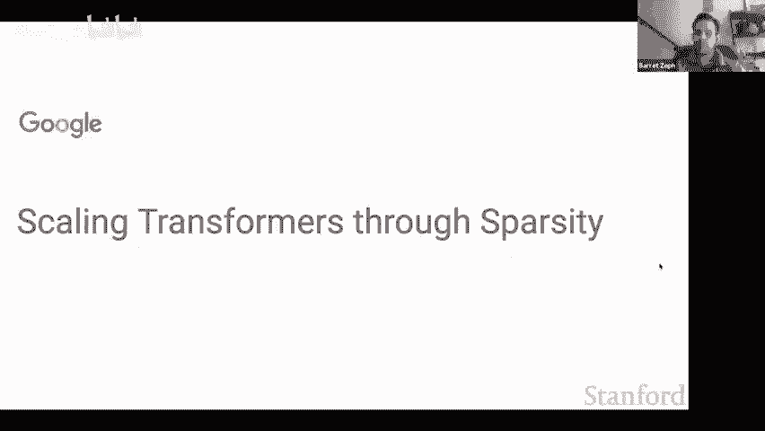

Orren you want to start it off？Y。So I guess the overall motivation for this line of work is that。

You know， the community has kind of realized that scale is perhaps one of the most important access to to focus on for obtaining strong performance and there's almost like this sort of ongoing arms race right now with different labs and different institutions。

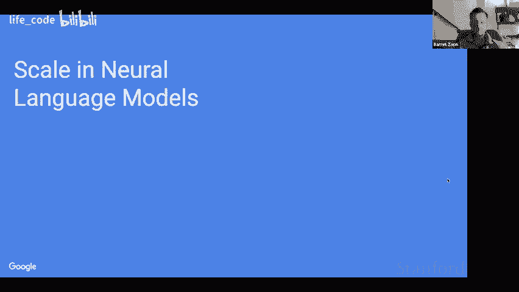

Sort of competing for training the largest models。And so maybe these dates back from early 2020 with a paper from Open AI called Scing Gs for No languageage Model。

Where they find that model performance。Follows the predictable our law。

Scas sort of as a power with model size。In terms of either compute， also just you know， parameters。

And so this scaling law kind of generalizes over multiple orderss of magnitude and that gives us the confidence that if we are to train very large models。

 we can expect solid performance just by extrapolating these scaling laws。So in that paper。

 they also。Find the interesting。Observation that。Basically， larger models are more simple efficient。

And so， you know， if you have a fixed compute budget。You can sort of。You know。

 you can predict what what is the size， what is the optimal model size or fixed compute budget。

And the overall observation is that。You know， you rather train very large models for less steps than train smaller models for more training steps。

And so these models are scaled。You know， through。Basically， the paper focuses on dense models， right。

 where you just increase the model dimensions。They're not looking at sparsity and so sparsity is a new dimension that you can use to scale architectures。

You know， N DC sort of the。The focus of the talk。And so the spaity we we're mentioning here is basically。

 you will have。Spa spaly activated weights based on the network inputs。

 So every input will go to a roughly similar amount of computation。

 but will be applied different weights。And so this dates back to 1991 with。

Paper called adaptive Mis of local exports。And was recently revisited by Noam Shaesar and colleagues at Google Brain。

With LSTMs where they're replaced sort of the fit forward。Networks and LSTMs with mixture of exp。

And so the way this works there roughly is that。You will have multiple experts in implementing you know。

 a small network or in that case， I think just a。D matrix multiplication。

And so you have an additional getting network shown in green here that outputs probably distribution over。

Experts that each talking should be sent to。So this priority distribution is computed as a softm。

 and once you have it， you select a few experts。So the are different strategies。

 maybe we'll talk about it later， and the output is simply sort of the way to make sure of all selected export outputs。

So that they've been pretty successful in。Primarily in translation， but there was some， you know。

You know， some complexities that Hindu broader use in NLP。And so the switch transformer paper。

Addresses some of those and will be discussing how to。

 you know how to fix training abilities or reduce communication costs and and reduce model complexity。

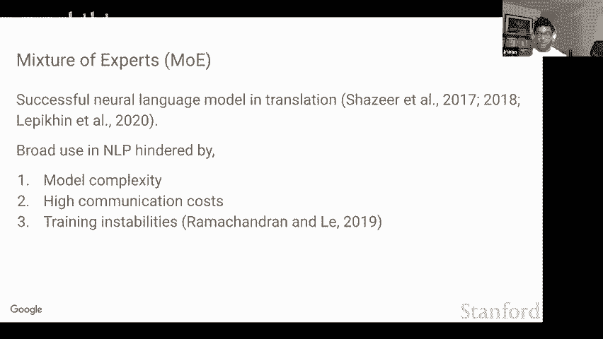

Alright， do right， you wantan to go。

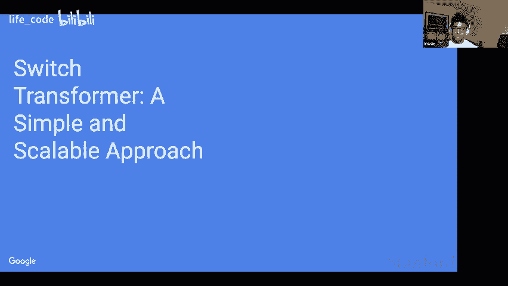

Yeah， so yeah。 So one kind of approach that we're going to have first spaarsity is the switch transformer。

 which is kind of like a simplified mixture of expert variant， along with some other improved。

 you know， training and fine tuning techniques that allow it to， you know。

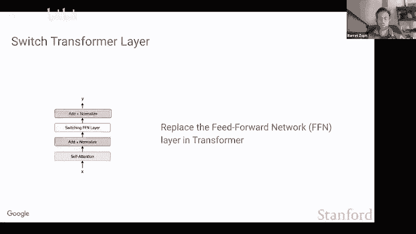

Be stably trained and also perform better when finding done a lot of downstream tasks。And so yeah。

 so the switch transformer kind of model works as the following。

 so you have some transformer model that has， you know self attention and feed forward layers and the idea is that we replace maybe one every two or one every four feed forward layers with a switch transformer layer。

So you can see on the left is like one kind of layer block which is selfatten then addized then a fee forward layer。

 then abnormalize and in this case， we're replacing the normal feed forward layer with like switch layer and we can see an illustration of this on the right so on the right we can see that the layer has two inputs one is the token more。

 the other is the token parameters and we can see that these you know embedding representations will get sent to a router which is exactly how it works in the mixture of expert so the router is basically just going to be you know getting a distribution over all of the experts so in this case we can see that the highest probability is going to the expert number two out of the four experts and then the right token is actually having the most probability on the first feed forward weight which is like the first expert。

So yeah we can see here that like what we're going to do is in the switch transformer which is very simple is just send it to the highest probability expert and so here we can see where the adaptive computation lies where we'll have four sets of weights there's some shared weights and computation across all tokens。

 for example， the self attention layer is computed exactly the same for the more token and for the parameters token。

But in the sparse switch layer， we can see that like actually the inputs are while having the same amount of floating point operations applied to them。

 actually have different weight matrices。

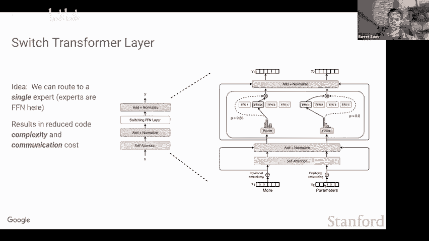

Next slide。Yeah， so that's the kind of high level idea with switch transformformer is that， you know。

 instead of sending a token to multiple different experts。

 which can also increase the communication costs， as I'll go into a little bit later。

 it also just like significantly kind of simplifies the algorithm by just only sending it to one expert。

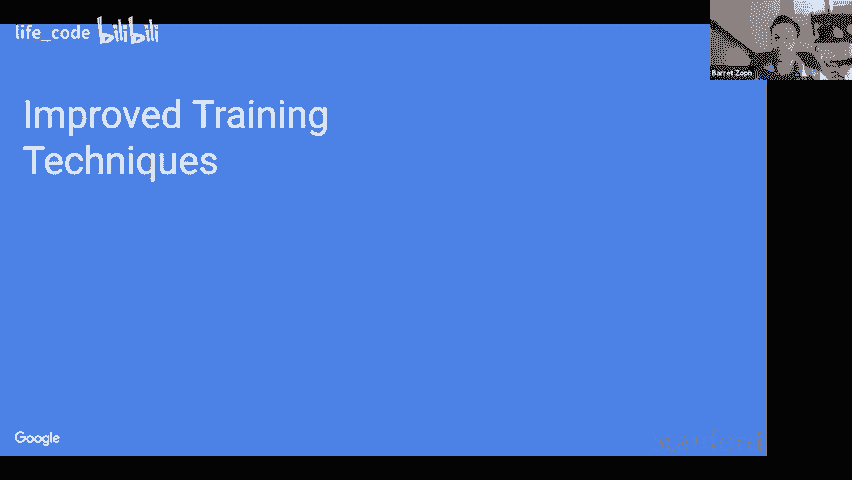

So for the improved training methodology， we focused on three different things to help improve the training of sparse models。

The first was selected precision， which like allows these sparse models to be trained in lower precision formats。

 which is incredibly important Most of the models we train。

 we really don't want to be using F 32 because it's just slower to compute and also when you're communicating tenss across different processes and stuff。

 its is twice as slow just because there's twice as many things。Also。

 we have some initialization tricks and some training tricks as well for allowing them to be trained more stably。

 especially as the models grow in size， which is like a new initialization method along with like a change to the learning rate schedule。

And third， since that our models have so many more parameters。

 we do notice like definitely different overfiing dynamics。

 especially once we finet these models that have been pretrained on all of the internet on these small tasks with maybe only 50 to 100。

000 examples that they can be much more prone to overfitting so we also look at some custom you regularization to help prevent some of the overfitting that we observe。

And finally， we also talk about this differentiable load balancing technique we make。

Which kind of allows you know each expert to roughly get the same amount of tokens。

Because you know this is very important， especially given that we you know want the stuff to be efficient on hardware。

 we want roughly each expert to have similar amounts of token sent to it and so to kind of encourage this we tack on an additional like load balancing loss along with our cross entrytropy loss that we're training with。

Next slide Okay so here I'm going to go into selected precision。 So yeah again。

 so like when we're training large models， it's really important that we should be able to train them in lower precision formats。

 So instead of each you know weight being an activation being 32 bits we want to shrink it down to 16 bits and we use like the B float 16 representation and what we found out of the gate is that you know these models are just unstable especially dis sparse models are much more unstable than the dense models in terms of like you'll train it for 1020000 steps and then the losses would just diverge this was something that we you know frequently encountered and so one key thing that we found is that basically you need to be casting a part of the computation in float 32 for these models to be able to be trained stably。

And the key component that we found that you need to cast is the like router computation and essentially you know we can go into the technical details a little bit more later。

 but basically anytime that there's like these exponentiation functions。

 it's very important that we are you having higher and higher precision because of roundoff errors that can then drastically change the output of some kind of exponentiation function So for example。

 like if you have an exponentiation function and you change it by 0。1 or 02 or 0。3。

 this can drastically change the output of like exponentiating it。

 especially depending on how large the input is。So yeah。

 so this was like a very important thing and it basically doesn't change the compute at all and allows the models to just be significantly more stable。

Next slide。So the second thing we looked at is also the initialization scale。

 so like the standard way that we were initializing these models we found to also just make the models much more prone to being unstable and or just performing worse so one thing that we did that we found was very effective was to just simply make the initialization scale much smaller and when we did this we found that you know the quality just like drastically improved it was like a very simple fix。

Next slide。And the third thing I mentioned where since we notice that these models are much more prone to overfitting。

 since they just have significantly more parameters。

Is that we also use much more dropout for the expert layers only so here we can see we took we have like you know the T5 base which is a dense model。

 and then we have a bunch of different switch variants on that and we found to be the most effective on these four different fine tuning tasks was just to really significantly increase the dropout rate inside the expert layers and we found that this was pretty effective for combating the overfitting。

slide we have a question Oh also about the students Yeah okay， let me take a look。

Do you want to go ahead I can ask is just in reference to that previous table where you you have throughput and precision it just seems surprising to me that you could match this 1390 number。

We using selective precision， it seems like I would expect it to be like something in between。Yeah。

 so it essentially comes down to the fact that like there's maybe a little bit of noise sample bit the speed and the only part we're casting is the router。

 which is you know， maybe like it is such a insignificant portion of the computation and there's zero communication there that it's essentially like a free operation in the network so whether you cast it to B flow 16 or flow 32 it doesn't actually impact the speed at all within the precision that we can actually measure the speed。

And also， these architectures only use fast layer when when every fall layers。And so。Yeah。

 essentially the flood 32 parties is kind of very negligible in the entire architecture。

It's like for example， I think like off the top of my head it's like140th the computation that would cost for you to do the first like like weight matrix multiply in like a dense raylude dense layer or something。

 so it's a very， very small part and yeah we're not using them very frequently like Erwin mentioned as well。

Got it， okay， thanks。Yeah， and then， you know， just like a quick point in this。

 like I won't into some of the technical details， but yeah， we definitely， you know。

 since we're training these things on hardware we really like I think a big part of the mixture of X paradigm is that these things are designed such that it maps really efficiently to hardware。

So we want to be doing dense matrix multiplies。And for this to work really well we also want to be able to have you know roughly equal amount of tokens going to each of the different experts and I think the this isn't that sensitive to the load balancing formulation like we tried a few things a lot of them worked。

 but yeah essentially you definitely want some kind of load balancing loss added on when using sparsity Yeah next slide。

嗯。Yeah， Erwin， go ahead。Yes， so。So the frameworks， the library we use rely on static shapes for。Okay。

 So we so X L A。 So the compiler for tensorflow and machine offlow expects static shapes for tensors。

However， the computations in switch transformers are dynamic because。You know， because of the router。

 right， like different inputs will be routed to different experts。And so， we need to。

Specify ahead of time。 how many tokens will be sent to each checkbook。

And so we will introduce this expat capacity hyperpy。To specify that。

 And that's going to be a static number， which says how many tokens each export can process。

And so in practice， we instead parameterize this by having a quantity called the capacity factor。

So we have an example here。So， you know， so the bottom row is。Okay。

 so is a bunch of tokens on one device， and then you need to sort of route those tokens to multiple devices or multiple expertss。

So if too many tokenins are routed to a single exp stop。Some tokens will be dropped because。

 as we said， like export having a fixed capacity。So that's the example on the left where the capacity factor is one。

 and that basically means that the total。It does no， like extra buffer。For writing tokens。

So instead of that， we can use a capacity factor that's larger than one。 so on the right。

 you have an example with a 1。5。So that means that now each expert has like sort of three slots that can process three tokens。

And so that prevents token dropping because we have more capacity。

 but the issue is that this means higher， you know。

 this means more expensive communication across devices。Yeah， okay， so does it。Yeah， go ahead。

 But yeah。 So yeah。 So one thing that we also experimented with was this method called no token Left behind。

 And the idea was the following。 So since we have to have like， you know。

 a fixed batch size for each expert and there can be token dropping。 We kind of we're thinking that。

 hey， yeah， having tokens dropped there like you know having some tokens。

 not having any computationnot applied to it is probably hurting the model performance。

 So what if we do a multistage routing procedure。 So first。

 you do the normal routing where it's like you send each token to its highest probability expert。

 But then any drop tokens， you then send to their second。

Highest probability expert and so forth and so on， where you can basically repeat this process to guarantee that no tokens are being dropped。

Interestingly， actually， this approach didn't empirically improve model performance if anything had actually kind of hurt it。

And we thought that was actually very interesting。And I think the intuition is that， you know。

 once the model learns， it wants to send a token to one expert。

 like it really wants to have that computation applied to it and just applying some other computation doesn't you know have at all the same property along with it actually maybe being potentially detrimental。

So yeah， we thought that was pretty interesting as we were very optimistic this would potentially you know get improved performance。

 but it ended up not really making a difference and we found this quite surprising。

We have a question from。嗯。I think about actually kind of like address and literally the last point that you brought up I think when I think about like a mixture of experts usually like they specialize in like different things right so I think it's like。

Just like a lot， like I was just wondering。Like if you send it to like the second best or whatever。

 like what if like all your tokens would be particularly good for like one expert and then you only like process。

 let's say like 20% of your tokens。So that ends up being better than rerouting them to anything else exactly Yeah。

 so yeah， even if you're dropping a lot of tokens， it's not beneficial to be sending them to the second third or fourth best thing and one actually interesting property that we。

 you know noticed about these models is they're surprisingly robust to token dropping。

 especially during fine tuning。So yeah， so in the standard paradigm。

 what we'll do is we'll pretrain this thing， we'll have some load balancing loss。

 which makes the tokens pretty balanced， actually。But then during fine tuning where it's like we really want to fine tuningna on a specific task we actually studied this exact question and we were studying does it help to have a load balancing loss during fine tuning or not and so if you have the load balancing loss yeah that kind of is encouraging you know for the specific task we want to try to have you know all the experts be used versus turning it off whereas there's definitely some you know prior specialization and it's actually much better to just turn the auxiliary loss off and even if it's like you know 60 to 70% of the tokens are being dropped that actually performs much better than you know having all the tokens balance but doesn't a load balancing loss encourage basically all the experts to learn very similar weights and then just randomly assign a tokens。

Because then it doesn't matter to which expert stuff is being sent to。

So when we use the load bouncing loss like the routing mechanism is definitely learned。

 so the model definitely is encouraged to you know choose an expert that it wants to send it to for good right but like if all the experts learn the same weights。

 then the router learns basically oh， it doesn' matter where to send it to。

So if you encourage load balancing， you encourage。Technically that like you want any loss to fit of any expert。

 right？I mean， that's maybe the extreme behavior。 if you have a very high sort of load balancing less coefficient。

But in practice that coefficient it's kind of tune and we absorb that for you know smart enough values the of steel loans like se like meaningful routing Yeah because it's like the balance between this like you know cross entropy loss and this load balancing loss and so on one hand yeah you definitely want to encourage the model to be balanced then on the other hand you also want to just good empirical performance and yeah the model is able to definitely like on one hand learn and specialized experts where they have different weights such that it's like you know definitely expect certain tokens decent sent to certain experts but on the other hand still be recently balanced so that the models are officially run on like modern hardware。

Excycl。We also have a question from the classroom。So the question that I want to ask is it seems to me like this is a very experimental talk we're talking about floating point precision we're talking about different approaches and currently work well and whenever were dealing with a group clients there's a question of what is the research question and I feel like I miss that so what are we trying to answer with all these experiments。

Yeah， I think I think the high level research question is like you know。

 can we you know create models that are you know， like doing adaptive computation from the standpoint of like。

 you know can we try to make models more simulate the dynamics that we think models should you know most naturally use。

 which is different inputs have different amounts of computation applied have different weights applied to them you know and basically all of this。

 basically we're trying to research and like figure out how can we create like a new framework for these models to be trained as opposed to their dense counterparts that you know for every input are always having the same exact computation applied so that's interesting because when you say the same exact computation applied one might imagine that。

Like to me the immediate thing is about how long to deliberate about something what I mean by that is if we want to have variable length computation you could imagine that I could have a short amount of computation or it could have much longer computation。

 but this idea of like why then do we instead consider the dimension of different computation I mean assuming of course that these experts do indeed need to learn different things which I think you'll get to in yeah。

So， why do we immediately jump to thinking about specialized experts as opposed to thinking about variable length computation？

So yeah， so this is actually， we actually go into some variable length computation stuff later in the talk。

 and I feel like they're both actually just important axes that should both be pushed on。

 I think I guess yeah， I guess it's kind of， you know。

 I guess what I'm not freezing my question but I'm trying to understand is yourre thinking about why did you decide to tack this one first。

 I want to understand why your team chose to go this direction first。Yeah， absolutely。

 so I think that one empirically， it seems that sparsity has led to better empirical results in the field of deep learning than adaptive computation so far。

 And I think the way that we use these things maps really well to our modern hardware which is also very promising。

 And I think the way we were kind of looking at it is like sparsity is like a first step towards doing more interesting and general adaptive computation where and and know because I think it's like this stuff is complicated and typically starting from something that works well is better than necessarily like you know you know trying something that's not necessarily as proven out and then trying to like get it to work really well。

 So I think we're kind of starting from sparsity， which like nu Shaser and others got to work really well in the context of LSTMs we were kind of interested in let's port some of this to transformers let's get it working really well and then that's slowly start expanding towards a lot of the other natural questions that you mentioned whereas like okay whereas instead of different weights per core。

 let's also maybe have different computation per core and all of this that's I guess how we were kind of building the natural build up in progression of。

Our research got it cool， thank you yeah。Whatho do you think Errwin， anything else to add？嗯。Yeah。

 I mean， I guess I kind of see adaptive computation and sparsity as。You know。

 related but separate things。 So， you know especially more like different parameters for each example and adaptive computation might be more different amount of floods。

 and we have some of that with the talking and dropping， but that's kind of。No。

 that's not the domain。Theomamain motivation， definitely， as Barrett mentioned。I would say， you。

 no one really has figured out adaptive computation yet。For deep learning。

 And what one reason is because we have these。You know， accelerators， right， expect， expect like。

Sort of no。We need to work with like batch like data parallelism， right。

And all of our accelerators in our frameworks use this SPMD paradigm where we're kind of supposed to apply the same computation to。

Two examples。And so if you look at the literature you have works like universal transformers。

 where they replace the fit forward in the transformer bay。

Just a recurrent weight and so it's kind of like an LSTM on each token and the LSTM can stop at different time and space on some。

Criteria， but the way these things are implemented is just through masking。

Because it needs to be implemented in the SPMD programming style。

And so definitely spaity was kind of like easier to get to work first。 And also。

 there were some prior results with LSTM so。In terms of like the first question， you know。

 sort of what store research question here is just like， oh， can we design more efficient models？

And spaity is this new axis that hasn't been explored that much。 Yeah， I think that。You know。

 I'm happy with just that being the research question。Great， okay， yeah， so next slide。Yep。Oops。Yeah。

 again， so kind of putting it all together。 So the switch transformer layer selects an expert like just the top expert and then incorporates a bunch of the general sparse model improvements to。

 you know， allow it to fine tune better。 allowow it to， you know。Be more regularized。

 allow it to you know， be trained with lower precision formats and a lot of like technical details to just get them training and working well。

Yeah so one thing that we also wanted to do was a comparison between like top one and top two routing since top two routing was kind of the you know most popular technique and so here we can see we have two different dense models trained at different sizes and we're going to be looking at like the the pretrain like negative log perplexity so。

Yeah， the bigger the number， the better。So next slide。

So and what we're going to be doing is we're going to be studying them at different capacity factors。

 so a capacity factor of 2。0 basically means that there' is enough buffer for two tokens to be sent to every single expert。

And we're going to be comparing like top one versus top two routing。

And also comparing their speeds along with their like time to get some like threshold quality。Okay。

 yeah， so here we can see in the capacity factor 2。0 case。

That the MOE models outperform switch transformformer。

 which makes a lot of sense like since switch transformformer is only you know sending like a top one token to each expert。

 the mixture of expert is sending you know two tokens so that makes sense that this extra buffer will be like disproportionately beneficial for the mixture of expert models。

And so we noticed that and next slide or yeah， next。

Now when we so the really interesting parts for the top one runningut becomes when we lower the capacity factors so having a high capacity factor is bad for many reasons。

 one of which is it really incurs more of these you know communication costs for sending tokens to the correct experts it also incurs more compute costs and also incurs like a lot of memory overhead so if you can get this lower it's it's usually like a very very good thing。

And so what we see here is that switch transformformer actually outperforms mixture of experts when you have like a lower capacity factor and we can see that the time to quality threshold we you know yeah we get there much quicker and so even across the 2。

0 and the 1。25 capacity factors like the kind of preto optimal thing we saw on our setup is to use switch transformer at a lower capacity factor just due to the fact that while the quality is a little bit worse on a step basis。

 it's just like much faster to run so it's kind of the preto optimal decision。Next slide。

And we can also be seeing that like for capacity factor 1。0 again。

 we can see that this really disproportionately benefits switch transformer and is even better from annaparto standpoint than the 1。

25 capacity factors。And interestingly， since you know。

 MOE also does like a little bit more computation， we can also just increase the amount of compute done elsewhere in the model。

 and we can see that that's like a much more efficient allocation of compute。So yeah。

 overall our takeaway is that yeah lower capacity factors using top one routing is more preto efficient than。

 you know， using like top two routing at higher capacity factors。

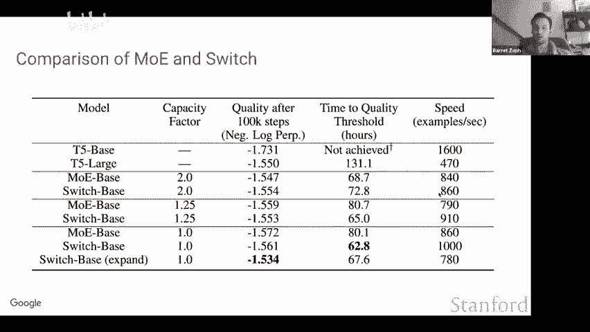

Next slide。Oran， you can take it over。Okay， so next we look at how switch transformer scales。

As a function of the number of exports in the switch layers。

And so on the right side here you see a plot that shows complexity。

Vus training steps for different switch architectures ranging from Tfi basease。

 which is basically no expert or a single expert up to 128 experts。

And so you see that as we increase the number of experts。

 which also increases number of parameters of spa parameters。You get sort of speedups， you know。

 you get increasing speedups of the dense baseline and all like sort of dimition returns。

To multiplying to increasing the number of experts as well。

So the previous figure was looking at complexityity versus string steps。

 Here we look at complexityplexity versus strength time。So that includes， you know。All the， you know。

 additional communication costs when you have more experts on。You know， comparing。

 comparing to the dance baseline。And so this is for switch base or then T5 bays。

 and we observe x up to seven x Philipups over our T5 bays。嗯。And so， you know， just to。

Maybe contextualize these， these numbers like。You know。

7 x speeds into planning are pretty hard to obtain。 And so I think this is one of the， you know。

 one of the result that。You know， can spark a lot of interest in sports models。

 even if it's only for preing for now， like just having that number is like， you know。

 maybe it does a。There's a significant。U。Does something significant that can be obtained here。Okay。

 so sports scaling laws。 So here well look at。So it philosophy versus。Spaous mineral parameterss。

 which are increased by increasing the number of experts。

And so similarly to the sort of neural scaling blood paper。

We observe that as you increase the parameterss。Which the sparse parameterss and keep the fluxps fixed。

 you get diminishing like consistent gains， but diminishing gains。Okay。

 so now we're going to compare export parallelism and model parallel。

 So we introduced sparsity or export parallelism as a new dimension to scale models。 But， of course。

 there's the other one for dense model， which is simply model parallelism where you know。

 model weights are partition across calls once they are。

Above the the maximum size that you can feed on a single core。No。All right， so。Yeah。

 advertising the left is expo priority here。Yeah， so essentially what we're doing is is yeah we're kind of comparing a switch base model versus the dense space and we're also comparing against a larger dense model that has used model parallelism and we can see that you know because basically when we want to scale up model size we kind of have two axes that we can either go through we can either increase the number of flops by scaling through model parallelism or increase the number of parameters by scaling through sparssity and so we can see that you know even compared to like you know a dense model that's been scaled up through model parallelism that' sparssity is still at the scale a more effective way to scale up the model。

By， you know， still getting 2。5 x speed ups over this larger dense model that was using model parallelism。

Cool， so slide a bit。Basically， here T5 large is the dense model that uses other part of。Yeah。

 all right， go ahead。Okay。Yeah， and so one thing that we also wanted to look at is like you know。

 are these expert models effective if you have like you know a really small amount of compute or just a small amount of experts。

 So typically when we're designing these models， like we have one expert per core。

 but if you don't have like a large cluster run these things on let's say you just have like a GPU with two cores or something like is having two experts more effective than just like a dense model And the answer is yes。

 so we can see even pretty good scaling properties， even with like a tiny amount of experts。

 which is very promising for these models to be used even in like much lower compute regimes。

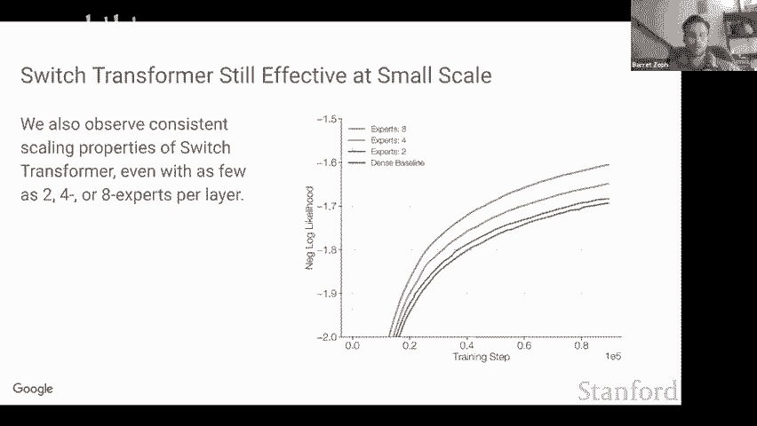

Next slide。Or you want to go ahead。 Okay， so yeah， so。Yes， so look at。You know。

What things look like when we use different types of parm。

 namely expel parm to add exp to model parallelm to sh model ways。

Across calls and also data parallelism， which is sort of the dominant paradigm in at the moment。

And so。You know， I guess， you know， in the previous slides， we mostly talked about X parallelism。

 but of course， you know， dense models and large dance models use model parallelm。

 So G3 and other large models， What they do is that they will simply she model weights across different core。

Yeah， we have a question。Oh yeah， I just wanted to know because I think there was like。

 I don't know if you go got under rest laterator， but I think somewhere in a paper。

 it' said that the more experts you have， the more sample efficient it gets。

And I was just like hoping that you could give us some intuition about that because I。

Don't understand why that will be the case。

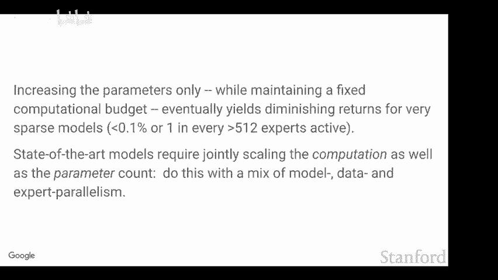

So I guess， yeah， maybe Er oh yeah， so I guess like， you know。

 there's all of this work on larger models are more sample efficient。

And larger in the context of these scaling law works means like more parameters and more flops as you increase the number of experts there's more parameters。

 but not more flops， but the model is still like you know larger in like you know a similar sense。

 so I guess like building on the intuition that larger models are more sample efficient in my mind it's not necessarily that's surprising that these models with more experts that have more parameters are more sample efficient。

I guess that's my kind of high level intuition for it。Yeah， I would say that's kind of expected that。

 you know， more exports leads to better sample efficiency。Especially if you look at training setup。

 right in a training tab。Okay cool。So where are we？Yeah， so yeah。 So okay。

 So we look at how model weights are speed of a cost for different scenarios。

 So data parallelism is the first one。 So that's kind of the， the typical setup that the uses。

Especially for nuts solar large networks which don't require mother parisism。And so let me， yeah。

 let me explain how。Yeah， I'll just go to the final。

Figure and now explain how to look at this figure。Okay， so we have 16 processes。

 which are organized in a 4 by4 mesh， right， So each dotted line。

 each4 by four dotted line here represents a different core。In the first row。

 studies how the model weights are speed over callss and the second row。Ituss how data。

 so literally examples and tokens are split over calls。And yeah， and then the final thing to。

That's required to understand this figure is that each。嗯。Yeah。

 each color of the shaded squares here identifies a unique weight matrix。Okay。

 so let's start with data parallelism。So for data parallelism。

 the same model weights are replicated across all core。And the data is simply partition of our cause。

 and so that's what this corresponds to。You know， if you like using the the description of the caption。

 the explanation of the caption that just gave。So next we have model parallelism。

That's kind of just like a theoretical example because in practice。

 people always use model parallelism in conjunction with data parallelism。

But so if you were to do only model parallelm now you would have a single model weight that is partitioned of all course and your data would just be replicated。

Of all causing said。So now we have modeling data parallelism。

 and that's kind of the typical scenario for large dense networks。So in that case。

 model weights are partition among a subset of the calls。

 the subset of calls that process different batches of data。And so in that example here we have。

You know， sort of four， so the first sub square here means that the model weights are partitioned across four four calls。

And。And this is replicated。Sort of four times for the data parallel dimension。

On the data side for model and data parallelism。Yeah， the data here。

Is replicated across model parallel core and partitioned across data parallel core。

So next we have exp and data parallelism。So in that scenario that's kind of similar to data parallelism。

 but now each car will hold a different model weight， which is illustrate by the different colors。By。

And for the data side， the data is simply replicated sorry。

 the data is positioneded across all calls， just like in the data parallel scenario。And so finally。

 we have the right most column， which is。I guess yeah。

 that's the setup use in the switch transformer paper for the larger models。And so。

 here for the model。Partitioning each expert is partitioned across multiple calls。

 so in that example， we have four experts。Each partition press four calls。

And the data is replicated across multiple parallel calls and partitioned across data parallel calls。

So that that's a little bit complex to understand orally。

 but the switch transformer paper has a nice the same figure with a nice caption to explain it。

And yeah， maybe we can。No Barret， we can add something quickly about how this is implemented in practice。

So。There's this paper called mesh Transformer， which kind of extends。

batchache or data parallel to more general purpose SPMD style programming。

And so different labs have different you know frameworks。

 but this paper kind of lays the foundation for general SPMD distributed computing。

 which is required for training large scale models。And so under the mesh abstraction。

 basically we have a mesh of processes。ch and so that mesh has dimensions， name dimensions。

 and these name dimensions specify how the tensile dimensions will be partitioned or replicated across the mesh dimensions。

And so just that simple abstraction sort of supports， you know they parallelism。

 also model parallelism and especially export parallelism at once and so you know I invite whoever is interested to also check that paper that because that's kind of。

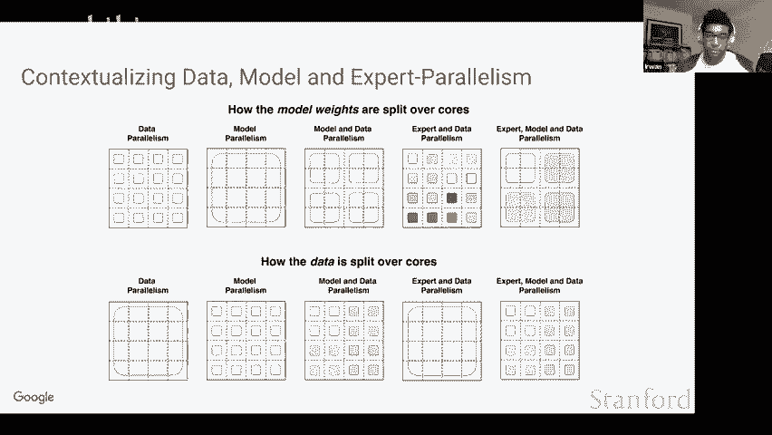

You know， that kind of lays the foundation for understanding these things。All right。

 Dar want to go cool yeah， so next we are going to kind of talk about like how we take these parallelism strategies and like kind of combine them together to make like a 1。

6 trillion parameter sparse model。

So next slide。So so yeah， so what we ended up doing in this work was we had we trained two different very large spae models and we compared them to the largest T5 model so we can see the T5 XXL。

 which is a dense model and it was the largest one trained in the T5 paper and it has around 13 billion parameters and here we list a lot of the model dimensions like D model DF which are just like you know the various sizes and shapes of the tensors and stuff。

 the number of layers， the number of heads and importantly we also mentioned the negative log perplexity。

At step 250 k and at 500 k and so yeah so we designed two sparse models to test and to test like how scaling versus sparsity versus scaling versus sparsity and flops work so first let me talk about switch XXL so that has the same amount of flops per token as T5 xxL but has 64 experts and this leads it to have around 400 billion parameters。

And we can see that on a step basis， it actually performs quite well and outperforms the T5 xXL by like quite a good margin。

Interestingly， though， the third model we designed SwC， which has 1。6 trillion parameters。

 but has significantly fewer flops， almost 10 less flops per token than either of the above two models。

 so it's really trading by reducing flops that have way more sparse parameters。

And we can see on a step basis， the switch C model works well。

 but not as well as actually the higher fl model。But on like a kind of a Pareto axis where were looking at TPU hours on the X axis and not step。

 the switch C model actually outperforms them both by like a pretty large margin。

 So for pre training performance， we're seeing that actually just like having a lot of sparsity and less swapps is actually can be quite good。

😊，Next slide。Yeah， and so yeah， this so again， those two sparse models are kind of really trying to get at this hypothesis that actually Noam Shaer had。

 which is， you know。That you know parameters are good for more knowledge reasoning and compute aK flops is good for intelligence and so we're going to kind of try to get at that by taking these different sparse models and then fine tuning them on different tasks。

 some of which require more like knowledge and then others which require more of like reasoning。

For whatever like hand w definition， we want to give that。So yeah， so for a fixed oh go back so yeah。

 so for a fixed。Oh can you go back to the previous slide Oh sorry Okay。

 so for a fixed quality on an upstream pre training task， yeah， do parameters independently matter？

So we're going to look at two tasks here， one of which is super gluelu。

 which is kind of our like reasoning task and then another is like trivia QA which is like some knowledge task where it's like you just give it a question and you have an output and answer。

Okay。And so here we're going to take a look at superglo quality so we can see on the X axis is the pre training performance and the Y axis is the superg score after fine tuning。

And interestingly， we can see definitely that the sparse models definitely are for a fixed pre training perplexity。

 do worse on fine tuning。This can be especially noticed at like the upper right portion of the plot where the dense models are definitely fine tuning better than their sparse counterpoint。

Next slide。Interestingly， when we study it on the more knowledge heavy tasks。

 the sparse model for a fixed pretraining perplexity does disproportionately well。

 so you know for a model that roughly has the same perplexity we're getting like really large boosts for these knowledge heavy tasks so this is pretty interesting and it also really you know shows some of the dangers of comparing only on your pretraining metric so these models you know can have the same exact pretraining metric but very different you know properties when fine tuning them on different tasks。

Next slide。And interestingly， so yeah， all of the switch models here are just like， you know。

 various models。That have still a good amount of flos， but the red model is actually the 1。

6 trillion parameter sparse model that has， you know very few flops， but a lot a lot of parameters。

 And we can see that as the red dot here， and it does actually disproportionately bad compared to other sparse models that also have pretty good perplexities。

And so yeah， it's definitely very interesting and it shows that for models during pre traininging that have a lot of sparsity。

 they definitely suffer on some of these more reasoning heavy metrics。

 but do disproportionately well for more of these knowledge heavy tasks。Next slide。Yeah。

 and so here we can see it as just like a huge outlier for pre training perplexity doing like just incredibly well on this downstream question answering task。

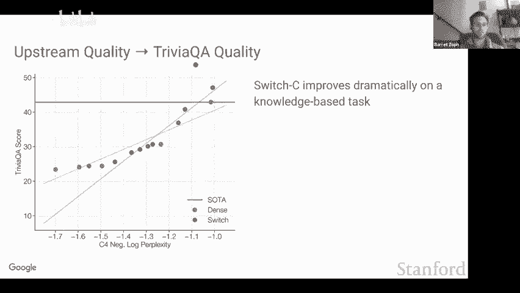

Next slide。

Yeah， okay， so also， you know， one thing that we were going to do is just look at the fine tuning properties of sparse models across like a few scales and just see how they perform。

Next slide。Yeah， and so here we try two different models One is T5 base then we make a flat match sparse counterpoint and when they say flat match it's like you know each token will have the same amount of flops but now we just have experts so we do this for both base and large and we see that actually across almost all tasks besides two archrc tasks the sparse models perform quite well which is which is definitely promising so we are seeing that these models are pretty robust they pretrain well and then they also fine tune well when scaled appropriately by scaling up both the flops and sparsity whereas you know the negative results you've really seen are like yeah when you just have a huge amount of sparsity and not too many flops。

Next slide。Yeah and one also thing we wanted to look at was the multilingual training so we were previously studying all of this on like English only and we also wanted to see how Sprsity helps in the multilingual setting because you know we also felt like this would be a very natural place for Sprsity to work well where potentially experts could specialize across languages。

And we do see strong results， so on 91% of the languages。

 I think of like around 100 languages we see over like at least a4 exped over the MT5 dense model。

Next slide。Or you want to go ahead？No go go ahead。 Okay， Yeah。

 so another thing we wanted to talk about was distillation。

 So one downside of these sparse models is that they'll have a lot more parameters， which means that。

 you know， if you're serving these things or something you either need like high throughput use cases or you need to maybe distill it back down until like a smaller dense model。

So here what we do is we look at like the T5 base and switch base and we look at its pretraining performance。

 and then we go through some abllationations of different distillation techniques and find that like with the best techniques。

 we can keep around 30% of the quality improvements of sparsity while distilling it back down into its dense counterpart。

So next slide。Yeah， and then we kind of study this across multiple scales and again we see like around like 30% to 40% of the gains can be like you know kept when going from a dense model when going from you know a sparse model and distilling it back down until like its fl match dense model so you can get you know get rid of up to 99% of the parameters and still keep like around 30% of the improvements。

 which is very promising。Next slide， wait， I'm sorry。Yeah。All right， sorry about that。

 can you say that last sentence again， you said that you can keep the benefit 30% of the teachers benefit。

😡，Yeah， basically so yeah， you you yeah， exactly so yeah， so we're looking at like， yeah。

 you train a sparse model and then you distill it back onto to a dense model。

And versus training a dense model from scratch。 And like you look at the gap between a sparse and dense model from scratch versus the gap between the dense and then the distilled dense model。

What do you registering？You go forward。Oh yes， yeah。Oh yeah。

 maybe let me just do like a quick high level summary again。 So yeah。

 we' we'll do is for our comparisons is we'll train a dense model from scratch。

We'll train a sparse model from scratch。And then we'll also run a third experiment where we distill that sparse model down into a dense model。

What does distilling mean like we we're basically trying to match the like the teacher's logits。

Like the kind of standard thing of like， you know， like matching the like either the thelogits or like the soft probabilities for each token or something like that。

Okay， if I can jump in with my question， so what I'm struggling with is。

 how do I interpret the alignment that as percent of teacher and performance？Yeah， okay。

 so it's basically looking at the like the gap between the dense and sparse model。

So we'll have the dense model get some performance。

 we'll have the sparse model get some performance and then the dense model dis still from the sparse model would be somewhere in between that range and we're basically saying it's 30% through that range。

 So it's like in like a 0 to1 interval it's like 。3 of the way from the dense to the sparse model I see so this is not saying that the percent of teacher performance does not mean that if the teacher say if we use the teacher guesses or predictions as the ground truth。

 this is not saying that the distilled model gets matches with the teacher 33% of the time。No， no。

 exactly。 It's basically saying you get like 30% of the the quality improvements。 Yeah。

 exactly Okay cool And then if we can back up the slide， I had a different question。

 but I didn't want to interrupt when we're talking about all of these different T5 bases and then also on a few slides before this。

 I don't know that much about T5， I'm curious you know when T5 is trained。

 is there a weight penalty in the loss function。Is there a way to caterer？No。

 there is no way to cage trained with any of those sparse or dense models I see so out of curiosity then how do dense models perform compared to the switch model if you add some sort of weight regularization that incentivizes getting rid of useless weights。

So some kind of like maybe like L1 term or something like that quickly Yeah。

 so I'm just wondering like how much of because here we're talking about the benefits of sparsity and I'm wondering how much of this benefit from sparsity is due to the fact that just some of this I mean。

 effectively what the switch model is doing， if I understand correctly maybe I don't what understand is that the switch model in the feed forward layer。

 it's just like you you fix some of the weight to be zero that's what it means to be spars。Well。

 actually we're kind of really trying to like inject more weights。

 so we're actually kind of trying to do it's a little bit maybe like paradoxical because we're saying switch transformer but our idea to be like。

 hey， we actually want to just have significantly more weights。

Not last it's kind of like you would zero out weights but within a much larger weight matrix if that makes sense I see yes。

 and so to me it seems like a relevant baseline to just ask what happens if I have the dense matrix but I incentivize it would say an L1 or L2 penalty on the weights and would I'd be curious to know how that compares。

Yeah， we didn't run this， but also that kind of gets rid of weights for the dense model， so if any。

So yeah， yeah。Yeah， and the last point is like if you just add like an L1 penalty loss。

You're not going to have structural sparsity。Was like， here we， you know。

It's not random weights in your giant weight matrix that are 0 that， right。

 It's like really like blocks， depending like blocks corresponding to each expo。

 Right so that that structure allows the the whole like communication stuff and and that's。

Yes that just the fact that you have multiple cousins on right。

 So I totally agree with that block structure and that's what I'm trying to say is that the switch has this very richs it's not just sparse。

 It also has this rich structure what I'm trying to do in my mind is disentangle is the sparsity What's offering an advantage or is this additional structure that you've built in is that what is the performance game So that's why I'm asking。

So the the。The block structure is what。Enables to leverage the fact that you have multiple calls but like if you if you didn't have that drug structure。

 you'd still have to route to everything and so you have more communication costs and so on so and then your first question was what sorry。

I'm not actually sure if there was a question， I guess what I'm trying to say is I'm trying toambiguate。

 yeah， anyways。But I agree。 it's a little bit weird because sparsity kind of's spectrum of meaningful for sparsity。

 right， it like， for example， compression and like model pruning is a form of sparsity。

 but also switch transformer and ME also referred to as sparsity and。That kind of related。

 but definitely dynamic aiming at different things so this is a really interesting idea of it's sparse。

 but you have more parameters I'll have to think about it more thank you。Yeah。

 like it's kind of like spot within this like giant weight matrix， which is exactly Yeah， Yeah， yeah。

 I hadn't appreciated that。 So I appreciate you you pointing that out。 Thank you。

I have a lot of question on distillation part。Yeah first okay so if you disill it back down now you have like one technically you're back to the dense layer architecture right so now the entire like the entire idea of expert it's a certain tokens would be sent to different experts because they just like I don't know are more specialized in figuring something out about this token so now if you go back to this like dense layer like aren't you like basically only serving whatever like whichever expert you base this dense layer on like these tokens will probably perform well and all the other tokens are kind of like left behind right？

Yeah。I'm actually sorry。 I don't think I'm fully understanding your question。

 So so are you kind of getting at like we're just this on a specific data set so that don figure out how to use that like yeah yeah so maybe concretely like let's so like for super glue right like let's say you want to serve a model that does super glue well I think the idea is that like you distill the sparse model into a dense model on super gluelu So then you kind of get this compressed dense model that now performs better than if you were to just you know train it from scratch or train it from like a pretrained dense model So then it's like you use say that again。

You， you have to pick one expert， right？ No， no， no。

 you can just distill all of the because you're just matching the the model outputs。

 So you can just treat the sparse model as kind of like a black box thing。

 All we're doing is just trying to have the dense model match the actual like final like， you know。

 token predictions。 Oh God， Okay about it。 Okay， sorry I was not。

 I was not familiar with the idea of the disill。 So I think that was like my entire confusion。 Okay。

 Yeah， of course， yeah， because I guess one motivation here is that。

Having experts can make serving a little bit more difficult， because。It requires bigger toppologies。

 let's say you have eight exps。You need like。Well， I guess you can have multiple export on fewer calls。

 but。You know， let' just say that a little bit harder to solve。 And so if we can， you know。

 get the benefits from spay at per training。And then use distillation to a dense model for serving be that can be beneficial。

 so I think that was sort of the motivation for that experiment， right Eric。Yeah， exactly。

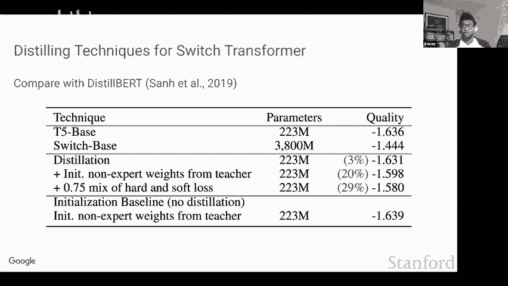

Okay， well are't we yeah？Yes， kind go ahead， Ben， I just said。

 I think one more written kind question， so yeah。So yeah go ahead pleasure're asking Oh yeah yeah soundss good yeah you guys for the talks so far question was wondering if you think there are any interesting directions around building models that are like explicitly optimized for parallel training I guess like the moE models seems like you know it does a really good job here and also like at inference time it's you know very useful to like you know have fewer flops for computation。

But or for forward pass， but I guess do you think that there are any interesting directions around distributed training where you might have like models that are explicitly architected to have a lot of parallel heads or other like features that are you know kind of embarrassingly parallelizable or does just using like standard you know。

 scale up the models by adding more layers and then just you know get away with using model and data parallelism work well enough。

Yeah， so I think， so yeah， so let me just make sure I'm fully understanding。 So yeah。

 I think also like， you know， right now， like even our models are definitely very co designed with the hardware and like the shapes and things。

 you know， so yeah I think at a high level like yes。

 I think there's a ton of interesting research on like codesing the hardware。

 the partitioning algorithms and the models。😊，I think given。

 you know that we have this kind of like SPMD mesh style partitioning。

 we are already kind of designing our models in ways that fit it really well。 So for example。

 when we want to scale up our model， one of the first dimensions we go to scale up is the internal hidden dimension。

 I there some really nice properties of scaling up this dimension。

 It basically becomes like kind of you know independent to some of the communication costs。

 It's really good when looking at the compute to memory operations on these you know like compute devices and stuff。

Yeah， exactly。 like I think when we're even designing these models。

 we're like really setting dimensions such that it maps well out the hardware。 So it's almost like。

 you know， given that we have this model data parallelism。

 we're like actually designing models more for it。 But I also think that there's a ton of new interesting distributed algorithms and stuff like that。

 which makes designing models very interesting。 Like I think one thing that I think is really cool is like the Microsoft  zero partitioning too。

 which also like adds some new new like nice implications for like how to design and scale models and stuff。

 So yeah， I think there's like， this is a very fruitful research direction。

 if that kind of answered to your question。 Yeah， no， that was super helpful and interesting。 yeah。😊。

Yeah definitely like i'm very optimistic on the future of us like designing the hardware， the model。

 the partitioning strategies altogether because really to get it to work well you kind of have to know about all three and like kind of you know intertwine the development of them Yeah yeah that sounds awesome。

Cool， yeah， so just to summarize it's like yeah so switch transformer is like a nice simplification over a mixture of experts and we're seeing that we get really strong speed up improvements on pretrain over like a lot of the T5 models which are very strong baseline we're seeing that we can you know efficiently distill the sparse models back to dense ones。

and you know get improved both pretraining and fine tuning through some of these newer techniques we talked about。

 and we're also seeing that the models are working on multilingual data and that we can you know now easily successfully train up to you know 1。

6 trillion parameter models， which is pretty promising。And next slide。

 and so we also wanted to go into two slides about some like newer work about actually using these kind of models for computer vision and actually also a little bit of how they can be used to actually do some level of like adaptive computation。

 where not only now each input gets different weights。

 but also sometimes different inputs will have different amounts of compute applied to it。

And yeah so there's some really great work of doing this out of the Google Zuric team and yeah there's just doing it for image classification and you know they're basically seeing a lot of the similar types of scaling properties where you scaling up the number of experts and using sparsity allows them to get good performances on image classification。

Next slide。And interestingly， one of the things they do is like as we talk the capacity factor。

 so we were talking about values of like1 1。252。0， which means like at a value of 2。

0 there's buffer for you know two tokens per expert。

 but they actually study it going less than one so that means that like at 0。

5 that means there's only like room for half the number of tokens。

And the nice part is is that they did this for image classification and also in images there's just a lot of redundancy and they notice that you can actually get really good performance by only allowing like you know up to one10th of the the parts of the image to be processed by a sparse layer。

 So yeah， we think this is like a really nice direction too in terms of combining sparsity along with like adaptive computation。

😊，And yeah， and yeah， thanks so much for having us。That's the， that's the talk。

It does think you better than。Sorry other fun for coming here so you know。道。

So I will just like ask a bunch of questions and then we can have like after the class open question panel for the students。

So one thing is like have you tried using like like more like linear attention mechanisms like reformers and like all the stuff to like scale the computation？

I personally haven't maybe， I haven't personally done this。Yes， so。You know。

 I guess we can maybe comment on how。You know， the attention。

 the cost coming from the attention maps isn't。The dominant curve in these large transformers。

So you know， the motivation for using Millar attention like perform is that it reduces the quadratic cost of attention map。

 right？嗯。But so far， I mean， at least， you know， in like sort of typical NLP setups like super gly far and so on。

As you scale the models， most of the memory comes from the model weights as opposed to attention to the attention maps。

That's also because， you know， using very long。Context or sequence length。

Does't improve that footfall and so you know just you know walking with a vanilla self attention mechanism is a very strong baseline already。

Goard it， okay。So another question is like do you think this like mechanism is even more scalable。

 like can you go on and build like 10 trillion parametermeter models stuff like that like what do you think？

Yeah， definitely I think yeah， totally， I think honestly one of the biggest constraints is that like you know。

 and this isn't even necessarily a constrained it's just like you have to fit the parameter somewhere and there's just limited storage on devices。

 but if you get enough devices such that you know yeah。

 you can just partition the weights it's like yeah I don't see anything stopping it。

Got it so what do you think like personally is your like like you thing like with the direction like like scaling of transformers will go into like will there be more like works that are trying to just like use such transformer like mechanisms make of experts or do you think thiss like you're going to be other things that the community needs？

Yeah I mean， I definitely think mixture of experts should find its way or at least you know sparse layers like switch transformment stuff but will definitely I think find their way into like the future of large models。

 I think they really confer a lot of benefits and they're also very good and like high throughput application So I think the one thing like so the one downside is on sparsity is like if you look at the performance per model weight they're going always be worse than dense models So it's like if you really are constrained on like I want to design the best model I can to fit on as small of a device as I can then they're probably not going to be the best solution because the sparse weights just aren't as good as just the dense weight that's being used for everything。

So I think it really depends on the application， but I'm very optimistic for when we're training these models during pretraining with lots of data parallelism and then we're serving them in like medium the higher throughput examples。

 I feel like they could actually just be a pretty big win。

So that's kind of my thoughts on how I think scarrscity will be used in terms of other things yeah I think I don't know there's a ton of exciting research you know from everything from yeah like a lot of the linear attention stuff adaptive computation new pretraining objectives you know yeah it's hard to know what the future will look like but yeah a lot of exciting things to look forward to great sounds Okay so we can now have like a round of student questions so is totally voting。

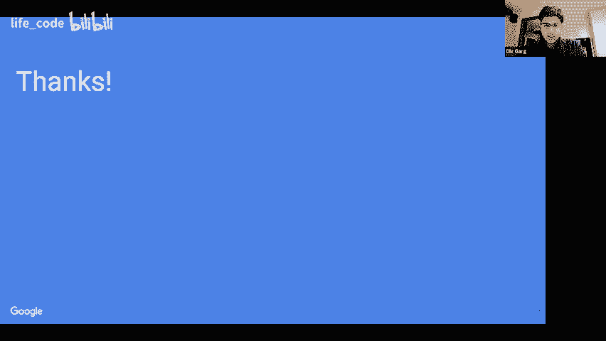

