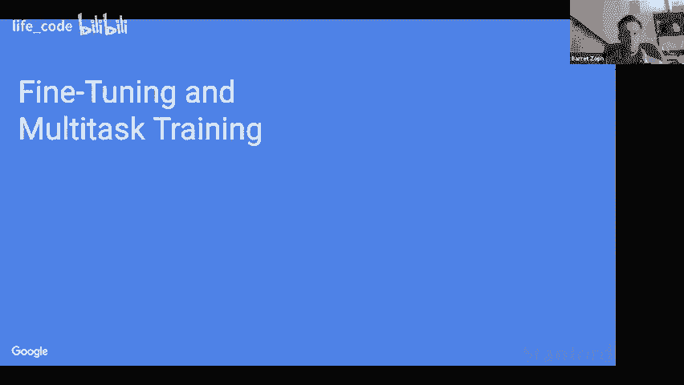

# P5：5.专家混合（MoE）范式和开关变压器 - life_code - BV1X84y1Q7wV

今天，埃尔温和我将进行一场关于通过稀疏性扩展变压器的演讲，我们今天要讨论的稀疏性是指，每个输入可以获得不同的权重集或应用不同的计算量。

奥伦，你想先开始吗？是的，我想这项工作的整体动机是，社区意识到规模可能是获得强大性能的最重要途径之一，目前不同实验室和机构之间几乎存在一种持续的军备竞赛。

各种实验室之间争相训练最大的模型。这可能可以追溯到 2020 年初，OpenAI 的一篇名为“Scing Gs for No languageage Model”的论文，其中发现模型性能遵循可预测的缩放法则，随着模型大小呈幂级数增长，无论是计算还是参数。因此，这种缩放法则在多个数量级上进行了概括，给了我们信心，如果我们训练非常大的模型。

我们可以通过推断这些缩放法则来预期稳定的性能。因此在那篇论文中，他们也发现了有趣的观察，即基本上，较大的模型更简单有效。所以，如果你有固定的计算预算，你可以预测最佳模型的大小。

总体观察是，你宁愿训练非常大的模型少量步骤，也不愿训练较小的模型更多步骤。这些模型的缩放是通过基本上增加模型维度来实现的。他们并没有考虑稀疏性，而稀疏性是你可以用来扩展架构的新维度。N DC 算是演讲的重点。这里提到的稀疏性基本上是。

你将会有基于网络输入的激活权重。因此，每个输入将经历大致相同的计算量，但将应用不同的权重。这可以追溯到 1991 年，论文称为自适应局部专家的混合，最近被诺姆·沙泽和谷歌大脑的同事们重新审视。

在 LSTM 中，它们将前馈网络和 LSTM 替换为专家混合。因此，这里的工作原理大致是你将有多个专家来实现，嗯，一个小网络，或者在这种情况下，我认为只是一个 D 矩阵乘法。因此，你还有一个附加的获取网络，在这里以绿色显示，它输出概率分布。  

每个专家应当发送信息的优先级分配。因此，这个优先级分配被计算为一个软分布。一旦你得到了它，你就可以选择几个专家。因此有不同的策略。也许我们稍后会讨论这些，而输出就是确保所有选择的专家输出的方式。因此它们在这方面取得了相当大的成功。主要是在翻译方面，但还有一些，嗯。

你知道，一些复杂性在于 Hindu 更广泛地使用于 NLP。因此，**切换变压器**论文解决了其中的一些问题，并将讨论如何，嗯，如何提高训练能力或降低通信成本，并减少模型复杂性。

好吧，没错，你想去。

嗯，是的。所以我们首先要介绍的一种方法是**切换变压器**，这有点像简化版的专家混合变体，结合了一些其他改进的训练和微调技术，这使得它能够，嗯。

要稳定训练，并且在完成大量下游任务时表现更好。因此，是的，**切换变压器**模型的工作方式如下。你有一些变压器模型，具有自注意力和前馈层，想法是我们将每两个或每四个前馈层中的一个替换为切换变压器层。因此，你可以看到左侧是一种层块，它是自注意力，然后是加法，再然后是前馈层。

然后进行反归一化，在这种情况下，我们用切换层替代正常的前馈层，我们可以在右侧看到这个的示意图，所以在右侧我们可以看到该层有两个输入，一个是标记更多，另一个是标记参数，我们可以看到这些嵌入表示将被发送到一个路由器，这正是它在专家混合中的工作方式，因此路由器基本上只是获得所有专家的分布，在这种情况下我们可以看到最高的概率是给四个专家中的第二个专家，然后右侧的标记实际上在第一个前馈权重上具有最高的概率，这就像是第一个专家。

所以我们可以看到，在 Switch Transformer 中，我们要做的很简单，就是将其发送给最高概率的专家。我们可以看到自适应计算在这里的位置，我们会有四组权重，在所有 token 之间共享某些权重和计算。

例如，自注意力层对于更多 token 和参数 token 的计算是完全相同的。但是在稀疏 Switch 层中，我们可以看到输入的浮点运算量是相同的。

实际上，具有不同的权重矩阵。

下一张幻灯片。这就是 Switch Transformer 的高层次想法：与将 token 发送给多个不同的专家相比，这样可以增加通信成本，我稍后会进一步讨论。仅将其发送给一个专家就显著简化了算法。

针对改进的训练方法，我们专注于三个不同的方面，以帮助提升稀疏模型的训练。第一个是选定精度，这样可以让这些稀疏模型以较低精度格式进行训练。这一点非常重要，因为我们训练的大多数模型其实并不希望使用 F 32，因为计算速度较慢，而且在不同进程间传输时也会有很多问题。

由于数量翻倍，其速度是之前的两倍。此外，我们还有一些初始化技巧和训练技巧，可以让它们更稳定地训练，尤其是随着模型规模的增大，采用了一种新的初始化方法和学习率调度的变化。第三，由于我们的模型有更多的参数。

我们确实注意到过拟合动态有明显不同。尤其是在对这些在互联网上预训练过的小任务进行微调时，可能只有 50 到 100,000 个示例，这使得它们更容易过拟合，因此我们还考虑了一些自定义正则化，以帮助防止观察到的过拟合。最后，我们还讨论了我们所做的可微分负载均衡技术。

这让每个专家大致获得相同数量的 token 非常重要，特别是考虑到我们希望在硬件上高效运作。我们希望每个专家接收到的 token 数量相似，因此我们在交叉熵损失中添加了一个额外的负载均衡损失。下一张幻灯片，所以我将深入讲解选定精度。

因此，当我们训练大型模型时，能够以较低精度格式进行训练非常重要。因此，我们希望将每个权重的激活从 32 位缩小到 16 位，我们使用 B float 16 表示法。我们发现，这些模型不稳定，尤其是稀疏模型在训练 1020000 步时，损失会发散，这是我们经常遇到的情况。因此，我们发现的一个关键点是，基本上需要将一部分计算转换为 float 32，以便这些模型能够稳定训练。

我们发现的关键组件是路由计算，基本上我们稍后可以更深入地探讨技术细节。但基本上，每当存在这些指数运算函数时，拥有更高的精度非常重要，因为舍入误差会极大改变某种指数运算的输出。例如，如果你有一个指数函数，将其改变 0.1、0.2 或 0.3。

这可能会极大改变像指数运算的输出，尤其是根据输入的大小而异。所以，是的，这是一件非常重要的事情，基本上不会改变计算，让模型更加稳定。下一张幻灯片。

我们发现，标准的初始化方式使模型更容易不稳定或表现更差。因此，我们采取的一个非常有效的方法是将初始化规模缩小，当我们这样做时，发现质量显著提高，这真是一个非常简单的修复。

下一张幻灯片。第三件事是，由于我们注意到这些模型更容易过拟合，因为它们有显著更多的参数。我们也仅在专家层使用了更多的 dropout，这里可以看到我们有 T5 基础模型，这是一个稠密模型。然后我们在此基础上有多个不同的开关变体，我们发现对这四个不同的微调任务最有效的方式是显著增加专家层内的 dropout 率，我们发现这对于对抗过拟合非常有效。

幻灯片上有个问题，哦，还有关于学生的。好的，让我看看。你想继续吗？我可以问一下，参考之前的表格，你提到的吞吐量和精度让我感到惊讶，似乎能匹配这个 1390 的数字。

我们使用选择性精度，似乎我会预期它是介于某种状态之间。是的，所以这基本上归结为这样一个事实：可能会有一点噪声样本，但速度是唯一我们正在计算的部分就是路由器。

这是一个，也许是计算中的一个微不足道的部分，而且没有任何通信，因此在网络中本质上就像是一个免费操作。所以无论你将其转化为 B 流 16 还是流 32，其实在我们能实际测量的速度精度范围内，根本不会影响速度。

而且，这些架构只有在每个下层都使用快速层时才会生效。所以，嗯，基本上，洪泛 32 个参与者在整个架构中是相当微不足道的。举个例子，我觉得就我所想，进行第一次像稠密层那样的权重矩阵乘法所需的计算量大约是 140 倍。因此，这是一个非常、非常小的部分，而且是的，我们不会像 Erwin 提到的那样频繁使用它们。

明白了，好的，谢谢。是的，然后，嗯，简单说一下这一点。我不会进入一些技术细节，但我们确实，知道。因为我们在硬件上训练这些东西，我觉得混合 X 范式的一个重要部分是这些东西的设计使得它能高效映射到硬件。所以我们希望进行稠密矩阵乘法。为了使这一切顺利进行，我们还希望能够让每个不同的专家接收到大致相等数量的令牌，我认为这对于负载均衡的公式并不是很敏感，我们尝试了几种方法，很多都有效。

但是，是的，基本上在使用稀疏性时，你确实希望添加某种负载均衡损失。是的，下一个幻灯片。嗯，好的，Erwin，请继续。是的，所以，框架，我们使用的库依赖于静态形状。好的，所以我们有 XLA，TensorFlow 的编译器和机器流预期张量的静态形状。然而，Switch Transformers 中的计算是动态的，因为，你知道，因路由器。

对，不同的输入会被路由到不同的专家。所以，我们需要提前指定将有多少令牌发送到每个检查点。因此，我们将引入这个专家容量超参数，以指定这一点。这将是一个静态数字，表示每个专家可以处理多少令牌。

所以在实践中，我们通过引入一个叫做容量因子的量来进行参数化。这里有一个例子。底行是，一堆令牌在一个设备上，然后你需要将这些令牌路由到多个设备或多个专家。如果太多令牌被路由到一个单一的专家停止，一些令牌会被丢弃。

正如我们所说，像是导出有一个固定的容量。因此左侧的例子中，容量因子为 1。这基本上意味着总容量。没有像额外的缓冲。用于写入令牌。因此，我们可以使用一个大于 1 的容量因子。在右侧，你有一个 1.5 的例子。这意味着现在每个专家大约有三个槽位可以处理三个令牌。

因此，这可以防止令牌丢弃，因为我们有更多的容量。但问题是，这意味着更高的，嗯。这意味着设备之间的通信成本更高。是的，好吧，这样可以。是的，请继续。但是是的。因此，我们还实验了一个叫做“没有令牌被落下”的方法。

这个想法如下。由于我们必须为每个专家设定一个固定的批量大小，并且可能会丢弃令牌。我们在想，嘿，丢弃令牌就像有一些令牌没有任何计算应用于它，这可能会损害模型性能。

那么如果我们进行多阶段路由程序呢？首先，你进行正常的路由，即将每个令牌发送到其概率最高的专家。但对于任何丢弃的令牌，你再发送给它们的第二高概率专家，依此类推，你可以基本上重复这个过程，以保证没有令牌被丢弃。

有趣的是，实际上，这种方法在实证上并没有提高模型性能，反而有些损害了它。我们觉得这实际上非常有趣。我认为直觉是，一旦模型学习了，它想把一个令牌发送到一个专家。它真的想将该计算应用于它，而仅仅应用其他计算并没有完全具备相同的特性，实际上可能是有害的。

所以我们觉得这很有趣，因为我们非常乐观这可能会提高性能。但结果并没有真正产生差异，这让我们感到惊讶。我们有一个问题来自。嗯。我觉得这个问题确实涉及到你刚才提到的最后一点。当我考虑混合专家时，通常它们会专注于不同的事情，所以我认为这就像是。

就像很多情况一样，我只是想知道。如果你把它发送给第二好的专家或者其他的。如果所有的令牌都特别适合一个专家，而你只处理，比如说 20%的令牌。这样比重新路由到其他地方要好得多。是的，即使你丢弃了很多令牌，把它们发送到第二、第三或第四个最佳选择也没有好处。而且我们发现的一个有趣特性是。

你知道我注意到这些模型令人惊讶地对令牌丢失非常鲁棒。尤其是在微调期间。所以是的，在标准范式中，我们会先预训练这个东西，我们会有一些负载均衡损失，这使得令牌实际上相当均衡。但在微调期间，我们真的想在一个特定任务上进行微调，我们实际上研究了这个确切的问题，我们在研究是否在微调期间拥有负载均衡损失是否有帮助，如果你有负载均衡损失，是的，这种方式确实鼓励我们为特定任务尝试使用所有专家，而不是关闭它，而是肯定会有一些先前的专业化，实际上最好就是关闭辅助损失，即使是 60%到 70%的令牌被丢弃，实际上表现得比所有令牌均衡要好得多，但负载均衡损失难道不鼓励所有专家学习非常相似的权重，然后随机分配令牌吗？

因为那样一来，发送到哪个专家就无所谓了。所以当我们使用负载均衡损失时，路由机制肯定是学习到的。因此，模型确实被鼓励去选择一个它想要发送的专家，这是正确的，但如果所有专家都学习相同的权重，那么路由器基本上会学习到，哦，发送到哪里都无所谓。

所以如果你鼓励负载均衡，你就是在鼓励。技术上来说，就像你想让任何专家的损失都适配，对吧？我的意思是，这可能是极端行为。如果你有一个非常高的负载均衡系数。但实际上这个系数是可以调节的，我们吸收这些值以获得足够智能的钢铁贷款，比如说有意义的路由。是的，因为这就像是在交叉熵损失和负载均衡损失之间的平衡，一方面是的，你肯定想鼓励模型保持平衡，另一方面你也想要良好的经验性能，是的，模型能够肯定地在一方面学习和专门化专家，使得它们有不同的权重，这样你就能确定某些令牌会发送到特定的专家，但另一方面仍然保持最近的平衡，以便模型能够在现代硬件上高效运行。

Excycl。我们教室里也有一个问题。所以我想问的问题是，似乎这是一个非常实验性的讨论，我们在讨论浮点精度，讨论不同的方法，而这些方法目前表现良好，每当我们处理一组客户时，总会有一个研究问题，我觉得我错过了，所以我们试图通过这些实验回答什么？

是的，我认为高层次的研究问题是，你知道的。我们能否创建一些模型，从自适应计算的角度出发，你知道的，我们能否尝试让模型更好地模拟我们认为模型应该自然使用的动态，也就是不同的输入应用不同数量的计算，赋予它们不同的权重，基本上都是这样。

基本上，我们试图研究并找出如何为这些模型创建一个新的框架，以便训练，而不是像稠密模型那样，对于每个输入始终应用相同的计算，这很有趣，因为当你说应用相同的计算时，人们可能会想象。

对我来说，立即想到的是花多长时间来考虑某件事。我所说的意思是，如果我们想进行可变长度计算，可以想象我可以进行短时间的计算，也可以进行更长时间的计算。

但是这个想法是，为什么我们不考虑不同计算的维度，我是说当然假设这些专家确实需要学习不同的东西，我想你会在后面提到。那么，为什么我们立即想到专门的专家，而不是思考可变长度计算呢？

所以是的，实际上我们稍后会在演讲中深入讨论一些可变长度计算的内容。我觉得这两者都是重要的方向，应该同时推进。我想，是的，我想这有点像，你知道的。我想我并不是要冻结我的问题，而是想理解你为什么决定首先处理这个。

我想了解为什么你的团队首先选择这个方向。是的，绝对如此。所以我认为，从经验上看，稀疏性在深度学习领域所带来的结果比自适应计算要好。我认为我们使用这些东西的方式与我们现代硬件的映射非常好，这也是非常有前景的。我认为我们看待这个问题的方式是，稀疏性是朝着更有趣和更通用的自适应计算迈出的第一步，因为我认为这些东西是复杂的，通常从一些运作良好的东西开始要比尝试一些不太成熟的东西然后再让它运作得很好要好。

所以我认为我们大概是从稀疏性开始的，像 nu Shaser 和其他人在 LSTM 背景下取得了很好的效果。我们对将一些东西移植到变压器上很感兴趣，希望让它们运作良好，然后慢慢开始扩展到你提到的其他自然问题，比如，好的，而不是每个核心有不同的权重。

让我们也许每个核心都有不同的计算，这就是我想我们如何建立自然的进展。我们的研究很好，感谢你。你觉得呢，Errwin，还有什么要补充的吗？嗯，是的。我觉得我有点把自适应计算和稀疏性视为。您知道，相关但又是分开的东西。因此，您知道，特别是每个示例不同参数，自适应计算可能是不同数量的流。

我们有一些与谈话和丢弃相关的内容，但那种。不是的。那不是领域。主要动机，肯定，如巴雷特所提到的。我想说，没有人真正弄清楚深度学习中的自适应计算。而其中一个原因是因为我们有这些。您知道，加速器，对吧，期望，期望像。

不是的。我们需要处理批量数据并行性，对吧？我们所有的加速器和框架都使用这种 SPMD 范式，我们应该将相同的计算应用于两个示例。因此，如果你查看文献，你会看到像普适变压器这样的工作，替换了变压器中的前向适应。

仅仅是一个递归权重，所以它在每个标记上有点像 LSTM，而 LSTM 可以在某些标准上停止于不同的时间和空间，但这些东西的实现方式仅仅是通过遮罩。因为它需要以 SPMD 编程风格来实现。因此，确实，spaity 最开始的工作会更容易。而且还有。

之前在 LSTM 上有一些结果。因此，关于第一个问题，你知道，类似的研究问题就是，哦，我们能否设计出更高效的模型？

而 spaity 是一个尚未得到太多探索的新维度。是的，我认为，您知道，我对这作为研究问题很满意。很好，好的，接下来是下一张幻灯片。是的。哎呀。是的。再一次，把所有内容放在一起。因此，开关变压器层选择一个专家，就只是顶尖的专家，然后结合一堆一般稀疏模型的改进，以便，您知道，让它更好地微调，允许它，您知道，更加规则化。

让它可以用更低精度的格式进行训练，还有很多技术细节需要处理，以使它们能够顺利训练和工作。因此，我们还希望进行一次比较，比较顶级一和顶级二路由，因为顶级二路由是最流行的技术，因此在这里我们可以看到，我们有两个不同的稠密模型以不同的大小进行训练，我们将查看预训练的负对数困惑度。

是的，数字越大越好。接下来的幻灯片中，我们将研究不同容量因子的模型。容量因子为 2.0 基本上意味着每个专家可以接收两个标记的缓冲区。我们将比较如**Top-1**与**Top-2**路由。

同时比较它们的速度以及达到某个阈值质量的时间。好的，没错，在容量因子为 2.0 的情况下，我们可以看到**MOE**模型优于**Switch Transformer**，这非常合理，因为**Switch Transformer**仅向每个专家发送一个标记。

专家混合模型发送两个标记，这使得这个额外的缓冲对专家混合模型特别有利。因此我们注意到了这一点，下一张幻灯片，或者说下一个。现在，当我们降低容量因子时，**Top-1**路由的真正有趣的部分就出现了。高容量因子有许多缺点，其中之一是它确实会增加将标记发送到正确专家的通信成本，同时也会增加计算成本和大量内存开销，因此如果可以降低容量因子，通常是非常有利的。

所以我们在这里看到的是，当容量因子较低时，**Switch Transformer**实际上优于专家混合模型。我们可以看到，在质量达到阈值的时间上，我们到达得更快，因此即使在两个模型之间也是如此。

容量因子 0 和 1.25 就像我们设置中看到的那种**Pareto 最优**，在较低容量因子的情况下使用**Switch Transformer**是最优选择，因为尽管在单步的质量上稍微差一些，但运行速度更快，因此这是一个**Pareto 最优**的决策。下一张幻灯片。

我们还可以看到，在容量因子为 1.0 的情况下，这确实对**Switch Transformer**带来了不成比例的好处，甚至在**Annaparto**的观点上优于 1.25 的容量因子。有趣的是，由于**MOE**也进行了一些额外的计算，我们也可以在模型的其他地方增加计算量。

我们可以看到，这是一种更高效的计算分配。所以，总体而言，我们的结论是，使用**Top-1**路由的较低容量因子比在较高容量因子下使用**Top-2**路由更加**Pareto 高效**。

下一张幻灯片，Oran，你可以接手了。好的，接下来我们来看一下**Switch Transformer**如何随着开关层中专家数量的增加而扩展。

所以在右侧，你会看到一个展示复杂性的图表。Vus 训练步骤针对不同的切换架构，范围从 Tfi 基线，也就是基本上没有专家或单个专家到 128 个专家。你会看到随着我们增加专家的数量。

也增加了稀疏参数的数量，你会得到某种速度提升，你知道。你会得到稠密基线的速度提升和所有那种边际收益递减。通过增加专家的数量，之前的图表是查看复杂性与强度步骤的关系。

在这里我们查看复杂性与强度时间的关系。这包括，你知道，拥有更多专家时的额外通信成本。你知道，与稠密基线进行比较。因此这是针对基于切换的或 T5 基线的，我们观察到相对于我们的 T5 基线，有高达 7 倍的提升。嗯。所以，你知道，仅仅是。

也许需要将这些数字进行背景化。你知道，7 倍的速度在规划中是很难获得的。因此，我认为这是其中之一，你知道，这是一个结果，可以激发对体育模型的极大兴趣。即使现在只是为了预训练，拥有那个数字就像，你知道。

也许它确实有。这里可以获得显著的东西。好的，所以体育缩放法则。因此在这里我们会看看。所以它的哲学与。稀疏矿物参数，通过增加专家的数量来提高。因此，与那种神经缩放法则的论文相似。

我们观察到，当你增加参数时，即稀疏参数，并保持 flops 固定时，你会得到持续的收益，但收益逐渐递减。好的，所以现在我们要比较专家并行性和模型并行性。因此，我们引入稀疏性或专家并行性作为扩展模型的新维度。但是，当然。

还有另一个针对稠密模型的，它简单地是模型并行性，你知道。模型权重在调用上进行分区，一旦它们超过单个核心可以处理的最大大小。好的，所以。是的。左边的广告是优先展示的。是的，所以本质上我们所做的是比较基于切换的模型与稠密空间，并且我们还与使用模型并行的更大稠密模型进行比较，我们可以看到，你知道，基本上当我们想要扩大模型的规模时，我们有两个方向可以选择，我们可以通过模型并行性增加 flops 的数量，或者通过稀疏性增加参数的数量，因此我们可以看到，即使与通过模型并行性扩大的稠密模型相比，稀疏性仍然是在扩大模型规模时更有效的方法。

通过模型并行 ism，依然能比这个更大的密集模型实现 2.5 倍的速度提升。酷，所以稍微调整一下幻灯片。基本上，这里 T5 大型是使用其他部分的密集模型。好的，继续。好的。是的，还有一件事我们也想看看的是，如果你拥有很少的计算资源或者只有少量专家，这些专家模型是否有效。

所以通常在设计这些模型时，我们每个核心都有一个专家。但如果你没有一个大型集群来运行这些东西，比如说你只有一个有两个核心的 GPU，那么有两个专家是否比一个密集模型更有效，答案是肯定的。

所以即使只有很少的专家，我们也可以看到相当好的扩展属性。这对这些模型在较低计算环境中使用非常有前景。

下一张幻灯片。或者你想继续。好的，是的，所以。是的，所以看看。你知道。当我们使用不同类型的参数时，它们的表现是什么样的。即通过参数将 exp 添加到模型并进行模型并行，以实现数据并行，这在目前是主流范式。

所以，你知道，我想，在之前的幻灯片中，我们主要谈论了 X 并行，但当然，密集模型和大型密集模型使用模型并行。所以 G3 和其他大型模型，他们所做的就是在不同的核心之间共享模型权重。是的，我们有一个问题。哦，是的，我只是想知道，因为我觉得有。

我不知道你是否在其他地方看到了相关的研究，但我想在某篇论文中提到，专家越多，样本效率越高。我只是希望你能给我们一些关于这个的直觉，因为我。不了解为什么会这样。

所以我想，是的，也许嗯，是的，所以我想，比如说。关于更大模型的所有这些工作都是更有效的。

在这些扩展法则的上下文中，更大意味着更多参数和更多计算量。随着专家数量的增加，参数增多，但计算量不变，但模型在某种意义上仍然更大。

所以我想基于更大模型在样本效率上更高的直觉，实际上并不令人惊讶的是，这些拥有更多专家和更多参数的模型样本效率更高。我想这就是我的高层次直觉。是的，我会说这是可以预期的。

你知道，更多的专家可以提高样本效率。特别是如果你看看训练设置。对，在训练表中。好的，很好。那么我们在哪里呢？是的，所以是的。好的。所以我们看看模型权重在不同场景下的速度。这是第一个数据并行性。这是使用的典型设置。

尤其是对于不需要母体并行的大的太阳网络。所以让我，嗯，让我解释一下。好的，我就直接讲到最后的图，并解释一下如何看这个图。好的，我们有 16 个进程，它们组织成一个 4 乘 4 的网格，对吧？所以每一条虚线。

每个 4 乘 4 的虚线表示不同的核心。在第一行，研究模型权重在核心上的分布，而第二行，它展示了数据。因此，字面上的例子和标记在核心之间被拆分。然后，理解这个图的最后一件事是每个。嗯。是的。

这里每种颜色的阴影方块标识一个唯一的权重矩阵。好的，所以我们从数据并行性开始。对于数据并行性，相同的模型权重在所有核心之间被复制。数据仅仅是在我们的核心之间被划分，所以这对应于。你知道的，如果你喜欢使用图注的描述。

刚才给出的图注说明。所以接下来我们有模型并行性。这有点像一个理论示例，因为在实践中，人们总是将模型并行性与数据并行性结合使用。但是如果你只做模型并行，现在你将有一个被划分到所有核心的单一模型权重，而你的数据将只是被复制。

所有核心说。现在我们有模型和数据并行性。这是大型密集网络的典型场景。因此在这种情况下，模型权重在一部分核心之间被划分，这部分核心处理不同的数据批次。在这个例子中，我们有。

你知道，四个左右，所以这里的第一个子方块表示模型权重被划分到四个核心。而且这在数据并行维度上被复制，大约四次。在模型和数据并行的情况下，数据在模型并行核心之间被复制，并在数据并行核心之间被划分。

接下来我们有专家和数据并行性。因此在那个场景中，这有点类似于数据并行性，但现在每个核心将持有不同的模型权重，这通过不同的颜色来表示。并且在数据方面，数据只是简单地被复制，对不起。数据是在所有核心之间被定位的，就像在数据并行场景中一样。最后。

我们有最右侧的列，我想是的。那是用于更大模型的开关变换器论文中的设置。所以在这里，对于模型，每个专家被划分到多个核心中。因此在那个例子中，我们有四个专家，每个专家对应四个核心。

数据在多个并行调用之间复制，并在数据并行调用中进行分区。因此，这有点复杂，口头上理解起来比较困难。但 Switch Transformer 论文中有一张很好的图，并配有说明来解释这一点。是的，也许我们可以。没有 Barret，我们可以快速添加一些关于这个在实践中如何实现的内容。

所以。有一篇名为 Mesh Transformer 的论文，扩展了批处理或数据并行到更通用的 SPMD 样式编程。因此，不同的实验室有不同的框架，但这篇论文为通用的 SPMD 分布式计算奠定了基础。

这是训练大规模模型所必需的。在网格抽象下，基本上我们有一个过程的网格。ch，这个网格有维度，命名维度。这些命名维度指定了张量维度如何在网格维度之间进行分区或复制。因此，这种简单的抽象支持了你知道的并行性。

还包括模型并行性，尤其是同时进行的导出并行性，因此我邀请任何感兴趣的人查看那篇论文，因为那是有点的。

你知道，这为理解这些事情奠定了基础。好的，Dar 想去吗？好吧，接下来我们要谈谈如何将这些并行策略结合起来，形成一个 1。

6 万亿参数的稀疏模型。

所以接下来的幻灯片。是的，我们在这项工作中训练了两个不同的非常大的稀疏模型，并将它们与最大的 T5 模型进行比较，我们可以看到 T5 XXL。这是一个稠密模型，也是 T5 论文中训练的最大模型，约有 130 亿个参数，这里列出了许多模型维度，比如 D model DF，这些只是张量的各种大小和形状。

层数、头数，重要的是我们还提到了负对数困惑度。在第 250k 步和第 500k 步，因此我们设计了两个稀疏模型来测试，测试扩展与稀疏性、扩展与稀疏性以及 flops 之间的关系。所以首先让我谈谈 Switch XXL，它在每个 token 上的 flops 数量与 T5 XXL 相同，但有 64 个专家，这使得它的参数约为 4000 亿。

我们可以看到，在步骤基础上，它的性能相当不错，实际上超越了 T5 XXL，差距相当大。有趣的是，我们设计的第三个模型 SwC 有 1.6 万亿参数，但每个 token 的 flops 明显少于以上两个模型，几乎少了 10 倍 flops，因此通过减少 flops 来换取更多的稀疏参数。

我们可以在每个步骤中看到，switch C 模型的表现很好，但实际上没有更高 fl 模型那么好。然而，在一个以 TPU 小时为 X 轴而不是步骤的 Pareto 轴上，switch C 模型的表现实际上超越了两者，差距相当大。因此，对于预训练性能，我们看到，拥有大量稀疏性和较少交换实际上是非常有利的。

😊，下一页。是的，所以这两个稀疏模型实际上是在试图探讨诺姆·肖尔的假设。就是说，参数在知识推理中是有用的，而计算`aK flops`则对智能有益，因此我们将通过不同的稀疏模型来深入探讨这个问题，并在不同任务上进行微调。

其中一些任务更需要知识，而其他任务则更依赖推理。对于我们想要给出的任何手动定义来说，都是如此。好的，固定一下，能不能回到上一页？抱歉，好的。对于一个固定的上游预训练任务，参数的独立性是否重要？

我们将关注两个任务，其中一个是 super glue lu，这是一种推理任务，另一个是类似于 Trivia QA 的知识任务，你只需给出一个问题并得到答案。

好的。在这里，我们将查看 superglue 质量，所以 X 轴是预训练性能，Y 轴是微调后的 superg 分数。有趣的是，我们可以看到，稀疏模型在固定的预训练困惑度下表现得确实不错。

微调时效果较差。这一点在图的右上部分尤为明显，那里密集模型的微调效果确实优于它们的稀疏对应模型。下一页。有趣的是，当我们在知识密集型任务上进行研究时。

在固定的预训练困惑度下，稀疏模型的表现出奇地好。所以对于一个大致上有相同困惑度的模型，我们在这些知识密集型任务上获得了很大的提升，这非常有趣，同时也显示了仅在预训练指标上比较的风险。这些模型在预训练指标上可能完全相同，但在微调不同任务时却有很大的差异。

下一页。有趣的是，这里所有的 switch 模型都是各种模型，它们仍然有相当数量的 flops，但红色模型实际上是 1.6 万亿参数的稀疏模型，尽管它的 flops 很少，但参数却非常多。我们可以看到红点在这里，与其他同样具有良好困惑度的稀疏模型相比，它的表现确实差得很离谱。

所以是的，这确实非常有趣，显示出在预训练期间具有较多稀疏性的模型，在某些需要更多推理的指标上表现不佳，但在知识密集型任务上却表现出色。下一页。是的，因此我们可以看到，它在预训练的困惑度上是一个巨大的异常值，在下游的问答任务中表现得非常出色。

下一页。

是的，好的，还有一件事，我们打算做的是观察稀疏模型在不同规模下的微调特性，看看它们的表现。下一页。是的，在这里我们尝试了两种不同的模型，一个是 T5 基础版，然后我们制作了一个平坦匹配的稀疏对比模型，当他们说平坦匹配时，就意味着每个 token 的计算量是相同的，但现在我们只使用专家，所以我们对基础版和大版都进行了这个实验，实际上我们看到几乎所有任务中，除了两个架构任务，稀疏模型的表现相当不错，这无疑是个好兆头，因此我们看到这些模型非常稳健，预训练效果良好，经过适当扩展后微调效果也不错，通过增加计算量和稀疏性，而负面结果通常是当稀疏性过大而计算量不足时。

下一页。是的，我们还想关注多语言训练，因此我们之前都是在仅限英语的情况下进行研究，我们还想看看稀疏性在多语言环境中的作用，因为我们觉得这将是稀疏性表现良好的非常自然的地方，专家可以跨语言进行专业化。

我们确实看到了强劲的结果，因此在 91% 的语言上。我想到大约 100 种语言，我们看到超过至少 a4 的性能超越了 MT5 稠密模型。下一页。还是你想继续？不，继续。好的，是的。我们还想讨论的是蒸馏。

这些稀疏模型的一个缺点是它们会有更多的参数，这意味着，如果你要提供这些模型，可能需要高吞吐量的用例，或者你可能需要将其蒸馏回更小的稠密模型。

所以我们在这里所做的是查看 T5 基础模型和转换基础模型，并关注它的预训练性能。然后我们进行一些不同蒸馏技术的消融实验，发现通过最佳技术，我们可以保持约 30% 的稀疏性质量提升，同时将其蒸馏回稠密模型。下一张幻灯片。是的，然后我们在多个尺度上进行研究，结果显示，从稠密模型到稀疏模型，再蒸馏回稠密模型时，约 30% 到 40% 的收益可以被保留，因此你可以去掉多达 99% 的参数，同时仍然保留大约 30% 的改进。

这是非常有前景的。下一张幻灯片，等等，抱歉。好的，抱歉。你能再说一遍最后一句吗？你说你可以保留教师利益的 30%。😡 是的，基本上是的，所以是的，正是这样，我们在说，我们训练一个稀疏模型，然后将其蒸馏回稠密模型。

与从头训练稠密模型相比。当你查看从头开始的稀疏和稠密模型之间的差距时，再与蒸馏后的稠密模型之间的差距进行比较，你有什么发现？你继续。哦，是的，可能让我再做一个快速的高层次总结。所以我们将进行的比较是从头训练一个稠密模型。

我们将从头训练一个稀疏模型。然后我们还会进行第三个实验，将稀疏模型蒸馏成稠密模型。蒸馏是什么意思？我们基本上是想要匹配教师的 logits。就像是标准的做法，匹配每个 token 的 logits 或软概率之类的。如果可以的话，我可以插入我的问题，我在挣扎的是。

我如何解释作为教师和性能的百分比的对齐？是的，好吧。基本上是查看稠密模型和稀疏模型之间的差距。因此，我们会让稠密模型获得一些性能，让稀疏模型获得一些性能，然后稠密模型与稀疏模型之间的蒸馏结果将位于这个范围内，我们基本上是说这是 30% 的范围。

所以在 0 到 1 的区间内，稠密模型到稀疏模型大约是 0.3 的位置。我明白了，所以这并不是说教师性能的百分比并不意味着如果教师使用教师的猜测或预测作为真相。

这并不是说蒸馏模型与教师模型匹配的概率是 33%。不，不，确切地说。基本上是在说你获得了大约 30%的质量提升。是的，确切地说，好的。那么如果我们可以倒回幻灯片，我有一个不同的问题，但我不想在谈论所有这些不同的 T5 基础时打断。

我对 T5 了解不多，我很好奇你知道 T5 在训练时，损失函数中是否有权重惩罚。有没有办法进行限制？没有。没有办法在那些稀疏或密集模型中进行限制。我很好奇，那密集模型与开关模型相比，添加一些激励去除无用权重的权重正则化时表现如何。

所以某种程度上，可能像 L1 项或者类似的东西，快速了解一下。嗯，我只是想知道，因为我们在谈论稀疏性的好处，我在想，这种稀疏性带来的好处有多少是因为某些因素。

实际上，开关模型所做的，如果我理解正确，也许我并不完全理解，是在前馈层中的开关模型。就像你将一些权重固定为零，这就是稀疏的意思。嗯，实际上我们确实是在努力注入更多的权重。所以我们实际上有点像是在做一些，可能是有些悖论，因为我们说的是开关变换器，但我们的想法是这样的。

嘿，我们实际上想要显著更多的权重。并不是说你会将权重归零，而是在一个更大的权重矩阵中，这样说合理吗？我明白了。所以对我来说，似乎一个相关的基准就是问，如果我有密集矩阵，但我激励它，比如说对权重施加 L1 或 L2 惩罚，那会发生什么？我想知道这与之比较如何。是的，我们没有进行这个实验，但这也会消除密集模型中的权重，所以如果有的话。

所以是的，是的。最后一点是，如果你仅仅添加像 L1 惩罚损失。你不会得到结构稀疏性。就像这里，我们知道。这不是在你庞大的权重矩阵中随机的权重是 0，而是，实际上是像块一样，取决于每个 expo 的块。

没错，这种结构允许整个通信的东西，是的。正是因为你有多个关系在这里。所以我完全同意那个块结构，我想说的是开关模型有这种非常丰富的结构，它不仅仅是稀疏的。它还具有这种丰富的结构，我试图在我的脑海中理清楚，是稀疏性提供了优势，还是你所建立的额外结构，这就是性能提升的原因。所以这就是我问的原因。

所以，这个结构是使得你能够利用你有多个调用的事实。但是如果你没有这种结构，你仍然需要路由到所有内容，因此会产生更多的通信成本等等。然后你第一个问题是什么，抱歉。

我不太确定是否有问题，我想我想说的是我在尝试澄清。是的，不管怎样。但我同意，这有点奇怪，因为稀疏性本身是有意义的谱系。对吧，比如说，压缩和模型剪枝就是一种稀疏性。但开关变压器和 ME 也被称为稀疏性，这两者是相关的。

但绝对是动态的，针对不同的目标，所以这是一个非常有趣的稀疏性概念。可是你有更多的参数，我需要再考虑一下，谢谢。是的。就像是在这个巨大的权重矩阵中的一个点，正是这样。是的，是的，我之前没有意识到这一点。谢谢你指出这一点。

我对消融部分有很多问题。是的，首先好的，如果你把它再提炼回去，现在你有了一个技术上来说是密集层架构，对吧？那么整个专家的概念是，某些令牌将被发送到不同的专家，因为它们在理解这个令牌的某些方面上更加专业。那么如果你回到这个密集层，你不就基本上只能服务于你基于这个密集层的专家吗？这些令牌可能表现良好，而其他的令牌则被抛在了后面，对吧？

是的。实际上我很抱歉，我觉得我没有完全理解你的问题。那么，你是在询问，我们是否只是针对特定数据集进行调整，以便弄清楚如何使用它？是的，或许具体来说，比如对于超级胶水，假设你想要提供一个能够很好地处理超级胶水的模型，我认为这个想法是将稀疏模型提炼成一个密集模型。这样你就得到了一个压缩的密集模型，它的表现要比从零开始训练或从预训练的密集模型进行训练更好。然后你是想说再说一遍。

你必须选择一个专家，对吧？不，不，不。你可以把所有的都提炼出来，因为你只是在匹配模型的输出。所以你可以把稀疏模型视为一种黑箱。我们所做的就是让密集模型匹配实际的最终输出。

令牌预测。哦，天哪，关于这个。好的，抱歉我不太熟悉这个“消融”的概念。所以我想这就是我整个困惑的来源。好的。是的，当然，因为我想这里的一个动机是，拥有专家可能会让服务变得有些困难，因为这需要更大的拓扑结构。

假设你有八个经验。你需要像……好吧，我想你可以在更少的调用中拥有多个导出。但是，你知道，假设这稍微难一些解决。所以如果我们能够从每次训练中获得好处，然后使用蒸馏将其转化为一个稠密模型进行服务，这样会有益处。因此，我认为这就是那个实验的动机，对吧，Eric？是的，没错。

好吧，我们不是这样吗？是的，继续吧，Ben，我刚刚说。我想还有一个书面的问题，所以是的。继续吧，真高兴你问。哦，是的，听起来不错。是的，你们到目前为止的讨论，问题是想知道你是否认为在构建模型方面有没有任何有趣的方向，比如显式优化并行训练的模型。我想 moE 模型在这里做得很好，而且在推理时，它的计算量也很少，这样会非常有用。

但是或者在前向传递时，我想你认为在分布式训练方面是否有任何有趣的方向，其中你可能会有一些明确架构为具有许多并行头或其他像是你知道的那种明显可并行化的特征的模型，还是仅仅使用标准的那种呢？

通过增加更多层来扩展模型，然后仅仅依靠模型和数据并行性就可以很好地工作。是的，所以我认为，让我确保我完全理解。所以是的。我认为目前为止，我们的模型确实是与硬件进行协同设计的，以及形状和其他方面。你知道，所以我认为从高层来看，是的。

我认为在代码与硬件、分区算法和模型方面有很多有趣的研究。😊 我认为，鉴于我们有这种 SPMD 网格样式的分区，我们已经在某种程度上设计我们的模型，使其能够很好地适配它。所以例如。

当我们想要扩展模型时，我们第一个扩展的维度就是内部隐藏维度。扩展这个维度确实有一些很好的特性。基本上它在某种程度上变得与你的一些通信成本是独立的。当我们查看这些计算设备上的计算与内存操作时，这一点是非常好的。

是的，没错。就像我觉得在设计这些模型时，我们实际上是在设定一些维度，以便它能够很好地映射到硬件上。所以几乎就像是，你知道，鉴于我们有这种模型数据并行性，我们实际上是更有针对性地设计模型。但我也觉得有很多新的有趣的分布式算法等等。

这使得模型设计变得非常有趣。我觉得一件非常酷的事情是微软的零分区工具。这也为模型设计和扩展等方面带来了一些新的有趣的影响。所以，我认为这是一个非常丰硕的研究方向。如果这回答了你的问题的话。是的，这非常有帮助而且有趣。嗯。😊。

是的，我对我们在硬件、模型、分区策略等方面的未来非常乐观，因为要想做到很好，你需要了解这三者，并将它们的发展相互交织。是的，是的，这听起来很棒。

很酷，是的，总结一下，切换变压器相对于专家混合来说是一种很好的简化，我们看到在许多非常强大的 T5 模型上，预训练的速度提升非常显著，而这些模型是非常强的基线，我们看到我们可以有效地将稀疏模型蒸馏回密集模型。

而且你知道，通过我们所讨论的一些新技术，得到了改进的预训练和微调。我们也看到这些模型在多语言数据上有效地工作，而且我们现在可以很容易地成功训练到 1。

6 万亿参数的模型，这非常有前景。下一张幻灯片。因此，我们还想谈两张幻灯片关于一些新工作的内容，实际上是使用这些类型的模型进行计算机视觉，实际上也涉及到它们如何用于某种程度的自适应计算。

这不仅使每个输入获得不同的权重，而且有时不同的输入将应用不同的计算量。是的，所以谷歌苏黎世团队在这方面有一些很好的工作，他们基本上在图像分类方面看到了类似的扩展属性，增加专家数量并利用稀疏性使他们在图像分类上获得良好的性能。

下一张幻灯片。有趣的是，他们讨论的一个内容是能力因子。所以我们在讨论像 1、1.25、2.0 这样的值，这意味着在 2.0 的值下，每个专家有两个 token 的缓冲区。但他们实际上研究了低于 1 的情况，这意味着在 0。

这意味着只允许一半的 token 数量。而且好的一点是，他们在图像分类中做了这个，而且在图像中有很多冗余，他们注意到通过只允许最多 1/10 的图像部分通过稀疏层处理，实际上可以获得非常好的性能。

所以是的，我们认为这是一个非常好的方向，结合稀疏性和自适应计算。😊，而且是的，非常感谢你们的邀请。就是这样，演讲结束。确实比其他人有趣。抱歉其他人来这里，所以你知道。道。所以我会问一堆问题，然后我们可以在课后为学生举行一个开放式问答环节。

有一件事是你有没有尝试使用更线性的注意力机制，比如改革者之类的东西来扩展计算？

我个人可能没有，我还没有亲自做过这个。是的，所以。你知道。我想我们可以评论一下。你知道，注意力。来自注意力图的成本并不是。这些大型变换器中的主导曲线。所以，你知道，使用 Millar 注意力的动机是它减少了注意力图的二次成本。

对吧？嗯。但到目前为止，至少，在典型的 NLP 设置中，比如超级 gly far 等。随着模型的扩展，大部分内存来自模型权重，而不是来自注意力图。这也是因为你知道，使用非常长的。上下文或序列长度并没有改善这个结果，所以你知道，使用普通的自注意力机制已经是一个非常强的基线了。

明白了，好吧。另一个问题是你认为这种机制是否更具可扩展性。比如你能否构建像 10 万亿参数模型这样的东西，你觉得呢？

是的，我绝对认为，老实说，最大的限制之一是你知道的。这甚至不一定是限制，只是你必须把参数放在某个地方，而设备上的存储是有限的。

但是如果你有足够的设备，你知道，是的。你可以分区权重，我觉得没有什么能阻止它。明白了，那你觉得你个人的方向是什么？像变换器的扩展会走向哪里？是否会有更多的研究尝试使用这样的变换器机制来构建专家，还是你认为社区需要其他东西？

是的，我确实认为专家混合方法应该找到它的出路，或者至少你知道像切换转换那样的稀疏层，但我肯定认为它们会融入未来的大型模型中。我认为它们确实带来了很多好处，而且在高吞吐量应用中也非常出色。所以我认为，稀疏性的一个缺点是，如果你看看每个模型权重的性能，它们总是会比稠密模型差。因此，如果你真的受到限制，想要设计一个尽可能适合小设备的最佳模型，那么它们可能不是最佳解决方案，因为稀疏权重的效果不如用于所有内容的稠密权重。

所以我认为这真的取决于应用，但我对在预训练期间使用大量数据并行训练这些模型时非常乐观，然后在更高吞吐量的示例中为它们提供服务。我觉得这实际上可能会是一个相当大的胜利。

所以这就是我对稀疏性在其他方面应用的看法，是的，我认为我不知道有很多令人兴奋的研究，你知道从许多线性注意力的东西，自适应计算，新预训练目标，你知道，未来会是什么样子很难预测，但有很多令人兴奋的事情可以期待。听起来不错，现在我们可以进行一轮学生提问，所以完全可以投票。

