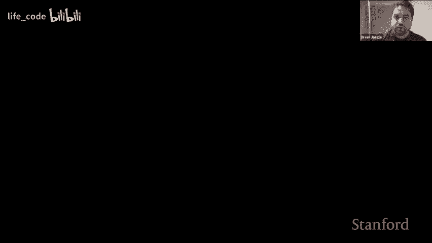
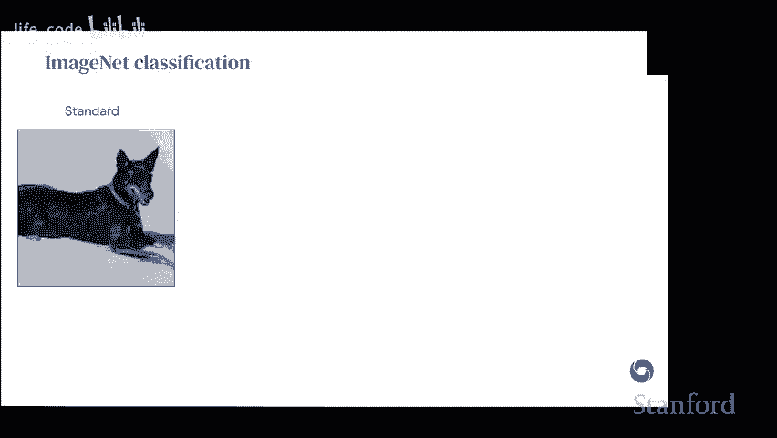
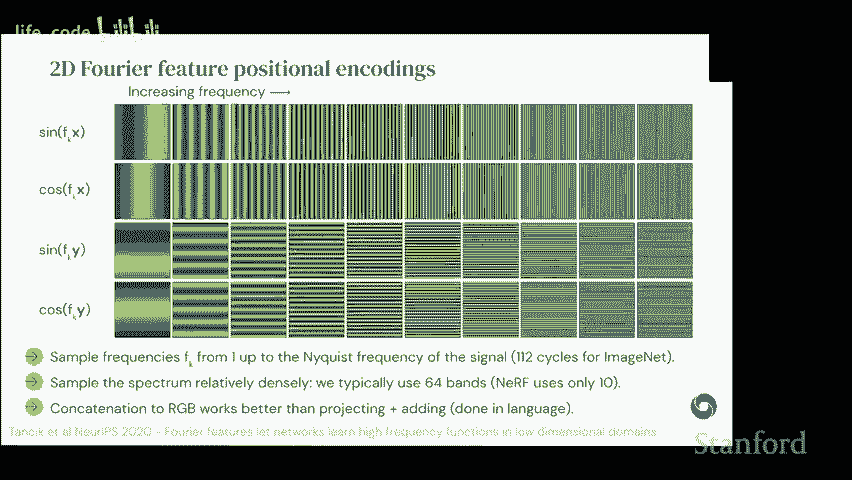
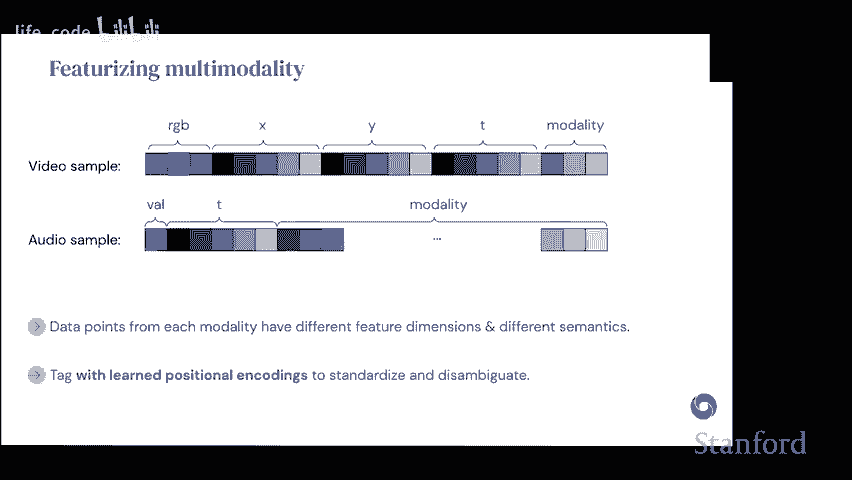
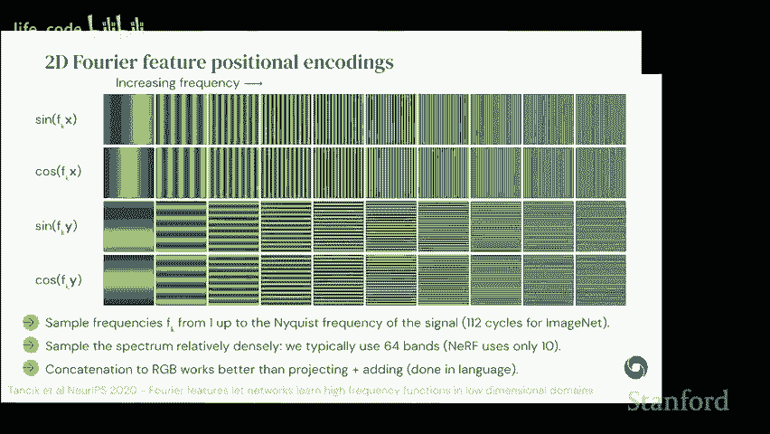
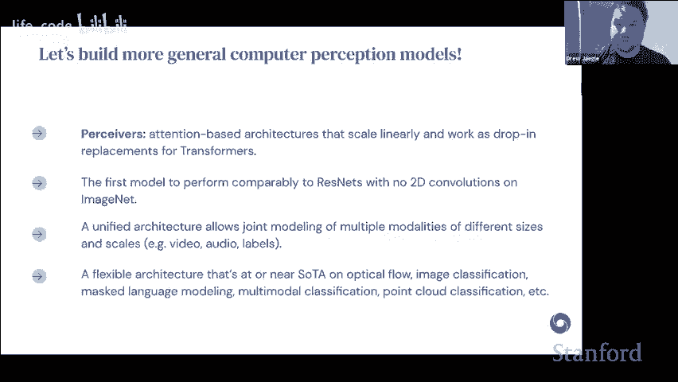

# 斯坦福 GPT／Transformer 原理介绍 (中英文双字幕) - P6：6.DeepMind's Perceiver and Perceiver IOnew data family architecture - life_code - BV1X84y1Q7wV

So today I'm going to be talking about some recent work that we've been doing at Deepmind developing this line of architectures that we're calling perceives and I'll be motivating this in terms of a goal that we have which is to develop a general purpose architectures and so just right off the bat I want to motivate why we care about general purpose architectures and so the first the first both of the reasons are fairly pragmatic。

 but basically the idea is if we're thinking about all of the data that we could possibly imagine collecting in the world。

 a lot of it is basically involves what we think of as sort of traditional sense modalities。

 whether these things range from touch andropriception to echoloc to the kind of perception you need to ingest text however you want to format that to things to more exotic things like event-based cameras。

Whiskering touching with wither senses， things like smell and depth and all the way up to the kinds of sense modalities that we really think about when we're thinking about scientific perception and so basically as if we think about the full set of data and what it would take to actually model each of these different modalities it basically looks effectively intractable to try to engineer inductive biases that will work for every single one of these so we don't want to engineer them one by one this is an approach that's worked and in some ways that it's maybe a reasonable description of how we think about developing new architectures for different problems but it's just not going to scale we can't afford as a community to design to hand designign inductive biases that will work for each and every one of these and so rather than doing that we want to sort of build architectures that at least at first pass will allow us to handle everything。

There's another practical argument for why we should work on general purpose architectures and that's because it will allow us to build simpler more unified systems so if you look at how in particular complex multimodal data streams are typically approached in the sort of the sensory computer vision or pattern recognition literatures effectively the typical way this is done is by using inductive biases that we know hold for the individual modalities and then engineer ways of combining those different subsystems so this can mean building specific specific head specific input modules for each of these things and then trying out the various different ways of combining them。

So this can work but it gives us systems that in principle really will only work on one or a small number of domains and it gives us systems that are very hard to maintain。

 tend to be fragile， tend to depend on specific processing assumptions about the input modalities so rather than do that we sort of want to move in the direction of having unified black box architectures that kind of just work and the idea here is that if we can get to that point we can abstract the architecture construction process and really focus on other more high-level problems so this is sort of the motivation for this line of work。

And the way that we're going to be doing this is of course。

 by working on the most general purpose architecture that we have so far。

 which is basically a transformer， and you'll all be very familiar with the basic building blocks of a transformer。

 but just at a very high level we can think about what they do right。

 which is they use a general purpose inductive bias， so they're non-local。

 which means they're not making domainspecific assumptions about which point should be compared to each other。

 rather they tend to be global in terms of the attentional focus that they have。

They use position as a feature rather than a hard constraint of the architecture。

 and this is in contrast to just sort of MLP based architectures or confNs in the way that they typically work。

 which used position as an architectural component to constrain how compute is happening。

And then of course finally there's extensive weight sharing in the way that they're designed and because they focus on mat Mos。

 they tend to be TBU and GPU friendly so these are all very nice things about the way transformers work。

Of course on the other hand they have very poor compute memory scaling and there are two components of this。

 so attention itself scales quadraically so there's there's this big O of m squared L complexity at the heart of transformers and I like writing it this way because it really emphasizes that this is a property of basically as you make your models bigger either at the input size or as you make them deeper。

 you're just this problem is just going to get worse and because you have this scaling in depth as well。

 there's another sort of practical thing that happens here because're the amount of compute that we're doing is proportional to the input size so there's no bottleneck in the way that standard transformers work even the linear scaling becomes a problem and so in practice for very very large transformers this can often be the bottleneck that really matters but they're both at play here and so we really want to sort of tamp down both of these and so sort of the perspective here is that have really general purpose architectures。

We can't have ones that are just sort of in principle general。

 we have ones that we have to have ones that you can actually use on the scales and the kinds of data that we care about。

And so just to this will all be old half for all of you。

 but just the way that standard QKV attention works is basically like this。

 so it's all about matrix multiplications so we have some input we compute the query keys and values by having a 1D convolution a one by one convolution that we run over the input we then compute the attention the attention scores this is a matrix multiply that has the following these sorts of shapes we then use the output here to compute。

The weights to compute the actual output of the attention module itself。

 and then finally we won run this through an additional MLP which is applied convolutionally to get the outputs。

So this is the starting point of what we're working on here。

And let me just briefly just reiterate why we would want the sort of advantages that we have with these sort of standard transformers。

 so nonlocality is one of the two sort of inductive bias principles that we have here it's useful I think to contrast this to way that the effective locality that you get in conves and what this actually means so if we look at basically as a function of depth which inputs can see which other ones which means like how easily it is to express a function of two input points let's say we look at these this yellow and purple point here at the input now I've sent them sort of as far apart as possible but we might ask how deep would the effective computation have to be before you actually process these two and if you look at a three by three convolution。

You're talking you're having to look basically until the very end of the network until you're processing these things together and what this means is that the functions that you can express that actually look at both of these points into up being quite shallow because they have to be built on top of this very very deep stack that just gives you the locality and so in point of fact if you look at for example the way Resnets work so you have an initial block which has a 7 by7 convolution and then afterwards it's  three by three cons all the way up you need 283 by three cons with that standard processing stack before all of the 224 by 224 pixels in an image are looking at each other and what this means is that in a Resnet 50 the points on the very edge of the pixels actually never see each other and this this is I found this a little bit counterintuitive but it suggests that we really are constraining quite a lot the functions that are easy to express with these models and so there are some functions of images you just can't you can't capture with a resant 50。

On the other hand， if you look at an architecture that has global attention over the full over the full input。

 so a transformer， if you could scale it that way or perceives we're going to be talking about。

 all of the pixels can interact so the model can basically capture these things and express these functions much more easily can be expressed in things that put locality first。

We also the other sort of interesting property of these sorts of architectures is that position is feurized and this basically means that we're no longer sort of encoding the architectural location of something to figure out where it's located with respect to the other ones and this allows the network to basically use any positional information that it wants。

 but can also discard it as it prefers and so this is the standard way it's done。

 of course in the context of architectures that use Fourier or sinusoidal like features。

 but there's a lot of flexibility here。Okay， so now just thinking in terms of how conves relate to transformers sort of at the opposite end。

 it may look like that we have a sort of scalability versus general generality tradeoff and so if we look at convenants the way that they're applied so typically we can think about using them on grid structured data。

 theyre of course generalizations of convolutions that work on。

on data sets with more interesting topology， but typically we can think of them as operating on grids of in some sort of space。

 whereas transformers apply to generic sets， so transformers are more general from this point of view。

On the other hand， they scale much， much worse， so conves are linear， both in the input points。

 the filter size and the number of layers of that architecture。

 whereas transformers have this quadratic scaling and they're still linear in the depth。

So from this point of view， what we're interested in doing in the perceive line of work was to scale transformers but to keep the generality property。

 so we want something that lives in between these two extremes。

And the way that we do this is by looking at self-attention and sort of modifying it in a way that allows us to scale better。

 so to walk through what self-attention actually does in sort of standard transformers。

 we take our input array which here is written number as the indices which is the number of tokens or the number of pixels basically the number of input units depending what you're looking at and the number and the channels。

 we have a 1D convolution so this is big O of M with respect to the QK and V。

We then compute the attention maps using the output of this operation。

 this gives us a matrix multiply， which is the source of the quadratic scaling。And then finally。

 we compute output features with another matrix multiply。

This is already we're already rate limited here because for even standard resolution images in this quite large so it's around 50。

000 for standard imagenet images which are going to very small so this is something that just isn't going to work if we want deep architectures。

So what we do is we replace at the input to the architecture。

 we replace the self- attentionten with a cross attention layer and we do this using basically a learned query。

 and so we're replacing only the query from the input here with a learned component and so these indices and channels you can just think of these as basically working like a learned initial state for an RNN。

 there's a variety of names that this idea goes under in the literature。

 we refer to them as sort of late as latetnts but they're sometimes called inducing points or other things。

So the basic idea is we're learning the inputs to the query and keeping the key value of it the same。

The down or the sort of upside of this is that when we compute the attention map after this。

 now we basically turn this from a square matrix to a rectangular matrix and reduces the complexity of the matrix multiplied to big of MN。

 so now it's linear in the input size。And second the second matrix multiply has the exact same property。

 so it becomes from quadratic becomes linear and the quite cool thing about this is that okay so the cross attention is linear and complexity but the output is actually smaller and so this I think is actually the more important point here is that this allows us to map something which is quite large into something that has size that's independent of the input we saw we have full control over this it's a hyperparameter and this allows us to build deep networks on top of this on top of this latent so because this is of a small size that we can control。

 we can afford to have quadratic complexity on top of this。

And so we use this idea sorry I'm still a little bit confused as to how you guys are able to turn the query into a rectangle in the second step。

 is it because you replaced the query with a learned something that is significantly smaller compared to the input size in the first step。

Yeah that's exactly right so if you look at so the underlying matrix multiply here which is written as the QK transpose so this will basically so the outer dimension here has shape n which is determined by the query and so by shrinking that query we're just changing the output of the matrix multiply。

Okay， thank you。嗯。😊，Yeah， so I guess。Sorry go ahead please Okay go so basically you only do that for the query right so key and value remain like the original size matrices。

 correct。That's right yeah， Okay， but so basically so。

I don't know what i'm not understanding basically so the problem for me is that for a query now in my head I'm like looking for。

 let's say I have like the I token now there is no IF query anymore。Doesn't that cause a problem？

Like when I'm trying to use it。And like to compute scores。

Yeah so what's happening here is your compare you'll have a smaller subset ofque so if you think about this not in terms of matrix multiplies but in terms of comparing each query to each key so in normal self attentionten we have one query for each key so every point compares to every other point right so here what we've done is instead of comparing every point to every other point we have a set of sort of cluster centers you might be able to think about them as so it's a smaller number and we compare each of those to each of the input points。

But we don't know which。Which tokens technically belong to which clusters， right？

That's right so it has to be learned yeah exactly so one way to think about this about what's happening here is that we're we're instead of so in a normal selfcent selfatten and a transformer by comparing to all to all we're sort of saying okay。

 I know what the feature is at this point and I want it to attend to similar features here what we're saying is we're learning a bunch of supplementary points that that should be sort of maximally similar to some subset of the inputs。

So correct if I'm wrong， but this is essentially doing some sort of hard tension where you're saying like like instead of like querying over all the points。

 Is select like some points， which we think are like vital similar and only like puts all attention over this。

Hardening like this points you are selecteding， right？

Yeah so they're related that would be one way to think about it the sort of the slight modifier to that idea though is that they basically live in an abstract space。

 so they're not assigned sort of one to one to one of the input queries or to one of the input points they're sort of learned so they can be somewhere in the middle but I think that's a good way to think about it that's a good intuition。

But the I guess one of the places where I'm a little confused here is the you have here indices and indices for the two like the purple and green matrices on the far left。

But those indices are not necessarily corresponding to inputs like in the NLP space those would not necessarily be tokens right these are just sort of random disease。

 but the impact matrix in this case is the result of some kind of mapping from the input tokens to an N D matrix。

 is that right。No it's actually so they it basically acts like it's it's a learned set of weights is one way to think about it so they function exactly the same way that learned position encodings do so it's basically just a you know it's a learned embedding but it's not it's not conditioned on anything it's just sort of。

It just it's just a set of weights。Okay， that makes more sense， thank you。Okay。

 so if there are no more questions， I'm going to keep going， but of course feel free to interrupt me。

So the way that given this idea， so we have this learned latent array， which again。

 it functions sort of like an RNN initial state or it's a set of weights。

 we basically randomly initialize that and then we use this to attend onto the input byte array and so the byte array here is the flatten set of pixels for example for imagenet。

And the output of this is going to live in the same space as so the same index space as the latent array does。

 and there's residual connections in the way that you would normally do in an intention layer as well。

So once we're in this space we can then build an architecture by taking by using a standard transformer but phrased in the latent space rather than in the input space and this is going to allow us to basically end up because we sort of distilled the input down to the smaller space we can still flexibly allow all of these points to interact so this should be still nearly as expressive as the transformer as a normal transformer is and then each of the modules here now is quadratic in the latent size rather than the input size so this is something that we can control quite a lot。

So in the original version of the procedure， we found it was very helpful to have additional crossats。

 so this is certainly something that you can do and the reason sort of the intuition behind this is that if this bottleneck is quite severe。

 we can't maintain all of the information from the input and so we want these queries which are now sort of conditioned on the past to be able to look back at the input point and so this is something that we found to be quite helpful when tuning for the first paper but the caveat I will say is that we're no longer recommending this is best practice because these crossats end up being quite heavy but this is something that you can explore certainly if you want sort of more conditional queries or if you want to be able to cross attendends and new inputs that are coming in。

The other thing that we found quite helpful in the context of data sets that have a limited amount of data。

 which for these architectures includes INe is to allow weight sharing in depth and so this basically just amounts to tying the weights for the different cross attention and different self-attention layers as they're repeated so this ends up looking like an RN that's enrolled in depth。

So this is just at a high level this gives us an architecture that we can apply to images but doesn't make any assumptions about image structure。

 so it's one that you can use elsewhere and we basically we give information about the input sort of spatial structure by having positional encodings and here we use a 2D4ier feature position encoding and just to show you kind of what that looks like here to give you a sense so each of the input points is assigned basically so you'llll be some position here and we have sinusoidoidal and cosineus sooidial features in 2D so this is basically a 4ier8d composition of the position of the 2D input and a couple of things that we found where that if we sampled the frequency that's the maximum frequency that it's used up to the NOSs frequency of the signal we end up doing better than if you use a lower version of this and this basically is because this will allow every other point to be aware of every distinct。

Point in the image， whereas if you sample at a lower frequency， you can end up with aliasing。

 and so not all points will be sort of legible。We also found that sampling the spectrum relatively densely tends to help and the contrast here at the time we were developing this with respect to Nerf so NF at least in earlier implementations used quite a small number of frequency bands we found that the more we added the better we did so in general this is something to be attentive to。

And then finally， as opposed to language where you typically have addition of whatever your embedding is with the sinusoidoidal or position encoding that you use here we found that concatenating them performed consistently better。

And so this may be because the positioning the content embedding is not as sparse as it is in language。

 we're not totally sure， but this is something that I observed consistently。

And before I move on to results I just want to contrast this to some sort of other approaches for using transformers in the image context。

 so obvious the obvious precedent here is visual transformers and I think this is a this line of work is great especially in the image context。

 but there are some caveats about it that make it less suitable for sort of more general purpose use。

 so one is that so vision transformers do use an input 2D convolution。

 so this is often phrase in terms of patches input patches a special case of a 2D transformer。

 so it does restrict the class of inputs you can use it for。

And because we're basically building this patching or convolution into it。

 this means that this as an approach really isn't sufficient to get it to work on non-gririd data。

 there are other ways you could adapt it， but this is something that you will have to special case for every domain you're looking at。

And then finally， because we have this sort of input where we're telling the architecture what it should look at first in the initial grouping。

 this does amount to getting rid of the nonlocity assumption it's not super clear doing how much doing this just once will make a difference。

 but this is something to be aware of when you're thinking about this architecture。

And then finally cross attention itself is used quite broadly in the vision literature。

 so just a couple to highlight a couple of examples， debtor。

 which is an object detection method from Facebook。

 basically has a convolutional backbone that's then used to give an output feature map。

 this is then passed into a transform encoder decoder and of course whenever year encoder decoder you think cross attention because from the encoder to the decoder there's a cross attention step。

 and so they're using basically the cross attention to go from some feature map representation to something that looks more like the object bounding boxes。

There's also quite nice work on learning self-supervised or unsupervised object segmentation models。

 and in this work they're doing something very similar where they have a convolutional backbone。

 they then use something like these latent the latetnts that we introduce here。

 to do when they call them slots here but basically to assign some of the output pixels to different slots so that they sort of have independent complementary decoding of the slots in the segmentation model here。

And there's a lot of other things。Okay， so first I would add just so now I'm going to sort of walk you through results of this of this model hi can I oh go ahead I'll go after you go for it Okay cool sorry for that can you go back a couple of slides where you had like you know like how how like the inputs like flow into like I think one about yeah that one okay so two questions that latent transformer is basically like a self attention is that correct？

Yeah so the latent transformer is a self a fully selfational transformer got it and why see like for like the key in value they flow directly into the cross attention and there is like the query also flowing into it but the latent array array is flowing into the cross attention imp parallel to the query can you explain that？

Yeah so this is just speaking here it's meant to depict the residual connection so the cross attention this is sort of a cross attention depicted as a cross attention module and so the cross attention itself has the attention it has a residual connection and then there's an MLP so that's what that's meant to indicate okay but it's basically the QKV standard。

Go it。Thanks。😊，H， I had a question that is slightly related to this if we can just stay up this slide actually。

 so I think one thing that's interesting about this。Sure sorry， I lost。You're cutting off。

It's mostly consisting of attention layers， whether it's self attention or creating image transformers。

 can you hear me， is that coming through？No， it's cutting off， I think， but I think so recent。Oh。

 okay。Should I type it is that should I type Yeah I think that's a good idea yeah。

 I'll type it thanks sorry。All right，s kind。Feel free to go ahead， I'll type it slowly and。

Sounds good sounds good to me Yeah actually can I chime in drew while you're on that previous slide the flow so these residual connections I actually didn't know the cross attention used that how reliant are these sequential cross attention layers on the residual connections。

Yeah， so here。Here in the initial so two things I will say is that in the initial cross attention it doesn't really make a difference so this is something we've ablated when we get to the proIO version of this we also did the same thing in the decoder cross attention and it can make some of difference it can make a difference there depending on what you're doing I think it's actually essential in when you're using repeated cross attention of this way so when you have this sort of iterative structure and the reason for this is that the thing that's actually used to condition the query is basically that's your full representation of sort of the state of the architecture so far and so the skip connection is from it's in basically the query channel it's in the late the latent space and so this is basically what allows you to end up with this sort of dense dense and stable architecture。

Thank you。😊，嗯。😊，Okay。So to imagenet okay so in standard imagenet processing basically we compare against a few so this is a little bit out of date at this point。

 but against a few sort of just sort of sanity check baselines here so comparing against Res 50 and then at the time the best vision transformer model that was purely on imagenet and we're definitely in the ballpark this isn't these aren't。

Anywhere in your state of the art results but this is an architecture that again it' not using any 2D convolutions and so the fact that it was able to do this well we found very。

 very surprising at the time one of the quite cool things about this is that because this architecture is not making any assumptions the architecture itself isn't making any assumptions about the spatial structure of of the input images we can look at permuted imagenet and in the first version of this what we do is basically we compute the features using the 2D position so the 2D position is sort of fixed to a position to the pixel and then we just shuffle it all and so this is basically we'll give you a sense of how dependent the baselines are on input image structure and so if we look at if we look at the transformer perceive by construction they don't change so this is not an empirical finding this is a property of the models but we find that Resnet 50 falls the performance falls by about half and VIT which again only has one layer where it's relying on the spatial structure。

Also it has about a 15 point drop and so this suggests that it's relying quite a lot on that very first one to give it some information about the structure。

We can push this a little bit by instead of relying on 2D Fourier features learning completely learned positional encodings and this basically this is an architecture now this is a model that has absolutely no information about the input structure and so shuffling them and learning them again is absolutely equivalent and we find that this architecture also can be pushed about 70% and we've gotten slightly better numbers here in general this seems to work worse but so the 2D information is useful but it's quite cool that you can get what would have been numbers comparable to state of the art about5 or six years ago so this is quite cool。

Sorry I'm a little thick here， you're saying the difference between the last two rows is that the second to last row has a two dimensional position of betdding and the last one has a one dimensional position of betdding essentially。

 as I right。So it's learned， so it's basically it'll be it's I believe a 256 dimensional vector that's learned。

 but it doesn't it basically it means that the model itself has no information about the input's spatial structure。

So the 2D positional encodings that we're using you end up having about 200。

 it's 200 some features depending on what you're looking at。

 but theyre they give you very detailed information about the 2D structure of the input because they're based on a 480 composition of the input space。

Okay， that makes sense， thank you。Hi drew can I ask a question about frequency you use to generate those sensor wave。

Yeah， so like a cover slide before。s。

Yeah，Yeah， yeah。 yeah。 they like。 So basically， I do have taken some lecture in signal processing。

 And I know if I。

Want to avoid， you know， alienency。 I need to sample with， at least my frequency。

 So I'm curious to know why to use frequency starting from one to the ni frequency instead of starting from micro frequency to some very high frequency。

OhI see so basically so the maximum frequency that's used is always NquiIS so anything about Nquist is going to be alias so you're not actually going to be able to resolve it because it's in pixel space right so we sample one is basically just giving you an oscillation that covers the entire image and so this is basically just to sample the full range of nonallias frequencies。

啊 okay， cool。 thank you。 good。Yeah。Okay， so so after after the image results。

 we wanted to try it on other domains and in particular we were interested in how this could be used to work on sort of multimodal domains。

 so ones combining various different types of input features and。

one challenge or one sort of problem that you encounter in these sorts of spaces is that the data from different modalities end up having different features and they always have different semantics so if you take the positional encoding plus the RGB for video you end up with some number of channels and that if you have audio that corresponds the data may be paired but it tends to have fewer features and it only has a1D positional encoding so the way that we handle this is basically by learning modality specific position encodings and so these are basically embeddings that are special and learned for each of the modalities and what this does is basically tags ends up tagging the features that come from audio or video with some information that the network can learn that allows it to distinguish which ones which but given these these padded these sort of learned padded feature vectors we then concatenate them all and that's how we process multimobile data so basically the input to the architecture still looks like just one big array it's just that when constructing this we know that some of those features some of the rows and that。

Aray come from video and some come from audio， but the model itself isn't given information about that other than what it learns。

We also have some great questions， so can go first。return turn？Yeah， sorry。 I thought it's。 but yeah。

 yeah， sure。 if you can hear me it's just a reason。Like starting a lot transformer stuff formally。

 so I just didn't know what position one that was。Oh， so what a position we that？Yes。

 so basically a positional embedding is it's a feature that says this so the simplest way to think about it is in text so text the input is 1D so things live in some 1D sequence and for each point there you feurize where it's located in that sequence so the simplest thing to do would be if you have negative one to one is the full range it's just denotes actually where it's located in that sequence but we typically will add sort of will want to featureurize this to have more dimensions than just a single one and so the Fourier trans the Fourier decomposition is one way to do this to sort of give it privileged information about the high frequency structure but we can also just use the position to index on some embedding array which is how we do it when morere learning things so basically it's just a set of weights that are added to the feature for that point that give the network information about where it's located in the groundary sequence。

If you want to go next？嗯。Sorry I had to find a mute button unmute button Okay so I actually have two questions regarding the fewer features the I think like do you guys sample them like uniformly or are they like do you like to learn these？

Yeah， so basically we sample them linearly so basically we take the full space and we sample them linearly with whatever the budget is there are so in various settings we have actually tried learning these so you could actually initialize an array with them and then learn them and that does help sometimes actually and you could potentially learn you could try a more sophisticated strategy on this too。

Okay cool my follow up question is that basically I feel like the selling point of your research right is that you don't make any structural assumptions right you can take any type of like format however for like the encoding wouldn't the dimensionality so for example like if it's text it's 1D right if it's a like an image it will be 2D and if it's like a video like 3D you have like more。

Like the positional encoding will have like more points right wouldn't that like inherently give away。

Like the nature of the input。Yeah so it does so I completely agree with this you're totally right the version of this where we have learned position encodings is the most pure from that point of view。

 so it's one that gives it basically no information about the ground truth spatial structure what it does give the model so when you do the learned position encoding it will say that for example there's a correspondence between point K on image1 and point K on image 2 so that's basically the least amount of information you can give it while still allowing it to sort of figure out what the structural relationship between the input points is so this is the direction that we've been trying to push in in general giving the architecture access to sort of ground truth structural information like this lives on this point in 2D is helpful so there's a couple things here there's sort of from a practical point of view if you want good results you need to exploit these things or it's helpful to exploit these things but we do want to move in the direction where we're relying on these things less。

And so this is basically something we're actively looking into。Okay makes sense， thank you。

So I think has posted her question on the chat。I also see you have your hand raised， so if you want。

 you can give it a try if not I'll read out the question。Okay。

 I'll try just let me know if it's choppy。Yeah so is it good right now so far so Oh good okay cool so I was curious looking at the perceive diagram you had it's a bunch of attention layers right like cross attention and self attention and I think there's been this like small trend in recent work in vision transformers to try to sort of replace the last few layers instead of having attention like make them be convolutions to address this attention scaling problem right in a different manner and so here like the perceive architecture is trying to make self attention less expensive and they they're just trying to replace it and they kind of just avoid the problem。

And so I'm curious and so I've seen papers both ways like some that try to do things like the ones you cited and then some that are trying to do this as well and in my mind everyone always has like the good results and stuff so I'm curious if you think there's a reason to do one or the other or if you think this alternative approach is also promising or is there a reason you know research should go in one direction or the other。

Yeah， so to my mind， the big tradeoff is one between。

 so the vision literature I think it's just exploded in terms of these sort of hybrids and people the write the exact right place on the Pato curve for the tradeoff of speed and performance。

 but they're basically looking primarily on vision specific problems。

 so something the computer vision community itself typically doesn't regularize itself away from things that don't work on things that aren't vision。

So you end up with things that are very， very efficient and very performant on vision problems so I think from that point of view it's an incredibly important line of work and that's probably the right way of doing things what we're sort of aiming for is something is the things that are as general as possible while still kind of being performant。

So got it so this kind of thing is critical Oh sorry you off go ahead no no please go ahead I was going to say so this kind of thing is like it's important just to summary so you feel like it's important to focus on attention because that's kind of critical for NLP like you can't just sort of put in a convolution at the end and sort of fix the problem but envision maybe you can and it's fine is that a right way of understanding it。

That's part of it vision and NLP aren't the only two domains。

 and so the thing that we're for are really basically so the kinds of problems that we're interested in doing with this include things like event- based cameras。

 cell biology， sort of proteins， all of these sorts of things where we may or may not have the right convolutional inductive biases for to even know how to build those sorts of things or they end up being whole research programs like the mesh based convolution work。

Oh Co， thank you。 I also had like one more question about the architecture。 So I saw that。

 I'm sorry if you said this and I just missed it， but you had cross attention and then like that to transformer and then cost attention。

 I'm curious what happens if you replace the self attention in those layers with cross attention。

 Does it affect your accuracy is that even feasible is that a valid question。Yeah。

 so the sort of thing that you could do is you could modify this to make it sort of hierarchical so that there are multiple stages across attention we haven't gotten this working yet。

 but it doesn't mean it's not a good idea。So there there might be there might be a right way to do this that we haven't figured out right。

 but it's something we have tried a little bit Oh cool okay， thank you so much I appreciate it。Yeah。

 problem。Okay， let me。We're running short on time， so maybe I'll skip ahead。嗯。Okay so。

Before we run too much time， I want to at least talk about the sort of the modifications to this architecture that we've made to make it work sort of even more generally。

 so one of the problems of the sort of the first the first architecture that we looked at here the basic receiver is that it works basically for arbitrary inputs but it's designed to work only on classification and regression tasks as an output and so basically we wanted to see if we could use the the same cross attention strategy for decoding and it turns out you can it's something that works pretty well just kind of out of the box so the idea is that we have if we have our cross attentiontion input and self-attention sort of to do the processing we can introduce a set of additional queries and these are basically queries that give the semantics of each of the points that you're trying to decode。

And we pass these input to another cross attention layer which is configured in basically the opposite way that the encoder cross attention is configured。

 so now the queries are going to be something that's potentially large and the keys and values are coming from this latent and so what this allows us to do basically is to keep all of the nice advantages of the original perceive so we have an encoder that scales linearly we have a processor stage。

 this sort of latent self-atten that scales independently of the input size and we now have a decoder that keeps the decoupling but gives this linear scaling with respect to output size and so by doing this we can now basically apply the same approach to basically dense output tasks。

And so to give you a sense of how this works， just sort of intuitively。

If we're doing auto encoding on this image of puppies。

 basically what we do is we encode process and then to decode。

 we take a query that corresponds to each of the points and then we pass it into this decoder so we can query one of the points。

 we get one pixel query another one， we get another one and all the way up until we get all 10000 points and that's how we can do reconstruction with this。

And the cool thing about this is that it opens up a bunch of new applications and we can get different kinds of outputs just by changing how the queries work。

So if we want to do something like multimodal auto encoding where we have some of the outputs or videos。

 we use the same construction trick to get positions that to get queries that have the relevant semantics for each of the points that we're decoding and we can do this even though basically the sizes of these different data so the number of points they have is quite diverse so in the multimodal auto encoding experiments that we have in this paper we do this for video audio and labels at the same time。

 so that all of them are just passed into their uniform network and then decoded one by one in this way。

But we can also do mass language modeling now by conditioning on the position in a sequence。

 we can do multitask classification by having basically an index that gives which task you're querying from the network。

And we can do things like optical flow by passing in input features as well as the positions。

And so I'm just going to just skip to a couple of the different。

I can share these slides with you all afterwards to look through them。

Some of these things are quite cool but。Just quickly。

 I want to talk about language and then optical flow。

So for language basically what we wanted to do with this was to see if we could use this to replace tokenization and why might we care about getting rid of tokenization so one we use tokenization primarily because transformers scale poorly with sequence length and tokenizing cut sequence length by that a factor of four。

But but there are various problems that arise with this and so might we care about removing tokenizers？

So for one。Tokenizers perform less well on rare words。

 so if you compare the sort of the bytebased decomposition。

 theTF based UTF8 encoding input of an input sequence like this。

 you can see that there's basically a uniform allocation of points in memory to each of the input characters。

 the exception or diacritics which end up splitting it into two but if you look at the sentence piece tokenization so it's learned that pepper is one token but jalapeno gets split into five in this case。

 so this basically says the amount of capacity that you allocate depends on how rare the word is which can lead to suboptimal encodings。

They're also bridled to subtle perturbations， a famous example of this is that if you enter so if you've ever played around a GPT3。

 you'll notice that the output can be quite sensitive to where if you add a space or emit a space at the end。

 and this basically is because the space can end up being factorized into different parts of the tokenization。

 problem there are other things that can happen there too but this is one cause of that。

And finally tokens don't transfer across across languages。

 so if you wanted to have a model that without any tuning could be used on many different languages at the same time。

 tokenizers are a blocker for this， so if we can get rid of them it'll simplify the pipeline it'll also make things less brittle and then hopefully lead to more general models。

So the way that we do mass language modeling is the same as the way that I showed in that schematic autoencoding experiment。

 so we mask some fraction of our inputs about 15% is sort of the standard magic number。

 we then decode at each of the positions that are masked and we task the model with decoding whatever characters we masked at those locations。

And then once we have this model， so this is what we do for pretraining。

 we can then fine tune it by replacing the decoder with a multitask decoder that takes in the tasks that we're using on the downstream evaluation setting and training the model to reconstruct the logits on a per task basis。

Okay， so to look at how this model performs， we basically first compare it to Bt basease so this is just a solid benchmark that we understand very well and first by looking at sort of matched two models that have matched flops we can see that perceive IO and Bt basease work on par you see there's a different tradeoff here so to get the same number of flops basically we make perceive IO deeper and this ends up giving it more parameters。

 but on a perflps basis it ends up performing about the same。On the other hand。

 if we remove the tokenizer from Bt and keep the flops the same。

 we see that the number of parameters in the depth just drastically fall down and this is because Bert scales quite poorly with sequence length because it uses a normal transformer。

But if we use a perceive without the tokenization， we can see that we only get a slight reduction in the number of parameters at the flops count。

 but the performance performs almost exactly the same so this means that the perceive in the setting is performing basically the same with and without the tokenization it's learning a different strategy it's using different parameters but it basically can be brought to the same performance。

We can then scale this more by sort of leaning into what happens in the tokenizer free setting and we see that we can get a moderate performance boost as well。

I think it's also in the language setting it's also useful to look at what the attention。

 the attention maps that are sort of learned and what's being visualized here are basically for each of the latents for some subset of the lates。

 we're looking at where it's attending to in the input sequence and some of these end up being local so point looking at specific points in the sentence。

Some of them are periodic， so they look sort of at recurring points over the sequence and some of them also look like they pick out syntactic features。

 which is quite nice， so they pick out basically exclamation points or capital letters or other punctuation that's quite useful and decodable from very right right at the beginning of the sequence。

We can also basically use this exact same architecture on optical flow and optical flow is basically an important classical problem in computer vision where given a pair of frames in a video we want to basically track all of the points so figure out the motion from every point from one frame to the other and so optical flow is usually visualize using these sort of colorized images that are shown in the bottom and what this gives you basically is a per pixel indication of the velocity at every single point。

And so you can see that so the blade that the character here is holding is moving to the right。

 whereas this creature behind her is sort of as moving downwards。

So there are a couple of problems with optical flow that make it interesting to to sort of approach。

 so one it's a dense task and it basically involves long range correspondences but the standard training protocol there's basically no largescale realistic training data just because it's incredibly hard to sort of label all of the pixels in a real world scene and figure out where they go to so the typical way to do this is to train on some synthetic data and then evaluate on more realistic scenes and optical flow is also interesting because it's basically the locust of some of the most complicated visual architectures in the literature so the previous say of the art result here is this method called raft which won the best paper reward at DCCCVE last year and I'm just highlighting this to give you a sense of how much work people do into sort of hand engineering these architectures so this is a very very cleverly designed architecture and basically it incorporates things like global correlation volumes that are explicitly computed。

Different offsets to basically allow the model to reason about how things at different scales are moving with respect to each other。

It also has local neighborhood gather operations as well as update blocks to keep track of what's happening within each specific correlation block。

 and then finally there's a flow specific upsampling operators that were developed。

So in contrast to this， we're basically we wanted to see how well perceive IO would do here and just to give you a sense of sort of what we were expecting coming into this。

 we thought well， maybe so perceivedIO is throwing a lot of the structure away so we were hoping that we would get some good results but it would probably overfit and there's this sort of problem of the domain transfer that's happening here but on the other hand self-attention seems to be a reasonable way to match this sort of correspondence thing。

What we actually found was that just by doing the very， very simple preprocessing here。

 so extracting basically a patch around each pixel and then using the standard perceive IO architecture。

 we were able to get state of the art results here and so this is basically was validation of this general approach of trying to have general purpose architectures that would transfer over。

And so basically with minimal tuning， we are able to get results that are both of the sort of compelling benchmarks on both of the the Cel evaluation methods and to get comparable results on Kity。

 so these are the standard ones。And we can also sort of visualize what happens when we apply this on real world data。

 so there's no ground truth here so we can't really compare it。

 but it's still useful to sort of see how it moves around and we can see that qualitatively it's able to capture a lot of the fine structure and to sort of get the right motion for the things that are very clearly moving in the specific direction。

We can also sort of， it's also I think informative to look at what happens how it manage to represent how it manages to represent sort of small structure is this video playing。

Yeah can。Okay cool， so the thing to look at here is the fine water droplets that are sort of flying through the air as that bird flies by and because we're decoding at every single output point。

 the architecture is able to represent those so it's able to capture very。

 very fine sale segmentation that would be difficult to capture if you had for example。

 a convolutional upsamplar here。Okay， so I'm just going to the light light gone off in this room。嗯。

I'm also interested that you also try other task like depth estimation。

 because especially where looks like it can still also work well on that modalities。Yeah。

 so we haven't published anything， but some internal results suggest that that it works just fine。

re basically there don't seem to be one of the surprising things。

 the things that we were a little bit unsure about was how much information was going to be contained in this latent because basically you're abstracting quite a lot and it doesn't have any 2D structure intrinsically but it does seem like it seems to be able to represent things quite well and these sorts of decoding mechanisms do seem to be able to do that。

かるで。So I'm just going to interest in this interest of timem I'm going to skip ahead to the conclusion Dr I had one question with respect to the metrics that you've shared for the optical flow。

 the numbers so like the in the table it was like central final clean entity where these different data sets or different metrics like same metric for different dataset sets or like these are three different metrics。

Yeah so these are three different data sets， so Cintelcle and Stel final are basically two theyre two ways of doing the final rendering for Cintel in all cases these methods are trained just on the autoflow data set so they're trained on this sort of general purpose kind of wacky synthetic motion data set and then we're we're evaluating on these different domains without fine tuning。

Okay。Yeah， the flow has quite the data sets are quite small。

 so it's generally even problematic to fine tune。Thank you。嗯。Okay， so just to summarize， right。

 what was the ground roof to find the endpoint error。Yeah。

 so the way this works is Cintel is a computer， it's basically a relatively high quality CGI movie that was basically open source and so they actually have the ground truth so if you know the ground truth 3D state you can compute the pixel correspondence from frame to frame so that's what's used on Cintel and then Kity they basically have they have like a LiDAR sensor that's used to figure out the depth of all points and then they compute the correspondences so the ground truth is actually the ground truth optical flow but in general it's hard to get dense optical flow it's very expensive to collect it。

Great， thanks。嗯。😊，Okay， so so basically just to summarize so the perceives are tension-based architectures that scale linearly and work as drop in replacements for transformers on a variety of settings。

 they also seem to be able to achieve results that are comparable at least in performance with models that rely on 2D convolutions but of course there is a trade off here and so it's good to be very aware of this of generality versus speed and specific domains and so as was pointed out in settings where you can use 2D convolutions。

 it's certainly good to have them in the loop。It's basically a unified architecture that allows joint modeling of different modalities of different sizes and basically overall it seems to be quite flexible architecture that's able to produce a state of the art or near state of the art results on a variety of different domains ands in the two papers we look at a number of other domains that I didn't talk about including 3D point cloud modeling replacing the transformer that's used in the starcraft and the sort of starcraft behavioral cloning agent in a couple of others so this does we have a lot of evidence that this general approach seems to work broadly and there's a lot of things we still haven't tried so we're very interested in pushing this and always open for suggestions and so forth。

So we're relying on a large body of related work because we're sort of drawing from a lot of different areas here。

 so here are some highlights and then I just want to thank my co-authors on this work。And of course。

 I'm happy to talk more。Thanks，Yeah， thanks a lot。 Thanks very。So one question I had is like。

 so what do you think is like the future of like like perceived like models like do you think like this are going to like being used more in like the sort of like the transform transformer community to replace like con and another stuff？

Yeah， so the I think。Broadly speaking， I think of perceives now is sort of because we know how to adapt them pretty well to sort of domains where we don't have a great idea of the right way to structure an architecture。

 an inductive bias， so I think that's one of the really strong cases for it。

 so settings in which you don't really know what the right way to structure a problem is。

 I also think these kinds of approaches can be used in conjunction with cons for sort of things that are as domain agnostic has needed。

But I think multimodal and and new domains is really to that's the real that's where this these are obvious choices got it also like what do you think are the current bottlenecks with this and if you don't mind like if you can disclose like border is what are you working on towards next with this stuff。

So I can't talk about too many details about that， but the a couple of domains so one。

 we don't really have a great handle on how to use them on sort of small small scale data so data where where。

You don don't have the data to sort of recover the inductive bias so this is I think a really important area。

 the other thing that we haven't sort of talked about here but you could probably imagine that we'll be thinking about would be how to train on multiple modalities or sort of multiple things at the same time so right now all of these architectures are sort of trained in isolation but there are a lot of opportunities for sort of figuring out how to pose problems together and use a single architecture on all of them。

Got it， what I'm sure if you tried， but can you also use this for like tableular data stuff？Yeah。

 so effectively the architecture treats any input data as tabular data。

 so I think that's exactly the right way to think about it。course sounds good thanks to the top。

 I will open make general questions for the students。So it's jump recording。

