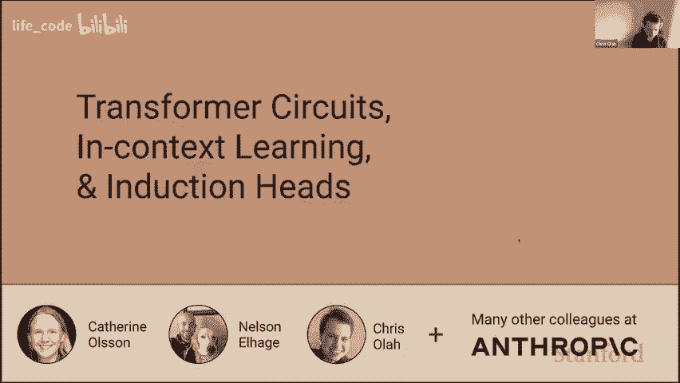
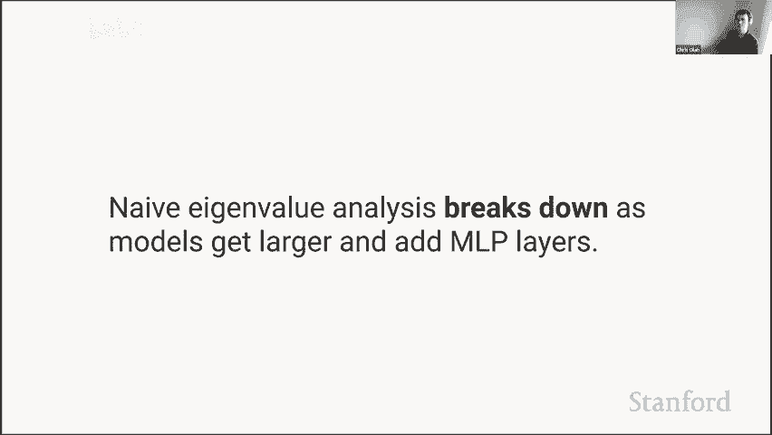

# 斯坦福 GPT／Transformer 原理介绍 (中英文双字幕) - P8：8.Transformer Circuits, Induction Heads, In-Context Learning - life_code - BV1X84y1Q7wV

Thank you all for having me it's exciting to be here one of my favorite things is talking about what is going on inside neural networks or at least what we're trying to figure out is going on inside neural networks so it's always fun to chat about that。

😊，嗯。Oh gosh， I have to figure out how to do things， okay。

What what I want okay there we go now now we are advancing slides that seems promising so I think interpretly means lots of different things to different people it's a very a very broad term and people mean all sorts of different things by it。

And so I wanted to talk just briefly about the kind of interpretability that I spent my time thinking about。

 which is what I'd call mechanistic interpretability so most of my work actually has not been on language models or on RNNs or transformers on understanding vision conves and try to understand how do the parameters in those models actually mapped to algorithms so you can like think of the parameters of a neural network as being like a compiled computer program and the neurons are kind of like variables or registers and somehows there are these complex computer programs that are embedded in those weights and we'd like to turn them back in to computer programs that that humans can understand it's a kind of kind of reverse engineering problem。

😊，And so this is kind of a fun example that we found where there was a car neuron and you could actually see that you know we have the car neuron and it's constructed from like a wheel neuron and it looks for in the case of the wheel neuron it's looking for the wheels on the bottom those are positive weights and it doesn't want to see them on the top so it's negative weights there and there's also a window neuron it's looking for the windows on the top and not on the bottom and so we're actually seeing there it's an algorithm it's an algorithm that goes and turns it's just saying you well a car is has wheel on the bottom and windows on the top and chromrome in the middle and that's actually like just the strongest neurons for that and so we're actually seeing a meaningful algorithm and that's not an exception that's sort of the general story that if you're willing to go and look at neural network weights and you're willing to invest a lot of energy and trying to per engineerine them there's meaningful algorithms written in the weights waiting for you to find them。

And there's a bunch of reasons I think that's an interesting thing to think about one is you know just no one knows how to go and do the things that neural networks can do like no one knows how to write a computer program that can accurately classify imagenet let alone you know the language modeling tasks that we're doing no one knows how like directly write a computer program that can do the things that G3 does and yet somehow breaking descent is able to go and discover a way to do this and I want to know what's going on I want to know you know how what is it discovered that it can do in these systems。

There's another reason why I think this is important。

 which is is safety so you know if if we want to go and use these systems in places where they have big effect on the world and I think a question we need to ask ourselves is you know what what happens when these models have unanticipated failure modes failure modes we didn't know to go and test for to look for to check for how can we how can we discover those things especially if they're really pathological failure modes or the models in some sense deliberately doing something that we don't want well the only way that I really see that we can do that is if we can get to a point where we really understand what's going on inside these systems。

😊，So that's another reason that I'm interested in this。

Now actually doing interpretly on language models and transformers it's new to me before this year I spent like eight years working on trying reverse engineer continents and vision models and so the ideas in this talk are new things that I've been thinking about with my collaborators and we're still probably a month or two maybe longer from publishing them and this is also the first public talk that I've given on it so know the things that I'm gonna to talk about there's I think honestly still a little bit confused for me and definitely are going to be confusing in my articulation of them so if I say things that are confusing know please feel free to ask me questions there might be some points for me to go quickly because there's a lot of content but definitely at the end I will be available for a while to chat out this stuff and yeah also I apologize if I'm unfamiliar with Zoom and make mistakes but yeah so with that said。

 let's dive in。

And so I wanted to start with a mystery。Before we go and try to actually dig into what's going on inside these models。

 I wanted to motivate it by a really strange piece of behavior that we discovered and wanted to understand。

嗯。And by the way， I should say all this work is done with my colleagues phanthropic。

 and especially my colleagues， Catherine and Nelson。Okay， so onto the mystery。

 I think probably the most interesting and most exciting thing about about transformers is their ability to do in context learning or sometimes people will call it meta learning。

You know， the GT3 paper goes and describes things as you know language models are few shot learners like there's lots of impressive things about GT3 but they choose to focus on that and know now everyone's talked about prompt engineering and Andre Karahi was joking about how you know software 3。

0 is designing the prompt and so the ability of language models of these large transformers to respond to their context and learn from their context and change their behavior and response to their context you know really seems like probably the most surprising and striking and remarkable thing about them。

And some of my colleagues previously published a paper that has a trick in it that I really love。

 which is so we're all used to looking at learning curves。

 you train your model and you you know as your model trains， the loss goes down。

The I is full of bit discontinuous and it goes down。

Another thing that you can do is you can go and take a fully trained model and you can go and ask you know as we go through the context。

 you know as we go and when we predict the first token and then the second token and the third token。

 we get better at predicting each token because we have more information to go and predict it on so you know the first the first token the loss should be the entropy of the unigrams and then the next token should be the entro of the biograms and it falls。

It keeps falling and it keeps getting better。And in some sense。

's that's the model's ability to go and predict to go and do in context learning。

 the ability to go and predict you know to be better at predicting later tokens than you are predicting early tokens that is in some sense a mathematical definition of what it means to be good at this magical in context learning or meta learning that these models can do so that's kind of cool because that it gives us a way to go and look at whether models are good at in context learning。

不。if I could just ask a question like a clarification question please when you say learning there are no actual parameter of the yeah I mean that is the remarkable thing about in context learning right so yeah indeed we traditionally think about neural networks as learning over the course of training by going and modifying their parameters but somehow models appear to also be able to learn in some sense if you give them a couple examples in their context they can then go and do that later in their context even though no parameters changed and so it' it's some kind of quite different notion of learning as you're gesturing out。

Okay I think that's making more sense so I mean， could you also just describe in context learning in this case as conditioning as in like conditioning on the first five tokens of a 10 token sentence next five tokens Yeah I think that reason people sometimes think about this as in contextex learning or meta learning is that you can do things where you like actually take a training set and you embed the training set in your context like if just two or three examples and then suddenly your model can go and do this task and so you can do few shot learning by embedding things in the context yeah the formal setup is that you're just conditioning on this context and it's just that somehow this ability like this thing like there's there's some sense you know for a long time people I mean I guess really the history of this is we started to get good at neural networks learning right and we could go and train language trained vision models and language models that could do all these remarkable things but then people started to be like well you know these systems are they take so many more examples then。

humansumans do to go and learn how can we go and fix this and we had all these ideas about meta learning develop where we wanted to go and and train models。

😡，Explicititely to be able to learn from a few examples and people develop all these complicated schemes and then the like truly like absurd thing about transformer language models is without any effort at all。

 we get this for free that you can go and just give them a couple examples in their context and they can learn in their context to go and do new things I think that was like like that was in some sense the like most striking thing about the G3 paper。

And so， yeah， this ability to go and have the just conditioning on a context。

 go and give you you know， new abilities for free and the ability to generalize to new things is in some sense the most。

 yeah， to me the most striking and shocking thing about transformer language models。

🤧That makes sense， I mean I guess。From my perspective。

I'm trying to square like the notion of learning in this case with， you know。

 if you or I were given a prompt of like one plus one equals two two plus three equals five as the sort of few shots set up and then somebody else put you know like five plus three equals and we had to fill it out in that case I wouldn't say that we've learned arithmetic because we already sort of knew it but rather we're just sort of conditioning on the prompt to know what it is that we should then generate right？

But it seems to me like that's。Yeah I think that's on a spectrum though because you can also go and give like completely nonsensical problems where the model would never have seen seen like mimic this function and give a couple examples of the function and the models never seen it before and I can go and do that later in the context and I think what you did learn in a lot of these cases so you might not have you might have you might not have learned atic like you might have had some innate faculty for arithmetic that you're using but you might have learned oh okay right now we're doing arithmetic problems。

Got it in case this is I agree that there's like an element of semantics here yeah no this is helpful just to clarify exactly sort of what the what you know us Larry thank you for walking through that。

Of course。So something that's， I think， really striking about all of this。😊。

I well okay so we've talked about how we can we can sort of look at the learning curve and we can also look at this in contexttex learning curve。

 but really those are just two slices of a two dimensionional space。

 so like in some sense the more fundamental thing is how good are we at producing the endth token at a different given point in training and something that you'll notice if you look at this so we when we talk about the loss curve we're just talking about if you average over this dimension。

If you if you like average like this and project on to the the training step thats that's your loss curve and if you the thing that we are calling the in context learning curve is just this line。

Yeah， this line down me the endter here。嗯。And something that's kind of striking is there's there's this discontinuity in it like there's this point where where you know the model seems to get radically better in a very。

 very short time span and going and predicting late tokens。

So it's not that different in early time steps， but in late time steps， suddenly you get better。

And a way that you can make this more striking is you can take the difference in your ability to predict the 50th token and your ability to predict the 500th token you can subtract from the 500th token。

 the 50th token loss。And what you see is that over the course of training。

 you know you're not very good at this and you get a little bit better and then suddenly you have this cliff and then you never get better the difference between these at least never gets better so the model gets better at predicting things but its ability to go and predict late tokens over early tokens never gets better。

😡，And so there's in the span of just a few hundred steps in training。

 the model has gotten radically better at its ability to go and do this kind of in context learning。

And so he might ask， you know， what's going on at that point？And this is just one model。

 but well so first of all it's worth noting this isn't a small change。

 so can we don't think about this very often， but often we just look at law scoress we' like did the model do better than another model or worse than another model but you can think about this as in terms of NAs and it's just the information the quantity and NA and you can convert that into Tibit。

And so like one way you can interpret this is it's something roughly like you know the model 0。

4nas is about 0。5 bits is about like every other token the model gets to go and sample twice and pick a better one it's actually it's even stronger than that that's sort of an underestimate of how big a deal going and getting better by 0。

4nases so this is like a real big difference in the model's ability to go and predict late tokens。

And we can visualize this in different ways can we can also go and ask you know how much better are we getting at going and predicting later tokens and look at the derivative and then we can see very clearly that there's there's some kind of discontinuity in that derivative at this point and we can take the second derivative then and we can with well derivative with respect to training and now we see that there's like there's very very clearly this lying here so something and just the span of a few steps and a few hundred steps is causing some big change and we have some kind of phase change going on。

And this is true across model sizes。And you can actually see it a little bit in the loss curve and there's this little bump here and that corresponds to the point where you have this change we actually could have seen in the loss curve earlier too。

 it's this bump here。Excuse me so so we have this phase change going on and there's I think a really tempting theory to have which is that somehow whatever you know there's some this change in the model's output and its behaviors and in the sort of outward facing properties corresponds presumably to some kind of change in the algorithms that are running inside the model so if we observe this big phase change。

 especially in a very small window in the model's behavior。

 presumably there's some change in the circuits inside the model that is driving。

At least that's a you know a natural hypothesis so if we want to ask that though we need to go and be able to understand。

 you know what are the algorithms that's running inside the model。

 how can we turn the parameters in the model back into this algorithm so that's going to be our goal。

Now it's going to require us to cover a lot of ground in a relatively short amount of time。

 so I'm going to go a little bit quickly through the next section and I will highlight sort of the key takeaways and then I will be very happy to go and you know explore any of this in as much depth。

 I'm free for another hour after this call and just happy to talk in as much depth as people want about the details of this。

😊。

So it turns out the space change doesn't happen in a one layer attentionally transformer and it does happen in a two layer attentionally transformer。

 so if we could understand a one layer attentionally transformer and a two layer only attentionally transformer that might give us a pretty big clue as to what's going on。

😡。

han。So we're attentionally we're also going to leave out layer norm and biases to simplify things so you know you one way you could describe a attentionally transformer is we're going to embed our tokens。

And then we're going to apply a bunch of attention heads and add them into the residual stream and then apply our un embedding and that like give us our logics。

And we could go and write that out as equations if we want multiply by an embedding matrix。😊。

Apply attention heads。And then compute the logs， print the anime。And。

And the part here that's a little tricky is understanding the attention heads and this might be a somewhat conventional way of describing attention end and it actually kind of obscures a lot of the structure of attention in and I think that oftentimes we make attention heads more complex than they are we sort of hide the interesting structure so what is this saying what's saying you for every token compute value value vector and then go and mix the value vectors according to the attention matrix and then project them with the output matrix back into the residual string。

😊，And so there's there's another notation which you could think of this as a as using tensor products or using using。

Well， I guess left and right multiplying there's a few ways you can interpret this。

 but I'll just sort of try to explain what this notation means。14年级。😊。

For every x our residual stream， we have a vector for every single token。

And this means go and multiply independently the vector for each token by Wv。

 so compute the value vector for every token。😡，This one， on the other hand。

 means notice that it's now on the we A is on the left hand side。 It means going。

 go and multiply the。Attention matrix or going go into linear combinations of the values of value vectors so don't don't change the value vectors。

 you know point wise， but go and mix them together according to the attention pattern。

 create a weighted sum。And then again， independently for every position。

 go and apply the output matrix。And you can apply the distributor property to this and it just reveals that actually didn't matter that you did the attention sort of in the middle。

 you could have done the attention at the beginning you could have done it at the end。

 that's the independent and the thing that actually matters is there's this WVWO matrix that describes what it's really saying is you know WVWO describes what information the attention head reads from each position and how it writes it to its destination。

 whereas A describes which tokens we read from and write to。

And that's kind of getting more fundamental structure and attention head an attention head goes and moves information from one position to another and the process of which position gets moved from and too is independent from what information gets moved。

And if you rewrite your transformer that way， well first we can go andr the sum of attention heads just as in this form。

And then we can go and write that as the entire layer by going and adding an identity。

And if we go and plug that all in to our transformer and go and expand。And。

we have to go and multiply everything through， we get this interesting equation。

And so we get this one term， this corresponds to just the path directly through the residual stream。

And it's going to want to store pgram statistics， it's just。

 you know all I guess is the previous token and tries to predict the next token。

And so it gets to try and predict or try to store by statistics and then for every attention head。

 we get this matrix that says， okay well we have the attention pattern so it looks that describes which token looks at which token and we have this matrix here which describes how for every possible token you can attend to how it affects the logics and that's just a table you can look at it just says you know for this attention head if it looks at this token it's going to increase the probability of these tokens in a one layer attention only transformer that's all there is。

😊，Yeah， so this is just the interpretation I was describing。嗯。

And another thing that's worth noting is according to this。

 the attention only transformer is linear if you fix the attention pattern now of course it's the attention pattern isn't fixed。

 but whenever you able to have the opportunity to go and make something linear linear functions are really easy to understand and so if you can fix a small number of things and make something linear that's actually it's a lot of leverage。

Okay。嗯。And yeah， we could talk about how the attention pattern is computed as well。

 you if you expand it out， you'll get an equation like this。And notice， well。

 I think it'll be easier。Okay。I think the core story though to take away from all of these is we have these two matrices that actually look kind of similar。

 so this one here tells you if you attended to a token， how are the logics affected？

And you can just think of it as a giant matrix of for every possible token input token and how are the logics affected？

By that token， are they made more likely or less likely？And we have this one， which sorter says。

 how much does every token want to attend to every other token？One way that you can picture this is。

Okay， that's really there's really three tokens involved when we're thinking about an attention head。

 we have the token that we're going to move information to and that's attending backwards。

We have the source token that's going to get attended to and we have the output token whose logicits are going to be affected。

And you can just trace through this so you can ask what happens。

 how does the attending to this token affect the output， well first we embed the token。

Then we multiply by WV to get the value vector， the information gets moved by the attention pattern。

We multipied by WO to add it back into the residual stream but get hit by the an embedding and we affect the logics and that's where that one matrix comes from and we can also ask you know what decides you know whether a token gets a high score when we're computing the attention pattern and it just says you knowbed embed the token。

Turn it into a query， embed the other token， turn it into a key。And dot product to them and see。

 that's where those two matrices come from。So I knew that I'm going quite quickly。

Maybe I'll just briefly pause here and if anyone wants to ask for clarifications。

 this would be a good time and then we'll actually go and reverse engineer and say。

 you know everything that's going on in a one layer intention transformer is now in the palm of our hands。

It's a very toy model。No one actually uses one layer attention to the transformers。

 but we'll be able to understand。The one layer attentionally transformer。So just。

 you're sering that yes the quick key circuit is learning the attention weights。

And like essentially is a responsible of running the sort the attention between different tokens yeah yeah so this this matrix when it yeah you know all three of those parts are learned。

 but that's that's what expresses whether a attention pattern yeah that's what generates the attention patterns gets run for every pair of tokens and you can you can you can think of values in that matrix as just being how much every token wants to attend to every other token if it was in the context we're ignoring positional letting here so there's a little bit that we're sort of aligning over there as well but sort of in a global sense how much does every token wants to attend every other token right the circuit like the circuit is using the attention that。

Yes。Like affect the final outputs it's sort of saying if if the attention head assume that the attention head attends to some token。

 so let's set aside the question of how back gets' compute just assume that it attends to some token。

 how would it affect the outputs if it attended to that token。

And you just you can just calculate that it's just a big table of values that says you know for this token。

It's going to make this token more likely this token will make this token less likely。Okay。

 that't just。And it's completely independent like it's just two separate matrices， they're not。

 you know， the formulas that might make them seem entangled， but they're actually separate。Right。

 so to me， it seems like the lecture supervision is coming from the output value set and the query key are seems more like unsupervised kind of thing because there's no。

I mean， therere just I think in the sense that every yeah in a model like every every neuron is in some sense。

 you know like signal is is somehow downstream from the ultimate the ultimate signal and so you know yeah the output value signal the output value start is getting more more direct is perhaps getting more direct signal but yeah。

是。We will be able to dig into this in lots of detail in as much detail as you want in a little bit so we can maybe I'll push forward and I think also actually an example of how to use this reverse engineer one layer model will maybe make it a little bit more motivated。

Okay， so。Just just to emphasize this， there's three different tokens that we can talk about。

 there's a token that gets attended to， there's the token that does the attention to call the destination and then there's the token that gets affected yet gets the next token which its probabilities are affected。

嗯。And so something we can do is notice that the only token that connects to both of these is the token that gets attended to。

 so these two are sort of they're bridged。By their their interaction with the source token。

 so something that's kind of natural is to ask for a given source token， you know。

 how does it interact with both of these？So let's take， for instance， the token perfect。

Whichken one thing we can ask is which tokens want to attend to perfect。Coyle， apparently。

 the tokens that most want to attend are perfect are are and looks and is and provides。

So our is the most looks as the next most and so on。

And then when we attend to perfect and this is with one single attentioned。

 so you know it' would be different if we did a different attentioned。

 it wants to really increase the probability of perfect and then to a lesser extent。

 super and absolute and pure。And we can ask you what sequences of tokens are made more likely by of this particular set of things wanting to attend to each other and becoming more likely。

😡，Things are the form。We have our token that we attended back to and we have some skip of some number of tokens。

 they don't have to be adjacent， but then later on we see the token R and it tends back to perfect and increases the probability of perfect。

So you can think of these as being like we're sort of creating changing the probability of what we might call skip trigrams where we have。

 you know， we skip over a bunch of tokens in the middle。

 but we're affecting the probability really of trigrams。So perfect or perfect， perfect， look super。

We can look at another one so we have the token large。

 these tokens contains using specify want to go and look back to it and an increase in probability of large and small and the skip tris that are affected are things like large using large。

 large contains small and things like this。😊，if we see the number two。

 we increase the probability of other numbers and we affect tokens or skip diagrams like two， one。

 two， two has three。Now you're all in a technical field so you'll probably recognize this one。

 we have Lambda and then we see backslash and then we want to increase the probability of Lambda and sorted and Lambda and operators so it's all fall lateek。

It wants to， it's if it sees Lambda it thinks that， you know， maybe next time I use a backlash。

 I should go and put in some latex math symbol。Also same thing for HTML we see NSP for non breakinging space and then we see an n percent we want to go and make that more likely the takeaway from all this is that a one layer our attention only transformer is totally acting on these skip tris。

😊，And。Everything that does， I mean， I guess it also has this pathway by which it affects diagramgrams。

 but mostly it's just affecting these skip diagrams。And there's lots of them。

 it's just like these giant tables of skip tris that are made more or less likely。

There's lots of other fun things that does sometimes the tokenization will split up a word in multiple ways。

 so like we have Indie well lets that's not good k we have like the word Piike and then we we see the the token P and then we predict IC。

😊，When we predict spikes and stuff like that。Or these these ones are kind of fun。

 maybe they're actually worth talking about for a second。 so we see the token void。😊。

And then we see an L and make we predict Lloyd or R， and we predict Ralph， C， Catherine。

And but we'll see in a second that well yeah we'll come back to that that in a second。

 So we increase the probability of things like Lloyd Lloyd and Lloyd Catherine or Pixmap if anyone's worked with QT we see Pixmap and we increase the probability of P Xmap again。

 but also Q。😊，Canvas。And。But of course， there's a problem with this。

 which is it doesn't get to pick which one of these goes with which one so if you want to go and make Pixm pix mapap。

And Pixmap Q Canvas more probable， you also have to go and create and make Pixmap Pixmap P canvasvas more probable。

And if you want to make Lloyd Lloyd and Lloyd Catherine。More probable。

 you also have to make Lloyd Cloyd and Lloyd Latherin， more probable。

And so there's actually like bugs that transformers have like weird at least you know in these really tiny one layer at attention only transformers there's these bugs that you know they seem weird until you realize that it's this giant table of skip tris that's that's operating and the nature of that is that you're going to be。

😊，yeah， it sort of forces you if you want to go and do this to go in and also make some weird predictions。

Chris， brieflyley。Is there a reason why the source open you have a space before the first character？

Yes， that's just the I was giving examples where the tokenization breaks in a particular way and okay because spaces get included in the tokenization when there's a space in front of something and then there's an example where the space isn't in front of it。

 they can get tokenized in different ways Go it cool thanks。Yeah， great question。Okay。

 so some just to abstract away some common patterns that we're seeing。

 I think one pretty common thing is what you might describe as like be。A B。

 so you're you go in you you see some token and then you see another token that might precede that token and then they're like。

 probably the token that I saw earlier is going to occur again。

Or sometimes you predict a slightly differenttoken， so like maybe an example of the first one is two。

 one， two。But you could also do two has three。And so three isn't the same as two。

 but it's kind of similar so that's that's one thing another one is this this example where you have a token that suddenly it's tokenized together one time and then it's split apart so you see the token and then you see something that might be the first part of the token and then you predict the second part。

😊，嗯。I think the thing that's really striking about this is think there are all in some ways a really crude kind of in context learning。

And and in particular， these models get about 0。1nas rather than about 0。

4nas up in context learning and they never go through the phase change。

 so they're doing some kind of really crude in context learning and also they're dedicating almost all their attention heads to this kind of crude in context learning。

 so they're not very good at it， but they're dedicating their capacity to it。😊。

I'm noticing that it's 1037， and I want to just check how long I can go because I maybe I should like super accelerate ifes。

OhChris， I think it's fine because like students are also asking questions in between。

 So you shouldn be good。 Okay， so maybe my plan will be that I'll talk until like 1055 or 11。

 And then if you， I can go and answer questions for a while after after that。Yeah， it works。

 fantastic。So you can see this as a very con crude kind of in context learning like basically what we're saying is it's sort of all this flavor of okay。

 well I saw this token， probably these other tokens。

 the same token or similar tokens are more likely to go and acc cur laterator and look this is an opportunity that sort of looks like I can inject the token that I saw earlier I'm going to inject it here and say that it's more likely that' like that's basically what it's doing。

And it's dedicating almost all of its capacity to that so you know these it's sort of the opposite of what we thought with RnNs in the past like used to be that everyone was like oh you know RNNs。

 it's so hard to get the care about long distance context。

 you know maybe we need to go and like use dams or something no if you train a transformer it dedicates and you give it a a long enough context it's dedicating almost all its capacity to this type of stuff just kind of interesting。

There are some attention ins which are more primarily positional。

 usually we a model that I've been training that has two layer or it's only a one layer model has 12 attention ends。

 and usually around two or three of those will become these more positional that are shorter term things that do something more like local trigram statistics and then everything else becomes these skip tris。

Yeah， so some takeaways from this， yeah， you can understand one layer additional only transformers in terms of these OV and QK circuits。

Transformers desperately want to do in context learning， they desperately。

 desperately desperately want to go and look at these long distance contacts and and predict things。

 there's just so much so much entropy that they can go and reduce out of that。😡，嗯。😊。

The constraints of a one layer are intention transformer force it to make certain bugs。

 but it won't do the right thing。And if you freeze the attention patternss， these models are linear。

Okay， a quick aside because so far this type of work has required us to do a lot of very manual inspection like we're walking through these giant matrices。

 but there's a way that we can escape that we don't have to use look at these giant matrices if we don't want to。

😊。

We can use ienvalue some eigvectors， so recall that an icon canvalue。

And eigenvector just means that if you multiply that vectorctor by the matrix。

 it's equivalent to just scaling。And often in my experiences。

 this haven't been very useful for interpreterability because we're usually mapping between different spaces。

 but if you're mapping onto the same space， eigenvalues and eigenvectors are a beautiful way to think about guys。

😊，So we're going to draw them on a raial plot and we're going to have a log radial scale because they're going to vary their magnitude is going to vary in by many orders of magnitude。

Okay so we can just go and you know our OV circuit maps from tokens to tokens that's the same vector space on the input in the output and we can ask you know what does it mean if we see eigenvalues of a particular kind well positive eigenvalues and this is really the most important part mean copying so if you have a positive eigenvalue it means that there's some set of tokens where if you see them you increase their probability。

And if you have a lot of positive eigenvalues， you're doing a lot of copying。

 if you only have positive eigenvalues， everything you do is copying。

Now imaginary eigenvalues mean that you see a token and then you want to go and increase the probability of unrelated tokens and finally negative eigenvalues are anticocking they're like。

 if you see this token， you make it less probable in the future。😡。

Well that's really nice because now we don't have to go and dig through these giant matrices that are vocab size by vocab size we can just look at the eigenvalues and so these are the eigenvalues for our one layer attentionally transformer and we can see that you know for。

😊，Many of these they're almost entirely positive， these ones are sort of entirely positive。

 these ones are almost entirely positive and really these ones are even almost entirely positive and there's only two that have a significant number of imaginary and negative eigenvalues。

😊，And so what this is telling us is it's it's just in one picture we can see， you know， okay。

 they're really， you know。10 out of 12 of these of these attention heads are just doing copying they just they just are doing this long distance you know well I saw token probably it's going to occur again type stuff that's kind of cool we can we can summarize it really quickly。

😊，Okay， now the other thing that you can yeah， so this is this is for a second。

 we're going to look at a two layer model in a second and'll we'll see that also a lot of its heads are doing this kind of copyingish stuff。

 they have large positive eigenvalues。😊，You can do a histogram like you know one thing at school is you can just add up the eenvalue and divide them by their absolute values and you get a number between zero and one。

 which is like how copying how copying is's just the head or between negative one and one how copying is's just the head you can just do a histogram and you can see oh yeah almost all the heads are doing doing lots of copying。

You it's nice to be able to go and summarize your model and I think this is sort of like we've gone from a very bottom up way and we didn't start with assumptions about what model2 and we tried to understand its structure and then we were able to summarize it in useful ways and now we're able to go and say something about it。

Now another thing you might ask is what do the eigenvalues of the QK circuit mean and in our example so far they haven't been that they wouldn't have been that interesting。

 but in a minute they will be and so I'll briefly describe what they mean a positive iconenvalue would mean you want to attend to the same tokens。

😡，And imagineagin your eigenvalue， and this is what you would mostly see in our the models that we've seen so far means you want to go in and attend to a unrelated or different token and a negative eenvalue would mean you want to avoid attending to the same profile。

So that will be relevant in second。Yeah， so those are going to mostly be useful to think about in multilayer attention in transformers when we can have chains of attention hint and so we can ask you know。

 well， I'll get to that in a second。😊，Yeah so there's a table summarizing that unfortunately this approach completely breaks down once you have MLP layers MLP layers。

 you know now you have these nonlinearities since you don't get this property where your model is mostly linear and you can you can just look at a matrix。

 but if you're working with only attentionally transformers this is a very nice way to think about P。

😊。

Okay， so recall that one layer attentionally transformers don't undergo this phase change that we talked about at in the beginning likere right now we're on a hunt。

 we're trying to go and answer this mystery of how what the hell is going on in that phase change where models suddenly get good at in context learning we want to answer that and one layer attentionally transformers don't undergo that phase change but two layer attentionally transformers do so we'd like to know what's different about two layer attentionally transformers。

😡。

Okay， well， so in our in our previous when we were dealing with one layer of attention transformers。

 we were able to go and rewrite them in this form and it gave us a lot of ability to go and understand the model because we could go and say well you know this is bygrams and then each one of these is looking somewhere and we hit this matrix that describes how it affects things。

And yeah， so that gave us a lot of ability to think about these things。

 and we can also just write in this factored form where we have the embedding and then we have the attention heads and then we have the un embedding。

😊，Okay well， and for simplicity， we often go and write WOV for WO WV because they always come together。

 it's always the case like it's in some sense， an illusion that WO and WV are different matrices。

 they're just one low rank matrix're never they're always used together and similar WQ and WK it's sort of an illusion that they' they're different matrices they're always just used together and keys and queries are just sort of they're just an artifact of these low rank matrices。

So in any， it's useful we want to write those together。Okay， great。

 so a two layer intentionally transformer， what we do is we go through the embedding matrix。😊。

Then we go through the layer one attention end， then we go through the layer two attention end。

And then we go through the un embedding and for the attention heads。

 we always have this identity as well， which corresponds just going down the residual stream so we can go down the residual stream or we can go through an attention head。

Next up， we can also go down the residual stream where we can go through an attention head。

And there's this useful identity， the mixed product identity that any tensor product or other ways of interpreting this obey。

 which is that if you have an attention head and we have same。

 you know we have the weights and the attention pattern and the WOV matrix and the attention pattern。

 the attention patterns multiply together and the OV circuits multiply together and they behave fly。

😊，Great， so we can just expand out that equation we can just take that big product we had at the beginning and we can just expand it out and we get three different kinds of terms so one thing we do is we get this this path that just goes directly through the residual stream where we embed and unembed and that's going to want to represent some bigram statistics。

😊，Then we get things that look like the attention head terms that we had previously。And finally。

 we get these terms that correspond to going through two attention head。And。😊。

Now it's worth noting that these terms are not actually the same as because the attention head the attention patterns in the second layer can be computed from the outputs of the first layer。

 those are also going to be more expressive， but at a high level you can think of there as being these three different kinds of terms and we sometimes call these terms virtual attention heads because they don't exist like they aren't sort of explicitly represented in the model。

 but in fact they have an attention pattern they have no ease or they're sort in almost all functional ways like a tiny little attention head and there's exponentially many of them。

嗯。Turns out they're not going to be that important in this model， but in other models。

 it can be important。Right， so one one thing that' I said this is it allows us to think about attention and in a really principled way。

 we don't have to go and think about。You know I think there's like people people look at attention patterns all the time and I think a concern you to have as well。

 you know there's multiple attention patterns like you know the information that's being moved by one attention head。

 it might have been moved there were by another attention ahead and not have originated there it might still be moved somewhere else。

 but in fact this give us a way to avoid all those concerns and just think about things in a single principle way。

Okay， in any case。

An important question to ask is how important are these different terms we could study all of them how important are they and it turns out you can just there's an algorithm you can use where you knock out attention knock out these terms and you go and you ask how important are they and it turns out that by far the most important thing is these individual attention head terms in this model by far the most important thing the virtual attention heads basically don't matter that much。

They only have an effective of 0。3nas using the above ones and the bigrams are still pretty useful。

 so if we want to try to and understandchan this model we should probably go and focus our attention on the virtual attention hints are not going to be the best way to go in and go in focus our attention。

 especially since there's a lot of them there's 124 of them for 0。

3nas very little that you would understand pro studying one of those termss。😊。

So the thing that we probably want to do when we know that these are diagramgram statistics。

 so what we really want to do is we want to understand the individual attention head terms。

This is the algorithm I'm going to skip over it for time and we can ignore that term because it's small and it turns out also that the layer two attention tense are doing way more than layer one attention tense and that's that's surprising like the layer two attention tense are more expressive because they can use the layer one attention tense to construct their attention pattern。

😊，Okay， so if we could just go and understand the layer to attention heads。

 we probably understand a lot of what's going on in this model。And。

And the trick is that the attention heads are now constructed from the previous layer rather than just from the tokens。

 so this is still the same， but the attention head。

 the attention pattern is more more complex and if you write it out you get this complex equation that says you know you embed the tokens and you go and you shuffle things around using the attention heads for the keys and then you multiply by WQK then you multiply shuffle things around again with the queries and then you go and multiply by the embedding again because they were embedded and then you get back to the tokens。

😊，And。😊，啊。But let's actually look at them so one thing that's remember that when we see positive eigenvalues in OB circuit we're doing copying so one thing we can say is well seven out of 12 and in fact the ones with the largest eigenvalues are doing copying so we still have a lot of attention that they're doing copying。

😊，嗯。And yeah， the QK circuit， so one thing you could do is you could try to understand things in terms of this more complex QK which you could also just try and understand what the attention patterns are doing empirically so let's look at one of these copying ones。

I've given it the first paragraph of Harry Potter， and we can just look at where it intense。And。

And something really happened， interesting happens。

 so almost all the time we just attend back to the first token。

 we have this special token at the beginning of the sequence。

And we usually think of that as just being a null tension operation it's a way for it to not do anything in fact。

 if you look the value vector is basically zero， it's just not cocking any information from that。😡。

And。But whenever we see repeated text， something interesting happens， so when we get to Mr。😡。

Tryries to look at and it' a little bit weak， then we get to D。And intends to Ers。

 That's interesting。And then we get to earth。And it attends to leave。

And so it's not attending to the same token。 It's attending to the same token。Shifted one forward。

Well， that's really interesting。 And there's actually a lot of attention nets that are doing this。

 So here we have one where now we hit the potter pot and we attended Ts。

 Maybe that's the same attention that I don't remember when I was constructing this example。😊。

And turns out this is a super common thing， so you go and you look for the previous example。

 you shift one forward and you're like okay， well last time I saw this， this is what happened。

 probably the same thing is going to happen。And we can go and look at the effect that the attention head has on the logics。

 most of the time it's not affecting things， but in these cases it's able to go and predict when it's doing us this thing of going and looking one forward it's able to go and predict the next token。

So we call this an induction head， an induction head looks for the previous copy looks forward and says a probably the same thing that happened last time is going to happen you can think of this as being a nearest neighbors it's like an in context nearest neighbor's algorithm it's going and searching through your context。

 finding similar things and then predicting that's what's going to happen next。

The way that these actually work is， I mean， there's actually two ways。

 but in a model that uses rotary attention or something like this， you only have one。And。

You shift your key， first you have an earlier retention hand shifts your key for one so you take the value of the previous token and you embeddedbed it in your present token。

And then you have your query in your key， go and look at， yeah。

 try to go and match so you look for the same thing。😡。

And then you go and you predict that whatever you saw is going to be the next token so that's the high level algorithm sometimes you can do clever things where actually it'll care about multiple earlier tokens and it'll look for like short phrases and so on so induction heads can really vary in how much of the previous context they care about or what aspects of the previous context they care about but this general trick of looking for the same thing shift forward predict that is what induction heads do。

Lots of examples of this。And the cool thing is you can now you can use the QK eigenvalues to characterize this。

 you can say， well， you know we're looking for the same thing shifted by one but looking for the same thing if you expand through the attention notes's in the right way that'll work out and we're copying and so an induction head is one which has both positive OV eigenvalues and also positive QK eigenvalues。

And so you can just put that on a plot and you have your induction heads in the corner to OV eigenvalues。

 your QK eigenvalues， and I think actually OV is this axisqK is this one axis doesn't matter and in the corner you have your eenvalues or your induction heads。

😊，Yeah， and so this seems to be well okay we now have an actual hypothesis。

 the hypothesis is the way that that phase change we're seeing the phase change is the discovery of these induction hits that would be the hypothesis and these are way more effective than regular you know than this first algorithm we had which was just sort of blindly copy things wherever it could be plausible now we can go and like actually recognize patterns and look at what happened and predict that similar things are going to happen again that's a way better algorithm。

嗯。

Yeah so there's other attention hints that are doing more local things I'm going to go and skip over that and return to our mystery because I am running out of time I have five more minutes okay so what what is going along with this in context learning well now now we've hypothesis let's check it so we think it might be induction hints。

嗯m。And there's a few reasons we believe us。 So one thing is going to be that induction heads。Well。

 okay， I'll just go over to the end。 So one thing you can do is you can just ablate the attention end。

And it turns it， you can color here we have attention heads colored by how much they are an induction head。

And this is the start of the bump， this is the end of the bump here。

 and we can see that they first of all induction heads are forming like previously we didn't have induction heads here now they're just starting to form here and then we have really intense induction heads here and here。

And the attention heads where you obblate them， you get a。

You get a loss or so we're lucky not at loss this meta learning score。

 the difference between or an in context learning score。

 the difference between the 500th token and the 50th token。

And that's all explained by induction hands。Now we actually have one induction head that doesn't contribute to it actually it does the opposite so that's kind of interesting maybe it's doing something shorter shorter distance and there's also this interesting thing where like they all rush to be induction heads and then they discover only only a few win out in the end so there's some interesting dynamics going on there but it really seems like in these small models。

😊，All within context learning is explained by these induction notess。😡，Okay。What about large models。

 Well， in large models， that's going to be harder to go and ask this。

 But one thing you can do is you can ask， okay， you know， we can look at our， our induction。

 our in context learning score over time。 They get this sharp phase change。 Oh look。

Induction heads form at exactly the same point in time。So that's only correlational evidence。

 but it's pretty suggestive correlational evidence， even especially given that we have an obvious。

 you know like the obvious effect that induction heads should have is is this I guess it could be that there's other mechanisms being discovered at the same time in large models。

 but it has to be in a very small window。😊，So。😊，Really suggests that thing that's driving that change is in context learning。

Okay， so。Obviously， induction heads can go and copy text。😡。

But a question you might ask is you know can they can they do translation like there's all these amazing things that models can do that it's not obvious you know in context learning or this sort of copying mechanism could do so I just want to very quickly。

Look at a few fun examples。So here we have an attention pattern。Yeah。

 I guess I need to open lexoscope。Let me try doing that again。Sorry。

 I should have thought this through a bit more before this talk。嗯。😊，Chris。

 could you zoom in a little， please， Yeah， yeah， thank you。And so。Okay， I'm not。

 my French isn't that great， but my name is Christopher， I'm from Canada。

What we can do here is we can look at where this attention attends as we go and we do this and it'll become especially clear on the second sentence。

 so here we're on the period。And we tend to show。Now we're on andjos is I in French。 Okay。

 now we're on the eye and we attend to Sweden。Now we're on the am and we a trend to do which is from and then from to Canada。

 and so we're doing a cross lingual induction head， which we can use for translation。And indeed。

 if you look at examples， this is where this seems to be a major driving force in the model's ability to go and correctly do translation。

Another fun example is。I think maybe maybe the most impressive thing about in context learning to me has been the model's ability to go and learn arbitrary functions like you mean just show the model function and can start mimicking that function well okay。

 I I have a question Yes yeah so do these induction head only do kind of a look ahead copy or like can they also do some sort of like a complex structure recognition。

Yeah yeah so they can both use a larger context previous context and they can copy more abstract things。

 so like the translation one is showing you that they can copy rather than the literal token a translated version it's what I call soft induction head and yeah you you can have them copy similar words you can have them look at longer context you can look for a more structural things the way that we usually characterize them is whether in large models just whether they empirically behave like an induction head so the definition gets a little bit blurry when you try to encompass these more sort of a blurry boundary but yeah seem to be a lot of attention heads that are doing sort more and more abstract versions and yeah my favorite version is this one that I'm about to show you which is used let's isolate a single one of these which can do pattern recognition so it can learn functions in the context and learn how to do it I've just made up a nonsense function here we're going encode one binary variable with the choice of whether to do a color or a。

That was the first word？Then。We're going to say we have green or June here。Let's zoom in more。

So we have color or month and animal or fruit and then we have to map it either true or false so that's our goal and it's going to be an exO we have a binary variable represented in this way we do an exOR I'm。

Pretty confident this was never in the training set because I just made it up and it seems like a nonsense problem。

Okay， so then when we can go and ask you know can the model go and push that well it can and it uses induction heads to do it and what we can do is we can look at the so we look at a colon where it's going to go and try and predict the next word and for instance here。

And we have April dog， so it's a month and then an animal， and it should be true。

And what it does is it looks for a previous cases where there was an animal a month and then an animal。

 especially one where the month is the same and goes and looks and says that it's true。

And so a model can go and learn， learn a function， a completely arbitrary function。

By going and doing this kind of pattern recognition induction hit。

And so this to me made it a lot more plausible， but these models actually。Can you。

Can do in context learning like the generality of all these amazing things we see these large language models do can be explained by inductionists we don't know that it could be that there's other things going on it's very possible that there's lots of other things going on but it seems a lot more plausible to me than it did when when we started。

😊，I'm conscious that I am actually over time， I mean just quickly go through these last few slides。

 yes， so I think thinking of this as like an in contextt in your s neighborpers I think is a really useful way to think about this。

😊，Other things could absolutely be contributing。This might explain why transformers do in context learning over long contexts better than LSTMs and LSTM can't do this because it's not linear on the amount of compute it needs it's like quadratic or N log n if it was really clever so transformers are LSTM's impossible to do this transformers do do this and actually they diverge at the same point but if you look well。

I can go into this in Mar Hill after if people want。

There's a really nice paper by Marcus Hutter explaining trying to predict and explain why we observe scaling laws and models。

 it's worth noting that the arguments in this paper go exactly through to this example， this theory。

 in fact， they sort of work better for the case of thinking about this in contextex learning with essentially in nearest neighbor's algorithm than they do in the regular case。

Yeah I'm happy to answer questions I can go into as much detail as people want about any of this and I can also if you send me an email send me more information about all this and yeah you know again this work is not yet published and you don't have to keep it secret but you know just if you could be thoughtful about the fact that it's unpublished work and probably is a month or two away from coming out I'd be really grateful for that thank you so much for your time yeah thanks a lot。

😊，Inter。So I'll also open kind of like some general questions and then we can do like a round of questions from the students so I was very excited to know like so what is the like the line of work that you're currently working on is it like extending this so what do you think is like the next things you try to do to make it more interpret what are the next yeah。

I mean I want to just reverse engineer language models I want to figure out the entirety of what's going on in these language models and。

You know like one thing that we totally don't understand is MLP layers more we understand some things about them but we don't really understand MLP layers very well there's a lot of stuff going on in large models that we don't understand I want to know how models do arithmetic I want to know another thing that i'm very interested is what's going on when you have multiple speakers the model can clearly represent like it has like a basic theory of mind multiple speakers in a dialogue I want to understand what's going on with that but honestly there's just so much we don't understand it's really it's sort of hard to answer the question because there's just so much to figure out and we have a lot of different threads of research in doing this but yeah。

The interpretpoly team at Anthropic is just sort of。

Has a bunch of threads trying to go and figure out what's going on inside these models and sort of a similar flavor to this of just trying to figure out how do the parameters actually encode algorithms and can we reverse engineer those into into meaningful computer programs that we can understand？

😊，another question I just like to you're talking about like how the have tend to do metal learning in that So it's like you spend a lot of time talking more like they had something like that was like interesting but like can you formalize the sort of metal learning algorithm they might be learning is it possible to say like oh maybe this is a sort of like internal algorithm that's going that's making them like good metal learners something like that I don't know I mean I think that there's roughly two algorithms One is this algorithm we saw in the one layer model we see in other models too especially early on。

 which is just know try to copy know you saw a word probably a similar word that iss gonna happen later look for places that it might fit in and increase the probability So that's one thing that we see and the other thing we see is induction head which you can just summarize as in context to your neighbors basically and it seemed know possibly with other things but it seems like those two algorithms and the specific instantiations that we are looking at it seem to be what's driving in context learning that would be my pre theory。

Yeah， sounds very interesting。Yeah， okay， so let's open like a run of first two questions。 So yeah。

 feel free to go ahead for questions。

