# P9：9.Audio ResearchTransformers for Applications in Audio, Speech, Music - life_code - BV1X84y1Q7wV

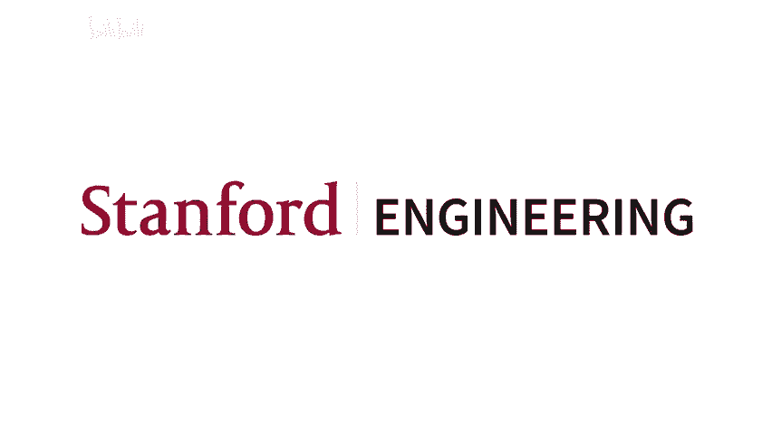

感谢你们邀请我今天来演讲，我将讨论音乐和音频的变压器，这与我们过去的课程非常不同。我也是唯一一位来自斯坦福的发言人，所以我必须表现出色，确保你们看到非常好的幻灯片，因为在某种意义上我代表着这个大学。

所以今天演讲的流程基本上是，我会讲很多内容，像自助餐一样，你可以随意喜欢或不喜欢。我将主要讨论我所做的三篇论文。

我首先会从不同的角度介绍什么是变压器，以及音频表示是什么。谈论一个用于音频的生成模型，实际上是在样本级别上进行语言建模。然后我将讨论如何对语音和音频进行语言建模。

这与人们处理文本的方式不同，目前文献中的趋势是什么。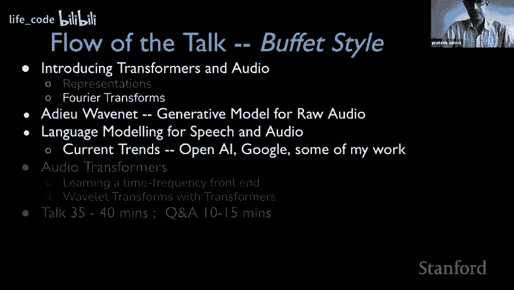

最后，我将简要提及与视觉变压器相关的计算机视觉领域发生的类似事情，或者我们能否将类似的思路应用于音频变压器，并加入一些信号处理以提高性能。谈到这里，演讲大约为 35 到 40 分钟，包含约 15 分钟的问答。我还要说，我的所有观点以及斯坦福或其他教授的观点对我所犯的错误不承担责任。

嗨。所以变压器在某种程度上革命性地改变了大家之前在深度学习领域的做法，之前的重点都是 CNNs，所有这些突出的模型都是在一波波涌现，曾经一段时间每个人都在应用 CNNs，然后开始适应某种扩张卷积，慢慢地循环神经网络也在失宠，现在变压器似乎总是时尚，几乎解决了所有提出的问题。

那么，特别之处在哪里？让我印象深刻的一个事实是它们的简单性。如果你想想看，它非常受欢迎，2018 年刚发布，三年内就有大约 30,000 次引用，几乎解决了每个领域的每个问题。它也有局限性，但如果你从某种角度来看，变压器基本上就是以一种级联的自注意力进行特征学习，如果我们不断这样做。

然后模型以某种方式学习哪些输入部分是重要的，并持续转换它们，移除不重要的内容，只保留负责特定任务的有限信息。呃。跟上文献真的非常困难，你知道的。

我在这里开了个玩笑，甚至连 Twitter 的推荐引擎也开始关注：为什么 Chris Manning 会搜索变换器，这还要追溯到 2020 年，所以对于研究人员来说，跟上发生的事情的节奏也很困难。

在 Transformers 之前，整个语言处理社区都在为双向 LSTM 和注意力机制而疯狂。所以在 2017 年之前的每一篇论文都只是这样：你有编码或 LSTM 层，你不断添加多个层，然后在之后有一个注意力机制，它只是关注重要的内容，然后依次解码。但这并不是一种理想的方式，你知道的。

因为事实证明，当我们开始处理更长的序列时，连接不再如预期那样存储梯度更新。因此，谷歌的研究人员提到，与其在最后一个编码层只有一个注意力层，我们不如在每一层都有这些注意力机制，这样就可以学习在特定层中某个问题的重要性，并不断重复这个过程。

所以然后变换器和注意机制的整体思路相继出现，我就不详细讲了，因为这是课程的最后一节课。但常用的技巧也有助于整个神经网络文献，比如多头注意力、跳跃连接和层规范化，这些不仅对变换器本身有好处，还可以应用于任何其他架构。

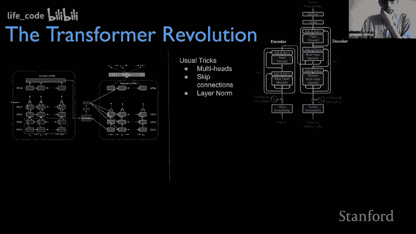

另一个推动这项研究的因素是计算能力不断提升，所以所有这些大公司都在投入大量计算资源来解决非常简单的任务，其中最顶尖的就是课程中讨论的 Switch Transformer。

但我认为所有力量的起源之一是 Elmo，它只是学习了这些用于自然语言处理的上下文化表示，这个模型可能是最早的之一。呃。就像道德一样。0。0 或者 0。1，在引入整个革命方面，你可以看到这些模型的相似之处。Bt 基本上是受到 Elmo 的启发，他们只是用变换模块替换了一些 LSTM 层。

所以，一个需要注意的点是，无论是自然语言处理还是其他领域，这些方法都可以适应多种领域，而今天的讨论中我将它们应用于音频。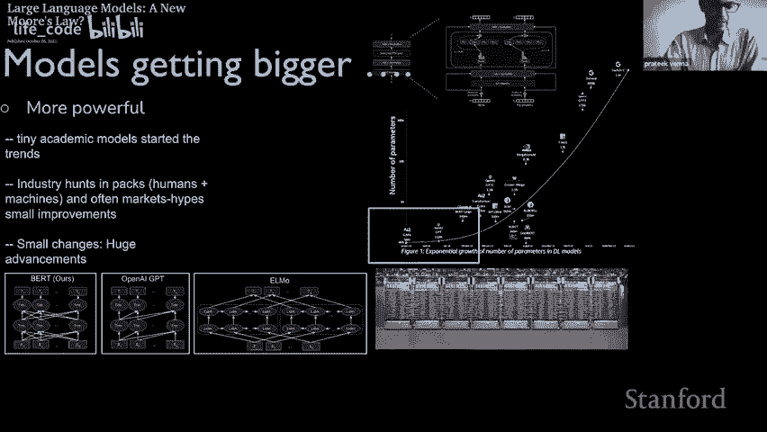

因此，我基本上将从介绍音频表示法开始，只为完整起见谈谈谱图。你可以将任何时域信号分解为多种基函数，如果你进行傅里叶变换，你就像是在将实际时域信号分解为正弦基组件。因此，如果你这里有一个波形，它是三个纯正弦波的总和。

然后这里的总和基本上就是这个，你可以看到当你进行傅里叶变换及其幅度时，你基本上有了各个成分的强度。Sn 在这里，所以你可以从一个正方波取出另一个波，你所拥有的基本上是更丰富的正弦分解，因为它是一种不连续信号，因此你需要更多的正弦波来尽可能接近实际信号。

在这里你也可以看到，如果这是一种正方波，那么它实际上由许多正弦波组成，每根条形代表特定正弦波的强度。从优化的角度来看，这样做显然是次优的，因为你在为表示正方波固定了正弦波的数量。我更倾向于使用正方波本身的基函数，而不是正弦波信号。第二件事是，即使你在处理正弦波信号，我们也只是。

将它们放置在等距空间中，你基本上是在将整个频率轴划分为等距的 bins，每个 bin 负责一个特定的正弦波。所以这就是传统傅里叶表示法，用于表示任何信号。

我们在处理谱图时，实际上所有这些信号都是不连续的，这些信号的变化相当大。因此，在我说话时，你可以有一个正方波，在某段时间内然后它变得正弦波状，接着变成其他形式。所以我们真正需要的是一种方式来。

类似于获取输入信号的片段并对这些单独的片段进行傅里叶变换，我故意使用“木片”这个词，但在传统术语中你是在对信号进行窗函数处理。所以在这里你可以看到，你有一个连续信号，你不断对其进行窗函数处理，应用傅里叶变换，得到的基本上是信号的谱图表示。因此，在这里你所看到的基本上是每个切片的信号在进行傅里叶变换后的样子，以及下面的波形。

而你要做的是，对于频谱图表示，你不断堆叠这些傅里叶变换切片的幅度，以这种方式你可以获得音频信号的二维表示，如果你来自视觉背景，实际上你在视觉中所做的所有事情，如果你将它们应用于这些二维频谱表示，效果会很好，并且我会快速展示这些频谱图在常见声音的广泛范围内是如何呈现的。

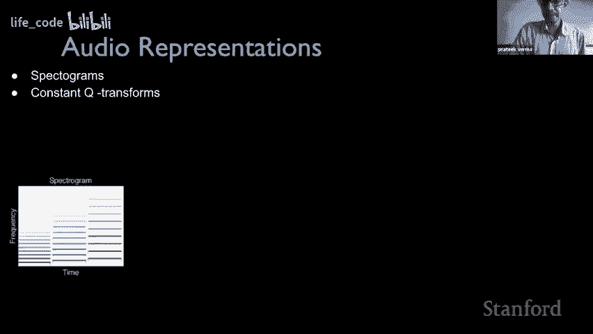

嗯。是的。🎼，🎼，🎼是的。W。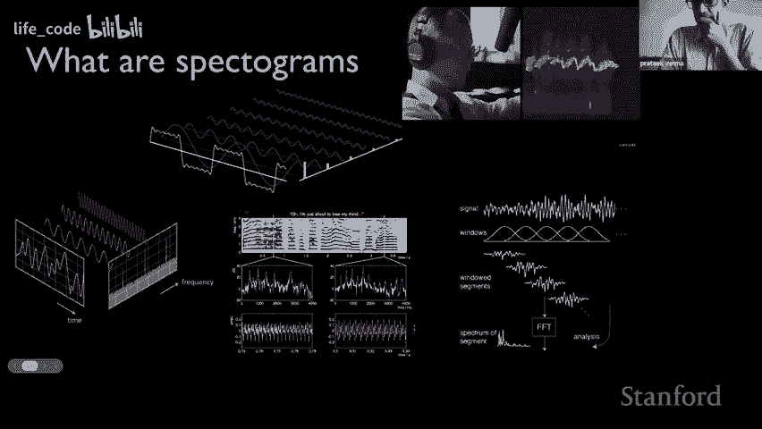

好的。所以你可以看到，对于频谱图，你的 x 轴有一个时间轴，y 轴有一个频率轴，然后对于你感兴趣的信号，你基本上是在将这些切片组合在一起，不同的声音给你不同的频谱表示，因此这在某种程度上是一个视觉问题，只是在这种傅里叶空间中。

所以可以有不同类型的表示，因此一个方法是你可以直接取这些傅里叶变换的切片，然后进行线性映射，从某种程度上使其更接近人类的听觉，因此你可以有频率的对数而不是常规频率，然后你得到一个恒定的队列表示，这样的优势在于，你可以看到不同频率之间的谐波间距保持一致。因此，如果你在训练卷积滤波器，这就是一个巨大的优势，因为信号的一个成分已经消失，你可以学习这些捕捉到这些恒定傅里叶切片模板的滤波器，你可以有金属滤波器组系数，或者你也可以有原始波形，对于原始波形，我们基本上有两件事情需要记住，一是采样率，所以我们基本上是将连续信号进行处理，然后我们。

细分连续信号，所以其中一个参数是我们采样连续信号的速度。因此，如果你是在电话语音中，这通常是每秒约 16000 或 8000 次，另一件我们要考虑的事情是我们如何划分垂直轴的级别，因此在这种情况下，你可以看到每个点基本上是一个级别，通常人们使用 8 位量化或 16 位量化，因此可以这样想，对于我们听到的每一秒音频，你将有大约 16000 个样本，然后在每个 16000 个样本中，有可能取 0 到 55 之间的一个级别。如果我能将连续音频的问题转化为这种离散空间，那么基本上我就进入了语言建模的领域。

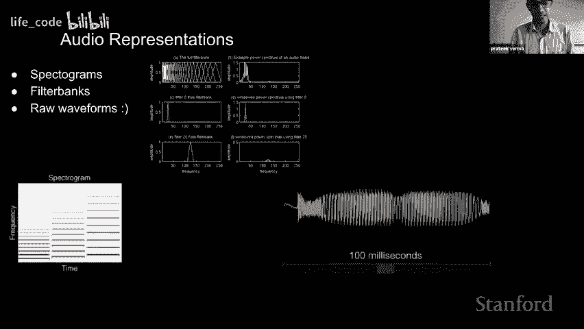

呃。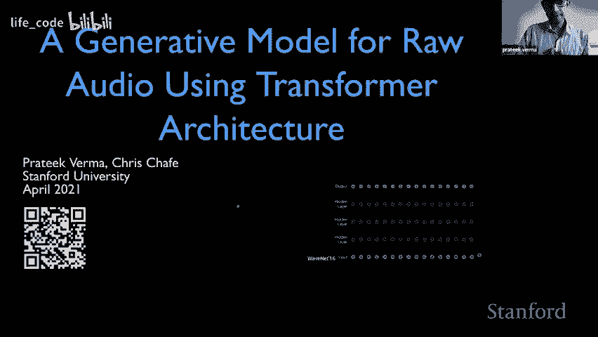

我将讨论的第一篇论文是如何对原始音频进行生成建模。这类似于使用变换器的 WaveNet，如果你喜欢我正在做的东西，认为这对你有相关性，请引用或者查看二维码。所以我将开始今天演讲的第一个子主题，即什么是 WaveNet，以及我们如何进行原始音频的生成建模。

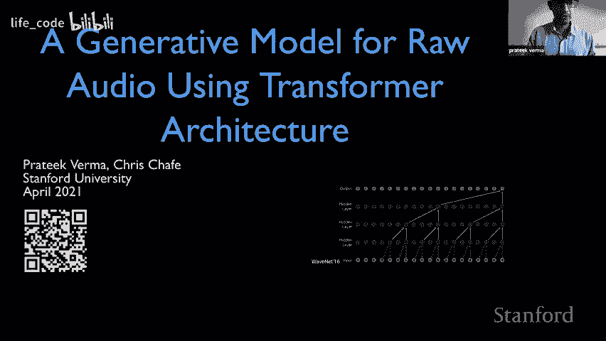

因此，用一个词来说，你可以把这看作是在这 255 个音频状态上进行语言建模。你可以投入你喜欢的变换模型，比如 Transform Excel 或 GPT，或者你想称之为的任何名字，把这个问题视作试图预测 255 个级别中的一个级别，并根据特定上下文预测下一个级别。

这就是 WaveNet 的作用，模型在连续空间中的概率分布基本上是预测给定部分文本的下一个样本的概率。WaveNet 之所以广受欢迎，是因为它的引用超过 3000 次，并且几乎成为所有语音和音频相关问题的构建模块，比如语音转文本和文本转语音合成。

在互联网语音去噪中，仪器转换的丢包隐蔽技术使得音频的修改成为可能，人们一直在使用 WaveNet 作为构建模块。而原始音频合成一直很困难，因为问题的复杂性。

如果我只是试图合成 10 秒的音频，那么这就相当于我需要对 160,000 个样本进行概率分布预测。而这本身就是个挑战，因为我们的耳朵对细微变化非常敏感。如果我在图像中偏差一个像素，我的眼睛可能不会那么容易注意到那个效果；然而，如果我在音频中偏差几个像素或样本，我们的耳朵会很快捕捉到这个变化。过去人们在原始音频合成方面进行了大量尝试，之前的 WaveNet 和基于变换器的方法之前的状态如 Wave Rronance 和 Sample Rronance 类似是当时的先进模型。我展示了一个 Sample RronN 模型。

模型会根据过去的多个层次来预测接下来会发生什么的概率分布。这项工作是由 Nila 的 Yoa Bnji 完成的，但你可以清楚地看到，如果将这个架构与变换器架构进行对比，它们实际上开始变得非常相似，因为你试图做的是，对于这里的概率分布，你需要识别大量的局部子结构，然后不断重复这一过程，你可以得出平行关系，比如说注意机制也应该做类似的事情。

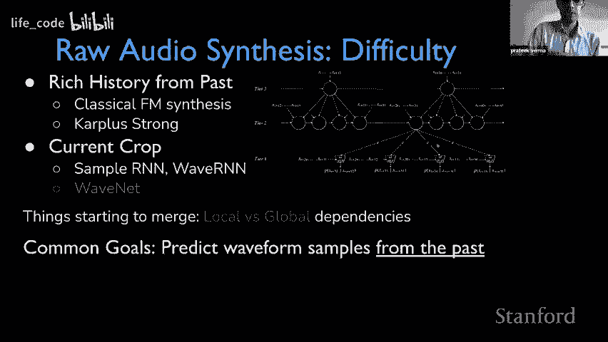

这就是过去的文献，我们尝试做的就是使用 wavenet 模型，看看变换模型是否能够超过它们，我们的直觉是，它应该能够超越，因为它们在其他领域，如语言建模中表现出色，所以它应该也能在原始波形中做到这一点。我们还尝试看看是否可以规避自动和平方约束。

上下文的条件和我们没有针对特定应用进行探索，我们只是说，好吧，就像在建模行为方面，他们会怎么做？

所以这个数据集就像是现实世界的数据录音，实际上，声音并不重要，因为模型对输入的内容是无关的，设置是完全相同的，你给定一个特定的上下文，我必须预测下一个样本，你用 wavenets 做同样的事情，你用基于变换的模型，比如 GPT，做完全相同的事情，看看它们的表现如何。

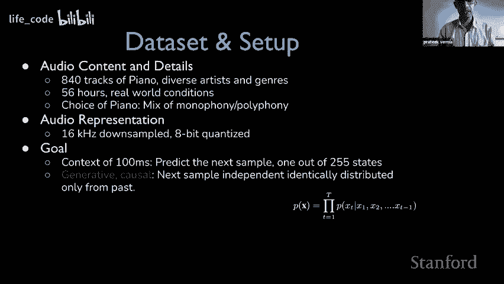

我将简要讨论一下 wavength 模型，所以 wavenet 是一种基于卷积的模型，它通过将序列问题视为由卷积模型学习，从而消除了梯度消失问题。他们所做的基本上是有这种扩张层或卷积，这基本上是在每个后续层中跳过一个样本，所以你可以看到，如果我有一个扩张因子为 2，卷积核大小为 2，我会得到这种拓扑结构，在第一层中，我只是结合前两个样本，并在下一层中跳过一个，然后在接下来的层中跳过三个，依此类推，损失仍然是相同的，所以我有这个网络，学习一个潜在空间，然后我有一个交叉分类交叉熵损失，这基本上是要预测下一个样本。

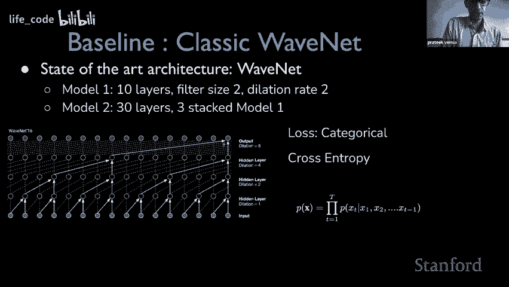

在之前的实验中，我对变换模型做了完全相同的事情，但我必须确保以因果的方式进行，所以我有一些非常类似于 GPT 的东西，在我的注意机制中有因果掩码，我不断重复这个过程，所以你有自注意力机制，然后是前馈层，你只是堆叠这些变换块，看看它们的表现如何。

所以我说，这应该有效。像我们的基本 WaveNet 模型应该表现得更好，因为如果你看拓扑结构，我们在自己定义一个拓扑结构。那么，如果当前的预测 Excel 层依赖于很久以前的样本，而不是第二个样本，第一样本，我们在某种程度上忽视了所有这些拓扑结构，这对于这个特定任务的预测是重要的，而变换器通过自注意机制可以学习到哪些样本是重要的，哪些不是，你可以不断创造性地进行调整，因此这对我们来说是有道理的。

变换层的表现应该远好于波长模型。嗯。我们遇到的第二个问题是我们不能有太多的上下文。例如，注意机制需要存储所有的 n 平方次序数据，在这种情况下，如果我以 100 毫秒的速度存储数据，那么我大约有 1600 个样本，我需要在多个层上存储 1600 x 1600 的数据，这在内存限制方面会成为一个巨大的问题。所以我们说，假设我们将上下文本身作为潜在编码来使用，以便在每一层有更好的表示。我们不能有巨大且复杂的注意矩阵，因此我们决定通过条件处理和 CNN 层来理解潜在编码，因此你仍然有注意机制或者仅仅是过去的上下文。

在每一个样本中，我们应该考虑在构建上下文时下一个样本应该是什么，如果你想想，这就像在钢琴上弹奏五六个音符，那么我可以确定哪些音符会在一定程度上被弹奏，如果我只是加上一个 CNN 层。因此，我将使用这些信息以及我的传递学习，然后我会对其进行条件处理，并用它来预测下一个样本。

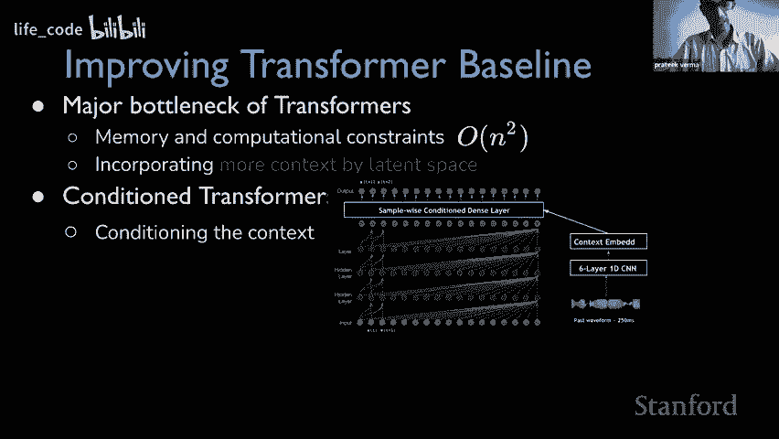

因此，在评估标准方面，我们并没有关注负似然得分。我们只是关注我们的预测任务效果如何，所以我们采用了由 DeepMind 实现的堆叠 WaveNet，并观察了它在他们基准测试下的表现，甚至是更大的堆叠 WaveNet。

然后我们开始增加变压器的复杂性，并开始观察我们在条件作用于普通变压器架构方面提出的建议效果如何。我们并没有寻找特定应用的问题，也就是说，我们没有关注像文本到语音合成或语音识别这样的感知任务的表现，我们只是看如果我们试图使用交叉熵损失来建模，那么在相同模型和相同损失函数下，它们在类似参数上的表现如何？

这是如何利用变压器进行生成建模的第一个子块。

哦。对于第二个问题，我会快速讨论一下。我们如何利用变压器进行语言建模，这个概念现在变得相当时尚，这项工作是由**朱莉亚·史密斯**在 2020 年完成的，目标是我们能否以某种方式用连续音频序列进行语言建模，我将简要提及这一部分。

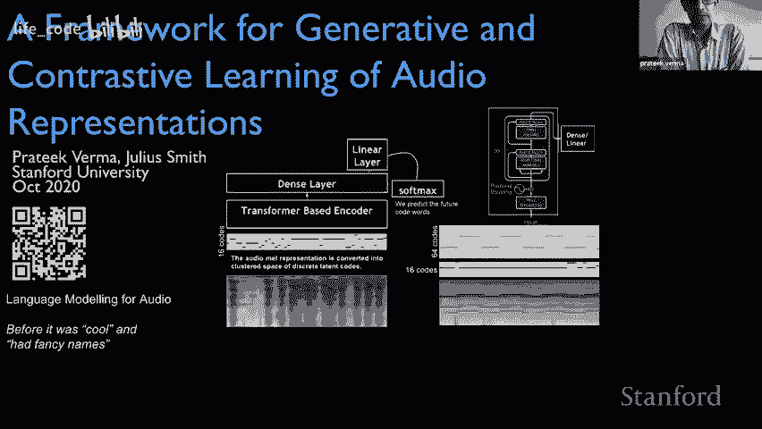

哦。因此，这与解决声学场景理解有关。如果我得到一段音频，我想理解其中的内容，如果我们能够很好地做到这一点，那么在某种程度上，我们可以做很多很酷的应用，例如，如果你考虑自动驾驶汽车，**VMmo**已经开始在自动驾驶汽车中加入麦克风，原因是如果有救护车来了，或者有其他声音。

文件卡车来了，那个声音会在李尔斯或他们的传感器之前被捕捉到，因此他们想了解这一点并根据此采取行动。苹果在 COVID 期间对他们的 Apple Watch 进行了洗手检测，因为如果你能检测到某人洗手，那么你可以在某种程度上告诉人们“哦，你需要洗手 20 秒”，这可以作为一个很酷的应用。

它可以用于音乐推荐，因此**Spotify**和**YouTube 音乐**会推荐非常适合你正在听的、内容相似的好歌，这也可以带来很酷的应用，比如有人尝试从音频中检测抑郁，或者我可以检测我是否在咳嗽或打喷嚏，这些都是不错的应用。

医疗设备的医疗应用，可以与医生提供的当前诊断结合使用。所以我们基本上的问题是，如何在连续音频领域进行语言建模，其次，如何训练模型或者我们应该如何处理这个问题？

所以，这种配方如今变得非常流行，关于你如何处理这个问题，起初是由**OpenAI**提出的，并且在某种程度上**深度学习**也提出了类似的**VQV 模型**，但事实证明变压器现在更喜欢在离散空间中操作，它们所做的就是。

只要你的表示是离散的，它们就非常擅长建模接下来会发生什么。因此，人们提出的解决方案是，你可以以某种方式使用你喜欢的嵌入，你可以使用 VQ-VAE 嵌入，或者你可以使用 Wave2Vec，或者在视频方面，你可以使用经典的 VGG 或 ResNet 嵌入，你可以对它应用 K 均值聚类，K 均值聚类会给你离散代码，你可以用这些离散代码进行语言建模。

你预测下一个代码，从某种意义上说，如果你这样做，那么你就是在音频上进行语言建模。如果你需要返回到音频，那么你已经看到了它的 WaveNet，你可以对 WaveNet 模型进行条件处理以获得连续输出，因此你可以使用这些代码来回到音频，这与 Jukebox 和 OpenAI 的做法类似。呃。我会快速提到一下向量量化是什么。

说实话，这是最少被利用的算法之一，它的基本功能是为连续的组装空间提供离散代码。那么它是如何做到的呢？你基本上有一个嵌入空间，假设在二维，这里你定义了想要放置每个集群的数量，你运行 K 均值，你肯定会得到这些补丁，这些补丁中嵌入了所有的内容。那么连续嵌入的代表性嵌入是什么？你可以拿所有这些补丁，你可以给它们编号，或者你可以列出它们。因此在这种情况下，你可能会有 25 个数字或 20 个数字，这些数字在某种程度上是从连续嵌入映射到离散标记。

这里是另一个例子。所以在我们的案例中，我们查找了声谱图的补丁，这基本上就像是非常小的时间段补丁，然后在频率轴上共享。你把这些补丁拿出来，学习嵌入表示，在我们的案例中，它只是像三层的全连接自编码器，带有三层解码器，中间有一个瓶颈层，这个瓶颈层基本上类似于像在 64 维空间或 120 维空间中的这种图示。你提取那些瓶颈回声，然后进行 K 均值聚类，从某种意义上说，你可以找到。

对于连续嵌入空间甚至连续信号的离散代码，由于我们知道变压器喜欢在离散空间中操作，我们现在可以应用语言建模，你可以看看你能做什么。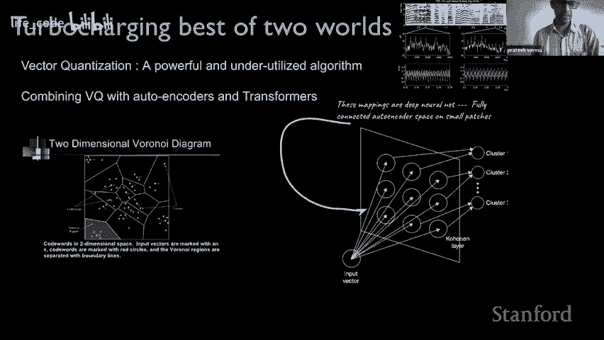

在我们的案例中，我们就有非常简单的三层全连接自编码器，补丁的数量很重要，因为如果你有太多的代码，那么你就是在扔各种噪声。我会举一个例子。

为什么代码数量重要，通过一些例子来看，如果你有两个很少的代码，实际上你在做的是移除所有相关的信息，并且只是将它们平均化。嗯。我先从这个想法开始，这个想法最初是由 Juke B 提出的，他为音乐做了这个。所以你以稍微不同的方式做完全相同的事情，也就是说，好的，你不能为较长的序列学习代码。

所以你知道，以某种方式学习的序列只是缓慢移动，并且仅查看一定量的音频，所以我们在这些离散级别中编码这些内容，这些基本上就像所有这些基本上都是代码。因此，在每个点上，我定义，比如说这个音频可能有代码编号 55，而在下一个级别，它可能有代码编号 2，在最上面可能有代码编号 2000。

所以在某种程度上，我像是在离散化整个代码。现在我做的是，我选择我最喜欢的变换模型，可能是因果或自回归的，然后我说，好的，给定这些代码，尝试预测接下来会出现什么代码，变换器确实可以做到这一点。因此，一旦我生成了未来的代码，我可以说，好的，这个问题现在有点像文本到语音的问题，因为我有这些离散代码，文本到语音在某种程度上是从离散字母到连续音频，所以我会投入像 WaveNet 这样的高级技术，然后我就会得到返回的代码，并生成音频。因此，这在某种程度上是我描述的，他们采用连续音频，拥有这些压缩代码，并使用 CNN 进行编码，在这种情况下，方法并不重要，你可以投入像 EmBedding 或潜在表示这样的高级技术。

在这些连续代码上，你生成的模式就像是未来将要发生的事情，然后使用先进的 WaveNet 进行解码。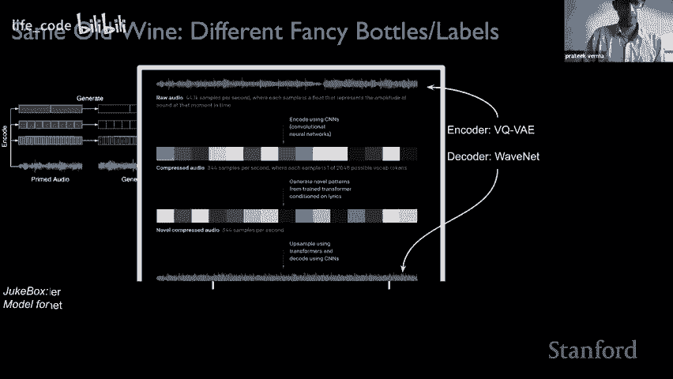

所以他们在音乐合成中做的就是这样，我们说这很好，可以生成大量音乐。但这些球能用于生成什么呢？就像是能否让语言模型学习到能封装我们输入信号的良好表示。所以在这种情况下，我们尝试的是类似的想法，但不是做端到端学习的编码，我们只应用了普通的 K 均值聚类，类似于我之前描述的，我们在谱图块上进行操作，因此你获取这些音频的谱图，然后把它们分成非常小的块，为每个块学习自编码器的编码，进行均值聚类。在这种情况下，比如我正在学习 16 个编码，以 16 个编码表示连续音频，有一个变压器可能预测下一个编码，如果我继续获取一些数据。

在这个线性层中，我应该封装重要的或什么内容。

这是过去发生的事情的一个很好的总结。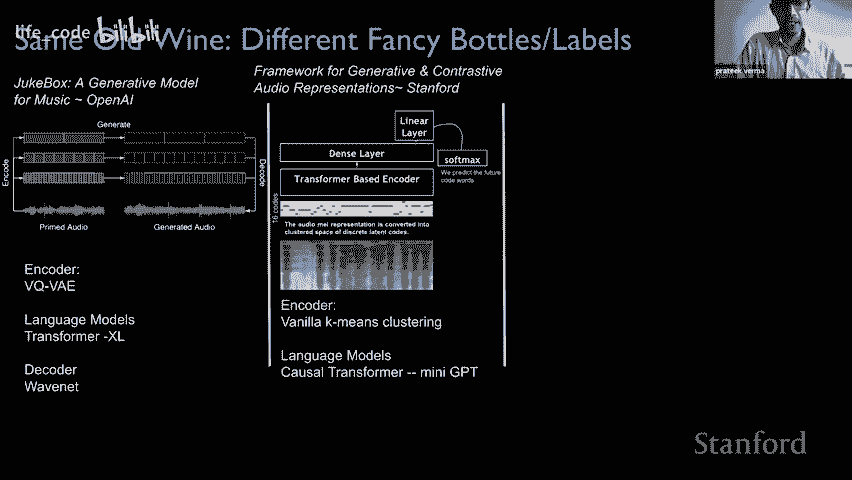

呃。所以这就是我们尝试这个的直觉。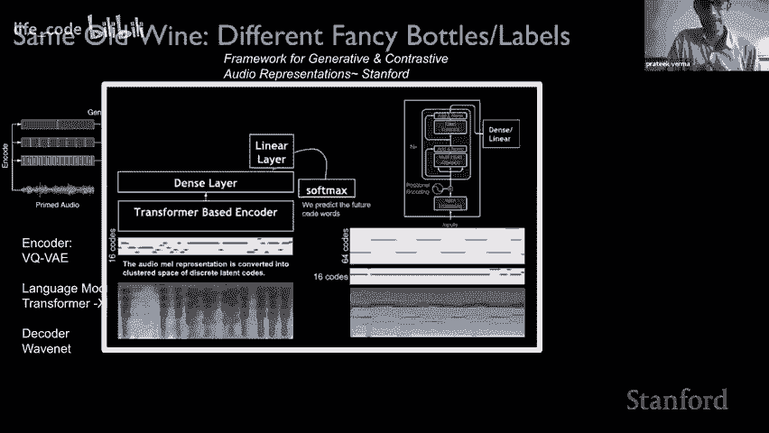

正如我所解释的，编码数量起着非常重要的作用。你可以看到这里这只是两个钢琴音符相继切换。如果我只有 16 个编码，它就只有一条编码，一个编码分配给所有这些，而如果我分配更多编码，它就变成了一种细致的预测，我实际上能够获取到每个音符。

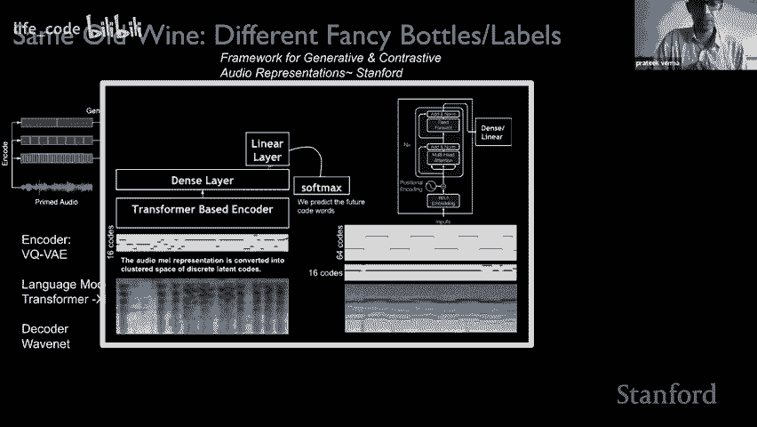

最近，Facebook 也表示，他们对整体的说法有了不同的名称，可以称之为文本类 NLP，实际上在某种意义上可以说，你可以在没有文本的情况下进行 NLP，理念非常相似，你有一个编码器，与 OpenAI 使用的完全相似，你有 VQ 波到 V，或者你想做的任何事情，都可以对其应用 K 均值聚类，我们将语言模型应用于此，解码器不是 VNet，而是类似于文本到语音的不同版本，像是 Toptro。因此，如你所见，这些都是同一酒但瓶子不同，但核心理念几乎完全相同。

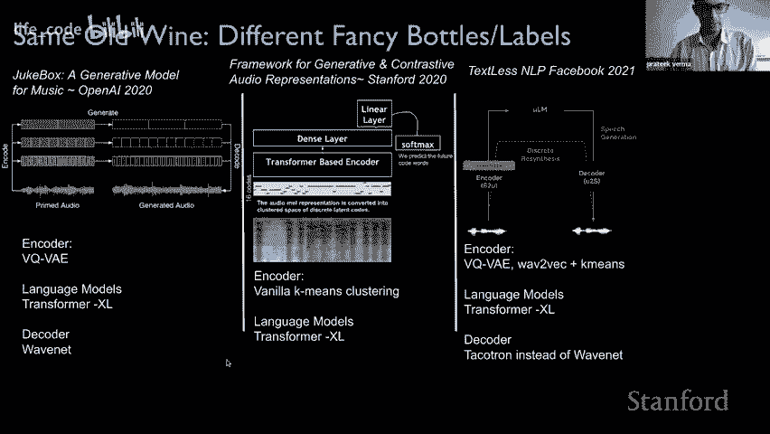

这就像创造了一个巨大的优势，哦，这将改变 LPN，但这与过去人们所做的非常相似。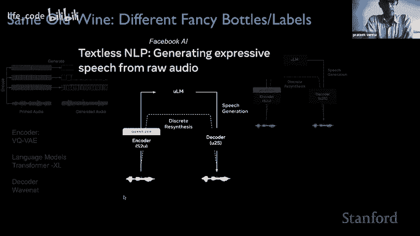

我已经解释了这是什么，所以在我们的案例中，我们只是尝试预测下一步会发生什么，给定前文上下文，并使用这种表示法，类似于每一个短期学习或零短期学习的基于方法。

我还解释了为什么代码的数量很重要，如果太少，你就扔掉了很多信息；如果太多，它就不再对噪声稳健。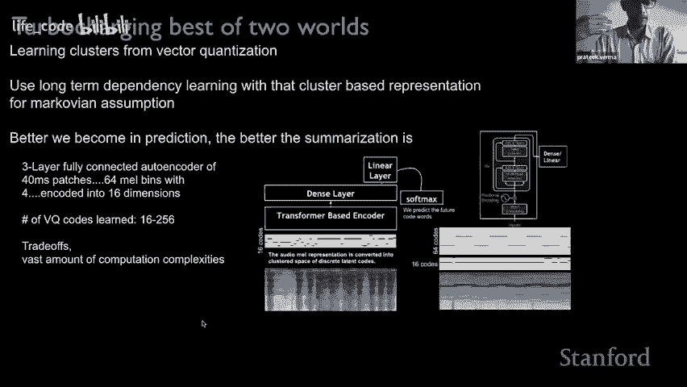

哦。所以这是我们的设置，在我跳进去之前，我应该补充一个我从 DeepM 的一位著名研究人员那里看到的推文，基本上很多时候提高数字非常简单，你知道。比如我可以不在论文中提供这些细节，这实际上在提高性能方面有很大帮助，有时不被考虑。

实际模型所包含的或模型所贡献的，与这些训练技巧实际包含的东西相比，对于大多数这些方法，我们尝试保持几乎完全相同的方法。没有数据增强，没有华丽的标签平滑或权重的移动平均或衰减，无论如何，你只是有类似的基础配方来看看我们的表现如何。

在这种情况下，目标是评估我们的模型与纯监督方法相比表现如何，以及与类似的无监督方法相比表现如何。在第一个案例中，模型及其所有权重访问所有标签，这被显示为 VGD 监督，基本上是你获取音频理解数据集，并查看你的准确性指标表现如何。这是第一个；在第二个中，我们应用了 Jeff In 提出的 Simclair，你可以对相同输入进行多种增强处理，可以去除补丁、模糊信号、翻转信号，你从最后一层学习嵌入，而不访问标签，然后仅使用线性头来预测发生了什么，使用这种方法我们得到了 55%的准确率。

然后尝试预测内部发生了什么。通过这些，我们得到了 60%的准确率。尽管结果并不好，但事实上神经网络实际上在处理大量数据时非常出色，因此在纯监督和纯无监督之间仍有 10%的差距，但随着大量数据的投入，这种情况会改善，因为它没有任何标签的访问权限。这是分析师 Nelson 和 Morgan 在伯克利的著名论文，他们早在 1999 年就展示了原因。

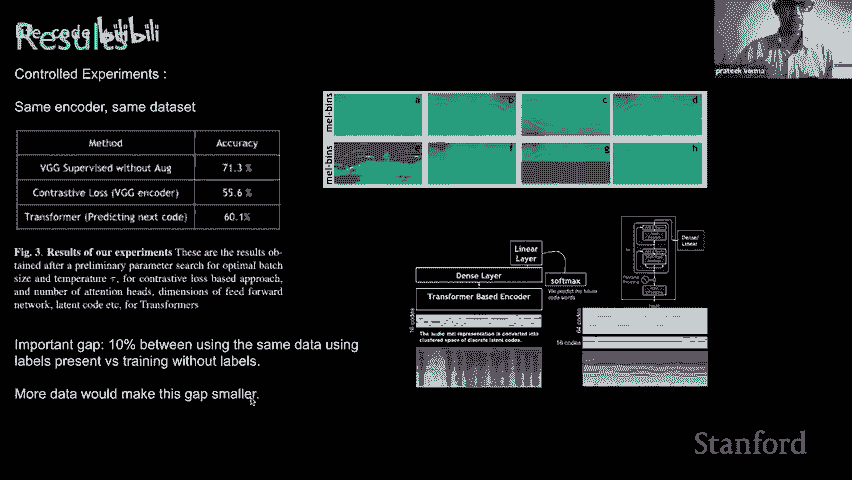

像大小这种因素对于深度神经网络和数据点数量很重要，因此随着数据集和参数大小的不断增加，它们的错误率越来越低，这在任何数据集中都是如此，这就是无监督学习令人兴奋的原因。

所以这是一个关于如何进行语言建模和无监督学习在音频连续信号上的一种方法风味。

对于第三个上图，我只想快速提及。与您在视觉变换器中看到的非常相似的想法，但有一个警告：我们如何使用某种信号处理来进一步提高这些性能？

基本方法仍然与您在视觉变换器中看到的完全相同。您有一个感兴趣的信号，您想在这里对其进行分类，它们是原始波形而不是图像。目标是预测里面有什么，对吧？我们也没有任何结论，没有之前使用的其他技巧。

我们所需要做的就是，他们可以将我们转变，解决这个特定的问题。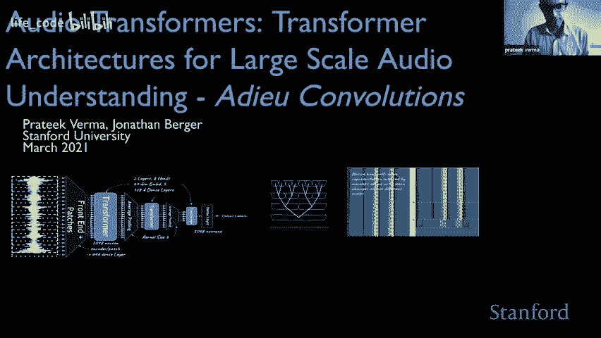

因此，数据集和整个设置仍然是相同的，没有数据增强，也没有其他这些技巧，您会获得 40,000 个片段用于训练，10,000 个用于验证。我们的工作是尽可能准确地预测音频中存在的内容，这个问题与您听到的声音和您看到的视频非常相似，给定一个补丁，您必须预测给定的频谱图补丁内部的内容。

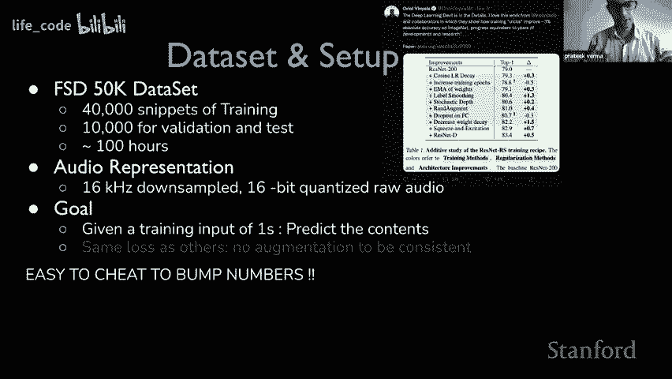

呃。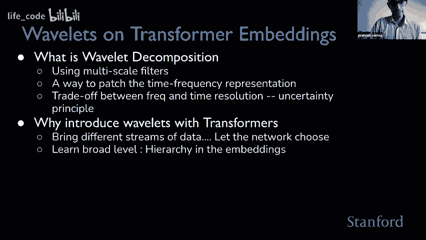

我们在某种意义上比简单的变换模型更进一步，尝试查看某种层次结构是否能以任何方式帮助我们。因此，我们在中间变换嵌入上使用了小波分解，那么什么是小波分解呢？

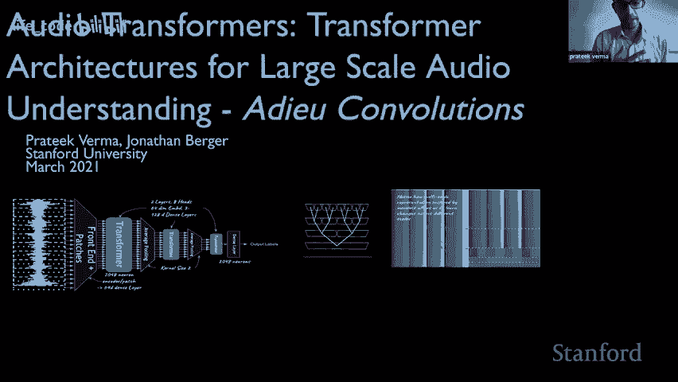

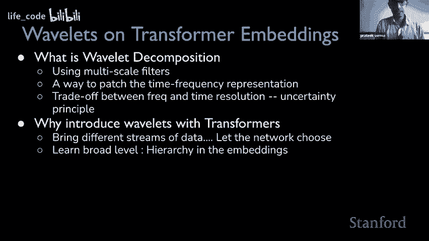

用非常简单的术语来说，这就像是将中间嵌入分解成的方式。在某种意义上，我们将这些嵌入的高速公路分成一些移动得很慢的嵌入和一些移动得很快的嵌入，还有一些嵌入的保留速度恰好与原始信号相同。这一点很重要，因为你可以想到，在每一个中间状态中，你都在学习模型中的某种层次结构。因此，如果我查看我们在小波分解前后的工作，比如你在时间轴上有这个，而在嵌入大小上有这个，整个补丁是你所说的变压器最后一层的输出。那么我现在说的是，好吧，我只是。

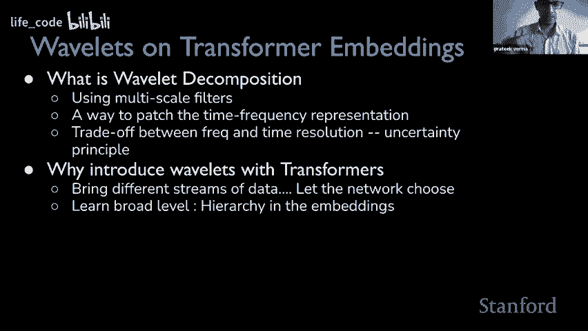

从这里映射到我感兴趣的映射，使用波长分解，其中对于一半的样本，我刚刚创建了与变换模型学习的完全相同的嵌入，在后半部分我会开始每次组合两个，所以在某种程度上，我正在学习这种类似于树结构的东西，在变换器嵌入的单层中，对于现在使用的波长或 B 函数，我简单地进行了平均，所以假设在所有嵌入层之间，我只需要有一个完全不动的嵌入，代表存在的任何东西。

在整个潜在空间的 n 层中，在接下来的层中，我会每次使用两个，然后每次使用四个。直到我达到与之前相同的精确分辨率。进行这个操作不会增加任何参数，你只是在定义你的基函数是什么，或者在这种情况下，波长函数是什么，这是一个硬波长函数，我开始将它们组合在一起，并且我在每一层的变换器中都学习到了一种层次结构。

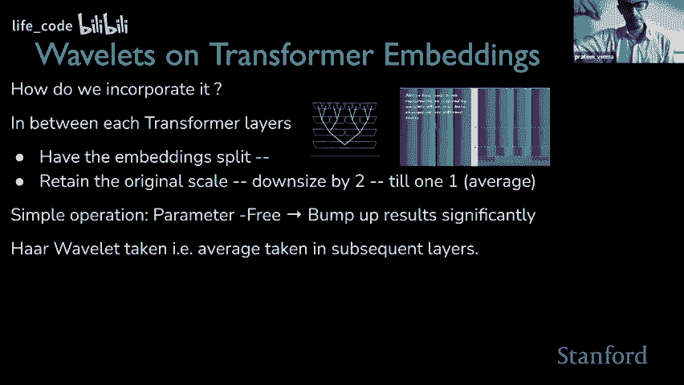

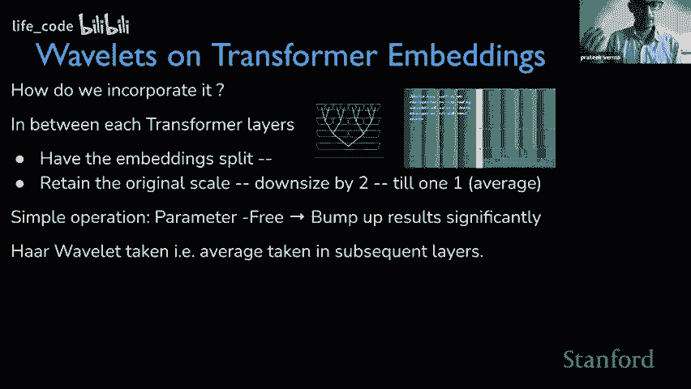

与不使用它们并且没有额外参数的情况下相比，这显著改善了我们的性能。我稍后会提到结果，所以这就是整个方法的样子，你有一个前端，前端基本上是 2000 个神经元的一层，后面跟着 64 个神经元的稠密层，目的是确认与中间变换器读取一致。

假设对于变换器，我定义的批次大小为 64，那么这是我映射到的维度，所以我从宽带形式开始，将其分成非常小的补丁，类似于你在视觉变换器中所做的，我将有一层 2000 个神经元，后面接着一个 64 个神经元的稠密层，希望第一层能够像一个傅里叶 B 函数一样学习，这应该能根据我的学习进行调整。之后我一直重复这个过程，我没有分类头或其他东西。

然后添加多个变换器堆栈。我有两种适应的方法。我可以对这些中间嵌入进行时间上的平均池化，因为这个想法与我们在经典视觉中所做的非常相似，每个嵌入在后续层中都在观察更广泛的输出，或者我可以进行分解，所以我把所有这些嵌入取出并定义这些高速公路，其中一些嵌入移动得很快。

有些模型运行非常慢，有些则保持与变换器学习的相同分辨率。然后我不断重复这个过程，我有一个稠密层，我有我的 Softmax 或 Sigmoid，无论我的分类头是什么，所以这就是这种方法的样子。我们将其与所有传统的基于视觉的架构进行了比较。

所以基于视觉的模型表现非常好，在理解音频方面也表现相似。因此，我们在平均精度等方面比较了所有这些模型。我们发现即使是最小的变换器模型也超越了所有最先进的 CNN 模型。

这非常好，所以我们开始提升。好吧，更大的模型应该继续改善性能，同时多尺度模型和池化层也进一步提升了性能，这让我们感到惊讶，因为参数数量非常少。这些架构非常小，但它们却超越了像 Densenet 这样拥有数百万参数的大型模型。

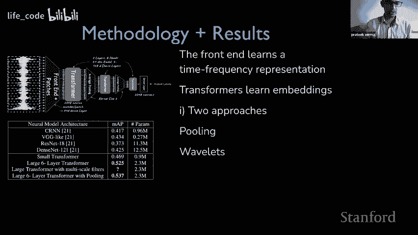

所以之后我们说，我将快速总结，之后我们说，好吧。这看起来很酷，变换器的第一层实际学习了什么吗？

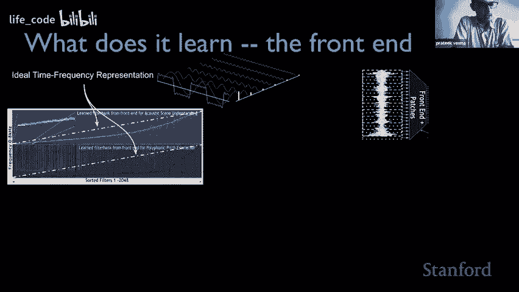

为了绘制这个图，我们说好吧，如果你进行经典的傅里叶变换。那么如果这个轴类似于频率，这个轴是滤波器的数量，而这个轴是频率。那么在某种程度上，它应该连接所有点成一条直线，这类似于 50 中的点数，所以我在这里定义多少点。如果我在这里定义 2000 个点，那么我将有大约 2048 个从低频到最高频的正弦 B 函数。

我们说好吧，我们将做完全相同的事情，但现在加上滤波器，所以我们在 y 轴上有频率，在 X 轴上有点数，如果这是经典的傅里叶变换，那么它应该连接成一条直线，但我们所做的是，我们取出前端，通过变换器学习的，进行傅里叶变换，并根据其中心频率解决，即它最活跃的频率，然后不断堆叠它们。当我们这样做时，我们看到我们正在学习一种不同的时间频率表示，这对于预测问题是特定的。如果我试图理解音频内容，我学习的表示与傅里叶变换非常不同，它应该是一条直线，而更像是这样的卷曲指数线。如果我做类似多音调音高估计的事情。

我学习了一种非常不同的前端，它适应于这个特定问题，因此对我们来说这非常令人兴奋，因为在某种程度上，让计算机根据特定问题调整其“耳朵”是个非常酷的想法。第二件事是我们实际上观察了每个滤波器的作用，这基本上就像单个切片一样，所以这就是我们所学习的前端神经元，我们取出每个神经元并进行绘图。为此，我们基本上采用其傅里叶变换，然后根据频率中心进行分类。当我们观察前端神经元所学习的内容时，我们发现它学习的属性与传统信号处理非常相似，因此你会看到像一个起始检测器在这里学习窗口函数。

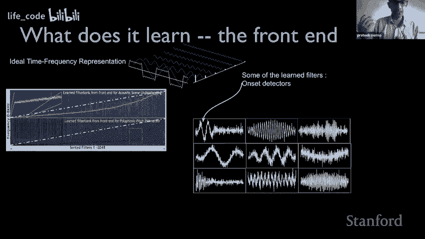

拥有一个最佳的时间频率表示内核，许多人在信号处理中使用，这类似于汉明窗或悬挂窗，我们正在学习这些纯正的正弦波，它们负责激活特定频率，因此你可以看到它的丰富性，与固定的纯正弦波 PC 功能相比。

这就是我们所做的，然后分享最终的想法。我将总结说，变换器在各个领域的 AI 研究中正证明是重大的进步。而且，看起来他们现在正在解决一切，希望这不是终点，我们应该关注可能会改变和产生影响的东西，这超出了变换器的贡献。谁知道接下来会发生什么呢？是的。

所以我将总结一下，并乐意回答问题。谢谢 Praique，这是一次非常好的演讲，你提供了一些关于变换器在音频案例中如何工作的深刻见解，感谢你的演讲，现在我邀请班级的学生提问，让我停止录音。

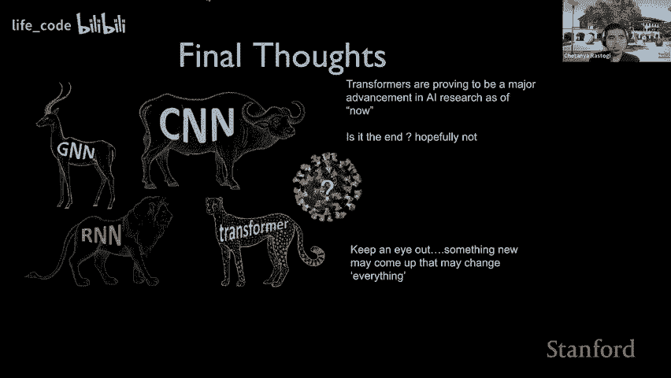

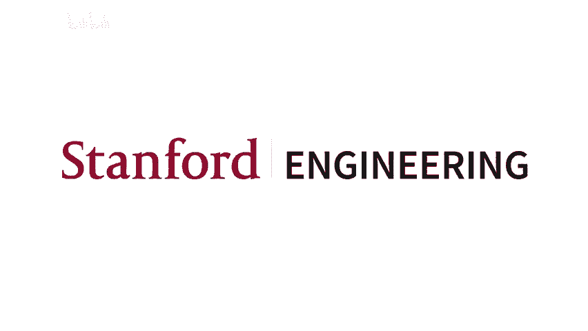
