# 斯坦福 GPT/Transformer 原理介绍 (中英文双字幕) - P7：7.自注意力与非参数变压器 (NPTs) - life_code - BV1X84y1Q7wV

非常感谢，很高兴来到这里，祝大家万圣节快乐。我认为这次演讲将分为两个部分，所以我会先花大约 10 到 15 分钟讨论变压器的一般情况，但我假设你们大多数人都熟悉它们，我们可以继续讨论 MPT，Ya 和 Neil 会做介绍。

😊。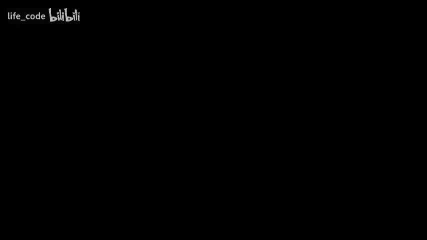

那么我们来看看，我打算快速介绍一下变压器的概况，并可能在变压器的历史上花一点额外的时间，或者稍微讲述一下这个故事。我认为这可能会更有趣。嗯。就变压器架构而言，它首次引入的两种主要概念是多头注意力和自注意力，然后将这些与快速自回归解码结合在一起。所以在变压器之前，几乎每个人都在使用 LSTM 及其带注意力的 LSTM，我会尽量解释自注意力和多头注意力之间的区别。

所以最初你会有两个序列，然后你会有一个注意力模块，它会从源序列关注到目标序列，因此源序列中的每个令牌或每个词都会与目标序列中的一个元素的软近似相关联。

因此，最终得到的结果像这样，但具有自注意力。我们不再使用两个单独的序列，而是让它们相同。这样，你就可以在序列中将每个元素与另一个元素关联起来。这里的想法是你在学习句子中词语之间的关系。

所以你可以想象有一个形容词被应用于一个名词，因此你想要将这个形容词与名词关联起来，比如“蓝色的球”。你想通过学习序列中的模式将“蓝色”与“球”关联起来。

嗯。抱歉，我在肯尼亚做过这个演讲，所以我在这里使用 Kewa Heley，但使用多头注意力。这个概念是每个词都用一个嵌入表示，在这里是深度维度，然后你有一个单词的句子。你把它分成几组。所以在这里我在深度上分成了四组。

你对每一组独立应用注意力，当你得到结果后，可以将它们连接在一起，回到你的模型维度表示。这让你能够做到的是，如果每个注意力头现在可以专注于学习一种模式。

所以也许注意力头一正在学习形容词与名词之间的关系，而第二个注意力头可以学习一些不同的东西，这样我们就可以学习一个层次或不同关系的列表。好的，这就是自注意力。另一个部分是快速自回归解码。

我真的想深入探讨这个吗？好吧，我会的，重要的是，如果你在进行正常的自回归解码，你会生成第一个标记，然后基于第一个标记生成第二个标记，基于前两个生成第三个，依此类推。

但这超级慢，对吧，就像一个循环一次又一次地应用这个东西。因此，我们可以做的是在代码中假设我们的模型始终生成正确的内容，然后生成一个预测，仅仅提前一个标记，所以这个过程看起来是这样的。你还好吗？嗯，为什么这里有个帽子？抱歉，再一次。

输入到输出，你有你的输出，即 y，你有你的目标，即 Y hat。你所做的是输入那些黄金目标，这样你就不需要实际执行这个循环。因此，不再假设生成第一个标记后将其反馈到架构中，生成第二个标记，而是输入整个目标序列，并假装生成所有正确的标记，直到位置 k，然后预测 K+1，并计算该位置的损失。

实际上，你的模型可能在训练开始时生成了一些无用的内容，但你得到的损失却仿佛模型已经看到了所有正确的标记，现在只是在预测下一个标记，这一点有些微妙，但对训练速度影响巨大，因为所有这些都可以并行进行，这正是让变压器模型如此可扩展的原因。

好吧，为了成功做到这一点，如果你只是简单地输入所有正确的标记，会发生什么呢？你的模型将能够向前看并“作弊”。你输入了所有的真实目标，也就是你希望模型预测的内容。如果这是你计算损失的依据，它就能向前看并说，好的，我只需抓取那个，它就会轻松获得零错误，因为你给了它所有正确的答案。因此，我们需要在架构内部实际防止注意力机制查看它不应该已经看到的标记。这个过程的方式是创建一个注意力掩码。

嗯。😊，所以抱歉，这是一个简单的注意力示例，如果你没有正确地掩盖你的注意力，它将只会向未来看，直接抓取你告诉它预测的标记并复制过来，因此它学到的东西是简单的，不会真正推广。因此，我们所做的是。

实际上，为了防止模型关注那些标记，我们阻止它关注未来的内容。对于源序列中的每个位置，我们屏蔽了所有它不应该看到的内容。所有未来的内容，然后随着我们向下移动，逐渐解除屏蔽，让它可以开始看到过去。嗯。所以这些就像是变压器的三个主要组成部分之一，自注意力机制。

多头注意力，以及快速解码黄金目标的部署。嗯。在故事上，这可能更有趣。嗯。变压器。2017 年我在谷歌时是 Lukash Kaiser 的实习生，我坐在 Noam 旁边，Sheish 在我们几排之外。

而且令人难以置信的是，这个项目基本上在三个月内完成。我在谷歌时，Noam 一直在研究 Autoag 模型，Ashish、Yaakov 和 Nikki 也是，他们一直在探索这个领域。与此同时，Lukash 和我在工作一个名为 Tensor to Tensor 的框架。嗯。这个框架是专门为多模态学习和自回归学习而创建的，Lukash 在这一领域是个高手。

跟踪领域中发生的所有事情并加以采用。因此，在 tensor to tensor 中，有这些。可能一篇论文提到过的一些新兴小东西，像 layer norm，但其实还没有流行起来，学习率预热的所有这些小部分都是默认开启的。

所以当 Noam、Ashish、Nikki 和 Yaak 过来并采用 tensor to tensor 时，所有这些功能都是默认开启的。因此很多人，当他们查看变压器论文时，似乎有很多任意的小东西被加入，而现在这些已经成为许多不同训练算法的标准，比如学习率预热。

我们初始化的方式，所有这些部分都已成为规范。但那时它们刚刚被引入。因此，我们花了很多时间进行消融实验，试图弄清楚哪些是必要的部分，是什么让它有效的。如果你们中的任何人尝试过训练变压器，并试图去掉学习率预热或更改任何这些小部分。

你会发现，它确实在优化上产生了影响，实际上确实会影响性能。例如，去掉 layer norm，类似的事情。嗯。我总觉得很有趣，Lukash 随意添加的所有这些随机功能，结果却是至关重要的，都是默认开启的。嗯。所以，无论如何，我记得是在三个月内，一切真的开始在最后阶段汇聚。

就在 Nup 截止日期之前。我仍然记得坐在微型厨房，某个同事告诉我，像我这样的小实习生，跟我说这将是一个大事件，我当时心想，好的，我真的不知道发生了什么，我只是出现了。

他当时说，不，伙计，这实际上很重要，你知道吗。我们提升了蓝色三分，我心想太好了，随便吧。嗯。😊。然后我记得在提交截止日期的前一晚。那时是凌晨两点，某个同事是办公室里最后一个留下的人，我们仍在移动数据和调整东西，然后我去睡觉了，但她继续熬夜，而我则在一个小小的电话亭里睡觉。

然后在我提交的另一篇论文中，我忘记按提交，但幸运的是。有位女士在早上打开电话亭的门，打了我一下头，就在截止日期之前，我把论文提交了，所以我得感谢那位女士那年提交到 N，不过没关系，我认为关于 transformers 的疯狂之处在于，所有的事情都在三个月内聚集在一起，绝大多数想法都是在那段时间发生的，这就像是朝着 N 截止日期的冲刺。

嗯，我认为团队中的其他成员。Yaka Lukaash 她们知道这有多重要，但对我来说，我是。 我不知道。我真的没有意识到它的影响，但回想起来，社区是如何团结在一起并采纳它的，真是太惊人了。😊我认为这大部分归功于优化的便利性。

似乎对超参数选择非常稳健，所以你不需要花费很多时间去调整细节。而另一方面，它非常适合我们运行的加速器。所以它非常易于并行处理，超级高效，因此它适合那种迅速流行的规模法努力。好吧，除非有任何问题。

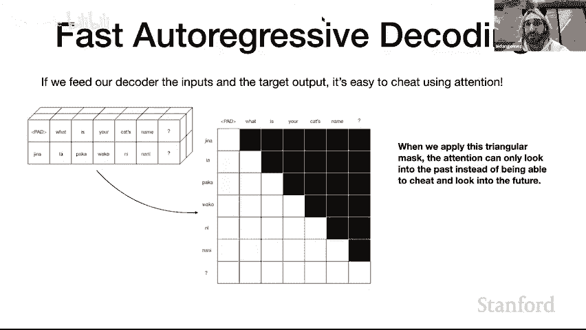

我们都很兴奋，所以我们同时解除静音。是的，太冷了。是的。这是我的部分，如果有任何问题我很乐意回答，否则。我们开始讨论 NP。NPptTs 就像我认为的那样。有一个很好的下一个层次的架构抽象。所以你可能看到了，Transformers 被应用到新的领域的趋势。

首先是视觉、视频和音频。但这就像回到一个更抽象的层面。我认为表格数据，嗯，我不知道，我会让 Yna 和 Ne 从这里接手，但我认为 MPT 是一个非常棒的项目。感谢 A 的介绍，感谢所有人的邀请，我们非常高兴能在这里，Neil 和我现在将告诉你关于我们数据点间自注意力论文的内容，我们引入非参数变压器架构，我们将从一些动机开始，解释架构细节，展示实验，这基本上是对论文的逐步解读，但可能会在这里和那里提供一些额外的见解。

好的，正如承诺的那样，动机和简要总结。所以我们将开始思考一些我们不常考虑的事情，那就是从封 seal 到变压器，大多数监督深度学习依赖于参数预测。这意味着我们有一些自我训练数据，我们想要学习从输入 X 预测结果 y，为此我们设置一些带有可调参数 theta 的模型。

那么我们优化这些参数以最大化训练集上的预测似然，或者说我们等价于最小化某些损失。然后在训练后，我们得到了这组优化的参数 theta，然后在测试时我们只需将这些参数放入模型中，并用这些参数对新测试数据进行预测。因此，关键是，我们在测试时的预测仅依赖于这些参数。

对，参数化。这也意味着，给定这些参数，预测完全独立于训练数据，那么我们为什么要进行参数预测呢？

这非常方便，因为我们从训练数据中学到的所有内容都可以在参数中总结，因此在预测时我们只需要这些最终参数，而不需要存储可能非常庞大的训练数据。另一方面。

我们通常有模型可以并行预测一堆数据，想想小批量处理和现代架构，实际上像批量处理这样的东西已经使这些数据相互作用。因此我们在这里的想法是，如果我们反正有所有这些并行数据。

没有理由不利用它，因此我们挑战卡尔梅里克预测作为深度学习中的主导范式，我们希望在进行预测时给予模型使用训练数据的额外灵活性。

更具体一点。😊 我们引入了非参数变压器架构。这将成为一个通用的深度学习架构，意味着我们可以应用于多种场景。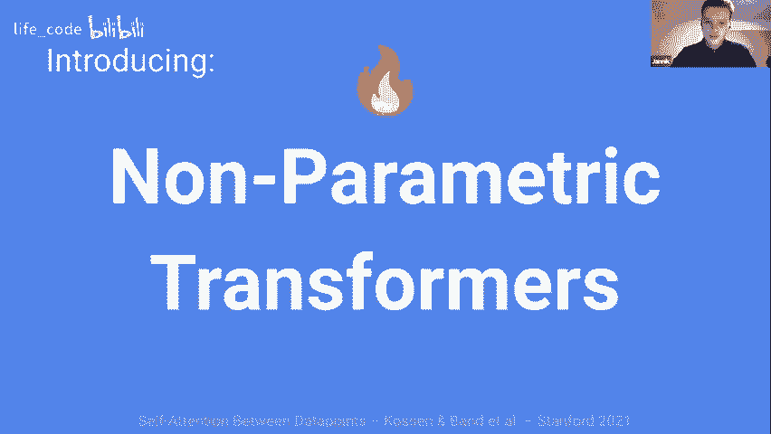

NPTs 将尽可能将整个数据集作为输入。然后，NPTs 关键地学习从数据点之间的交互中进行预测。为了实现这一点，我们使用多头自注意力。这正如 Age 向我们介绍的，已经真正确立为一种通用推理层。

我们还借鉴了自然语言处理社区的另一项内容，使用随机掩码机制，告诉实体样本在哪里进行预测，并且也对其学习任务进行正则化。去年，当然，我们希望能够证明最终效果很好。

这个简单的想法，学习从输入的其他数据点进行预测，实际上工作得很好。因此，非常简要地总结我们已经听到的内容，A，我们输入 NPptTCide 数据集。然后 B，假设为了这个幻灯片的目的。

我们只关心在那一绿色行中预测橙色问号。然后，我们可以将实体点与参数预测进行比较，经典的深度学习模型将仅从该单个网格输入的特征中预测这个目标值，为此它将使用参数θ。

这些将依赖于我们所看到的任何训练数据等，但在测试时我们只关注那一行，我们关心的预测。😊。相比之下，NPpts 明确预测输入中所有样本的依赖关系，它们可以超越那单个绿色感兴趣的数据，查看所有其他样本并考虑它们的值进行预测，因此这呈现出一种完全不同的方式来思考我们如何学习预测机制，有人在推特上称之为 Canan 2。

0，这在论文中没有写，但也许是思考 NPTs 如何学习预测的一个不错的方法。😊！

所以，当然，无参数模型已经存在，我们并没有发明它们。

我在这里将它们定义为对训练数据的显式依赖预测，这无疑是 MPptTs 所做的。经典的例子如高斯过程、邻域方法、核方法，这些可能对你来说是熟悉的。😊。也有努力将无参数和表示学习的好处结合起来，类似于我们在实体中所做的。

😊，然而，这些方法在某种意义上通常受到限制，与机会相比，它们往往更多地受到统计学界的驱动，通常需要更精确的近似推断方案，限制了它们可以学习的交互或类似的事情。

😊，我们真的认为 NPTs 很出色。也许是这些非参数预测方法中最通用和应用最广泛的，但这正是我们明确想要的，我们希望有一种真正易于使用的方式，适用于许多场景，并且效果很好。

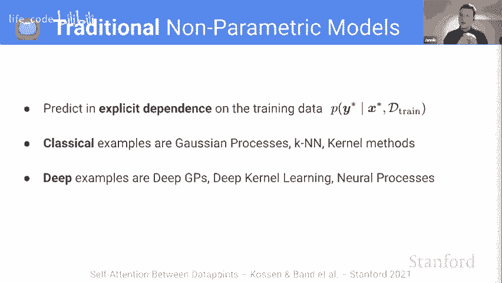

所以在这一点上，我会把话转给 Neil，他将告诉你有关非参数变换器架构的所有细节。你还有一个问题，嗨，Jen，您能否回到上一张幻灯片？

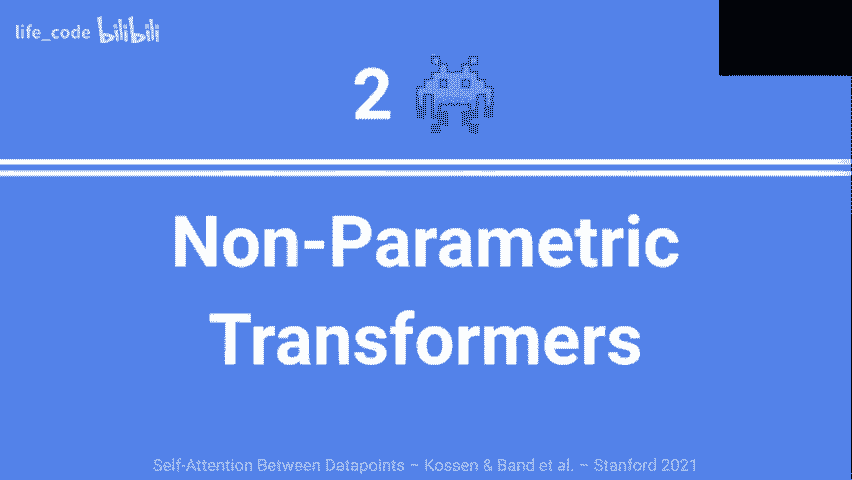

之前的幻灯片。是的，没错。这一幻灯片。是的。在问题定义方面，我认为这与某些元学习问题相似，基本上是学习从数据点和数据集到某些预测的映射。那么，请问您能指出您问题设置与元学习问题设置之间的任何区别吗？

我实在是无法找出这两个问题之间的任何区别。嗯，我认为这真的取决于您想要的框架，所以我会说元学习是当我试图在多个数据集上进行预测时。因此，当我试图学习某种预测模型，或者我可以插入不同的数据集时，它会几乎自动地为我提供在这种不同数据分布上的新预测。但这根本不是我们所做的，对吧？我们是在为固定数据集训练单个模型。

所以这就是为什么我不想称其为元学习，因为我们正在做的事情是，我们试图在所有监督深度学习或任何监督机器学习方法试图准确预测的相同任务上进行预测。前提是你使用相同的测试集来测试你的趋势模型，对吧？我的意思是，呃。所以。基本上在 MI 学习中，我们将在不同的元测试集上进行测试。

但是在您的情况下，您只想使用一个与您的训练集分布相似的测试集，对吧？

是的，绝对如此，我们稍微探讨了一下数据集分布的变化。我认为这是一个非常有趣的场景，而元学习不同的数据集也是一个有趣的场景，对吧？当你有这个模型时，可以输入不同的数据集，但就本文的范围而言，训练集和测试集来自同一分布，我们只是试图在标准设置中进行监督学习，这真是太酷了，谢谢。

😊，感谢您的提问。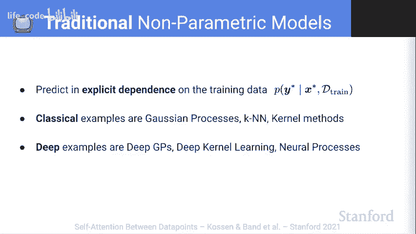

是的，我想我可以补充几点。我理解的元学习问题定义的目标更倾向于能够在新数据上表现良好，并且在该数据集上只需少量额外的梯度步骤。所以，我认为有一些有趣的方式可以在元学习的设置中考虑应用 NPTs，我们稍后会更深入探讨这个问题。例如，假设我们已经在许多不同的数据集上进行训练，现在添加一个新数据集，我们可以进行一些类似于零样本元学习的操作，基本上不需要额外的梯度步骤，因为我们基本上是以类似于现在 NLP 文献中的提示方式进行预测。

无论如何，是的，我认为我们会更详细地讨论这个问题。我想补充的是，我并不认为每种元学习算法都是基于优化的，像你现在描述的那些算法也是黑箱型的，不需要进一步的细化。我认为主要的区别似乎在于单任务与多任务的元学习。

是的，我也这样认为，主要的问题是是否有多个数据集。很好。好的，太好了。如果没有其他问题，我将更深入地探讨架构。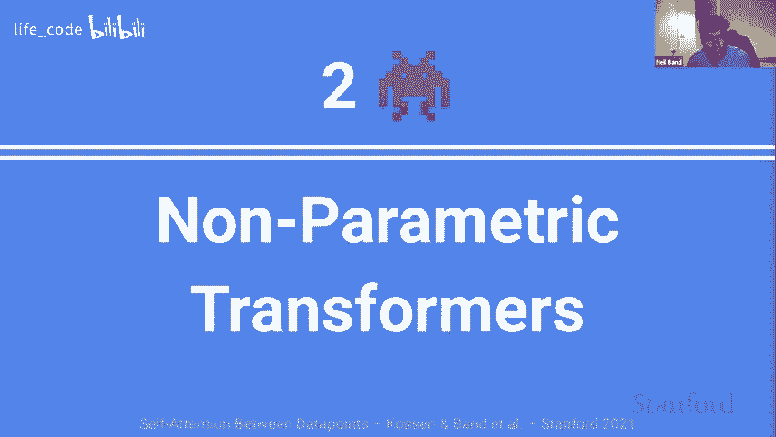

太棒了，NPpts 有三个关键组成部分。我将首先从高层次陈述它们，然后我们将更详细地讨论每个部分。因此，首先，我们取整个数据集。所有数据点作为输入。例如，在测试时，模型将同时使用训练数据和测试数据作为输入。

我们通过小批量来近似处理大数据。😊。我们在数据点之间应用自注意力，例如，在测试时，我们建模训练点、测试点之间以及两组之间的关系。最后，我们有一个基于掩蔽的训练目标。

这是一种类似随机掩蔽的烧录，关键点在于我们实际上在特征和训练目标上都使用它，稍后我们会讨论为什么这导致了一种有趣的预测机制。好的。那么首先从数据集作为输入的这个想法开始。

组成 NPT 输入的有两个部分，一个是以矩阵 X 形式的完整数据集，另一个是掩蔽矩阵 M。因此，Yick 对这个数据集矩阵进行了稍微描述，我们基本上有数据点作为行，列是属性，每个属性在所有数据点之间共享某种语义意义。例如，如果你正在进行单目标分类或回归，最后一列将是目标，其余的矩阵将是输入特征，例如图像的像素。

我们还有一个掩码矩阵，所以假设你知道我们在考虑大规模语言建模，大规模的标记会告诉我们在哪里隐藏单词，以及我们在哪里反向传播损失，我们在这里做类似的事情，我们使用这个二进制掩码矩阵来指定哪些条目是被掩盖的。

目标是从观察值中预测掩码值。我看到有一个关于处理不同长度输入的问题。在我们考虑的数据集中，我们将在结果部分讨论这一点，但大多数数据集基本上都是表格数据和图像数据，其中每个数据点的长度是相同的。

但它的工作方式就像填充，这将是一个合理的方法，并且还有一些有趣的，嗯，继续。对此我不确定“长度”是指列还是行，实际上我们不关心行的数量，长度填充之类的会是一个选择。是的，我的问题正是关于列的，所以这有道理，我想。

是的，我是说，这与整个元学习讨论有关，我认为如果我们想适应每个数据集具有不同数量数据点的数据集，你知道，我们可以利用自注意力在这方面的优势。酷。

所以继续下去，接下来讨论的是我们如何进行嵌入，更明确地说，我们有这个数据矩阵，它有 n 个数据点，称为 X，所有数据点都有 D 个属性，我们有二进制掩码矩阵 M，我们将它们堆叠在一起，然后进行线性嵌入，具体来说，我们对每个数据点独立地进行相同的线性嵌入，我们为每个属性学习不同的嵌入。

我们对属性的索引进行了位置编码，因为我们并不真的关心在列上是均匀的。如果是表格数据，你当然想要以不同的方式对待所有这些异构列，最后我们对列的类型进行了编码，因此无论是连续的还是分类的。

这最终给我们带来了这个输入数据集的表示，维度为 n x D x E。NPpts 的第二个关键组成部分是数据点之间的张力。为了实现这一点，我们首先将我们拥有的表示展平为 n x d x e 的表示。所以基本上，我们将这些 d x e 大小的行视为令牌表示。

我们实际上要用多重自注意力来完成这个操作，你知道我们已经多次审查了这个。但好的一点是，我们知道在语言建模中，我们可以多次堆叠它，建模这些数据点之间的高阶依赖关系，这实际上是该架构的关键优点。还有其他实例使用注意力来处理类似的事情，例如注意神经过程，很多时候他们只使用单层作为表示查找，我们认为这实际上限制了表达能力，通过多次堆叠，你可以学习数据点之间更复杂的关系。

有很多问题。那么你可以先问。哦，太好了，谢谢，我有一个问题，比如你们如何进行嵌入，是否总是像卷积滤波器或线性层这样的属性，或者你们使用的嵌入类型是什么？是的，我尝试回到幻灯片，我认为对线性现在不是很满意，但对于 Tular 数据，我们实际上只用了线性嵌入。

你知道，我们可以深入讨论类别和连续特征化的细节，但实际上，对于类别特征，你会进行独热编码，然后学习与该属性特定的嵌入；而对于数值特征，我相信我们只是进行了标准化，对于图像数据我们最终使用了。

一个用于 C4 10 的 Resnet 18 编码器。然而，我认为我们会在结果中稍后讨论这一点，但这个嵌入有点任意。你可以做任何事情，架构的关键部分是数据点之间的注意力。所以在你实际想要嵌入每个属性时，这取决于你。谢谢。

我认为另一个问题，和 Victor Tos 的问题一样。太棒了。这里我们完成了数据点之间的注意力。那么我们也可以在属性之间进行这种注意力。我们将其重塑为 N 乘 D 乘 E 的表示，然后我们可以独立地对每一行应用自注意力，换句话说，对单个数据点进行自注意力。我们这样进行嵌套的原因是，我们试图为数据点之间的交互学习更好的每个数据点表示，这实际上只是普通的自注意力。

正如你在语言建模或图像分类中看到的，属性在这里是令牌。最后，我们只需挖掘并重复。所以我们究竟从中得到什么，总结一下，我们在学习数据点之间的高阶关系？

我们正在学习单个数据点的变换。重要的是，NPT 对数据点的排列是等变的。这基本上反映了一个直觉：数据点之间学习到的关系不应该依赖于你接收它们的顺序或观察数据集的顺序。NPptTs 的第三个关键组成部分是基于掩码的字符串目标。

所以回想一下，我们的目标是从观察到的条目中预测缺失的条目，而这些缺失的值可以是特征或目标。因此，经典的应用，比如掩码语言建模，就是对一系列标记进行自监督学习，你可以认为在我们的设定中，它与特征略有不同，因为我们使用随机特征掩码以某个概率掩盖特征值，然后我们还使用这个概率对训练目标进行掩码。如果我们写出训练目标。

我们仅仅是对目标和特征的负对数似然损失进行加权求和。当然，在测试时，我们只会对测试点的目标进行掩码和计算损失。为了进一步分解这一点并指出一些有趣的部分，现在右侧突出显示的就是与特征相关的术语。

这就是特征掩码，基本上我们发现这有一个良好的正则化效果，模型现在可以在任何地方进行预测，使得任务变得稍微困难一些，并引入更多的监督。在对表格数据集进行消融实验时，我们发现这对八个数据集的效果都很好。

然后还有另一个有趣的术语，这就是随机目标掩码，想法是：在训练时，某些训练目标实际上不会被模型掩盖。这意味着 NPptT 可以利用其他训练数据点的目标以及所有训练特征来预测某些训练数据点的掩码目标。因此，这意味着你实际上不需要在参数中记忆训练输入和输出之间的映射。

你可以将模型的表示能力用于学习使用其他训练特征和目标作为输入的函数。因此，这有点涉及到类似学习 K 和 N 的想法。显然，我们可以从中学习更复杂的关系查找等内容。但你可以想象一个这样的案例：我们有一堆测试数据点进入。

我们将查看它们的特征，并利用这些特征将其分配到训练数据点的聚类中，然后我们对这些点的预测仅仅是相应聚类中训练目标的插值，这就像是这个机制让 NPptTs 学习的一个例子。

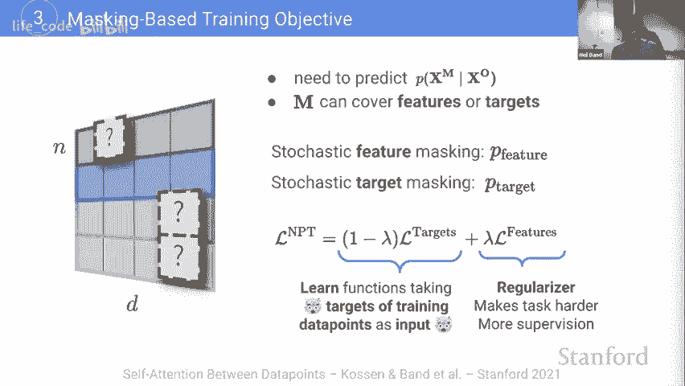

好的，如果有任何问题，我们现在可以提问。否则，我很乐意在讨论中或者其他时候回答。好的。那么，让我们讨论一下，当你使用整个数据集时，这是否限制了你能使用的数据集类型，因为数据量的大小？是的，在实践中。

我们进行随机小批量处理作为一种近似，所以这个想法是，如果你有一个相对较大的小批量，你会从中受益，因为如果类别数量合理，你可能会基于特征和目标学到一些有趣的映射。在实践中我们发现，确实能够利用数据点之间的关系进行预测，对于我们进行小批量处理的数据集，我们也并没有发现需要非常大的批量大小才能做到这一点，但我认为这是一个普遍且重要的观点，这也指引我们去研究稀疏变换器文献，以尝试在不假设小批量处理的情况下扩展到一些更大的数据集。

很好，谢谢。如果我可以加一句，我们在没有小批量处理的情况下，可以容纳大约 8000 个点的数据集。所以这已经占据了相当一部分我认为的表格数据集，但我们也处理了 1100 万个点的数据集，显然我们那时就需要 resort 到小批量处理，所以了解我们讨论的数据集大小是非常重要的。

我对此很感兴趣，我觉得这很令人兴奋，我感觉你通常不会听到变换器被应用于小于 8000 的子集。U。我很好奇，我们可以在覆盖其他材料后再讨论一下，如果你发现样本效率是这里的关键收益之一，或者只是一般在小数据上工作的变换器的经验。不过，我很乐意将这个问题的答案留到后面。😊，是的，我想这会很不错。

这真的很不错，可以聊一聊。而且一般来说，我想我会说，NPT 在小数据集上是多么稳健，令我们惊讶的是我们并没有需要调整很多参数。但我们可以稍后深入细节。😊，太棒了。那么，让我们开始实验。我们非常关注表格数据，因为这是一个非常通用的设置。

这在深度学习中也是众所周知的挑战。因此我们知道，基于树的提升方法，如 XGBoost 非常占主导地位，这也是一个与行业相关的领域。所以我们对在这一点上做得更好感到兴奋。

所以我们选择了广泛的数据集，涵盖几个不同的维度。你知道的，正如我们提到的，从数百到数千万个实例，特征数量的广泛范围，特征组成在类别或连续性方面，涉及各种类型的任务。

二分类和多分类以及回归。正如我所说，基线是针对表格数据的常见方法，XGBoost、CatBoost、GBM 到 MLP 和 Tnet，这是一种针对表格数据的变换器架构。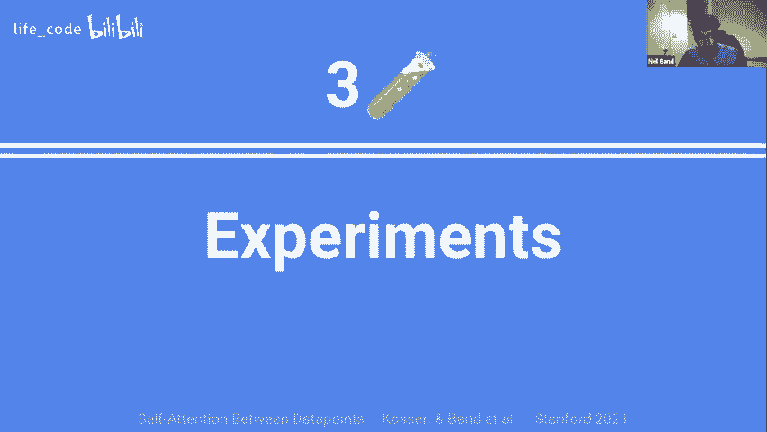

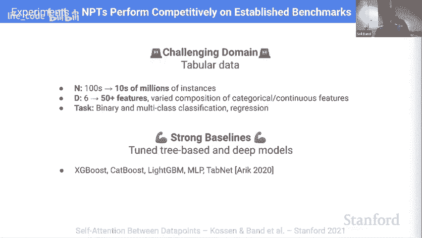

所以为了得到这里的结果，我展示了我们在各种子任务中表现良好的平均排名，针对像 CatBoost 和 XGBoost 这样的专为表格数据设计的方法，事实上我们发现 NPT 在这十个数据集中四个是表现最好的，在我提到的图像数据上，我们使用了 CNN 编码器，因此我们在 C410 上表现良好。

我们也认为，通常来说，假设说，在小数据上的图像变换器的新工作，这可能仅仅通过线性拼接完成。所以，这种嵌入的方式可能不是关键。尼尔。如果我可以插入两个问题。你能先返回两张幻灯片吗？

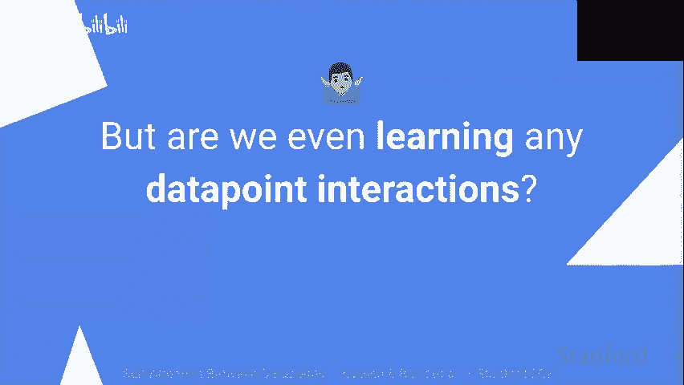

有一点小问题，请再退回一张。谢谢。在这里，特征是 50 以上。这里的 plus 意味着什么？我得再确认一下确切的数字，我很确定它大约在 50 左右。我猜是这样的，所以这个 50 其实是个大概的数量，不是说 150 或 5000。是的，没错。我会为你再确认一下，或者你可以在论文末尾的元数据统计中查看。

但不是的，它并不是说，随便有多大，我会这么说。你知道的。我们进行了一些实验，看看是否真的需要属性之间的注意力。我们发现这确实对我们有帮助，但你也可以说，单纯在那个维度上使用一种 MLP 嵌入，并选择一个相对较小的隐藏维度，适应任意数量的特征。

所以我认为，是的，如果你放松属性之间的注意力需求，你可能会在至少那个维度上扩展很多。好的，然后我的第二个问题。如果你能往前推进一张幻灯片。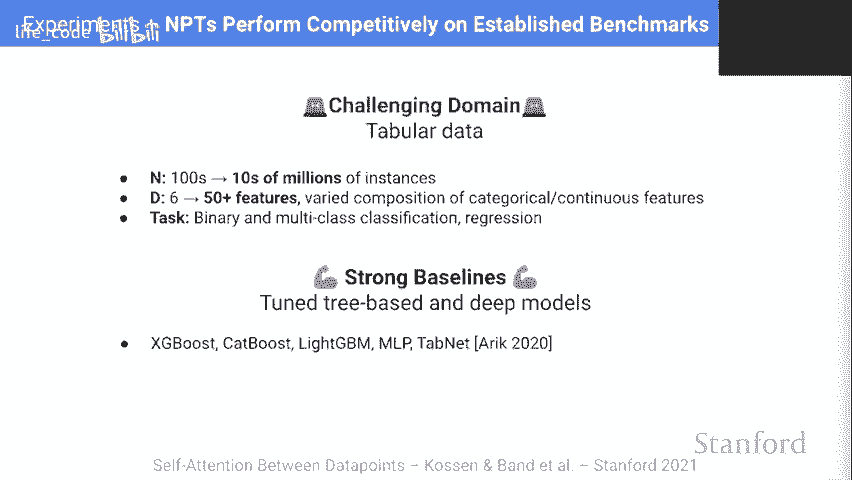

谢谢你，我不太明白。四个数据集中的十个，十个数据集中的两个，四个数据集是什么意思？这是关于我们所拥有的所有表格数据集。所以哦，我想二分类是针对的，我明白了，好的。是的，正是如此。还有其他问题吗？这里的标准误差，因为我想，只有十个数据集。

对。是的，正确。共有 1010 个表格数据集。是的，但这些是排名好的。是的，这些是排名表现，正确，好的，我只是想知道。在这种情况下，不确定性来源于哪里？是的。对四个数据集的平均排名，所以对于每个特定数据集，我们有所有不同方法的排名，然后我们取平均值，以及每种任务类型在二元分类和多类中的排名差异。

等等。很好。如果你感兴趣的话，我们在论文中也有完整的结果。是的，谢谢。我们还有几个问题。嘿，是的，谢谢。我想我只是发现 KNN 是最差表现者有点惊讶，因为它也是非参数的。你能对此做一下评论吗？是的，是不是 NPT 有某种内在特性使其远超其他非参数方法？

为什么 KNN 在这里表现最差？嗯，我想最终 KNN 仍然是一个相对天真的预测方法，因为你知道它可能只是基于某种聚类均值进行预测。例如，我认为这对所有数据集来说可能都是普遍真实的，但在特征上可能需要进行某种额外的推理，至少达到基本水平。

其中一个数据集是扑克手数据集，它是所有不同扑克手与人们常知道的，例如葫芦之间的映射。因此，这需要对特征进行一些推理，以便能够将事物组合在一起。

所以，仅仅取这些不同手的特征化聚类均值可能不会给你一个好的预测函数。而 NPT 可以做到经典的事情，比如说在特征上有一个 MLP 类型的东西，或者说在特征上有一个树类型的东西。

你可以学习某种复杂的嵌入，但你也可以基于嵌入的聚类进行某种非参数预测。我是说，是的，这有道理。如果你使用什么呢？

从一堆编码器中预训练的嵌入作为你的向量表示用于经典。你觉得这与其他方法相比表现如何？是的，这就像，我的意思是。这种想法有点像深核学习，或者说，是的。我相信深核学习基本上是你独立使用一个多层感知机（MLP）。

所以你在每个输入数据点上学习一个 MLP，然后你对所有这些表示应用一个 G。你得到了这种复杂的嵌入，然后进行查找。该想法与 Ns 之间的关键区别在于，我们还学习数据点之间的关系，因为我们使用这种参数化的注意机制来学习这些关系。

所以我们并不是仅仅独立地学习一个嵌入。我们基本上是通过整个过程进行反向传播，学习我们试图嵌入的方式，以及查找的方式，本质上是潜在的高阶关系。很酷，更多的后续问题。😊，哦，是的，继续吧，酷，好的，谢谢。我想如果 NPT 的优势与数据点之间的关系有关。

那么，如果你知道获取了编码器的表示，然后将其作为输入传递给 10 个最近邻，并且还有一些其他的输入表示，进行加权平均，比如注意力机制的那种方式，依据输入数据点与提供的输入数据点之间的注意力权重对最近邻的向量进行加权，然后将其传递给最终的预测层，你觉得怎么样？

你认为这是否捕捉到了一定程度的关系，还是偏离了？

我认为不错的一点，以及我们对这一切的想法是，某些固定核在特定任务中表现特别好的情况是一种恼人的事情。最终，调优这些类型的东西或试图推导出适合特定情况的预测方法，确实令人沮丧。理想情况下，你会希望能够在数据上进行反向传播，自己学习这些关系。

我其实非常想看看我们是否能够设计一些合成实验，具有这些非常特定的 K 和 N，像预测机制，并看看我们是否能够精确学习这些，并获得零误差与 NPpts。事实上，我们将稍微涉及一些我们所做的干预实验。我们有一些精确的查找函数，NPpts 最终能够学习到这些。

所以我们可以学习有趣的关系函数。😊，酷，没错，非常感谢，太好了。好的。我们还有一个问题来自于。

我只是想澄清一下，基本上在测试时你只是取相同的数据集，然后添加你的测试示例，对吗？然后你也做相同类型的掩蔽，是这样吗？

是的，没错。好的，我明白了。我还有一个问题，就是因为我觉得我误解了你们的 NPT 目标的影响。你介意回到那张幻灯片吗？当然可以。你能再重复一次，是什么让这个如此特别的吗？

是的，所以在特征右侧的正则化器，我会将其视为非常类似于自监督学习，使用标准的 transformer，基本上就是引入更多的监督，即使你只是进行一个监督目标，这在某种程度上就像是对你学习到的特征进行重构，你会学习到更有趣的表示，以及正则化效果。

我们认为这是有趣的，但也许没有这种随机目标掩蔽那么有趣。这种方法是独特的，因为在标准的参数化深度学习中，你的训练过程中不会有将目标作为输入的实例。因此，基本上发生的是，如果你的训练数据集作为输入。

无论如何，你会在训练目标的特征上进行一些随机特征掩蔽操作。你会随机选择一些不被掩蔽，而有些则会被掩蔽。当然，对于被掩蔽的部分，你会反向传播损失，因为你不希望你的模型在实际尝试反向传播损失时能获得这些可用的输入。

但你可以使用其他作为输入，这意味着你可以学习这些像插值函数一样的东西。这就是能够学习 K 和 N 的整个想法。但这难道不允许模型再次作弊吗？是的。这是一个有趣的观点，其实很微妙，所以我认为提出这个问题是非常值得的，首先。

我们从未在模型输入可见的内容上反向传播损失，因此如果。例如，模型确实最终在训练标签上过拟合，我们将不会观察到模型在测试数据上的泛化能力，我们并未观察到这一点，因此显然，这种对在 NPT 输入时可见标签的反向传播阻断是有帮助的。

也有可能在鸟式随机掩蔽中，你也会随机将一些标签翻转为不同的类别。这就像是在鸟掩蔽文本中引入的一种随机细则。我们也这样做。因此，这可能在某种程度上有助于这个。

但这很可能只是因为我们没有在可见的内容上反向传播损失。太好了，谢谢，明白了。😊，如果可以的话，我还有两个问题，能插嘴吗？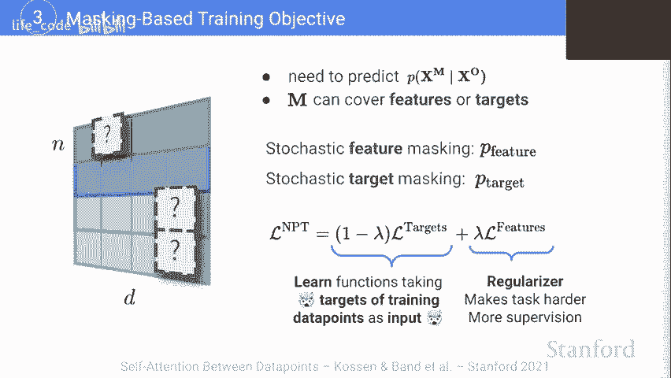

是的，抱歉。我们可以去查看度量指标、性能、结果的幻灯片吗？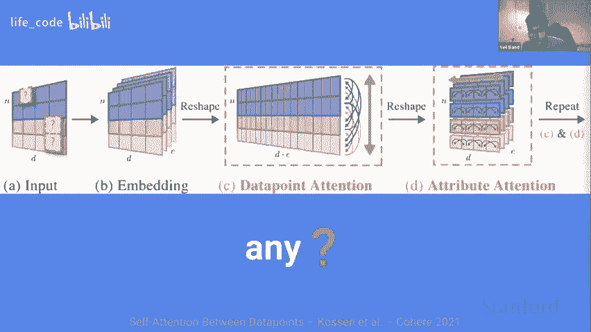

当然！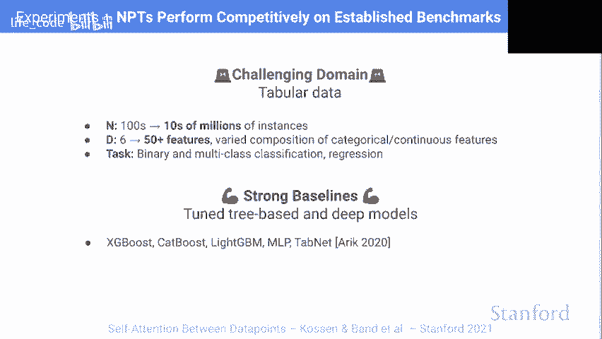

我感觉我错过了一些东西。我对此感到抱歉。所以 A U 是。关于二元分类，A U R O C。你能解释一下这些数字的含义吗？它们是 A U ROC 吗？这是关于每个数据集的。那么以一个特定的二元分类数据集为例。

我们将对这些方法进行排名，我们会重复这个过程。所以这些数字在这个特定情况下是四个数据集的相对排名。对，没错，我明白了。所以这些值不是数据集上的 A U R O C 平均值。不是，没错，它们不是。我是说，像所有事情一样，平均可能是有意义的。

但是平均准确率和 RMC 似乎是个坏主意，对吧，因为你可能有一些数据集的准确率都很高，或者 RMC 需要一些完全不同的东西。我明白了，所以这些数字只告诉我们不同方法之间的相对排名，而不是它们实际表现得多好。

我的意思是，它告诉我们它们相对彼此的表现，但并不告诉我们它们表现得多好。我明白了。不过，这不在附录中，我们没有这些信息。我明白了，好的，我一直在这里困惑，为什么 A U R O C 最好的一个是最小的，而准确率，准确率是多少呢？总之，好的。

这让我更能理解。谢谢你们俩。太棒了。😊 好的。所以为了节省时间，我会尽量加快速度。但基本上，你可能会在看完所有这些结果后想，难道我们真的在这些真实数据集上学习到任何数据点的交互吗？因此，我们设计了一个实验来弄清楚这一点。

这个想法是我们要禁止 NPT 在对某一个数据点进行预测时使用其他数据点。😊。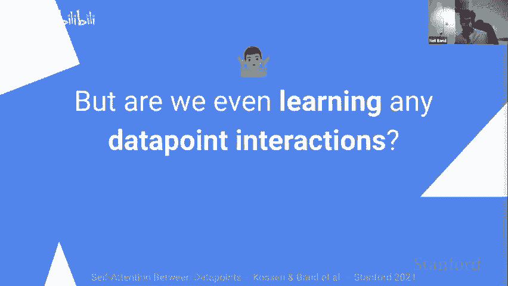

如果我们这样做，并且观察到 NPT 实际上预测或表现显著更差，确实是在利用数据点之间的交互。从中我们可以获得一个微妙的挑战或一种附加的好处，那就是理想情况下，我们实际上不应该破坏批量统计数据。比如说每个特定属性的均值。

如果我们能找到一种方式来进行这个实验而不破坏这些东西，我们可以排除学习到一些与 bash norm 有点相似的东西的可能性。因此，我们的做法是基本上依次查看每个数据点的预测。所以假设在这种情况下，我们正在查看模型对这一特定绿色行的预测，而它会在这个最后一列有一个问号进行预测，我们将独立地对除了这一行以外的所有其他数据点的每个属性进行排列，所以这一行的信息如果它只是像经典参数深度模型那样进行预测依然保持完整，但其他行的信息则消失了，所以这就是我们称之为“干扰实验”的原因。

因此，我们发现，一般来说，当我们进行这个实验时，表现会在大多数方法中急剧下降，我要指出的是，这些方法之间的表现差距相对较小，因此这实际上是相当重要的。例如，在蛋白质方面，我们从所有方法中表现最好的转变为最差，甚至比 KNN 还差。我还要指出，在这些数据集上，如 For、Kick 和乳腺癌，我们实际上观察到性能几乎没有下降，我们将其视为一种有趣的特征，而不一定是模型的缺陷，模型可以发现尝试使用某种关系预测机制来预测数据点并不太值得，反而可以选择学习参数化预测，基本上在预测任一数据点时忽略其他数据点。

所以这可能引发一些有趣的想法，也许你可以进行后期剪枝之类的，消除数据点之间的紧张关系，进行微调。好吧，现在我把时间交给 Y，让他谈谈学习一些有趣的关系。是的，我看到我们接近时间的尽头。

但是我知道有个缓冲计划，或者说可以通过这个实验，我们可以更深入地讨论，大家更倾向于什么？

是的，我认为，通常我们会在这个时候停止录音，进行一个非正式的讨论。然后，我想问的是，大家目前有任何问题吗？

但我认为我们基本上是在根据问题的出现来进行提问，所以我个人觉得这样也不错，是的，考虑到这一点就算是个问题。是的，我想这听起来不错，你可以按计划继续进行，嗯，我们可以看看时间的事情。我认为这只会再花大约四五分钟，我应该可以继续，没问题。

好的。所以尼尔现在告诉我们实体在真实数据中的表现，以及它们确实利用了输入其他样本的信息。但我们现在要更进一步，提出一些玩具实验来测试一下实体从其他角色中查找信息的能力，也就是它们学习这种非参数预测机制的程度。

所以具体来说，我们将创建以下半合成数据集。因此，我希望你现在关注 A。是的，我们取用之前使用的一个表格数据集，特别是蛋白质数据集。但其实并不重要，重要的是这是一个回归数据集，所以现在我们做的是。这里的上半部分是原始数据集，但下半部分是原始数据集的副本，我们揭示了真实的目标值，这样 NPT 可以学习在数据点之间使用注意力，以实现任意好的性能。

它们可以学习在这些匹配的重复行中查找目标值，然后将它们粘贴回必须输出的目标值中，然后在测试时，我们当然输入一个新的测试数据，这个机制也是可行的，只是为了确保它没有学习去记忆任何东西，而是实际学会了这个正确的关系机制。

因此，我们看到确实 MP 成功学习到了执行这个查找的能力，所以我在这里可视化的是注意力图，它们非常清楚地显示出，当预测这个绿色行时，这个第一个绿色行，MP 们看到的正是这个其他绿色行。😊。

这真的很好，我们可以进一步观察到。😊。MPs 应该预测的和它们实际预测的之间的皮尔逊相关性，这个相关性是 99.9%。这比你通过参数预测所能达到的任何结果都要好，所以似乎 MP 在这里确实可以发现这个机制，我觉得“发现”这个词是恰当的，因为 MP 们可以如我们所见，继续以参数的方式独立地从每一行进行预测，这实际上向我们展示了模型有偏向于学习从其他行预测的倾向，当然在这种情况下也非常有吸引力，因为它允许你在这种情况下实现任意低的损失，或者尽可能地优化它。

😊，所以。我们认为这意味着我们的基于梯度的发现。非参数哲学似乎是有意义的。因此，我们可以通过进行某种干预实验进一步探索，调查 NPT 们是否实际上学习到这种半合成数据集背后所隐含的稳健因果机制的程度。😊，这仅仅是依赖于这个额外的测试数据列，已经很酷了。

但我认为我们可以更进一步，实际上研究一下它是否可以推广到训练集中看到的数据之外，或者来自这个特定分布之外的数据。因此，我们现在在测试时对单个重复数据点进行干预，通过改变它们的目标值。因此，我们现在只关注特定行的预测，我们在所有行中都这样做，但每次我们只关心一行。我们在这里改变目标值，我们希望看到的是，然后 NPT 也会调整预测。这是一个非常简单的干预实验，测试 NPT 是否真的学会了这一机制，在某种程度上也测试了鲁棒性，因为现在我们将目标值与不属于训练分布的特征相关联。

😊，因此我们看到，当我们调整这些值时，这是重复值，然后我们在这里看到目标值。随着调整，我们可以看到相关性保持得非常好，虽然平均值并不是 99.9%。现在是 99.6%，但仍然非常好。😊。

在这一点上，你可能对我稍感烦恼，因为你知道标准的非参数模型也可以解决这个任务，对吧？这实际上是一个我可以通过最近邻来解决的任务。没错，也许你知道，我需要稍微改变输入格式，因为这有点像批处理设置，我可以使用掩码，但一般来说，最近邻也会根据特征查找不同的输入点，最近邻并不是通过学习来实现这一点的。

我仍然觉得我们需要学习这一点很酷，因为这确实需要我们学习相当多的计算序列，比如根据特征匹配，查找目标并复制等等。但实际上，我们很容易将这个任务复杂化到一个程度，以至于基本上没有其他模型可以很容易地解决这个问题。因此，一个非常简单的方法就是给所有重复值加一。

😊，所以现在最近邻会查找正确的颜色和正确的行，当然。但它总是会预测错误的目标，结果加一，实际上，许多我们知道的模型并没有建模。😡。特征和目标的联合分布，他们建模的是给定输入特征的传统目标分布，因此他们也无法做到这一点。对我们来说，这根本不是问题，MP 只会学习再减去一个，也没问题。当然，这仍然是一个非常合成的环境，但我确实认为，我挑战你想出一些 MP 无法解决而其他模型能解决的问题。总的来说，这种掩码机制和方法的非度量性在一般情况下非常不错，并导致在各种设置中表现出许多良好行为。因此，我认为我们可以进入结论，尼尔将为您提供。

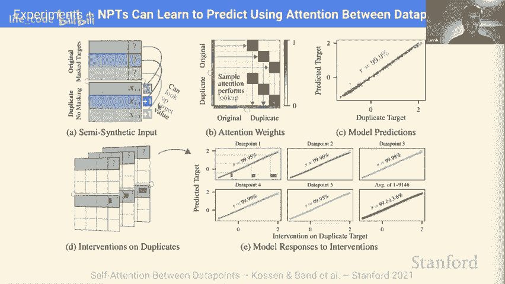

是的，我认为，我们可以剪掉这里的主要部分。我只是快进。看看他们。是的，是的，我想说，我认为你们都明白了，NPpts 取整个数据集作为输入，并使用自注意力机制建模数据点之间的复杂关系。

知道，他们在其数据类型以及我们呈现的图像数据的实验中表现良好，我们展示了一些干预实验，表明他们能够解决复杂的推理任务，论文中还有更多实验。我认为，有趣的未来工作类型是扩展这类事物。

所以我们可以，不使用这个小批量近似。而且还试图将其扩展到一些更有趣的应用领域。我们稍微讨论了一下元学习，但也可以是一些像少量样本的泛化、一般领域的适应、半监督学习等。😊，所以我认为如果还有更多问题。

也许我们可以进行更多讨论。是的，听起来不错。非常感谢演讲。我认为大家都度过了愉快的时光。我会问一些一般性的问题，然后我们可以在那之后与大家进行讨论。我注意到的一件事是，你说的这和*卡农*相似，我觉得这似乎与图神经网络相似，我可以把每个数据点看作一个节点，然后你可以把所有东西视为一个完全连接的图，并且你在这个图中学习某种注意力权重。

所以这就像是一个音符预测任务，你在这种图结构上进行的。对此有什么评论吗？这是否类似于图神经网络，还是有其他不同之处？

是的，这是一个非常好的观察，我认为在图神经网络方面有很多相似之处。如果我们要谈论差异，可能的差异在于我们假设一个完全连接的图，因此你也可以将其表述为我们正在发现关系结构，而图神经网络通常假设它是给定的，但这并不总是正确的，因此有很多相似之处。我不知道尼尔你是否想提到一些具体的内容，继续说吧，这真是个很好的观察，我们也确实感觉到这种情况，我们在更新版本中添加了一个与图神经网络相关的额外部分，这个版本很快就会在线上。

明白了，是的，我同意你所说的一切。我认为我们所关注的与图神经网络文献中最接近的工作是这篇神经关系推理论文，它使用消息传递神经网络试图学习可能存在或不存在的边，并帮助推断多粒子系统中粒子的位置或其他什么。

这对我们来说有点像类似的想法，你知道的。如果你没有这些边作为给定，注意机制会大致近似一些交互事物之间的有趣关系。我明白了，这真不错。另一件事是，你主要关注的是表格数据，但你是否也可以使用其他模态，比如如果你想处理语言或其他东西。

你还能使用非参数变换器吗？是的，我认为我们做表格数据的部分动机是因为我们觉得表格数据在某种意义上是语言数据的一种推广。例如，我想。这些其他概念像填充，最终你可以把它看作一堆类别属性，所以它确实可以推广到像句子这样的东西上，我们也处理图像。所以我认为其实我总是在思考小数据或大数据对我们来说哪个更有趣。所以我认为小数据真的很有趣，因为我们不能将整个数据集放入其中，而这一切都可以毫不费力地运作，但大数据实际上也很有趣，因为。

当然，你可能需要引入一些应用机制或查找机制，因为你不能总是将整个数据集加载进来，但与此同时，你非常明确地在权衡用于查找的计算与用于存储的计算，比如 GPT 中有多少参数用于存储数据，对吧，这些模型中发生了大量的记忆化，我们对此是知道的，因此也许我们可以更有效地利用参数来学习查找类型的行为，这更接近于你知道的神经动力学或其他什么，所以我认为这些都是非常令人兴奋的。

问题是的，我也期待未来的作品，因为这似乎是处理一-shot 学习情境的很好方法，所以真的很有趣看到这一点。好的，我将停止录音，我们可以进行其他问题。

