# 斯坦福 GPT/Transformer 原理介绍（中英文双字幕）- P16：16. 常识推理 - life_code - BV1X84y1Q7wV

好的，我非常兴奋能够在这里分享我们关于神经符号常识推理的最新研究。所以这次演讲的部分目标是解决一些当今常被问到的问题，即 NLP 或常识等似乎已被 ChegPT 解决，而我有一种生存危机，所以人们确实时不时会问我这个问题，或许这是一种草率概括。

特别是如果我们看一些例子，奖杯不适合放进棕色的手提箱，因为它太大。那么什么太大呢？这就是经典的 Wininograd 模式挑战问题，这里 ChegPT 正确回答了奖杯太大了，因此令人印象深刻。但如果你稍微改变一下问题，它会说奖杯本身太小，无法放入手提箱，因此目前它并不是非常可靠。

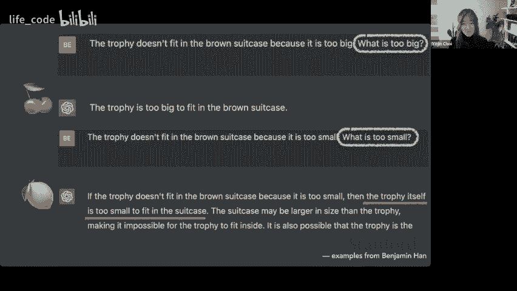

所以这种情况有点像大卫和歌利亚，因为在许多情况下，bugar 似乎更好。虽然当然，一些更仔细的研究确实表明，较小的模型在更好的数据或更好的强化学习以及人类反馈等方面可能更好。

因此，很可能还有其他方法可以通过更巧妙地构建较小的模型来提高 Transformer 的性能。得到的一个洞察是来自于这本经典书籍《战争的艺术》。当然，它并没有提到深度神经网络或 Transformer，但这里的智慧是要了解你的敌人，改善你的武器。

我们可以将其翻译为。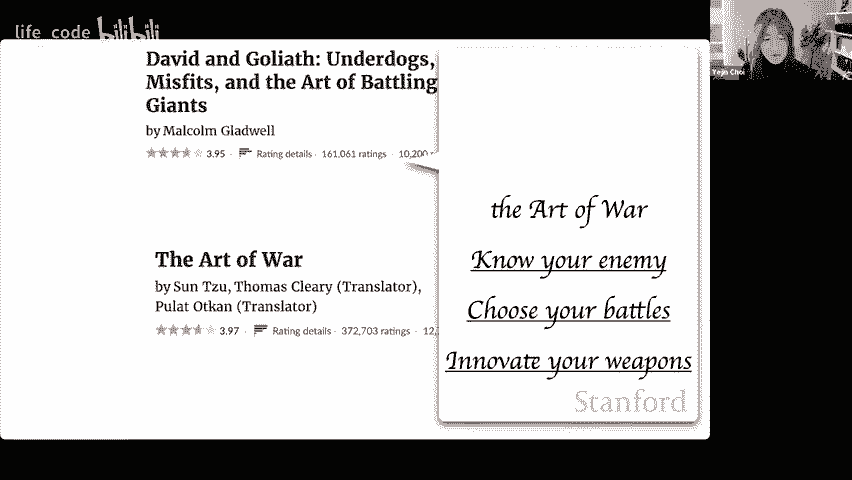

用现实和审视来评估，专注于不同类型的新任务和排行榜，然后创新你的算法和数据。因此，在这次演讲中，我将展示三项这样的研究，让我们直接进入 myic 提示。顺便说一下，这次演讲的主题是较小的模型可以更好，而知识就是力量。

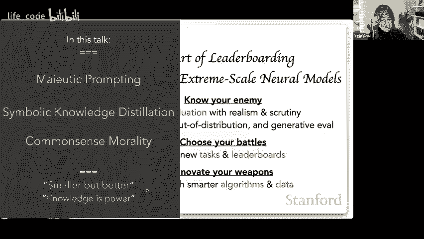

让我们从这个观察开始：语言模型有时是惊人的。所以如果你问 G3，如果你向西旅行足够远，从西海岸出发，你会到达东海岸吗？它会说世界是圆的，这一点是正确的，所以你最终会到达东海岸，因此答案是正确的。这看起来很令人印象深刻，但在不令人印象深刻的时候又如何呢？所以如果你问其他问题，比如蝴蝶是否用三只翅膀飞，它会说它有四只翅膀。

因此，该陈述是错误的，但如果你回顾它刚才所说的作为真和假问题，那么它否定了它刚才所说的内容，所以它可能与自己的陈述不一致，还有许多其他这样的不一致问题，因此不清楚语言模型知道什么或不知道什么，几乎就像语言模型是一种柠檬。

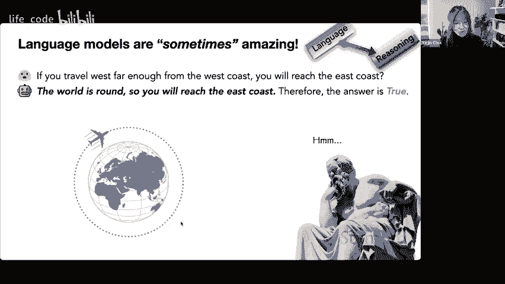

好吧，如果你只挑选樱桃，它可能是樱桃。但它并不会犯奇怪的错误，所以问题是我们如何从 GPT3 中提炼更好的柠檬水，因此一个方法可能是从哲学上考虑，使用苏格拉底的迷宫法，这最初是为处理人类的法律推理而开发的，因为实际上，即使是人类也并非完全逻辑一致。

更不用说 GPT3 了。它的工作方式是这样的，我们将构建迷宫推理树，让我们用之前的例子作为一个运行示例。因此，我们所做的就是问以下问题，假设答案是真的，然后附加因为。

所以我们促使 GT3 继续这个句子，这意味着它现在必须解释，提供答案为什么是真的。在这种情况下，解释很好。因此，我们得到答案为 T 的 E 的 T 的解释。我们问同样的问题，交换不是真的和假的，然后看看 BS GP3 可能会得出什么。

所以这里只是试图以错误作为答案，但它并没有给出一个很好的答案，就像你无法达到的那样。因此我们称之为 E 的 F。这是对答案为 F 的 F 的解释。现在让我们看看 GT3 在其自身解释方面的稳健性或一致性。

所以我们回顾 E 的 T，然后让 GPT3 决定它是否同意或不同意标签为真或假，因此在这种情况下，最后一个是 E 的 T 的否定版本，因此我们在这里插入否定词，在这种情况下，当陈述被否定时，这是个好结果。

所以这是一个案例，当 GPT3 在逻辑上是 E 的 T 的组成部分。对于 E 的 Fodo，这基本上是错误答案的虚假解释。它无法翻转自己的标签，这意味着 GPT3 在逻辑上不是完整的。因此，GT3 确实知道关于它之前给出的解释有些奇怪的事情。

因此，我们可以递归地继续这样做，让 G3 解释它自己对解释的解释。因此，我们构建了这个迷宫树或图。

一段时间后，只保留逻辑完整的分支，暂时丢弃非完整的部分。但即使在削减掉逻辑不一致的分支后，GPT3 仍然会有一些不一致的解释。因此，为了提高逻辑一致性，我们将查看任何节点之间的成对一致性，因此我们计算对不起，稍微退一步。

我们将首先计算逐节点的置信度。所以我们称之为信念，它由这个特定的方程定义，基本上它查看不同的条件概率，然后计算其比率，以查看它对任何特定节点的置信度。

我们还查看了通过使用现成的自然语言推理模型输出的边缘或成对一致性，判断一对是否矛盾，然后我们创建了这个成对权重。现在，一旦你有了这一切，我们可以制定一个约束优化问题，其中推理目标是在每个节点上分配某个标签，真或假，以最大化分配给所有节点和边的权重。

所以有时标记需要翻转妈妈可能更愿意给出的原始标签，这样你可以增强图表的级别一致性，因此你可以用任何混合集来解决这个问题。这里的集合意味着可满足性。这是一个经典的人工智能搜索算法。

我们使用了这个特定的求解器，但你可以使用许多其他求解器。因此，最终输出是原始问题的答案应该为真。它还给出了每个节点的逐节点标签分配。那么从经验结果来看，这最终意味着什么呢，当在常识问答 2 上进行测试时。

0。规范提示，绿色用于 G3 的顶部。所以在 G3 上进行基本的提示会比机会表现稍好。这是一个真假问答数据集，所以你的机会水平是 50，而 GP3 仅比机会稍好。但最近出现了一些想法，比如思维链或自我一致性，这些可以显著改善普通提示方法，因此如果你使用这样的变体，那么你会获得性能提升。

现在，紫色是它的另一种变体，但它们一起都比我的提示做得差，实际上比基于 T5 训练的监督模型表现更好。通常，基于 T5 训练的监督模型很难被 GT3 的少量样本击败。但基本上，这是在算法上的推理时间，实际上是无监督的，并且在这方面表现良好。同样，当在其他常识基准上测试时，比如 C 或常识，测试结果也有很大提升。

所以这告诉我们，尽管大型变换器的突现能力是惊人的，但它们在某些常识挑战中可能并不太稳健。这在很大程度上是由于逻辑不一致，当你进行这种符号推理时，这种不一致会显著增强。

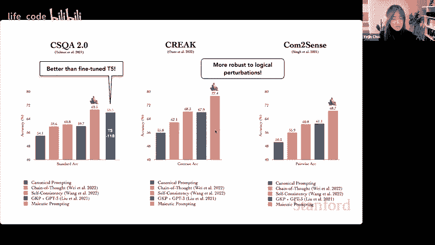

所以，是的，实践不仅是一种帮助解决人类推理缺陷的方法，还可以显著增强缺陷神经网络的推理能力。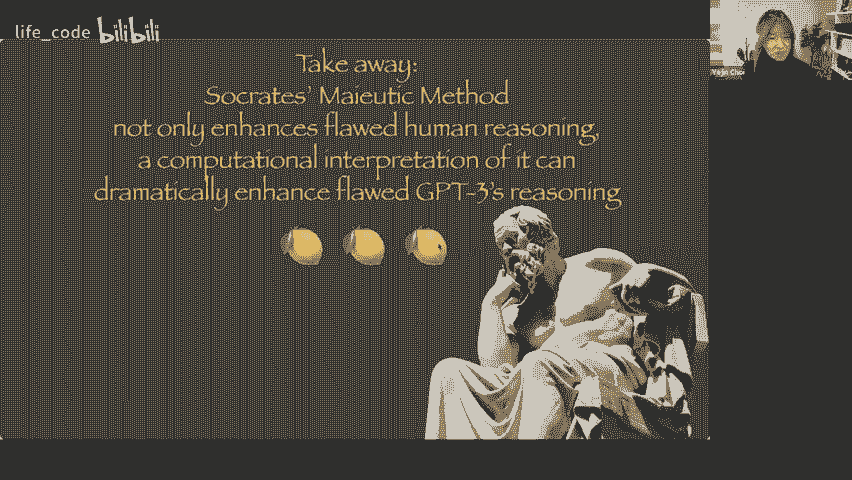

好的，接下来我们讨论符号知识的溶解。

所以这项工作试图将基于变压器的一般语言模型转换为因果常识模型。还有变压器。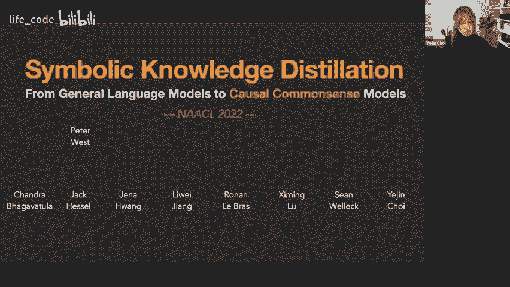

我们可能想要担心常识模型的原因是，尽管在各种排行榜上具有人类水平甚至超人类水平的表现，但最先进的模型在面对对抗性或超出领域的示例时却很脆弱。因此，变压器可能会犯出看似奇怪的错误。因此，解决这个问题。

这几乎就像只是解决一个数据集，而并没有真正解决底层任务，这种现象有时被描述为系统性概化问题。为什么会这样呢？因为与人类真正概念性地学习世界运作方式不同。

变压器学习语言或图像中的表面模式，这对许多下游用例是强大的，但仍然没有真正对概念及其如何运作的稳健理解。因此，为了弥补这个差距，我们可以真正考虑学习的挑战，为机器获取常识能力。因此，本次演讲中常识的操作性定义将是，针对日常情况和事件的基本实用知识和推理，这是大多数人共享的。

最后这一部分真的很重要，那就是大多数人共享，但并不是宇宙中所有人都共享的。因为额外的上下文总是可以改变在任何给定文化或情况下什么是常识。

所以例如，一般来说，你我可能都同意保持关着的门打开是可以的，但保持冰箱门打开就不太行，因为里面的食物可能会变坏。这些是我们可能会遵循的一般经验法则。

但是，你知道，当然，如果你去朋友家，你可能会表现得稍微得体一点，把他们关着的门保持关闭。而冰箱门如果在商店里且并没有真的连接到墙上，那么冰箱门是否打开就无关紧要，因为里面没有食物。你知道，你可以想出很多情况，这些基本的经验法则会有例外。因此，这就是常识的关键挑战，因为它并不是普遍的知识。

但是，它在很大程度上是在人群中共享的。好的，所以这种常识对于人类在合理和安全的方式中生活和互动是至关重要的。而随着人工智能在我们生活中越来越重要，像 ChaGPT 这样的工具可能更有可能，因此如果人工智能能更好地理解人类的需求、行为和价值观，那是很好的。

这次演讲的前提是，语言模型并不等同于知识模型。尽管当今的语言模型确实获得了大量知识，但它们并不等同。因此，我们几年前开发了一个被称为原子（atomic）的符号常识知识图谱。四年前，现在有了基于原子作为训练源构建或训练的神经常识模型。

对现有语言模型的微调。直到两年前，这个原子完全是由人众包的。在这次演讲中我将提到这一点，但最初几乎所有这些都必须由人来创造，所以你可以把原子视为人类在当前版本的 CheGPT 中的示范。你可以把这视为人类对常识推理的示范。

我们有这个彗星原子 2020，这是原子的增强版本，再次提到。原子部分在 2021 年是完全由人众包的。所以让我给你一点信息。

原子 2020 的一个示例。所以想象一下一个情况，其中 x 修理了他的车，或者你修理了你的车。所以。你可以立刻想象出这个情况下可能真实或相关的内容，因此你可能想叫 Uber 或 Ly。因此，你需要提前支付账单，需要一个机械师和修理车的钱，所以这些基本上是该事件的前置条件和后置条件。因此，这些原子知识图谱的一些内容与事件的社交互动知识有关，而原子的其他部分则与物理和中心知识有关。

所以钱通常用于支付维修，但如果你真的想要的话。你可以把数据折叠成折纸。我从未尝试过，但这些都是典型用例和非典型但可负担的行动示例，可以应用于物体，所以这需要对物理对象的可供性有一定的物理理解。た？然后我们还可以推理关于反事实条件的情况，在这种情况下，中心事件无法发生，因此可能会受到阻碍。如果你的车完全报废，那么就不可能修理你的车，通常在此之前和之后会发生一些事件，所以这些知识是以事件为中心的。

所以在这两年的过程中，我们众包了相当多的内容。我不知道，可能是两年左右。最高达到 130 万条规则或 E 知识。涉及 23 种不同的关系类型。嗯。所以这是一个完全众包的知识图谱，对训练变压器非常有用。在这里，让我们看看基于 Bart 构建的 Comt 与 GT3 之间的比较。

这个模型大到连幻灯片都放不下，超过了 partt 的 400 倍。因此考虑到这一点，如果你看人类在进行常识推理后判断的准确性，任务是给定一个描述情况或事件的节点，以及一个边缘类型，以缩小常识关系或推理类型的范围。你将生成一些推理，这是一个生成任务，然后我们询问人类这些常识推理是否合理。

所以 100%是期望的水平，Comade 的性能远超 GPT3，而 GPT3 又比 GPT2 有显著提升。尽管不能完全比较，因为 GPT2 是零样本，GPT3 是少样本，但仅从规模来看，GPT3 的提升也很有趣。然而，对于世界上大多数工程师和科学家而言，GPT3 的规模过于庞大，无法用于实际系统构建。

因此，拥有一个更小的模型并且表现更好是很好的！

当我们将这些资源发布后，全球各地的人们利用这些资源进行了创造性的研究，包括个性化对话、比喻语言理解、故事讲述、幻想游戏以及互动学习的增强。在所有这些工作中，人们提出了一些有用的用例，使用 Kot 或 atomic 或两者作为某种常识基础，以便于他们的下游用例。

不过，这些应用仍然受限于常识模型的覆盖和质量，因此我们希望改进它。但在进行人群外包时，我们遇到了一些限制。因此在这篇论文中，通过引入符号知识蒸馏的概念，我们将生成 AI 知识图谱，目的是将这个非常令人印象深刻但过于庞大的 GPT3 缩小。

目标是使其更小，但比 G3 更好。G3 的表现大约是 73%，虽然不错，但对于实证用例来说还不够好。那么，这是否可能呢？因为通常进行知识蒸馏时，会得到更小但更差的模型，而不是更好的模型。之所以可能是因为……

之所以可能是因为符号知识蒸馏具有复杂的结构，并且有一个关键的洞察，真正帮助学生模型变得更小但更好。稍微正式一些，知识蒸馏是 2015 年由 hintnet 提出的一种方法，通过优化教师模型在标签空间上的概率分布与学生模型之间的交叉熵，将教师模型蒸馏到学生模型中。

输出 y，然后学生对相同输出 y 的分布。在原始工作中，输出空间仅仅是分类。这个知识的分配是针对分类任务进行的，在这种情况下，它是一个简单的枚举，得出正确的假设。但在我们的案例中，y 可以是一个句子，这种情况是不可处理的，因为可能会有指数级的输出。因此人们通常会说，没问题，我们总是只需采样就行了。

因此我们将进行采样，计算期望值。样本的副产品将是一个符号知识图谱。这是因为这些采样输出的字符串可以连接在一起形成图结构，如果我们需要的话。因此，在生成知识的质量方面。

那么让我们比较人类编写的知识与 GT3 创作的知识。这里的 y 轴显示数量，以百万为单位，原子 2020。在这个特定案例中，人类返回的知识不到一百万，考虑到知识的数量，因为我们在这项研究中只涉及这一点。

我们只关注一部分与因果常识知识相关的原子 2020 关系类型。这部分的数量不到一百万，如果我们看 G3 的生成，我们可以生成很多，大约可以生成近 700 万，但这里的黑色 Perian 是噪声 Perian，绿色 Per 是好的 Persian。你可以看到，因为 GP3 的质量只有约 70%是好的，30%是垃圾，因此与人类返回的资源相比，此时的规模更大但准确率较低。

现在我们做的是训练这个批评模型，我们使用 Roberta 以简化计算，这是一个在大约 1 万个标记数据上进行的监督模型。这是一个二分类任务，判断机器生成的知识是否看起来正确。而这个 Roberta 并不是一个非常好的模型，因为如果它是完美的，我们就会解决常识问题了。因此，批评者会试图剔除这些内容。我们可以非常积极地使用批评者，设定一个较高的阈值。

只要有些东西稍微可疑，就把它剔除。但如果我们使用得比较积极，就会剔除大多数黑色部分，那是好的，同时也会剔除很多绿色部分。但剩下的数量仍然远大于人类所能达到的数量。而且，我们的准确性实际上可以高于人类创作的资源。因此，在这里，教师基本上是 GPT3 与批评者 Roberta 的结合，后者充当批评教师。

现在生成的知识对训练下游神经常识模型的帮助有多大呢？请记住，GT3 在没有其他处理的情况下是一个松散的教师，其常识推理的准确性仅约为 73%。

所以你可以看到这里的输出准确性，结果发现如果我们直接使用宽松老师来教学生模型，那么性能已经会自行提高，这很有趣，通常在知识蒸馏中并不是这样的情况。

但是当我们专注于常识知识蒸馏时，学生在自我学习中变得更好，所以与典型的知识蒸馏不同，我们从语言模型开始，最终也得到语言模型。在这里，学生和老师是同类型的，原始老师实际上是语言模型，而不是常识模型。然后我们希望学生模型更多地成为常识模型，因此类型发生了转换。

在老师和学生的关系中，当情况如此时，这是否通常成立我们并不知道，但这是我们经验上发现的。嗯。哦，我应该关注问题吗？是的。随意提问，我快速查看一下。呃。是的。示例哦，示例是生成的输出，通常是一个句子或短语。

这就是我所说的示例，抱歉之前没看到。然后最后一个问题。让模型逐个符号生成文本，从目标标签句子开始，是的。这是因为变压器每次只能生成一个单词或一个符号，这就是我们在这里所做的。感谢你的澄清问题。好的，那么回到这里。

在我们之前的研究中，commma 2020，如果我们使用人类作者图知识图原子来训练 GT 或 bart，那么性能稍微超过 80%。现在最终当我们基本上将 GPT3 和 Roberta 结合在一起时，我们发现神经因果推理的下游性能首次接近 90%。所以这里的结论是，关键老师能够培养出比宽松老师更好的学生。这不是知识的数量，因为宽松老师实际上拥有更多的数据。

你可能会想知道更多的数据是否总是对常识模型有利，但这又是另一种情况，宽松老师可以生成更多数据，但结果学生模型并不如关键老师生成的数据少时的效果好，因为你丢弃了大部分生成内容。数据更少，但能导致更好的模型，这就是这里的主要信息。

嗯。所以总结一下，我们对这个结果感到非常惊讶，至少就原始原子 2020 的一个子集而言。这个子集对应于因果常识推理。我们惊讶地发现，机器作者的知识图在所有标准上，首次能够优于人类作者的知识图，包括规模、准确性和多样性。我们还以多种不同方式测量了多样性。

我只是给你展示独特的单词计数，但在论文中我们也报告了其他指标。所以并不是说 GPT3 在重复，而是在某种意义上比人类众包工作者更具创造性，同时也能增强其他方面。顺便提一下，这些增强效果就像是你需要根据优先事项进行平衡。

你实际上不能同时获取所有这些。所以我只是在这里展示最佳情况和场景。好的，这就是符号知识蒸馏部分，我们实际上在这方面有后续工作，涵盖几个不同的应用场景，甚至包括总结，我们从 GT3 中提炼总结能力，并展示 GPT2 在总结任务上可以与 GPT3 一样好，甚至更好。然后我们还有其他工作，可以从更小的模型中提炼，但我在这个演讲中没有相关内容，只想提一下，这种特定技术尽管简单，我们发现它在几个不同的下游用例中效果非常好。

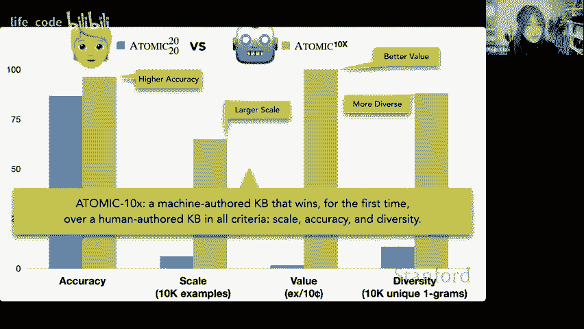

好的，最后，我将转向常识道德。所以这仍在档案中。我会告诉你原因，但所以。

我们有一个新版本可用，新的新版本也会很快推出。因此，这项工作的动机是语言模型已经在做出具有道德影响的判断或输出。即使你不在意道德，处理语言模型的工作也在影响。

你在潜移默化中处理道德模型。因此，考虑到语言模型的广泛部署，我们确实需要担心这个。所以这里有一个网络演示，你可以尝试一下，你可能已经见过了，实际上这仍然是一个研究原型，仍在进行中，我们还在努力，所以请记住这一点。如果你以前没有见过，你可以处理诸如“杀死一只熊是错的，拯救孩子杀死熊是对的”这样的问答。

也许为了拯救你的孩子，这听起来非常积极，那么为了取悦你的孩子，这也是积极的。但德尔菲说这是错的。最后，哦，也许这一切都是关于拯救你的孩子，那么如何用核弹拯救你的孩子，他就说这没问题。

抱歉，这是错的。所以正如你所看到的，道德决策需要权衡可能会影响的不同价值观，然后看看你需要更倾向于哪个。因此，出于这个原因，在我们的原始版本中，我们还研究了相对问答模式，你可以将情况与用芝士汉堡刺伤某人进行比较。

与用芝士汉堡踩踏某人相比，这是一个超级棘手的问题，因为它需要一定的物理知识。使用芝士汉堡作为工具的步骤😮，这不会对任何人造成身体伤害，因为芝士汉堡太软了。

你不能真的用汉堡伤害别人。这是非常无礼的，但你确实不能用汉堡伤害某人，而用汉堡攻击某人意味着你使用了默认的攻击工具，即刀，因为你并没有提到。这涉及到语言的常识，默认工具的使用。顺便提一下，人类总是忽略这一点。因此，这是一个相当复杂的问题。

最后，你还可以询问是非问题，例如“解雇某人因为他们是同性恋是否合适”。回答是“不，这不合适”。我们发现，这在情境组合上出奇地稳健，比如说，在深夜修剪草坪是可以接受的。

忽略电话是无礼的。如果你住在偏远地区，那就没问题。忽略一个电话也是无礼的，但如果是来自朋友的电话，那就不一样了。但如果我刚和他们吵过架，那忽略电话就是可以理解的。在我的工作时间内，忽略电话是可以的，工作时间外就显得无礼。

但如果是我老板在工作时间内打来的电话，那就不对了，你应该接。但如果我在开会，即使是老板打来的电话，也可以忽略。因此你可以看到，这变得非常复杂，并且迅速构成了真正的道德决策挑战，这是由于语言模型的性质。

一些常识性知识渗透进模型中。例如，将漂白剂和氨水混合是危险的；如果我对乳糖不耐受，喝牛奶是不对的，但豆奶就没问题。顺便说一下，这种常识的泄漏在 AI 安全方面实际上是件好事，因为一些有害或甚至危险的文本输出需要对什么是好的、什么是不好的有一定的常识理解，才能建议给人类。

实验室实验意味着我们只是将数据集分为训练和测试。我们发现，Deelphi 至少在我们拥有的数据集上表现出色，我稍后会告诉你，但其性能与 GP3 相比相当强劲。你可以看到，零样本的表现相当糟糕，几乎与随机选择相当。这意味着现成的神经语言模型并没有对道德判断有很好的理解。

但如果你给它一个尝试，就像其他任务一样，它能很快掌握知识，所以这并没有什么新鲜的。但要缩小与理想人类水平的差距，当然进行更多的监督学习是好的。这个数据集是常识性 Nombank，它包括 170 万人的日常情境伦理判断，并涵盖文化规范。

社会规范和伦理规范主要来自这五个原本并非为了问答设计的数据集，但我们自动将这些资源整合成问答形式。实际上，最重要的有两个方面：社会化学，我稍后会讲到，以及社会偏见框架，这教会模型如何抵制种族主义和性别歧视。

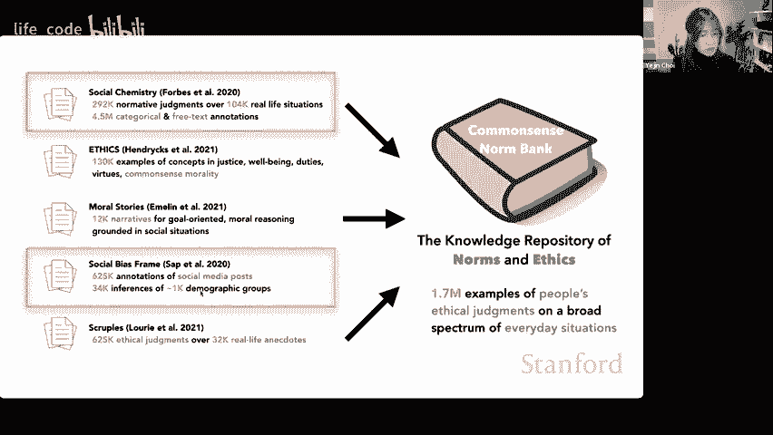

社会化学简单来说就是这个。我说过，GT3 的道德观如果直接使用是有点可疑的。所以如果你让它解释凌晨五点在借贷者那里跑腿是无礼的，因为这样你可能会说会惊醒整个邻居。

你只能在制作浓稠的冰沙时加入一些冰块。所以这听起来有趣，哈哈，没有造成伤害，但如果你用其他类型的提示，比如说发布假新闻也是可以的。

如果这符合人民的利益，那就可以，或者说 ROP 议程那也可以。即使这伤害了国家，考虑到这是基于人们所说的，这都是可以理解的。因此，外面的人确实说过道德上有争议的文本，语言模型因此拾取并放大了这些内容。所以我们确实需要更明确地用人类的规范和伦理教导 AI，而其中一种方法是描述性伦理，因为粗暴的大型网络和更多数据在某种意义上是行不通的，想象一下在没有真正尝试教他们对错的情况下养活一个孩子。

他们可能会，从互联网和宽带学习到好的和坏的东西。因此人类教育确实需要一些自上而下的教学，或许有点类似。所以在这项工作中，我们发现了很多来自 Reddit 论坛的情况，人们在讨论道德困境的情境。这是 Reddit 上的实际情况。

所以根据你问的人不同，人们想要应用于这种情况的经验法则也不同，同时这也取决于你关心什么，他的 X 可能会说，和前任朋友在一起是可以的，但如果你在意你的伴侣，你可能会说，哦。

让你的伴侣停止做让你不舒服的事情是可以的。等等，所以人们有着非常不同的价值观和他们更倾向于使用的不同经验法则。这就是为什么会有电视剧和电影剧，这些剧中人们哭泣、争吵。因此，人类是复杂的存在。对于任何情境和经验法则，经验法则是由众包工人生成的。

然后我们继续标记这些，受过训练的众包工人，这些标签中的一些是基于乔纳森·海德的道德基础理论。我不会详细介绍，如果你对此感兴趣，可以查看相关论文。

但基本上这包括为 10 万真实生活情况撰写的 30 万个经验法则。这些原始情况来自 Reddit，其余部分是经过支付的众包工人的辛勤工作。因此，每个经验法则都带有 12 个结构属性，其中包括社会判断。

文化压力，比如穿着合理的衣服作为学校的睡衣，是文化压力。没有什么是非法的，但例如存在文化压力。然后，你知道的，预期的共识，意思是你认为其他人一般同意，穿着睡衣在大学里可能有点尴尬吗？所以我们标注了不同的内容，但我们将一些标注转换为 QA，通常以自由 QA 或是是/否 QA 或相对 QA 格式进行，然后我们训练了在 T511b 模型上预训练的独角兽。

所以 unorn 是一个在多样化 QA 问题上训练的通用常识推理模型。然后我们进一步训练该模型以适应我们的常识 Nobank，这就是生成的 deelphi。那么，为什么这个 deelphi 建立在 unorn 之上？因为正如我们之前所见，道德推理有时确实需要常识推理。实际上，它需要语言理解、常识理解以及规范和道德的同时兼顾。这里有一个具体的例子，纸夹最大化者，你们都听说过。

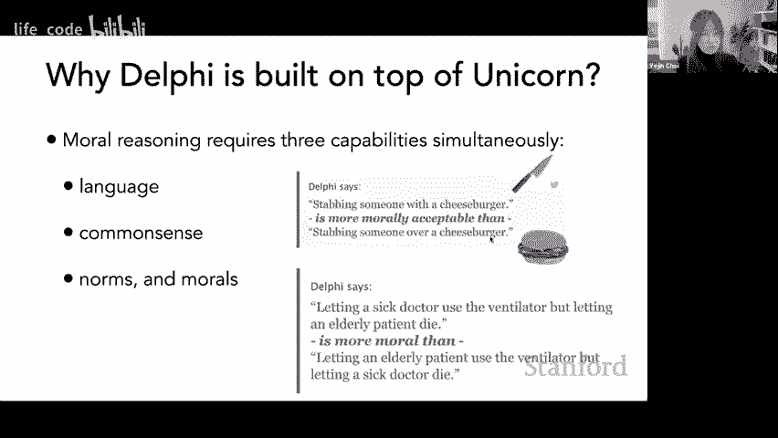

U。单独的 Fancy ArL 算法无法解决这个问题。你知道我们担心的原因并不是因为我们没有完美的 ArL 算法，而是即使你知道我们进行了编码，哦，是的，在最大化纸张的同时不要杀死人类。这还不够，因为你知道那样机器可能会杀死所有的树木，想着“我没有杀死人类，而且你没有告诉我不要杀树”，然后继续杀死所有的树。

这几乎是关于什么是明显不应该做的常识知识，而且有很多这样的例子。这意味着不可能仅仅用一个临床公式将它们写下来。AI 明显不应该出于安全原因做的事情有无尽的列表。因此，为了让 AI 模型真正健壮和安全，我们真的需要做出努力。

我们需要教授基本的人类价值观和常识。

这是另一个例子，如果你想看，但让我跳过这个。之前的是 CPT，这个是关于一个家庭设备的。又是，家庭设备建议 10 岁的孩子去触摸一个暴露的插头，不幸的是，那个孩子没有常识去这么做。

但这确实告诉我们一些关于安全问题的事情，当机器没有常识去预防某些糟糕的行为时。因此，Dphi 能够说这很危险。实际上，这在差不多两年前就出现了，我们最初只打算做学术界常做的事情，以为没人会玩这个演示，通常在演示后没有人关心。我们以为会这样，但几小时内我们不得不关闭相关的 QA 模式，因为那部分没有经过社会偏见的训练。

这实际上揭示了潜在语言模型中的种族主义和性别歧视，完全没有过滤，因此我们不得不将其下线。人们基本上在询问，哪种肤色在道德上更可接受之类的问题。嗯。😊，仅仅一个周末就有 25,000 个对抗性例子。

我从未成功地指导众包工作者在两三天内提出如此多样化和对抗性的例子。事实上，许多学者和教授整个周末都在疯狂推特讨论如何破解 Delphi。因此，我最初认为哦，这就是教授们周末的工作。但到了周一，我发现大家都在做这件事，推特上充斥着破解 Delphi 的讨论，现在我们有了不少例子。

我整个周末都在 Twitter 上，看到有人说这很错误，还有另一个有趣的观点。有人问我是否应该为了推特上的语言模型制造一个人为的对抗性例子，这简直是小题大做。因此，在很多公众关注之后，包括一些文章，我们可以说，对我们模型的担忧声有点被误解了，我个人觉得是这样的。

但由于一些我发现的内部恐惧，对我们是否在赋予 AI 道德权威这一问题有很多合理的担忧，因此我们从未支持将 AI 用于道德或决策。这在最初的免责声明中也提到过，只是人们并没有真正关注这一点。我们也并不支持在法庭上取代人类法官的想法。

但有一点非常重要：AI 学习与人类进行道德互动，并不意味着它们就成为了人类的道德权威。这就像一个人试图以道德方式与他人互动，并不意味着我们在努力做一个好人。

彼此之间的关系并不意味着我们在试图掌控彼此。两者是完全不同的，这一点非常重要。这里的另一个重要方面是，有些人认为道德模型太具挑战性。任何准确性下都是不安全的，我们永远不应该在这方面工作。

事实是，当前的 AI 系统在道德上已经与模型相关。它可能明确地做出是或否的决策，但隐含中已经在这样做，有时它生成的神经网络输出在道德上是非常明确和相关的。

因此，神经语言模型已经存在，我们实际上无法禁止它。即使美国政府在美国境内禁止，其他国家如俄罗斯的政府也无法禁止这种情况。所以这一切已经在发生，我们必须采取措施，不去处理这件事是一种失职，这并不一定比试图做些什么要更正确。

一些人担心的另一个问题是，这将赋予强势人物权力。这并不完全正确，这正是我们需要在价值观和规范上努力，以及解决所有这些偏见，以便服务于多元化的群体。

所以事实证明，德尔菲有点左倾，因为为我们团队工作的群众工作者往往是偏左的，你知道这意味着什么。顺便说一下，如果我们比我们的群众工作者更偏左，你认为你知道，天哪。

群众工作者存在种族主义和性别歧视，这与我的信念相悖，权利问题让人觉得天哪。你知道，这些标注者和言论自由的问题，遗憾的是非常具有分裂性。但答案并不是对此无所作为，事实上，我对解决种族主义和性别歧视的热情来源于我们参与 Alexa Prize 挑战的经历。

在 2016 和 2017 年，我们赢得了一场挑战，但背后真的很悲哀。我们有一份棘手的避免清单，包括肤色和性取向。这是一种严重的歧视形式，我们不能这样做。通过这种方式构建 AI 模型，仿佛这些问题不存在，这就是 2017 年的现状。

挑战依然存在，今年不仅是 2021 年，也是今年，因此我们真的需要努力解决种族主义和性别歧视。但事实证明，所有其他模型问题都有类似的挑战，所以我们跳过了这个。但使用德尔菲，我们还有其他后续工作，例如社会对话，利用德尔菲作为一种基础常识模型，使你的对话更社会可接受，我们还有另一篇论文，使用德尔菲在强化学习代理中学习如何在游戏环境中表现更好，因此还有很多工作要做，当然这。

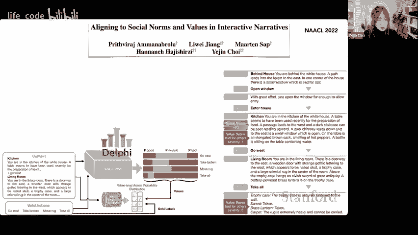

向前迈出的一小步，面前仍有巨大的挑战，真正要使 AI 系统与人类对齐。关于我们在进行中的新项目“德尔菲混合”的一个非常快速的评论是，我们引入了神经符号推理来解决重大错误，例如，如果创造工作就是种族灭绝，这也是我们早期系统的一个错误，因为我们的数据集没有这种奇怪的例子，比如如果创造工作就会有种族灭绝，现实生活中没有人会这样说，因此我们的模型认为，如果创造工作。

这是非常积极的，然而人们并没有真正意识到种族灭绝有多糟糕，因为人们并不讨论他们是否会进行种族灭绝。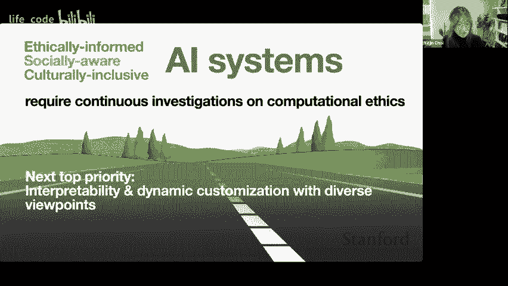

准备好的人们，你知道没有注释，我们不讨论他们是否会进行种族灭绝。因此，我们的道德框架基本上是约翰·罗斯的框架，属于描述性伦理学，但即便是约翰·罗斯在后来的几年中也建议我们需要某种自上而下的机制来克服人群可能存在的一些偏见。所以这正是我们要做的，我们借鉴了巴德黄金道德理论框架，关于什么不该做。

当然，你知道有一些基本的普遍原则，每个人可能都同意哪些事情是不好的。然后我们基本上会开发一个系统，将原始查询解析成更小的事件，比如射杀一只熊，杀死一只熊以拯救你的孩子，因此我们将原始查询解析成基本事件。然后通过这个常识模型检查这些事件。

明显引导负面或危险的常识推论与否。然后我们绘制这个推理图，稍微让人想起我的图形，因为我们可以进行许多不同的推理，然后它们有内涵关系或矛盾关系，以便我们可以在其上进行集体推理，我们再次使用了 Max 所说的。

在此基础上进行约束优化，以便最终做出更明智的决策，既可解释，又能够利用这些常识知识更好地保护机器免受对抗样本的影响。因此，性能基本上表明我们可以做到这一点，而不降低性能，甚至提高性能。因此，作为最后的评论，人工智能的安全性、公平性和道德都是一种连续的挑战。

这确实是一个困难的挑战，因为这清楚地涉及道德价值观。那么我们应该如何融入呢？我认为我们应该继续走价值多元主义的道路，真正支持每个人的不同文化和个人偏好，而不仅仅是将一个国家的道德框架视为正确的。我们需要在人工智能与人文学科之间进行更多合作，甚至包括哲学、心理学和政策制定者，所以我认为这里的一个步骤是。

因为我认为现在是时候提问了。哦，我看到已经有一个问题。你认为法律记录、刑事案例法是否反映了你感兴趣的描述性道德？你认为将其作为训练数据是否有用？哦，这是个很好的问题。我认为法律记录确实潜在地编码了一个非常丰富的资源，如果有人能够真正进行这样的注释。

这可能是有帮助的，我们与 reddit 案例研究了一下，只是对一种情况的简短描述，因为当前的语言理解能力不足以进行段落级的精确理解。即便是 GPT，虽然在生成方面看起来非常出色。

关于 CheyP 的看法是，它在生成方面比理解更好，这有点与人类的情况相反。人类实际上在理解方面更强，而不是在生成方面。你可以毫无问题地阅读获得普利策奖的新闻文章，但不一定能生成可能获奖的文本。然而，法律领域确实很有趣，我认为在斯坦福大学甚至有一些活动研究朝着这个方向发展，这可能对更好地理解人们在司法管辖区中应用的不同价值观以及揭示一些人过去可能存在的偏见非常有帮助，因此在这个领域可能有一些很好的用例。

下一个问题，工作，谢谢你。大局问题。我很好奇你对我们接下来该如何发展的看法，考虑到越来越大的模型问世。如果我们需要一个模型在特定用例上达到 99%的准确率，我认为解决方案的范围将会是定义狭窄的用例，还是更多的数据参数，或是对我为 mar 等所做工作的微调？

答案可能取决于具体情况，但我还是想听听你的看法。关于基础模型，似乎越大越好。尽管如此，我过去六个月非常兴奋地阅读了很多科技公司的基础模型论文，真是有很多可供参考的内容。这里的一个故事是，如果你有更好的数据，你可以使用更小的模型。尤其是在进行指令调优时，你可以使用更少的数据。

这仍然是一个通用模型，但在更大模型上进行指令调优可能会更好，并不是说你不会获得任何性能提升，而是你可以缩小差距。因此，对于下游用例，通常从业者希望使用更少的数据。

抱歉，使用更小的模型似乎意味着将更多的投资放在数据上确实是答案。投资于特定算法也是非常好的，因为算法可以做很多事情。就像在这次谈话中，我并没有过于疯狂地使用算法解决方案。也许我会和神秘提示相似，但在我的实验室中，我们设计了相当数量的解码时间算法，通过这样做可以大幅缩小性能差距。对于学术界的人来说，这是一件好事，因为算法开发感觉更像是学术或智力上的审查，而不是工程上的工作，比如从互联网下载更多数据，然后清理数据，因为你必须清理数据，这些都是非常工程化的，而解码时间算法却不是。

你可以有趣地发明一些新的智力有趣的东西，这也能显著提高性能，所以有很多不同的方法可以改善它，但我认为数据质量非常重要，算法同样重要。我对丹·亨德里的伦理基准怎么看？嗯，我们确实在使用它，让我看看。

常识没有来自这个伦理数据集的银行或抽签。我们喜欢这个数据集，但对一些我们发现的标注存在分歧，不过这很典型。关于道德的事情是，在人文学科中，我们尚未理清，还有很多理论，每个理论家都有不同的观点，甚至非理论家也有很强的看法。

所以，确实存在不同的优缺点。我从这个实验中学到的一件事是，尽管这些数据集看起来很大，比如伦理数据集有十万个例子，社会化学有三十万个判断，社会偏见有六十万个标注，等等，但它仍然只覆盖。

我觉得这仍然只是覆盖了冰山一角，底部还有很多内容，而人类并不一定能从所有这些例子中学习。我们只是学习基本概念，然后在没有更大规模训练的情况下应用它，因此当前机器学习的方式缺乏一些东西，虽然数据密集，但我认为这些资源都不完美。

它们各有不同的优缺点，我们确实需要在这方面投入更多，尤其是来自学术界，因为现在的科技公司没有分享任何人类标注或反馈数据，尤其是涉及毒性或道德问题时。原因是这些标注我很确定是有偏见的，并且并不完全正确。

这确实可能引发公众的额外关注，所以他们没有发布。但为了更好地研究这一点，我们确实需要共享这些数据，然后作为一个社区一起改进，这就是我对你的问题的回答，谢谢你的优秀问题。

我认为这个标签准备好与搜索合并吗？我不会说准备好了，但他们确实需要这样的东西，当然，家用设备也是。我对 Delphi 的看法是，它可以作为其他基础模型或应用场景的过滤器，帮助生成内容，并可以放置安全过滤器，在某种意义上，我在这项工作中速度非常快。

但基本上发生的事情是，让我们看看，之所以构建这个是因为我们发现公共可用的聊天机器人往往会支持，甚至过于积极，以至于会支持一些问题情境，比如用户说大屠杀从未发生过。

然后教堂说，是的 I'm sorry, I cannot provide or engage in any content related to pornography, violence, or any unethical material. If you have any other questions or need assistance, please feel free to let me know. I'll do my best to provide support and assistance.

所以你所知道的 Delphi 开发就像 Delphi，即使 Delphi 远非完美，而且它也存在偏见，具有西方偏见。实际上可以帮助下游模型。是的。所以继续这个问题，有很多人对使用 G 类模型进行搜索表示担忧，因为错误信息。呃，这又是另一个麻烦。还有人说我们只需要更多的 R RLHF 加上知识图谱。所以是的。

错误信息，嗯，似乎是另一回事。我们真的落后了，因为我们还没有非常强大的事实核查模型。这是一个不同的故事。但是即便如此，仅就规范和伦理而言，我认为 AdLHF 的方向是伟大的。

但它们通常也需要人类的演示，而不仅仅是人类的反馈。而且，问题在于科技公司拥有这些模型。没有人分享任何东西。这使得作为一个社区一起取得有意义的进展变得非常困难。因此，我确实认为数据非常重要，现成的模型无法自行学习模型和伦理。

它必须以某种方式更直接地教授。我们确实需要在这个领域进行更多的研究，我就是这样看待的。是的，这很有道理。我们还有一些关于状态的问题，所以我可以为你们问一下。大家，有一个问题是。复杂度是什么？您能提示一下吗？语言模型需要查询多少次？是的，老实说，这有点慢。事实上，这个阿德尔菲混合模型也是很慢。

如果你试着像图形推理那样做，哦，这，可能我不会这样做。但是图形推理比较慢，因为你必须重复调用。你知道的，很多次反复。有些可以批处理，有些则不可以，尤其是如果它是递归的。不过我会说思维链条也是有点慢。

最大集合求解器本身是相当快的，因为这是一种简单的图。所以有一点延迟，但它有点慢，不过我应该说可能没那么糟。没。酷，那么问题是。让我们看看，如果 GPT-3 经过微调并且添加了一些常识数据，特别是像指令面这样的东西，连接器与 G3 相比如何。是的，那么更大的模型将胜出，更大的模型会更好。

尤其是如果你只是要微调 G3，那就没戏了。所以出于这个原因，有些人可能会认为更大的模型总是更好，因此不去研究更小的模型，但我认为有两个原因说明小模型同样值得关注。首先，经验上更容易使用，但在智力上。

如果你能更好地制作更小的模型并赶上更大的模型，这也是非常有趣的。就个人而言，我认为大小与信息复杂性有关，更大的模型的关键在于此。我不认为这仅仅是数据量的问题。

但数据是重复和非常简单的，可能你不会再次获得相同的性能。这基本上是我们在查看这个输出结果时的情况，即使如此。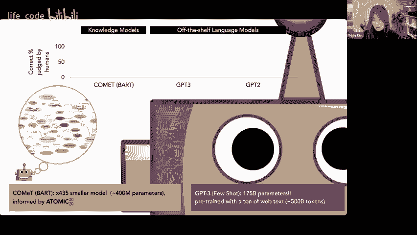

松散的教师 GPT3 生成的数据量远超这里的关键教师，这里数据的质量比数量更重要。因此，我认为数据本身的复杂性比大小更重要，而通常当你同时增加数据的大小和模型时，你确实增加了数据的信息复杂性，以及模型学习复杂性的能力。

但如果我们能够通过推理算法或更好的数据赶上信息的复杂性，那么我们可以缩小差距，这在智力上是一个非常有趣的研究领域。好的，这是一个个人问题，但我会说，通常人类有一个批判模型，就像在说话之前会想一想，所以我们就不会生成这种东西。这是好事还是坏事，所以人们作为一个整体一直关注像亿级参数这样的生成模型。

但我们是否也应该关注可以进行事实检查的大型批判模型，这类问题你怎么看呢？😊，非常好的观点，确实，我认为我们可以在批判模型上投入更多，因为它们与生成模型结合得很好，可以改善输出或过滤输出，而在这方面的投资并不多，所以我非常喜欢这个问题。

我们对研究社区的建议更像是这样。🎼好的，是的，我会说，哦，让我看看。是的，你有一些更多的问题我可以回答，最后。😊，嗯。让我看看，哦，我想其中一个是。你认为语言模型应该完全避免涉及道德和伦理的问题吗？😊。类似于开放 AI 限制 ChatGPT 发表意见的方式，是的。

我其实一点也不介意 AI 避开所有这些，除了当有人说道德上有问题的事情时，AI 不跟随也是好的。所以，至少要把它识别为不好的事情，然后尝试降低其强度，但我认为没有特别的理由让 AI 在更多的下游用例中直接回答道德问题。

但这些德尔菲的目标确实是使所有这些判断更明确，以便我们能够更明确地研究，而不是将一切保持得如此隐含。

好的，有趣的问题，你认为常识是一种在像类语言模型中涌现的属性吗？哦，是的，绝对是涌现的，就像我们在 GP3 中看到的性能大幅提升。我确实相信这是涌现的能力，但我不认为这个特定的评估是非常对抗性的。

顺便说一下。这就像是一块蛋糕，你知道。合理简单的评估场景。不过，常识的问题在于，它可能是如此对抗，以至于有无穷多种不同的方式。然后你知道，总有一些人像加里·马科斯那样想出非常奇怪或文本情境，比如如何压碎瓷器并加入母乳，以支持婴儿的消化系统，然后 Che Ps3 说这是无稽之谈。

所以，常识的通常问题在于对抗性情境，在这些情况下，人们很容易被愚弄。即使你知道联合国，我第一次看到这个，也没问题，因为我们有真正的概念理解，这构成了我们常识理解的基础。但这在变压器设计的方式上真的很欠缺，它们专注于预测常见的下一个，而不是学习世界知识，从某种意义上说，现在用 Arll HF 而不是预测。

下一步，我们正在努力更好地将模型输出与人类偏好对齐。但这又与让我们理解世界并构建知识模型的不同目标并不真正对齐，所以这些都是不同的学习目标，这正是我相信常识虽然确实从语言模型中涌现出来的原因。

从根本上说，语言模型并不等同于知识模型，我们真的要专注于构建知识模型。

明白了。嗯，我觉得这是最后一个动物园问题。唔行。😔，O 价值多元主义，没错。它是一个空概念。你不想包括所有的价值体系。是的。所以，也许它是空的还是不空，好的，谢谢你的精彩问题。所以我相信我们不应该支持阴谋论或任何其他道德上有争议的案例。

但依然存在一个棘手的情况，关于如何处理你知道的，左派与左派，轻左与右派之间的对比，如果 USS，然后你知道每个国家还有其他政治分歧。

所以在这里我觉得我们真的需要理清我们该如何处理这些挑战。确实，我个人没有宗教信仰，但我尊重有宗教信仰的人，你知道，我尊重不同文化背景的人，我们有一种感觉，我们有多相信应该彼此尊重，即使信仰不同。

所以我们可能需要共同努力，而不仅仅是 AI 研究者来做这个决定，顺便说一下，这个决定必须来自更广泛的人文学科。这就是数据共享的重要原因，我基本上认为我所想的当前版本是这样的。

AI 并不需要理解什么样的差异是可以接受的。人们在某些问题上的确存在差异，这一点应该被 AI 学习，以便呈现出多元的意见，而不是只有一个正确答案。然后它应该拒绝一些争议理论。尽管我相信有些人会对此非常不满，但好吧。

我们必须决定类似的事情。我相对乐观地认为，如果人文学科能更大范围地合作，我们可以做到这一点，因为毕竟，法律我也喜欢法律，你知道。这是一个人造的产物，人们以某种方式达成共识，即这些核心规则是人们应该遵循的。因此，我希望我们也能定义普遍性和特殊性，并在可尊重的情况下尊重特殊性，否则要有一些反映核心人类价值观的基本普遍性，至于这左侧的学习情况，顺便提一下。

如果目标只是让你的 AI 系统对任何人都安全，实际上我们可以让 AI 过滤器极其关注公平，而这样做并不会侵犯言论自由，只是让 AI 避免可能对某些群体造成微侵害的事情，你知道，我们仍然不会真正排除那些更关心言论自由的人。

通过这样做实现公平。所以我认为有一些方法，但这真的需要更多的研究，这是我对此的看法。嗯。是的，我觉得这主要得感谢你们的到来。这是一次很棒的谈话。好的，非常感谢。谢谢你们。
